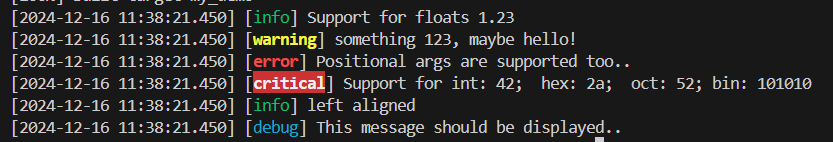
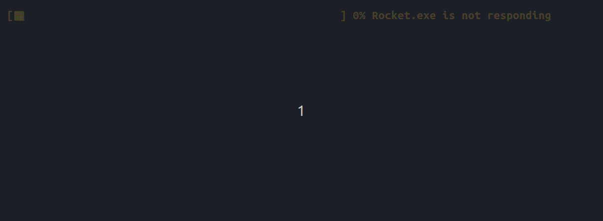

注意参考==各类库的编译.md== 

这篇[文章](https://zhuanlan.zhihu.com/p/651936903)对整体的库有一个整理，有需求时可以去参考一下。

## 01. fmt 让输出带格式的库

​	[fmt](https://github.com/fmtlib/fmt)是一个c++格式化的库，挺好用的，也比较简单，源码下载下来，轻松就能编译出来，然后在测试时，直接用cmake中的find_package没搞定，就直接添加的搜索路径：
CMakeLists.txt：

```cmake
cmake_minimum_required(VERSION 3.1)
project(demo)
set(CMAKE_BUILD_TYPE Release)

include_directories(/opt/fmt-9.0.0/include)
link_directories(/opt/fmt-9.0.0/lib64)

add_executable(demo main.cpp)
target_link_libraries(demo fmt)
```

demo.cpp：（这个在它的官网里也是有的）

```c++
#include <string>
#include <vector>
#include <fmt/core.h>
#include <fmt/chrono.h>
#include <fmt/ranges.h>
#include <fmt/color.h>

int main() {
	fmt::print("hello world\n");

	std::string s = fmt::format("The answer is {}.\n", 42);
	fmt::print(s);

	// 1.格式化时间
	using namespace std::literals::chrono_literals;
	fmt::print("Default format: {} {} \n", 42s, 100ms);
	fmt::print("strftime-like format: {:%H:%M:%S}\n", 3h + 15min + 30s);

	// 2.直接打印vector
	std::vector<int> v = { 1, 2, 3 };
	fmt::print("{}\n", v);
    
    // 
    fmt::print("Hello, {}!", "world");  // 类 Python 的语法风格
	fmt::printf("Hello, %s!", "world"); 

	// 3.带颜色、格式的输出
	fmt::print(fg(fmt::color::crimson) | fmt::emphasis::bold,
		"Hello, {}!\n", "world");
	fmt::print(fg(fmt::color::floral_white) | bg(fmt::color::slate_gray) |
		fmt::emphasis::underline, "Hello, {}!\n", "мир");
	fmt::print(fg(fmt::color::steel_blue) | fmt::emphasis::italic,
		"Hello, {}!\n", "世界");

	return 0;
}
```

## 02. Eigen 矩阵运算

gitlab[开源地址](https://gitlab.com/libeigen/eigen)。到这个[页面](https://eigen.tuxfamily.org/index.php?title=Main_Page)去下载一个版本。

使用方式：

- 方式一：它是头文件类型的，添加头文件路径就可以直接使用了。
  windows上，直接把.zip压缩包解压放一个地方，比如为D:\lib\eigen-3.4.0，
  然后直接在C/C++->常规->附加包含目录 把上面的路径添加进去就好了

- 方式二：make && make install 的方式
  
> git clone https://gitlab.com/libeigen/eigen --branch 3.4
  >
  > mkdir eigen_build  && cd eigen_build
  >
  > cmake -DCUDA_TOOLKIT_ROOT_DIR=/usr/local/cuda/ .. 
  >
  > make && make install    # 这是安装在系统默认位置，这个库就默认位置用吧，版本影响不会太大，就用3.4最新的。

  注：cmake时这样指定使用cuda，才比较好，主要是在编译三维重建项目“openMVS”时，没这样指定，make编译出了很多问题，比如这样“no suitable constructor exists to convert from "float" to "Eigen::half"”的错误，像上面指定了cuda路径的才不报错。

常用头文件：它一些矩阵常用性质和方法，[看这](https://zhuanlan.zhihu.com/p/414383770)。

| Module      | Header file                  | Contents                                               |
| ----------- | ---------------------------- | ------------------------------------------------------ |
| Core        | #include <Eigen/Core>        | Matrix和Array类，基础的线性代数运算和数组操作          |
| Geometry    | #include <Eigen/Geometry>    | 旋转、平移、缩放、2维和3维的各种变换                   |
| LU          | #include <Eigen/LU>          | 求逆，行列式，LU分解                                   |
| Cholesky    | #include <Eigen/Cholesky>    | 豪斯霍尔德变换，用于线性代数运算                       |
| SVD         | #include <Eigen/SVD>         | SVD分解                                                |
| QR          | #include <Eigen/QR>          | QR分解                                                 |
| Eigenvalues | #include <Eigen/Eigenvalues> | 特征值，特诊向量分解                                   |
| Sparse      | #include <Eigen/Spare>       | 稀疏矩阵的存储和一些基本的线性运算                     |
| 稠密矩阵    | #include <Eigen/Dense>       | 包含了Core/Geometry/LU/Cholesky/SVDIQR/Eigenvalues模块 |
| 矩阵        | #include <Eigen/Eigen>       | 包含了Dense和Sparse（整合库）                          |

使用demo：

- 初始化一个单位矩阵：Eigen::Matrix4f matrix = Eigen::Matrix4f::Identity();

```c++
#include <iostream>
#include <cmath>
#include <Eigen/Core>
/*
官方的关于vector和matrix的文档：
https://eigen.tuxfamily.org/dox/group__TutorialMatrixArithmetic.html
*/
int main() {
	//std::cout << std::sin(30.0 / 180.0*acos(-1)) << std::endl;
	//Eigen::Vector3f v(1.0f, 2.0f, 3.0f);
	
	//Eigen::Matrix3f i, j;
	//i << 1.0, 2.0, 3.0, 4.0, 5.0, 6.0, 7.0, 8.0, 9.0;   // 注意只能这种初始化方式
	//j << 2.0, 3.0, 1.0, 4.0, 6.0, 5.0, 9.0, 7.0, 8.0;
	// 或者 MatrixXf a(2,3); a << 1, 2, 3, 4, 5, 6;

	// 题：将点p逆时针旋转45°
	Eigen::Vector3f p(2.0f, 1.0f, 1.0f);  // 默认打印出来形式是列向量，但运算时还是看作1行2列

	// 逆时针旋转45°
	float angle = 45.f / 180.f * std::acos(-1);  // std::acos(-1)为π，这是三角函数必须给弧度制
	// 方式一：原理 https://blog.csdn.net/whocarea/article/details/85706464
	Eigen::Vector2f out;
	out[0] = p[0] * std::cos(angle) - p[1] * std::sin(angle);
	out[1] = p[0] * std::sin(angle) + p[1] * std::cos(angle);
	std::cout << out << std::endl;

	// 方式二：其实是一样的，就是将上面操作弄成了一个矩阵  (这个额外加了一点，使用了齐次坐标)
	Eigen::Matrix3f mat;
	mat << std::cos(angle), -std::sin(angle), 1.f, std::sin(angle), std::cos(angle), 2.f, 0.f, 0.f, 1.f;
	std::cout << mat * p << std::endl;  // 这顺序不能变，就是对上面列向量使用的的进一步说明
}
```

上面是直接按照固定的把旋转矩阵写出来，不好写，按照下面这样来：**平移、缩放、旋转**

```c++
#include <iostream>
#include <Eigen/Core>
#include <Eigen/Geometry>

int main() {
	// 1、定义一个4*4的单位矩阵
	Eigen::Matrix4f matrix = Eigen::Matrix4f::Identity();
	// 2、仿射变换，需要头文件<Eigen/Geometry>
	Eigen::Affine3f trans = Eigen::Affine3f::Identity();   
	// （2.1）在X轴上定义一个2.5米的平移
	trans.translation() << 2.5, 0.0, 0.0;   
    // （2.1）要缩放的话，可以
    trans.scale(0.5);  // 所有轴整体缩放，每个轴不同的值还不知道
	// （2.2）在Z轴上旋转45度；X轴的话就是Eigen::Vector3f::UnitX();
	trans.rotate(Eigen::AngleAxisf(45, Eigen::Vector3f::UnitZ()));
	// （2.3）得到旋转矩阵
	matrix = trans * matrix;

	std::cout << matrix << std::endl;
	system("pause");
	return 0;
}
```

注：2.2中，可以绕几个轴旋转，括号里就这么写:
Eigen::AngleAxisf(45, Eigen::Vector3f::UnitZ()) * Eigen::AngleAxisf(60, Eigen::Vector3f::UnitX())

---

给元素开方：

```c++
#include <iostream>
#include <Eigen/Dense>
int main(int argc, char* argv[]) {
	Eigen::MatrixXd bigMat(1000, 1000);   // 注意这种Xd、Xf这种写法

	Eigen::Matrix3d mat;
	mat << 4, 9, 16, 25, 36, 49, 64, 81, 100;
    // 注意：使用array()函数将matrix对象转换为array对象，以便使用array的sqrt函数。
	Eigen::Matrix3d res_sqrt = mat.array().sqrt();
	std::cout << "Square root of the matrix:\n" << res_sqrt << std::endl;
	return 0;
}
```


## 03. json

c++的json库，有几个，用的时候看情况吧：

- [json](https://github.com/nlohmann/json)：这个star最多，用的比较多，就先用这吧。就一个文件
  	json对象调用 .dump() 函数就可以将其转换成字符串

  - ```c++
    #include "json.hpp"
    
    using json = nlohmann::json;
    json content = {
    	{"timeStamp", 20230818162957384},
    	{"cameraCode", 5},
    	{"signCode", "5_6_7"}
    };
    json req_json = {
    	{"eventType", 32000},
    	{"content", content.dump()}    // .dump()将其转换成字符串
    };
    ```
  
  - 用这个库来读取json文件： （是一labelme的标注的json结果来写的）
  
    ```c++
    #include <iostream>
    #include <fstream>
    #include <map>
    
    #include "json.hpp"
    using json = nlohmann::json;
    
    int main(int argc, char *argv[]) {
    	std::ifstream ifs("./resources/marks/behind.json");
        if (!ifs.is_open()) {
            std::cerr << "打开失败\n";
            return -1; 
        }
        // json data = json::parse(ifs);    // 这行和下面两行是一个意思
        json data;
        ifs >> data;
        ifs.close();
        
        // 1、能直接打印出来（4代表格式化时的缩进，也可以是2或其他）
        std::cout << data.dump(4) << std::endl;
        
        // 2、
        for (json &shape : data.at("shapes")) {
            std::string label = shape.at("label");
            json &points = shape.at("points");
            std::cout << label << ": " <<  points <<"\n" <<std::endl;
            std::cout << points[0] << std::endl;   // [56.05,459.37]  一个点的坐标
            std::cout << points[0][0] << std::endl;  // 56.05
            std::cout << points[0][0].type_name() << std::endl;  // number
            std::cout << points[0][0].is_number_float() << std::endl;  // 1  // 还有其他判断函数，是不是整数、string等
            std::cout << points.type_name() << std::endl;  // array  (多边形的坐标)
    		
            // 或者这样直接用其对应的类型来接收
            float a = points[0][0];
            std::vector<std::vector<float>> b = points;
            std::cout << a << std::endl;  // 56.05
            std::cout << b[0][0] << std::endl;  // 56.05
    
            std::vector<std::array<float, 2>> arr_points = position.at("points");
            std::cout << arr_points[0][0] << std::endl;  // 56.05
            break; 
        }
    }
    ```
  
    
  
- [json11](https://github.com/dropbox/json11)：这个就几个文件，非常简洁；

- [RapidJSON](http://rapidjson.org/zh-cn/)：腾讯开源的，star也不错，有中文文档；

- [jsoncpp](https://github.com/open-source-parsers/jsoncpp)：放这吧。6.9k

- [simdjson](https://github.com/simdjson/simdjson)：这个16.6kstar,每秒可解析千兆字节的高性能 JSON 解析库

## 04. spdlog 日志库

[spdlog](https://github.com/gabime/spdlog)。（源码练习吧）c++的日志库，非常建议上手，star也非常多；demo在其readme中写得非常明白了。

另外一个c编写的，放这吧：[EasyLogger](https://github.com/armink/EasyLogger)，一款超轻量级(ROM<1.6K, RAM<0.3k)、高性能的 C/C++ 日志库

下面说一下spdlog日志库，按照其默认的方式来，可以以头文件的形式，一般也默认编译成了静态库来使用。

它还支持每天保存一个独立的日志文件，也可以设置每个文件最大多少，最多存多少个。

- 编译：下载源码后:(如果是交叉编译，也许需要先export指定CXX这个环境变量为aarch64-linux-gnu-g++)

  - cd spdlog && mkdir build && cd build
  - cmake -DCMAKE_INSTALL_PREFIX=../my_install && make -j4 && make install

- Demo：（上面默认编译的就是静态库）

  - CMakeLists.txt

    ```cmake
    cmake_minimum_required(VERSION 3.11)
    project(spdlog_examples CXX)
    
    set(spdlog_DIR ${CMAKE_SOURCE_DIR}/3rdparty/spdlog/lib/cmake/spdlog)  # 指定.cmake的路径
    find_package(spdlog REQUIRED)
    
    # Example of using pre-compiled library
    add_executable(example example.cpp)
    target_link_libraries(example spdlog::spdlog)  # 可指定变量名 set(spdlog_LIBS spdlog::spdlog)
    # 下面这样是官方示例让这么写，放这里，可能是针对win上的mingw使用
    # target_link_libraries(example PRIVATE spdlog::spdlog $<$<BOOL:${MINGW}>:ws2_32>)
    ```

  - example.cpp

    ```c++
    #include <spdlog/spdlog.h>            // #include "spdlog/spdlog.h"  // 这两种都是OK的
    int main(int argc, char **argv) {
        // info下，除了debug都会输出，debug下是包括debug所有都会输出，一般只用这两个吧
        // 其它的warn、error级别是其及以上级别的日志才会输出
        // spdlog::set_level(spdlog::level::info);  // 默认是info
        spdlog::info("Support for floats {:.2f}", 1.23456);  // 1.23
        spdlog::warn("something {}, maybe {}", 123, "hello!");
        spdlog::error("Positional args are {1} {0}..", "too", "supported");
        spdlog::critical("Support for int: {0:d};  hex: {0:x};  oct: {0:o}; bin: {0:b}", 42);
        spdlog::info("{:<30}", "left aligned");
    
        spdlog::set_level(spdlog::level::debug); // Set global log level to debug
        spdlog::debug("This message should be displayed..");
    
    	return 0;
    }
    ```

    效果：
    


以上是最简单快捷的使用方法，直接导入头文件，然后终端输出的方式。

下面这是将其存进日志文件，或是同时终端输出：

```c++
#include <spdlog/spdlog.h>
#include <spdlog/sinks/daily_file_sink.h>           // 每天一个日志文件需要
#include <spdlog/sinks/rotating_file_sink.h>        // 文件大小到一定程度切割成新文件需要
#include <spdlog/sinks/stdout_color_sinks.h>        // 彩色输出到终端需要

// 宏里面直接执行了两次日志输出，一次是默认的logger输出(下面函数中将到控制台的输出设为默认的)
// 一次是到日志文件中的输出
#define DEBUG(...) SPDLOG_LOGGER_DEBUG(spdlog::default_logger_raw(), __VA_ARGS__);SPDLOG_LOGGER_DEBUG(spdlog::get("daily_logger"), __VA_ARGS__)
#define LOG(...) SPDLOG_LOGGER_INFO(spdlog::default_logger_raw(), __VA_ARGS__);SPDLOG_LOGGER_INFO(spdlog::get("daily_logger"), __VA_ARGS__)
#define WARN(...) SPDLOG_LOGGER_WARN(spdlog::default_logger_raw(), __VA_ARGS__);SPDLOG_LOGGER_WARN(spdlog::get("daily_logger"), __VA_ARGS__)
#define ERROR(...) SPDLOG_LOGGER_ERROR(spdlog::default_logger_raw(), __VA_ARGS__);SPDLOG_LOGGER_ERROR(spdlog::get("daily_logger"), __VA_ARGS__)


void register_logger() {
    // 这里是为了说明类型，和其它的使用方式（“daily_logger”是我们自己定义的一个名字，后续好获取的）
    // std::shared_ptr<spdlog::logger> logger = spdlog::daily_logger_mt("daily_logger", "logs/daily.txt", 0, 0);
    // spdlog::get("daily_logger")->info("hello");
    // logger->info("world");

    // 1、按文件大小的logger（以字节为单位，下面代表是单个文件最大100M，到了后创建新文件，最多创建3个，满了后会删除旧的日志文件）（我一般就用这个吧）
    //auto file_logger = spdlog::rotating_logger_mt("file_log", "log/log.log", 1024 * 1024 * 100, 3);

    // 2、每天2:30 am 新建一个日志文件的logger（会自己创建logs/V01/这个路径，如果不存在）
    // 注：这种不能指定多少天自己删除旧日志，只能外部脚本处理
    auto logger = spdlog::daily_logger_mt("daily_logger", "logs/V01/daily.txt", 2, 30);
    // 遇到warn flush日志，防止丢失
    logger->flush_on(spdlog::level::warn);
    //每三秒刷新一次（不是一直往硬盘中写，提高效率）
    spdlog::flush_every(std::chrono::seconds(3));
    
    // 3、设置终端输出的logger
    // 其它地方：spdlog::get("daily_logger")也是能获取到这个终端输出的对象的
    auto console = spdlog::stdout_color_mt("console");
    // 这是设置这么多生成的logger哪个为默认的，即不用指定名字就能调用的
    spdlog::set_default_logger(console);
    spdlog::set_level(spdlog::level::debug);  // Set global log level to debug，非必须

    // 感觉就用默认吧，只是知道可以这么改，这太冗余了
    spdlog::warn("这是更改格式前的输出");
    // change log pattern
    // %s：文件名
    // %#：行号
    // %!：函数名
    // %e：毫秒
    // spdlog::set_pattern("%Y-%m-%d %H:%M:%S.%e [%l] [%t] - <%s>|<%#>|<%!>,%v");

    // 这是宏的实现方式，前面几行也写了非宏的实现方式
    LOG("test info");
    ERROR("test error");
    spdlog::warn("这是更改格式后的输出");
}

int main(int argc, char *argv[]) {
    // 设置日志格式
    register_logger();
    
    LOG("这是：{}", "hello world");
    // 这是这样做的默认结果：
    // [2025-01-22 10:37:20.746] [file_log] [info] [main.cpp:55] 这是：hello world
	
    // 注意：上面这样自己创建了logger对象，并将其设置为默认的日志对象后，其它任何文件只要导入spdlogde的头文件，那默认的就是自己设置好的
    spdlog::info("hello");   // 因为这函数点进去也是调用的默认日志对象
    
    // Release and close all loggers
    spdlog::drop_all();

    return 0;
}
```

注：这个日志库使用了单例模式，在这里一次注册后，其它文件导入后就直接使用了。

- spdlog中各对象都分为多线程与单线程版本：
  - `*_st`：单线程版本，不用加锁，效率更高。
  - `*_mt`：多线程版本，用于多线程程序是线程安全的。

- 注意区分，宏里面：

  ```c++
  // 默认的logger获取到的是普通指针；(这只是了解)
  spdlog::logger *a_logger = spdlog::default_logger_raw();
  // 另外自己起名字注册的logger，获取到的是智能指针
  std::shared_ptr<spdlog::logger> b_logger = spdlog::get("daily_logger");
  ```

- 上面笔记来源教程(已都看过，放这里吧)：[教程1](https://zhuanlan.zhihu.com/p/665940884)、[教程2](https://zhuanlan.zhihu.com/p/6730027292)（异步日志，放这里了解吧）、[教程3](https://zhuanlan.zhihu.com/p/649444681)（更细的日志样式参数说明）

## 05. indicators 进度条库

[indicators](https://github.com/p-ranav/indicators)：一个c++编写的，用于c++的进度条库，可以是单文件的使用，很方便。直接去看它的README，gif图片样例给的非常生动，以后尽可能都搞一下吧。



还有其它的例子(github网络不好不一定看得到，下下来就好)，这里在写一个它README的例子吧：

- 

  ```c++
  #include <chrono>
  #include <indicators/cursor_control.hpp>  
  #include <indicators/progress_bar.hpp>
  #include <thread>
  
  int main() {
    using namespace indicators;
  
    // Hide cursor
    show_console_cursor(false);
  
    indicators::ProgressBar bar{
      option::BarWidth{50},
      option::Start{" ["},
      option::Fill{"█"},
      option::Lead{"█"},
      option::Remainder{"-"},
      option::End{"]"},
      option::PrefixText{"Training Gaze Network 👀"},
      option::ForegroundColor{Color::yellow},
      option::ShowElapsedTime{true},
      option::ShowRemainingTime{true},
      option::FontStyles{std::vector<FontStyle>{FontStyle::bold}}
    };
  
    // Update bar state
    while (true) {
      bar.tick();
      if (bar.is_completed())
        break;
      std::this_thread::sleep_for(std::chrono::milliseconds(1000));
    }
  
    // Show cursor
    show_console_cursor(true);
  
    return 0;
  }
  ```

## 06. taskflow 高效的并发

[taskflow](https://github.com/taskflow/taskflow)：一个 C++ 头文件库，让你以简单的几行代码就可以实现高效的并发。示例代码如下：

​	The following program (`simple.cpp`) creates four tasks `A`, `B`, `C`, and `D`, where `A` runs before `B` and `C`, and `D` runs after `B` and `C`. When `A` finishes, `B` and `C` can run in parallel.

```c++
#include <taskflow/taskflow.hpp>  // Taskflow is header-only

int main(){
  
  tf::Executor executor;
  tf::Taskflow taskflow;

  auto [A, B, C, D] = taskflow.emplace(  // create four tasks
    [] () { std::cout << "TaskA\n"; },
    [] () { std::cout << "TaskB\n"; },
    [] () { std::cout << "TaskC\n"; },
    [] () { std::cout << "TaskD\n"; } 
  );                                  
                                      
  A.precede(B, C);  // A runs before B and C
  D.succeed(B, C);  // D runs after  B and C
                                      
  executor.run(taskflow).wait(); 

  return 0;
}
```

## 07. dbg-macro 宏debug

[dbg-macro](https://github.com/sharkdp/dbg-macro)：这个项目里就一个头文件，拿来就能用，debug时打日志、变量非常好用，除基本信息外，还输出变量名和类型。以后运行要看某处数据可以试试。

- 不建议vs上使用，因为vs打开的终端无法带颜色的输出，所有看起来很怪，linux上用。

- 直接下载，然后放进 /usr/include   # 那它现在就在  /usr/include/dbg-macro/

  - 然后写一个 vim /usr/include/gdb.h ，里面的内容是：

    ```c++
    #include <dbg-macro/dbg.h>
    
    #define gdb dbg
    ```

  - 这样以后直接导包 #include \<gdb.h>  宏也是用gdb，跟GDB贴和起来，不再去记忆它原本的dbg(当然原来的宏也是生效的)

下面的是官方README中的示例：（注释我是用了上面操作，官方的是dbg）

```c++
#include <gdb.h>

// You can use "gdb(..)" in expressions:
int my_func(int n) {
    if (gdb(n <= 1)) {
        return gdb(1);
    }
    else {
        return gdb(n * my_func(n - 1));
    }
}

int main() {
    // 1、
    const int a = 2;
    const int b = gdb(3 * a) + 1;  // [example.cpp:18 (main)] 3 * a = 6 (int32_t)

    // 2、
    std::vector<int> numbers{ b, 13, 42 };
    gdb(numbers);  // [example.cpp:21 (main)] numbers = {7, 13, 42} (std::vector<int32_t>)

    // 3、在一个表达式中
    my_func(4);  

    // 4、获取当前时间(比较直接简单，获取时间戳和用时还是用笔记里另外的)
    gdb(gdb::time());

    // 5、多个目标（像中间中记得用括号括起来）
    gdb(42, (std::vector<int>{2, 3, 4}), "hello", false);

    return 0;
}
```

进阶：Printing type names

​	`dbg(…)` already prints the type for each value in parenthesis (see screenshot above). But sometimes you just want to print a type (maybe because you don't have a value for that type). In this case, you can use the `dbg::type<T>()` helper to pretty-print a given type `T`. For example:

```c++
template <typename T>
void my_function_template() {
  using MyDependentType = typename std::remove_reference<T>::type&&;
  dbg(dbg::type<MyDependentType>());
}
```


## 08.  ThreadPool 线程池

[ThreadPool](https://github.com/progschj/ThreadPool)：一个简单的 C++11 线程池实现，就两个文件，非常简单易用。

## 09. 读取 CSV 文件库

[fast-cpp-csv-parser](https://github.com/ben-strasser/fast-cpp-csv-parser)：cvs解析的库，就一个头文件非常简单。

## 10. args 参数解析库

[args](https://github.com/Taywee/args)：一个简单的header-only文件(args.hxx)的c++参数解析器库。应该是灵活和强大的，并试图与Python标准argparse库的功能兼容，简单看demo，用法和python那个很相似,但不完全相同这种传参，一般不给--input这样的前缀。

​	就英伟达的instant-ngp项目中就是用的这个库做的参数的处理，可以学习。

C++小知识中，19点，格式化接受的参数中还讲到了用 opencv来格式化接收的参数。

先放这里，如果没有用到opencv，就使用这种方式，如果用到opencv，就采用上一行c++小知识中的opencv接受参数的形式。

```c++
#include <args.hxx>

int parse_args(int argc, char* argv[], std::string &source_name, std::string &config_path) {
    args::ArgumentParser parser("这是传递受电弓参数文件");
    args::HelpFlag help(parser, "help", "DIsplay this help menu", {'h', "help"});

    args::Positional<std::string> _source_name(parser, "source_name", "项点名称");
    args::Positional<std::string> _config_path(parser, "config_path", "配置文件路径");

    try {
        parser.ParseCLI(argc, argv);
    }
    catch (args::Help) {
        // 这可以直接打印是因为 args::ArgumentParser这个类去重载了 << 
        // 想要用 spdlog::info()打印的话，可借助 std::ostringstream
        std::cout << parser;
        return 0;
    }
    catch (args::ParseError e) {
        std::cerr << e.what() << std::endl;
        std::cerr << parser;
        return -1;
    }
    catch (args::ValidationError e) {
        std::cout << e.what() << std::endl;;
        std::cerr << parser;
        return -1;
    }
    
    if (!_source_name) {
        std::cout << "必须指定项点名称" <<std::endl;
        return -1;
    }
    if (!_config_path) {
        std::cout << "必须指定配置的yaml文件路径" <<std::endl;
        return -1;
    }

    source_name = args::get(_source_name);
    config_path = args::get(_config_path);
    // 参数传递后，特别是给的文件的，一定要判断一下文件在不在，c++小知识19点里写到有
    return 1;
}

int main(int argc, char* argv[]) {
    std::string source_name;
    std::string config_path;
    if (parse_args(argc, argv, source_name, config_path) != 1) {
        return 0;
    }
    return 0;
}
/*
	- 使用方法：
		查看帮助：./main -h  或是 ./main --help    # 上面{'h', "help"}决定的可以这么写
		位置传参：./main  V02  ./config/default_config.yaml       # 一定要按照这个位置顺序去写，位置决定的(暂时只能这种)
    
    - 使用opencv的类cv::CommandLineParser，可以实现：
    	./main  --source_name=V02  --yaml_path=./config/default_config.yaml
*/
```

是否启用这种bool值可以这么传递（结合上面一起看）

- ```
  args::Flag foo(group, "foo", "The foo flag", {'f', "foo"});
  
  if (foo) { std::cout << "foo" << std::endl; }
  
  使用：./main  -f   或是 ./main --foo
  ```


## 11. cpp-httplib 

[cpp-httplib](https://github.com/yhirose/cpp-httplib)：一个文件的 C++ HTTP/HTTPS 库。这是一个用 C++11 写的仅头文件、跨平台的 HTTP/HTTPS 服务器端和客户端库，使用时十分方便，只需在代码中引入 `httplib.h` 文件。快速使用还不错，搜狗的[workflow](https://github.com/sogou/workflow)也还可以。

最简单的Demo：（有需求时，先去看它的README，写得比较详细）

- client：（进去看它的主页，用这直接进行post请求）

  - 简单示例：

    ```c++
    #define CPPHTTPLIB_OPENSSL_SUPPORT
    #include "path/to/httplib.h"
    
    // HTTP
    httplib::Client cli("192.168.108.218", 8080);
    
    // HTTPS
    httplib::Client cli("192.168.108.218", 8080);
    
    httplib::Client cli("192.168.108.218", 8080);
    auto res = cli.Get("/hi");  // 等同访问 http://192.168.108.218:8080/hi
    std::cout << "status:" << res->status << std::endl;  // 200
    std::cout << "body:" << res->body << std::endl;  // Hello World!
    ```

  - 然后同样用这发一个post请求：还用了上面的json库

    ```c++
    #include <iostream>
    #include "httplib.h"      // 这个项目里下的单独的文件
    #include "json.hpp"       // 上面json库的第一个里下的单独的文件
    
    int main(int argc, char** argv) {
    	using json = nlohmann::json;
    	json content = {
    		{"deviceID", 0},
    		{"timeStamp", 20230818162957384},
    		{"toolsCode", "1_2_5_13"},
    	};
    	json req_json = {
    		{"eventType", 32000},
    		{"content", content.dump()}
    	};
    	// json对象调用 .dump() 函数可以将其转换为字符串。
    	std::cout << req_json.dump() << std::endl;
    
    	httplib::Headers headers = {
    		{"content-type", "application/json"}
    	};
    
    	httplib::Client cli("192.168.108.52", 7714);
    	auto res = cli.Post("/iot/http/push", headers, req_json.dump(), "application/json");
        // requests.post("http://192.168.108.52:7714/iot/http/push", headers=headers,data=json.dumps(req_json))  # python
    	// 返回的结果是指针的，一定要判断是不是空指针,不然网络不可达，直接使用res会崩溃,使用try包裹都不行
    	if (res) {
    		std::cout << "status:" << res->status << std::endl;
    		std::cout << "body:" << res->body << std::endl;
    	}
    	else {
    		std::cerr << "消息发送失败，可能是目标网络不不可达，10秒后再次尝试..." << std::endl;
             // 通过这，可以看到具体是什么原因失败，httplib::Error是一个枚举类
             httplib::Error err = res.error();
             std::cerr << "HTTP error: {}" << httplib::to_string(err) << std::endl;
    		std::this_thread::sleep_for(std::chrono::seconds(10));
    	}
    	return 0;
    }
    ```

    注：下次用搜狗的试下吧。这个好像有bug。
    auto res = cli.Post("/iot/http/push", headers, req_json.dump(), "application/json"); 这个能成功，但是发送一会后这句就会卡一下，然后下面打印状态就会报“Exception has occurred. Segmentation fault”。然后又能发一会，等下又会卡。后面发现主要原因还是因为后端接收数据的问题，才导致这卡顿，应该用起来还是问题不大。

    

- Server (Multi-threaded)：
  	注：因为这是多线程，g++编译时要加 -lpthread ,主要这个库不是linux默认里的，所以需要手动指定。

  - 简单Demo：

    ```c++
    #define CPPHTTPLIB_OPENSSL_SUPPORT  // 非必须
    #include "path/to/httplib.h"
    
    // HTTP
    httplib::Server svr;
    
    // HTTPS
    httplib::SSLServer svr;
    
    svr.Get("/hi", [](const httplib::Request &, httplib::Response &res) {
      res.set_content("Hello World!", "text/plain");
    });
    // 监听本机8080端口（别的机器访问记得要开启8080端口）
    svr.listen("127.0.0.1", 8080);    // linux建议用 "0.0.0.0" 代表所有机器都可以访问
    ```

  - 语音识别中的server服务：主要是接收 form-data 这样带文件数据的请求（还带中断机制）

    ```c++
    #include <fstream>
    #include <filesystem>
    
    #include <spdlog/spdlog.h>
    #include <httplib.h>
    
    #include "zipformer.h"
    
    // 信号中断回调函数
    static std::atomic<bool> keepRuning(true);
    static void signalHandler(int signum) {
        spdlog::info("Interrupt signal ({}) received.", signum);
        keepRuning.exchange(false);
    }
    
    /**
     * @brief 语音识别服务，接收POST请求，处理请求中form-data中key为"audio"的.wav格式的音频文件，并返回对应文本结果
     *
     * @param server httplib实例化对象的指针
     * @param zipformer zipformer实例化对象的指针
     */
    void run_server(httplib::Server *server, ZipFormer::ZipFormer *zipformer) {
        // 创建存音频文件的临时文件夹
        std::string file_save_path = "./temp/";
        try {
            if (!std::filesystem::exists(file_save_path)) {
                std::filesystem::create_directories(file_save_path);
            }
        }
        catch (const std::filesystem::filesystem_error &e) {
            spdlog::error("[ERROR] Error creating or checking folder: {}", e.what());
            return;
        }
    
        // 1、/hi get路由
        server->Get("/hi", [](const httplib::Request &, httplib::Response &res) { res.set_content("hello world!", "text/plain"); });
    
        // 2、/upload post路由，上传key为'audio'的格式为'.wav'的音频文件。
        server->Post("/upload", [&](const httplib::Request &req, httplib::Response &res) {
            std::string key = "audio";
            auto size = req.files.size();
            bool ret = req.has_file(key);
            if (!ret) {
                // 错误请求
                res.status = 400;
                res.set_content("文件key错误，请检查是否为: " + key, "text/plain");
                return;
            }
    
            const auto &file = req.get_file_value(key);
            std::string filename = file.filename;
            // 仅支持.wav 格式的数据
            if (filename.substr(filename.size() - 4) != ".wav") {
                res.status = 400;
                res.set_content("数据类型不支持，仅支持'.wav'格式的音频文件.", "text/plain");
                return;
            }
    
            std::string filepath = file_save_path + filename;
            std::ofstream ofs(filepath, std::ios::binary);
            if (!ofs.is_open()) {
                res.status = 500; // 服务器内部错误
                res.set_content("Failed to open file", "text/plain");
                return;
            }
    
            ofs.write(file.content.data(), file.content.size());
            ofs.close();
    
            // 检测结果
            try {
                std::string result = zipformer->run(filepath);
                spdlog::info("{}: {}", filename, result);
    
                res.status = 200;
                res.set_content(result, "text/plain");
                std::filesystem::remove(filepath);
            }
            catch (...) {
                res.status = 500;
                res.set_content("语音识别服务内部错误.", "text/plain");
            }
        });
    
        spdlog::info("监听: http://192.168.108.149:6789");
        // 阻塞调用，直到对象调用 stop() 函数来安全结束。
        server->listen("0.0.0.0", 6789);
    }
    
    int main(int argc, char *argv[]) {
        std::string encoder_path = argv[1];
        std::string decoder_path = argv[2];
        std::string joiner_path = argv[3];
        std::string audio_path = argv[4];
    
        // 注册信号处理程序（写成 std::signal 也是一样的）
        signal(SIGINT, signalHandler);  // ctrl + c
        signal(SIGTERM, signalHandler);  // kill PID
    
        // 音频识别对象
        ZipFormer::ZipFormer zipformer(encoder_path, decoder_path, joiner_path);
        // 本地语音测试文件
        // spdlog::info("\n\nresult: {}", zipformer.run(audio_path));
    
        // 服务器对象
        httplib::Server server;
    
        // 服务线程
        std::thread server_thread(run_server, &server, &zipformer);
    	
        // 阻塞主线程，直到接收到退出信号（或许用多线程的信号量来实现比较好）
        while (keepRuning) {
            std::this_thread::sleep_for(std::chrono::seconds(1));
        }
    
        // 停止服务（这是成员函数）
        server.stop();
        if (server_thread.joinable()) {
            server_thread.join();
        }
    
        spdlog::info("服务已安全退出.");
        return 0;
    }
    ```

    用postman的请求示例：
    

### CppNet

[CppNet](https://github.com/caozhiyi/CppNet)：这个国人学习中写的，感觉还不错，文档很全，中文支持不错，先放这里。

### crow

[crow](https://github.com/ipkn/crow)、[Crow](https://github.com/CrowCpp/Crow)：这是受flask启发开发的库，用起来跟flak比较相近，后面有需要，先试试看看这个库。

## 12. Catch2 用例测试库

测试库还有[googletest](https://github.com/google/googletest),暂时还没用过，或者[doctest](https://github.com/doctest/doctest)这个单文件测试项目。

​	[Catch2](https://github.com/catchorg/Catch2)：这是一个用例测试库，使用起来非常方便，是在学习[inifile-cpp](https://github.com/nianjiuhuiyi/inifile-cpp)这个ini文件解析库时看到的，要使用的话，就按照ini解析库中的用例去使用，也会知道该怎么写catch2的相应的CmakeLists.txt.

下面是inifile-cpp中的简单测试示例：全是用TEST_CASE宏包裹起来的测试case，主函数是另一个文件定义起来的，具体看ini这个项目。

```c++
#include "inicpp.h"
#include <catch2/catch.hpp>
#include <cstring>
#include <sstream>

TEST_CASE("parse ini file", "IniFile") {
    std::istringstream ss(("[Foo]\nbar=hello world\n[Test]"));
    ini::IniFile inif(ss);

    REQUIRE(inif.size() == 2);
    REQUIRE(inif["Foo"]["bar"].as<std::string>() == "hello world");
    REQUIRE(inif["Test"].size() == 0);
}

TEST_CASE("test the error", "the func()") {
	/*
	假设外部有一个函数要测试，里面有throw的代码，就要测试看是否会触发
	#include <stdexcept>
	int func(int a, int b) {
    if (b == 0)
        throw std::logic_error("divided is zero!");  # 需要这个头文件
    return a / b;
	}
	*/    
    REQUIRE_THROWS(func(5, 0));  // 这就会测试通过
    REQUIRE_THROWS(func(5, 1));  // 这不会触发func中的异常，测试就不会通过
}
```

## 13. 队列

[concurrentqueue](https://github.com/cameron314/concurrentqueue)：无锁队列，看起来还可以，好像是多线程的队列这种，可带锁不带锁，单文件使用。

[readerwriterqueue](https://github.com/cameron314/readerwriterqueue)：也是上面作者写的，单生产者，单消费者的无锁队列。

## 14. yaml-cpp

[yaml-cpp](https://github.com/jbeder/yaml-cpp)这是用来处理yaml文件的。

注：linux下，当静态库libyaml-cpp.a与动态库libyaml-cpp.so同时存在于同一路径中，使用target_link_libraries(main yaml-cpp)，会优先选择动态库，动态库不满足时，就会再选用静态库，如果想优先选择静态库，可在链接时把库名写完整为yaml-cpp.a

对应的CMakeLists.txt

- 动态库的方式：
  注意点：从源码编译的时候，cmake一定要开启`-DYAML_BUILD_SHARED_LIBS=ON`,即编译成动态库，静态库是需要直接连接编译到程序中，单独能编出来但不能使用。

  ```cmake
  cmake_minimum_required(VERSION 3.1)
  set(CMAKE_BUILD_TYPE "Debug")
  # Enable C++11
  set(CMAKE_CXX_STANDARD 11)   # 有的只要了这一句
  set(CMAKE_CXX_STANDARD_REQUIRED TRUE)  # 尽量都要，不然有时会因为这出问题
  
  # 方式一：提前编译成动态库，放在某个地方，然后调用的方式
  set(YAML_CPP_DIR D:\\lib\\yaml-cpp\\my_install)
  include_directories(${YAML_CPP_DIR}\\include)
  link_directories(${YAML_CPP_DIR}\\lib)
  
  add_executable(main main.cpp)
  target_link_libraries(main yaml-cppd.lib)
  
  file(COPY ${CMAKE_CURRENT_SOURCE_DIR}/coco.yaml DESTINATION ${CMAKE_CURRENT_BINARY_DIR}/) 
  file(COPY ${YAML_CPP_DIR}/bin/yaml-cppd.dll DESTINATION ${CMAKE_CURRENT_BINARY_DIR}/)   # 不添加环境变量的话，就要把动态库复制过去
  ```

- 静态库的方式（主要还是库原本的CMakeLists.txt里做了静态、动态区别的处理）：

  - 除了下面的方式，也可以提前把源码编译成静态库(一般在linux下使用.a),然后其它跟上面动态库一模一样，只是写成target_link_libraries(main yaml-cppd.a)  # .a可以不要

  ```cmake
  cmake_minimum_required(VERSION 3.1)
  set(CMAKE_BUILD_TYPE "Debug")
  # Enable C++11
  set(CMAKE_CXX_STANDARD 11)   # 有的只要了这一句
  set(CMAKE_CXX_STANDARD_REQUIRED TRUE)  # 尽量都要，不然有时会因为这出问题
  
  # 方式二：跟源码放一起，然后编译成静态库，直接打包成一起（这个库默认就是这样推荐使用）
  include(FetchContent)
  FetchContent_Declare(
      yaml-cpp
      SOURCE_DIR ${CMAKE_SOURCE_DIR}/3rdparty/yaml-cpp   # 这是把源码下到了本地3rdparty/yaml-cpp中，也可以指定仓库地址去拉取
      # GIT_REPOSITORY https://github.com/jbeder/yaml-cpp.git
      # GIT_TAG <tag_name> # Can be a tag (yaml-cpp-x.x.x), a commit hash, or a branch name (master)
  )
  FetchContent_GetProperties(yaml-cpp)
  if(NOT yaml-cpp_POPULATED)      # 后面这段是其readme中写的， 其它库也不是不需要的
      message(STATUS "Fetching yaml-cpp...")
      FetchContent_Populate(yaml-cpp)
      add_subdirectory(${yaml-cpp_SOURCE_DIR} ${yaml-cpp_BINARY_DIR})
  endif()
  
  add_executable(main main.cpp)
  target_link_libraries(main yaml-cpp::yaml-cpp)  # 注意这里连接的静态库的名字，是由19行的add_subdirectory中，yaml-cpp源码中的CMakeListst.txt中决定的，去看就明白了。
  
  file(COPY ${CMAKE_CURRENT_SOURCE_DIR}/coco.yaml DESTINATION ${CMAKE_CURRENT_BINARY_DIR}/) 
  file(COPY ${YAML_CPP_DIR}/bin/yaml-cppd.dll DESTINATION ${CMAKE_CURRENT_BINARY_DIR}/)   # 不添加环境变量的话，就要把动态库复制过去
  ```

- main.cpp

  ```c++
  #include <iostream>
  #include <yaml-cpp/yaml.h>
  
  /*
  yaml-cpp中：
  Null 空节点
  Sequence 对应YAML格式中的数组
  Map 对应YAML格式中的对象
  Scalar 对应YAML格式中的常量
  下面只是读取，更多的修改，创建yaml文件，可参考：https://blog.csdn.net/u011775793/article/details/134714437
  */
  void read_coco_yaml() {
  	YAML::Node config = YAML::LoadFile("C:\\Users\\Administrator\\Documents\\my_files\\coco.yaml");
  
  	// 获取指定路径下的值
  	// 一级下的 string
  	std::string path = config["path"].as<std::string>();
  	std::cout << "path: " << path << std::endl;
  
  	// 方式一：处理成map，一级下的string["names"]下的多级数据（这种是数据的key类型一致、value类型一致才行）
      // 所以用下面的 void sdg_yaml() 中的写法，将其再处理成 YAML::Node 格式
  	std::map<int, std::string> names = config["names"].as<std::map<int, std::string>>();
  	std::cout << "names: " << std::endl;
  	for (const auto& node : names) {
  		std::cout << node.first << ": " << node.second << std::endl;
  	}
  
  	// 方式二：直接遍历YAML节点
  	for (const auto& node : config["names"]) {
  		std::cout << node.first << ": " << node.second << std::endl;
  	}
  
  	// 方式三：直接通过二级key拿到指定的值（1是二级索引的key)
  	std::cout << config["names"][1] << std::endl;  // 能直接打印出来 bicycle 
  	std::cout << typeid(config["names"][1]).name() << std::endl;   // 但类型还是class YAML::Node
  	// 所以要这么处理 (这两种方式都是一样的结果，为了保持同一，用第一种吧)
  	std::string cate_name01 = config["names"][1].as<std::string>();
  	std::string cate_name02 = config["names"][1].Scalar();  // 仅结果为string时才能这么用
  }
  
  void sdg_yaml() {
  	YAML::Node config = YAML::LoadFile("C:\\Users\\Administrator\\Documents\\my_files\\default_config.yaml");
  	int save_days = config["SAVE_DAYS"].as<int>();
  	std::string url = config["URL"].as<std::string>();
  
  	// 工具台
  	YAML::Node cfg = config["V02"];   // 注意写法
  	std::string rtsp = cfg["rtsp"].as<std::string>();
  	std::string weights = cfg["weights"].as<std::string>();
  	std::string yaml = cfg["yaml"].as<std::string>();
  	bool post = cfg["post"].as<bool>();
  	std::vector<int> oriSize = cfg["oriSize"].as<std::vector<int> >();    // yaml中是 oriSize: [1280, 1024]
  	int deviceId = cfg["deviceId"].as<int>();
  	float conf = cfg["conf"].as<float>();
  	float nms = cfg["nms"].as<float>();
  	int stride = cfg["stride"].as<int>();
  }
  
  int main() {
  	read_coco_yaml();
      sdg_yaml();
  	return 0;
  }
  ```
  
  - default_config.yaml像这样：（注意啊给的字符串这些都不要加引号）   
    