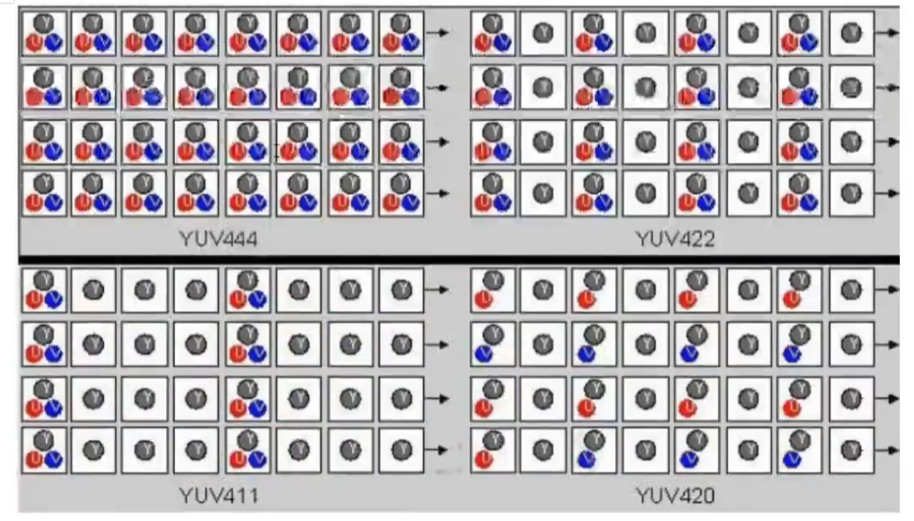

vlc也是可以当一个流媒体服务器进行串流，是OK的，可以参看这[地址](https://blog.csdn.net/zhiyuan2021/article/details/132287991)。此外vlc还可以串流http、udp等当服务器

- [http](https://www.bilibili.com/video/BV1Fw4m1e7Es?t=0.0&p=48)服务器；
- [UDP](https://www.bilibili.com/video/BV1Fw4m1e7Es?t=0.5&p=49)服务器；

​	在流输出时，新目标选择RTSP，然后点击右侧的添加，就让设置端口(这里默认的是8554)、路径，

​	然后配置文件就选择（TS）的

mediainfo：github去看看，是用来看各种音视频格式的。

FlvAnalyser：github，

Elecard Stream Analyzer 码流分析工具

---

音视频开发职责可能这些：

- 研究Nginx的rtmp推流/抓流功能，研究SRS 的rtmp推流功能;
- 研究ffmpeg的HLS切片与推流等功能，减缓延时，提高直播响应时间;
- 研究海康NVR摄像头录播服务器的接口;
- 研发编码器核心模块，提供多路直播视频源的转码功能;
- 研究PS、TS、MP4、flv、m3u8的封装/传输协议和实现代码;
- 负责流媒体模块的客户端与服务端的整体设计与开发;

---

`#pragma comment(lib, "math.lib")`是windows特有的指令，可看[这里](https://zhuanlan.zhihu.com/p/682650559)介绍。

---

看到的音频开源硬件遍解码项目：在[ONVIF介绍](https://blog.csdn.net/weixin_43147845/article/details/138666827)里看到的。

1、Nvidia视频硬解码、渲染、软/硬编码并写入MP4文件。项目地址：https://github.com/BreakingY/Nvidia-Video-Codec
2、Jetson Jetpack5.x视频编解码。项目地址：https://github.com/BreakingY/jetpack-dec-enc
3、音视频(H264/H265/AAC)封装、解封装、编解码pipeline，支持NVIDIA、昇腾DVPP硬编解码。项目地址：https://github.com/BreakingY/Media-Codec-Pipeline
4、simple rtsp server，小而高效的rtsp服务器，支持H264、H265、AAC、PCMA；支持TCP、UDP；支持鉴权。项目地址：https://github.com/BreakingY/simple-rtsp-server

5、simple rtsp client，rtsp客户端，支持TCP、UDP、H264、H265、AAC、PCMA，支持鉴权。项目地址：https://github.com/BreakingY/simple-rtsp-client

6、libflv，flv muxer/demuxer，支持H264/H265、AAC。项目地址：https://github.com/BreakingY/libflv


### 1.1. 视频

#### 1.1.1 YUV采样及换算

YUV：是一种亮度与色度分离的色彩格式。

早期的电视都是黑白的，即只有亮度，即Y，有了彩色电视后，加入了UV两种色度，形成现在的YUV，。

YCbCr也称之为YCbCr，是YUV的压缩版本，不同之处在于YCbCr是用于数字图像领域，YUV用于模拟信号领域，MPEG、DVD、摄像机中常说的YUV其实就是YCbCr。

- Y：亮度，就是灰度值，除了表示亮度信号外，还含有较多的绿色通道，
- U: 蓝色通道与亮度的差值；
- V：红色通道与亮度的差值；

优势：人眼对亮度敏感，对色度不敏感，因此减少部分UV的数据量，人眼无法感知出来，这样可以通过压缩UV的分辨率。在不影响观感的前提下，减小视频的体积。

RGB与YUV的换算：

> Y = 0.299R + 0.587G + 0.114B
>
> U = -0.147R - 0.289G + 0.436B
>
> V = 0.615R - 0.515G - 0.100B
>
> ---
>
> R = Y + 1.14V
>
> G = Y - 0.39U - 0.58V
>
> B = Y + 2.03U

YUV主流的采样方式有三种：

- YUV4:4:4     看图，前面四个格子，大家都有；

- YUV4:2:2     前面四个格子，Y都有，是4个；U、V各两个

- YUV4:2:0     起那么四个格子，Y有4个，U有两个，V是0个；但注意第二行U、V又反过来了  （通常采用这，能获得1/2的压缩率）

  就先看第一排，四个四个一组的看， YUV411基本不用

#### 1.1.2 I帧、B帧、P帧

视频帧又分为：I帧、B帧、P帧：

- I帧：帧内编码帧，大多数情况下I帧就是关键帧，就是一个完整帧，无序任何辅助就能独立完整显示的画面。
- B帧：帧是双向预测帧，参考前后图像帧编码生成，需要前面的I/P帧或后面的P帧来协助形成一个画面。
- P帧：前向预测编码帧，是一个非完整帧，通过参考前面的I帧或P真生成画面。

#### 1.1.3 码率/比特率

码率/比特率：单位时间播放连续的媒体如压缩后的音频或视频的比特数量。

常用单位“比特每秒”，缩写是“bit/s”。比特率越高，带宽消耗得越多。

比特率即码率，在不同领域有不同的含义，在多媒体领域，==指单位时间播放音频或视频的比特数==，可以理解成吞吐量或带宽。

- 单位为==bps==，即 bits per second，每秒传输的数据量，常用单位有: kbps、mbps等。
- 计算公式:码率(kbps)=文件大小(kb)/时长(s)
- 通俗一点理解就是取样率，取样率越大，精度就越高，图像质量越好，但数据量也越大，所以要找到一个平衡点:用最低的比特率达到最少的失真。

在一个视频中，不同时段画面的复杂程度是不同的，比如高速变化的场景和几乎静止的场景，所需的数据量也是不同的，若都使用同一种比特率是不太合理的，所以引入了==动态比特率==:

- 动态比特率:
  简称为==VBR==，即 Variable Bit Rate，比特率可以随着图像复杂程度的不同而随之变化。
  图像内容简单的片段采用较小的码率，图像内容复杂的片段采用较大的码率这样既保证了播放质量，又兼顾了数据量的限制。
  比如RMVB视频文件，其中的VB就是指VBR，表示采用动态比特率编码方式，达到播放质量与体积兼得的效果。
- 静态比特率:
  简称为==CBR==，即 Constant Bit Rate，比特率恒定。
  图像内容复杂的片段质量不稳定，图像内容简单的片段质量较好。
  上面列出的计算公式显然是针对CBR，除VBR和CBR外，还有CVBR(Constrained VariableBit Rate）、ABR(Average Bit Rate)等等。

一分钟视频的数据量：（RGB,每色有8bit，这种方式表达出来的颜色，也被称为24位色(占用24bit)，也是像素的位深）


#### 1.1.4 视频格式

视频格式，就不细写了，看视频吧：

- [mp4和avi格式](https://www.bilibili.com/video/BV1yS421K7kq?t=34.9&p=32)；
- [flv格式和ts格式](https://www.bilibili.com/video/BV1yS421K7kq?t=2.0&p=33)。
  - flv视频格式：直播推流的时候需要用到RTMP的视频数据格式，RTMP的视频格式和FLV很像，通过查看FLV的格式文档，可以分析FLV格式来解析RTMP格式。
  - rtmp中的数据就是由FLV的TAG中的数据区构成。
  - flv是流媒体的封装格式，可以将其数据看成二进制字节流，总体上看，FLV包括 头文件(File Header) 和 文件体(File Body)两部分，其中文件体由一系列的Tag和 Tage Size对 组成。
- [H.264编码原理](https://www.bilibili.com/video/BV1yS421K7kq?t=12.5&p=43)；

#### 1.1.5 PTS、DTS、GOP

PTS 和 DTS：

- DTS(Decoding Time Stamp)是标识读入内存中 bit流在什么时候开始送入解码器中进行解码。也就是==解码顺序的时间戳==。
- PTS(Presentation Time Stamp)用于度量解码后的视频帧什么时候被显示出来。也就是==显示顺序的时间戳==。

注：在没有B帧的情况下，DTS和PTS的输出顺序是一样的，一旦存在B帧，PTS和DTS则会不同。

GOP：
	即Group of picture(图像组)，指==两个I帧之间的距离==，Reference(参考周期)指两个Р帧之间的距离。

- 一个I帧所占用的字节数大于一个P帧，一个Р帧所占用的字节数大于一个B帧；
- 所以在码率不变的前提下，GOP值越大，P、B帧的数量会越多，平均每个I、P、B帧所占用的字节数就越多，也就更容易获取较好的图像质量;
- Reference越大，B帧的数量越多，同理也更容易获得较好的图像质量。

另外：

- 字节大小:I>P>B
- 解码顺序：I->P->B

非常好说明的图：


### 1.2. 音频

音频相关的东西：

音频数据的承载方式最常用的是==脉冲编码调制==，即PCM。

根据==奈奎斯特采样定理==：为了不失真的恢复模拟信号，采样频率应该不小于模拟信号频谱中最高频率的2倍。

常见的音频编码方式有：PCM 和 ADPCM ，这些数据代表着无损的原始数字音频信号，添加了一些头信息，就可以存储为WAV文件了，它是一种由微软和IBM联合开发。

## 二、FFmpeg

FFmpeg，在QT中的配置，[教程](https://www.bilibili.com/video/BV1fi421e7iZ?t=305.5&p=19)。

ffmpeg中文文档参考[地址](https://xdsnet.gitbooks.io/other-doc-cn-ffmpeg/content/ffmpeg-doc-cn-01.html)。[windows，用mingw来编译](https://www.bilibili.com/video/BV1yS421K7kq?t=30.4&p=52)ffmpeg，放这里吧，暂时不折腾了。 

ffmpeg解码流程：（新版可能有变化，这不一定对，后期要来校验）

1. 注册所有容器格式和 CODEC：av_register_all()
2. 打开文件：av_open_input_file()
3. 从文件中提取流信息：av_find_stream_info()
4. 穷举所有流，查找其中种类为 CODEC_TYPE_VIDEO
5. 查找对应的解码器：avcodec_find_decoder()
6. 打开编解码器：avcodec_open()
7. 打开码帧分配内存：avcodec_alloc_frame()
8. 不停从码流中提取出帧数据：av_read_frame()
9. 判断帧的类型，对于视频帧调用：avcodec_decode_video()
10. 解码完成后，释放解码器：avcodec_close()
11. 关闭输入文件：av_close_input_file()

ffmpeg的常规处理流程：


### 2.1. 基本组成库介绍

FFmpeg：是一套可以用来记录、转换数字音频、视频，并能将其转化为流的开源计算机程序。它包括了领先的音/视频编码库libavcodec等。

命令行的三个文件：

- ffmpeg：该项目提供的一个工具，可用于格式转换、解码或电视卡即时编码等；
- ffplay：是一个简单的播放器，使用ffmpeg库解析和解码，通过 sDL显示；
- ffprobe：用来查看音视频文件的各种信息，比如：封装格式、音频/视频流信息、数据包信息等。
- ffsever:一个HTTP多媒体即时广播串流服务器（3.4版本后移除了它）。

---

八大库：

1. libavutil：核心工具库，最基础模块之一，包含一些公共的工具函数、数学函数等，其他模块都会依赖该库做一些基本的音视频处理操作；
2. libavformat：文件格式和协议库，封装了Protocol层和Demuxer、Muxer层，用于各种音视频封装格式的生成和解析，包括获取解码所需信息以生成解码上下文结构；
3. libavcodec：编解码库，包含各种类型音频/视频的编解码器。封装了Codec层，但是有一些codec是具备自己的License的，ffmpeg不会默认添加像libx264、FDK-AAC、Lame等库，但是ffmpeg是一个平台，可以将其他的第三方codec以插件的方式编译添加进来，以供统一接口，
4. libavfilter：音视频滤镜库，该模块包含了音频特效和视频特效的处理；
5. libavdevice：输入输出设备库，比如需要编译出播放声音或者视频的工具ffplay，就需要确保该模块是打开的，该模块播放声音和视频都又依赖于libsdl库，以及用于获取音视频数据采集和渲染等功能设备的相关参数；
6. libswscale：用于视频场景比例缩放、色彩映射转换、图像格式转换，如从YUV到RGB；
7. libpostproc：用于后期效果处理，当使用filter的时候，需要打开这个模块，filter会用到这个模块的一些基础函数；
8. libswresample：用于音频重采样和格式转换，可以对数字音频的声道数、数据格式、采样率等多种基本信息进行转换。

---

==FFmpeg的封装转换部分==：,主要是通过libavformat,这部分来完成的功能,通过 libavformat库进行mux和demux操作，多媒体文件的格式有很多种，但是还是有好多demux与 mux的操作参数是公用的，下面来详细介绍一下这些公用的参数:

- 通过查看ffmpeg的 help full参数，找到AVFormatContext参数部分，在这个参数下面的所有的参数均为封装转换可使用的参数:

  - avioflags: format的缓冲设置，默认为0，就是有缓冲; direct是无缓冲状态;

  - probesize:获得文件内容的大小;

  - formatprobesiz:设置一个获得文件内容的大小来解析文件的 format;

  - fflags: 设置读取或者写出的格式的形式的标签,分为多种方式: flush_packets, ignidx, genpts,nofillin，noparse,igndts，discardcorrupt，sortdts，keepside，fastseek，latm，nobuffer，bitexact,

    - 具体每个含义看下图：
      

      

==FFmpeg的编解码部分==：

- 图1：
  
- 图2：
  

一般的处理流程：


### 2.2. 数据结构及流程

FFmpeg十大数据结构：FFmpeg中结构体很多，


最关键的结构体可以分成以下几类：

a)解协议（http,rtsp,rtmp,mms,hls,file,tcp,udp,...）

​	AVIOContext, URLContext, URLProtocol：主要存储音视频使用的协议的类型以及状态。URLProtocol存储输入音视频使用的封装格式，每种协议都对应一个URLProtocol结构

b)解封装（flv,avi,rmvb,mp4）

​	AVFormatContext主要存储音视频封装格式中包含的信息；AVInputFormat存储输入音视频使用的封装格式，每种音视频封装格式都对应一个AVInputFormat结构

c)解码（h264,mpeg2,aac,mp3）

​	每个AVStream存储一个视频/音频流的相关数据;

​	每个AVStream对应一个AVCodecContext,存储该视频/音频流使用解码方式的相关数据;

​	每个AVCodecContext 中对应一个AVCodec，包含该视频/音频对应的解码器。

​	每种解码器都对应一个AVCodec结构。

d)存数据

​	视频的话，每个结构一般是存一帧，音频可能有好几帧。

​		解码前数据：AVPacket  一个个数据包

​		解码后数据：AVFrame   视频就是一帧图片

这是以前版本的流程主要用到的API：


FFmepg4.x解码流程图解，主要用到的API：


---

FFmpeg中主要数据结构存在包含关系，如下标题显示的就是包含层级的关系。

AVFormatContext->AVStream->AVCodecContext->AVCodec, 其中后者是前者的数据成员(可能新版的有些出入了，AVCodecContext->AVCodec这俩好像不太对，用的也不是很多)

AVFormatContext是一个贯穿始终的数据结构，很多函数都用到它作为参数，是输入输出相关信息的一个容器。
主要成员如下:

- AVInputFormat和AVOutputFormat，同一时间只能存在一个。当播放视频时AVInputFormat生效，录制视频时则 AvOutputFormat生效。
- AVStream是继AVFormatContext,之后第二个贯穿始终的数据结构，它保存于数据流相关的编解码器、数据段等信息，还包含“流”这个概念中的一些信息。

AVCodecContext保存AVCodec指针和与codec相关的数据。在AVStream初始化后AVCodecContext的初始化时Codec使用中最重要的一环。AVCodecContext中的codec_type，codec_id二个变量对于encoder/decoder的最为重要。
AvCodecContext中有两个成员:AvCodec，AVFrame

- AVCodec记录了所要使用的Codec的信息，并有5个函数来完成编解码工作，分别是：init、encoder、close、decode、flush。
- AVFrame中主要包含了编码后的帧信息。

### 2.3. log、dict、parseutil

下面是一些基础的函数，用来了解ffmpeg，主要有：

- av_log：日志相关
- av_dict_set：通过AVDictionary来保存参数，获取参数
- 参数解析：av_parse_video_size、av_parse_video_rate这些，通过给定的格式来初步解析画面大小，帧率这些

```c++
#include <iostream>

extern "C" {
#include <libavcodec/avcodec.h>
#pragma comment(lib, "avcodec.lib")

#include <libavformat/avformat.h>
#pragma comment(lib, "avformat.lib")

#include <libavutil/opt.h>
#include <libavutil/parseutils.h>
#include <libavutil/avutil.h>
#pragma comment(lib, "avutil.lib")

#include <libavutil/avutil.h>
#pragma comment(lib, "avutil.lib")
}

void test_log() {
	AVFormatContext *pAVFmtCtx = nullptr;
	pAVFmtCtx = avformat_alloc_context();  // 注意释放，成对写

	av_log(pAVFmtCtx, AV_LOG_PANIC, "Panic: \n");
	av_log(pAVFmtCtx, AV_LOG_FATAL, "fatal: \n");
	av_log(pAVFmtCtx, AV_LOG_ERROR, "ERROE: \n");
	av_log(pAVFmtCtx, AV_LOG_WARNING, "warinning: \n");
	// info、verbose、debug

	avformat_free_context(pAVFmtCtx);
}

void test_avdictionary() {
	AVDictionary *d = nullptr;
	AVDictionaryEntry *t = nullptr;

	// 0 是默认前面插入
	av_dict_set(&d, "name", "zhansan", 0);
	av_dict_set(&d, "age", "22", 0);

	// 另一种方式插入
	char *k = av_strdup("location");
	char *v = av_strdup("Beijing-China");
	av_dict_set(&d, k, v, AV_DICT_DONT_STRDUP_KEY | AV_DICT_DONT_STRDUP_VAL);

	// 获取字典长度
	int dict_cnt = av_dict_count(d);
	std::cout << "字典个数： " << dict_cnt << std::endl;  // 3
	// 循环获取
	while (t = av_dict_get(d, "", t, AV_DICT_IGNORE_SUFFIX)) {
		std::cout << "kye: " << t->key << "; value: " << t->value << std::endl;
	}
	// 指定名字获取
	t = av_dict_get(d, "age", t, AV_DICT_IGNORE_SUFFIX);
	std::cout << "age: " << t->value << std::endl;

	av_dict_free(&d);  // 注意释放
}

void test_parseutil() {
	const char* input_str = "1920x1080";   // 这里是用小写字母x，替代的*
	int output_w = 0;
	int output_h = 0;

	/*
	- vga   640x480
	- hd1080 1920x1080
	- ntsc 720x480
	*/
    // 获取给定格式的画面尺寸
	av_parse_video_size(&output_w, &output_h, input_str);
	std::cout << "w: " << output_w << "; h: " << output_h << std::endl;  // 1920x1080
	av_parse_video_size(&output_w, &output_h, "ntsc");  // ntsc(N制)、pal(啪制)
	std::cout << "w: " << output_w << "; h: " << output_h << std::endl;  // 640x480
	
    // 获取帧率
	AVRational output_rational = { 0, 0 };
	av_parse_video_rate(&output_rational, "15/1");
	std::cout << "framerate: " << output_rational.num / output_rational.den << std::endl;  // 15
	// ntsc、 pal都有对应宽高以及帧率
	av_parse_video_rate(&output_rational, "pal");
	std::cout << "framerate: " << output_rational.num / output_rational.den << std::endl;  // 25
	
    // 获取持续时间
	int64_t output_timeval;
	// 最后一个参数，跟教程出入(可能版本问题)，看代码参数解释说，如果不是0，则表示这是持续时间，否则被解释为日期
	av_parse_time(&output_timeval, "00:01:01", 1);
	std::cout << "microseconds: " << output_timeval << std::endl;  // 61000000
	std::cout << "microseconds: " << output_timeval / AV_TIME_BASE << std::endl;  // 61
}

int main() {
	int loglevel = av_log_get_level();
	av_log_set_level(AV_LOG_DEBUG);
	//av_log_set_level(AV_LOG_PRINT_LEVEL)

	test_log();
	test_avdictionary();
	test_parseutil();

	return 0;
}
```

### 2.4. 读取本地文件流程(自定义AVIO)

读取本地、视频流的简单流程：（头文件导入，去看2.3，一模一样，这里不再写）

```c++
extern "C" {
#include <libavformat/avformat.h>
#pragma comment(lib, "avformat.lib")

#include <libavutil/avutil.h>
#pragma comment(lib, "avutil.lib")  // av_log_set_level 需要
}

int main(int argc, char* argv[]) {
	av_log_set_level(AV_LOG_FATAL);  // 不加这个，读流时ffmpeg自己会有一些报错，加了这，那些报错就没了

	avformat_network_init();  // 网络文件才需要，本地文件起始可以不要，老版本的av_register_all已经被丢弃
	
	//const char *input = "rtsp://admin:@192.168.108.135";
	const char *input = "C:\\Users\\Administrator\\Videos\\ts.ts";  // 这是自己rtsp存的，

	AVFormatContext *pFormatCtx = nullptr;
	AVInputFormat *pInFmt = nullptr;
	pFormatCtx = avformat_alloc_context();

	do {
		// avformat_open_input分析流，把pFormatCtx、pInFmt这些给填满
		// 后面的 AVDictionary 参数可以传一个空指针；pInFmt这个参数也可以是空指针
		if (avformat_open_input(&pFormatCtx, input, pInFmt, nullptr) < 0) {
			std::cerr << "打开失败..." << std::endl;
			break;
		}

		if (avformat_find_stream_info(pFormatCtx, nullptr) < 0) {
			std::cerr << "avformat_find_stream_info  error..." << std::endl;
			break;
		}
		std::cout << "流中的数据流的路数：" << pFormatCtx->nb_streams << std::endl;
	
	} while (0);

	// 要对应去释放
	avformat_close_input(&pFormatCtx);
	avformat_free_context(pFormatCtx);
	avformat_network_deinit();

	return 0;
}
```

---

- 可以自定义AVIO，用avio_alloc_context这个api，传递函数指针，来决定怎么读，[教程](https://www.bilibili.com/video/BV1fi421e7iZ?t=2.8&p=24)。
- 接着就是读取自定义数据流，可以从内存中读取数据，特别涉及到视频加密的读取，或许可能从[这里](https://www.bilibili.com/video/BV1fi421e7iZ?t=35.6&p=25)找找灵感。
- 对应的是ffmpeg中源码中的example中的[avio_reading.c](https://www.ffmpeg.org/doxygen/5.1/avio_reading_8c-example.html)。说是里面的[av_file_map](https://www.ffmpeg.org/doxygen/5.1/libavutil_2file_8c.html#a20ab80637ab92af5fbbe4c00be406ad3)内存映射文件，不是很懂，上一条的视频教程有对这个.c文件的解读。

### 2.5. 解/转封装

这一般不涉及到编解码，只是拿下，给出新的封装格式而已，但不是所有的格式都能互转，跟输入视频文件关系很大。

#### 2.5.1 ==解封装==(一定看这个流程)

基本上自己的使用就按照这个代码来拿视频帧吧。

1. 分配解复用器上下文：avformat_alloc_context
2. 根据url打开本地文件或网络流：avformat_open_input
3. 读取媒体的部分数据包以获取码流信息：avformat_find_stream_info
4. 读取码流信息，循环处理（旧版本是去循环流，新版是用av_find_best_stream）
   1. 从文件中读取数据包：av_read_frame
      - 此函数将存储在输入文件中的数据分割为多个packet，每次调用将得到一个可能是音频帧、音频帧或其它数据，解码器只会解码视频帧或音频帧，非音视频数据并不会被扔掉，从而能像解码器提供尽可能多的信息；
      - 对视频来说，一个packet只包含一个视频帧；对于音频来说，若是帧长固定的格式，则一个packet可包含整个音频帧，若是帧长可变的格式则一个packet只包含一个音频帧。
      - ==读取到的packet每次使用完后要立即调用 av_oacket_unred(AVPacket *pkt) 清空packet，否则会造成内存泄漏==。
   2. 或定位文件avformat_seek_file或av_seek_frame
5. 关闭解复用器：avformat_close_input
6. 释放其它资源等：avformat_free_context   # 过程中还有一些解引用的操作也要注意

```c++
#include <iostream>

/*
extern "C" {
#include <libavcodec/avcodec.h>
#pragma comment(lib, "avcodec.lib")

#include <libavformat/avformat.h>
#pragma comment(lib, "avformat.lib")

#include <libavutil/opt.h>
#include <libavutil/parseutils.h>
#include <libavutil/avutil.h>
#pragma comment(lib, "avutil.lib")

#include <libavutil/avutil.h>
#pragma comment(lib, "avutil.lib")
}
*/

extern "C" {
#include <libavcodec/avcodec.h>
#pragma comment(lib, "avcodec.lib")  // av_packet_alloc 这些函数需要

#include <libavformat/avformat.h>
#pragma comment(lib, "avformat.lib")

#include <libavutil/avutil.h>
#pragma comment(lib, "avutil.lib")
}

static double r2d(AVRational r) {
	return r.den == 0 ? 0 : (double)r.num / (double)r.den;
}

int main(int argc, char* argv[]) {
	avformat_network_init();  // 网络文件才需要，本地文件起始可以不要，老版本的av_register_all已经被丢弃

	//const char *input = "rtsp://admin:@192.168.108.135";
	const char *input = "C:\\Users\\Administrator\\Videos\\audio.mp4";  // 这是自己rtsp存的，

	AVFormatContext *pFormatCtx = nullptr;
	AVDictionary *opts = nullptr;  // 这是非必须，可以不要的
	// 1.分配解复用器上下文
	pFormatCtx = avformat_alloc_context();

	do {
		// 2.打开文件
		int ret = avformat_open_input(&pFormatCtx, input, nullptr, &opts);
		if (ret != 0) {
			// 用ffmpeg自带的把错误转换打印出来
			char buf[1024] = { 0 };
			av_strerror(ret, buf, sizeof(buf) - 1);  // 需要avutil.lib库
			std::cout << "open failed: " << buf;
			break;
		}

		// 3.读取码流信息
		if (avformat_find_stream_info(pFormatCtx, nullptr) != 0) break;

		/* // 3.打印总体信息
		pFormatCtx->url  # media名字
		pFormatCtx->bit_rate  # 媒体的平均码率，单位为bps b代表比特
			这个值 / 1024 就得到了 kbps
		pFormatCtx->nb_streams # 流的个数
		pFormatCtx->duration  # 时长（微妙）（可以像下面具体流转成时分秒）
			pFormatCtx->duration / AV_TIME_BASE    # 这就转成了秒
		*/
		av_dump_format(pFormatCtx, 0, input, 0);  // 这个API就是想ffmpeg那样打印输出


		// 4.读取码流信息（这是旧版本,新版本也是兼容的）
		for (int i = 0; i < pFormatCtx->nb_streams; ++i) {
			AVStream *as = pFormatCtx->streams[i];
			// 视频
			if (AVMEDIA_TYPE_VIDEO == as->codecpar->codec_type) {
				std::cout << "视频信息: " << std::endl;
				std::cout << "index: " << as->index << std::endl;
				std::cout << "视频帧率: " << r2d(as->avg_frame_rate) << "fps.\n";
				// 视频压缩编码格式
				if (AV_CODEC_ID_MPEG4 == as->codecpar->codec_id) {
					std::cout << "视频压缩编码格式: MPEG4" << std::endl;
				}
				else if (AV_CODEC_ID_HEVC == as->codecpar->codec_id) {
					std::cout << "视频压缩编码格式: h265" << std::endl;
				}
				std::cout << "(w, h)： " << as->codecpar->width << ", " << as->codecpar->height;
				// 视频总时长，转化成了秒
				int durationAudio = (as->duration) * r2d(as->time_base);
				std::cout << "视频总时长：" << durationAudio / 3600 << "时" << (durationAudio % 3600) / 60 << "分" << (durationAudio % 60) << "秒\n" << std::endl;;
			}
			// 音频
			else if (AVMEDIA_TYPE_AUDIO == as->codecpar->codec_type) {
				std::cout << "音频信息: " << std::endl;
				std::cout << "index: " << as->index << std::endl;
				std::cout << "音频采样率: " << as->codecpar->sample_rate << "Hz.\n";
				// 下面这已经被5.1丢弃了，编译会报错
				//std::cout << "音频通道数: " << as->codecpar->channels << std::endl;
				// 音频采样格式
				if (AV_SAMPLE_FMT_FLTP == as->codecpar->format) {
					std::cout << "音频采样格式：AV_SAMPLE_FMT_FLTP\n";
				}
				else if (AV_SAMPLE_FMT_S16P == as->codecpar->format) {
					std::cout << "音频采样格式：AV_SAMPLE_FMT_S16P\n";
				}
				// 音频压缩编码格式
				if (AV_CODEC_ID_AAC == as->codecpar->codec_id) {
					std::cout << "音频压缩编码格式：AV_CODEC_ID_AAC\n";
				}
				else if (AV_CODEC_ID_MP3 == as->codecpar->codec_id) {
					std::cout << "音频压缩编码格式：AV_CODEC_ID_MP3\n";
				}
				// 音频总时长，转化成了秒
				int durationAudio = (as->duration) * r2d(as->time_base);
				std::cout << "音频总时长：" << durationAudio / 3600 << "时" << (durationAudio % 3600) / 60 << "分" << (durationAudio % 60) << "秒\n";
			}
		}

		// 4.读取码流信息（新版）av_find_best_stream
		// 后面四个参数就这样默认吧
		int audioIdx = av_find_best_stream(pFormatCtx, AVMEDIA_TYPE_AUDIO, -1, -1, nullptr, 0);
		if (audioIdx < 0) {
			std::cout << "av_find_best_stream error: " << av_get_media_type_string(AVMEDIA_TYPE_AUDIO);
			break;
		}
		AVStream *audio_stream = pFormatCtx->streams[audioIdx];

		// 字幕流就是 AVMEDIA_TYPE_SUBTITLE 如果是这种方式，不是用循环，多路流时要注意哦
		int videoIdx = av_find_best_stream(pFormatCtx, AVMEDIA_TYPE_VIDEO, -1, -1, nullptr, 0);
		if (videoIdx < 0) {
			std::cout << "av_find_best_stream error: " << av_get_media_type_string(AVMEDIA_TYPE_VIDEO);
			break;
		}
		AVStream *video_stream = pFormatCtx->streams[videoIdx];
		std::cout << "index: " << video_stream->index << std::endl;
		std::cout << "fps: " << av_q2d(video_stream->avg_frame_rate) << std::endl;
		std::cout << "w, h" << video_stream->codecpar->width << ", " << video_stream->codecpar->height << std::endl;
		std::cout << "video codec: " << video_stream->codecpar->codec_id << std::endl;
		if (video_stream->duration != AV_NOPTS_VALUE) {
			int video_duration = video_stream->duration * av_q2d(video_stream->time_base);
			std::cout << "video duration: " << video_duration / 3600 << "时" << (video_duration % 3600) / 60 << "分" << (video_duration % 60) << "秒\n";
		}


		// 5.提取码流数据	（一个包一个包的读）
		// 打印结果可以看到音视频是交织输出的，，可能一开始只有视频视频，也可能一开始只有音频数据
		int pkt_count = 0;
		int print_max_count = 100;
		std::cout << "\n---------av_read_frames start\n";
		AVPacket *pkt = av_packet_alloc();
		while (1) {
			ret = av_read_frame(pFormatCtx, pkt);
			if (ret < 0) {
				std::cout << "av_read_frame end\n";
				break;
			}
			if (pkt_count++ > print_max_count) break;

			if (pkt->stream_index == audioIdx) {
				std::cout << "audio pts: " << pkt->pts << std::endl;
				std::cout << "audio dts: " << pkt->dts << std::endl;
				std::cout << "audio size: " << pkt->size << std::endl;
				std::cout << "audio pos: " << pkt->pos << std::endl;
				std::cout << "audio duration: " << pkt->duration * av_q2d(pFormatCtx->streams[audioIdx]->time_base) << std::endl;

			}
			else if (pkt->stream_index == videoIdx) {
				std::cout << "video pts: " << pkt->pts << std::endl;
				std::cout << "video dts: " << pkt->dts << std::endl;
				std::cout << "video size: " << pkt->size << std::endl;
				std::cout << "video pos: " << pkt->pos << std::endl;
				// 30fps的视频，这里的结果结果就是0.0333秒
				std::cout << "one frame duration: " << pkt->duration * av_q2d(video_stream->time_base) << std::endl;
			}
			else {
				std::cout << "UNknown stream_idx: " << pkt->stream_index << std::endl;
			}
			std::cout << "\n";
			// 记得是在这里接触ref，代表这个包不用了，好重复利用pkt这个空间(不要修改这个位置到循环外面，会造成内存泄漏)
			av_packet_unref(pkt);
		}

		// 6.结束
		if (pkt) {
			av_packet_free(&pkt);
		}


	} while (0);

	// 要对应去释放
	if (pFormatCtx) {
		avformat_close_input(&pFormatCtx);
		avformat_free_context(pFormatCtx);
	}
	avformat_network_deinit();

	system("pause");
	return 0;
}
```

#### 2.5.2 转封装

转封装：从一种视频容器转成另一种视频容器。

​	所谓的封装格式转换，就是在AVI，FLV，MKV,MP4这些格式之间转换（对应.avi，.flv，.mkv，.mp4文件)。需要注意的是，本程序并不进行视音频的编码和解码工作。而是直接将视音频压缩码流从一种封装格式文件中获取出来然后打包成另外一种封装格式的文件。说是可以不涉及到编解码，就是说数据还是用原来的数据，只是重新加头部信息封装成别的格式的文件，速度特别快，几乎是无损的。

比如：

- 示例一：
  - ffmpeg -i "rtsp://admin:@192.168.108.135" -c copy -f mpegts ts.ts
  - ffmpeg -i ts.ts -c copy -f flv ts.flv     # 然后从ts格式转封装成flv格式，用的-c copy

- 示例二：
  - ffmpeg -i audio.mp4 -c copy -f avi audio.avi  # 速度很快，一下就完成了
  - audio.mp4是用的h265编码+aac的格式，这个命令转封装成.avi格式的，  # 命令行能成功，但是代码转换得到的avi无法播放

下面是代码的实现：（注意，没办法像命令行那样随意转换，且有的格式命令行都是做不了的，跟输入视频格式有很大关系，如“sintel_trailer-480p.webm”作为输入，命令行都是不行的）

```c++
#include <iostream>

extern "C" {
#include <libavcodec/avcodec.h>
#pragma comment(lib, "avcodec.lib")  // av_packet_alloc 这些函数需要

#include <libavformat/avformat.h>
#pragma comment(lib, "avformat.lib")

#include <libavutil/avutil.h>
#include <libavutil/timestamp.h>
#pragma comment(lib, "avutil.lib")
}

static void log_packet(const AVFormatContext *fmt_ctx, const AVPacket *pkt, const char* tag) {
	AVRational *time_base = &(fmt_ctx->streams[pkt->stream_index]->time_base);
	char a[32] = { 0 };
	std::cout << tag << ":pts:" << av_ts_make_string(a, pkt->pts) << " pts_time:" << av_ts_make_time_string(a, pkt->pts, time_base)
		<< " dts:" << av_ts_make_string(a, pkt->dts) << " dts_time:" << av_ts_make_time_string(a, pkt->dts, time_base)
		<< " duration:" << av_ts_make_string(a, pkt->duration) << " duration_time:" << av_ts_make_time_string(a, pkt->duration, time_base)
		<< " index:" << pkt->stream_index << std::endl;	
	/*
	av_ts2str、av_ts2timestr会报错，应该是源码中这些写法现在在c++里，有点问题，我就自己把它扩展写出来了
	std::cout << tag << ":\npts:" << av_ts2str(pkt->pts) << " pts_time:" << av_ts2timestr(pkt->pts, time_base)
		<< " dts:" << av_ts2str(pkt->dts) << " dts_time:" << av_ts2timestr(pkt->dts, time_base)
		<< " duration:" << av_ts2str(pkt->duration) << " duration_time:" << av_ts2timestr(pkt->duration, time_base)
		<< " index:" << pkt->stream_index;
	*/
}

int main(int argc, char* argv[]) {
	AVFormatContext *ifmt_ctx = nullptr;
	AVFormatContext *ofmt_ctx = nullptr;

	const AVOutputFormat *ofmt = nullptr;
	AVPacket pkt;
	const char* in_filename;
	const char* out_filename;

	int ret = 0;
	int streadm_index = 0;
	int *stream_mapping = nullptr;
	int stream_mapping_size = 0;

	if (argc < 3) {
		std::cout << "usage: " << argv[0] << "input output\n"
			"API example program to remux a media file with "
			"The output format is guessed according to the file\n";
		return 1;
	}

	in_filename = argv[1];
	out_filename = argv[2];

	do {
		// 很多用0替代nullptr、NULL
		if ((ret = avformat_open_input(&ifmt_ctx, in_filename, nullptr, nullptr)) < 0) {
			std::cerr << "Could not open input file: " << in_filename << std::endl;
			break;
		}
		if ((ret = avformat_find_stream_info(ifmt_ctx, 0)) < 0) {
			std::cerr << "Failed to retrieve input stream inform" << std::endl;
			break;
		}

		std::cout << "\n\n----------------av_dump_format: ifmt_ctx--------\n";
		av_dump_format(ifmt_ctx, 0, in_filename, 0);

		// 第三个参数可指定后缀名(可以类似给 avi  mp4 这种)
		ret = avformat_alloc_output_context2(&ofmt_ctx, nullptr, nullptr, out_filename);
		if (ret < 0 || !ofmt_ctx) {
			std::cerr << "Could not create output context\n";
			ret = AVERROR_UNKNOWN;
			break;
		}

		stream_mapping_size = ifmt_ctx->nb_streams;

		// av_mallocz_array 是旧的版本了，用 av_calloc
		// 用了指针转换，不知道行不行
		stream_mapping = reinterpret_cast<int*>(av_calloc(stream_mapping_size, sizeof(*stream_mapping)));
		if (!stream_mapping) {
			ret = AVERROR(ENOMEM);
			break;
		}

		ofmt = ofmt_ctx->oformat;

		bool flag = false;
        // 根据输入流创建输出流 (这就把所有codec参数都存进了 ofmt_ctx )
		for (size_t i = 0; i < ifmt_ctx->nb_streams; ++i) {
			AVStream *in_stream = ifmt_ctx->streams[i];
			AVCodecParameters *in_codecpar = in_stream->codecpar;

			// 只处理音频流、视频流、字幕流
			if (in_codecpar->codec_type != AVMEDIA_TYPE_AUDIO &&
				in_codecpar->codec_type != AVMEDIA_TYPE_VIDEO &&
				in_codecpar->codec_type != AVMEDIA_TYPE_SUBTITLE) {
				stream_mapping[i] = -1;
				continue;
			}

			stream_mapping[i] = streadm_index++;

			// 根据输出的上下文信息，创建一个新的流
			// out_stream是一个临时变量，后续对它的改变的值都存到了ofmt_ctx
			// 每次循环都会重新创建，（第二个参数，新版都是给空指针，它里面也有说明，讲这参数什么也不错，老版可能需要传递）
			AVStream *out_stream = avformat_new_stream(ofmt_ctx, nullptr);
			if (!out_stream) {
				std::cerr << "Failed allocting output stream\n";
				ret = AVERROR_UNKNOWN;
				flag = true;  // 这错了，要直接跳出do while 循环
				break;
			}

			// 复制编解码器的参数
			ret = avcodec_parameters_copy(out_stream->codecpar, in_codecpar);
			if (ret < 0) {
				std::cout << "Failed to copy codec parameters\n";
				break;
			}
			// 以后凡是只看到 ->codec-> 就代表是老版本，新版已经丢弃，是用的 ->codecpar->
			out_stream->codecpar->codec_tag = 0;  // 标记不需要重新编解码
		}
		if (flag) break;

		std::cout << "\n\n----------------av_dump_format: ofmt_ctx--------\n";
        // (读里面参数就会懂，最后一个参数：是输出流就给1，不是就给0)
		av_dump_format(ofmt_ctx, 0, out_filename, 1);

		if ((ofmt->flags & AVFMT_NOFILE)) break;

		// 写入文件
		ret = avio_open(&ofmt_ctx->pb, out_filename, AVIO_FLAG_WRITE);
		if (ret < 0) {
			std::cerr << "Could not opne output file: " << out_filename << std::endl;
			break;
		}

		// 头部信息
		ret = avformat_write_header(ofmt_ctx, nullptr);
		if (ret < 0) {
			std::cerr << "Error occurred when opening output file: " << out_filename << std::endl;
			break;
		}

		// 开始每个包
		while (1) {
			AVStream *in_stream = nullptr;
			AVStream *out_stream = nullptr;

			// 去读音视频压缩包
			ret = av_read_frame(ifmt_ctx, &pkt);
			if (ret < 0)
				break;

			in_stream = ifmt_ctx->streams[pkt.stream_index];
			if (pkt.stream_index >= stream_mapping_size || stream_mapping[pkt.stream_index] < 0) {
				av_packet_unref(&pkt);
				continue;
			}

			pkt.stream_index = stream_mapping[pkt.stream_index];
			// log_packet(ifmt_ctx, &pkt, "in");

			out_stream = ofmt_ctx->streams[pkt.stream_index];
			// copy packet（只定义了一个pkt，输入用的这个，改了内在的变量后赋值给它，然后输出也是用的这个pkt）
			pkt.pts = av_rescale_q_rnd(pkt.pts, in_stream->time_base, out_stream->time_base, static_cast<AVRounding>(AV_ROUND_NEAR_INF | AV_ROUND_PASS_MINMAX));
			pkt.dts = av_rescale_q_rnd(pkt.dts, in_stream->time_base, out_stream->time_base, static_cast<AVRounding>(AV_ROUND_NEAR_INF | AV_ROUND_PASS_MINMAX));
			pkt.duration = av_rescale_q(pkt.duration, in_stream->time_base, out_stream->time_base);
			pkt.pos = -1;
			// log_packet(ofmt_ctx, &pkt, "out");

			// 交织写音视频包
			ret = av_interleaved_write_frame(ofmt_ctx, &pkt);
			if (ret < 0) {
				std::cerr << "Error muxing packet\n";
				break;
			}
			av_packet_unref(&pkt);  // 单个包用完一次就一定要解引用一次，不然可能内存泄露
		}
		// 写入尾部信息
		av_write_trailer(ofmt_ctx);
	} while (0);

	// 释放资源
	if (ifmt_ctx) {
		avformat_close_input(&ifmt_ctx);
		// 如果没有用 avformat_alloc_context 去创建ifmt_ctx，好像不用下面，（加了问题应该也不大）
		avformat_free_context(ifmt_ctx);
	}
	// 关闭输出流
	if (ofmt_ctx && ofmt && !(ofmt->flags & AVFMT_NOFILE)) {
		avio_closep(&(ofmt_ctx->pb));
	}
	avformat_free_context(ofmt_ctx);
	system("pause");
	return 0;
}
```

注：

- 使用：main.exe ts.ts ts.mp4  或者 main.exe tt.ts ts.flv  # 这转的两种都能播放，然后用fffprobe查看，也有不同，其它的格式转出来可能播放不了，或是直接无法转成功；
- AVFormatContext的指针对象没有用avformat_alloc_context去申请空间也是可以的诶，不知是不是后面的api里去做了，所以还是再释放一下；
- 一些api，跟教程里有出入，按视频里写，vs直接报错，我就根据提示做了对应修改，比如av_calloc，还做了指针类型的显式转换。

#### 2.5.3 audio+opencv

这个代码就是VS中的“ffmpegOpencvShow”中的[ffmpeg_send_audo.cpp](https://github.com/nianjiuhuiyi/Study/blob/master/ffmpegOpencvShow/ffmpeg_send_audo.cpp)。

它主要展示的是用ffmpeg读取类似于rtmp流，把画面用opencv展示，音频每隔5秒存成一个wav文件，并发送到ASR语音识别服务做识别.

下面还有对应的python版本。

```c++
#include <iostream>
#include <fstream>
#include <thread>
#include <queue>
#include <mutex>
#include <condition_variable>
#include <atomic>
#include <chrono>
#include <string>

#include <filesystem>

#include <opencv2/opencv.hpp>

#include "httplib.h"
#include "safequeue.hpp"

#include <windows.h>  // 这一定要放最后，放前面会影响其它头文件的定义，仅针对win

extern "C" {

#include <libavformat/avformat.h>
#pragma comment(lib, "avformat.lib")

#include <libavcodec/avcodec.h>
#pragma comment(lib, "avcodec.lib")

#include <libswresample/swresample.h>  // swr_alloc() 函数，音频重采样器需要
#pragma comment(lib, "swresample.lib")

#include <libswscale/swscale.h>
#pragma comment(lib, "swscale.lib")

#include <libavutil/opt.h>   // av_opt_set_int 函数需要
}

// 全局变量
std::queue<std::vector<uint8_t>> audio_queue; // 音频数据队列
std::mutex audio_mutex;                      // 音频队列互斥锁
std::condition_variable audio_cv;            // 音频队列条件变量
std::atomic<bool> stop_audio_thread{ false };  // 停止音频线程标志


// 存音频文件的路径
SafeQueue<std::string> wave_queue;


// 音频参数
struct audioParam {
    unsigned int sample_rate;  // 采样率
    unsigned int channels;     // 声道数
    unsigned int bits_per_sample;  // 每个采样点的位数
    unsigned int duration;  // 录音秒数（这个不一定要进进来这里）
};

// 指定音频采样格式
audioParam audio_param = {
    32000,   // 44100 也是ok
    2,
    16,
    5  // 5秒一个文件，来这里改时间
};


static double r2d(AVRational r) {
    return r.den == 0 ? 0 : (double)r.num / (double)r.den;
}

// 保存音频数据为 WAV 文件
void save_audio_to_wav(const std::vector<uint8_t> &audio_data, const std::string &filename) {
    std::ofstream wav_file(filename, std::ios::binary);
    if (!wav_file) {
        std::cerr << "Failed to open file: " << filename << std::endl;
        return;
    }

    // WAV 文件头
    struct WavHeader {
        char chunk_id[4] = { 'R', 'I', 'F', 'F' };
        uint32_t chunk_size;
        char format[4] = { 'W', 'A', 'V', 'E' };
        char subchunk1_id[4] = { 'f', 'm', 't', ' ' };
        uint32_t subchunk1_size = 16;
        uint16_t audio_format = 1;
        uint16_t num_channels = audio_param.channels;
        uint32_t sample_rate = audio_param.sample_rate;
        uint32_t byte_rate = audio_param.sample_rate * audio_param.channels * (audio_param.bits_per_sample / 8);
        uint16_t block_align = audio_param.channels * (audio_param.bits_per_sample / 8);
        uint16_t bits_per_sample = audio_param.bits_per_sample;
        char subchunk2_id[4] = { 'd', 'a', 't', 'a' };
        uint32_t subchunk2_size;
    };

    WavHeader header;
    header.chunk_size = 36 + audio_data.size();
    header.subchunk2_size = audio_data.size();

    wav_file.write(reinterpret_cast<char *>(&header), sizeof(header));
    wav_file.write(reinterpret_cast<const char *>(audio_data.data()), audio_data.size());
    wav_file.close();

    wave_queue.push(filename);
}

// 音频数据处理函数
void process_audio_buffer(std::vector<uint8_t> &audio_buffer, unsigned int &audio_chunk_size) {

    while (!stop_audio_thread) {
        std::unique_lock<std::mutex> lock(audio_mutex);
        audio_cv.wait(lock, [] { return !audio_queue.empty() || stop_audio_thread; });

        if (stop_audio_thread) break;

        while (!audio_queue.empty()) {
            auto data = audio_queue.front();
            audio_queue.pop();
            audio_buffer.insert(audio_buffer.end(), data.begin(), data.end());

            if (audio_buffer.size() >= audio_chunk_size) {
                // 保存音频数据为 WAV 文件
                auto timestamp = std::chrono::system_clock::now().time_since_epoch().count();
                std::string filename = "audio_" + std::to_string(timestamp) + ".wav";
                save_audio_to_wav(audio_buffer, filename);
                audio_buffer.clear();
            }
        }
    }
}


std::string UTF8ToGB2312(const std::string &utf8Str) {
    // Step 1: Convert UTF-8 to UTF-16 (wide char)
    int wideCharLen = MultiByteToWideChar(CP_UTF8, 0, utf8Str.c_str(), -1, nullptr, 0);
    if (wideCharLen == 0) {
        throw std::runtime_error("Failed to convert UTF-8 to UTF-16");
    }
    std::wstring wideStr(wideCharLen, L'\0');
    MultiByteToWideChar(CP_UTF8, 0, utf8Str.c_str(), -1, &wideStr[0], wideCharLen);

    // Step 2: Convert UTF-16 to GB2312
    int gb2312Len = WideCharToMultiByte(CP_ACP, 0, wideStr.c_str(), -1, nullptr, 0, nullptr, nullptr);
    if (gb2312Len == 0) {
        throw std::runtime_error("Failed to convert UTF-16 to GB2312");
    }
    std::string gb2312Str(gb2312Len, '\0');
    WideCharToMultiByte(CP_ACP, 0, wideStr.c_str(), -1, &gb2312Str[0], gb2312Len, nullptr, nullptr);

    return gb2312Str;
}

// 发送数据
void send_audio() {
    std::unique_ptr<httplib::Client> client = std::make_unique<httplib::Client>("192.168.108.149", 6789);
    
    while (!stop_audio_thread) {
        std::string file_name = wave_queue.get();
        std::ifstream file(file_name, std::ios::binary);
        if (!file.is_open()) {
            std::cerr << "Failed to open file" << std::endl;
            continue;
        }
        // 读取文件内容
        std::string file_content((std::istreambuf_iterator<char>(file)), std::istreambuf_iterator<char>());
        // 创建MultipartFormDataItems对象
        httplib::MultipartFormDataItems items = {
            {"audio", file_content, file_name, "audio/wav"}
        };
        auto res = client->Post("/upload", items);
        file.close();

        // 检查请求是否成功
        if (res && res->status == 200) {
            std::string utf8_string = res->body;
            std::cout << "File uploaded successfully: " << UTF8ToGB2312(utf8_string) << std::endl;

            std::filesystem::remove(file_name);

        }
        else {
            std::cerr << "Failed to upload file" << std::endl;
            if (res) {
                std::cerr << "Status code: " << res->status << std::endl;
                std::cerr << "Response body: " << res->body << std::endl;
            }
        }
        
    }
   
}


struct Color_RGB {
    uint8_t r;
    uint8_t g;
    uint8_t b;
};

// 写一个转换颜色编码的函数
static void GetRGBPixels(AVFrame *frame, std::vector<Color_RGB> &buffer) {
    static SwsContext *swsctx = nullptr;
    swsctx = sws_getCachedContext(swsctx,
        frame->width, frame->height, static_cast<AVPixelFormat>(frame->format),
        frame->width, frame->height, AVPixelFormat::AV_PIX_FMT_BGR24, NULL, NULL, NULL, NULL
    );  // 这里原来的类型转换是用的 (AVPixelFormat)frame->format

    // 每次循环调用这个函数，都会重新分配这个vector，debug下就很慢
    //std::vector<Color_RGB> buffer(frame->width * frame->height);

    //uint8_t* data[] = {(uint8_t*)&buffer[0]};
    uint8_t *data[] = { reinterpret_cast<uint8_t *>(&buffer[0]) };  // c++类型的指针风格转换
    int linesize[] = { frame->width * 3 };
    // sws_scale 函数可以对画面进行缩放，同时还能改变颜色编码，
    sws_scale(swsctx, frame->data, frame->linesize, 0, frame->height, data, linesize);
    // return buffer;  // 不返回了，直接用buffer
}

/* 
1、这里是读取了本地一个带有音频的视频文件，
    做画面展示的同时，还将音频文件每5秒存成一个wav文件，
    再将这个文件传至rk3588上的ASR语音识别服务，返回对应字符串并做展示。
2、以后这大概率跑不起来，因为语音室识别服务大概率没开，
    所以把“std::thread process_thread(send_audio);”这个线程注释掉就好了，
    但要注意，注释后，就不会自动删除存在本地的音频文件了，要去手动删除，不然就越来越多。
3、把这里的main函数改成其它名字，把“ffmpeg_opencvShow.cpp”的main123改回main就是运行那个仅画面展示的demo
*/
int main() {
    // 初始化 FFmpeg
    avformat_network_init();

    //const char *input = "rtmp://192.168.108.218/live/123";
    const char *input = "C:\\Users\\Administrator\\Videos\\audio.mp4";
    //const char *input = "C:\\Users\\Administrator\\Pictures\\001.mp4";

    // 打开 RTMP 流
    AVFormatContext *format_ctx = avformat_alloc_context();

    int ret = 0;
    do {
        ret = avformat_open_input(&format_ctx, input, nullptr, nullptr);
        if (ret != 0) {
            char buf[1024] = { 0 };
            av_strerror(ret, buf, sizeof(buf) - 1);
            std::cerr << "Failed to open RTMP stream" << std::endl;
            break;
        }

        if (avformat_find_stream_info(format_ctx, nullptr) < 0) {
            std::cerr << "Failed to find stream info" << std::endl;
            break;
        }

        int videoIdx = av_find_best_stream(format_ctx, AVMEDIA_TYPE_VIDEO, -1, -1, nullptr, 0);
        if (videoIdx < 0) {
            std::cout << "av_find_best_stream error: " << av_get_media_type_string(AVMEDIA_TYPE_VIDEO);
            break;
        }
        int audioIdx = av_find_best_stream(format_ctx, AVMEDIA_TYPE_AUDIO, -1, -1, nullptr, 0);
        if (audioIdx < 0) {
            std::cout << "av_find_best_stream error: " << av_get_media_type_string(AVMEDIA_TYPE_AUDIO);
            break;
        }

        AVStream *video_stream = format_ctx->streams[videoIdx];  // video_stream->index == videoIdx;
        AVStream *audio_stream = format_ctx->streams[audioIdx];
        
        const int &src_w = video_stream->codecpar->width;
        const int &src_h = video_stream->codecpar->height;

        // video_stream->codecpar->codec_type == AVMEDIA_TYPE_VIDEO;
        // audio_stream->codecpar->codec_type == AVMEDIA_TYPE_AUDIO;
        // 打印一些基本信息,视频
        double fps = r2d(video_stream->avg_frame_rate);
        std::cout << "视频帧率: " << fps << "fps.\n";
        if (AV_CODEC_ID_MPEG4 == video_stream->codecpar->codec_id) {
            std::cout << "视频压缩编码格式: MPEG4" << std::endl;
        }
        else if (AV_CODEC_ID_HEVC == video_stream->codecpar->codec_id) {
            std::cout << "视频压缩编码格式: h265" << std::endl;
        }
        std::cout << "视频(w, h)： (" << src_w << ", " << src_h << ")\n";

        // 音频
        std::cout << "音频采样率: " << audio_stream->codecpar->sample_rate << "Hz.\n";
        // 下面这已经被5.1丢弃了，编译会报错(点进去看头文件，会有说明的deprecated，然后建议你怎么使用)
        //std::cout << "音频通道数: " << as->codecpar->channels << std::endl;
        std::cout << "音频通道数: " << audio_stream->codecpar->ch_layout.nb_channels << std::endl;
        // 这应该就是上面 “每个采样点的位数” 一般好像都是16
        std::cout << "音频的 bits_per_coded_sample: " << audio_stream->codecpar->bits_per_coded_sample << std::endl;
        // 音频采样格式
        if (AV_SAMPLE_FMT_FLTP == audio_stream->codecpar->format) {
            std::cout << "音频采样格式：AV_SAMPLE_FMT_FLTP\n";
        }
        else if (AV_SAMPLE_FMT_S16P == audio_stream->codecpar->format) {
            std::cout << "音频采样格式：AV_SAMPLE_FMT_S16P\n";
        }
        // 音频压缩编码格式
        if (AV_CODEC_ID_AAC == audio_stream->codecpar->codec_id) {
            std::cout << "音频压缩编码格式：AV_CODEC_ID_AAC\n";
        }
        else if (AV_CODEC_ID_MP3 == audio_stream->codecpar->codec_id) {
            std::cout << "音频压缩编码格式：AV_CODEC_ID_MP3\n";
        }

        // 创建一个图
        cv::Mat image(cv::Size(src_w, src_h), CV_8UC3);
        std::vector<Color_RGB> buffer(src_w * src_h);

        
        // 计算5秒的大小
        unsigned int audio_chunk_size = audio_param.sample_rate * audio_param.channels * (audio_param.bits_per_sample / 8) * audio_param.duration;
        std::vector<uint8_t> audio_buffer;
        audio_buffer.reserve(audio_chunk_size);


        // 初始化视频解码器
        AVCodecParameters *video_codecpar = video_stream->codecpar;
        AVCodec *video_codec = const_cast<AVCodec*>(avcodec_find_decoder(video_codecpar->codec_id));
        AVCodecContext *video_codec_ctx = avcodec_alloc_context3(video_codec);
        avcodec_parameters_to_context(video_codec_ctx, video_codecpar);
        avcodec_open2(video_codec_ctx, video_codec, nullptr);

        // 初始化音频解码器
        AVCodecParameters *audio_codecpar = audio_stream->codecpar;
        AVCodec *audio_codec = const_cast<AVCodec*>(avcodec_find_decoder(audio_codecpar->codec_id));
        AVCodecContext *audio_codec_ctx = avcodec_alloc_context3(audio_codec);
       
        avcodec_parameters_to_context(audio_codec_ctx, audio_codecpar);
        avcodec_open2(audio_codec_ctx, audio_codec, nullptr);


        // 初始化音频重采样器
        SwrContext *swr_ctx = swr_alloc();
        if (!swr_ctx) {
            std::cerr << "Failed to allocate SwrContext" << std::endl;
            break;
        }
        // 设置输入声道布局
        AVChannelLayout in_chlayout = audio_codecpar->ch_layout;
        if (in_chlayout.order == AV_CHANNEL_ORDER_UNSPEC) {
            // 如果声道布局未指定，使用默认布局
            av_channel_layout_default(&in_chlayout, audio_codecpar->ch_layout.nb_channels);
        }
        // 设置输入参数
        av_opt_set_chlayout(swr_ctx, "in_chlayout", &in_chlayout, 0);
        av_opt_set_int(swr_ctx, "in_sample_rate", audio_codecpar->sample_rate, 0);
        av_opt_set_sample_fmt(swr_ctx, "in_sample_fmt", audio_codec_ctx->sample_fmt, 0);
        // 设置输出参数
        av_opt_set_chlayout(swr_ctx, "out_chlayout", &audio_codecpar->ch_layout, 0);
        av_opt_set_int(swr_ctx, "out_sample_rate", audio_param.sample_rate, 0);
        av_opt_set_sample_fmt(swr_ctx, "out_sample_fmt", AV_SAMPLE_FMT_S16, 0);  // 暂时只能是 AV_SAMPLE_FMT_S16;
        

        // 初始化 SwrContext
        if (swr_init(swr_ctx) < 0) {
            std::cerr << "Failed to initialize SwrContext" << std::endl;
            break;
        }

        // 音频处理线程
        std::thread audio_thread(process_audio_buffer, std::ref(audio_buffer), std::ref(audio_chunk_size));

        // 把本地音频文件发送到语音识别服务
        std::thread process_thread(send_audio);

        int pkt_count = 0;
        int print_max_count = 5000;
        std::cout << "\n---------av_read_frames start\n";
        // 读取帧
        AVPacket *packet = av_packet_alloc();
        AVFrame *frame = av_frame_alloc();
        while (av_read_frame(format_ctx, packet) >= 0) {

            //if (pkt_count++ > print_max_count) break;

            if (packet->stream_index == videoIdx) {
                // 解码视频帧
                if (avcodec_send_packet(video_codec_ctx, packet) == 0) {
                    while (avcodec_receive_frame(video_codec_ctx, frame) == 0) {
                        // 将帧转换为 OpenCV 格式并显示
                        //cv::Mat image(frame->height, frame->width, CV_8UC3, frame->data[0], frame->linesize[0]);
                        GetRGBPixels(frame, buffer);  // 解码调用
                        image.data = reinterpret_cast<uint8_t *>(&buffer[0]);
                        cv::imshow("Video", image);
                        //cv::waitKey(33);
                        cv::waitKey(static_cast<int>(1000.0 / fps));
                    }
                }
            }
            else if (packet->stream_index == audioIdx) {
                // 解码音频帧
                if (avcodec_send_packet(audio_codec_ctx, packet) == 0) {
                    while (avcodec_receive_frame(audio_codec_ctx, frame) == 0) {
                        // 检查音频帧数据是否有效
                        if (frame->data[0] == nullptr || frame->nb_samples <= 0) {
                            std::cerr << "Invalid audio frame data" << std::endl;
                            continue;
                        }

                        // 分配输出缓冲区
                        int out_samples = swr_get_out_samples(swr_ctx, frame->nb_samples);
                        std::vector<uint8_t> output_buffer(out_samples * audio_param.channels * (audio_param.bits_per_sample / 8));

                        // 获取输出缓冲区的指针
                        uint8_t *output_ptr = output_buffer.data(); 

                        // 重采样音频数据
                        int ret = swr_convert(swr_ctx, &output_ptr, out_samples, (const uint8_t **)frame->data, frame->nb_samples);
                        if (ret < 0) {
                            std::cerr << "Failed to resample audio" << std::endl;
                            continue;
                        }

                        // 计算实际输出的音频数据大小
                        int out_size = ret * audio_param.channels * (audio_param.bits_per_sample / 8);

                        // 将音频数据放入队列
                        std::unique_lock<std::mutex> lock(audio_mutex);
                        audio_queue.push(std::vector<uint8_t>(output_buffer.begin(), output_buffer.begin() + out_size));
                        audio_cv.notify_one();
                    }
                }
            }
            av_packet_unref(packet);
        }

        // 清理资源
        stop_audio_thread.exchange(true);
        audio_cv.notify_all();
        audio_thread.join();
        process_thread.join();


        av_packet_free(&packet);
        av_frame_free(&frame);

        avcodec_free_context(&video_codec_ctx);
        avcodec_free_context(&audio_codec_ctx);
        swr_free(&swr_ctx);

    } while (0);

    
    // 要对应去释放
    if (format_ctx) {
        avformat_close_input(&format_ctx);
        avformat_free_context(format_ctx);
    }


    avformat_network_deinit();

    std::cout << "ok" << std::endl;
    system("pause");

    return 0;
}
```

---

下面的这是python版本，但还未做尝试，放这里吧。

```python
import cv2
import subprocess as sp
import numpy as np
import wave
import time

# RTMP 流地址
rtmp_url = "rtmp://your_rtmp_stream_url"

# FFmpeg 命令，读取 RTMP 流并分离视频和音频
ffmpeg_command = [
    'ffmpeg',
    '-i', rtmp_url,              # 输入 RTMP 流
    '-f', 'image2pipe',          # 视频输出格式
    '-pix_fmt', 'bgr24',         # 像素格式
    '-vcodec', 'rawvideo',       # 视频编码格式
    '-an', '-',                  # 禁用音频流
    '-f', 'wav',                 # 音频输出格式
    '-ar', '44100',              # 音频采样率
    '-ac', '2',                  # 音频通道数
    '-vn', '-',                  # 禁用视频流
]

# 启动 FFmpeg 进程
process = sp.Popen(ffmpeg_command, stdout=sp.PIPE, stderr=sp.PIPE, bufsize=10**8)

# 音频缓冲区
audio_buffer = b''
audio_chunk_size = 44100 * 2 * 2 * 5  # 5秒的音频数据 (44100Hz, 16bit, 2 channels)

# 读取视频帧并显示
while True:
    # 读取一帧视频
    raw_image = process.stdout.read(1920 * 1080 * 3)  # 假设视频分辨率为 1920x1080
    if not raw_image:
        break

    # 将原始数据转换为 numpy 数组
    image = np.frombuffer(raw_image, dtype='uint8').reshape((1080, 1920, 3))

    # 显示视频帧
    cv2.imshow('Video', image)
    if cv2.waitKey(1) & 0xFF == ord('q'):
        break

    # 读取音频数据
    audio_data = process.stderr.read(44100 * 2 * 2)  # 读取 1 秒的音频数据
    if not audio_data:
        break

    # 将音频数据添加到缓冲区
    audio_buffer += audio_data

    # 如果缓冲区中有足够的音频数据，保存为 .wav 文件
    if len(audio_buffer) >= audio_chunk_size:
        # 保存音频数据为 .wav 文件
        timestamp = int(time.time())
        filename = f'audio_{timestamp}.wav'
        with wave.open(filename, 'wb') as wf:
            wf.setnchannels(2)
            wf.setsampwidth(2)
            wf.setframerate(44100)
            wf.writeframes(audio_buffer[:audio_chunk_size])

        # 清空已保存的音频数据
        audio_buffer = audio_buffer[audio_chunk_size:]

# 释放资源
process.stdout.close()
process.stderr.close()
process.wait()
cv2.destroyAllWindows()
```

代码说明：

1. **FFmpeg 命令**：使用 `ffmpeg` 读取 RTMP 流，并将视频流和音频流分别输出到标准输出和标准错误输出。
2. **视频处理**：从标准输出读取视频帧，并使用 `OpenCV` 显示。
3. **音频处理**：从标准错误输出读取音频数据，并每 5 秒保存为一个 `.wav` 文件。
4. **音频缓冲区**：使用 `audio_buffer` 来存储音频数据，直到达到 5 秒的长度后保存为 `.wav` 文件。

注意事项：

- 你需要根据实际的 RTMP 流地址和视频分辨率调整代码中的参数。
- 代码假设音频是 44.1kHz、16bit、双声道。如果音频格式不同，需要相应调整参数。
- 代码中使用了 `subprocess` 来启动 `ffmpeg` 进程，并读取其输出。确保你的系统中已经安装了 `ffmpeg`。

依赖库：

- `opencv-python`：用于显示视频帧。
- `numpy`：用于处理视频帧数据。

你可以通过以下命令安装所需的 Python 库：`pip install opencv-python numpy`

运行代码后，视频画面将会显示出来，并且每 5 秒的音频会被保存为一个 `.wav` 文件。

### 2.6. 编解码流程

流程图：


转码流程：（信息解码后，两条线，一条是给到硬件播放，一条是重新编码）


下面的这些示例，各有各的一些特定，如转格式啊，像素格式啊，写入头部信息啊，不尽相同，想做一个功能时，最好都去参考看看。

#### 2.6.1 编码

参考的是官方demo：[encode_video.c](https://www.ffmpeg.org/doxygen/5.1/encode_video_8c-example.html)。里面是用C的写二进制的方式，我改成C++的了.

- 编译出来后，使用: main.exe      # 会得到时长1秒的视频

- 这就是把原始数据编码成帧数据，再成视频。

- 无论是编码器还是解码器，都是用的这个上下文：avcodec_alloc_context3

- 无论是这里的av_err2str,还是上面的av_ts2str，直接用会报错，因为一些C的初始化语法在C++中不行，那就要F12进去改它的源码。

  ```c++
  /* // 原来是：
  #define av_err2str(errnum) \
  	av_make_error_string((char[AV_ERROR_MAX_STRING_SIZE]){0}, AV_ERROR_MAX_STRING_SIZE, errnum)
  */
  // 现在改成先把这字符串定义并初始化出来
  char my_error[AV_ERROR_MAX_STRING_SIZE] = { 0 };
  #define av_err2str(errnum) \
  	av_make_error_string(my_error, AV_ERROR_MAX_STRING_SIZE, errnum)
  ```

==编码==API使用详解：核心是==avcodec_send_frame==、==avcodec_receive_packet==这俩函数，他们都是成对出现使用，跟编码刚好相反。

- avcodec_send_frame发的是原始的数据帧frame，avcodec_receive_packet收到的是压缩后的数据包packet，两个函数是通过编解码器的上下文联系起来的。#  一般来说一个视频帧对应一个包，可运行程序看日志输出。

1. 按pts递增的顺序想过编码器松入原始帧frame(frame->pts = i),代码里i在简单循环递增。编码器按dts递增的顺序输出编码帧packet，但实际上编码器关注输入frame的pts，而不在意其dts(所以下面编码没设置dts),它只管依次处理收到的frame，按需缓冲和编码。
2. avcodec_receive_packet输出packet时，会设置packet.dts从0开始，每次输出的packet的dts加1，这是频频层的dts，用户写输出前应将其转换为容器层的dts。
3. avcodec_receive_packet输出packet时，packet.dts拷贝自对应的frame.pts，这是视频层的pts，用户写输出前应将其转换为容器层的pts。 # （这一点读起来怎么跟上一点有些冲突啊，不是很理解）。
4. avcodec_send_frame发送的frame第一次为NULL(空指针)时，会返回成功0；当后续frame再为NULL时，函数返回的ret为-541478725，av_err2str(ret)得到就是“End of file”，也表示ret==AVERROR_EOF为true。
   注意下面代码：在25帧循环完后，再执行了一次encode(c_ctx, nullptr, pkt, ofs); 通过传frame的空指针，代表着flush the encoder，也标志着结束，结合代码看传空指针就给一次就好了。
   - 编码器通常的结束方法：如代码最后一次调用encode(c_ctx, nullptr, pkt, ofs)发送NULL帧，那函数里会调用一次avcodec_send_frame(nullptr空帧)，会返回成功，然后里面不停循环调用avcodec_receive_packet，直到其返回AVERROR_EOF，取出所有缓存帧，且返回AVERROR_EOF这次是是没有packet数据的，仅仅为拿到这个结束标志。
5. avcodec_send_frame多次发送NULL帧并不会导致编码器中缓存的帧丢失，使用 avcodec_flush_buffers() 可以理解丢掉编码器中的缓存帧。因此下面代码就是，在25帧编码完毕后，使用一次avcodec_send_frame传递NULL空数据来取完缓存的帧。
   - 如果有SEEK操作或切换流时应调用avcodec_flush_buffers(编解码器上下文指针)来直接丢弃缓存帧。
6. 对音频(了解)：如果 AV_CODEC_CAP_VARIABLE_FRAME_SIZE标志有效(在AVCodecContext对象->codec->capabilities) ，表示编码器支持可变尺寸音频帧，送入编码器的音频帧可以包含任意数量的采集点；如果次标志无效，则没一个音频帧的采样点数目(frame->nb_samples)必须等于编码器设定的音频帧尺寸(avctx->frame_size),最后一帧除外，最后一帧音频帧采样点可以小于avctx->frame_size。

```C++
#include <iostream>
#include <fstream>

extern "C" {
#include <libavcodec/avcodec.h>
#pragma comment(lib, "avcodec.lib")  // av_packet_alloc 这些函数需要

#include <libavutil/opt.h>  // av_opt_set 需要
#pragma comment(lib, "avutil.lib")
}

// 编码核心是这个函数，给它一个数据帧，和提前仅分配好空间的packet，
// 编解码器上下文通过avcodec_send_frame从frame数据帧读取数据，再通过avcodec_receive_packet把数据给到packet包
static void encode(AVCodecContext * enc_ctx, AVFrame *frame, AVPacket *pkt, std::ofstream &ofs) {
	int ret = 0;
	/* send the frame to the encoder */
	if (frame)
		std::cout << "Send frame: " << frame->pts << std::endl;

	ret = avcodec_send_frame(enc_ctx, frame);
	if (ret < 0) {
		std::cerr << "Error sending a frame for encoding\n";
		exit(1);
	}

	// 一个原始帧frame可能几个packet包，所以要用循环
	while (ret >= 0) {
        // 下面这个api往packet里填充数据
		ret = avcodec_receive_packet(enc_ctx, pkt);
		if (ret == AVERROR(EAGAIN) || ret == AVERROR_EOF)
			return;
		else if (ret < 0) {
			std::cerr << "Error during encoding\n";
			exit(1);
		}

		std::cout << "Write packet, pts: " << pkt->pts << ", size:" << pkt->size << std::endl;
		//ofs.write((const char *)pkt->data, pkt->size);
		ofs.write(reinterpret_cast<const char*>(pkt->data), pkt->size);
		av_packet_unref(pkt);
	}
}

int main(int argc, char* argv[]) {
	const char *out_filename = "01.mp4";
	const char *codec_name = "mpeg1video";
	const AVCodec *codec = nullptr;
	AVCodecContext *c_ctx = nullptr;

	int ret = 0;
	int x = 0, y = 0;
	
	AVFrame *frame = nullptr;
	AVPacket *pkt = nullptr;
	uint8_t encodec[] = {0, 0, 1, 0xb7};

	/* 发现 mpeg1video 编码器 */
	codec = avcodec_find_encoder_by_name(codec_name);
	if (!codec) {
		std::cerr << "Could not file th codec: " << codec_name << std::endl;
		exit(1);
	}

	// 别与 avformat那个context搞混了
	c_ctx = avcodec_alloc_context3(codec);  // 出现了alloc的都记得去释放
	if (!c_ctx) {
		std::cerr << "Could not allocate video codec context\n";
		return EXIT_FAILURE;
	}

	pkt = av_packet_alloc();
	if (!pkt) exit(1);

	/* 自己随便指定一些参数 */
	c_ctx->bit_rate = 400000;
	/*resolution must be a multiple of two 分辨率必须是2的倍数*/
	c_ctx->width = 352;
	c_ctx->height = 288;
	/* 
	- 时间基刚好与fps互为倒数 
	- 这种结构体没有构造函数，只能这样用{}初始化，不能用(）
	- c中的写法是：c_ctx->time_base = (AVRational){ 1, 25 }; 这在C++中直接报错的
	*/
	c_ctx->framerate = AVRational{ 25, 1 };  // 这是匿名对象
	c_ctx->time_base = AVRational{ 1, 25 };  // C中的写法是用的类型转换

	/*
	- 每十帧发出一帧内帧，在传递帧之前检查帧的pict_type到编码器，
	- 如果frame->pict_type是AV_PICTURE_TYPE_I，则忽略gop_size，
	- 并且encoder的输出将永远是I帧，而不管gop_size
	*/
	c_ctx->gop_size = 10;
	c_ctx->max_b_frames = 1;   // 说是B帧就1个，就是IBPPIBPP
	c_ctx->pix_fmt = AV_PIX_FMT_YUV420P;  // 指定像素格式，yuv420p

	if (codec->id == AVCodecID::AV_CODEC_ID_H264)
		av_opt_set(c_ctx->priv_data, "preset", "slow", 0);

	// 打开
	ret = avcodec_open2(c_ctx, codec, nullptr);
	if (ret < 0) {
		std::cerr << "Could not open codec: " << av_err2str(ret) << std::endl;;
		exit(1);
	}
	
	// 注意要以二进制的方式去写
	std::ofstream ofs(out_filename, std::ios::out | std::ios::binary);
	if (!ofs) {
		std::cerr << "Could not open " << out_filename << std::endl;
		exit(1);
	}

	frame = av_frame_alloc();
	if (!frame) {
		std::cerr << "Could not allocate video frame\n";
		exit(1);
	}
	frame->format = c_ctx->pix_fmt;
	frame->width = c_ctx->width;
	frame->height = c_ctx->height;

	ret = av_frame_get_buffer(frame, 0);
	if (ret < 0) {
		std::cerr << "Could not allocate the video frame data\n" << std::endl;
		exit(1);
	}

	/* 编码一秒的视频,使用25帧 */
	for (int i = 0; i < 25; ++i) {
		// C的用法，清空输出缓冲区,并把缓冲区内容输出，参看
		// https://blog.csdn.net/qq_45761493/article/details/118893882
		//fflush(stdout);  
		
		/*
		确保帧数据是可写的。
		在第一轮中，帧是从av_frame_get_buffer()中获取的，因此我们知道它是可写的。
		但是在下一轮中，encode()将调用Avcodec_send_frame()，
		编解码器可能在其内部结构中保留了对帧的引用，这使得帧不可写.
		Av_frame_make_writable()检查并仅在必要时为帧分配一个新的缓冲区。
		*/
		ret = av_frame_make_writable(frame);
		if (ret < 0) exit(1);
		
		/* Prepare a dummy image 
			说是真实的yuv420p，固定就是这么写
		*/
		// Y 亮度
		for (y = 0; y < c_ctx->height; ++y) {
			for (x = 0; x < c_ctx->width; ++x) {
				frame->data[0][y * frame->linesize[0] + x] = x + y + i * 3;
			}
		}
		// Cb Cr  至于 / 2，要去看前面yuv420的理论了
		for (y = 0; y < c_ctx->height / 2; ++y) {
			for (x = 0; x < c_ctx->width / 2; ++x) {
				frame->data[1][y * frame->linesize[1] + x] = 128 + y + i * 2;
				frame->data[2][y * frame->linesize[2] + x] = 64 + x + i * 5;
			}
		}

		frame->pts = i;

		/* 这才开始真正的编码 */
		encode(c_ctx, frame, pkt, ofs);
	}

	/* flush the encoder, 通过第二个参数传递空指针,底层就会处理，代表着结束 */
	encode(c_ctx, nullptr, pkt, ofs);

	/*
	添加序列结束代码以有一个真正的MPEG文件。
	它之所以有意义，是因为这个小示例直接写入数据包，
	This is called "elementary stream",而且值对有些编解码器有效。
	要创建一个有效的文件，通常需要将数据包写入适当的文件格式或协议，可以去看muxing.c。
	*/
	if (codec->id == AV_CODEC_ID_MPEG1VIDEO || codec->id == AV_CODEC_ID_MPEG2VIDEO) {
		ofs.write(reinterpret_cast<const char*>(encodec), sizeof(encodec));
	}
	ofs.close();

	avcodec_free_context(&c_ctx);
	av_frame_free(&frame);
	av_packet_free(&pkt);	

	return 0;
}
```

#### 2.6.2 解码

参考的是官方demo：[decode_video.c](https://www.ffmpeg.org/doxygen/5.1/decode_video_8c-example.html)。里面是用C的写二进制的方式，我改成C++的了.

- 编译出来后，使用: main.exe  # 是将上一小节得到的用mpeg1video编码的01.mp4视频作为输入，得到每一帧的图片输处，out-1、out-2、...（这只能用ffplay进行查看）；
- 这就是把原始视频数据拆分成包数据(一般视频一个包就是一帧画面数据)，再包数据解码成一个图像帧，再将图像数据以二进制的方式写入。
- 无论是编码器还是解码器，都是用的这个上下文：avcodec_alloc_context3
- 可能下面代码直接用会报错，因为一些C的初始化语法在C++中不行，那就要F12进去改它的源码，也很简单。

==解码==API使用详解：核心是==avcodec_send_packet==、==avcodec_receive_frame==这俩函数，他们都是成对出现使用，跟解码刚好相反。

1. 按dts递增的顺序想解码器送入编码帧packet，解码器按pts递增的顺序输出原始帧frame，实际上解码器不关注输入packet的dts(错值都没关系)，它只管依次处理收到的packet，按需缓冲和解码。
2. avcodec_receive_frame输出frame时，会根据各种因素设置好frame->best_effort_timestamp(文档明确说明)，实测frame->pts也会被设置(通常直接拷贝自对应的packet->pts，但文档未明确说明)，用户应确保avcodec_send_packet发送的packet具有正确的pts，编码帧帧packet与原始帧frame间的对应关系通过pts确定。       # 一般认为，一个pakcet数据对应的就是一张图像数据；packet帧代表未解码的图像帧，frame则代表解码后的图像帧。
3. avcodec_receive_frame输出frame时，frame->pkt_dts拷贝自当前avcodec_send_packet发送的packet中的dts，如果当前packer为NULL(flush packet)，解码器进入flush模式，当前及剩余的frame->pkt_dts值总为AV_NOPTS_VALUE。因为解码器中有缓存帧，当前输出的frame并不是由当前输入的packet解码得到的，所以这个frame->pkt_dts没什么实际意义，可以不必关注。
4. avcodec_send_packet的第四点跟上面编码的avcodec_send_frame的第四点是一个意思。
5. avcodec_send_packet多次发送NULL并不会导致解码器中缓存的帧丢失，使用 avcodec_flush_buffers() 可以立即丢掉解码器中缓存帧。因此播放完毕时应 avcodec_send_packet 传递NULL来取完缓存的帧。而SEEK操作或切换流时应调用avcodec_flush_buffers(编解码器上下文指针)来直接丢弃缓存帧。
6. 解码器通常的冲洗方法：调用一次 avcodec_send_packet 发送NULL(返回成功)，然后不停调用avcodec_receive_frame直到其返回 AVERROR_EOF,取出所有缓存帧。当avcodec_receive_frame返回AVERROR_EOF的那次是没有有效数据的，仅仅获得一个结束标注。

```c++
#include <iostream>
#include <fstream>
#include <sstream>

extern "C" {
#include <libavcodec/avcodec.h>
#pragma comment(lib, "avcodec.lib")  // av_packet_alloc 这些函数需要

#include <libavutil/opt.h> 
#pragma comment(lib, "avutil.lib")  // 不加这个库，av_frame_alloc这些函数都无法链接
}

#define INBUF_SIZE 4096


static void pgm_save(unsigned char *buf, int wrap, int xsize, int ysize, const char *filename) {
	/*  C的风格
	FILE *f;
	int i;

	f = fopen(filename,"wb");
	fprintf(f, "P5\n%d %d\n%d\n", xsize, ysize, 255);
	for (i = 0; i < ysize; i++)
		fwrite(buf + i * wrap, 1, xsize, f);
	fclose(f);

	// fprintf(f, "P5\n%d %d\n%d\n", xsize, ysize, 255); 执行后文件里会有
	P5
	100 200    xsize ysize
	255

	"P5"可能是某种图像格式的标识符，
	接下来的两行分别表示图像的宽度和高度（在这个例子中是100和200），
	最后一行可能表示图像的某种属性（如最大颜色值，这里是255，表示这是一个8位深度的灰度图像）•
	*/

	// C++这虽然是二进制打开的，依然可直接这样写明文
	std::ofstream ofs(filename, std::ios::out | std::ios::binary);
	ofs << "P5\n" << xsize << " " << ysize << "\n" << 255 << std::endl;
	for (int i = 0; i < ysize; ++i) {
		ofs.write(reinterpret_cast<const char*>(buf + i * wrap), xsize);
	}
	ofs.close();
}

static void decode(AVCodecContext *dec_ctx, AVFrame *frame, AVPacket *pkt, const char* filename) {
	int ret;
	std::stringstream ss;

	ret = avcodec_send_packet(dec_ctx, pkt);
	if (ret < 0) {
		std::cerr << "Error sending a packet for decoding\n";
		exit(1);
	}

	while (ret >= 0) {
		ret = avcodec_receive_frame(dec_ctx, frame);
		if (ret == AVERROR(EAGAIN) || ret == AVERROR_EOF)
			return;
		else if (ret < 0) {
			std::cerr << "Error during decoding\n" << std::flush;
			exit(1);
		}
		// fflush(stdout);  // 作用是清空标准输出缓冲区stdout，•确保所有待输出的数据都被发送到目的地（•通常是屏幕）•
		// std::flush 是一个作用，std::endl也是和这个作用，不过后者会自己多添加一个换行符

		/* 图片由解码器分配。不需要释放它 */  // C的实现是
		// snprintf(buf, sizeof(buf), "%s-%d", filename, dec_ctx->frame_number);
		ss << filename << "-" << dec_ctx->frame_number;
		pgm_save(frame->data[0], frame->linesize[0], frame->width, frame->height, ss.str().c_str());
	}
}

int main(int argc, char* argv[]) {
	const char* input_filename = "01.mp4";
	const char* output_filename = "out";

	AVCodecContext *c_ctx = nullptr;
	const AVCodec *codec = nullptr;
	AVCodecParserContext *parser = nullptr;
	AVFrame *frame = nullptr;
	AVPacket *pkt = nullptr;

	uint8_t inbuf[INBUF_SIZE + AV_INPUT_BUFFER_PADDING_SIZE];  // 4096 + 64
	uint8_t *data;
	size_t data_size;

	int ret;
	int eof;

	std::ifstream ifs;

	pkt = av_packet_alloc();
	if (!pkt) exit(1);

	/* 将缓冲区的结束设置为0(这确保损坏的MPEG流不会发生过读) */
	memset(inbuf + INBUF_SIZE, 0, AV_INPUT_BUFFER_PADDING_SIZE);

	/* find the MPEG-1 video decoder */
	codec = avcodec_find_decoder(AV_CODEC_ID_MPEG1VIDEO);
	if (!codec) {
		std::cerr << "Codec not found";
		exit(1);
	}

	parser = av_parser_init(codec->id);
	if (!parser) {
		std::cerr << "parser not found\n";
		exit(1);
	}

	c_ctx = avcodec_alloc_context3(codec);
	if (!c_ctx) {
		std::cerr << "Could not allocate video codec context\n";
		exit(1);
	}

	/* 对于一些编解码器，如msmpeg4和mpeg4，宽度和高度必须在那里初始化，因为这个信息在比特流中不可用。 */
	/* open it */
	if (avcodec_open2(c_ctx, codec, nullptr)) {
		std::cout << "Could not open codec\n";
		exit(1);
	}

	ifs.open(input_filename, std::ios::in | std::ios::binary);
	if (!ifs) {
		std::cerr << "Could not open: " << input_filename << std::endl;
		exit(1);
	}

	frame = av_frame_alloc();
	if (!frame) {
		std::cerr << "Could not allocate video frame\n";
		exit(1);
	}

	do {
		ifs.read((char *)inbuf, INBUF_SIZE);
		data_size = ifs.gcount();  // 返回实际读取的字节数
		if (!ifs) break;   // 原来用的是C，是这么写的 if (ferror(f))
		eof = !data_size;   // 不懂这行代码

		/* 使用解析器将数据拆分成帧 */
		data = inbuf;
		while (data_size > 0 || eof) {
			ret = av_parser_parse2(parser, c_ctx, &pkt->data, &pkt->size, data, data_size, AV_NOPTS_VALUE, AV_NOPTS_VALUE, 0);
			if (ret < 0) {
				std::cerr << "Error while parsing\n";
				exit(1);
			}
			data += ret;
			data_size -= ret;

			if (pkt->size) {
				decode(c_ctx, frame, pkt, output_filename);
			}
			else if (eof) { break; }
		}
	} while (!eof);

	/* flush the decoder */
	decode(c_ctx, frame, nullptr, output_filename);
	ifs.close();

	av_parser_close(parser);
	avcodec_free_context(&c_ctx);
	av_frame_free(&frame);
	av_packet_free(&pkt);
	return 0;
}
```

#### 2.6.3 音视频混合解码

就是将给定的视频抽离出来单独的音频、视频。like this: “maix.exe audio.mp4  out.yuv out.pcm”

自己后面按照类的方法实现：也是官方示例：[demuxing_decoding.c](https://www.ffmpeg.org/doxygen/5.1/demuxing_decoding_8c-example.html)。

- av_err2str(ret)源码在C++中使用有点问题，我是F12进去改了它的实现的，改成了

  ```c++
  char my_error[AV_ERROR_MAX_STRING_SIZE] = { 0 };      // 提前去初始化的
  #define av_err2str(errnum) \
  	av_make_error_string(my_error, AV_ERROR_MAX_STRING_SIZE, errnum)
  ```

一定要注意：

- 内部自己的函数“open_codec_context”的参数，`AVCodecContext **dec_ctx`,一定要二级指针这样写，不然视频解码器的上下文一级指针mVideo_dec_ctx传进去，编译都能通过，但是运行完时，mVideo_dec_ctx还是传进去之前的空指针状态

- 模仿了一下OpenCV的一个方式，能更加清晰的知道哪个传递指针或引用是为了获取值。

  ```c++
  #define AV_IN_OUT        // AV_是自己起的，后面的 IN_OUT、OUT 是仿照的OpenCV的API
  #define AV_OUT
  
  // C++一般用const来标记输入的参数是只读的，即这个值是为了传进去给别人使用；用指针或是引用不加const，表示这参数是用来接收输出的值的。但C的API中一般没有const，自己加了const，在ffmpeg的api中就无法传递，所以自己这么定义了一下，看起来就很直观
  int open_codec_context(AV_IN_OUT AVFormatContext *fmt_ctx, AV_IN_OUT enum AVMediaType type, AV_OUT AVCodecContext **dec_ctx, AV_OUT int *stream_idx)
  ```

DemuxingDecoding.hpp：  # 后面还是分头文件、源文件写吧

```c++
#pragma once

#include <iostream>
#include <fstream>

extern "C" {
#include <libavcodec/avcodec.h>
#pragma comment(lib, "avcodec.lib")

#include <libavformat/avformat.h>
#pragma comment(lib, "avformat.lib")

#include <libavutil/imgutils.h>            //av_image_alloc 需要
#include <libavutil/timestamp.h>   // av_ts2timestr 需要
#pragma comment(lib, "avutil.lib")

}

#define AV_IN_OUT
#define AV_OUT


class DemuxingDecoding {
public:
	DemuxingDecoding(const char* src_filename, const char* video_dst_filename, const char* audio_dst_filename) : mSrc_filename(src_filename), mVideo_dst_filename(video_dst_filename), mAudio_dst_filename(audio_dst_filename) { }

	~DemuxingDecoding() {
		this->finalize();
	}

public:
	int run() {
		int ret = 0;
		AVStream *video_stream = nullptr;
		AVStream *audio_stream = nullptr;

		// 初始化一些参数
		ret = this->initialize();
		if (ret != 0) {
			std::cout << "初始化失败..." << std::endl;
			return EXIT_FAILURE;
		}

		/* open input file, and allocate format context */
		if (avformat_open_input(&mFmt_ctx, mSrc_filename, nullptr, nullptr) < 0) {
			std::cerr << "Could not open source file: " << mSrc_filename << std::endl;
			return EXIT_FAILURE;
		}

		/* retrieve stream information */
		if (avformat_find_stream_info(mFmt_ctx, nullptr) < 0) {
			std::cerr << "Could not find stream information\n";
			return EXIT_FAILURE;
		}

		// 获取视频编解码器的数据
		if (this->open_codec_context(mFmt_ctx, AVMEDIA_TYPE_VIDEO, &mVideo_dec_ctx, &mVideo_stream_idx) >= 0) {
			video_stream = mFmt_ctx->streams[mVideo_stream_idx];

			mVideo_dst_file.open(mVideo_dst_filename, std::ios::out | std::ios::binary);
			if (!mVideo_dst_file.is_open()) {
				std::cerr << "Could not open destination file " << mVideo_dst_filename << std::endl;
				return 1;
			}

			/* allocate image where the decoded image will be put */
			mWidth = mVideo_dec_ctx->width;
			mHeight = mVideo_dec_ctx->height;
			mPix_fmt = mVideo_dec_ctx->pix_fmt;
			// 这个函数就是返回的buffer size
			ret = av_image_alloc(mVideo_dst_data, mVideo_dst_linesize, mWidth, mHeight, mPix_fmt, 1);
			if (ret < 0) {
				std::cerr << "Could not allocate raw video buffer\n";
				return EXIT_FAILURE;
			}
			mVideo_dst_bufsize = ret;
		}
	

		// 获取音频编解码器的数据
		if ((this->open_codec_context(mFmt_ctx, AVMEDIA_TYPE_AUDIO, &mAudio_dec_ctx, &mAudio_stream_idx)) >= 0) {
			audio_stream = mFmt_ctx->streams[mAudio_stream_idx];

			mAudio_dst_file.open(mAudio_dst_filename, std::ios::out | std::ios::binary);
			if (!mAudio_dst_file.is_open()) {
				std::cerr << "Could not open destination file " << mAudio_dst_filename << std::endl;
				return 1;
			}
		}

		/* 打印输入文件的信息 */
		av_dump_format(mFmt_ctx, 0, mSrc_filename, 0);

		if (!video_stream && !audio_stream) {
			std::cerr << "Could not find audio or video stream in the input, aborting\n";
			return EXIT_FAILURE;
		}
		if (video_stream)
			std::cout << "Demuxing video from file " << mSrc_filename << " into " << mVideo_dst_filename;
		if (audio_stream)
			std::cout << "Demuxing audio from file " << mSrc_filename << " into " << mAudio_dst_filename;

		/* read frames from the file */
		while (av_read_frame(mFmt_ctx, mPkt) >= 0) {
			// 仅处理音频、视频流
			if (mPkt->stream_index == mVideo_stream_idx) {
				ret = this->decode_packet(mVideo_dec_ctx, mPkt);
			}
			else if (mPkt->stream_index == mAudio_stream_idx) {
				ret = this->decode_packet(mAudio_dec_ctx, mPkt);
			}
			// 跟frame一样，一帧的packet用完后，要及时unref，不要最后再去，不然可能会内存泄露
			av_packet_unref(mPkt);
			if (ret < 0) break;
		}

		/* flush the decoders */
		if (mVideo_dec_ctx) {
			this->decode_packet(mVideo_dec_ctx, nullptr);
		}
		if (mAudio_dec_ctx) {
			this->decode_packet(mAudio_dec_ctx, nullptr);
		}
		std::cout << "Demuxing successed.\n";

		if (video_stream) {
			std::cout << "Play the output video file with the command:\n"
				<< "ffplay -f rawvideo -pix_fmt " << av_get_pix_fmt_name(mPix_fmt)
				<< " -video_size " << mWidth << "x" << mHeight << " " << mVideo_dst_filename << std::endl;
		}
		if (audio_stream) {
			enum AVSampleFormat &sfmt = mAudio_dec_ctx->sample_fmt;
			int n_channels = mAudio_dec_ctx->ch_layout.nb_channels;
			const char* fmt;

			if (av_sample_fmt_is_planar(sfmt)) {
				const char* packed = av_get_sample_fmt_name(sfmt);
				std::cout << "Warning: the sample format the decoder produced is planar: " << (packed ? packed : "?") << "This example will output the first channel only.\n";
				sfmt = av_get_packed_sample_fmt(sfmt);
				n_channels = 1;
			}
			if (this->get_format_from_sample_fmt(&fmt, sfmt) < 0) {
				return 1;
			}
			std::cout << "Play the output audio file with the command:\n"
				<< "ffplay -f " << fmt << " -ac " << n_channels << " -ar " << mAudio_dec_ctx->sample_rate << " " << mAudio_dst_filename;
		}
	}

private:
	int initialize() {
		mFmt_ctx = avformat_alloc_context();
		mVideo_dec_ctx = nullptr;
		mAudio_dec_ctx = nullptr;

		mVideo_stream_idx = -1;
		mAudio_stream_idx = -1;

		mFrame = av_frame_alloc();
		if (!mFrame) {
			std::cerr << "Could not allocate frame\n";
			return AVERROR(ENOMEM);
		}

		mPkt = av_packet_alloc();
		if (!mPkt) {
			std::cerr << "Could not allocate packet\n";
			return AVERROR(ENOMEM);
		}

		mVideo_frame_count = 0;
		mAudio_frame_count = 0;

		return 0;
	}

	void finalize() {
		if (mFmt_ctx) {
			avformat_close_input(&mFmt_ctx);
			avformat_free_context(mFmt_ctx);
		}

		// 因为自定义函数中用了 avcodec_alloc_context3 ,所以要去释放编解码器的上下文
		if (mVideo_dec_ctx)
			avcodec_free_context(&mVideo_dec_ctx);
		if (mAudio_dec_ctx)
			avcodec_free_context(&mAudio_dec_ctx);

		if (mVideo_dst_file)
			mVideo_dst_file.close();

		if (mAudio_dst_file)
			mAudio_dst_file.close();

		if (mFrame)
			av_frame_free(&mFrame);

		if (mPkt)
			av_packet_free(&mPkt);

		av_free(mVideo_dst_data[0]);
	}

	// 用来获取音频、视频解码器的上下文具体信息
	// 用const来标记输入的参数是只读的，用指针或是引用不加const，表示这参数是用来输出的
	// 这里一定要用 AVCodecContext **dec_ctx 这样的二级指针，用 AVCodecContext *dec_ctx这的话，明明全部运行正确，但运行后传递进来的mAudio_dec_ctx指针依旧是空指针
	int open_codec_context(AV_IN_OUT AVFormatContext *fmt_ctx, AV_IN_OUT enum AVMediaType type, AV_OUT AVCodecContext **dec_ctx, AV_OUT int *stream_idx) {
		int ret = 0;
		int stream_index = 0;

		AVStream *stream = nullptr;
		const AVCodec *dec = nullptr;

		const char* media_type_str = av_get_media_type_string(type);

		ret = av_find_best_stream(fmt_ctx, type, -1, -1, nullptr, 0);
		if (ret < 0) {
			std::cerr << "Could not find stream of " << media_type_str << std::endl;
			return ret;
		}

		stream_index = ret;
		stream = fmt_ctx->streams[stream_index];

		/* find decoder for the stream */
		// 别忘了编码用到的类似的，因为编码一般用传入的格式指定，avcodec_find_encoder_by_name(const char*name); 这里解码，因为流里已经带了编码格式，这里直接就查找出来，用来解码
		dec = avcodec_find_decoder(stream->codecpar->codec_id);
		if (!dec) {
			std::cerr << "Failed to find codec of " << media_type_str << std::endl;
			return AVERROR(EINVAL);
		}

		/* Allocate a codec context for the decoder */
		// TODO: 后面记得要去释放
		*dec_ctx = avcodec_alloc_context3(dec);
		if (!*dec_ctx) {
			std::cerr << "Failed to allocate the codec context of " << media_type_str << std::endl;
			return AVERROR(ENOMEM);
		}

		/* Copy codec parameters from input stream to output codec context */
		if ((ret = avcodec_parameters_to_context(*dec_ctx, stream->codecpar)) < 0) {
			std::cerr << "Failed to copy " << media_type_str << " codec parameters to decoder context\n";
			return ret;
		}

		/* Init the decoders */
		if ((ret = avcodec_open2(*dec_ctx, dec, nullptr)) < 0) {
			std::cerr << "Failed to open codec of " << media_type_str << std::endl;
			return ret;
		}

		*stream_idx = stream_index;
		return 0;
	}

	// 用来进行音频、视频的packet解码
	int decode_packet(AVCodecContext *dec, const AVPacket *pkt) {
		int ret = 0;

		ret = avcodec_send_packet(dec, pkt);
		if (ret < 0) {
			std::cerr << "Error submitting a packet for decoding: " << av_err2str(ret);
			return ret;
		}

		// get all the available frames from the decoder
		while (ret >= 0) {
			ret = avcodec_receive_frame(dec, mFrame);
			if (ret < 0) {
				// 这是两个特殊值，意味着没有输出
				if (ret == AVERROR_EOF || ret == AVERROR(EAGAIN))
					return 0;

				std::cerr << "Error during decoding: " << av_err2str(ret);
				return ret;
			}

			// write the frame data to output file
			if (dec->codec->type == AVMEDIA_TYPE_VIDEO) {
				ret = this->output_video_frame(mFrame);
			}
			else if (dec->codec->type == AVMEDIA_TYPE_AUDIO) {
				ret = this->output_audio_frame(mFrame);
			}

			// 一帧数据用完后，一定要unref，之前写的内存泄露可能就是因为这
			av_frame_unref(mFrame);
			if (ret < 0) return ret;
		}
		return 0;
	}

	// 内部函数 decode_packet 里要用的，把这部分代码封装了
	int output_video_frame(AVFrame *frame) {
		if (frame->width != mWidth || frame->height != mHeight || frame->format != mPix_fmt) {
			std::cerr << "Error: Width, height and pixel format have to be constant in a rawvideo file, but the width, height or pixel format of the input video changed：\n"
				<< "old: width=" << mWidth << ", height=" << mHeight << ", format=" << av_get_pix_fmt_name(mPix_fmt)
				<< "new: width=" << frame->width << ", height=" << frame->height << ", format=" << av_get_pix_fmt_name(static_cast<AVPixelFormat>(frame->format));
			return -1;
		}

		std::cout << "video_frame n: " << mVideo_frame_count++ << " coded_n: " << frame->coded_picture_number << std::endl;

		/* copy decoded frame to destination buffer:
		* this is required since rawvideo expects non aligned data */
		// 源代码是用的 (const uint8_t **)(frame->data)
		av_image_copy(mVideo_dst_data, mVideo_dst_linesize, const_cast<const uint8_t **>(frame->data), frame->linesize, mPix_fmt, mWidth, mHeight);

		/* write to rawvideo file */
		mVideo_dst_file.write(reinterpret_cast<const char *>(mVideo_dst_data[0]), mVideo_dst_bufsize);
		return 0;
	}

	// 
	int output_audio_frame(AVFrame *frame) {
		size_t unpadded_linesize = frame->nb_samples *
			av_get_bytes_per_sample(static_cast<AVSampleFormat>(frame->format));

		/*
		av_ts2timestr(frame->pts, &mAudio_dec_ctx->time_base) 要去改源码的字符串初始化方式，
		*/
		char my_error[AV_TS_MAX_STRING_SIZE] = { 0 };
		std::cout << "audio_frame n: " << mAudio_frame_count++ << " nb_samples: " << frame->nb_samples << " pts: " << av_ts_make_time_string(my_error, frame->pts, &mAudio_dec_ctx->time_base) << std::endl;;

		/* Write the raw audio data samples of the first plane. This works
		 * fine for packed formats (e.g. AV_SAMPLE_FMT_S16). However,
		 * most audio decoders output planar audio, which uses a separate
		 * plane of audio samples for each channel (e.g. AV_SAMPLE_FMT_S16P).
		 * In other words, this code will write only the first audio channel
		 * in these cases.
		 * You should use libswresample or libavfilter to convert the frame
		 * to packed data. */
		mAudio_dst_file.write(reinterpret_cast<const char *>(frame->extended_data[0]), unpadded_linesize);

		return 0;
	}

	// 纯为音频，了解吧
	int get_format_from_sample_fmt(const char* *fmt, enum AVSampleFormat sample_fmt) {

		struct sample_fmt_entry {
			enum AVSampleFormat sample_fmt;
			const char* fmt_be;
			const char* fmt_le;
		};
		struct sample_fmt_entry sample_fmt_entries[] = {
			{ AV_SAMPLE_FMT_U8,  "u8",    "u8"    },
			{ AV_SAMPLE_FMT_S16, "s16be", "s16le" },
			{ AV_SAMPLE_FMT_S32, "s32be", "s32le" },
			{ AV_SAMPLE_FMT_FLT, "f32be", "f32le" },
			{ AV_SAMPLE_FMT_DBL, "f64be", "f64le" },
		};
		*fmt = nullptr;

		for (int i = 0; i < FF_ARRAY_ELEMS(sample_fmt_entries); ++i) {
			struct sample_fmt_entry *entry = &sample_fmt_entries[i];
			if (sample_fmt == entry->sample_fmt) {
				*fmt = AV_NE(entry->fmt_be, entry->fmt_le);
				return 0;
			}
		}

		std::cerr << "sample format " << av_get_sample_fmt_name(sample_fmt) << " is not supported as output format\n";
		return -1;
	}


private:

	const char* mSrc_filename;  // 输入的带音频的视频文件路径
	const char* mVideo_dst_filename;
	const char* mAudio_dst_filename;

	AVFormatContext *mFmt_ctx;
	AVCodecContext *mVideo_dec_ctx;
	AVCodecContext *mAudio_dec_ctx;

	AVFrame *mFrame;
	AVPacket *mPkt;

	int mVideo_stream_idx;
	int mAudio_stream_idx;

	std::ofstream mVideo_dst_file;
	std::ofstream mAudio_dst_file;

	int mWidth;
	int mHeight;
	enum AVPixelFormat mPix_fmt;
	
    // 视频里说，这你用[4]，是Y、U、V各占一个，还剩下一个是作为扩展
	uint8_t* mVideo_dst_data[4] = { nullptr };
	int mVideo_dst_linesize[4];
	int mVideo_dst_bufsize;

	int mVideo_frame_count;
	int mAudio_frame_count;
};
```

main.cpp

```c++
#include "DemuxingDecoding.hpp"

int main(int aegc, char* argv[]) {
	const char* src_filename = "C:\\Users\\Administrator\\Desktop\\05\\audio.mp4";
	const char* video_dst_filename = "C:\\Users\\Administrator\\Desktop\\05\\01.mp4";  // 上面代码一般给01.yuv格式
	const char* audio_dst_filename = "C:\\Users\\Administrator\\Desktop\\05\\01.mp3";   // 一般给01.pcm格式

	DemuxingDecoding demux(src_filename, video_dst_filename, audio_dst_filename);
	demux.run();
	return 0;
}
```

- audio.mp4在./illustration文件夹中；这是h.265压缩的，3分钟时长，大约23.M。
  - ==然后视频里说如果是h264的算法的话，h264的大小:yuv原始数据大小的比例来到了1:200==。所以下面的结果会那么大
- 用上面代码分离后，得到的01.mp4有15.7G（结果是yuv420p），01.mp3有30.5M，非常大。主要是解码得到的原始数据就直接写入了，但没有写入相关的头部信息，尾部信息这些，就导致ffplay是无法直接播放的，要加参数。  # 如果想直接播放，去参看 2.5解/转封装，里面有说
  - 播放视频：`ffplay -f rawvideo -pix_fmt yuv420p -video_size 1920x1080 C:\Users\Administrator\Desktop\05\01.mp4`。
  - 播放音频：`ffplay -f f32le -ac 1 -ar 44100 C:\Users\Administrator\Desktop\05\01.mp3`。  # 这些命令是在运行程序后会自动打印出来的。

#### 2.6.3 视频filter

这里是用了 -vf scale=640:480 ，且把图像处理会灰度图了，最终存成了结果视频。这个更多是了解吧。

也是官方示例：[filtering_video.c](https://www.ffmpeg.org/doxygen/5.1/filtering_video_8c-example.html)。流式处理，参考教程，不多写了。

FilterVideo.hpp

```c++
#pragma once

#include <iostream>
#include <fstream>
#include <sstream>
#include <thread>

extern "C" {
#include <libavformat/avformat.h>
#pragma comment(lib, "avformat.lib")

#include <libavcodec/avcodec.h>
#pragma comment(lib, "avcodec.lib")

#include <libavfilter/buffersink.h>
#include <libavfilter/buffersrc.h>     // filter需要的头文件
#pragma comment(lib, "avfilter.lib")

#include <libavutil/opt.h>          // av_opt_set_int_list 需要
#pragma comment(lib, "avutil.lib")   
}

class FilterVideo {
public:
	FilterVideo(const char* Srcfilename, const char* Dstfilename) : mSrcfilename(Srcfilename), mDstfilename(Dstfilename) {}
	~FilterVideo() {
		if (mFmt_ctx) {
			avformat_close_input(&mFmt_ctx);
			avformat_free_context(mFmt_ctx);
		}
			
		if (mDec_ctx)
			avcodec_free_context(&mDec_ctx);

		if (mFilter_graph)
			avfilter_graph_free(&mFilter_graph);

		if (mOfs)
			mOfs.close();
	}

	void run(const char* filter_descr) {
		this->initialize();
        
		int ret = 0;
		AVPacket *pkt = av_packet_alloc();
		AVFrame *frame = av_frame_alloc();
		AVFrame *filter_frame = av_frame_alloc();
		if (!pkt || !frame || !filter_frame) {
			std::cerr << "Could not allocate frame or packet\n";
			exit(1);
		}

		// 通过自定义的函数进行参数的赋值
		if ((ret = this->open_input_file()) < 0) goto end;
		if ((ret = this->init_filters(filter_descr)) < 0) goto end;

		/* read all packets */
		while (1) {
			if ((ret = av_read_frame(mFmt_ctx, pkt)) < 0) break;

			if (pkt->stream_index == mVideo_stream_idx) {
				ret = avcodec_send_packet(mDec_ctx, pkt);
				if (ret < 0) {
					av_log(NULL, AV_LOG_ERROR, "Error while sending a packet to the decoder\n");
					break;
				}
				while (ret >= 0) {
					ret = avcodec_receive_frame(mDec_ctx, frame);
					if (ret == AVERROR(EAGAIN) || ret == AVERROR_EOF) break;
					else if (ret < 0) {
						av_log(NULL,AV_LOG_ERROR, "Error while receiving a frame from the decoder\n");
						goto end;
					}
					frame->pts = frame->best_effort_timestamp;

					/* push the decoded frame into the filtergraph */
					if (av_buffersrc_add_frame_flags(mBuffersrc_ctx, frame, AV_BUFFERSRC_FLAG_KEEP_REF) < 0) {
						av_log(NULL, AV_LOG_ERROR, "Error while feeding the filtergraph\n");
						break;
					}
					/* pull filtered frames from the filtergraph */
					while (1) {
						ret = av_buffersink_get_frame(mBuffersink_ctx, filter_frame);
						if (ret == AVERROR(EAGAIN) || ret == AVERROR_EOF) break;
						if (ret < 0) goto end;

						// 自定义的函数来展示
						// this->display_frame(filter_frame, mBuffersink_ctx->inputs[0]->time_base);
						// 这里原则存下来
						this->write_frame(filter_frame);

						av_frame_unref(filter_frame);
					}
					av_frame_unref(frame);
				}
			}
			av_packet_unref(pkt);
		}

	end:
		av_frame_free(&frame);
		av_frame_free(&filter_frame);
		av_packet_free(&pkt);
		if (ret < 0 && ret != AVERROR_EOF) {
			std::cerr << "Error occurred: " << av_err2str(ret) << std::endl;
		}
	}

private:
	void initialize() {
		mVideo_stream_idx = -1;
		// 这个无法直接alloc，都是在avcodec_alloc_context3分配，后面也要释放
		mDec_ctx = nullptr;   
		mFmt_ctx = avformat_alloc_context();

		mFilter_graph = avfilter_graph_alloc();

		mBuffersrc_ctx = nullptr;
		mBuffersink_ctx = nullptr;       // 从它的源码来看不初始化也行

		mLast_pts = AV_NOPTS_VALUE;

		mOfs.open(mDstfilename, std::ios::out | std::ios::binary);
	}

	int open_input_file() {
		int ret = 0;
		const AVCodec *dec = nullptr;
		
		if ((ret = avformat_open_input(&mFmt_ctx, mSrcfilename, nullptr, nullptr)) < 0) {
			av_log(NULL, AV_LOG_ERROR, "Cannot open input file\n");
			return ret;
		}

		if ((ret = avformat_find_stream_info(mFmt_ctx, nullptr)) < 0) {
			av_log(NULL, AV_LOG_ERROR, "Cannot find stream information\n");
			return ret;
		}

		// 拿取视频流
		ret = av_find_best_stream(mFmt_ctx, AVMEDIA_TYPE_VIDEO, -1, -1, &dec, 0);
		if (ret < 0) {
			av_log(NULL, AV_LOG_ERROR, "Cannot find a video stream in the input file\n");
			return ret;
		}
		mVideo_stream_idx = ret;
	
		/* create decoding context */
		mDec_ctx = avcodec_alloc_context3(dec);
		if (!mDec_ctx)
			return AVERROR(ENOMEM);
		avcodec_parameters_to_context(mDec_ctx, mFmt_ctx->streams[mVideo_stream_idx]->codecpar);

		// 初始化视频解码器
		if ((ret = avcodec_open2(mDec_ctx, dec, nullptr)) < 0) {
			av_log(NULL, AV_LOG_ERROR, "Cannot open video decoder\n");
			return ret;
		}
		return 0;
	}

	int init_filters(const char* filter_descr) {
		int ret = 0;
		char args_char[512];
		std::ostringstream args;  // 变量的声明一定要在goto之前，不然会提示错误

		const AVFilter *buffersrc = avfilter_get_by_name("buffer");
		const AVFilter *buffersink = avfilter_get_by_name("buffersink");
		
		AVFilterInOut *outputs = avfilter_inout_alloc();
		AVFilterInOut *inputs = avfilter_inout_alloc();

		AVRational time_base = mFmt_ctx->streams[mVideo_stream_idx]->time_base;
		enum AVPixelFormat pix_fmts[] = { AV_PIX_FMT_GRAY8 , AV_PIX_FMT_NONE };

		if (!outputs || !inputs || !mFilter_graph) {
			ret = AVERROR(ENOMEM);
			goto end;      // 同名的end都是OK的，即不同的函数都可以在内部使用同名标志
		}

		/* buffer video source: the decoded frames from the decoder will be inserted here. */
		args << "video_size=" << mDec_ctx->width << "x" << mDec_ctx->height
			<< ":pix_fmt=" << mDec_ctx->pix_fmt
			<< ":time_base=" << time_base.num << "/" << time_base.den
			<< ":pixel_aspect=" << mDec_ctx->sample_aspect_ratio.num << "/" << mDec_ctx->sample_aspect_ratio.den;

		/* 它源码中的写法是：
		snprintf(args_char, sizeof(args_char),
		"video_size=%dx%d:pix_fmt=%d:time_base=%d/%d:pixel_aspect=%d/%d",
			mDec_ctx->width, mDec_ctx->height, mDec_ctx->pix_fmt,
		time_base.num, time_base.den,
			mDec_ctx->sample_aspect_ratio.num, mDec_ctx->sample_aspect_ratio.den);
		
		// 得到的结果类似于是这样的：
		video_size=1920x1080:pix_fmt=0:time_base=1/16000:pixel_aspect=0/1
		注：pix_fmt=0是 AV_PIX_FMT_YUV420P
			pix_fmt=8是 AV_PIX_FMT_GRAY8
		*/
		ret = avfilter_graph_create_filter(&mBuffersrc_ctx, buffersrc, "in", args.str().c_str(), nullptr, mFilter_graph);
		if (ret < 0) {
			av_log(NULL, AV_LOG_ERROR, "Cannot create buffer source\n");
			goto end;
		}

		/* buffer video sink: to terminate the filter chain. */
		ret = avfilter_graph_create_filter(&mBuffersink_ctx, buffersink, "out", nullptr, nullptr, mFilter_graph);
		if (ret < 0) {
			av_log(NULL, AV_LOG_ERROR, "Cannot create buffer sink\n");
			goto end;
		}
		
		ret = av_opt_set_int_list(mBuffersink_ctx, "pix_fmts", pix_fmts, AV_PIX_FMT_NONE, AV_OPT_SEARCH_CHILDREN);
		if (ret < 0) {
			av_log(NULL, AV_LOG_ERROR, "Cannot set output pixel format\n");
			goto end;
		}

		/*
		* Set the endpoints for the filter graph. The filter_graph will
		* be linked to the graph described by filters_descr.
		*/

		/*
		* The buffer source output must be connected to the input pad of
		* the first filter described by filters_descr; since the first
		* filter input label is not specified, it is set to "in" by
		* default.
		*/
		outputs->name = av_strdup("in");
		outputs->filter_ctx = mBuffersrc_ctx;
		outputs->pad_idx = 0;
		outputs->next = nullptr;

		/*
		 * The buffer sink input must be connected to the output pad of
		 * the last filter described by filters_descr; since the last
		 * filter output label is not specified, it is set to "out" by
		 * default.
		 */
		inputs->name = av_strdup("out");
		inputs->filter_ctx = mBuffersink_ctx;
		inputs->pad_idx = 0;
		inputs->next = nullptr;

		if ((ret = avfilter_graph_parse_ptr(mFilter_graph, filter_descr, &inputs, &outputs, nullptr)) < 0) goto end;
		if ((ret = avfilter_graph_config(mFilter_graph, nullptr)) < 0) goto end;

	end:
		avfilter_inout_free(&inputs);
		avfilter_inout_free(&outputs);
		return ret;
	}

	void display_frame(const AVFrame *frame, AVRational time_base) {
		int x, y;
		uint8_t *p0, *p;
		int64_t delay;

		if (frame->pts != AV_NOPTS_VALUE) {
			if (mLast_pts != AV_NOPTS_VALUE) {
				/* sleep roughly the right amount of time;
				* usleep is in microseconds, just like AV_TIME_BASE. */
				/*  #define AV_TIME_BASE_Q     (AVRational){1, AV_TIME_BASE}
				因此在c++中AV_TIME_BASE_Q用不了，不能用这种类型转换，
				所以C++中是用一个匿名对象来替代 */
				delay = av_rescale_q(frame->pts - mLast_pts, time_base, AVRational{ 1, AV_TIME_BASE });
				if (delay > 0 && delay < 1000000) {   // 1000000 us 也就是1s
					std::this_thread::sleep_for(std::chrono::microseconds(delay));
				}
				mLast_pts = frame->pts;
			}
		}

		/* Trivial ASCII grayscale display. */
		p0 = frame->data[0];
		puts("\033c");
		for (y = 0; y < frame->height; y++) {
			p = p0;
			for (x = 0; x < frame->width; x++)
				putchar(" .-+#"[*(p++) / 52]);
			putchar('\n');
			p0 += frame->linesize[0];
		}
		fflush(stdout);
	}

	// 后面新增，用于写入文件
	void write_frame(const AVFrame *frame) {
		static int printf_flag = 0;
		if (!printf_flag) {
			printf_flag = 1;
			std::cout << "frame width=" << frame->width
				<< ", frame height=" << frame->height << std::endl;

			if (frame->format == AV_PIX_FMT_YUV420P) {
				std::cout << "format is yuv420p\n";
			}
			else {
				// 8 ,对应的是 AV_PIX_FMT_GRAY8
				std::cout << "format is = " << frame->format << std::endl;
			}
		}

		/* // yuv40p格式这么写
		mOfs.write(reinterpret_cast<const char *>(frame->data[0]), frame->width * frame->height);
		mOfs.write(reinterpret_cast<const char *>(frame->data[1]), frame->width/2 * frame->height/2);
		mOfs.write(reinterpret_cast<const char *>(frame->data[2]), frame->width/2 * frame->height/2);
		*/

		// 这里写 frame->data[0] 与frame->data 是一个意思。
		mOfs.write(reinterpret_cast<const char *>(frame->data[0]), frame->width * frame->height);
	}

private:
	const char* mSrcfilename;
	const char* mDstfilename;

	AVFormatContext *mFmt_ctx;
	AVCodecContext *mDec_ctx;

	int mVideo_stream_idx;

	AVFilterGraph *mFilter_graph;
	AVFilterContext *mBuffersrc_ctx;
	AVFilterContext *mBuffersink_ctx;

	int64_t mLast_pts;

	std::ofstream mOfs;
};
```

main.cpp

```c++
#include "FilterVideo.hpp"

int main(int aegc, char* argv[]) {
	// 视频里说，这里还有其他需求变换，就直接在后面加，如 "scale=640:480,transpose=1" 可以接很多，逗号隔开就是
	const char* filter_descr = "scale=640:480,transpose=cclock";

	const char* srcfilename = "./sintel_trailer-480p.webm";
	const char* dstfilename = "./out.gray8";

	FilterVideo fd(srcfilename, dstfilename);
	fd.run(filter_descr);

	system("pause");
	return 0;
}
```

注意：

- 播放结果：`ffplay -f rawvideo -pix_fmt gray8 -video_size 480x640 out.gray8`;
  - 上面虽然写的scale=640:480,但是自己在写播放器时好像遇到过，ffmpeg会把它旋转，所以最后得到的结果视频实际是 480x640，所以上面的播放命令的-video_size是用的480宽x640高。
- 代码里里面，每个函数都可以有自己的名为"end"的goto标志，不同函数都叫"end"是OK的，叫别的名字也是可以的。
- 用了goto语法的，所有的变量声明一定要在第一个出现的goto语句之前，否则会编译出错。

#### 2.6.4 推流

一般来说的流程是：录制->编码->网络传输->解码->播放。

具体代码去看“SRS推流.md”中的2.3小节。

这里有两种形式：

1. 本地视频格式是flv的，或者是h.264+aac编码格式的(rtsp流是h.264编码的也行)，可以直接 -c copy -f flv 这种去推流，它就没涉及到重编码，就很像2.5.2的转封装，就是换了个头部信息；SRS推流.md的2.3.1小节有代码实现，还有一些详细的说明。
2. 如果rtsp流或本地视频是h.265的，就只能重新编码，类似于指定 -vcodec lib264 -acodec aac -f flv 这种，在SRS推流.md中的2.3.2小节。

#### 2.6.5 ==必看，给自己里的规定== 

虽然示例代码里有些不是按下面说的来，但自己后续如果用到，一定按照这些来，很可能避免一些坑：

1. 主要使用 AVFormatContext、AVPacket、AVFrame这些对象时，都一定用其对应的 *_alloc() 函数去初始化，千万不用用 = nullptr去初始化，虽然对于比如AVFormatContext对象可能是OK的，网上很多代码也这样写，但AVPacket是有问题的，推流代码的SRS推流.md的2.3.1小节就写到了。总之有对应\_alloc()的对象，一定要这样去创建，然后记得释放和unref。
2. 对于`AVCodecContext **dec_ctx`这个一定要用二级指针，不然结果始终是空指针，所以看到`*dec_ctx = avcodec_alloc_context3(dec);`这写法一定要遵从，不要觉得前面还解引用一次，直接传递AVCodecContext *一级指针，然后就把那解引用去了，一定有问题的，上面2.6.3音视频混合编码写的非常清楚。
3. 一定要注意指针的使用，不然很可能出现悬空指针和野指针，看 “1 C++基础.md”的7.3小节，以及“2 C++核心编程.md”的1.3小节。


