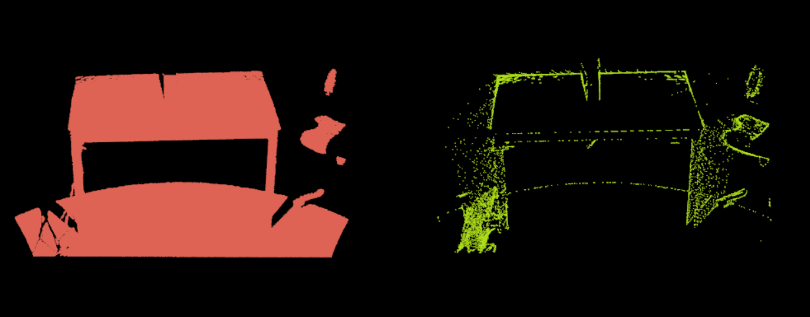
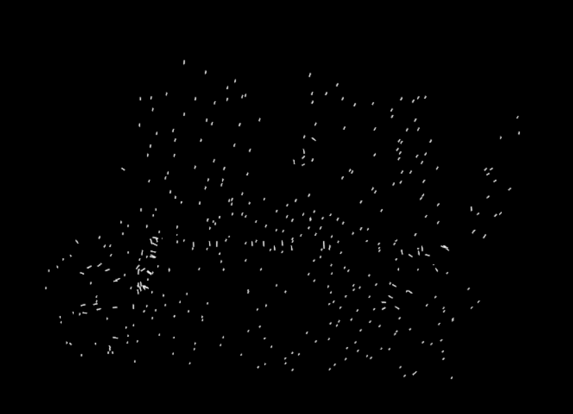
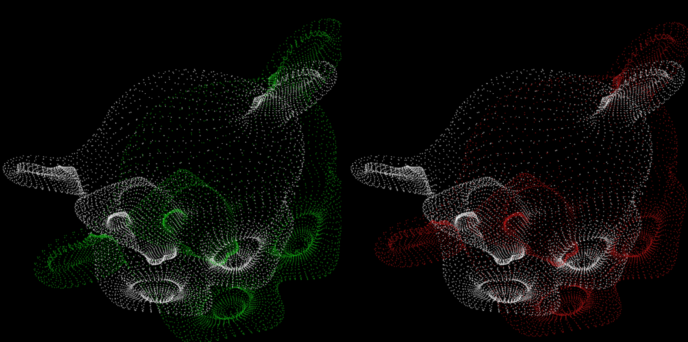
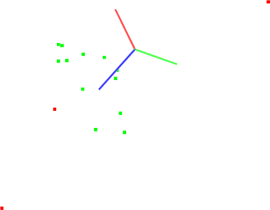

重新开始时，先来点开这个[文档](https://zhuanlan.zhihu.com/p/268524083)。还有黑马的这个[文档](https://robot.czxy.com/docs/pcl/chapter01/intro/)，基本按照这个来的。

上面那各文档来推荐了一个B站[视频](https://space.bilibili.com/504859351/channel/series)，作为一个入门了解。再来系统的学习文档。

如果版本更新后，代码里有报错，来[这里](https://blog.csdn.net/qq_58220938/article/details/123869036)看看有没有对应的解决办法。

常用的3D处理库：PCL、Open3d、CGAL，区别[对比教程](https://blog.csdn.net/dayuhaitang1/article/details/126293334)。
	对应的两个学习，偏软件工程，可做二开项目：[CloudCompare](https://github.com/CloudCompare/CloudCompare)、[meshlab](https://github.com/cnr-isti-vclab/meshlab)。

PCD数据下载地址：[官方的](https://github.com/PointCloudLibrary/data)、[这里](https://sourceforge.net/projects/pointclouds/files/PCD%20datasets/)、[其它](https://blog.csdn.net/sunnyrainflower/article/details/129440620)，

# PCL

[官网](https://pointclouds.org/)，[github](https://github.com/PointCloudLibrary/pcl/releases)。

​	win下plc安装目录的bin里有可直接使用的程序：pcl_viewer.exe a_name.pcd -ps 10  # 这查看点，后面应该是把点放大（后面的-ps参数应该是可以不要的）（或者是pcl_viewerd.exe，效果好像差不多，一个有颜色，里面挺多都能打开的)
如果要查看一个pcd文件，需要把bin路径加到环境变量：下面这样临时终端添加，方便使用

```powershell
set PATH=D:\program files\PCL 1.13.0\bin;D:\program files\PCL 1.13.0\3rdParty\FLANN\bin;D:\program files\PCL 1.13.0\3rdParty\Qhull\bin;D:\program files\PCL 1.13.0\3rdParty\OpenNI2\Tools;D:\program files\PCL 1.13.0\3rdParty\VTK\bin;%PATH% 
```

pcl_viewerd.exe使用技巧：

- 基本使用

  进入：`pcl_viewer xxxxx.pcd`

  帮助：在界面中输入h，可以在控制台看到帮助信息

  退出：界面中输入q

  放大缩小：鼠标滚轮 或 Alt + [+/-]

  平移：Shift+鼠标拖拽

  旋转：Ctrl+鼠标拖拽

- 其他技巧

  修改点颜色：数字1,2,3,4,5....9，重复按1可切换不同颜色方便观察

  放大缩小点：放大Ctrl+Shift+加号，缩小 Ctrl+减号

  保存截图：`j`

  显示颜色尺寸：`u`

  显示比例尺寸：`g`

  在控制列出所有几何和颜色信息：`l`

- 鼠标选点打印坐标

  选点模式进入：`pcl_viewer -use_point_picking bunny.pcd`

  选择指定点：shift+鼠标左键

## 概述

1. 点云Point Cloud是三维空间中，表达目标空间分布和目标表面特性的点的集合，点云通常可以从深度相机中直接获取，也可以从CAD等软件中生成。点云是用于表示多维点集合的数据结构，通常用于表示三维数据。
   在3D点云中，这些点通常代表采样表面的X，Y和Z几何坐标。当存在颜色信息时（请参见下图），点云变为4D。
2. 根据激光测量原理得到的点云，包含三维坐标信息(xyz)和激光反射强度信息（intensity），激光反射强度与仪器的激光发射能量、波长，目标的表面材质、粗糙程度、入射角相关。根据摄影测量原理得到的点云，包括三维坐标（xyz）和颜色信息（rgb）。结合两个原理的多传感器融合技术（多见于手持式三维扫描仪），能够同时得到这三种信息。
3. 三维图像有以下几种表现形式：
   - 深度图（描述物体与相机的距离信息）；
   - 几何模型（由CAD等软件生成）；
   - 点云模型（逆向工程设备采集生成）。
4. PCL 起初是 ROS(Robot Operating System )下由来自斯坦福大学的年轻博士Radu等人维护和开发的开源项目。此外，PCL是BSD授权方式，可以进行完全免费的商业和学术应用。
5. PCL（Point Cloud Library）是用于2D / 3D图像和点云处理的大型开源跨平台的C++编程库。PCL框架实现了大量点云相关的通用算法和高效的数据结构。内容涉及了点云的获取、滤波、分割、配准、检索、特征提取、特征估计，表面重建、识别、模型拟合、追踪、曲面重建、可视化等等，这些算法可用于从嘈杂的数据中过滤出异常值，将3D点云缝合在一起，分割场景的部分区域，提取关键点并计算描述符，根据物体的几何外观识别实际物体，创建表面点云并将其可视化。支持多种操作系统，可以在Windows、Linux、MacOS X、Android、部分嵌入式实时系统上运行。

一些常见的点云图如下 ：

- 人的侧脸3D：
  
- 一只兔子3D：
  
- 桌子及牛奶4D：
  

## 一、安装、Demo

linux：编译安装自己去看[文档](https://www.yuque.com/huangzhongqing/pcl/sgw7wt)(这个文档也是教程来源)吧，用到时再来完善。（别人[编译笔记](https://github.com/MNewBie/PCL-Notes/blob/master/chapter1.md)参考）

Windows：
	在PCL的[Release](https://github.com/PointCloudLibrary/pcl/releases)页面下载"PCL-1.13.0-AllInOne-msvc2022-win64.exe"(写的时候是最新版本)，然后安装就好了，环境变量先不添加，后续用到时手动去。
（注：安装过程可能会弹出OpenNI2的安装，那就指定好位置。也可能不会，我这次OpenNI2是自己就安装到了这个路径 C:\Program Files\OpenNI2\，然后去到"D:\program files\PCL 1.13.0\3rdParty\OpenNI2"这里面，运行它的.msi安装文件，先卸载了，再安装到这个路径，保持统一）

---

main.cpp：Demo的源码,成功运行后，就可以看到一个画面，缩放一下鼠标就能看到一只兔子

​	==一定注意自己给的库，如果是带d的debug动态库，就一定要在debug模型下，release下就会报错==。

```c++
#include <pcl/visualization/cloud_viewer.h>
#include <iostream>
#include <pcl/io/io.h>
#include <pcl/io/pcd_io.h>
#include <vtkAutoInit.h>
VTK_MODULE_INIT(vtkInteractionStyle);
VTK_MODULE_INIT(vtkRenderingFreeType);
//VTK_MODULE_INIT(vtkRenderingOpenGL);  # 教程是里这行，是错的，新的是下面这个库了，不该就会产生“无法解析的外部符号的错误”，就是因为库没被找到
VTK_MODULE_INIT(vtkRenderingOpenGL2);

int user_data;

void viewerOneOff(pcl::visualization::PCLVisualizer& viewer) {
	viewer.setBackgroundColor(1.0, 0.5, 1.0);
	pcl::PointXYZ o;
	o.x = 1.0;
	o.y = 0;
	o.z = 0;
	viewer.addSphere(o, 0.25, "sphere", 0);
	std::cout << "i only run once" << std::endl;

}

void viewerPsycho(pcl::visualization::PCLVisualizer& viewer) {
	static unsigned count = 0;
	std::stringstream ss;
	ss << "Once per viewer loop: " << count++;
	viewer.removeShape("text", 0);
	viewer.addText(ss.str(), 200, 300, "text", 0);

	//FIXME: possible race condition here:
	user_data++;
}

int main() {
	pcl::PointCloud<pcl::PointXYZRGBA>::Ptr cloud(new pcl::PointCloud<pcl::PointXYZRGBA>);
	pcl::io::loadPCDFile(R"(C:\Users\Administrator\Downloads\rabbit.pcd)", *cloud);

	pcl::visualization::CloudViewer viewer("Cloud Viewer");

	//blocks until the cloud is actually rendered
	viewer.showCloud(cloud);

	//use the following functions to get access to the underlying more advanced/powerful
	//PCLVisualizer

	//This will only get called once
	viewer.runOnVisualizationThreadOnce(viewerOneOff);

	//This will get called once per visualization iteration
	viewer.runOnVisualizationThread(viewerPsycho);
	while (!viewer.wasStopped()) {
		//you can also do cool processing here
		//FIXME: Note that this is running in a separate thread from viewerPsycho
		//and you should guard against race conditions yourself...
		user_data++;
	}
	return 0;
}
```

### 1.1. VS的.sln

- 1.添加Path的环境变量： （配置中的调试中的环境）

     > PATH=D:\program files\PCL 1.13.0\bin;D:\program files\PCL 1.13.0\3rdParty\FLANN\bin;D:\program files\PCL 1.13.0\3rdParty\Qhull\bin;D:\program files\PCL 1.13.0\3rdParty\OpenNI2\Tools;D:\program files\PCL 1.13.0\3rdParty\VTK\bin

- 2.添加头文件路径：

     > D:\program files\PCL 1.13.0\3rdParty\Boost\include\boost-1_80
     > D:\program files\PCL 1.13.0\3rdParty\Eigen\eigen3
     > D:\program files\PCL 1.13.0\3rdParty\FLANN\include
     > D:\program files\PCL 1.13.0\3rdParty\OpenNI2\Include
     > D:\program files\PCL 1.13.0\3rdParty\Qhull\include
     > D:\program files\PCL 1.13.0\3rdParty\VTK\include\vtk-9.2
     > D:\program files\PCL 1.13.0\include\pcl-1.13

- 3.添加库文件路径：

     > D:\program files\PCL 1.13.0\3rdParty\Boost\include\boost-1_80
     > D:\program files\PCL 1.13.0\3rdParty\Eigen\eigen3
     > D:\program files\PCL 1.13.0\3rdParty\FLANN\include
     > D:\program files\PCL 1.13.0\3rdParty\OpenNI2\Include
     > D:\program files\PCL 1.13.0\3rdParty\Qhull\include
     > D:\program files\PCL 1.13.0\3rdParty\VTK\include\vtk-9.2
     > D:\program files\PCL 1.13.0\include\pcl-1.13

- 4.添加对应库文件，区分Debug/Release版本： 如果是简单获取一个文件夹下的lib名的话，可以在cmd中用命令：`dir  *.lib  /B`
      库文件很多，手写不现实，用python代码获取:(看下面)

- 5.添加宏定义：属性-->c/c++-->预处理器-->预处理器定义
  
  - _CRT_SECURE_NO_WARNINGS     # 好像是f_open不安全，不定义这个就会报错
    _SCL_SECURE_NO_WARNINGS     # 后面这两个好像不给也行
    _SILENCE_FPOS_SEEKPOS_DEPRECATION_WARNING  # 是为了防止出现错误erroe c4996;\_Uninitialized_copy0
  
- 6.可能出现的错误：“功能测试宏的参数必须是简单的标识符”，解决办法：
     此刻：错误列表中默认是“生成+Intellisense”，将其改成"仅生成"就ok了。

#### python获取lib名称

```python
import os
def get_libs(path, release_suffix, debug_suffix, is_debug=True):
    outputs = ""
    # PCL的lib
    files = os.listdir(path)
    if is_debug:
        files = [file for file in files if file.endswith(debug_suffix)]
    else:  # release版本要把所有的debug版本去掉
        files = [file for file in files if (file.endswith(release_suffix) and not file.endswith(debug_suffix))]
    output = ";".join(files)
    outputs += output + ";"
    return outputs


if __name__ == '__main__':
    # 下面是获取PCL的lib库的，用来配置vs的环境，因为不知道要那些库，只能暂时都要了，还分debug和release版本
    # 1.pcl的    # 函数默认给的debug版本，is_debug改成false就是release版本
    pcl_libs = get_libs(r"D:\program files\PCL 1.13.0\lib", ".lib", "d.lib")  
    # 2.boost库，带有-gd-的是debug版本
    boost_libs = get_libs(r"D:\program files\PCL 1.13.0\3rdParty\Boost\lib", "-x64-1_80.lib", "-gd-x64-1_80.lib")
    # 3.Eign只需要头文件，没有库
    # 4.FLANN
    flann_libs = get_libs(r"D:\program files\PCL 1.13.0\3rdParty\FLANN\lib", ".lib", "-gd.lib")
    # 5.OpenNI2
    openni_lib = "OpenNI2.lib;"
    # 6.Qhull
    qhull_libs = get_libs(r"D:\program files\PCL 1.13.0\3rdParty\Qhull\lib", ".lib", "d.lib")
    # 7.VTK
    vtk_libs = get_libs(r"D:\program files\PCL 1.13.0\3rdParty\VTK\lib", ".lib", "gd.lib")
    # 全部连接在一起
    all_libs = pcl_libs + boost_libs + flann_libs + openni_lib + qhull_libs + vtk_libs
  print(all_libs)
```

### 1.2. CMake

- CMakeLists.txt：

  ```cmake
  cmake_minimum_required(VERSION 3.12) 
  project(pcl_example_project)
  set(CMAKE_BUILD_TYPE Debug)
  
  add_compile_definitions(_CRT_SECURE_NO_WARNINGS)  # 为了添加预定义宏
  
  # 这主要是针对win上的vs的cmake用的，不然它会把build弄到C盘里
  # 设置输出根目录为build/Debug
  set(OUTPUT_DIRECTORY_ROOT ${CMAKE_CURRENT_SOURCE_DIR}/build/${CMAKE_BUILD_TYPE})
  # 设置可执行程序输出到build/Debug/bin目录
  set(CMAKE_RUNTIME_OUTPUT_DIRECTORY "${OUTPUT_DIRECTORY_ROOT}/bin" CACHE PATH "Runtime directory" FORCE)
  # 设置库文件输出到build/Debug/lib目录
  set(CMAKE_LIBRARY_OUTPUT_DIRECTORY "${OUTPUT_DIRECTORY_ROOT}/lib" CACHE PATH "Library directory" FORCE)
  set(CMAKE_ARCHIVE_OUTPUT_DIRECTORY "${OUTPUT_DIRECTORY_ROOT}/lib" CACHE PATH "Archive directory" FORCE)
  
  
  find_package(PCL REQUIRED)
  
  add_executable(demo main.cpp)
  # 下面这一行和add_compile_definitions的作用是一样的，
  # target_compile_definitions(demo PRIVATE _CRT_SECURE_NO_WARNINGS)
  target_link_libraries(demo ${PCL_LIBRARIES})
  
  # 我没设置这个，发现这俩变量都能打出来
  message(STATUS "root: ${PCL_ROOT}")  #  D:/program files/PCL 1.13.0
  message(STATUS "dir: ${PCL_DIR}")   # D:/program files/PCL 1.13.0/cmake
  ```

- 必须去修改PCL中修改"D:\program files\PCL 1.13.0\cmake\PCLConfig.cmake"，问题就是因为Boost的原因，boost安装库的文档中我也说了，它的cmake有点问题，要手动去写头文件这些路径：

  ```cmake
  # 大概在PCLConfig.cmake文件126行左右
    # find_package(Boost 1.65.0 ${QUIET_} COMPONENTS system filesystem date_time iostreams serialization)   # 手动将这行注释掉
    
    # 不要它自己find了，我们手动添加
    set(Boost_INCLUDE_DIR "D:/program files/PCL 1.13.0/3rdParty/Boost/include/boost-1_80")
    set(Boost_LIBRARY_DIRS "D:/program files/PCL 1.13.0/3rdParty/Boost/lib")
    set(Boost_LIBRARIES libboost_atomic-vc143-mt-gd-x64-1_80.lib libboost_bzip2-vc143-mt-gd-x64-1_80.lib ...)  # 没写完，用python代码去拿全部写进来
    
    #set(BOOST_FOUND ${Boost_FOUND})
    set(BOOST_FOUND 1)   # 手动改成true
    
    set(BOOST_INCLUDE_DIRS "${Boost_INCLUDE_DIR}")
    set(BOOST_LIBRARY_DIRS "${Boost_LIBRARY_DIRS}")
    set(BOOST_LIBRARIES ${Boost_LIBRARIES})
  
    # 手动添加boost头文件、库文件路径
    include_directories(${BOOST_INCLUDE_DIRS})
    link_directories(${BOOST_LIBRARY_DIRS})
  ```

- 为了能在命令行运行，如果系统环境变量中没添加这些bin目录的话，就命令行set一下：
  
  > set PATH=D:\program files\PCL 1.13.0\bin;D:\program files\PCL 1.13.0\3rdParty\FLANN\bin;D:\program files\PCL 1.13.0\3rdParty\Qhull\bin;D:\program files\PCL 1.13.0\3rdParty\OpenNI2\Tools;D:\program files\PCL 1.13.0\3rdParty\VTK\bin;%PATH%

---

放这，PCL官方的cmake模板：

```cmake
# 安装后在CMakeLists.txt中指定PCL_DIR路径(即PCLConfig.cmake文件路径)即可：
set(PCL_DIR "/home/usr/pcl-1.9/share/pcl-1.9")
set(PCL_DIR "/home/hcq/software_ubuntu/pcl-1.11_compile/share/pcl-1.11")

find_package(PCL 1.9 REQUIRED COMPONENTS) # <<<<<<<<<<1.9
include_directories(${PCL_INCLUDE_DIRS})
link_directories(${PCL_LIBRARY_DIRS})
add_definitions(${PCL_DEFINATIONS})

add_executable (main main.cpp)
target_link_libraries (main ${PCL_LIBRARIES})
```

## 二、点云入门

### 2.1 PCD文件格式

一个典型的PCD文件如下：

> \# .PCD v.5 - Point Cloud Data file format 
> VERSION .5 
> FIELDS x y z      # 指定一个点的每一个维度和字段名字，例如
>
> > FIELDS x y z       # XYZ data
> > FIELDS x y z rgb   # XYZ + colors
> > FIELDS x y z normal_x normal_y normal_z   # XYZ + surface normals
>
> SIZE 4 4 4        # 指定每一个维度的字节数大小
> TYPE F F F        # 指定每一个维度的类型，I为int, U为uint, F则为float
> COUNT 1 1 1       # 指定每一个维度包含的元素数，如果没有COUNT，默认都为1
> WIDTH 397         # 点云数据集的宽度
> HEIGHT 1          # 点云数据集的高度
> VIEWPOINT 0 0 0 1 0 0 0  # 指定点云获取的视点和角度，在不同坐标系之间转换时使用（由3个平移+4个四元数构成）
> POINTS 397        # 总共的点数
> DATA ascii        # 存储点云数据的数据类型，有ASCII和binary
> 0.0054216 0.11349 0.040749 
> -0.0017447 0.11425 0.041273 
> -0.010661 0.11338 0.040916 
> 0.026422 0.11499 0.032623 
> 0.024545 0.12284 0.024255 
> 0.034137 0.11316 0.02507

还有除PCD以为的其它格式：

- PLY：一种多边形文件格式；
- STL：主要应用于CAD、CAM领域；
- OBJ：是从几何学上定义的文件格式。

---

基本类型：
	PCL的基本数据类型是==PointCloud==，它是一个c++模板类，包含了以下字段：

- "width(int)": 指定点云数据集的宽度
  - 对于无组织格式的数据集，width代表了所有点的总数；
  - 对于有组织格式的数据集，width代表了一行中的总点数。
- "height(int)": 指定点云数据集的高度
  - 对于无组织格式的数据集，height的值为1；
  - 对于有组织格式的数据集，height表示总行数。
- "points(std::vector<PointT\>)":包含所有PointT类型的点的数据列表。

衍生类型：

1. PointXYZ - float x,y,z
2. PointXYZI - float x,y,z,intensity
3. PointXYZRGB - float x,y,z,rgb
4. PointXYZRGBA - float x,y,z,uint_t rgba
5. Normal - float normal[3], curvature 法线方向, 对应的曲率的测量值
6. PointNormal - float x,y,z,normal[3],curvature采样点,法线和曲率
7. Histogram - float histogtam[N]用于存储一般用途的n维直方图

---

==序列化+反序列化==（可保存成明文或是二进制的格式）

```c++
#include <iostream>
#include <pcl/io/pcd_io.h>
#include <pcl/point_types.h>

// 序列化
void serialize() {
	pcl::PointCloud<pcl::PointXYZ> cloud;
	// 随机生成5个点
	cloud.width = 5;
	cloud.height = 1;
	cloud.is_dense = false;
	cloud.points.resize(cloud.width * cloud.height);

	for (auto &point : cloud) {
		point.x = 1024 * rand() / (RAND_MAX + 1.0f);
		point.y = 1024 * rand() / (RAND_MAX + 1.0f);
		point.z = 1024 * rand() / (RAND_MAX + 1.0f);
	}
	pcl::io::savePCDFileASCII("test_pcd.pcd", cloud);  // 保存成明文
	pcl::io::savePCDFileBinary("test_pcl_bin.pcd", cloud); // 保存成二进制
	pcl::io::savePCDFile("123.pcd", cloud, false);  // flase是存明文，true是存二进制
	std::cout << "Saved" << cloud.size() << "data points to test_pcd.pcd" << std::endl;
}

// 反序列化,将点云数据加载到PointCloud对象中
void deserialize() {
	pcl::PointCloud<pcl::PointXYZ>::Ptr cloud(new pcl::PointCloud<pcl::PointXYZ>);
	if (pcl::io::loadPCDFile("test_pcd", *cloud) == 1) {
		PCL_ERROR("READ ERROR!");  // PCL中定义的宏
		return;
	}
	std::cout << "Load " << cloud->width * cloud->height << "data points" << std::endl;

	// 打印方式一
	for (size_t i = 0; i < cloud->points.size(); ++i) {
		std::cout << "  " << cloud->points[i].x << " " << cloud->points.at(i).y << " " << cloud->points[i].z << std::endl;
	}
	// 打印方式二
	for (auto &point : *cloud) {
		std::cout << "  " << point.x << " " << point.y << " " << point.z << std::endl;
	}
}
```

### 2.2 数据可视化

还要来根据[这个代码](https://github.com/MNewBie/PCL-Notes/blob/master/chapter7.md)，把这里完善了。

1、采用==回调函数==的方式来设置显示的窗口：

```c++
#include <iostream>
#include <pcl/io/io.h>
#include <pcl/io/pcd_io.h>
#include <pcl/visualization/cloud_viewer.h>

int user_data;
void viewerOneOff(pcl::visualization::PCLVisualizer& viewer) {
	// 设置背景色为粉红色
	viewer.setBackgroundColor(1.0, 0.5, 1.0);
	pcl::PointXYZ o;
	o.x = 1.0;
	o.y = 0;
	o.z = 0;
	// 添加一个圆心为o，半径为0.25m的球体
	viewer.addSphere(o, 0.25, "sphere", 0);
	std::cout << "I only run once" << std::endl;
}
void viewerPsycho(pcl::visualization::PCLVisualizer& viewer) {
	static unsigned count = 0;
	std::stringstream ss;
	ss << "Once per viewer loop: " << count++;
	// 每次刷新时，移除text，添加新的text
	viewer.removeShape("text", 0);
	viewer.addText(ss.str(), 200, 300, "text", 0);

	//FIXME: possible race condition here:
	user_data++;
}

int main(int argc, char **argv) {
	// 创建点云的智能指针
	pcl::PointCloud<pcl::PointXYZRGBA>::Ptr cloud(new pcl::PointCloud<pcl::PointXYZRGBA>);
	// 加载pcd
	pcl::io::loadPCDFile("rabbit.pcd", *cloud);
	pcl::visualization::CloudViewer viewer("Cloud Viewer");
	// 这会一直阻塞，直到点云被渲染
	viewer.showCloud(cloud);
	
	// 只会调用一次，（非必须）
	viewer.runOnVisualizationThreadOnce(viewerOneOff);
	// 每次可视化迭代都会调用一次（频繁调用） (非必须)
	viewer.runOnVisualizationThread(viewerPsycho);

	// 一直循环，直到按q退出
	while (!viewer.wasStopped()) {
		// 这里就可以对点云做很多处理
		user_data++;
	}
	return 0;
}
```

2、直接去设置格式做显示：

```c++
#include <iostream>
#include <pcl/io/io.h>
#include <pcl/io/pcd_io.h>
#include <pcl/visualization/cloud_viewer.h>

int main(int argc, char **argv) {
	// 点云数据指针
	pcl::PointCloud<pcl::PointXYZ>::Ptr cloud(new pcl::PointCloud<pcl::PointXYZ>);
	pcl::io::loadPCDFile("rabbit.pcd", *cloud);

	// 创建PCLVisualizer
	boost::shared_ptr<pcl::visualization::PCLVisualizer> viewer(new pcl::visualization::PCLVisualizer("3D Viewer"));
	// 设置背景为灰色（非必须）
	viewer->setBackgroundColor(0.05, 0.05, 0.05, 0);

	// 添加一个普通点云（可以指定颜色，也可以去掉single_color参数不设置）
	pcl::visualization::PointCloudColorHandlerCustom<pcl::PointXYZ> single_color(cloud, 0, 255, 255); // 指点点云颜色
	viewer->addPointCloud<pcl::PointXYZ>(cloud, single_color, "sample cloud");
	viewer->setPointCloudRenderingProperties(pcl::visualization::PCL_VISUALIZER_POINT_SIZE, 3, "sample cloud");

	// 添加一个0.5倍缩放的坐标系（非必须）
	viewer->addCoordinateSystem(0.5);
	// 按q退出
	while (!viewer->wasStopped()) {
		// 每次循环调用内部的重绘函数
		viewer->spinOnce();
	}
	return 0;
}
```

### 2.3 common模块

​	主要是包含了PCL库常用的公共数据结构和方法，比如PointCloud的类和许多用于表示点，曲面，法向量，特征描述等点的类型，用于计算距离，均值以及协方差，角度转换以及几何变化的函数。

使用，如：#include \<pcl/common/angles.h>

common模块中的头文件：

1. angles.h：定义了标准的C接口的角度计算函数;
2. centriod.h：定义了中心点的估算以及协方差矩阵的计算;
3. commo.h：标准的C以及C++类，是其他common 函数的父类;
4. distance.h：定义标准的C接口用于计算距离;
5. file_io.h：定义了一些文件帮助写或者读方面的功能;
6. random.h：定义一些随机点云生成的函数;
7. geometry：定义一些基本的几何功能的函数;
8. intersection.h：定义线与线相交的函数;
9. norm.h：定义了标准的C方法计算矩阵的正则化;
10. time.h：定义了时间计算的函数;
11. Point_types.h：定义了所有PCL实现的点云的数据结构的类型。

common模块的基本函数：（不同函数要注意导入上面对应的头文件才有）更细的看[这](https://www.yuque.com/huangzhongqing/pcl/uv5cn9)、[这](https://www.cnblogs.com/li-yao7758258/p/10126363.html)。

- 从弧度到角度：pcl::rad2deg(float alpha): 
- 从角度到弧度：pcl::deg2rad(float alpha): 
- 正则化角度在（-PI，PI）之间：pcl::normAngle(float alpha):
- 计算给定一群点的3D中心点，并且返回一个三维向量：
  pcl::compute3DCentroid (const pcl::PointCloud< PointT > &cloud, Eigen::Matrix< Scalar, 4, 1 > &centroid)
- 计算给定的三维点云的协方差矩阵：
  pcl::computeCovarianceMatrix (const pcl::PointCloud< PointT > &cloud, const Eigen::Matrix< Scalar, 4, 1 > &centroid, Eigen::Matrix< Scalar, 3, 3 > &covariance_matrix)
- 计算正则化的3*3的协方差矩阵以及给定点云数据的中心点：
  pcl::computeMeanAndCovarianceMatrix (const pcl::PointCloud< PointT > &cloud, Eigen::Matrix< Scalar, 3, 3 > &covariance_matrix, Eigen::Matrix< Scalar, 4, 1 > &centroid
- 计算两个向量之间的角度:
  pcl::getAngle3D (const Eigen::Vector4f &v1, const Eigen::Vector4f &v2, const bool in_degree=false)
- 同时计算给定点云数据的均值和标准方差:
  pcl::getMeanStd (const std::vector< float > &values, double &mean, double &stddev)
- 在给定边界的情况下，获取一组位于框中的点:
  pcl::getPointsInBox (const pcl::PointCloud< PointT > &cloud, Eigen::Vector4f &min_pt, Eigen::Vector4f &max_pt, std::vector< int > &indices)
- 给定点云数据中点与点之间的最大距离的值:
  pcl::getMaxDistance (const pcl::PointCloud< PointT > &cloud, const Eigen::Vector4f &pivot_pt, Eigen::Vector4f &max_pt)
- 获取点直方图上的最小值和最大值:
  pcl::getMinMax (const PointT &histogram, int len, float &min_p, float &max_p)
- 根据给定的多边形的点云计算多边形的面积:
  pcl::calculatePolygonArea (const pcl::PointCloud< PointT > &polygon)
- 获取点到线的平方距离（由点和方向表示）:
  pcl::sqrPointToLineDistance (const Eigen::Vector4f &pt, const Eigen::Vector4f &line_pt, const Eigen::Vector4f &line_dir)
- 确定最小特征值及其对应的特征向量:
  pcl::eigen22 (const Matrix &mat, typename Matrix::Scalar &eigenvalue, Vector &eigenvector)
- 计算3x3矩阵的行列式:
  pcl::determinant3x3Matrix (const Matrix &matrix)
- 计算2x2矩阵的逆:
  pcl::invert2x2 (const Matrix &matrix, Matrix &inverse)
- 从给定的变换矩阵中提取欧拉角:
  pcl::getEulerAngles (const Eigen::Transform< Scalar, 3, Eigen::Affine > &t, Scalar &roll, Scalar &pitch, Scalar &yaw)

#### 2.3.1 矩阵变换

如果是传参的方式，传递pcd或ply文件，可以参考[这个](https://github.com/HuangCongQing/pcl-learning/blob/master/00base/01matrix_transform/matrix_transform.cpp)代码。PCL有对参数的解析代码。

```c++
#include <iostream>

#include <pcl/io/pcd_io.h>
#include <pcl/io/ply_io.h>
#include <pcl/point_cloud.h>
#include <pcl/common/transforms.h>  // 要这个头文件
#include <pcl/visualization/pcl_visualizer.h>

int main(int argc, char **argv) {
	pcl::PointCloud<pcl::PointXYZ>::Ptr source_cloud(new pcl::PointCloud<pcl::PointXYZ>());
	if (pcl::io::loadPCDFile("rabbit.pcd", *source_cloud) < 0) {
		std::cout << "Error loading point cloud file!" << std::endl;
		return -1;
	}

	// 方式一：使用 Matrix4f
	Eigen::Matrix4f transform_1 = Eigen::Matrix4f::Identity();
	// 定义一个旋转矩阵(see https://en.wikipedia.org/wiki/Rotation_matrix)
	float theta = M_PI / 4;  // 旋转角度，注意是弧度制
	transform_1(0, 0) = cos(theta);
	transform_1(0, 1) = -sin(theta);
	transform_1(1, 0) = sin(theta);
	transform_1(1, 1) = cos(theta);
	transform_1(0, 3) = 2.5;  // 在x轴上定义一个2.5m的偏移
	std::cout << transform_1 << "\n\n" << std::endl;  // 可直接打印

	// 方式二：使用 Affine3f
	Eigen::Affine3f transform_2 = Eigen::Affine3f::Identity();
	transform_2.translation() << 0.8, 0.0, 0.0;  // 在x轴偏移0.8m
	// 绕Z轴先转45度（逆时针）
	transform_2.rotate(Eigen::AngleAxisf(theta, Eigen::Vector3f::UnitZ()));
    // 还可以缩放
    transform_2.scale(0.5);  // 缩小一倍
	std::cout << transform_2.matrix() << "\n\n" << std::endl;

	// 定义变化后的点云指针并执行变换得到变换后数据
	pcl::PointCloud<pcl::PointXYZ>::Ptr transformed_cloud(new pcl::PointCloud<pcl::PointXYZ>());
	// transform_2也是一样的,需要<pcl/common/transforms.h>头文件
	pcl::transformPointCloud(*source_cloud, *transformed_cloud, transform_1); 

	// 可视化
	std::cout << "白色：原始点云\n" << "红色：变换后的点云" << std::endl;
	pcl::visualization::PointCloudColorHandlerCustom<pcl::PointXYZ> source_cloud_color_handler(source_cloud, 255, 255, 255);  // 定义初始点云颜色
	pcl::visualization::PointCloudColorHandlerCustom<pcl::PointXYZ> transformed_cloud_color_handler(transformed_cloud, 255, 0, 0);  // 定义变换后点云颜色

	pcl::visualization::PCLVisualizer viewer("Matrix transformation example");
	// 把点云添加进可视窗口，并把颜色传递进去
	viewer.addPointCloud(source_cloud, source_cloud_color_handler, "original_cloud");
	viewer.addPointCloud(transformed_cloud, transformed_cloud_color_handler, "transformed_cloud");

	// 设置坐标系系统
	viewer.addCoordinateSystem(0.5, "cloud", 0);
	// 设置背景颜色(黑灰色)
	viewer.setBackgroundColor(0.05, 0.05, 0.05, 0);
	// 设置渲染属性(点大小)
	viewer.setPointCloudRenderingProperties(pcl::visualization::PCL_VISUALIZER_POINT_SIZE, 2, "original_cloud");
	viewer.setPointCloudRenderingProperties(pcl::visualization::PCL_VISUALIZER_POINT_SIZE, 2, "transformed_cloud");  // 注意后面这个名字跟上面46行的保持一致
	// 设置可是窗口位置（非必须）
	viewer.setPosition(800, 400);
	// 一直循环，直到按q退出
	while (!viewer.wasStopped()) {
		viewer.spinOnce();
	}
	return 0;
}
```

结果：


### 2.4 KdTree

​	概述：一般通过3D相机（雷达、激光扫描、立体相机）获取到的点云，一般数据量较大，分布不均匀，就要对这些离散的点之间建立拓扑关系，包括BSP树，k-d tree、KDB tree、R tree、CELL tree、八叉树等，从而实现点云的将采样、计算特征向量、点云匹配、点云拆分等功能。

​	索引结构中相似性查询有两种基本的方式：一种是范围查询（range searches），另一种是K近邻查询（K-neighbor searches）。范围查询就是给定查询点和查询距离的阈值，从数据集中找出所有与查询点距离小于阈值的数据；K近邻查询是给定查询点及正整数K，从数据集中找到距离查询点最近的K个数据，当K=1时，就是最近邻查询（nearest neighbor searches）。

k-d tree（ k-dimensional tree）：主要是==范围搜索==和==最近邻居搜索==。更细的原理看[这里](https://robot.czxy.com/docs/pcl/chapter01/decomposition/#k-d-tree)。

> `pcl::search::KdTree<PointT>`是`pcl::search::Search< PointT >`的子类，是`pcl::KdTree<PointT>`的包装类。包含(1) k 近邻搜索；(2) 邻域半径搜索。

下面是KdTree的两种搜索方式的代码实现：

```c++
#include <iostream>
#include <vector>
#include <ctime>
#include <random>

#include <pcl/point_cloud.h>
#include <pcl/kdtree/kdtree_flann.h>
#include <pcl/visualization/pcl_visualizer.h>


int main(int argc, char **argv) {
	// 用系统时间初始化随机种子
	std::srand((unsigned int)time(NULL));

	pcl::PointCloud<pcl::PointXYZ>::Ptr cloud(new pcl::PointCloud<pcl::PointXYZ>());
	// 生成1000个点云数据 (也可以读取一个pcd文件，作为现成的点云数据来使用)
	cloud->width = 1000;
	cloud->height = 1;     // height为1代表无序点云，前面数据格式介绍过
	cloud->points.resize(cloud->width * cloud->height);

	// 给点云填充数据 0 - 1023 
	std::uniform_int_distribution<unsigned> u(0, 102300);
	std::default_random_engine e;
	for (auto &point : cloud->points) {
		//point.x = 1024.0f * rand() / (RAND_MAX + 1.0f);
		point.x = static_cast<float>(u(e)) / 100.0f;
		point.y = 1024.0f * rand() / (RAND_MAX + 1.0f);
		point.z = 1024.0f * rand() / (RAND_MAX + 1.0f);
	}

	//for (auto &point : cloud->points) {
	//	std::cout << point.x << "  " << point.y << "  " << point.z << std::endl;
	//}
	
	// 创建KdTree的实现类KdTreeFLANN
	pcl::KdTreeFLANN<pcl::PointXYZ> kdtree;
	//pcl::search::KdTree<pcl::PointXYZ> kdtree;  // 一个意思，需要<pcl/search/kdtree.h>头文件，或许也还要<pcl/search/impl/search.hpp>
	// 设置搜索空间，把cloud作为输入
	kdtree.setInputCloud(cloud);

	// 初始化一个随机的点，作为查询点
	pcl::PointXYZ searchPoint;
	searchPoint.x = 1024.0f * rand() / (RAND_MAX + 1.0f);
	searchPoint.y = 1024.0f * rand() / (RAND_MAX + 1.0f);
	searchPoint.z = 1024.0f * rand() / (RAND_MAX + 1.0f);

	// 方式一：搜索K个最近邻居
	int K = 10;  // 表示搜索10个临近点
	std::vector<int> pointIdxNKNSearch(K);  // 保存搜索到的临近点的索引
	std::vector<float> pointNKNSquareDistance(K);  // 保存对应临近点的距离的平方
	// 返回大于了0个近邻，就将其打印出来
	if (kdtree.nearestKSearch(searchPoint, K, pointIdxNKNSearch, pointNKNSquareDistance) > 0) {
		for (size_t i = 0; i < pointIdxNKNSearch.size(); ++i) {
			int idx = pointIdxNKNSearch.at(i);
			auto &points = cloud->points;
			std::cout << "  " << points.at(idx).x << " " << points[idx].y << " " << points[idx].z << " (距离平方: " << pointNKNSquareDistance.at(i) << ")" << std::endl;
		}
	}
	std::cout << "\nhello\n" << std::endl;

	// 方式二：通过指定半径搜索
	std::vector<int> pointIxdRadiusSearch;
	std::vector<float> pointRadiusSquareDistance;

	float radius = 256.0f;  // 半径过小后，可能找不到的。
	// 这里的返回值是一个整型，就代表找到的个数。
	if (kdtree.radiusSearch(searchPoint, radius, pointIxdRadiusSearch, pointRadiusSquareDistance) > 0) {

		for (size_t i = 0; i < pointIxdRadiusSearch.size(); ++i) {
			int idx = pointIxdRadiusSearch.at(i);
			auto &points = cloud->points;
			std::cout << "  " << points[idx].x << " " << points[idx].y << " " << points[idx].z << " (距离平方: " << pointRadiusSquareDistance[i] << std::endl;
		}
	}

	pcl::visualization::PCLVisualizer viewer("PCLViewer");
	viewer.setBackgroundColor(0.0, 0.0, 0.5);
	viewer.addPointCloud<pcl::PointXYZ>(cloud, "cloud");

	pcl::PointXYZ originalPoint(0.0, 0.0, 0.0);
	// 添加从原点到搜索点的线段（后面是指定颜色，可以不要）
	viewer.addLine(originalPoint, searchPoint, 0.9, 0.9, 0.0);
	// 添加一个以搜索点为圆心，搜索半径为半径的球体 (颜色参数也可以不要)
	viewer.addSphere(searchPoint, radius, 0.0, 0.5, 0.0, "sphere", 0);
	// 添加一个放大200倍后的坐标系 (因为点的坐标值都太大了(上面随机数是0~1023)，所以放大看)
	viewer.addCoordinateSystem(200);


	// 按q退出，这三行也等同于  viewer.spin();
	while (!viewer.wasStopped()) {
		viewer.spinOnce();
	}
	return 0;
}
```

效果：


### 2.5 Octree(八叉树)

点云压缩：

> 这一点似乎跟八叉树关系不大， 但[这个教程](https://www.yuque.com/huangzhongqing/pcl/habl9h)里面写到这里来了，就放这里吧。
>
> PCL 提供了点云的压缩功能，它允许编码压缩所有类型的点云。
>
> OpenNI 2.0 API（应用程序编程接口）提供了访问PrimerSense的兼容深度传感器。这就使得一个应用程序能够初始化传感器和从设备接收深度(depth)，彩图(RGB)和红外(IR)视频流，还提供了一个统一的接口给传感器和通过深度传感器创建.oni记录文件。
>
> OpenNI也提供了第三方中间件开发者可以相互使用深度传感器的统一接口。应用程序还能用第三方中间件（如NITE2），也可以使用直接由OpenNI提供的基础的深度和视频数据。
>
> 注意：因为它的代码没有跑通，所以就先不放这里了。

---

​	八叉树（Octree）是一种用于描述三维空间的树状数据结构。八叉树的每个节点表示一个正方体的体积元素，每个节点有八个子节点，这八个子节点所表示的体积元素加在一起就等于父节点的体积。

- 一般中心点作为节点的分叉中心。
- 八叉树若不为空树的话，树中任一节点的子节点恰好只会有八个，或零个，也就是子节点不会有0与8以外的数目。
- 分割一直要进行到节点所对应的立方体或是完全空白，或是完全为V占据，或是其大小已是预先定义的体素大小，并且对它与V之交作一定的“舍入”，使体素或认为是空白的，或认为是V占据的。


注：这里引入了一个概念：`Voxel`翻译为体积元素，简称体素。描述了一个预设的最小单位的正方体

三种搜索方式：

1. 体素近邻搜索；
2. K近邻搜索；
3. 半径内近邻搜索。

```c++
#include <iostream>
#include <vector>
#include <ctime>

#include <pcl/point_cloud.h>  // 点云头文件
#include <pcl/octree/octree.h>  // 八叉树头文件
#include <pcl/visualization/cloud_viewer.h>  // 可视化头文件

#define PRINT_POINT_DISTANCE( point, distance ) \
	std::cout << "(" << point.x  << ", "<< point.y << ", " << point.z << ")." \
		<< " squared distance: " << distance << std::endl

#define PRINT_POINT( point ) \
	std::cout << "(" << point.x  << ", "<< point.y << ", " << point.z << ")" << std::endl


int main(int argc, char* argv[]) {
	std::srand((unsigned int)time(NULL));  // 用系统时间初始化随机种子
	pcl::PointCloud<pcl::PointXYZ>::Ptr cloud(new pcl::PointCloud<pcl::PointXYZ>);

	// 创建点云数据
	cloud->width = 1000;
	cloud->height = 1;  // 无序
	cloud->points.resize(cloud->height * cloud->width);
	// 随机循环产生点云的坐标值(产生0-1023的随机值，上面有写到过，用的是for循环)
	// 它本质就是一个STL容器，可以用pcl::PointCloud<pcl::PointXYZ>::iterator iter = cloud->begin()进行循环
	for(auto &point : cloud->points) {
		point.x = 1024.0f * rand() / (RAND_MAX + 1.0f);
		point.y = 1024.0f * rand() / (RAND_MAX + 1.0f);
		point.z = 1024.0f * rand() / (RAND_MAX + 1.0f);
	}

	/*
	创建一个octree实例，用设置分辨率进行初始化，该octree用它的页结点存放点索引向量，
	分辨率参数描述最低一级octree的最小体素的尺寸，因此octree的深度是分辨率和点云空间维度的函数，
	如果知道点云的边界框，应该用defineBoundingbox方法把它分配给octree然后通过点云指针把所有点增加到octree中。
	*/
	// 该参数描述了octree叶子leaf节点的最小体素尺寸
	float resolution = 128.0;  // 设置分辨率为128
	pcl::octree::OctreePointCloudSearch<pcl::PointXYZ> octree(resolution);
	// 设置输入点云
	octree.setInputCloud(cloud);  // 这两句是最关键的建立PointCloud和octree之间的联系
	octree.addPointsFromInputCloud();  // 构建octree

	pcl::PointXYZ searchPoint;  // 设置搜索点
	searchPoint.x = 1024.f * rand() / (RAND_MAX + 1.0f);
	searchPoint.y = 1024.f * rand() / (RAND_MAX + 1.0f);
	searchPoint.z = 1024.f * rand() / (RAND_MAX + 1.0f);
	//pcl::PointXYZ searchPoint = cloud->points.at(10);

	/* Neighbors within voxel search
	方式一：“体素近邻搜索”，它把查询点所在的体素中其它点的索引作为查询结果返回，
		结果以点索引向量的形式保存，因此搜索点和搜索结果之间的距离取决于八叉树的分辨率参数
	*/
	std::vector<int> pointIdxVec;
	if (octree.voxelSearch(searchPoint, pointIdxVec)) {
		std::cout << "Neighbors within voxel search at ";
		PRINT_POINT(searchPoint);
		std::vector<int>::const_iterator iter = pointIdxVec.cbegin();
		for (; iter != pointIdxVec.cend(); ++iter) {
			std::cout << "  ";
			PRINT_POINT(cloud->points.at(*iter));
		}
	}
	std::cout << pointIdxVec.size() << std::endl;

	/*  K nearest neighbor search
	方式二：K近邻搜索，本例中k设为10，这会把搜索结果写到两个分开的向量中
	*/
	int K = 10;
	std::vector<int> pointIdxNKNSearch;  // 包含搜索结果，即结果点的索引的向量
	std::vector<float> pointNKNSquareDistance;  // 保存相应的搜索点和近邻之间的距离平方

	if (octree.nearestKSearch(searchPoint,K, pointIdxNKNSearch, pointNKNSquareDistance) > 0) {
		std::cout << "\nK nearest neighbor search at ";
		PRINT_POINT(searchPoint);
		for (size_t i = 0; i < pointIdxNKNSearch.size(); ++i) {
			PRINT_POINT_DISTANCE(cloud->points.at(pointIdxNKNSearch[i]), pointNKNSquareDistance.at(i));
		}
	}

	/* Neighbors within radius search
	方式三：半径内近邻搜索，和方式二类似
	*/
	std::vector<int> pointIdxRadiusSearch;
	std::vector<float> pointRadiusSquareDistance;

	float radius = 256.0f * rand() / (RAND_MAX + 1.0f);
	if (octree.radiusSearch(searchPoint, radius, pointIdxRadiusSearch, pointRadiusSquareDistance) > 0) {
		std::cout << "\nNeighbors within radius search at ";
		PRINT_POINT(searchPoint);
		std::cout << "radius: " << radius; 
		for (size_t i = 0; i < pointIdxRadiusSearch.size(); ++i) {
			PRINT_POINT_DISTANCE(cloud->points.at(pointIdxRadiusSearch.at(i)), pointRadiusSquareDistance[i]);  // 宏：打印
		}
	}

	pcl::visualization::PCLVisualizer viewer("PCL Viewer");
	viewer.setBackgroundColor(0.0, 0.0, 0.5);
	viewer.addPointCloud<pcl::PointXYZ>(cloud, "cloud");

	pcl::PointXYZ originPoint(0.0, 0.0, 0.0);
	viewer.addLine(originPoint, searchPoint);  // 添加原点到搜索点的线
	viewer.addSphere(searchPoint, radius, "sphere", 0);  // 添加一个球
	viewer.addCoordinateSystem(200);  // 添加一个放到200倍后的坐标系

	while (!viewer.wasStopped()) {
		viewer.spinOnce();
	}
	return 0;
}
```

效果：（每次结果不尽相同，因为很多参数是每次随机的）


---

此外，PCL的bin路径下，有对应查看octree的exe，名为`pcl_octree_viewer.exe`,使用方式：

pcl_octree_viewer.exe <pcd file\> <resolution\>。如：pcl_octree_viewer.exe rabbit.pcd 0.0001

效果：


翻译这个界面的按钮名字：

- a -> 增加显示深度（减小体素大小）
- z -> 降低显示深度（增加体素大小）
- v -> 隐藏或显示octree立方体
- b -> 隐藏或显示体素中心点
- n -> 隐藏或显示原始点云
- q -> 退出

## 三、点云进阶

### 学习目标

- 能够进行点云滤波Filtering
  - 能够使用直通滤波PassThrough处理点云
  - 能够对点云进行降采样DownSampling
  - 能够独立使用工具进行降采样
- 能够能够从点云创建深度图；
- 能够从深度图中提取边界；
- 能够理解关键点的概念和算法；
- 能够理解采样一致性算法RANSAC；
- 能够说出特征描述与提取的作用
  - 能够理解特征点；
  - 能够进行表面法向量估算；
- 能够提取点云的PFH描述子。

### 3.1 点云滤波Filtering

应用场景：

- 点云数据密度不规则需要平滑处理；
- 去除因为遮挡等问题造成离群点
- 数据量较大，需要进行下采样（DownSample）
- 去除噪声数据。

PCL点云格式分为有序点云和无序点云：

- 针对有序点云提供了：双边滤波、高斯滤波、中值滤波等；
- 针对无序点云提供了：体素栅格、随机采样等。

下图显示了一个噪声消除的示例。 由于测量误差，某些数据集会出现大量阴影点。 这使局部点云3D特征的估算变得复杂。==通过对每个点的邻域进行统计分析，并修剪掉不符合特定条件的那些异常值，进而可以过滤掉某些异常值==。

​	PCL中的实现这些稀疏离群值的消除，需要计算数据集中的点与邻居距离的分布。 即对于每个点，都会计算从它到所有相邻点的平均距离。 通过假设结果分布是具有均值和标准差的高斯分布，可以将那些平均距离在【==由全局距离均值和标准差定义的区间==】之外的所有点视为离群值，并将之从数据集中进行修剪。


#### 3.1.1 PassThrough-直通滤波

PassThrough：简单来说就是，剔除范围外的点，下面的代码就是把z的值不在0~1的就剔除掉。那么通过重复使用，就可以进行三维空间的滤波

```c++
#include <iostream>

#include <pcl/point_types.h>
#include <pcl/filters/passthrough.h>  // 这个头文件
#include <pcl/visualization/cloud_viewer.h>

#define PRINT_POINT( point ) \
	std::cout << "(" << point.x  << ", "<< point.y << ", " << point.z << ")" << std::endl

int main(int argc, char* argv[]) {
	pcl::PointCloud<pcl::PointXYZ>::Ptr cloud(new pcl::PointCloud<pcl::PointXYZ>());
	pcl::PointCloud<pcl::PointXYZ>::Ptr cloud_filtered(new pcl::PointCloud<pcl::PointXYZ>());

	cloud->width = 5;
	cloud->height = 1;
	cloud->points.resize(cloud->width * cloud->height);
	for (auto &point : cloud->points) {
		point.x = 2 * rand() / (RAND_MAX + 1.0f);
		point.y = 2 * rand() / (RAND_MAX + 1.0f);
		point.z = 2 * rand() / (RAND_MAX + 1.0f);
	}

	std::cout << "filtering before filtering: " << std::endl;
	for (auto &point : cloud->points) {
		PRINT_POINT(point);
	}

	// 创建一个过滤的对象（一次只能一个轴，多个轴可以考虑多用几次）
	pcl::PassThrough<pcl::PointXYZ> passThrough;
	passThrough.setInputCloud(cloud);  // 1.设置输入源
	passThrough.setFilterFieldName("z");  // 2.设置过滤时所需要点云类型的Z字段
	passThrough.setFilterLimits(0.0, 1.0);  // 3.设置过滤范围(在这个范围内的保留)
	passThrough.filter(*cloud_filtered);  // 4.执行过滤，结果输出到cloud_filtered
	std::cout << "\nCloud after filtering" << std::endl;
	for (size_t i = 0; i < cloud_filtered->points.size(); ++i) {
		PRINT_POINT(cloud_filtered->points.at(i));  // 宏：打印
	}

	pcl::visualization::CloudViewer viewer("Cloud Viewer");
	
	// 这里会一直阻塞直到点云被渲染
	viewer.showCloud(cloud);
	while (!viewer.wasStopped()) {}
	return 0;
}
```

一次输出结果：


从上面代码中的“z”来看，不在0~1之间的点就被剔除掉了。

注：老版本可以`passThrough.setFilterLimitsNegative (true);`，则以上结果取反。新版本没有这个API了，或许是改变了。

#### 3.1.2 下采样(VoxelGrid&&UniformSampling)

这里写两个下采样的引用实例：

1. ==VoxelGrid==：通过体素网格实现降采样，可以在减少点数量的同时，保证点云的形状特征，可以提高配准、曲面重建、形状识别等算法的速度，并保证准确性。
2. ==UniformSampling==。

下面这是VoxelGrid的代码：

```c++
#include <iostream>
#include <pcl/io/pcd_io.h>
#include <pcl/point_types.h>
#include <pcl/filters/voxel_grid.h>  // pcl::VoxelGrid类需要

int main(int argc, char* argv[]) {
    // 这里用pcl::PointCloud<pcl::PointXYZ>::Ptr 这个类型应该也是可以的
	pcl::PCLPointCloud2::Ptr cloud(new pcl::PCLPointCloud2());
	pcl::PCLPointCloud2::Ptr cloud_filtered(new pcl::PCLPointCloud2());

	// 从文件读取点云图
	pcl::PCDReader reader;
	reader.read("./table_scene_lms400.pcd", *cloud);
	std::cout << "PointCloud before filtering: " << cloud->width * cloud->height
		<< " data points (" << pcl::getFieldsList(*cloud) << ")." << std::endl;

	// 创建一个长宽高分别是1cm的体素过滤器，cloud作为输入数据，cloud_filtered作为输出数据
	float leftSize = 0.01f;  // 代表1cm
	pcl::VoxelGrid<pcl::PCLPointCloud2> grid;
	grid.setInputCloud(cloud);
	grid.setLeafSize(leftSize, leftSize, leftSize);
	grid.filter(*cloud_filtered);
	std::cout << "PointCloud after filtering: " << cloud_filtered->width * cloud_filtered->height
		<< " data points (" << pcl::getFieldsList(*cloud_filtered) << ")." << std::endl;;

	pcl::PCDWriter writer;
	writer.write("./table_scene_lms400_downsampled.pcd", *cloud_filtered);

	system("pause");
	return 0;
}
```

可以从输出结果来看，点的数量从原来的460400个减到了41049个，大小也从16M变成了2M(这是看的VoxelGrid的结果)。

双屏对比：`pcl_viewer -multiview 1 table_scene_lms400.pcd table_scene_lms400_downsampled.pcd` 


注意：上面代码的数据格式用的是pcl::PCLPointCloud2，而很多时候其它地方的数据格式用的是pcl::PointCloud\<pcl::PointXYZ\>,把这这方法结合起来用就少不了这俩格式之间的转换。（[3.5 点云表面法线估算](# 3.5 点云表面法线估算)中的func3就用到这类型转换）

- pcl::PointCloud\<pcl::PointXYZ> 转换成 pcl::PCLPointCloud2,这是将一个特化的点云转成一个更通用的对象。
      请注意，在转换过程中，如果原始点云包含除 pcl::PointXYZ 之外的其他字段（如颜色、法线等），这些字段将不会出现在转换后的 pcl::PCLPointCloud2 对象中，因为 pcl::PCLPointCloud2 是一个动态数据结构，它可以包含任意数量和类型的字段。如果需要保留这些额外的字段，需要在转换之前确保 pcl::PCLPointCloud2 对象已经被正确地设置了这些字段。

  ```c++
  #include <pcl/point_types.h>  
  #include <pcl/conversions.h>  
    
  // 假设 cloud_xyz 是一个已经填充了数据的 pcl::PointCloud<pcl::PointXYZ> 对象  
  pcl::PointCloud<pcl::PointXYZ>::Ptr cloud_xyz(new pcl::PointCloud<pcl::PointXYZ>);  
  // ... 在这里填充 cloud_xyz 的数据 ...  
    
  // 创建一个 pcl::PCLPointCloud2 对象来存储转换后的数据  
  pcl::PCLPointCloud2::Ptr cloud_pcl2(new pcl::PCLPointCloud2);  
    
  // 将 pcl::PointCloud<pcl::PointXYZ> 转换为 pcl::PCLPointCloud2  
  pcl::toPCLPointCloud2(*cloud_xyz, *cloud_pcl2);  // 主要是这个函数
  ```

- pcl::PCLPointCloud2 是一个通用的点云数据结构，它可以包含各种类型的点（例如 pcl::PointXYZ, pcl::PointXYZRGB, pcl::PointNormal 等）。而 pcl::PointCloud\<pcl::PointXYZ> 是一个特化的点云数据结构，只包含 pcl::PointXYZ 类型的点

  ```c++
  #include <pcl/point_types.h>  
  #include <pcl/conversions.h>  
    
  pcl::PCLPointCloud2::Ptr cloud_filtered(new pcl::PCLPointCloud2());  
  // 假设 cloud_filtered 已经被填充了数据  
    
  // 创建一个 pcl::PointCloud<pcl::PointXYZ> 对象  
  pcl::PointCloud<pcl::PointXYZ>::Ptr cloud_xyz(new pcl::PointCloud<pcl::PointXYZ>());  
    
  // 从 pcl::PCLPointCloud2 转换为 pcl::PointCloud<pcl::PointXYZ>  
  pcl::fromPCLPointCloud2(*cloud_filtered, *cloud_xyz);  // 主要是这个函数
  ```

---

下面是unifrom_sampling的代码:原来点的数量460400，减到了141525。

```c++
#include <iostream>
#include <pcl/io/pcd_io.h>
#include <pcl/point_types.h>
#include <pcl/filters/uniform_sampling.h>  // pcl::UniformSampling 类需要

int main(int argc, char* argv[]) {
	// 读取点云
	pcl::PointCloud<pcl::PointXYZ>::Ptr cloud(new pcl::PointCloud<pcl::PointXYZ>());
	pcl::io::loadPCDFile("./table_scene_lms400.pcd", *cloud);
	std::cout << "original cloud size: " << cloud->size() << std::endl;

	pcl::PointCloud<pcl::PointXYZ>::Ptr cloud_uniform(new pcl::PointCloud<pcl::PointXYZ>());
	// 使用unifromSampling下采样
	pcl::UniformSampling<pcl::PointXYZ> uniform_sampling;
	uniform_sampling.setInputCloud(cloud);
	double radius = 0.005f;
	uniform_sampling.setRadiusSearch(radius);
	uniform_sampling.filter(*cloud_uniform);
	std::cout << "UniformSampling size: " << cloud_uniform->size() << std::endl;

	system("pause");
	return 0;
}
```

总结：

- 注意这种方式里读取点云的方式，两种都是ok的，要都会。
- 从这次结果来看，VoxelGrid似乎可以减小得更多，但可能是参数的设置，没在一个维度。

#### 3.1.3 离群点移除

离群点的去除有多种方式。

##### (1)StatisticalOutlierRemoval

中文名：（统计学离群点移除过滤器）

实现步骤：

1. 查找每一个点的所有领域点；

2. 计算每个点到其邻居的距离d~ij~，其中i=[1,...,m]表示共m个点，j=[1,...,k]每个点有k个邻居；

3. 根据高斯分布d∼N(μ,σ)模型化距离参数，计算所有点与邻居的μ（距离的均值），σ（距离的标准差），如下：
   $$
   \mu=\frac{1}{n k} \sum_{i=1}^{m} \sum_{j=1}^{k} d_{i j}, \\
   \sigma=\sqrt{\frac{1}{n k} \sum_{i=1}^{m} \sum_{j=1}^{k}\left(d_{i j}-\mu\right)^{2}}
   $$

   - 为每一个点，计算其与邻居的距离均值
     $$
     \sum_{j=1}^{k} d_{i j}
     $$

   - 遍历所有点，如果其距离的均值大于高斯分布的指定置信度，则移除，比如：
     $$
     \sum_{j=1}^{k} d_{i j}>\mu+3 \sigma
     $$

代码实现：

```c++
#include <iostream>
#include <pcl/io/pcd_io.h>
#include <pcl/point_types.h>
#include <pcl/filters/statistical_outlier_removal.h>  // pcl::StatisticalOutlierRemoval 类需要

int main(int argc, char* argv[]) {
	pcl::PointCloud<pcl::PointXYZ>::Ptr cloud(new pcl::PointCloud<pcl::PointXYZ>());
	pcl::PointCloud<pcl::PointXYZ>::Ptr cloud_filtered(new pcl::PointCloud<pcl::PointXYZ>());

	pcl::PCDReader reader;
	reader.read<pcl::PointXYZ>("./table_scene_lms400.pcd", *cloud);
	std::cout << "Cloud before filtering: " << std::endl;
	std::cout << *cloud << std::endl;

	/*
	创建过滤器，每个点分析计算时考虑最近邻居个数为50个；
	设置标准差阈值为1，这意味着所有距离查询点的平均距离的标准偏差均大于1个标准偏差的所有点都将被标记为离群值并删除
	*/
	pcl::StatisticalOutlierRemoval<pcl::PointXYZ> sor;
	sor.setInputCloud(cloud);
	sor.setMeanK(50);  // 设置平均距离估计的最近邻居的数量k
	sor.setStddevMulThresh(1.0);  // 设置标准差阈值系数
	sor.filter(*cloud_filtered);  // 过滤并进结果进行保存
	std::cout << "Cloud after filtering: " << std::endl;
	std::cout << *cloud_filtered << std::endl;

	pcl::PCDWriter writer;
	// 这是将保留下来的点存为 _inliers.pcd 
	writer.write<pcl::PointXYZ>("./table_scene_lms400_inliers.pcd", *cloud_filtered);

	// 使用的是相通的过滤器，但是对输出结果取反，得到滤去的那些点，存为 _outliers.pcd
	sor.setNegative(true);
	sor.filter(*cloud_filtered);
	writer.write<pcl::PointXYZ>("./table_scene_lms400_outliers.pcd", *cloud_filtered);

	system("pause");
	return 0;
}
```

效果：pcl_viewer.exe是PCL安装后，bin中编译好了的。

- 单图对比：`pcl_viewer table_scene_lms400_inliers.pcd table_scene_lms400_outliers.pcd` 

  蓝色是前面留下来的点，红色的是剔除的点（上面命令在一个坐标世界同时展示了两个PCD）
  

- 双图对比：`pcl_viewer -multiview 1 table_scene_lms400_inliers.pcd table_scene_lms400_outliers.pcd` 
  

  注：如果这个命令参数没给对，就相当于是单图对比的命令，也是单图对比的结果。

##### (2)ConditionalRemoval&&RadiusOutlierRemoval

下面是把这两种方式写到了一起

1. ==ConditionalRemoval（条件滤波）==：设置不同维度滤波规则进行滤波。
   比如保留z在0.25~0.75之间的点。
2. ==RadiusOutlierRemoval（半径离群值滤波）==：

​	如下图，指定邻居的个数，要每个点必须在指定半径内具有指定个邻居才能保留在PointCloud中。下图中，如果指定了1个邻居，则只会从PointCloud中删除黄点；如果指定了2个邻居，则黄色和绿色的点都将从PointCLoud中删除。


代码如下：（两种方式是在一起，去改22行“IF_CONDITION”的值来改变不同的滤波方法）

```c++
#include <iostream>
#include <pcl/point_types.h>
#include <pcl/filters/radius_outlier_removal.h>
#include <pcl/filters/conditional_removal.h>
#include <pcl/visualization/pcl_visualizer.h>

#define PRINT_POINT( point ) \
	std::cout << "(" << point.x  << ", "<< point.y << ", " << point.z << ")" << std::endl

int main(int argc, char* argv[]) {
	pcl::PointCloud<pcl::PointXYZ>::Ptr cloud(new pcl::PointCloud<pcl::PointXYZ>());
	pcl::PointCloud<pcl::PointXYZ>::Ptr cloud_filtered(new pcl::PointCloud<pcl::PointXYZ>());

	cloud->width = 100; cloud->height = 1;
	cloud->points.resize(cloud->width * cloud->height);
	for (auto &point : cloud->points) {
		point.x = 1 * rand() / (RAND_MAX + 1.0f);
		point.y = 1 * rand() / (RAND_MAX + 1.0f);
		point.z = 1 * rand() / (RAND_MAX + 1.0f);
	}

	bool IF_CONDITION = false;  // true：条件滤波；false：半径离群值滤波
	if (IF_CONDITION) {  // 条件滤波
		// 创建过滤条件 (z的值大于0.25，小于0.75)
		pcl::ConditionAnd<pcl::PointXYZ>::Ptr range_cond(new pcl::ConditionAnd<pcl::PointXYZ>());
		range_cond->addComparison(pcl::FieldComparison<pcl::PointXYZ>::ConstPtr(
			new pcl::FieldComparison<pcl::PointXYZ>("z", pcl::ComparisonOps::GT, 0.25)));
		range_cond->addComparison(pcl::FieldComparison<pcl::PointXYZ>::ConstPtr(
			new pcl::FieldComparison<pcl::PointXYZ>("z", pcl::ComparisonOps::LT, 0.75)));
		// 创建条件过滤器
		pcl::ConditionalRemoval<pcl::PointXYZ> condrem;
		condrem.setInputCloud(cloud);
		condrem.setCondition(range_cond);
		condrem.setKeepOrganized(true);
		// 应用过滤,结果保存到cloud_filtered
		condrem.filter(*cloud_filtered);
	}
	else {  // 半径离群值滤波
		pcl::RadiusOutlierRemoval<pcl::PointXYZ> ror;
		// 创建过滤器
		ror.setInputCloud(cloud);
		ror.setRadiusSearch(0.15);   // 0.15算是超参,越大，搜索半径会大，保留下的点就会更多
		ror.setMinNeighborsInRadius(2);  // 这就是最小邻居个数，越大满足条件的就少，留下的点就会少
		ror.filter(*cloud_filtered);
	}
	
	std::cout << "Cloud before filtering: " << std::endl;
	for (auto iter = cloud->points.cbegin(); iter != cloud->points.cend(); ++iter) {
		PRINT_POINT((*iter));
	}
	std::cout << "\n\nCloud after filtering: " << std::endl;
	for (auto &point : cloud_filtered->points) {
		PRINT_POINT(point);
	}

	// 展示：（先展示原来的点云(绿色)，再把过滤后的点云(红色)添加进去，红色的本就是绿色的一部分，位置是一样的，红色的就会把绿色的覆盖，所以看起来就是红的、绿的都有）
	pcl::visualization::PCLVisualizer::Ptr viewer(new pcl::visualization::PCLVisualizer("3D viewer"));
	viewer->setBackgroundColor(0.05, 0.05, 0.05, 0);  // 背景灰色
	// 过滤前的点云，(可以指定颜色，也可以去掉single_color参数不设置)（rgb，绿色）
	pcl::visualization::PointCloudColorHandlerCustom<pcl::PointXYZ> single_color(cloud, 0, 255, 0);
	viewer->addPointCloud<pcl::PointXYZ>(cloud, single_color, "cloud");
	viewer->setPointCloudRenderingProperties(pcl::visualization::PCL_VISUALIZER_POINT_SIZE, 2, "cloud");
	// 过滤后的点云，(红色)
	pcl::visualization::PointCloudColorHandlerCustom<pcl::PointXYZ> single_color2(cloud_filtered, 255, 0, 0);
	viewer->addPointCloud<pcl::PointXYZ>(cloud_filtered, single_color2, "cloud_filtered");
	viewer->setPointCloudRenderingProperties(pcl::visualization::PCL_VISUALIZER_POINT_SIZE, 4, "cloud_filtered");
	viewer->addCoordinateSystem(1.0);
	while (!viewer->wasStopped()) {
		viewer->spinOnce();
	}
	return 0;
}
```

效果展示：（红色为过滤后被保留下的点云，绿色为被过滤掉的点云）

1. ConditionalRemoval：（保留的0.25-0.75，所以中间是红色的(过滤后留下的点)，两边是绿色的(原来的点)）
   
2. RadiusOutlierRemoval：（看代码中设置的条件）
   

#### 3.1.4 双边滤波

==双边滤波 bilateral filter（BF）== 

​	双边滤波可以帮我们保留边缘信息，其实质也是计算邻居像素的加权平均和，非常类似于高斯卷积。不同之处在于双边滤波器在平滑的同时考虑到与邻边像素颜色值的差异，进而保留边缘信息。双边滤波器的关键思想是一个像素对另一个像素影响程度，不应该只和位置距离有关，还应该具有相似的像素颜色值。因此，双边滤波器是一种非线性滤波器。

​	即相等距离情况下，颜色值接近的像素点权重应当高一些，颜色值差异大的像素点权重应当小一些。

​	双边滤波的核函数是空间域核与像素范围域核的综合结果：在图像的平坦区域，像素值变化很小，对应的像素范围域权重接近于1，此时空间域权重起主要作用，相当于进行高斯模糊；在图像的边缘区域，像素值变化很大，像素范围域权重变大，从而保持了边缘的信息。

代码我就放这里了，没去跑过。但问题应该不大。

```c++
#include <iostream>
#include <pcl/io/pcd_io.h>
#include <pcl/point_types.h>
#include <pcl/filters/impl/bilateral.hpp>  // 这个跟其它滤波头文件还不大一样，多了一个impl层级
#include <pcl/visualization/pcl_visualizer.h>
void bilateralFilter(pcl::PointCloud<pcl::PointXYZI>::Ptr &input, pcl::PointCloud<pcl::PointXYZI>::Ptr& output) {
	pcl::search::KdTree<pcl::PointXYZI>::Ptr tree1(new pcl::search::KdTree<pcl::PointXYZI>);
	// Apply the filter  
	pcl::BilateralFilter<pcl::PointXYZI> fbf;
	fbf.setInputCloud(input);
	fbf.setSearchMethod(tree1);
	fbf.setStdDev(0.1);
	fbf.setHalfSize(0.1);
	fbf.filter(*output);
}
int main(int argc, char** argv) {
	pcl::PointCloud<pcl::PointXYZI>::Ptr cloud(new pcl::PointCloud<pcl::PointXYZI>); // 需要PointXYZI 
	pcl::PointCloud<pcl::PointXYZI>::Ptr cloud_filtered(new pcl::PointCloud<pcl::PointXYZI>);
	pcl::PCDReader reader;
	reader.read<pcl::PointXYZI>(argv[1], *cloud);
	
	bilateralFilter(cloud, cloud_filtered);
	return (0);
}
```

#### 3.1.5 工具使用及小结

在pcl的安装目录的bin路径里，是有一些已经编译好的exe可直接使用，如：

- 对一个点云进行降采样：（输入input.pcd，输出output.pcd,使用VoxelGrid）

  > pcl_voxel_grid input.pcd output.pcd -leaf 0.03,0.03,0.03   # -leaf的含义可以去上面代码中看

然后里面还有其它的已经封好的，以后可以考虑直接调用命令行来实现自己想要的效果。

真的用到时，也去看看下面的图，特别是pcl::CropBox,可能会用到，代码实现方式跟上面都差不多，添加对应头文件和类实现就好了。

==点云滤波器的继承关系==：


### 3.2 深度图RangeImage

#### 3.2.1 从点云创建深度图

​	目前深度图像的获取方法有==激光雷达深度成像法==，==计算机立体视觉成像==，==坐标测量机法==，==莫尔条纹法==，==结构光法==等等，针对深度图像的研究重点主要集中在以下几个方面:

- 深度图像的分割技术；
- 深度图像的边缘检测技术；
- 基于不同视点的多幅深度图像的配准技术；
- 基于深度数据的三维重建技术；
- 基于三维深度图像的三维目标识别技术；
- 深度图像的多分辨率建模和几何压缩技术等等。

在PCL中深度图像与点云最主要的区别在于其**近邻的检索方式**的不同，并且可以互相转换。

深度图像（Depth Images）也被称为距离影像（Range Image），是指将从图像采集器到场景中各点的距离值作为像素值的图像，它直接反应了**景物可见表面的几何形状**，利用它可以很方便的解决3D目标描述中的许多问题，深度图像经过点云变换可以计算为点云数据，有规则及有必要信息的点云数据可以反算为深度图像数据。

==从点云创建深度图==：

- 主要类是：“pcl::RangeImage”,此类继承于pcl::PointCloud，主要功能是实现一个特定视点得到一个三维场景的深度图像，其继承关系如图：（该类的成员函数及其参数说明[教程](https://www.cnblogs.com/li-yao7758258/p/6474699.html)）
  

==核心函数及其参数说明==：

- 函数：通过pointCloud点云创建深度图，“createFromPointCloud”

  > createFromPointCloud(pointCloud, angularResolution, maxAngleWidth, maxAngleHeight, sensorPose, coordinate_frame, noiseLevel, minRange, borderSize)

- 参数解释：

  - pointCloud：被检测的点云；
  - angularResolution=1：临近的像素点所对应的每个光束之间相差1°。
  - maxAngleWidth=360：进行模拟的距离传感器对周围的环境拥有一个完成的360°视角，无论任何数据集都推荐使用此设置，因为最终获取的深度图像将被裁剪到有空间物体存在的区域范围。
  - maxAngleHeight=180：当传感器后面没有可以观测的点时，设置一个水平视角为180°的激光扫描仪即可，因为需要观察距离传感器前面就可以了。
  - sensorPose：定义了模拟深度图像获取传感器的6DOF(6自由度)位置，其原始值为滚转角roll、俯仰角pitch、偏航角yaw都为0。
  - coordinate_frame：（一个枚举值）设置为“CAMERA_FRAME”说明系统的X轴是向右的、Y轴是向下的、Z轴是向前的；设置为“LASER_FRAME”则是X轴向前、Y轴向左、Z轴向上。
  - noiseLevel=0：是指使用一个归一化的Z缓存区来创建深度图像，如果相让临近点集都落在同一个像素单元，可以设置一个较高的的值，例如“noiseLevel=0.05”可以理解为深度距离值是通过查询点半径为5cm的圆内包含的点用来平均计算而得到的。
  - minRange=0：如果设置>0则所有模拟器所在位置半径minRange内的临近点都将被忽略，即为盲区。
  - borderSize=1：如果设置>0，在裁剪图像时，将在图像周围留下当前视点不可见点的边界。

```c++
#include <iostream>
#include <pcl/io/pcd_io.h>
#include <pcl/visualization/pcl_visualizer.h>

#include <pcl/range_image/range_image.h>  // 注意别忘了这俩头文件
#include <pcl/visualization/range_image_visualizer.h>

int main(int argc, char* argv[]) {
	pcl::PointCloud<pcl::PointXYZ>::Ptr cloud(new pcl::PointCloud<pcl::PointXYZ>());
	// 创建一个矩形形状的点云
	for (float y = -0.5f; y <= 0.5f; y += 0.01f) {
		for (float z = -0.5f; z <= 0.5f; z += 0.01f) {
			cloud->points.push_back(pcl::PointXYZ(2.0f - y, y, z));
		}
	}
	cloud->width = static_cast<uint32_t>(cloud->points.size());
	cloud->height = 1;

	// 或者直接加载一个已有的点云
	//pcl::io::loadPCDFile("C:\\Users\\Administrator\\Downloads\\rabbit.pcd", *cloud);  // 

	// 根据前面得到的点云图(核心是下面这些参数)，通过1deg的分辨率生成深度图
	float angularResolution = static_cast<float>(1.0f * (M_PI / 180.0f));  // 1°
	float maxAngleWidth = static_cast<float>(360.0f * (M_PI / 180.0f));  // 360°
	float maxAngleHeight = (float)(180.0f * (M_PI / 180.0f));  // 180°
	Eigen::Affine3f sensorPose = static_cast<Eigen::Affine3f>(Eigen::Translation3f(0.0f, 0.0f, 0.0f));  // 采集位置
	pcl::RangeImage::CoordinateFrame coordinate_frame = pcl::RangeImage::CAMERA_FRAME;  // 相机坐标系
	float noiseLevel = 0.0f;
	float minRange = 0.0f;
	int borderSize = 1;

	//boost::shared_ptr<pcl::RangeImage> rangeImage(new pcl::RangeImage());
	std::shared_ptr<pcl::RangeImage> rangeImage(new pcl::RangeImage());
	rangeImage->createFromPointCloud(*cloud, angularResolution, maxAngleWidth, maxAngleHeight, sensorPose, coordinate_frame, noiseLevel, minRange, borderSize);
	std::cout << *rangeImage << std::endl;
	
	pcl::visualization::PCLVisualizer viewer("3D Viewer");
	viewer.setBackgroundColor(1, 1, 1);
	// 添加原始点云图 (橘红色)
	pcl::visualization::PointCloudColorHandlerCustom<pcl::PointXYZ> cloud_color(cloud, 255, 100, 0);
	viewer.addPointCloud(cloud, cloud_color, "original image");
	viewer.setPointCloudRenderingProperties(pcl::visualization::PCL_VISUALIZER_POINT_SIZE, 2, "original image");

	// 添加深度图点云（黑色的点）
	pcl::visualization::PointCloudColorHandlerCustom<pcl::PointWithRange> range_img_color_handler(rangeImage, 0, 0, 0);
	viewer.addPointCloud(rangeImage, range_img_color_handler, "range image");  
	viewer.setPointCloudRenderingProperties(pcl::visualization::PCL_VISUALIZER_POINT_SIZE, 4, "range image");  // 这里名字要跟上一行中的名字保持一致

	viewer.initCameraParameters();
	viewer.addCoordinateSystem(1.0);

	while (!viewer.wasStopped()) {
		viewer.spinOnce();
		pcl_sleep(0.01);
	}
	return 0;
}
```

效果：（橘红色为原始点云，黑色的是深度图）

- 这是生成的矩形形状的点云：
  
- 这是兔子的深度图（把它原始点云没再展示）：
  

#### 3.2.2 从深度图提取边界

通常对三种不同类型的点感兴趣：

1. obstacle border：对象边界（属于对象的最外面的可见点）
2. veil points：面纱点集（对象边界与阴影边界之间的内插点）
3. shadow boeder：阴影边界（在背景中与遮挡物相邻的点）

下图是一个典型的激光雷达获得的3D数据对应的点云图：


代码实现中有个注意事项：
	要提取边界信息，重要的是区分==未观察到的图像点==和==应该观察到但超出传感器范围的点==。后者通常用来标记边界，而未观察到的点通常不标记边界，因此最好可以提供这些测量信息，如果无法提供超出这些应该观察到的传感器范围的带你，则可以使用==setUnseenToMaxRange函数==，将那些点设置为最大深度（下面代码就添加了-m参数）。

```c++
#include <iostream>
#include <pcl/io/pcd_io.h>
#include <pcl/visualization/pcl_visualizer.h>

#include <pcl/range_image/range_image.h> 
#include <pcl/visualization/range_image_visualizer.h>

#include <pcl/features/range_image_border_extractor.h>  // 相比上一小节新增的头文件
#include <pcl/console/parse.h>  // 这个主要用来分析传入的参数

// 全局参数
float angular_resolution = 0.5f;
pcl::RangeImage::CoordinateFrame coordinate_frame = pcl::RangeImage::LASER_FRAME;
bool setUnseenToMaxRange = false;
void printUsage(const char* progName) {
	std::cout << "\n\nUsage: " << progName << " [options] <sample.pcd>\n\n"
		<< "Options:\n"
		<< "-----------------------------------------\n"
		<< "-r <float>  angular resolution in degree (default " << angular_resolution << ")\n"
		<< "-c <int>    coordinate frame (default " << (int)coordinate_frame << ")\n"
		<< "-m          Treat all unseen points to max range\n"
		<< "-h          this help\n"
		<< "\n\n";
}

int main(int argc, char* argv[]) {
	if (pcl::console::find_argument(argc, argv, "-h") >= 0) {
		printUsage(argv[0]);
		return 0;
	}
	if (pcl::console::find_argument(argc, argv, "-m") >= 0) {
		setUnseenToMaxRange = true;
		std::cout << "Setting unseen values in range image to maximum range readings." << std::endl;
	}
	int tmp_coordinate_frame;
	if (pcl::console::parse(argc, argv, "-c", tmp_coordinate_frame) >= 0) {
		std::cout << "Using coordinate frame " << tmp_coordinate_frame << std::endl;
		coordinate_frame = static_cast<pcl::RangeImage::CoordinateFrame>(tmp_coordinate_frame);
	}
	if (pcl::console::parse(argc, argv, "-r", angular_resolution) >= 0) {
		std::cout << "Setting angular resolution to " << angular_resolution << "deg.\n";
	}
	angular_resolution = pcl::deg2rad(angular_resolution);

	// 第一步：读取PCD文件（没给pcd文件的话就自己创建一个点云）
	pcl::PointCloud<pcl::PointXYZ>::Ptr cloud(new pcl::PointCloud<pcl::PointXYZ>());
	pcl::PointCloud<pcl::PointWithViewpoint>::Ptr far_ranges;  // 这个信息一般都没有，大抵到后面就是空指针
	Eigen::Affine3f scene_sensor_pose(Eigen::Affine3f::Identity());  // 传感器位置
	std::vector<int> pcl_filename_indices = pcl::console::parse_file_extension_argument(argc, argv, "pcd");
	if (!pcl_filename_indices.empty()) {
		std::string filename = argv[pcl_filename_indices.at(0)];
		if (pcl::io::loadPCDFile(filename, *cloud) == -1) {
			std::cout << "Was not able to opem file \"" << filename << "\".\n";
			printUsage(argv[0]);
			return 0;
		}
		auto &sensor_origin = cloud->sensor_origin_;
		scene_sensor_pose = Eigen::Affine3f(Eigen::Translation3f(sensor_origin[0], sensor_origin[1], sensor_origin[2])) * Eigen::Affine3f(cloud->sensor_orientation_);

		// 好像本来也没有这个文件，命令行也没传进来这个文件
		std::string far_ranges_filename = filename.replace(filename.find(".pcd"), 4, "_far_ranges.pcd");
		if (pcl::io::loadPCDFile(far_ranges_filename, *far_ranges) == -1) {
			std::cout << "Far ranges file \"" << far_ranges_filename << "\" does not exists.\n";
		}
	}
	else {  // 文件加载失败就自己创建一个点云
		std:cout << "\nNo *.pcd file given => Generating example point cloud.\n\n";
		for (float x = -0.5f; x <= 0.5f; x += 0.01f) {
			for (float y = -0.5f; y <= 0.5f; y+= 0.01f) {
				cloud->points.push_back(pcl::PointXYZ(x, y, 2.0f - y));
			}
		}
		cloud->width = (int)cloud->points.size();
		cloud->height = 1;
	}

	// 第二步：从点云创建深度图RangeImage
	float noise_level = 0.0f;
	float min_range = 0.0f;
	int border_size = 1;
	std::shared_ptr<pcl::RangeImage> rangeImage(new pcl::RangeImage());
	// 下一行函数中的参数含义去看上一小节
	rangeImage->createFromPointCloud(*cloud, angular_resolution, pcl::deg2rad(360.0f), pcl::deg2rad(180.0f), scene_sensor_pose, coordinate_frame, noise_level, min_range, border_size);

	// 要先判断是不是空指针
	if (far_ranges) 
        rangeImage->integrateFarRanges(*far_ranges);
	if (setUnseenToMaxRange)  // 上面的全局变量
        rangeImage->setUnseenToMaxRange();

	// 第三步：提取边界borders
	pcl::RangeImageBorderExtractor border_exteator(&(*rangeImage));  // 这里接受指针，但是智能指针放进去由自动转换不了，就先解引用，再取地址。
	pcl::PointCloud<pcl::BorderDescription> border_descriptions;
	border_exteator.compute(border_descriptions);  // 提取边界计算描述子
	
    // 下面这行是定义了3个同一类型的指针变量
	pcl::PointCloud<pcl::PointWithRange>::Ptr  
		border_points(new pcl::PointCloud<pcl::PointWithRange>()),  // 物体边界
		veil_points(new pcl::PointCloud<pcl::PointWithRange>()),    // veil边界
		shadow_points(new pcl::PointCloud<pcl::PointWithRange>());  // 阴影边界
	for (uint32_t y = 0; y < rangeImage->height; ++y) {
		for (uint32_t x = 0; x < rangeImage->width; ++x) {
			auto idx = y * rangeImage->width + x;
			auto &desc = border_descriptions.points.at(idx);
			if (desc.traits[pcl::BORDER_TRAIT__OBSTACLE_BORDER])
				border_points->points.push_back(rangeImage->points[idx]);
			if (desc.traits[pcl::BORDER_TRAIT__VEIL_POINT])
				veil_points->points.push_back(rangeImage->points[idx]);
			if (desc.traits[pcl::BORDER_TRAIT__SHADOW_BORDER])
				shadow_points->points.push_back(rangeImage->points[idx]);
		}
	}

	// 第四步：3D展示
	// 4.1：展示原始点云
	pcl::visualization::PCLVisualizer viewer("3D Viewer");
	viewer.setBackgroundColor(1, 1, 1);
	viewer.addCoordinateSystem(1.0f, "global");  // 设置坐标系
	pcl::visualization::PointCloudColorHandlerCustom<pcl::PointXYZ> cloud_color_handler(cloud, 0, 0, 0);
	viewer.addPointCloud(cloud, cloud_color_handler, "original point cloud");

	// 4.1：展示深度图（也可以不要）
	//pcl::visualization::PointCloudColorHandlerCustom<pcl::PointWithRange> range_img_color_handler(rangeImage, 150, 150, 150);
	//viewer.addPointCloud(rangeImage, range_img_color_handler, "range image");
	//viewer.setPointCloudRenderingProperties(pcl::visualization::PCL_VISUALIZER_POINT_SIZE, 2, "range image");

	// 4.2：展示边界点
	pcl::visualization::PointCloudColorHandlerCustom<pcl::PointWithRange> border_points_handler(border_points, 0, 255, 0);
	viewer.addPointCloud<pcl::PointWithRange>(border_points, border_points_handler, "border points");
	viewer.setPointCloudRenderingProperties(pcl::visualization::PCL_VISUALIZER_POINT_SIZE, 7, "border points");

	pcl::visualization::PointCloudColorHandlerCustom<pcl::PointWithRange> veil_points_handler(veil_points, 255, 0, 0);
	viewer.addPointCloud<pcl::PointWithRange>(veil_points, veil_points_handler, "veil points");
	viewer.setPointCloudRenderingProperties(pcl::visualization::PCL_VISUALIZER_POINT_SIZE, 7, "veil points");

	pcl::visualization::PointCloudColorHandlerCustom<pcl::PointWithRange> shadow_points_handler(shadow_points, 0, 255, 255);
	viewer.addPointCloud<pcl::PointWithRange>(shadow_points, shadow_points_handler, "shadow points");
	viewer.setPointCloudRenderingProperties(pcl::visualization::PCL_VISUALIZER_POINT_SIZE, 7, "shadow points");

	// show points in range image  （深度图展示）
	pcl::visualization::RangeImageVisualizer* range_img_border_widget = nullptr;
	range_img_border_widget = pcl::visualization::RangeImageVisualizer::getRangeImageBordersWidget(
		*rangeImage, -std::numeric_limits<float>::infinity(), std::numeric_limits<float>::infinity(), false, border_descriptions, "Range image with borders");

	while (!viewer.wasStopped()) {
		range_img_border_widget->spinOnce();
		viewer.spinOnce();
		pcl_sleep(0.01);
	}
	return 0;
}
```

上面代码编译成"pcl_demo.exe"后,执行：`pcl_demo.exe -m table_scene_lms400_downsampled.pcd`

效果：


根据上面代码指定的颜色：

- 绿色：border_points（边界点）

- 红色：veil_points（面纱点集）
- 青色：shadow_points（阴影边界）

### 3.3 关键点提取

#### 3.3.1 NARF

从技术上来说，关键点的数量比原始点云或图像的数据量少很多，其与局部特征描述子结合组成关键点描述子。
	==NARF==(Normal Aligned Radial Feature)关键点是为了从深度图像中识别物体而提出的，关键点探测的重要异步是减少特征提取时的搜索空间，把重点放在重要的结构上，对NARF关键点提取过程有以下要求：

  - 提取的过程必须考虑边缘以及物体表面变化信息；
 - 即使换了不同的视角，关键点的位置必须稳定的可以被重复探测；
- 关键点所在的位置必须有稳定的支持区域，可以计算描述子和估计唯一的法向量。

为了满足上述需求，可以通过一下探测步骤来进行关键点提取：

1. 遍历每个==深度图像点==，通过寻找在近邻区域有深度突变的位置进行边缘检测；
2. 遍历每个深度图像点，根据近邻区域的表面变化决定来测度表面变化的系数，以及变化的主方向；
3. 根据上一步找到的主方向计算兴趣值，表征该方向与其它方向的不同，以及该处表面的变化情况，即改点有多稳定；	
4. 对兴趣值进行平滑的过滤；
5. 进行无最大值压缩找到最终的关键点，即为NARF关键点。

```c++
#include <iostream>

#include <pcl/io/pcd_io.h>
#include <pcl/console/parse.h>  // 参数分析
#include <pcl/visualization/pcl_visualizer.h>

#include <pcl/range_image/range_image.h>  // 深度图像
#include <pcl/visualization/range_image_visualizer.h>
#include <pcl/features/range_image_border_extractor.h>  // 深度图像找边界点

#include <pcl/keypoints/narf_keypoint.h>  // 关键点查找的头文件
#include <pcl/features/narf_descriptor.h>


// 全局参数，具体看上一节的使用
float angular_resolution = 0.5f;
float support_size = 0.2f;
pcl::RangeImage::CoordinateFrame coordinate_frame = pcl::RangeImage::CoordinateFrame::CAMERA_FRAME;
bool setUnseenToMaxRange = false;

bool rotation_invariant = true;  // 这一节新增的参数（非必须）

void printUsage(const char *progName) {
	std::cout << "\n\nUsage: " << progName << " [options] <sample.pcd>\n\n"
		<< "Options:\n"
		<< "-------------------------------------------\n"
		<< "-r <float>   angular resolution in degrees (default " << angular_resolution << ")\n"
		<< "-c <int>     coordinate frame (default " << (int)coordinate_frame << ")\n"
		<< "-m           Treat all unseen points as maximum range readings\n"
		<< "-s <float>   support size for the interest points (diameter of the used sphere - "
					<< "default " << support_size << ")\n"
		<< "-o <0/1>     switch rotational invariant version of the feature on/off "
					<< " (defaule " << (int)rotation_invariant << ")\n"
		<< "-h           this help!\n\n\n";
}

// 设置视口的位姿
void setViewerPose(pcl::visualization::PCLVisualizer &viewer, const Eigen::Affine3f &viewer_pose) {
	// 视口的原点pos_vector
	Eigen::Vector3f pos_vector = viewer_pose * Eigen::Vector3f(0, 0, 0);
	// 旋转+平移look_at_vector
	Eigen::Vector3f look_at_vector = viewer_pose.rotation() * Eigen::Vector3f(0, 0, 1) + pos_vector;
	// up_vector
	Eigen::Vector3f up_vector = viewer_pose.rotation() * Eigen::Vector3f(0, -1, 0);
	// 设置照相机的位姿
	viewer.setCameraPosition(pos_vector[0], pos_vector[1], pos_vector[2], up_vector[0], up_vector[1], up_vector[2]);
}


int main(int argc, char* argv[]) {

	if (pcl::console::find_argument(argc, argv, "-h") >= 0) {
		printUsage(argv[0]);
		return 0;
	}
	if (pcl::console::find_argument(argc, argv, "-m") >= 0) {
		setUnseenToMaxRange = true;
		std::cout << "Setting unseen values in range image to maximum range readings.\n";
	}
	int tmp_coordinate_frame;
	if (pcl::console::parse(argc, argv, "-c", tmp_coordinate_frame) >= 0) {
		coordinate_frame = (pcl::RangeImage::CoordinateFrame)tmp_coordinate_frame;
		std::cout << "Using coordinate frame " << (int)coordinate_frame << ".\n";
	}
	if (pcl::console::parse(argc, argv, "-s", support_size) >= 0)
		std::cout << "Setting support size to " << support_size << ".\n";
	if (pcl::console::parse<float>(argc, argv, "-r", angular_resolution) >= 0)
		std::cout << "Setting angular resolution to " << angular_resolution << "deg.\n";

	angular_resolution = pcl::deg2rad(angular_resolution);

	// 第一步：读取PCD文件（没给pcd文件的话就自己创建一个点云）
	pcl::PointCloud<pcl::PointXYZ>::Ptr cloud(new pcl::PointCloud<pcl::PointXYZ>());
	pcl::PointCloud<pcl::PointWithViewpoint>::Ptr far_ranges;  // 这个信息一般都没有，大抵到后面就是空指针
	Eigen::Affine3f scene_sensor_pose(Eigen::Affine3f::Identity());  // 传感器位置
	std::vector<int> pcl_filename_indices = pcl::console::parse_file_extension_argument(argc, argv, "pcd");
	if (!pcl_filename_indices.empty()) {
		std::string filename = argv[pcl_filename_indices.at(0)];
		if (pcl::io::loadPCDFile(filename, *cloud) == -1) {
			std::cout << "Was not able to opem file \"" << filename << "\".\n";
			printUsage(argv[0]);
			return 0;
		}
		auto &sensor_origin = cloud->sensor_origin_;
		scene_sensor_pose = Eigen::Affine3f(Eigen::Translation3f(sensor_origin[0], sensor_origin[1], sensor_origin[2])) * Eigen::Affine3f(cloud->sensor_orientation_);

		// 好像本来也没有这个文件，命令行也没传进来这个文件
		std::string far_ranges_filename = filename.replace(filename.find(".pcd"), 4, "_far_ranges.pcd");
		if (pcl::io::loadPCDFile(far_ranges_filename, *far_ranges) == -1) {
			std::cout << "Far ranges file \"" << far_ranges_filename << "\" does not exists.\n";
		}
	}
	else {  // 文件加载失败就自己创建一个点云
		setUnseenToMaxRange = true;
		std:cout << "\nNo *.pcd file given => Generating example point cloud.\n\n";
		for (float x = -0.5f; x <= 0.5f; x += 0.01f) {
			for (float y = -0.5f; y <= 0.5f; y += 0.01f) {
				cloud->points.push_back(pcl::PointXYZ(x, y, 2.0f - y));
			}
		}
		cloud->width = (int)cloud->points.size();
		cloud->height = 1;
	}

	// 第二步：从点云创建深度图RangeImage
	float noise_level = 0.0f;
	float min_range = 0.0f;
	int border_size = 1;
	std::shared_ptr<pcl::RangeImage> rangeImage(new pcl::RangeImage());
	// 此函数中的参数含义去看上一小节
	rangeImage->createFromPointCloud(*cloud, angular_resolution, pcl::deg2rad(360.0f), pcl::deg2rad(180.0f), scene_sensor_pose, coordinate_frame, noise_level, min_range, border_size);

	// 要先判断是不是空指针
	if (far_ranges) rangeImage->integrateFarRanges(*far_ranges);
	if (setUnseenToMaxRange) rangeImage->setUnseenToMaxRange();

	// 第三步：点云展示，（至此的代码跟从深度图提取边界是一样的）
	pcl::visualization::PCLVisualizer viewer("3D Viewer");
	viewer.setBackgroundColor(1, 1, 1);
	pcl::visualization::PointCloudColorHandlerCustom<pcl::PointWithRange> rangeImage_handler(rangeImage, 0, 0, 0);
	viewer.addPointCloud(rangeImage, rangeImage_handler, "range image");  // 深度图的点云
	viewer.setPointCloudRenderingProperties(pcl::visualization::PCL_VISUALIZER_POINT_SIZE, 1, "range image");
	//viewer.addCoordinateSystem(1.0f, "global");  // 设置坐标系（没这行，就没有那三根坐标系）
	// 原始点云，可显示可不显示
	//pcl::visualization::PointCloudColorHandlerCustom<pcl::PointXYZ> cloud_color_handler(cloud, 0, 0, 0);
	//viewer.addPointCloud(cloud, cloud_color_handler, "original point cloud");

	viewer.initCameraParameters();
	// 有的教程又没有执行这一步，不是很理解
	setViewerPose(viewer, rangeImage->getTransformationToWorldSystem());

	// 上面是深度图的点云展示，这是深度图展示(就是另外弹出的一个小框)
	pcl::visualization::RangeImageVisualizer range_img_widget("Range image");
	range_img_widget.showRangeImage(*rangeImage);


	// 第四步：提取 NARF 关键点
	// 创建RangeImageBorderExtractor对象，它是用来进行边缘提取的，因为NARF的第一步就需要探测出深度图的边缘
	pcl::RangeImageBorderExtractor range_image_border_extrator;  // 用来提取边缘
	pcl::NarfKeypoint narf_keypoint_detector;  // 用来检测关键点
	narf_keypoint_detector.setRangeImageBorderExtractor(&range_image_border_extrator);
	narf_keypoint_detector.setRangeImage(&(*rangeImage));
	narf_keypoint_detector.getParameters().support_size = support_size;  // 设置NARF的参数
	// 下面这两行设置参数的，教程里有但也是注释掉的
	//narf_keypoint_detector.getParameters().add_points_on_straight_edges = true;  
	//narf_keypoint_detector.getParameters().distance_for_additional_points = 0.5;

	pcl::PointCloud<int> keypoint_indices;
	narf_keypoint_detector.compute(keypoint_indices);
	std::cout << "Found " << keypoint_indices.points.size() << " key points." << std::endl;

	// 看是否在深度图(非点云的)的单独窗口展示中显示关键点，要得话就把这几行注视掉
	//for (size_t i = 0; i < keypoint_indices.points.size(); ++i) {
	//	range_img_widget.markPoint(keypoint_indices.points[i] % rangeImage->width, keypoint_indices.points[i] / rangeImage->width);   // 这行代码有问题
	//}  


	// 第五步：在3D图中展示关键点
	pcl::PointCloud<pcl::PointXYZ>::Ptr keypoints(new pcl::PointCloud<pcl::PointXYZ>());
	keypoints->points.resize(keypoint_indices.size());
	for (size_t i = 0; i < keypoint_indices.size(); ++i) {
		keypoints->points[i].getVector3fMap() = rangeImage->points[keypoint_indices.points[i]].getVector3fMap();
	}
	pcl::visualization::PointCloudColorHandlerCustom<pcl::PointXYZ> keypoints_color_handler(keypoints, 0, 255, 0);
	viewer.addPointCloud<pcl::PointXYZ>(keypoints, keypoints_color_handler, "keypoints");
	viewer.setPointCloudRenderingProperties(pcl::visualization::PCL_VISUALIZER_POINT_SIZE, 7, "keypoints");


	// （非必须）提取兴趣点的NARF描述符 (这个不是很明白用处)
	std::vector<int> keypoints_indices2;
	keypoints_indices2.resize(keypoint_indices.points.size());
	for (size_t i = 0; i < keypoints_indices2.size(); ++i)
		keypoints_indices2[i] = keypoint_indices.points[i];
	pcl::NarfDescriptor narf_descriptor(&(*rangeImage), &keypoints_indices2);
	narf_descriptor.getParameters().support_size = support_size;
	narf_descriptor.getParameters().rotation_invariant = rotation_invariant;
	pcl::PointCloud<pcl::Narf36> narf_descriptors;
	narf_descriptor.compute(narf_descriptors);
	std::cout << "Extracted " << narf_descriptors.size() << " descriptors for " << keypoint_indices.points.size() << " keypoints." << std::endl;

	while (!viewer.wasStopped()) {
		range_img_widget.spinOnce();
		viewer.spinOnce();
		pcl_sleep(0.01);
	}
	return 0;
}
```

效果：`pcl_demo.exe -m table_scene_lms400_downsampled.pcd` （绿色的就是关键点）


注意：

- 可能看到的是一片空白，那是坐标的问题，在界面滑动一下鼠标缩放一下就能看到这个界面。
- 上面第123行代码“viewer.addCoordinateSystem(1.0f, "global");”，加上就是有那三根x、y、z轴的显示，不加就没有。

#### 3.3.2 ISS-Keypoint3D

```c++
#include <iostream>
#include <pcl/io/pcd_io.h>
#include <pcl/keypoints/iss_3d.h>
#include <pcl/visualization/pcl_visualizer.h>

// 用于计算分辨率
double computeCloudResolution(const pcl::PointCloud<pcl::PointXYZ>::ConstPtr &cloud) {
	double resolution = 0.0;
	int numberOfPoints = 0;
	int nres;
	std::vector<int> indices(2);
	std::vector<float> squareDistances(2);
	pcl::search::KdTree<pcl::PointXYZ> tree;
	tree.setInputCloud(cloud);

	// 这俩是一模一样的，(因为cloud中重载了[]，然后里面函数返回的就是cloud->points[])
	//std::cout << cloud->points[0] << std::endl;
	//std::cout << "\n\n" << (*cloud)[0] << std::endl;

	for (size_t i = 0; i < cloud->size(); ++i) {
		// pcl::isFinite是判断一个浮点数是否是有限的（下面两个写法是一个意思）(要pcl/keypoints/iss_3d.h头文件)
		//if (!pcl::isFinite((*cloud)[i])) continue;
		if (!pcl::isFinite(cloud->points[i])) continue;
		// 考虑第二个邻居，因为第一个点是它本身
		nres = tree.nearestKSearch(i, 2, indices, squareDistances);
		if (nres == 2) {
			resolution += std::sqrt(squareDistances[1]);
			++numberOfPoints;
		}
	}
	if (numberOfPoints != 0) 
		resolution /= numberOfPoints;
	return resolution;
}

int main(int argc, char* argv[]) {
	pcl::PointCloud<pcl::PointXYZ>::Ptr cloud(new pcl::PointCloud<pcl::PointXYZ>());
	pcl::io::loadPCDFile("./table_scene_lms400_downsampled.pcd", *cloud);
	std::cout << "original cloud size: " << cloud->size() << std::endl;
	double resolution = computeCloudResolution(cloud);

	pcl::search::KdTree<pcl::PointXYZ>::Ptr tree(new pcl::search::KdTree<pcl::PointXYZ>());
    pcl::PointCloud<pcl::PointXYZ>::Ptr keypoints(new pcl::PointCloud<pcl::PointXYZ>());
	pcl::ISSKeypoint3D<pcl::PointXYZ, pcl::PointXYZ> iss_detector;
	iss_detector.setSearchMethod(tree);
	iss_detector.setSalientRadius(6 * resolution);
	iss_detector.setNonMaxRadius(4 * resolution);
	iss_detector.setThreshold21(0.975);
	iss_detector.setThreshold32(0.975);
	iss_detector.setMinNeighbors(5);
	iss_detector.setNumberOfThreads(4);
	iss_detector.setInputCloud(cloud);
	iss_detector.compute(*keypoints);  // 这里计算得到关键点点云
	std::cout << "keypoints cloud size: " << keypoints->size() << std::endl;

	pcl::visualization::PCLVisualizer viewer("viewer");
	viewer.addPointCloud(cloud);  // 原始点云
	// 展示关键点点云
	pcl::visualization::PointCloudColorHandlerCustom<pcl::PointXYZ> keypoints_color_handler(keypoints, 0, 255, 0);
	viewer.addPointCloud(keypoints, keypoints_color_handler, "keypoints");
	viewer.setPointCloudRenderingProperties(pcl::visualization::PCL_VISUALIZER_POINT_SIZE, 5, "keypoints");

	while (!viewer.wasStopped()) {
		viewer.spinOnce();
	}
	return 0;
}
```

输出：original cloud size: 41049
     keypoints cloud size: 1054

效果：（绿色的就是关键点，为了更明显，关键点展示时还放大了5倍）


#### 3.3.3 Harris-Keypoints3D

HarrisKeypoints3D是对2D的Harris提取关键点算法的一个三维扩展。

```c++
#include <iostream>
#include <pcl/io/pcd_io.h>
#include <pcl/keypoints/harris_3d.h>
#include <pcl/visualization/pcl_visualizer.h>

// 用于计算分辨率（实现去看3.3.2中的同名函数，一模一样）
double computeCloudResolution(const pcl::PointCloud<pcl::PointXYZ>::ConstPtr &cloud) {}

int main(int argc, char* argv[]) {
	pcl::PointCloud<pcl::PointXYZ>::Ptr cloud(new pcl::PointCloud<pcl::PointXYZ>());
	pcl::io::loadPCDFile("./table_scene_lms400_downsampled.pcd", *cloud);
	std::cout << "original cloud size: " << cloud->size() << std::endl;

	double resolution = computeCloudResolution(cloud);
	pcl::search::KdTree<pcl::PointXYZ>::Ptr tree(new pcl::search::KdTree<pcl::PointXYZ>());
	// 注意keypoints、harris_detector模板里面类型是“PointXYZI”，不是PointXYZ
	pcl::PointCloud<pcl::PointXYZI>::Ptr tmp_keypoints(new pcl::PointCloud<pcl::PointXYZI>()); 
	pcl::HarrisKeypoint3D<pcl::PointXYZ, pcl::PointXYZI> harris_detector;
	harris_detector.setNonMaxSupression(true);
	harris_detector.setRadiusSearch(10 * resolution);
	harris_detector.setThreshold(1E-6);
	harris_detector.setSearchMethod(tree);  // 不写也可以，默认构建kdtree
	harris_detector.setInputCloud(cloud);
	harris_detector.compute(*tmp_keypoints);  // 计算得到关键点的点云
	pcl::console::print_highlight("Detected %d points!\n", tmp_keypoints->size());

	// 复制弄到最终结果
	pcl::PointCloud<pcl::PointXYZ>::Ptr keypoints(new pcl::PointCloud<pcl::PointXYZ>);
	pcl::copyPointCloud(*tmp_keypoints, *keypoints);

	pcl::visualization::PCLVisualizer viewer("harris viewer");
	viewer.addPointCloud(cloud, "original cloud");

	pcl::visualization::PointCloudColorHandlerCustom<pcl::PointXYZ> keypoints_color_handler(cloud, 0, 255, 0);
	viewer.addPointCloud(keypoints, keypoints_color_handler, "keypoints");
	viewer.setPointCloudRenderingProperties(pcl::visualization::PCL_VISUALIZER_POINT_SIZE, 5, "keypoints");

	while (!viewer.wasStopped()) {
		viewer.spinOnce();
	}
	return 0;
}
```

输出：original cloud size: 41049
     Detected 60 points!

效果：


#### 3.3.4 SIFT-keypoint

SIFTKeypoint是多2D的sift算法的一个扩展。（注意里面用的是 pcl::PointNormal）

```c++
#include <iostream>
#include <pcl/io/pcd_io.h>
#include <pcl/keypoints/sift_keypoint.h>  // SIFT
#include <pcl/visualization/pcl_visualizer.h>

// 用于计算分辨率（实现去看3.3.2中的同名函数，一模一样）
double computeCloudResolution(const pcl::PointCloud<pcl::PointXYZ>::ConstPtr &cloud) {}

int main(int argc, char* argv[]) {
	pcl::PointCloud<pcl::PointXYZ>::Ptr cloud(new pcl::PointCloud<pcl::PointXYZ>);
	pcl::io::loadPCDFile("./table_scene_lms400_downsampled.pcd", *cloud);
	std::cout << "original cloud size: " << cloud->size() << std::endl;

	double resolution = computeCloudResolution(cloud);  // 模型分辨率
	// 法向量
	pcl::NormalEstimation<pcl::PointXYZ, pcl::PointNormal> ne;
	pcl::PointCloud<pcl::PointNormal>::Ptr cloud_normals(new pcl::PointCloud<pcl::PointNormal>());
	pcl::search::KdTree<pcl::PointXYZ>::Ptr tree_n(new pcl::search::KdTree<pcl::PointXYZ>());

	ne.setInputCloud(cloud);
	ne.setSearchMethod(tree_n);
	//ne.setRadiusSearch(10 * resolution);
	ne.setKSearch(50);
	ne.compute(*cloud_normals);

	// 拷贝数据
	for (size_t i = 0; i < cloud_normals->points.size(); ++i) {
		cloud_normals->points[i].x = cloud->points[i].x;
		cloud_normals->points[i].y = cloud->points[i].y;
		cloud_normals->points[i].z = cloud->points[i].z;
	}
	// sift参数
	const float min_scale = 0.001f;
	const int n_octaves = 5;  // 3
	const int n_scales_per_octave = 6;  // 4
	const float min_contrast = 0.001f;
	// 使用法向量作为强度计算关键点，还可以是rgb、z值或者自定义，具体就要去看API了
	pcl::SIFTKeypoint<pcl::PointNormal, pcl::PointXYZ> sift;  // pcl::PointXYZ还可以是pcl::PointWithScale包含尺度信息
	pcl::PointCloud<pcl::PointXYZ>::Ptr keyspoints(new pcl::PointCloud<pcl::PointXYZ>());
	// 注意这里面的类型是 pcl::PointNormal
	pcl::search::KdTree<pcl::PointNormal>::Ptr tree(new pcl::search::KdTree<pcl::PointNormal>());
	sift.setSearchMethod(tree);
	sift.setScales(min_scale, n_octaves, n_scales_per_octave);
	sift.setMinimumContrast(min_contrast);
	sift.setInputCloud(cloud_normals);
	sift.compute(*keyspoints);
	std::cout << "No of SIFT points in the result are " << keyspoints->points.size() << std::endl;

	pcl::visualization::PCLVisualizer viewer("SIFT Viewer");
	viewer.addPointCloud(cloud);  // 原始点云

	pcl::visualization::PointCloudColorHandlerCustom<pcl::PointXYZ> keyspoints_color_handler(keyspoints, 0, 255, 0);
	viewer.addPointCloud(keyspoints, keyspoints_color_handler, "keypoints");  // 关键点的点云
	viewer.setPointCloudRenderingProperties(pcl::visualization::PCL_VISUALIZER_POINT_SIZE, 5, "keypoints");

	while (!viewer.wasStopped()) {
		viewer.spinOnce();
	}
	return 0;
}
```

输出：original cloud size: 41049
	 No of SIFT points in the result are 2401

效果：


### 3.4 RANSAC- 随机采样一致性（平面，球体等）

==RANSAC概念及作用==：

1. RANSAC是“==RANdom SAmple Consensus==”(随机抽样共识或采样一致性)的缩写，它是一种迭代方法，用于从包含异常值的一组数据中估计数学模型的参数。该算法由Fischler和Bolles于1981年发布。
2. RANSANC算法假定要查看的所有数据均由内部值和异常值组成，可以用带有一组特定参数值的模型来解释离群值，而离群值在任何情况下都不适合该模型，其过程可以从数据中估计所选模型的最佳参数。
3. 下面是RANSAC算法在二维数据集上的简单应用，左边是包含内部值好异常值的数据集的可视表示；右边是以红色显示所有异常值，以蓝色显示内部值。蓝线是RANSAC完成的工作结果，可以看出尝试拟合数据的模型是一条直线，是比较合适的。
   

==RANSAC算法简介==：

1. RANSAC从样本中随机抽选出一个样本子集，使用最小方差估计算法对这个子集计算模型参数，然后计算所有样本与该模型的偏差，再使用一个预先设定好的阈值与偏差比较，当偏差小于阈值时，该样本点属于模型内样本点 ( inliers），或称内部点、局内点或内点，否则为模型外样本点（outliers），或称外部点、局外点或外点，记录下当前的 inliers 的个数，然后重复这一过程。每一次重复都记录当前最佳的模型参数，所谓最佳即是inliers的个数最多 ，此时对应的inliers个数为 best_ninliers 。 每次迭代的末尾都会根据期望的误差率、 best_ninliers、总样本个数、当前迭代次数，计算一 个迭代结束评判因子，据此决定是否迭代结束。迭代结束后，最佳模型参数就是最终的模型参数估计值 
2. RANSAC理论上可以剔除outliers的影响，并得到全局最优的参数估计。但是RANSAC 有两个问题，首先在每次迭代中都要区分 inliers 和 outlieres，因此需要事先设定阈值，当模型具有明显的物理意义时，这个阈值还比较容易设定，但是若模型比较抽象时，阈值就不那么容易设定了。而且固定阈值不适用于样本动态变化的应用；第二个问题是，RANSAC的迭代次数是运行期决定的，不能预知迭代的确切次数（当然迭代次数的范围是可以预测的）。除此之外， RANSAC 只能从一个特定数据集中估计一个模型。

代码：

```c++
#include <iostream>
#include <thread>

#include <pcl/io/pcd_io.h>
#include <pcl/point_types.h>
#include <pcl/console/parse.h>

// 其它形状模型，就先去试试看对应的头文件
#include <pcl/sample_consensus/ransac.h>
#include <pcl/sample_consensus/sac_model_sphere.h>  // 球体模型
#include <pcl/sample_consensus/sac_model_plane.h>  // 平面模型
#include <pcl/visualization/pcl_visualizer.h>

/*
- 使用方法：
 * random_sample_consensus     创建包含外部点的平面
 * random_sample_consensus -f  创建包含外部点的平面，并计算平面内部点
 *
 * random_sample_consensus -s  创建包含外部点的球体
 * random_sample_consensus -sf 创建包含外部点的球体，并计算球体内部点
*/
int main(int argc, char* argv[]) {
	pcl::PointCloud<pcl::PointXYZ>::Ptr cloud(new pcl::PointCloud<pcl::PointXYZ>());
	pcl::PointCloud<pcl::PointXYZ>::Ptr final_cloud(new pcl::PointCloud<pcl::PointXYZ>());

	// 给点云填充数据
	cloud->width = 500;
	cloud->height = 1;  //无序点云
	cloud->is_dense = false;
	cloud->points.resize(cloud->width * cloud->height);
	for (size_t i = 0; i < cloud->points.size(); ++i) {
		pcl::PointXYZ &point = cloud->points.at(i);
		if (pcl::console::find_argument(argc, argv, "-s") >= 0 || pcl::console::find_argument(argc, argv, "-sf") >= 0) {
			/*
			1 * rand() / (RAND_MAX + 1.0) 只能得到0~1之间的数
			2 * rand() / (RAND_MAX + 1.0) 得到0~2之间的数
			再减去1就是为了得到 -1.0~1.0之间的数
			*/
			point.x = 2 * rand() / (RAND_MAX + 1.0) - 1.0;
			point.y = 2 * rand() / (RAND_MAX + 1.0) - 1.0;
			// 根据 x^2+y^2+z^2=1，来设置球的点云数据
			if (i % 5 == 0)  // 可能散落在球体外
				point.z = 2 * rand() / (RAND_MAX + 1.0) - 1.0;
			else if (i % 2 == 0)  // 在球体正方向内
				point.z = sqrt(1 - pow(point.x, 2) - pow(point.y, 2));
			else  // 在球体负方向内
				point.z = -sqrt(1 - pow(point.x, 2) - pow(point.y, 2));
		}
		else {
			point.x = 2 * rand() / (RAND_MAX + 1.0) - 1.0;
			point.y = 2 * rand() / (RAND_MAX + 1.0) - 1.0;
			// 用x+y+z=1设置一部分点云数据，此时拿点云组成的菱形平面作为内点
			if (i % 2 == 0)
				point.z = 2 * rand() / (RAND_MAX + 1.0) - 1.0;
			else
				point.z = -1 * (point.x + point.y);
		}
	}

	// 存储内部点的索引（在全局点中为内部点的索引）
	std::vector<int> inliers;

	// 创建RandomSampleConsensus object并计算合适的模型
	pcl::SampleConsensusModelSphere<pcl::PointXYZ>::Ptr model_sphere(new pcl::SampleConsensusModelSphere<pcl::PointXYZ>(cloud));  // 针对球模型的对象
	pcl::SampleConsensusModelPlane<pcl::PointXYZ>::Ptr model_plane(new pcl::SampleConsensusModelPlane<pcl::PointXYZ>(cloud));  // 针对平面模型的对象
	if (pcl::console::find_argument(argc, argv, "-f") >= 0) {
		pcl::RandomSampleConsensus<pcl::PointXYZ> ransac(model_plane);
		ransac.setDistanceThreshold(.01);  // 与平面距离小于0.01的点成为局内点
		ransac.computeModel();
		ransac.getInliers(inliers);  // 存储估计为局内点的索引
        
        // 得到平面方程
		Eigen::VectorXf coefficient;
		ransac.getModelCoefficients(coefficient);
		std::cout << "平面方程为：\n" << coefficient[0] << "x + " << coefficient[1] << "y + " << coefficient[2] << "z + " << coefficient[3] << " = 0" << std::endl;
	}
	else if (pcl::console::find_argument(argc, argv, "-sf") >= 0) {
		pcl::RandomSampleConsensus<pcl::PointXYZ> ransac(model_sphere);
		ransac.setDistanceThreshold(0.01);
		ransac.computeModel();
		ransac.getInliers(inliers);
        /*
		下面是错误的，都是0，不能像平面方程那样去得到，先放这里做个启示吧
		Eigen::VectorXf coefficient;
		ransac.getModelCoefficients(coefficient);
		std::cout << "球的方程为：\n" << coefficient[0] << "x + " << coefficient[1] << "y + " << coefficient[2] << "z + " << coefficient[3] << " = 1" << std::endl;
		*/
	}

	// 将cloud中指定索引的点拷贝到 finale_cloud 点云中
	pcl::copyPointCloud(*cloud, inliers, *final_cloud);

	// 可视化
	using pcl::visualization::PCL_VISUALIZER_POINT_SIZE;
	pcl::visualization::PCLVisualizer viewer("Viewer");
	viewer.setBackgroundColor(0, 0, 0);
	viewer.addPointCloud(cloud, "sample cloud");
	viewer.setPointCloudRenderingProperties(PCL_VISUALIZER_POINT_SIZE, 2, "sample cloud");

	if (pcl::console::find_argument(argc, argv, "-f") >= 0 || pcl::console::find_argument(argc, argv, "-sf") >= 0) {
		// 这种情况下才去展示 final_cloud，且要再判断下它不为空指针
		if (final_cloud != nullptr) {
			pcl::visualization::PointCloudColorHandlerCustom<pcl::PointXYZ> color_handler(final_cloud, 255, 0, 0);
			viewer.addPointCloud(final_cloud, color_handler, "final cloud");
			viewer.setPointCloudRenderingProperties(PCL_VISUALIZER_POINT_SIZE, 4, "final cloud");
		}
	}

	viewer.addCoordinateSystem(1.0, "global");
	viewer.initCameraParameters();

	while (!viewer.wasStopped()) {
		viewer.spinOnce(100);
		std::this_thread::sleep_for(std::chrono::milliseconds(100));
	}
	return 0;
}
```

注意68行的“setDistanceThreshold”函数，它的参数非常重要。

效果：以下白色的原始点云，红色的为模型拟合的电点，这是两个放一起显示的。那这也就意味着只看红色部分，那就算是剔除了那些局外点，也就是噪点。

- 执行``random_sample_consensus -f` 创建包含外部点的平面，并计算平面内部点（平面拟合再看[这个](https://zhuanlan.zhihu.com/p/461604232)。）
  
- 执行`random_sample_consensus -sf`创建包含外部点的球体，并计算球体内部点
  

==其他类==：

> 基类：pcl::SampleConsensusModel\<PointT>
> 具体实现类：（结合上面代码，每个类要给对应的头文件）
>
> - pcl::SampleConsensusModelCircle2D\<PointT>
> - pcl::SampleConsensusModelCircle3D\<PointT>
> - pcl::SampleConsensusModelCone<PointT, PointNT>  圆锥体
> - pcl::SampleConsensusModelCylinder<PointT, PointNT>  圆柱体
> - pcl::SampleConsensusModelLine\<PointT>
> - pcl::SampleConsensusModelPlane\<PointT>
> - pcl::SampleConsensusModelRegistration\<PointT>
> - pcl::SampleConsensusModelSphere\<PointT>
> - pcl::SampleConsensusModelStick\<PointT>

总结：
	像上面代码中的==“平面模型”经常被应用到常见的室内平面分割提取中，比如墙、地板、桌面==。其它模型常应用到根据集合结构检测识别和分割物体（比如==用一个圆柱体模型分割出一个杯子==）。
	个人认为，简单来说就是在有离群点干扰的情况下，根据给定的某种写好的模型(如平面模型，圆柱体模型等)在已有的点云里面将这种形状点云拟合出来。所以要对给定的点云想要的可能形状有一个大的预判，给定合适的模型，再去做计算。

### 3.5 点云表面法线估算

法向量计算的理论，[文章](https://robot.czxy.com/docs/pcl/chapter02/normal_estimation/)。

==特征点==：
    理想情况下，在使用同一种度量规则下，相同或相似的表面上的点的特征值应该相似，不同表面上的点的特征描述子有明显的差异。通过以下几个条件的变化仍能够获取相同或相似的局部表面特征，则说明该特征表示方式比较优秀：

- ==刚性变换(rigid transformations)==: 即数据中的3D旋转和3D平移不应影响结果特征向量F的估计。
- ==多种采样密度(varying sampling density)==: 原则上，在一个局部表面或多或少采样密度应具有相同的特征向量。
- ==噪声(noise)==: 在数据中存在轻微噪声的情况下，由特征点描述的特征向量必须相同或非常相近。

---

以下是法向量估算示例，代码中是3个函数代表了3种意思：[原文地址](https://robot.czxy.com/docs/pcl/chapter02/features/)。

1. func1(): 输入数据集中的所有点估计一组表面法线。（点很多，这个例子会消耗5、6分钟）(最传统的方式就是用这)
2. func2(): 从个点云的子集中进行表面法线估计。（设置了indeices索引，看索引量，这个例子耗时大约99s）
   这个例子代码运行是不会有展示的，代码有些瑕疵，在做viewer展示的时候，点云数量和法线数量不等。
3. func3(): 为输入数据集中(降采样后的)的所有点估算一组表面法线，但将使用另一个数据集(原始点云)估计其最近的邻居（用时在21s）
   使用`setSearchSurface`的最有用的情况是：当有一个非常密集的输入数据集，但不想估计其中所有点的特征，而是要估计使用==pcl_keypoints==中的方法发现的耨写关键点，或者在点云的降采样版本上(本例就是用的`pcl::VoxelGrid <T>`过滤器获得的降采样点云)。在这种情况下，通过setInputCloud传递==降采样/关键点==输入，并将==原始数据==作为setSearchSurface传递，这样可以大幅度提高效率。

```c++
#include <iostream>
#include <chrono>

#include <pcl/io/pcd_io.h>
#include <pcl/visualization/pcl_visualizer.h>
#include <pcl/filters/voxel_grid.h>
// pcl::PointCloud<pcl::PointXYZ>、pcl::PCLPointCloud2::Ptr之间格式转换需要
#include <pcl/conversions.h> 
#include <pcl/features/normal_3d.h>  // 法向量需要的头文件

void func1(pcl::PointCloud<pcl::PointXYZ>::ConstPtr original_cloud, pcl::PointCloud<pcl::Normal>::Ptr cloud_normals) {

	pcl::NormalEstimation<pcl::PointXYZ, pcl::Normal> ne;
	ne.setInputCloud(original_cloud);

	// 创建一个空的kdtree，将值传递给法向量值估算对象
	// 这个kd_tree对象将会在ne内部根据输入的数据集进行填充（这里设置没有其它的search surface）
	pcl::search::KdTree<pcl::PointXYZ>::Ptr kd_tree(new pcl::search::KdTree<pcl::PointXYZ>());
	ne.setSearchMethod(kd_tree);

	// 使用一个半径为3cm的球体中的所有邻居点
	ne.setRadiusSearch(0.03);
	ne.compute(*cloud_normals);
}

void func2(pcl::PointCloud<pcl::PointXYZ>::ConstPtr original_cloud, pcl::PointCloud<pcl::Normal>::Ptr cloud_normals) {
	// 准备一个indice索引合集，为了简单，直接使用点云的前10%的点
	std::vector<int> indices(std::floor(original_cloud->points.size() / 10));
	for (size_t i = 0; i < indices.size(); ++i) indices[i] = i;

	pcl::NormalEstimation<pcl::PointXYZ, pcl::Normal> ne;
	ne.setInputCloud(original_cloud);
	// 设置indices索引 (需要这个智能指针类型，直接&indices取地址放到ne.setIndices(&indices)不对)
	// 下面的 std::vector<int>(indices) 用了拷贝构造，构建了一个新的指针对象
	std::shared_ptr<std::vector<int> > indicesptr(new std::vector<int>(indices));
	ne.setIndices(indicesptr);  // 比 func1 多的就是这个

	pcl::search::KdTree<pcl::PointXYZ>::Ptr kd_tree(new pcl::search::KdTree<pcl::PointXYZ>());
	ne.setSearchMethod(kd_tree);

	ne.setRadiusSearch(0.03);  // 半径内搜索，使用k近邻也是可以的
	ne.compute(*cloud_normals);
}

pcl::PointCloud<pcl::PointXYZ>::Ptr 
func3(pcl::PointCloud<pcl::PointXYZ>::ConstPtr original_cloud, pcl::PointCloud<pcl::Normal>::Ptr cloud_normals) {
	// 把传入的pcl::PointCloud<pcl::PointXYZ>格式转成pcl::PCLPointCloud2
	// pcl::io::loadPCDFile("./table_scene_lms400.pcd", *cloud); 而不是这样去读取文件
	pcl::PCLPointCloud2::Ptr cloud(new pcl::PCLPointCloud2());
	pcl::PCLPointCloud2::Ptr cloud_filtered(new pcl::PCLPointCloud2());
	pcl::toPCLPointCloud2(*original_cloud, *cloud);  // 这个函数

	// 先对这很多的点云做下采样（PCLPointCloud2格式才能做grid降采样）
	float leftSiz = 0.01f;
	pcl::VoxelGrid<pcl::PCLPointCloud2> grid;
	grid.setInputCloud(cloud);
	grid.setLeafSize(leftSiz, leftSiz, leftSiz);
	grid.filter(*cloud_filtered);

	// 那最终数据从 pcl::PCLPointCloud2 转换成 pcl::PointCloud<pcl::PointXYZ>
	pcl::PointCloud<pcl::PointXYZ>::Ptr downsample_cloud(new pcl::PointCloud<pcl::PointXYZ>());
	pcl::fromPCLPointCloud2(*cloud_filtered, *downsample_cloud);

	pcl::NormalEstimation<pcl::PointXYZ, pcl::Normal> ne;
	// 将降采样后的数据作为输入点云
	ne.setInputCloud(downsample_cloud);
	// 传原始的数据作为search surface
	ne.setSearchSurface(original_cloud);  // 主要是加了这函数

	pcl::search::KdTree<pcl::PointXYZ>::Ptr kd_tree(new pcl::search::KdTree<pcl::PointXYZ>());
	ne.setSearchMethod(kd_tree);
	ne.setRadiusSearch(0.03);  // 3cm
	ne.compute(*cloud_normals);

	return downsample_cloud;
}


int main(int argc, char* argv[]) {

	pcl::PointCloud<pcl::PointXYZ>::Ptr cloud(new pcl::PointCloud<pcl::PointXYZ>());
	pcl::io::loadPCDFile("./table_scene_lms400.pcd", *cloud);

	// 定义输出数据集
	pcl::PointCloud<pcl::Normal>::Ptr cloud_normals(new pcl::PointCloud<pcl::Normal>());

	auto start = std::chrono::high_resolution_clock::now();	

	//func1(cloud, cloud_normals);
	//func2(cloud, cloud_normals);  // 这个不会有东西展示
	pcl::PointCloud<pcl::PointXYZ>::Ptr downsample_cloud = func3(cloud, cloud_normals);

	auto end = std::chrono::high_resolution_clock::now();
	std::cout << "用时：" << std::chrono::duration_cast<std::chrono::seconds>(end - start).count() << " s" << std::endl;

	pcl::visualization::PCLVisualizer viewer("3D viewer");
	//viewer.addPointCloud(cloud, "original cloud");  // 看要不要重叠显示原点云
    int level = 100;  // 表示每n个点绘制一个法向量
	float scale = 0.01;  // 表示法向量长度缩放为0.01倍
	// 使用这个方法时，点云数量和法线数量一定要相等才行，不然是没有东西展示的，比如func2()就是
	viewer.addPointCloudNormals<pcl::PointXYZ, pcl::Normal>(downsample_cloud, cloud_normals, level, scale, "normal");
	while (!viewer.wasStopped()) {
		viewer.spinOnce();
	}
	return 0;
}
```

注意：以上代码用的是 pcl::Normal，它主要用于表示一个点的发现和曲率的测量。还有一个是pcl::PointNormal，它则是一种同时包含了点的坐标和法线信息的点云数据结构。
	addPointCloudNormals还有一个重载版本，就是给 pcl::PointNormal 格式，因为这格式包含了点的坐标信息，所以这个版本函数传参就放入一个点云就好了。`viewer.addPointCloudNormals<pcl::PointNorma>(cloud_normals, level, scale, "normal");` 

效果：

- func1():
  
- func3():
  

---

此外还有一个==积分图估算点云法线==：此方法进行法线估计只适用于有序点云,对于无序点云就只能采用其他方法。代码放这里，我就没去写了。

```c++
#include <pcl/io/io.h>
#include <pcl/io/pcd_io.h>
#include <pcl/features/integral_image_normal.h>
#include <pcl/visualization/cloud_viewer.h>

int main() {
    // load point cloud
    pcl::PointCloud<pcl::PointXYZ>::Ptr cloud(new pcl::PointCloud<pcl::PointXYZ>);
    pcl::io::loadPCDFile("./data/table_scene_mug_stereo_textured.pcd", *cloud);

    // estimate normals
    pcl::PointCloud<pcl::Normal>::Ptr normals(new pcl::PointCloud<pcl::Normal>);

    // 创建一个用于法线估计的对象并计算法线
    pcl::IntegralImageNormalEstimation<pcl::PointXYZ, pcl::Normal> ne;
    // 有以下可选的估算方式：
    /**
    enum NormalEstimationMethod
    {
      COVARIANCE_MATRIX,
      AVERAGE_3D_GRADIENT,
      AVERAGE_DEPTH_CHANGE
    };
     COVARIANCE_MATRIX模式创建9个积分图像，以根据其局部邻域的协方差矩阵为特定点计算法线。
     AVERAGE_3D_GRADIENT模式创建6个积分图像以计算水平和垂直3D渐变的平滑版本，并使用这两个渐变之间的叉积计算法线。
     AVERAGE_DEPTH_CHANGE模式仅创建单个积分图像，并根据平均深度变化计算法线。
     */
    ne.setNormalEstimationMethod(ne.AVERAGE_3D_GRADIENT);
    ne.setMaxDepthChangeFactor(0.02f);
    ne.setNormalSmoothingSize(10.0f);
    ne.setInputCloud(cloud);
    ne.compute(*normals);

    // visualize normals
    pcl::visualization::PCLVisualizer viewer("PCL Viewer");
    viewer.setBackgroundColor(0.0, 0.0, 0.5);
    viewer.addPointCloudNormals<pcl::PointXYZ, pcl::Normal>(cloud, normals);

    while (!viewer.wasStopped()) {
        viewer.spinOnce();
    }
    return 0;
}
```

### 3.6 3D特征描述子

特征描述子 Feature Descriptor
 - 是每个特征点独特的身份认证
- 同一空间点在不同视角的特征点具有高度相似的描述子
- 不同特征点的描述子差异性尽量大
- 通常描述子是一个具有固定长度的向量

描述子可分为以下几种类型：基于不变性的描述子、基于直方图的描述子、二进制描述子

PCL主要实现了：==NARF==特征点描述子、==PFH(FPFH)==点特征直方图描述子、==RoPs==特征、==VFH==视点特征直方图描述子、==GASD==全局对齐的空间分布描述子、==基于惯性矩和偏心率的描述子==。

#### 3.6.1 PFH

​	下面主要是说==点特征直方图(Point Feature Histograms, PFH)==来采集全局的特征信息，理论原文在[这里](https://robot.czxy.com/docs/pcl/chapter02/descriptor/#pfh)，就不过多展开了。然后下面代码是讲PFH，其它特征点的一些实现代码，参考[这里](https://www.yuque.com/huangzhongqing/pcl/pstm3b)。
​	还有进一步的==FPFH==，看[2.7.3](# 2.7.3 刚性物体的鲁棒姿态估计（有点云配准）)，里面就用到了，这俩面还用到了利用OpenMP来提高FPFH计算速度的类。

```c++
#include <iostream>
#include <pcl/point_types.h>
#include <pcl/io/pcd_io.h>
#include <pcl/visualization/cloud_viewer.h>

#include <pcl/features/normal_3d.h>
#include <pcl/features/pfh.h>

int main(int argc, char* argv[]) {
	pcl::PointCloud<pcl::PointXYZ>::Ptr cloud(new pcl::PointCloud<pcl::PointXYZ>());
	pcl::io::loadPCDFile("./rabbit.pcd", *cloud);

	// 计算法向量
	pcl::PointCloud<pcl::Normal>::Ptr normals(new pcl::PointCloud<pcl::Normal>());
	pcl::NormalEstimation<pcl::PointXYZ, pcl::Normal> normalEstimation;
	normalEstimation.setInputCloud(cloud);
	normalEstimation.setRadiusSearch(0.03);  // 估算法向量半径3cm

	pcl::search::KdTree<pcl::PointXYZ>::Ptr kd_tree(new pcl::search::KdTree<pcl::PointXYZ>());
	normalEstimation.setSearchMethod(kd_tree);
	normalEstimation.compute(*normals);

	// 计算 PFH 直方图
	// 如果传入的cloud类型是 PointNormal，可以直接 pfh.setInputNormals(cloud)。上面法线估计有说这俩区别
	pcl::PFHEstimation<pcl::PointXYZ, pcl::Normal, pcl::PFHSignature125> pfh;
	pfh.setInputCloud(cloud);
	pfh.setInputNormals(normals);
	// 创建一个空的kdtree给PFH对象
	pcl::search::KdTree<pcl::PointXYZ>::Ptr tree(new pcl::search::KdTree<pcl::PointXYZ>());
	pfh.setSearchMethod(tree);
	// 设置搜索领域（重点：这个半径一定要要比上面的法线估计的索引半径要大）
	pfh.setRadiusSearch(0.08);
	// 用于存输出数据
	pcl::PointCloud<pcl::PFHSignature125>::Ptr pfhs(new pcl::PointCloud<pcl::PFHSignature125>());
	pfh.compute(*pfhs);

	for (unsigned long i = 0; i < pfhs->points.size(); ++i) {
		pcl::PFHSignature125 &singature125 = pfhs->points[i];
		float *hist = singature125.histogram;
		printf("%d: %f,%f,%f\n", i, hist[1], hist[2], hist[3]);
	}

	pcl::visualization::PCLVisualizer viewer("Viewer");
	viewer.setBackgroundColor(0.0, 0.0, 0.5);
	viewer.addPointCloudNormals<pcl::PointXYZ, pcl::Normal>(cloud, normals, 1, 0.01, "normals");
	while (!viewer.wasStopped()) {
		viewer.spinOnce();
	}
	return 0;
}
```

注：以上代码在计算法向量那步消耗的时间非常长，好像跑了几小时都没出结果。

#### 3.6.2 有向包围盒OBB

PCL点云库关于矩的使用有两个：

- 一个是pcl::MomentInvariantsEstimation,估计每个3D点处的三个矩不变量(j1,j2,j3)；
- 另一个就是==pcl::MomentOfInertiaEstimation==类，它作用：
  1. ==获取基于惯性矩(moment of inertia)与偏心率(eccentricity)的描述子==;
  2. 提取有==向包围盒OBB(Oriented Bounding Box)==或者==坐标轴对齐包围盒AABB(Axis-Aligned Bounding Box)==;
     提取包围盒的作用常用来在游戏中做碰撞检测，或者可以做测量。

下面的代码就是用OBB的方法对点云物体进行长宽高的测量。OBB细的实现原理可看这篇[教程](https://blog.csdn.net/sinat_41837954/article/details/107047767)。

```c++
#include <iostream>
#include <thread>
#include <pcl/io/pcd_io.h>
#include <pcl/point_types.h>
#include <pcl/visualization/cloud_viewer.h>

#include <pcl/features/moment_of_inertia_estimation.h>

int main(int argc, char* argv[]) {
	
	pcl::PointCloud<pcl::PointXYZ>::Ptr cloud(new pcl::PointCloud<pcl::PointXYZ>());
	if (pcl::io::loadPCDFile("table_scene_lms400_downsampled.pcd", *cloud) == -1)
		return -1;

	pcl::MomentOfInertiaEstimation<pcl::PointXYZ> feature_extractor;
	feature_extractor.setInputCloud(cloud);
	feature_extractor.compute();  // 直接开始特征计算，不用传对象去接收结果

	std::vector<float> moment_of_inertia;  // 存放惯性矩的特征向量
	std::vector<float> eccentricity;  // 存放偏心率的特征向量
	float major_value, middle_value, minor_value;  // 三个特征值
	Eigen::Vector3f major_vector, middle_vector, minor_vector;  // 三个特征向量
	Eigen::Vector3f mass_center;  // 质心

	// 这四个是OBB对应的参数
	pcl::PointXYZ min_point_OBB, max_point_OBB, position_OBB;
	Eigen::Matrix3f rotational_matrix_OBB;
	// 这是AABB对应的参数
	pcl::PointXYZ min_point_AABB, max_point_AABB;

	feature_extractor.getMomentOfInertia(moment_of_inertia);  // 得到惯性矩
	feature_extractor.getEccentricity(eccentricity);  // 得到偏心率

	// 获取OBB盒子
	feature_extractor.getOBB(min_point_OBB, max_point_OBB, position_OBB, rotational_matrix_OBB);
	feature_extractor.getEigenValues(major_value, middle_value, minor_value);
	// 获取AABB盒子
	feature_extractor.getAABB(min_point_AABB, max_point_AABB);

	// 获取主轴major_vector，中轴middle_vector，辅助轴minor_vector
	feature_extractor.getEigenVectors(major_vector, middle_vector, minor_vector);
	feature_extractor.getMassCenter(mass_center);  // 获取质心

	// 可视化（先把初始点云添加进去）
	pcl::visualization::PCLVisualizer viewer("viewer");
	viewer.setBackgroundColor(1, 1, 1);
	viewer.addCoordinateSystem(1.0);
	viewer.initCameraParameters();
	viewer.addPointCloud<pcl::PointXYZ>(cloud, pcl::visualization::PointCloudColorHandlerCustom<pcl::PointXYZ>(cloud, 0, 255, 0), "original cloud");
	viewer.setPointCloudRenderingProperties(pcl::visualization::PCL_VISUALIZER_POINT_SIZE, 5, "original cloud");
	
	// 添加OBB包容盒
	Eigen::Vector3f position(position_OBB.x, position_OBB.y, position_OBB.z);  // 中心位置
	Eigen::Quaternionf quat(rotational_matrix_OBB);  // 旋转矩阵
	std::cout << "position_OBB: " << position_OBB << std::endl;
	std::cout << "mass_center: " << mass_center << std::endl;
	viewer.addCube(position, quat, max_point_OBB.x - min_point_OBB.x, max_point_OBB.y - min_point_OBB.y, max_point_OBB.z - min_point_OBB.z, "OBB");  // x宽度、y高度、z深度
	viewer.setShapeRenderingProperties(pcl::visualization::PCL_VISUALIZER_COLOR, 0, 0, 1, "OBB"); // 设置为蓝色
	viewer.setShapeRenderingProperties(pcl::visualization::PCL_VISUALIZER_OPACITY, 0.1, "OBB");
	viewer.setShapeRenderingProperties(pcl::visualization::PCL_VISUALIZER_LINE_WIDTH, 4, "OBB");
	//viewer.setShapeRenderingProperties(pcl::visualization::PCL_VISUALIZER_REPRESENTATION, pcl::visualization::PCL_VISUALIZER_REPRESENTATION_WIREFRAME, "OBB");

	// 添加AABB包容盒
	viewer.addCube(min_point_AABB.x, max_point_AABB.x, min_point_AABB.y, max_point_AABB.y, min_point_AABB.z, max_point_AABB.z, 1.0, 1.0, 0.0, "AABB");  // 这应该是addCube的重载，添加的是正的立方体，所以不要旋转矩阵(1.0,1.0,0.0 这三个代表的是黄色)
	viewer.setShapeRenderingProperties(pcl::visualization::PCL_VISUALIZER_LINE_WIDTH, 4, "AABB");
	//viewer.setShapeRenderingProperties(pcl::visualization::PCL_VISUALIZER_REPRESENTATION, pcl::visualization::PCL_VISUALIZER_REPRESENTATION_WIREFRAME, "AABB");
	
	// 这步很关键，将所有的actor的可视化改为线框表示（这样上面的63、68行应该是一个作用）
	viewer.setRepresentationToWireframeForAllActors();


	pcl::PointXYZ center(mass_center(0), mass_center[1], mass_center(2));  // []就是重载的，一个意思
	pcl::PointXYZ x_axis(major_vector[0] + mass_center[0], major_vector[1] + mass_center(1), major_vector[2] + mass_center[2]);  
	pcl::PointXYZ y_axis(middle_vector(0) + mass_center[0], middle_vector[1] + mass_center[1], middle_vector(2) + mass_center[2]);
	pcl::PointXYZ z_axis(minor_vector[0] + mass_center[0], minor_vector[1] + mass_center[1], minor_vector[2] + mass_center[2]);
	viewer.addLine(center, x_axis, 1.0f, 0.0f, 0.0f, "major eigen vector");
	viewer.addLine(center, y_axis, 0.0f, 1.0f, 0.0f, "middle eigen vector");
	viewer.addLine(center, z_axis, 0.0f, 0.0f, 1.0f, "minor eigen vector");

	std::cout << "size of cloud: " << cloud->points.size() << std::endl;
	std::cout << "moment_of_inertia size: " << moment_of_inertia.size() << std::endl;
	std::cout << "eccentricity size: " << eccentricity.size() << std::endl;
	float height = max_point_OBB.z - min_point_OBB.z;
	float width = max_point_OBB.y - min_point_OBB.y;
	float depth = max_point_OBB.x - min_point_OBB.x;
	std::cout << "长：" << depth << std::endl;  // 可能这里的长宽高定义有些不一样。
	std::cout << "宽：" << width << std::endl;
	std::cout << "高：" << height << std::endl;

	while (!viewer.wasStopped()) {
		viewer.spinOnce(100);
		std::this_thread::sleep_for(std::chrono::microseconds(100000));
	}
	return 0;
}
```

注：上述代码有内存泄露的风险，demo运行时，vs显示占用内存一直在涨（应该是while循环中的问题）。但任务管理器看又没怎么涨

效果：蓝色立方体为OBB包容盒、黄色立方体为AABB包容盒。


科普：常见包容盒(Bounding Volumes)分类：

- 包容球：SPHERE用球体包围整个几何体，用于相交测试很方便，但其紧密性差，周围空隙较大，当物体变形后，包围球需要重新计算。当对象进行旋转运动时，不需要做任何更新，这是幼师，当几何对象频繁进行旋转运行时，使用包围球效率较高。
- AABB包容盒：Axially Aligned Bounding Box，3D环境下的AABB盒即一个六面体，==每个边都平行于一个坐标平面==，比较简单，但紧密性差，当物体旋转、形变后需要对AABB进行更新。
- OBB包容盒：Oriented Bounding Box，此方法紧密性较好，可以降低参与相交测试的包容盒数目，因此性能要优于AABB和包容球，当物体发生旋转，仅需对OBB进行相同的旋转即可，但是当物体形变后，更新OBB的代价较大，故不适用那些软体的对象。

- 8-DOP。
- 凸壳（CONVEX HULL）。


如上图所示，还有K-DOP，CONVEX HULL等包容盒，越靠右，包容效果好、越紧密。但是检测速度更慢，也更消耗内存资源。

### 3.7 点云配准-registration

定义：
	由于三维扫描仪设备受到测量方式和被测物体形状的条件限制，一次扫描往往只能获取到局部的点云信息，进而需要进行多次扫描，然后每次扫描时得到的点云都有独立的坐标系，不可以直接进行拼接。在逆向工程、计算机视觉、文物数字化等领域中，由于点云的不完整、旋转错位、平移错位等，使得要得到完整点云就需要对多个局部点云进行配准。为了得到被测物体的完整数据模型,需要确定一个合适的坐标变换 ，将从各个视角得到的点集合并到一个统一的坐标系下形成一个完整的数据点云，然后就可以方便地进行可视化等操作，这就是==点云数据的配准==。

学习目标：

- 了解方差、协方差、雅克比矩阵、黑塞矩阵；对应数学简单[理论](https://robot.czxy.com/docs/pcl/chapter03/point_cloud_math/)，纯[数学公式推导](https://robot.czxy.com/docs/pcl/chapter03/registration_theory/)也放这里。
- 能够说出点云配准的基本步骤；
- 能够说出点云配准的需求场景；
- 能够使用==ICP算法==对点云进行配准操作；
- 能够使用==NDT正态分布变换==对点云进行配准。

详细理论文章，写挺好，可看[这里](./sources/点云配准原理概述.html)。写一点大致步骤

具体实现步骤如下：（刚性、非刚性点云介绍，以及PCL库中已经实现的配准方法，[地址](https://blog.csdn.net/weixin_45824067/article/details/131426035)）

1. 关键点提取：从两个数据集中按照同样的关键点选取标准，提取关键点。
2. 特征描述符：对选择的所有关键点分别计算其特征描述子。
3. 对应关系估计：结合特征描述子在两个数据集中的坐标的位置，以两者之间特征和位置的相似度为基础，估算他们的对应关系，初步估计对应点对。
4. 对应关系去除：假定数据是有噪声的，除去对配准有影响的错误的对应点对。
5. 变换矩阵估计：利用剩余的正确对应关系来估算刚体变换，完成配准。

#### 3.7.1 ICP-迭代最近点算法

迭代最近点算法（Iterative Closest Point，简称ICP算法）

```c++
#include <iostream>
#include <pcl/io/pcd_io.h>
#include <pcl/point_types.h>
#include <pcl/registration/icp.h>

int main(int argc, char* argv[]) {
	pcl::PointCloud<pcl::PointXYZ>::Ptr	cloud_in(new pcl::PointCloud<pcl::PointXYZ>());
	pcl::PointCloud<pcl::PointXYZ>::Ptr cloud_out(new pcl::PointCloud<pcl::PointXYZ>());

	// 随机填充无序点云
	cloud_in->width = 5;
	cloud_in->height = 1;  // 1代表无序
	cloud_in->is_dense = false;
	cloud_in->points.resize(cloud_in->width * cloud_in->height);
	for (auto &point : cloud_in->points) {
		point.x = 1 * rand() / (RAND_MAX + 1.0f);
		point.y = 1 * rand() / (RAND_MAX + 1.0f);
		point.z = 1 * rand() / (RAND_MAX + 1.0f);
	}

	*cloud_out = *cloud_in;  // 把生成的点云的数据复制给输出点云
	// 执行简单的刚性变化，x加0.7米的偏移
	for (auto &point : cloud_out->points) point.x += 0.7f;

	for (size_t i = 0; i < cloud_in->points.size(); ++i)
		std::cout << "    " << cloud_in->points[i].x << " " << cloud_in->points[i].y << " " <<
		cloud_in->points[i].z << std::endl;
	std::cout << "\n";
	for (size_t i = 0; i < cloud_out->points.size(); ++i)
		std::cout << "    " << cloud_out->points[i].x << " " << cloud_out->points[i].y << " " << cloud_out->points[i].z << std::endl;
	std::cout << "\n";

	// 创建IterativeClosestPoint实例
	pcl::IterativeClosestPoint<pcl::PointXYZ, pcl::PointXYZ> icp;
	icp.setInputSource(cloud_in);  // 输入点云
	icp.setInputTarget(cloud_out);  // 平移后的点云作为目标点云
	// 创建一个对象用来存储变换后的源点云
	// 应用icp算法后，能够保存结果点云，如果这两个点云匹配正确的话(即仅对其中一个应用某种刚体变换，就可以得到两个在同一坐标系下相同的点云)，那么 icp.hasConverged() = 1（true）.然后可以输出最终变换矩阵的匹配分数和变换矩阵等信息，
	pcl::PointCloud<pcl::PointXYZ> Final;
	icp.align(Final);   // Final 这里打印出来的数据跟 cloud_out是一样的（其它地方不一样，这里可能完全匹配了）
	std::cout << "has converged: " << icp.hasConverged() << " socre: " << icp.getFitnessScore() << std::endl;
	const pcl::Registration<pcl::PointXYZ, pcl::PointXYZ, float>::Matrix4 &matrix = icp.getFinalTransformation();
	std::cout << matrix << std::endl;

	for (auto &point : Final.points) {
		std::cout << "    " <<
			point.x << " " << point.y << " " << point.z << std::endl;
	}
	system("pause");
	return 0;
}
```

#### ==交互式ICP== 

这里面关于界面展示的操作有不少，可以好好学习：

1. 同时展示两个viewport，且控制一个视口不变，另外一个视口变换内容；
2. 与键盘的互动，同理写鼠标的互动问题也不大；（用的它可视化类的回调函数，自己去实现可能就是多线程吧）
3. 视窗内添加文字，且可以通过按键更新文字的内容和点云，用的
   viewer.updateText、viewer.updatePointCloud
4. printf实现窗口内容的刷新而不是一直增加。

​	交互式ICP查看器，下面代码先加载一个一点，再对其施加刚性变换后存成另一个点云。之后使用ICP算法将变换后的点云与原始点云对齐。然后实现每按一次空格，就才进行一次ICP迭代，并刷新界面显示：（窗口启动拖拽后，可能对键盘不起反应）

```c++
#include <iostream>
#include <string>
#include <pcl/io/ply_io.h>
#include <pcl/point_types.h>
#include <pcl/registration/icp.h>
#include <pcl/visualization/pcl_visualizer.h>
#include <pcl/console/time.h>

bool next_iteration = false;

void print4x4Matrix(const Eigen::Matrix4d &matrix) {
	printf("Rotation matrix: \n");
	printf("    | %6.3f %6.3f %6.3f | \n", matrix(0, 0), matrix(0, 1), matrix(0, 2));
	printf("R = | %6.3f %6.3f %6.3f | \n", matrix(1, 0), matrix(1, 1), matrix(1, 2));
	printf("    | %6.3f %6.3f %6.3f | \n", matrix(2, 0), matrix(2, 1), matrix(2, 2));
	printf("\nTranslation vector: \n");
	printf("t = < %6.3f, %6.3f, %6.3f >\n\n", matrix(0, 3), matrix(1, 3), matrix(2, 3));
}

// 查看器的回调函数，当查看器窗口位于顶部时，只要按任意键，就会调用此函数
void keyboardEventOccurred(const pcl::visualization::KeyboardEvent &event, void* nothing) {
	if (event.getKeySym() == "space" && event.keyDown())
		next_iteration = true;
}

int main(int argc, char* argv[]) {
	pcl::PointCloud<pcl::PointXYZ>::Ptr cloud_in(new pcl::PointCloud<pcl::PointXYZ>());
	pcl::PointCloud<pcl::PointXYZ>::Ptr cloud_trans(new pcl::PointCloud<pcl::PointXYZ>());
	pcl::PointCloud<pcl::PointXYZ>::Ptr cloud_icp(new pcl::PointCloud<pcl::PointXYZ>());

	int iterations = 1;  // 默认迭代次数（本来是传参数进来的，我这里直接手动指定了）

	 // 这创建对象，会调用默认构造函数，不用加()。上面创建指针时加了()，理解为匿名对象
	pcl::console::TicToc time; 
	time.tic();
	if (pcl::io::loadPLYFile("./monkey.ply", *cloud_in) < 0) {
		PCL_ERROR("Error loading cloud %s.\n", "./monkey.ply");
		return -1;
	}
	std::cout << "Load file ./monkey.ply" << " (" << cloud_in->size() << " points) in " << time.toc() << " ms\n" << std::endl;

	Eigen::Matrix4d transformation_matrix = Eigen::Matrix4d::Identity();
	// 一个旋转矩阵（see https://en.wikipedia.org/wiki/Rotation_matrix ）
	double theta = M_PI / 8;  // The angle of rotation in radians
	transformation_matrix(0, 0) = std::cos(theta);
	transformation_matrix(0, 1) = -sin(theta);
	transformation_matrix(1, 0) = sin(theta);
	transformation_matrix(1, 1) = std::cos(theta);
	// 在Z轴偏移0.4m
	transformation_matrix(2, 3) = 0.4;
	print4x4Matrix(transformation_matrix);

	// 执行变换
	pcl::transformPointCloud(*cloud_in, *cloud_icp, transformation_matrix);
	*cloud_trans = *cloud_icp;  // 把cloud_icp备份进cloud_trans(这只是为了展示对比)

	// ICP算法
	time.tic();
	pcl::IterativeClosestPoint<pcl::PointXYZ, pcl::PointXYZ> icp;
	icp.setMaximumIterations(iterations);
	icp.setInputSource(cloud_icp);
	icp.setInputTarget(cloud_in);
	icp.align(*cloud_icp);
	icp.setMaximumIterations(1);  // We set this variable to 1 for the next time we will call .align () function
	std::cout << "Applied " << iterations << " ICP iteration(s) in " << time.toc() << " ms" << std::endl;

	// 检查ICP算法是否收敛； 否则退出程序。 如果返回true，我们将转换矩阵存储在4x4矩阵中，然后打印刚性矩阵转换。
	if (icp.hasConverged()) {
		std::cout << "\nICP has converged, score is " << icp.getFitnessScore() << std::endl;
		std::cout << "\nICP transformation " << iterations << " : ckoud_icp -> cloud_in" << std::endl;
		transformation_matrix = icp.getFinalTransformation().cast<double>();
		print4x4Matrix(transformation_matrix);
	}
	else {
		PCL_ERROR("\nICP has not converged.\n");
		return -1;
	}

	// 可视化
	pcl::visualization::PCLVisualizer viewer("ICP Demo");
	// 创建两个垂直的分离的视窗
	int v1(0), v2(1);
	// (xmin, ymin, xmax, ymax, viewport)
	viewer.createViewPort(0.0, 0.0, 0.5, 1.0, v1);  // 左边
	viewer.createViewPort(0.5, 0.0, 1.0, 1.0, v2);  // 右边
	float bckgr_gray_lvl = 0.0;  // 黑色
	float txt_gray_lvl = 1.0 - bckgr_gray_lvl;

	// 原始点云是白色（两个窗口都添加）
	pcl::visualization::PointCloudColorHandlerCustom<pcl::PointXYZ> cloud_in_color(cloud_in, (int)255*txt_gray_lvl, (int)255*txt_gray_lvl, (int)255*txt_gray_lvl);
	viewer.addPointCloud(cloud_in, cloud_in_color, "cloud_in_v1", v1);
	viewer.addPointCloud(cloud_in, cloud_in_color, "cloud_in_v2", v2);
	// 变换后的点云是绿色（放到左边视口）
	pcl::visualization::PointCloudColorHandlerCustom<pcl::PointXYZ> cloud_trans_color(cloud_trans, 20, 180, 20);
	viewer.addPointCloud(cloud_trans, cloud_trans_color, "cloud_trans_v1", v1);
	// ICP配准后的点云是红色（放到右边视口）
	pcl::visualization::PointCloudColorHandlerCustom<pcl::PointXYZ> cloud_icp_color(cloud_icp, 180, 20, 20);
	viewer.addPointCloud(cloud_icp, cloud_icp_color, "cloud_icp_v2", v2);

	// 在每个视口添加文本描述
	viewer.addText("White: Original point cloud\nGreen: Matrix transformed point cloud", 10, 15, 16, txt_gray_lvl, txt_gray_lvl, txt_gray_lvl, "icp_info_1", v1);
	viewer.addText("White: Original point cloud\nRed: ICP aligned point cloud", 10, 15, 16, txt_gray_lvl, txt_gray_lvl, txt_gray_lvl, "icp_info_2", v2);
	std::stringstream ss;
	ss << iterations;
	std::string iteration_cnt = "ICP iterations = " + ss.str();
	viewer.addText(iteration_cnt, 10, 60, 16, txt_gray_lvl, txt_gray_lvl, txt_gray_lvl, "iterations_cnt", v2);

	viewer.setBackgroundColor(bckgr_gray_lvl, bckgr_gray_lvl, bckgr_gray_lvl, v1);
	viewer.setBackgroundColor(bckgr_gray_lvl, bckgr_gray_lvl, bckgr_gray_lvl, v2);

	// set camera position and orientation
	viewer.setCameraPosition(-3.68332, 2.94092, 5.71266, 0.289847, 0.921947, -0.256907, 0);
	viewer.setSize(1280, 1024);

	// Register keyboard callback :
	viewer.registerKeyboardCallback(&keyboardEventOccurred);

	while (!viewer.wasStopped()) {
		viewer.spinOnce();
		// 当按下空格
		if (next_iteration) {
			time.tic();
			// 按下键盘任意键就会调用这个函数，然后再去判断是否为空格
			// 然后就会允许查看器循环下面这一部分，即调用ICP对象以进行对齐。
			// 记住前面应配置了icp对象的输入/输出云，并且之前通过setMaximumIterations将其最大迭代次数设置为1
			icp.align(*cloud_icp);
			std::cout << "Applied 1 ICP iteration in " << time.toc() << " ms" << std::endl;
			
			// 和前面一样要检查ICP是否收敛
			if (icp.hasConverged()) {
				// 这是向上替换13行，相当于是更新文本，而不是新增，这样迭代时更加可读。
				printf("\033[13A");
				printf("\nICP has converged, score is %+.0e\n", icp.getFitnessScore());
				std::cout << "\nICP transformation " << ++iterations << " : cloud_icp -> cloud_in" << std::endl;

				//函数getFinalTransformation（）返回在迭代过程中完成的刚性矩阵转换（此处为1次迭代）。
				transformation_matrix *= icp.getFinalTransformation().cast<double>();  // WARNING /!\ This is not accurate! For "educational" purpose only!
				print4x4Matrix(transformation_matrix);

				ss.str("");  // 相当于把上面的ss对象重置
				ss << iterations;
				std::string iterations_cnt = "ICP iterations = " + ss.str();
				viewer.updateText(iterations_cnt, 10, 60, 16, txt_gray_lvl, txt_gray_lvl, txt_gray_lvl, "iterations_cnt");
				viewer.updatePointCloud(cloud_icp, cloud_icp_color, "cloud_icp_v2");
			}
			else {
				PCL_ERROR("\nICP has not converged.\n");
				return -1;
			}
			//这不是我们想要的。 如果我们将最后一个矩阵与新矩阵相乘，那么结果就是从开始到当前迭代的转换矩阵。
		}
		next_iteration = false;
	}
	return 0;
}
```

如果ICP表现出色，则两个矩阵的值应完全相同，并且ICP找到的矩形的对角线外的符号应相反，例如：（这个并没有完全一致）


展示效果：

- 静态展示两个视口：
  
- 右边动态视口的动态图：
  

#### 3.7.2 NDT-正态分布变换配准

==正态分布变换(Normal Distributions Transform)==：
	用正态分布变换算法是一个配准算法，来确定两个大型点云(都超过10万个点)之间的刚体变换。它用于三维点的统计模型，使用标准最优化技术来确定两个点云间的最优的匹配，因为其在配准过程中不利用对应点的特征计算和匹配，所以时间比其他方法块。

```c++
#include <iostream>
#include <thread>
#include <pcl/io/pcd_io.h>
#include <pcl/point_types.h>

#include <pcl/registration/ndt.h>  // ndt配准头文件
#include <pcl/filters/approximate_voxel_grid.h>>  // 滤波头文件
#include <pcl/visualization/pcl_visualizer.h>

int main(int argc, char* argv[]) {
	// 加载首次的房间扫描数据为目标点云
	pcl::PointCloud<pcl::PointXYZ>::Ptr target_cloud(new pcl::PointCloud<pcl::PointXYZ>());
	if (pcl::io::loadPCDFile("./room_scan1.pcd", *target_cloud) == -1) {
		std::cout << "Couldn`t read file room_scan1.pcd" << std::endl;
		return -1;
	}
	// 加载从另一个新视角的点云作为输入点云
	pcl::PointCloud<pcl::PointXYZ>::Ptr input_cloud(new pcl::PointCloud<pcl::PointXYZ>());
	if (pcl::io::loadPCDFile("./room_scan2.pcd", *input_cloud) == -1) {
		std::cout << "Couldn`t read file room_scan2.pcd" << std::endl;
		return -1;
	}
	std::cout << "points of room_scan1.pcd: " << target_cloud->size() << std::endl;
	std::cout << "points of room_scan2.pcd: " << input_cloud->size() << std::endl;
	// 下面就是开始求从[源点云input_cloud]到[目标点云target_cloud]的变换矩阵


	// Filtering input scan to roughly 10% of original size to increase speed of registration.
	// 这步就是将输入的源点云过滤到约10%的原始大小，以提高配准速度。这里用任何其它均匀过滤器都可以，但注意目标点云target_cloud不需要进行滤波处理，因为NDT算法在目标点云对应的体素Voxel网格数据计算时，不使用单个点，而是使用体素的点(即已做了降采样处理)。
	pcl::PointCloud<pcl::PointXYZ>::Ptr filter_cloud(new pcl::PointCloud<pcl::PointXYZ>());
	pcl::ApproximateVoxelGrid<pcl::PointXYZ> approximate_voxel_filter;
	approximate_voxel_filter.setLeafSize(0.2, 0.2, 0.2);
	approximate_voxel_filter.setInputCloud(input_cloud);
	approximate_voxel_filter.filter(*filter_cloud);
	std::cout << "Filtered cloud contains " << filter_cloud->size() << " points from room_scan2.pcd\n";

	pcl::NormalDistributionsTransform<pcl::PointXYZ, pcl::PointXYZ> ndt;
	ndt.setTransformationEpsilon(0.01);  // 设置终止条件的最小变换差异
	ndt.setStepSize(0.1);  // 设置 More-Thuente 线搜索的最大步长
	ndt.setResolution(1.0);  // 设置NDT网格结构的分辨率 (VoxelGridCovariance).
	// 上面3行参数的设置看具体注释一:
	ndt.setMaximumIterations(35);  // 设置 匹配迭代 的最大次数（见注释二）
	ndt.setInputSource(filter_cloud);  // Setting point cloud to be aligned.
	ndt.setInputTarget(target_cloud);  // Setting point cloud to be aligned to.

	// 设置使用机器人测距法得到的粗略初始变换矩阵（见注释三）
	Eigen::AngleAxisf init_rotation(0.6931, Eigen::Vector3f::UnitZ());
	Eigen::Translation3f init_translation(1.79387, 0, 0);
	Eigen::Matrix4f init_guess = (init_translation * init_rotation).matrix();

	// 计算所需的刚性变换以使输入云与目标云对齐。（见注释四）
	pcl::PointCloud<pcl::PointXYZ>::Ptr output_cloud(new pcl::PointCloud<pcl::PointXYZ>());
	ndt.align(*output_cloud, init_guess);
	std::cout << "Normal Distributions Transform has converged: " << ndt.hasConverged() << " score: " << ndt.getFitnessScore() << std::endl;
	
	// 使用找到的变换矩阵，来对未过滤的输入云进行变换。（从ndt中的得到这个变换矩阵）
	pcl::transformPointCloud(*input_cloud, *output_cloud, ndt.getFinalTransformation());
	// 保存转换后的点云
	pcl::io::savePCDFileASCII("room_scan2_transformed.pcd", *output_cloud);

	// 可视化
	pcl::visualization::PCLVisualizer viewer("3D Viewer");
	viewer.setBackgroundColor(0, 0, 0);
	// 目标点云，（场景1，red）
	pcl::visualization::PointCloudColorHandlerCustom<pcl::PointXYZ> target_color_handler(target_cloud, 255, 0, 0);
	viewer.addPointCloud(target_cloud, target_color_handler, "target cloud");
	viewer.setPointCloudRenderingProperties(pcl::visualization::PCL_VISUALIZER_POINT_SIZE, 1, "target cloud");
	// 输入转换后的点云（green）
	pcl::visualization::PointCloudColorHandlerCustom<pcl::PointXYZ> output_color_handler(output_cloud, 0, 255, 0);
	viewer.addPointCloud(output_cloud, output_color_handler, "output cloud");
	viewer.setPointCloudRenderingProperties(pcl::visualization::PCL_VISUALIZER_POINT_SIZE, 1, "output cloud");
	
	viewer.addCoordinateSystem(1.0, "global");
	viewer.initCameraParameters();
	while (!viewer.wasStopped()) {
		viewer.spinOnce(100);
		std::this_thread::sleep_for(std::chrono::milliseconds(100));
	}
	return 0;
}
```

上面一些代码说明：

1. 注释一：
   	这里设置一些尺度相关的参数,因为 NDT 算法使用一个体素化数据结构和More-Thuente 线搜索，因此需要缩放一些参数来适应数据集。以上参数看起来在我们使用的房间尺寸比例下运行地很好，但是它们如果需要处理例如一个咖啡杯的扫描之类更小物体，需要对参数进行很大程度的缩小。在变换中 Epsilon 参数分别从长度和弧度，定义了变换矢量[ x, y, z,roll,pitch, yaw]的最小许可的递增量，一旦递增量减小到这个临界值以下 ，那么配准算法就将终止。步长StepSize参数定义了 More-Thuente 线搜索允许的最大步长，这个线搜索算法确定了最大值以下的最佳步长，当靠近最优解时该算法会缩短迭代步长，在更大的最大步长将会在较少的迭代次数下遍历较大的距离，但是却有过度迭代和在不符合要求的局部最小值处结束的风险。
2. 注释二：
   	ndt.setMaximumIterations(35); 一般来说，在达到这个限制值之前优化程序就会在 epsilon 变换阈值下终止。添加此最大迭代次数限制能够增加程序鲁棒性,阻止了它在错误的方向运行太久。
3. 注释三：
   	这几行代码创建了一个点云配准变换矩阵的初始估计，虽然算法运行并不需要这样的一个初始变换矩阵，但是有了它易于得到更好的结果，尤其是当参考坐标系之间有较大差异时（本例即是）， 在机器人应用程序（例如用于生成此数据集的应用程序）中，通常使用里程表数据生成初始转换。
4. 注释四：
   	最后，准备对齐点云。生成的转换后的输入云存储在输出云中。然后，显示对齐的结果(.hasConverged()上面有说法，返回的是bool值)以及欧几里得适合度得分FitnessScore，该分数计算为从输出云到目标云中最近点的距离的平方。

效果：


#### 2.7.3 刚性物体的鲁棒姿态估计（有点云配准）

Robust pose estimation of rigid object.

下面将展示如何在具有杂质波和遮挡的场景中找到刚体的对齐姿势。

代码：

```c++
#include <pcl/point_cloud.h>
#include <pcl/point_types.h>
#include <pcl/io/pcd_io.h>
#include <pcl/console/print.h>
#include <pcl/filters/voxel_grid.h>  // pcl::VoxelGrid
#include <pcl/features/normal_3d_omp.h>  // 带 omp 应该是指openMP 
#include <pcl/features/fpfh_omp.h>  // pcl::FPFHEstimationOMP
#include <pcl/registration/sample_consensus_prerejective.h>  // pcl::SampleConsensusPrerejective
#include <pcl/common/time.h>  // pcl::ScopeTime
#include <pcl/visualization/pcl_visualizer.h>

typedef pcl::PointCloud<pcl::PointNormal> PointcloudN;

int main(int argc, char* argv[]) {

	PointcloudN::Ptr object(new PointcloudN());
	PointcloudN::Ptr object_aligned(new PointcloudN());
	PointcloudN::Ptr scene(new PointcloudN());
	if (pcl::io::loadPCDFile("./chef.pcd", *object) < 0 ||
		pcl::io::loadPCDFile<pcl::PointNormal>("./rs1.pcd", *scene) < 0) {
		pcl::console::print_error("Error loading object/scene file!\n");
		return 1;
	}

	// 为了加快速度，使用PCL的pcl::VoxelGrid类将对象和场景点云的采样率下降至5mm
	pcl::console::print_highlight("DownSampling...\n");
	pcl::VoxelGrid<pcl::PointNormal> grid;
	const float leaf = 0.005f;
	grid.setLeafSize(leaf, leaf, leaf);
	grid.setInputCloud(object);
	grid.filter(*object);  // 这应该是直接把结果又给到了object上
	grid.setInputCloud(scene);
	grid.filter(*scene);

	// for scene 估计法线
	pcl::console::print_highlight("Estimating scene normals...\n");
	pcl::NormalEstimationOMP<pcl::PointNormal, pcl::PointNormal> nest;
	nest.setRadiusSearch(0.01);
	nest.setInputCloud(scene);
	nest.compute(*scene);

	// 对于下采样点云中的每个点，使用PCL中的pcl::FPFHEstimationOMP类来计算用于对齐过程中用于匹配的快速点特征直方图(FPFH)描述符。
	pcl::console::print_highlight("Estimating features...\n");
	pcl::PointCloud<pcl::FPFHSignature33>::Ptr object_features(new pcl::PointCloud<pcl::FPFHSignature33>());
	pcl::PointCloud<pcl::FPFHSignature33>::Ptr scene_features(new pcl::PointCloud<pcl::FPFHSignature33>());
	pcl::FPFHEstimationOMP<pcl::PointNormal, pcl::PointNormal, pcl::FPFHSignature33> fest;
	fest.setRadiusSearch(0.025);
	fest.setInputCloud(object);
	fest.setInputNormals(object);
	fest.compute(*object_features);
	fest.setInputCloud(scene);
	fest.setInputNormals(scene);
	fest.compute(*scene_features);

	// 进行对齐 (一些详细的看下面的注解)
	// SampleConsensusPrerejective 实现了有效的RANSAC
	pcl::console::print_highlight("Starting alignment...\n");
	pcl::SampleConsensusPrerejective<pcl::PointNormal, pcl::PointNormal, pcl::FPFHSignature33> align;
	align.setInputSource(object);
	align.setSourceFeatures(object_features);
	align.setInputTarget(scene);
	align.setTargetFeatures(scene_features);
	align.setMaximumIterations(50000);  // RANSAC的最大迭代次数
	align.setNumberOfSamples(3);  // Number of points to sample for generating/prerejecting a pose
	align.setCorrespondenceRandomness(5);  // Number of nearest features to use
	align.setSimilarityThreshold(0.9f);  // Polygonal edge length similarity threshold
	align.setMaxCorrespondenceDistance(2.5f * leaf);  // Inlier threshold
	align.setInlierFraction(0.25f);  // Required inlier fraction for accepting a pose hypothesis
	{
		pcl::ScopeTime t("Alignment");
		align.align(*object_aligned);
	}
	// 如果找到了一个具有足够inliers的姿势(占对象点总数的25%以上)，则该算法会收敛，并可以打印可视化结果
	if (align.hasConverged()) {  // hasConverged() 返回的布尔值，代表点云匹配正确
		Eigen::Matrix4f trans_mat = align.getFinalTransformation();
		using pcl::console::print_info;
		print_info("\n");
		print_info("    | %6.3f %6.3f %6.3f | \n", trans_mat(0, 0), trans_mat(0, 1), trans_mat(0, 2));
		print_info("R = | %6.3f %6.3f %6.3f | \n", trans_mat(1, 0), trans_mat(1, 1), trans_mat(1, 2));
		print_info("    | %6.3f %6.3f %6.3f | \n", trans_mat(2, 0), trans_mat(2, 1), trans_mat(2, 2));
		print_info("\n");
		print_info("t = < %0.3f, %0.3f, %0.3f >\n", trans_mat(0, 3), trans_mat(1, 3), trans_mat(2, 3));
		print_info("\n");
		print_info("Inliers: %i/%i\n", align.getInliers().size(), object->size());

		// show alignment
		pcl::visualization::PCLVisualizer viewer("Alignment");
		viewer.addPointCloud(scene, pcl::visualization::PointCloudColorHandlerCustom<pcl::PointNormal>(scene, 0.0, 255.0, 0.0), "scene");
		viewer.addPointCloud(object_aligned, pcl::visualization::PointCloudColorHandlerCustom<pcl::PointNormal>(object_aligned, 0.0, 0.0, 255.0), "object_aligned");
		viewer.spin();
	}
	else {
		pcl::console::print_error("Alignment failed!\n");
	}
	return 0;
}
```

关于pcl::SampleConsensusPrerejective内的一些成员函数的解释：

1. .setNumberOfSamples(int)：样本数
   在对象和场景之间进行采样的点对应数，至少需要3个点才能计算姿势。
2. .setCorrespondenceRandomness(int)：对应随机性
   可以在N个最佳匹配之间随机选择，而不是将每个对象FPFH描述符匹配到场景中最接近的匹配特征。
   这增加了必要的迭代，但也使算法对异常匹配具有鲁棒性。
3. .setSimilarityThreshold(float)：多边形相似度阈值
   对齐类使用pcl::registration::CorrespondenceRejectorPoly类，根据采样点之间距离的位置不变的几何一致性，尽早消除不良姿势。
   在物体和场景上，将该值设置为越接近1，则贪婪成都越高，从而使算法变得更快，但是这也会增加存在噪音时消除好姿势的风险。
4. .setMaxCorrespondenceDistance(double)：内在阈值
   这是欧几里得距离阈值，用于确定变换后的对象是否正确对齐到最近的场景点。
   在上面代码里，使用的启发式值为点云分辨率的1.5倍。
5. .setInlierFraction(float)：Inlier分数
   在许多实际情况下，由于混乱，遮挡或者两者兼而有之，场景中观察到的对象的大部分都不可见。
   在这种情况下，需要考虑不会将所有对象点都用于对准场景的姿势假设(猜想)。
   正确对齐的点的绝对数量是使用inlier阈值确定的，并且如果该数量与对象中总点数的比大于指定的inlier分数，则我们接受姿势假设(猜想)为有效。

效果：场景是绿色，对齐的对象模型是蓝色。注意大量不可见的对象点。


## 四、点云应用

### 学习目标

- 能够对点云进行==平面模型==分割；
- 能够对点云进行==圆柱体模型==分割；
- 能够对点云进行==欧式聚类==分割提取；
- 能够了解并进行点云曲面重建；
- 能够获取点云的3D包容盒；
- 能够对目标和场景执行点云模板匹配。

### 4.1 点云分割-segmentation

​	点云分割是根据空间、几何和纹理等特征对点云进行划分，使得同一划分区域内的点云拥有相似的特征 。 点云的有效分割往往是许多应用的前提。例如，在逆向工程CAD/CAM 领域，对零件的不同扫描表面进行分割，然后才能更好地进行孔洞修复、曲面重建、特征描述和提取，进而进行基于 3D内容的检索、组合重用等。在激光遥感领域，同样需要对地面、物体首先进行分类处理，然后才能进行后期地物的识别、重建 。

​	总之，分割采用分而治之的思想，在点云处理中和滤波一样属于重要的基础操作，在PCL 中目前实现了进行分割的基础架构，为后期更多的扩展奠定了基础，==现有实现的分割算法是鲁棒性比较好的Cluster聚类分割和RANSAC基于随机采样一致性的分割==。

#### 4.1.1 平面模型分割

这个跟[3.4-RANSAC](#3.4 RANSAC- 随机采样一致性（平面，球体等）)中是有些类似的，下面的代码示例就是找到平面以外的离群点。

```c++
#include <iostream>
#include <pcl/io/pcd_io.h>
#include <pcl/point_types.h>

#include <pcl/ModelCoefficients.h>  // pcl::ModelCoefficients
#include <pcl/segmentation/sac_segmentation.h>  // pcl::SACSegmentation

int main(int argc, char* argv[]) {
	pcl::PointCloud<pcl::PointXYZ>::Ptr cloud(new pcl::PointCloud<pcl::PointXYZ>);
	// 生成15个无序点云，x、y为随机数，z为1.0
	// 将points中0、3、6索引位置的z值进行修改，将其作为离群值
	cloud->width = 15;
	cloud->height = 1;
	cloud->points.resize(cloud->width * cloud->height);
	for (size_t i = 0; i < cloud->points.size(); ++i) {
		cloud->points[i].x = 1 * rand() / (RAND_MAX + 1.0f);
		cloud->points[i].y = 1 * rand() / (RAND_MAX + 1.0f);
		cloud->points[i].z = 1.0;
	}
	cloud->points[0].z = 2.0; cloud->points[3].z = -2.0; cloud->points[6].z = 4.0;
	std::cerr << "Point cloud data: " << cloud->points.size() << " points" << std::endl;
	for (std::size_t i = 0; i < cloud->points.size(); ++i)
		std::cerr << "    " << cloud->points[i].x << " "
		<< cloud->points[i].y << " "
		<< cloud->points[i].z << std::endl;

	/*
	- 创建分割时所需要的模型稀疏对象 coefficients 及存储内点的点索引集合对象 inliers。
	- 指定“阈值距离DistanceThreshold”的地方，该距离阈值确定点必须与模型有多远才能被是视为离群点。
	- 这里距离阈值是0.01m，即只要点到z=1平面距离小于该阈值的带你都作为内部点看待，而大于该阈值的则看作离群点。
	- 将使用RANSAC方法(pcl::SAC_RANSAC)作为可靠的估计器，
	*/
	pcl::ModelCoefficients::Ptr coefficients(new pcl::ModelCoefficients);
	pcl::PointIndices::Ptr inliers(new pcl::PointIndices);
	pcl::SACSegmentation<pcl::PointXYZ> seg;  // 分割对象
	seg.setOptimizeCoefficients(true);  // 可选配置，是否优化模型系数
	// 必选配置：设置分割的模型类型、分割算法、距离阈值、输入点云
	seg.setModelType(pcl::SACMODEL_PLANE);
	seg.setMethodType(pcl::SAC_RANSAC);
	seg.setDistanceThreshold(0.01);
	seg.setInputCloud(cloud);
	// 执行分割操作，并存储分割结果保存到点集合 inliers 即存储平明模型稀疏 coefficients 
	seg.segment(*inliers, *coefficients);

	if (inliers->indices.size() == 0) {
		PCL_ERROR("Could not estimate a planar model for the given dataset.");
		return -1;
	}
	// 用来打印出估算的平面模型的参数（以 ax+by+ca+d=0 形式）,详见RANSAC采样一致性算法的SACMODEL_PLANE平面模型
	auto &values = coefficients->values;
	std::cout << "Model Coefficients: " << values[0] << " " << values[1] << " " << values[2] << " " << values[3] << std::endl;

	std::cout << "Model inliers: " << inliers->indices.size() << std::endl;
	for (std::size_t i = 0; i < inliers->indices.size(); ++i)
		std::cerr << inliers->indices[i] << "    " << cloud->points[inliers->indices[i]].x << " "
		<< cloud->points[inliers->indices[i]].y << " "
		<< cloud->points[inliers->indices[i]].z << std::endl;

	system("pause");
	return 0;
}
```

效果：红色的表示为离群值，绿色表示为平面模型内的内部值。


#### 4.1.2 ==圆柱体模型分割== 

这个很重要，里面有一个提取子点云，即在分割出想要的点云后，可以将这部分点云提取出来，并另存一个文件。

```c++
#include <iostream>
#include <pcl/io/pcd_io.h>
#include <pcl/point_types.h>
#include <pcl/ModelCoefficients.h>  // pcl::ModelCoefficients
#include <pcl/segmentation/sac_segmentation.h>  // pcl::SACSegmentation、pcl::SACSegmentationFromNormals
#include <pcl/filters/passthrough.h>  // pcl::PassThrough
#include <pcl/features/normal_3d.h>  // pcl::NormalEstimation, 带_omp的可以用OpenMP
#include <pcl/filters/extract_indices.h>  // pcl::ExtractIndices

int main(int argc, char* argv[]) {
	pcl::PCDReader reader;
	pcl::PCDWriter writer;
	pcl::PassThrough<pcl::PointXYZ> pass;  // 直通滤波器
	pcl::NormalEstimation<pcl::PointXYZ, pcl::Normal> ne;  // 法线估计对象
	pcl::SACSegmentationFromNormals<pcl::PointXYZ, pcl::Normal> seg;  // 分割器
	pcl::ExtractIndices<pcl::PointXYZ> extract;  // 点提取对象（即从输入点云中提取符合要求的点）
	pcl::ExtractIndices<pcl::Normal> extract_normals;  // 法线提取对象
	pcl::search::KdTree<pcl::PointXYZ>::Ptr tree(new pcl::search::KdTree<pcl::PointXYZ>());

	pcl::PointCloud<pcl::PointXYZ>::Ptr cloud(new pcl::PointCloud<pcl::PointXYZ>);
	pcl::PointCloud<pcl::PointXYZ>::Ptr cloud_filtered(new pcl::PointCloud<pcl::PointXYZ>);
	pcl::PointCloud<pcl::Normal>::Ptr cloud_normals(new pcl::PointCloud<pcl::Normal>);
	pcl::PointCloud<pcl::PointXYZ>::Ptr cloud_filtered2(new pcl::PointCloud<pcl::PointXYZ>);
	pcl::PointCloud<pcl::Normal>::Ptr cloud_normals2(new pcl::PointCloud<pcl::Normal>);
	pcl::ModelCoefficients::Ptr coefficients_plane(new pcl::ModelCoefficients), coefficients_cylinder(new pcl::ModelCoefficients);
	pcl::PointIndices::Ptr inliers_plane(new pcl::PointIndices), inliers_cylinder(new pcl::PointIndices);

	reader.read("./table_scene_mug_stereo_textured.pcd", *cloud);
	std::cout << "PointCloud has: " << cloud->points.size() << " data points." << std::endl;
	// 创建一个 passthrough 过滤器去掉 spurious NaNs
	pass.setInputCloud(cloud);
	pass.setFilterFieldName("z");  // 必须是小写的
	pass.setFilterLimits(0, 1.5);
	pass.filter(*cloud_filtered);
	std::cout << "PointCloud after filtering has: " << cloud_filtered->points.size() << " data points" << std::endl;
	// 法线估计
	ne.setSearchMethod(tree);
	ne.setInputCloud(cloud_filtered);
	ne.setKSearch(50);
	ne.compute(*cloud_normals);

	// 创建分割对象，为了 planar model 设置全部的参数
	seg.setOptimizeCoefficients(true);  // 可选配置，是否优化模型系数
	seg.setModelType(pcl::SACMODEL_NORMAL_PLANE);
	seg.setNormalDistanceWeight(0.1);
	seg.setMethodType(pcl::SAC_RANSAC);
	seg.setMaxIterations(100);
	seg.setDistanceThreshold(0.03);
	seg.setInputCloud(cloud_filtered);
	seg.setInputNormals(cloud_normals);
	seg.segment(*inliers_plane, *coefficients_plane);  // 得到 plane inliers 和 coefficients
	std::cout << "Plane coefficients: " << *coefficients_plane << std::endl;
	// 从输入云提取平面的inliers
	extract.setInputCloud(cloud_filtered);
	extract.setIndices(inliers_plane);
	extract.setNegative(false);  // 如果为true，就是保留要过滤的点
	pcl::PointCloud<pcl::PointXYZ>::Ptr cloud_plane(new pcl::PointCloud<pcl::PointXYZ>);
	extract.filter(*cloud_plane);
	std::cout << "PointCloud representing the planar component: " << cloud_plane->points.size() << " data points" << std::endl;
	if (!cloud_plane->points.empty()) 
		writer.write("./table_scene_mug_stereo_textured_plane.pcd", *cloud_plane, false);

	/* ------------------------------------------------------------------- */
	
	// 去掉 planar inliers，提取之外的部分
	extract.setNegative(true);
	extract.filter(*cloud_filtered2);
	extract_normals.setNegative(true);
	extract_normals.setInputCloud(cloud_normals);  // 全部法线
	extract_normals.setIndices(inliers_plane);  // 这里给的索引是平面的法线索引，所以前面才会有extract_normals.setNegative(true);来取反，这样cloud_normals2就是除平面外的所有法线
	extract_normals.filter(*cloud_normals2);
	// 设置圆柱体分割对象参数
	seg.setOptimizeCoefficients(true);
	seg.setModelType(pcl::SACMODEL_CYLINDER);  // 设置分割模型为圆柱体
	seg.setMethodType(pcl::SAC_RANSAC);  // 采用RANSAC算法进行参数估计
	seg.setNormalDistanceWeight(0.1);  // 表面法线权重系数
	seg.setMaxIterations(10000);
	seg.setDistanceThreshold(0.05);  // 内点到模型的最大距离 0.05m
	seg.setRadiusLimits(0, 0.1);  // 圆柱半径范围为0 -> 0.1m
	seg.setInputCloud(cloud_filtered2);
	seg.setInputNormals(cloud_normals2);
	seg.segment(*inliers_cylinder, *coefficients_cylinder);
	std::cout << "Cylinder coefficients: " << *coefficients_cylinder << std::endl;
	// 写进硬盘
	extract.setInputCloud(cloud_filtered2);
	extract.setIndices(inliers_cylinder);
	extract.setNegative(false);
	pcl::PointCloud<pcl::PointXYZ>::Ptr cloud_cylinder(new pcl::PointCloud<pcl::PointXYZ>());
	extract.filter(*cloud_cylinder);
	if (cloud_cylinder->points.empty())
		std::cerr << "Can't find the cylindrical component." << std::endl;
	else {
		std::cerr << "PointCloud representing the cylindrical component: " << cloud_cylinder->points.size() << " data points." << std::endl;
		writer.write("./table_scene_mug_stereo_textured_cylinder.pcd", *cloud_cylinder);
	}
	system("pause");
	return 0;
}
```

代码思路：
	总的来说，代码里有两个，一个是平面模型的分割，一个是圆柱体模型的分割

1. 读取要处理的点云文件；
2. 使用一种滤波方式(上面是PassThrough)先对原始点云做一次滤波处理，得到cloud_filtered；
3. 做“法线估计”；
4. 开始做各自模型的分割：
   - 平面模型的分割：
     - 设置对应的平面分割模型的参数，分割计算得到inliers_plane(pcl::PointIndices),这是符合平面要求的点的索引；
     - 再用点提取对象`pcl::ExtractIndices<pcl::PointXYZ> extract;`,设置输入点云是cloud_filtered，再设置上一小步的点云索引inliers_plane，然后就能计算得到最终分割出来符合要求的点云数据。
   - 圆柱体模型的分割：
     - 接着平面模型后使用`extract.setNegative(true);`得到的就是去掉平面后的所有点云数据cloud_filtered2；
     - 此时再用`pcl::ExtractIndices<pcl::Normal> extract_normals;`法线提取对象开获取除平面法线外的所有法线。正因为给的法线索引是平面的，所以就先设置“extract_normals.setNegative(true);”来取反，这样才能得到除平面外的所有法线；
     - 设置对应的圆柱体分割模型的参数，分割计算得到inliers_cylinder(pcl::PointIndices)，这是符合与圆柱体的点的索引；
     - 最后再用前面的点提取对象“extract”，设置输入点云是cloud_filtered2，再设置上一小步的点云索引inliers_cylinder，然后就能计算得到最终分割出来符合要求的单独点云数据。

上面代码没写展示代码，这里直接bin路径中的命令行展示：

`pcl_viewer  table_scene_mug_stereo_textured.pcd  table_scene_mug_stereo_textured_plane.pcd  table_scene_mug_stereo_textured_cylinder.pcd`


#### 4.1.3 条件欧式聚类分割

​	==pcl::ConditionEuclideanClustering==实现了点云的条件欧式聚类分割，与其它分割方法不同的是该方法的==聚类约束条件（欧氏距离、平滑度、RGB颜色等）==可以由用户自己定义，即当搜索到一个近邻点时，用户可以自定义该邻域点是够合并到当前聚类的条件。

"./Statues_4.pcd"[下载地址](https://sourceforge.net/projects/pointclouds/files/PCD%20datasets/Trimble/Outdoor1/)，另外我也放到阿里云盘了。

​	注意下面一些参数的设置都非常的大，可能是因为点云数据是一个广场，所以很大，前面的案例可能因为都是一张桌子，给的参数根本都不在一个量级，一定要根据实际点云可能的大小去给对应量级的参数。

```c++
#include <iostream>
#include <pcl/point_types.h>
#include <pcl/io/pcd_io.h>
#include <pcl/filters/voxel_grid.h>  // 体素滤波
#include <pcl/features/normal_3d.h>  // 法线估计
#include <pcl/features/normal_3d_omp.h>
#include <pcl/segmentation/conditional_euclidean_clustering.h>  // 条件欧式聚类
#include <pcl/console/time.h>

// 条件函数1：intensity距离。强度相似性
bool enforceIntensitySimilarity(const pcl::PointXYZINormal &point_a, const pcl::PointXYZINormal &point_b, float squared_distance) {
	return (fabs(point_a.intensity - point_b.intensity) < 5.0f) ? true : false;
}
// 条件函数2：intensity聚类 & 法向量。 曲率强度相似性
bool enforceCurvatureOrIntensitySimilarity(const pcl::PointXYZINormal &point_a, const pcl::PointXYZINormal &point_b, float squared_distance) {
	Eigen::Map<const Eigen::Vector3f> point_a_normal = point_a.getNormalVector3fMap();
	Eigen::Map<const Eigen::Vector3f> point_b_normal = point_b.getNormalVector3fMap();
	if (fabs(point_a.intensity - point_b.intensity) < 5.0f)
		return true;
	if (fabs(point_a_normal.dot(point_b_normal)) < 0.05)
		return true;
	return false;
}
// 条件函数3：
bool customRegionGrowing(const pcl::PointXYZINormal &point_a, const pcl::PointXYZINormal &point_b, float squared_distance) {
	Eigen::Map<const Eigen::Vector3f> point_a_normal = point_a.getNormalVector3fMap();
	Eigen::Map<const Eigen::Vector3f> point_b_normal = point_b.getNormalVector3fMap();
	if (squared_distance < 10000) {
		if (fabs(point_a.intensity - point_b.intensity) < 8.0f)  // 点a和点b的密度差
			return true;
		if (fabs(point_a_normal.dot(point_b_normal)) < 0.06)
			return true;
	}
	else {
		if (fabs(point_a.intensity - point_b.intensity) < 3.0f)
			return true;
	}
	return false;
}

// 条件欧式聚类
int main(int argc, char* argv[]) {
	pcl::PointCloud<pcl::PointXYZI>::Ptr cloud(new pcl::PointCloud<pcl::PointXYZI>);
	pcl::PointCloud<pcl::PointXYZI>::Ptr cloud_filtered(new pcl::PointCloud<pcl::PointXYZI>);
	pcl::PointCloud<pcl::PointXYZINormal>::Ptr cloud_normals(new pcl::PointCloud<pcl::PointXYZINormal>);
	// 创建索引
	// using IndicesClusters = std::vector<pcl::PointIndices>;
	// using IndicesClustersPtr = std::shared_ptr<std::vector<pcl::PointIndices> >;
	pcl::IndicesClustersPtr clusters(new pcl::IndicesClusters);  // 这倆类名是类里用using得来的
	pcl::IndicesClustersPtr small_clusters(new pcl::IndicesClusters);
	pcl::IndicesClustersPtr large_clusters(new pcl::IndicesClusters);
	pcl::search::KdTree<pcl::PointXYZI>::Ptr search_tree(new pcl::search::KdTree<pcl::PointXYZI>);
	pcl::console::TicToc tt;

	pcl::io::loadPCDFile("./Statues_4.pcd", *cloud);
	std::cout << "original: " << cloud->points.size() << " points data.\n" << std::endl;
	// 对点云进行体素滤波
	std::cout << "DownSampleing..\n", tt.tic();
	pcl::VoxelGrid<pcl::PointXYZI> vg;
	vg.setInputCloud(cloud);
	vg.setLeafSize(80, 80, 80);  // 设置叶尺寸
	vg.setDownsampleAllData(true);  // 设置是否对所有点进行体素滤波
	vg.filter(*cloud_filtered);
	std::cout << ">> Done: " << tt.toc() << " ms," << cloud_filtered->points.size() << " points.\n" << std::endl;

	// 进行法线估计
	std::cout << "Computing normals...\n", tt.tic();
	pcl::copyPointCloud(*cloud_filtered, *cloud_normals);  // 复制点云，可能因为类型不一样，复制就不是前面的*cloud_normals = *cloud_filtered;
	// 这里需要添加预处理器：在cmakelist中 add_definitions(-DPCL_NO_PRECOMPILE)
	pcl::NormalEstimation<pcl::PointXYZI, pcl::PointXYZINormal> ne;  
	// pcl::NormalEstimationOMP<pcl::PointXYZI, pcl::PointXYZINormal> ne;  // 一个意思，这是用OpenMP加速
	ne.setInputCloud(cloud_filtered);
	ne.setSearchMethod(search_tree);
	ne.setRadiusSearch(300.0);  // 设置搜索半径
	ne.compute(*cloud_normals);
	std::cout << ">> Done: " << tt.toc() << " ms.\n"  << std::endl;

	// 建立条件欧式聚类对象
	std::cout << "Segmenting to clusters...\n", tt.tic();
	pcl::ConditionalEuclideanClustering<pcl::PointXYZINormal> cec(true);
	cec.setInputCloud(cloud_normals);
	// 可设置不同的搜索函数（其它方法就手动来改这个数字）
	int method = 3;
	switch (method) {
	case 1:
		cec.setConditionFunction(enforceIntensitySimilarity);
		break;
	case 2:
		cec.setConditionFunction(enforceCurvatureOrIntensitySimilarity);
		break;
	case 3:
		cec.setConditionFunction(&customRegionGrowing);  // 这是函数指针，要不要取址符&都行
		break;
	default:
		cec.setConditionFunction(customRegionGrowing);  // 不加 &，它也会自动转为函数指针
		break;
	}

	cec.setClusterTolerance(500);  //  设置聚类参考点的所搜距离
	cec.setMinClusterSize(cloud_normals->points.size() / 1000);  // 设置过小聚类的标准
	cec.setMaxClusterSize(cloud_normals->points.size() / 5);  // 设置过大聚类的标准
	cec.segment(*clusters);  // 获取聚类的结果，分割结果保存在点云索引的向量中
	cec.getRemovedClusters(small_clusters, large_clusters);  // 获取无效尺寸的聚类
	std::cout << ">> Done: " << tt.toc() << " ms\n" << std::endl;;

	// 使用强度通道对输出进行延迟可视化
	for (size_t i = 0; i < small_clusters->size(); ++i) {
		for (size_t j = 0; j < small_clusters->at(i).indices.size(); ++j)
			cloud_filtered->points[small_clusters->at(i).indices[j]].intensity = -2.0;
	}
	for (size_t i = 0; i < large_clusters->size(); ++i) {
		for (size_t j = 0; j < large_clusters->at(i).indices.size(); ++j)
			cloud_filtered->points[large_clusters->at(i).indices[j]].intensity = +10.0;
	}
	for (size_t i = 0; i < clusters->size(); ++i) {
		for (size_t j = 0; j < clusters->at(i).indices.size(); ++j) {
			cloud_filtered->points[clusters->at(i).indices[j]].intensity = rand() % 8;
		}
	}
	std::cout << "Saving...\n", tt.tic();
	std::stringstream ss;
	ss << "outputMethod_" << method << ".pcd";
	pcl::io::savePCDFile(ss.str(), *cloud_filtered);
	std::cout << ">> Done: " << tt.toc() << " ms.\n" << std::endl;
	system("pause");
	return 0;
}
```

以上代码可能会遇到几个问题：

1. error1：
   “pcl::NormalEstimation<pcl::PointXYZI, pcl::PointXYZINormal> ne;”这行，编译时会报错误“error LNK2001: 无法解析的外部符号 "protected: virtual void __cdecl pcl::NormalEstimation<struct pcl::PointXYZI,struct pcl::PointXYZINormal>::computeFeature(class pcl::PointCloud\<struct pcl::PointXYZINormal> &)" (?computeFeature@?\$NormalEstimation@UPointXYZI@pcl@@UPointXYZINormal@2@@pcl@@MEAAXAEAV?$PointCloud@UPointXYZINormal@pcl@@@2@@Z)”

   解决办法：添加一个名为 “PCL_NO_PRECOMPILE”的定义是为了告诉PCL库在编译时不使用预编译的头文件，而是从源代码开始构建，更多函数可问文心一言。

   - CMakeLists.txt中添加一行：add_definitions(-DPCL_NO_PRECOMPILE)
   - VS中：打开项目属性页>C/C++>预处理器，添加：PCL_NO_PRECOMPILE

2. erroe2：
   “cec.segment(*clusters);”这行，编译时会报错 “错误	C1128	节数超过对象文件格式限制: 请使用 /bigobj 进行编译”。（原因是PCL库使用了大量的模板，当实例化大量模板或处理大量数据时，可能会遇到这个问题）

   解决办法：

   - CMakeLists.txt中添加一行：set_target_properties(pcl_demo PROPERTIES COMPILE_FLAGS "/bigobj")
   - VS中：打开项目属性页，到“配置属性” -> “C/C++” -> “命令行”，在“附加选项”字段中添加 `/bigobj`。

效果：去改83行的“int method = 2;”以选择不同的方法。（==用pcl_viewer命令查看的结果，界面按5切换到强度通道可视化，太小的簇显示为红色，太大的簇显示为蓝色，然后实际的感兴趣的簇/对象将在黄色和青色之间随机着色==。）


#### 4.1.4 欧式距离聚类分割

一定要注意里面参数的设置，这些案例里给的都很小，是因为数据的问题，后续一些数据可能会给到比下面代码的参数的几十几百倍。

下面代码先做了一些处理，算是通用处理，但不是必须的，要看数据情况：

1. 先做了降采样，在点云数据密度很大时可加上，但非必须。
2. 用pcl::SACSegmentation\<pcl::PointXYZ> seg来找一个平面，比如桌面上的东西，那桌子的平面就会把上面所有物体连在一起，那这一步找到这个平面，再去掉这个平面，剩下的东西去聚类分割就少了很多干扰，但也非必须。

```c++
#include <iostream>
#include <pcl/io/pcd_io.h>
#include <pcl/filters/voxel_grid.h>
#include <pcl/segmentation/sac_segmentation.h>
#include <pcl/filters/extract_indices.h>  // pcl::ExtractIndices
#include <pcl/kdtree/kdtree.h>
#include <pcl/segmentation/extract_clusters.h>  // pcl::EuclideanClusterExtraction 
#include <pcl/visualization/pcl_visualizer.h>

int main(int argc, char* argv[]) {
	pcl::PointCloud<pcl::PointXYZ>::Ptr cloud(new pcl::PointCloud<pcl::PointXYZ>);
	pcl::PointCloud<pcl::PointXYZ>::Ptr cloud_tmp(new pcl::PointCloud<pcl::PointXYZ>);
	
	//pcl::io::loadPCDFile("./results.pcd", *cloud);
	pcl::io::loadPCDFile("./table_scene_lms400_downsampled.pcd", *cloud);
	std::cout << "PointCloud before filtering has: " << cloud->points.size() << " data points." << std::endl;

	// 降采样滤波，叶子大小1cm
	pcl::PointCloud<pcl::PointXYZ>::Ptr cloud_filtered(new pcl::PointCloud<pcl::PointXYZ>);
	pcl::VoxelGrid<pcl::PointXYZ> vg;
	vg.setInputCloud(cloud);
	vg.setLeafSize(0.01f, 0.01f, 0.01f);
	vg.filter(*cloud_filtered);
	std::cout << "PointCloud after filtering has: " << cloud_filtered->points.size() << " data points." << std::endl;

	// 创建平面模型分割器并初始化参数
	pcl::PointCloud<pcl::PointXYZ>::Ptr cloud_plane(new pcl::PointCloud<pcl::PointXYZ>);
	pcl::SACSegmentation<pcl::PointXYZ> seg;
	pcl::PointIndices::Ptr inliners(new pcl::PointIndices);
	pcl::ModelCoefficients::Ptr coefficients(new pcl::ModelCoefficients);
	seg.setOptimizeCoefficients(true);
	seg.setModelType(pcl::SACMODEL_PLANE);
	seg.setMethodType(pcl::SAC_RANSAC);
	seg.setMaxIterations(100);
	seg.setDistanceThreshold(0.02);

	int i = 0, nr_points = (int)cloud_filtered->points.size();
	while (cloud_filtered->points.size() > 0.3 * nr_points) {
		// 移除点云中最大的平面（应该是非必须，但有平面的可能会把所有连在一起，影响就很大）
		seg.setInputCloud(cloud_filtered);
		seg.segment(*inliners, *coefficients);  // 将分割出来的平面点云索引保存在inliners中
		if (inliners->indices.size() == 0) {
			std::cout << "Could not estimate a planar model for the given dataset." << std::endl;
			break;
		}

		// 从输入点云中取出平面内点
		pcl::ExtractIndices<pcl::PointXYZ> extract;
		extract.setInputCloud(cloud_filtered);
		extract.setIndices(inliners);
		extract.setNegative(false);
		extract.filter(*cloud_plane);  // 得到平面相关的点cloud_plane
		std::cout << "PointCloud representing the planar component: " << cloud_plane->points.size() << " data points." << std::endl;

		// 下面一行设为true，得到除平面外剩下的点并保存到cloud_tmp,并重新赋值给cloud_filtered
		extract.setNegative(true);
		extract.filter(*cloud_tmp);
		*cloud_filtered = *cloud_tmp;
	}

	pcl::search::KdTree<pcl::PointXYZ>::Ptr tree(new pcl::search::KdTree<pcl::PointXYZ>);
	tree->setInputCloud(cloud_filtered);
	
	// 这个方法这里的核心，创建欧式聚类对象
	std::vector<pcl::PointIndices> cluster_indices;
	pcl::EuclideanClusterExtraction<pcl::PointXYZ> ece;
	ece.setClusterTolerance(0.02);  // 使劲儿中临近搜索的搜索半径（搜搜容差）为2cm
	ece.setMinClusterSize(100);  // 每个簇（集群）的最小值
	ece.setMaxClusterSize(25000);  // 每个簇（集群）的最大值
	ece.setSearchMethod(tree);  // 设置点云搜索算法
	ece.setInputCloud(cloud_filtered);
	ece.extract(cluster_indices);  // 每个簇以索引的形式存到cluster_indices。cluster_indices[0]就是第一个cluster(簇)的所有索引

	pcl::visualization::PCLVisualizer viewer("3D viewer");
	// 为了从点云索引向量中分割出每个簇，必须迭代访问点云索引
	int j = 0;
	for (std::vector<pcl::PointIndices>::const_iterator iter = cluster_indices.cbegin(); iter != cluster_indices.cend(); ++iter) {
		// 每次创建一个新的点云数据集，并且将当前簇的点写进到点云数据中
		pcl::PointCloud<pcl::PointXYZ>::Ptr cloud_cluster(new pcl::PointCloud<pcl::PointXYZ>);
		for (std::vector<int>::const_iterator pit = iter->indices.cbegin(); pit != iter->indices.cend(); ++pit) {
			cloud_cluster->points.push_back(cloud_filtered->points[*pit]);
		}
		cloud_cluster->width = cloud_cluster->points.size();
		cloud_cluster->height = 1;
		cloud_cluster->is_dense = true;
		std::cout << "PointCloud representing the Cluster: " << cloud_cluster->points.size() << " data points." << std::endl;

		/*  看存不存
		std::stringstream ss;
		ss << "cloud_cluster_" << j << ".pcd";
		pcl::io::savePCDFile(ss.str(), *cloud_cluster);
		*/

		std::stringstream ss;
		ss << "cloud_cluster_" << j;
		// PointCloudColorHandlerRandom 自己会指定一个随机的颜色(都会是亮色)
		pcl::visualization::PointCloudColorHandlerRandom<pcl::PointXYZ> single_color(cloud_cluster);
		viewer.addPointCloud(cloud_cluster, single_color, ss.str());
		viewer.setPointCloudRenderingProperties(pcl::visualization::PCL_VISUALIZER_POINT_SIZE, 2, ss.str());
		j++;
	}

	std::cout << "cloud size: " << cluster_indices.size() << std::endl;
	viewer.spin();
	return 0;
}
```

说明：

- 核心：ece.setClusterTolerance(0.02);  // 演示数据点云偏小，所以值很小，一些很大的点云，这个值可能要大很多
  设置一个合适的聚类搜索半径setClusterTolerance，如果搜索半径取一个非常小的值，那么一个实际独立的对象就会被分割为多个聚类，如果将值设置得太高，那么多个对象就会被分割为一个聚类，所以需要进行测试找出最合适的值。
- set­MinClusterSize、setMaXClusterSize也要根据实际情况来。

效果：


如果用的那几个动画合成的“results.pcd”，本身就很简单了，就不要去降采样和去平面那两步操作了，然后把ec.setClusterTolerance(10.02),设置到这个量级，基本就能看到能把几个分开，可能也是这几个动物本来就是分开的。

#### 4.1.5 其它

下面的是官方代码实例，可能上面的一些已经写了。

- [Region growing segmentation](https://pcl.readthedocs.io/projects/tutorials/en/latest/region_growing_segmentation.html#region-growing-segmentation) 区域增长细分
- [Color-based region growing segmentation](https://pcl.readthedocs.io/projects/tutorials/en/latest/region_growing_rgb_segmentation.html#region-growing-rgb-segmentation) 基于颜色的区域增长分割
- [Min-Cut Based Segmentation](https://pcl.readthedocs.io/projects/tutorials/en/latest/min_cut_segmentation.html#min-cut-segmentation)基于最小剪切的分割
- [Conditional Euclidean Clustering](https://pcl.readthedocs.io/projects/tutorials/en/latest/conditional_euclidean_clustering.html#conditional-euclidean-clustering) 条件欧几里得聚类
- [Difference of Normals Based Segmentation](https://pcl.readthedocs.io/projects/tutorials/en/latest/don_segmentation.html#don-segmentation) 基于法线的分割差异
- [Clustering of Pointclouds into Supervoxels - Theoretical primer](https://pcl.readthedocs.io/projects/tutorials/en/latest/supervoxel_clustering.html#supervoxel-clustering) 点云聚集成超级体素-理论底漆
- [Identifying ground returns using ProgressiveMorphologicalFilter segmentation](https://pcl.readthedocs.io/projects/tutorials/en/latest/progressive_morphological_filtering.html#progressive-morphological-filtering) 使用ProgressiveMorphologicalFilter细分识别地面收益
- [Filtering a PointCloud using ModelOutlierRemoval](https://pcl.readthedocs.io/projects/tutorials/en/latest/model_outlier_removal.html#model-outlier-removal) 使用ModelOutlierRemoval过滤PointCloud

### 4.2 曲面重建-surface

​	PCL目前实现了多种基于点云的曲面重建算法，如：==贪婪投影三角化==、==泊松曲面重建==、==移动立方体==、==GridProjection==、==EarClipping==等算法。可以参考这个[博客](https://blog.csdn.net/xuezhisdc/article/details/51034272)。
​	还有一个特殊的B样条拟合(B-splines)，参考[B样条拟合bspline_fitting](https://pcl.readthedocs.io/projects/tutorials/en/latest/bspline_fitting.html#the-code),需要在pcl编译时特殊支持。OrganizedFastMesh需要输入有序的点云。
​	而移动最小二乘(mls)虽在在surface模块下，此类并不能输出拟合后的表面，不能生成Mesh或者Triangulations，只是将点云进行了MLS的映射，使得输出的点云更加平滑。

#### 4.2.1 贪婪投影三角化算法

​	贪婪投影三角化算法对有向点云进行三角化，具体是先将有向点云投影到某一局部二维坐标平面内，再在坐标平面内进行平面内的三角化，再根据平面内三维点的拓扑关系连接关系获得一个三角网格曲面模型。
​	贪婪投影三角化算法原理时处理一系列可以使网格“生成扩大”的点(边缘点)，延伸这些点直到符合几何正确性和拓扑正确性的点都被连上。该算法的优点是可以处理来自一个或者多个扫描仪扫描得到并且有多个连接处的散乱点云。但该算法也有一定的局限性，它更适用于采样点云来自于表面连续光滑的曲面并且点云密度变化比较均匀的情况。

```c++
#include <pcl/point_types.h>
#include <pcl/io/pcd_io.h>
#include <pcl/kdtree/kdtree_flann.h>
#include <pcl/keypoints/iss_3d.h>  // 为了 computeCloudResolution 函数中一些API
#include <pcl/surface/gp3.h>  // pcl::GreedyProjectionTriangulation 类
#include <pcl/visualization/pcl_visualizer.h>

// 用于计算分辨率 （这函数在上面有，实现搜这个函数名）
double computeCloudResolution(const pcl::PointCloud<pcl::PointXYZ>::ConstPtr &cloud) {}

int main(int argc, char* argv[]) {
	pcl::PointCloud<pcl::PointXYZ>::Ptr cloud(new pcl::PointCloud<pcl::PointXYZ>);
	pcl::PCLPointCloud2 cloud_blob;
	pcl::io::loadPCDFile("./ism_train_cat.pcd", cloud_blob);
	pcl::fromPCLPointCloud2(cloud_blob, *cloud);

	double resolution = computeCloudResolution(cloud);

	// 法线估计
	pcl::NormalEstimation<pcl::PointXYZ, pcl::Normal> ne;
	pcl::PointCloud<pcl::Normal>::Ptr normals(new pcl::PointCloud<pcl::Normal>);
	pcl::search::KdTree<pcl::PointXYZ>::Ptr tree(new pcl::search::KdTree<pcl::PointXYZ>);
	tree->setInputCloud(cloud);
	ne.setInputCloud(cloud);
	ne.setSearchMethod(tree);
	ne.setKSearch(20);
	ne.compute(*normals);

	// normals should not contain the point normals + surface curvatures
	// Concatenate the XYZ and normal fields*
	pcl::PointCloud<pcl::PointNormal>::Ptr cloud_with_normals(new pcl::PointCloud<pcl::PointNormal>);
	pcl::concatenateFields(*cloud, *normals, *cloud_with_normals);
	pcl::search::KdTree<pcl::PointNormal>::Ptr tree2(new pcl::search::KdTree<pcl::PointNormal>);
	tree2->setInputCloud(cloud_with_normals);
	
    pcl::PolygonMesh mesh;
	// 初始化对象
	pcl::GreedyProjectionTriangulation<pcl::PointNormal> gp3;
	// 设置连接点之间的最大距离(最大边长)用于确定k近邻的球半径，默认值为零
	gp3.setSearchRadius(5 * resolution);  
	gp3.setMu(2.5);  // 设置最近邻距离的乘子，以得到每个点的最终搜索半径，默认值为零
	gp3.setMaximumNearestNeighbors(100);  // 设置搜索的最近邻点的最大数量
	gp3.setMaximumSurfaceAngle(M_PI_4);  // 45 degree (pi)最大平面角
	gp3.setMinimumAngle(M_PI / 18);  // 10 degree 每个三角的最小角度
	gp3.setNormalConsistency(false);  // 如果法向量一直，设置为true
	gp3.setInputCloud(cloud_with_normals);
	gp3.setSearchMethod(tree2);
	gp3.reconstruct(mesh);
	// 添加顶点信息（vertex information）
	std::vector<int> parts = gp3.getPartIDs();
	std::vector<int> states = gp3.getPointStates();

	pcl::visualization::PCLVisualizer viewer;
	viewer.addPolygonMesh(mesh, "mesh");  // 展示三角化后的mesh
	viewer.spin();
	return 0;
}
```

效果：左侧是点云，右侧是三角化后的结果


#### 4.2.2 泊松曲面重建

​	泊松曲面重建基于泊松方程，根据泊松方程使用矩阵迭代求出近似解，采用移动立方体算法提取等值面，对所测数据点集重构处被测物体的模型，泊松方程在边界处的误差为零，因此得到的模型不存在假的表面框。

```c++
#include <pcl/surface/poisson.h> 

// 把4.2.1中的37~51行替换掉就行了，其它代码一样
pcl::Poisson<pcl::PointNormal> pn;
pn.setConfidence(false);
pn.setDegree(2);
pn.setDepth(8);
pn.setManifold(false);
pn.setOutputPolygons(false);
pn.setSamplesPerNode(3.0);
pn.setScale(1.25);
pn.setSolverDivide(8);
pn.setSearchMethod(tree2);
pn.setInputCloud(cloud_with_normals);
pn.performReconstruction(mesh);
```

效果：很一般，可能是因为参数没设置好，得多调。


注：因为上面代码去计算了法线这些，pcl的安装路径中的bin目录里有“pcl_poisson_reconstruction.exe”，理论上是可以直接进行泊松曲面重建，但是运行上面这个demo时，出来不到结果，提示说找不到“normal_x”、“curvature”等这些字段，应该是上面这个点云没有法线的问题。

#### 4.2.3 移动立方体

​	MarchingCubes(移动立方体)算法是目前三围数据场等值面生成中最常用的方法。它实际上是一个分而治之的方法，把等值面的抽取分布于每个体素中进行。对于每个被处理的体素，以三角面片逼近其内部的等值面片。每个体素是一个小立方体，构造三角面片的处理过程对每个体素都“扫描”一遍，就好像一个处理器在这些体素上移动一样，由此得名移动立方体算法。

```
#include <pcl/surface/marching_cubes_hoppe.h>  // 好像还有 marching_cubes_rbf.h 这些

// 把4.2.1中的37~51行替换掉就行了，其它代码一样
// 这里似乎用到了多态，父类指针指向了子类对象
pcl::MarchingCubes<pcl::PointNormal>::Ptr mc(new pcl::MarchingCubesHoppe<pcl::PointNormal>);
mc->setIsoLevel(0.0f);
mc->setGridResolution(5, 5, 5);
mc->setPercentageExtendGrid(0.0f);
mc->setSearchMethod(tree2);
mc->setInputCloud(cloud_with_normals);
mc->reconstruct(mesh);
```

效果：可以说没有，所以就不放图了，可能是因为参数没设置好，也可能这算法这不是很合适。

#### 4.2.4 移动最小二乘 MLS

​	虽说此类放在了Surface下面，但是通过反复的研究与使用，发现此类并不能输出拟合后的表面，不能生成Mesh或者Triangulations，只是将点云进行了MLS的映射，使得输出的点云更加平滑，进行上采样和计算法向量。

```c++
#include <iostream>
#include <pcl/io/pcd_io.h>
#include <pcl/kdtree/kdtree_flann.h>
#include <pcl/surface/mls.h>  // pcl::MovingLeastSquares 
#include <pcl/visualization/cloud_viewer.h>

int main(int argc, char* argv[]) {
	std::cout << "hello" << std::endl;
	
	pcl::PointCloud<pcl::PointXYZ>::Ptr cloud(new pcl::PointCloud<pcl::PointXYZ>());
	pcl::io::loadPCDFile("./table_scene_lms400_downsampled.pcd", *cloud);

	// 创建一个Kd-tree
	pcl::search::KdTree<pcl::PointXYZ>::Ptr tree(new pcl::search::KdTree<pcl::PointXYZ>);

	// Output has the PointNormal type in order to store the normals calculated by MLS
	pcl::PointCloud<pcl::PointNormal> mls_points;
	// Init object (second point type is for the normals, even if unused)
	pcl::MovingLeastSquares<pcl::PointXYZ, pcl::PointNormal> mls;
	mls.setComputeNormals(true);  // 表面重构时需要估计点云的法向量，这里MLS提供了一种方法来估计点云法向量
	mls.setInputCloud(cloud);  // 对于法线的估计是有多项式还是仅仅依靠切线
	mls.setPolynomialOrder(2);  // MLS拟合曲线的阶段，这个阶段在构造函数里默认是2，但是参考文献给出最好选择3或4
	mls.setSearchMethod(tree);
	mls.setSearchRadius(0.03);

	// Reconstruct
	mls.process(mls_points);
	
	pcl::visualization::CloudViewer viewer("Cloud Viewer");
	viewer.showCloud(cloud);
	while (!viewer.wasStopped()) {}  // 好像没有显示出来
	pcl::io::savePCDFile("./table_scene_lms400_downsampled-mls.pcd", mls_points);

	return 0;
}
```

### 4.3 点云模板匹配


下次进来，这是学习的那几个网址，方便打开，这里完了就删除吧。[01](https://github.com/MNewBie/PCL-Notes/blob/master/SUMMARY.md)、[03](https://www.yuque.com/huangzhongqing/pcl/grwxqp#XGCuR)（页面不一定对）、[04](https://robot.czxy.com/docs/pcl/chapter04/template_alignment/)。


