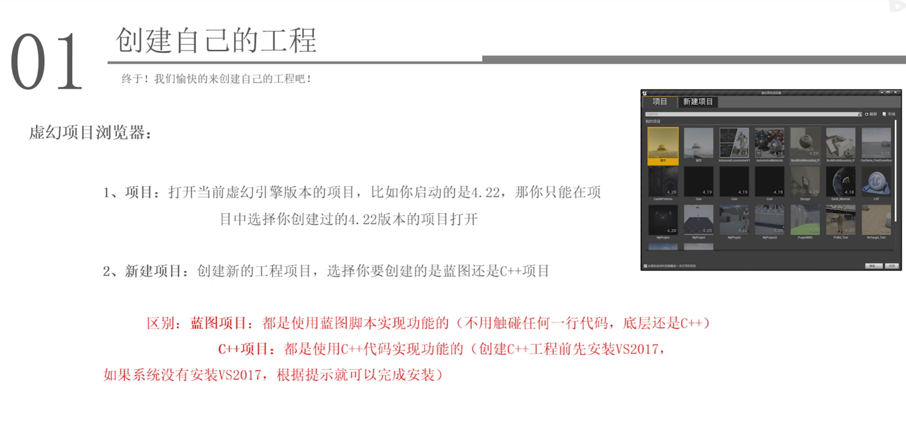
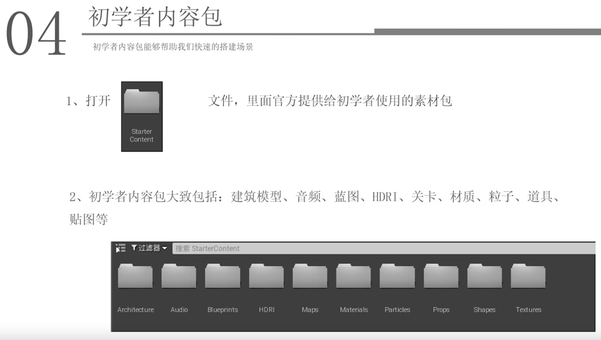
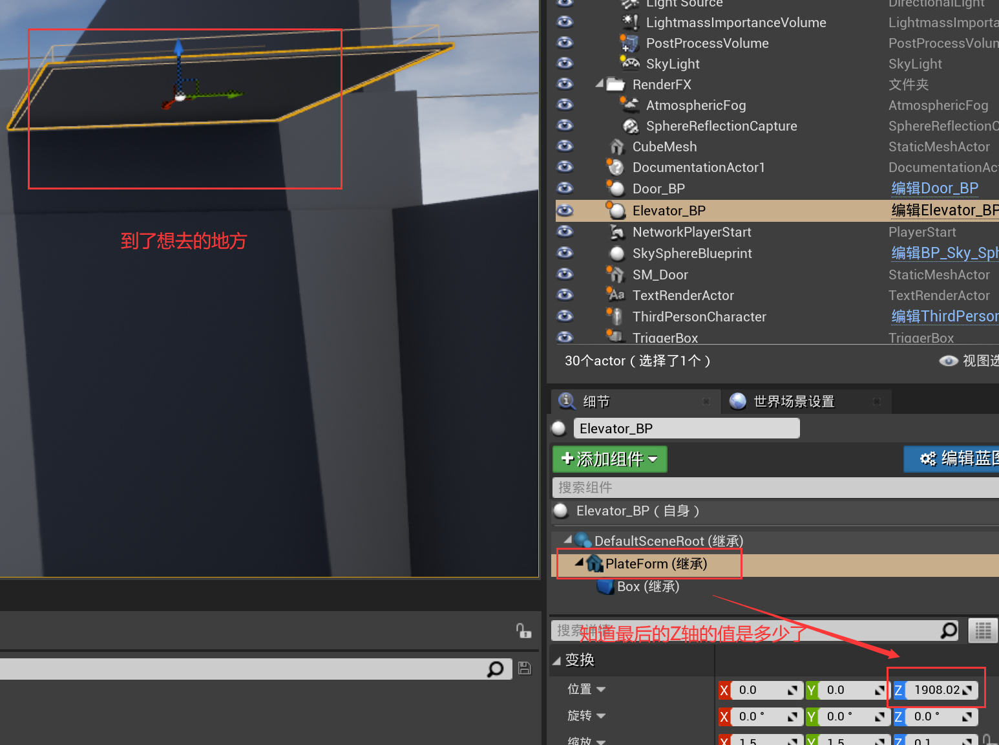
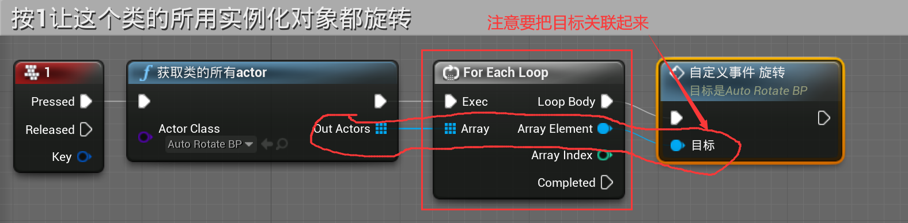
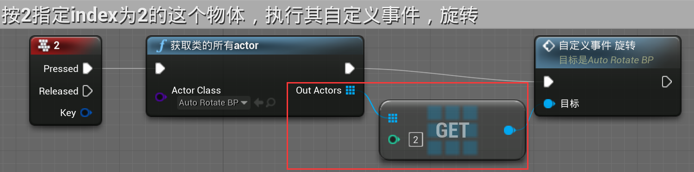
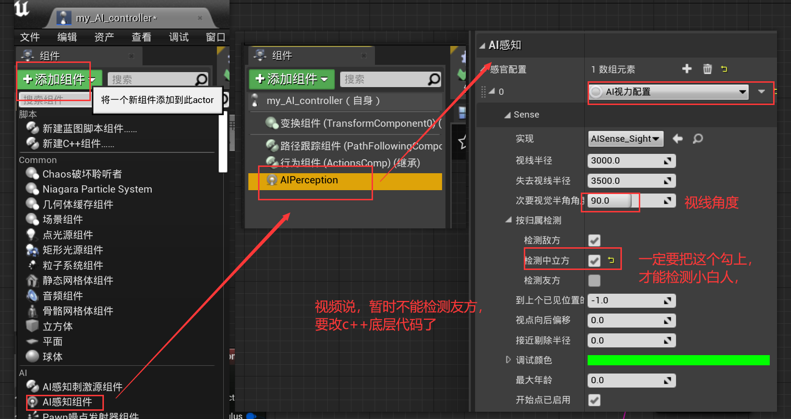
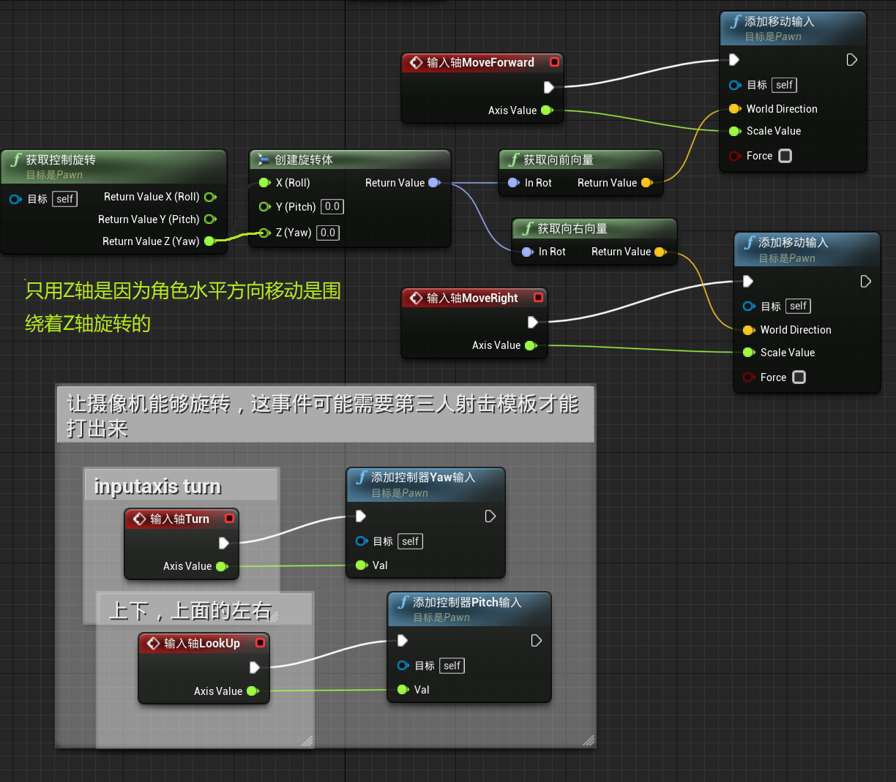

- 注意：
- 高版本可以打开低版本，但是低版本的打开不了高版本（一旦一个低版本项目被高版本引擎打开后，那么这个低版本项目，原来的低版本引擎也再打不开了）
- 一些学习网站：[翼狐网](https://www.yiihuu.com/tutorials/soft/2-0-0-155-0-0-0-0-0/?TG=3881130)、[谌嘉诚](https://www.hellocjc.com/)个人网站、[UE4官方网站学习社区](https://www.unrealengine.com/zh-CN/onlinelearning-courses?sessionInvalidated=true)。
- 比如==细节面板==，作为一个浮动独立窗口时，要回到固定时，一定要点到细节那块字的区域拖动才能放回去，其它区域只能拖动位移
- 关卡蓝图打开后，默认是浮动的，可以拖着它字的区域放到最左上角去，（这个不能像其它细节面板这些随便哪里都能固定）
- 更改界面的中文字体样式：[这里](https://www.bilibili.com/video/BV164411Y732?p=30&t=62.0)。
- 注意，==选中模型只点一次，点两次就可能是选中里面的组件==，部分组件移动了，其它的比如碰撞还是在原地，不理解了就来[看这](https://www.bilibili.com/video/BV164411Y732?p=45&t=1022.1)。
- 尽量不要高级拷贝(即点击文件拖拽到目的文件夹，选择高级拷贝)，这样就会把所有的文件都重新拷过去，也会再编译着色器。

## 一、入门基础

### 1.1. 安装

1. 第一步肯定还是先安装epic，就不多说了；

2. 在epic中按如下方式安装虚幻引擎
   

3. UE4==修改着色器的缓存路径==：
   

   修改的文字：

   > InstalledDerivedDataBackendGraph     # 这是搜索的值
   >
   > %GAMEDIR%DerivedDataCache           # 这是要修改成的内容的值(这就是将编译的着色器存放到当前项目工程文件中)

   tips:

   - 据说UE5新版本不用改，默认就是改了的
   
   - 这个不改的话，添加的内筒包所编译的着色器一直在C盘：
     - 好处：一个外部内容的着色器只用编译一次，各个项目都可以用；
       - 更新于2023.04.04：==建议不改了，不然每次弄坏一个项目，我重新搞一个，像悟空，就要重新编译整个shader，哪怕我改了的，所以以后还是不改了吧。==
     - 坏处：把工程拷给被人时，别人还要编译，属于没跟工程文件在一起，会占据C盘很大的空间，改了就是各自工程编译各自着色器，这个缓存文件就在各自工程文件里
     
   - 这个改了，添加的内容包所编译着色器就在对应项目的工程文件夹中：
   
     - 好处：方便拷贝到一个新的地方不用重新编译着色器；
     - 坏处：每次往一个新项目添加其它项目已经编译过着色器的内容时，都还是要再编译它的着色器，需要的时间就会很长。如果是多个项目使用了同一个素材，同一个东西那就要编译几次，不能达到编译一次就复用的目的，在自己一个人的机子上练习的话就很浪费时间。
   
4. ==**新(用这个)**==：最好的修改方式，还是把上面值改成类似于这种：`"D:/Epic/Shader_Cache/4_27_2/DerivedDataCache"`  

   - 前面的 D:/Epic/Shader_Cache/4_27_2 是我创建的，一个引擎版本一个文件键，不同版本之间不要混用;
   - 这样可以让着色器编译的内容不放在C盘，又能让同一个引擎版本的项目共用一个着色器Cache，而不是每个项目都要编译一次，这样即节省了时间，又节省了很多空间。
   - 问题出现了：这样的4.24就可以直接在新项目中加载出来，不用再编译，但是4.27在新项目中还是要编译，只是内容没那么多，我不理解
   - 更新于2023.03.24：安装ue5时我也没改，好像区别不是很大，就这样吧，懒得改了。

---

一些小技巧设置：

1. 更改虚幻引擎的安装盘符：（跟更改游戏盘符路径差不多）
   - 先把整个引擎的安装文件复制到另一个盘符，把文件夹名字改一下嘛；
   - epic中去移除这个虚幻引擎的版本，然后再去下载这个版本，记得修改路径；
   - 等它差不多开始下载一部分的时候，暂停，再把刚刚复制到同一盘符的整个文件内容剪切进去，然后再开始下载，就会校验文件。
   - （不过这个意义好像不大，因为本来就没有游戏大，小文件多，复制就慢，或许重新下载是更好的选择）
2. 如果闪退的解决办法：[这里](https://www.bilibili.com/video/BV164411Y732?p=6&t=86.6)。
3. 虚幻商城下载的东西，记得一开始去改设置，“编辑保管库缓存位置”，它下载的内容就会在这个路径里。

### 1.2. 第一个UE4工程

1. 

2. 工程文件夹结构：
   

3. 新建一个第一人称设计游戏，然后打开：
   

4. 开始初学者内容包：
   

   如果需要添加功能包，比如一开始创建项目时忘了添加初学者功能包就可以在这里添加：
   

ue4软件界面各个组成部件的讲解：[这里](https://www.bilibili.com/video/BV164411Y732?p=8&t=85.8)  

最开始上面截图是用的4.24版本，界面到4.25又有一些变化了，比较大的区别在[这](https://www.bilibili.com/video/BV164411Y732?p=8&t=2520.3)。现在改成最后一个ue4版本4.27.2。

### 1.3. ==快捷键==操作(重要)

好像这些单个按键时都不区分大小写

1. 游戏中：
   1. 载具模板类游戏：可以通过按tab键来切换第一人称视角;
   2. 运行时切换/退出视口界面全屏：F11   # shift+F11 是整个软件的全屏;
   3. 运行中的“模拟”：就是以上帝视角来查看，然后再点击工具栏最右边的“控制”就回到了玩家控制;
   4. 运行时，点击一下视口鼠标消失，这时鼠标就不能点画面外了，可以按shift+F1，会退出场景，鼠标出现，但是demo还是在运行的。
2. 编辑时的视口界面：
   1. 快捷键G进入游戏视图，一些在创作过程的东西就会被隐藏，相当于预览;
   2. 设置书签：就是某个视角很好，那就按下ctrl+(1-9)就会把这个视角保存起来，后面移动视角后，直接按对应的数字(小键盘不行)，就会回到那个视角  # 一般就只能保存9个书签，是会被覆盖的;
   3. 预览各种模式界面：alt+(2-8)、alt + 0  还有一些没有快捷键，就需要手动去点，比如有无光照啊这些。
3. 视口——画面移动的方式：
   1. 第一种：
      - 按住鼠标左键前进后退;
      - 按住鼠标右键360°旋转;
      - 按住鼠标中键，左右、上下水平滑移。
   2. 第二种：先按住鼠标右键(左键也行),然后加上以下组合
      - WSAD;
      - q 视角水平下移, e 视角水平上移 ;
      - z 视角拉远,  c 视角聚焦细节  # 鼠标右键一放开就回到正常水平。
   3. 选中一个物体中，按F快速聚焦过去 （如果拉的很远了，无法点击选中一个物体，那就在右上角的“世界大纲视图”里找到其对应的名字，点击一下选中，再按F）
4. 视口——物体编辑（坐标系、变换、单位）：
   1. 引擎中单位默认是==厘米==；
   2. ==框选多个模型==：Ctrl+Alt+鼠标左键
   3. ==快速复制模型==：按住Alt,然后点击要复制的轴方向，拖动就行了，旋转方向也是可以复制的;ctrl+w也是快速复制
   4. ==移动模型时视野跟着一起动==：按住Shift,再移动模型
   5. 平移、旋转、缩放(缩放时选中坐标原点，可以等比例缩放)：W、E、R
      固定每一次操作的数值：
      
5. 快速打开资产面板并编辑(比如去添加碰撞)：（2种方式）
   - 地图中选中一个静态网格体，在细节面板里点击静态网格体的的图片;
   - 地图中选中后，直接==**ctrl+E**==快速打开。   # 这很重要，可以快速打开蓝图编辑
6. 选中一个物体后：
   - 按==**Shift+E**==可以快速选中场景中其它相同的的物体;
   - 按==**Ctrl+B**==可以快速打开其所在内容浏览器的页面(一般是网格体这些才行)。
7. 物体吸附到模型顶点（比如球体的圆心吸附到正方体的顶点）：按住V,拖动物体的中心点。
8. 快捷键补充： 可来看[这期](https://www.bilibili.com/video/BV164411Y732/?p=49&spm_id_from=pageDriver&vd_source=2189d09f782381396f1ef53083a0a78b)视频，这些都是来自于它。
   - 编辑模式视口里，显隐导入的地形：==Alt+L==;
   - 视口里显示中可以把界面模型碰撞显示打开：==Alt+C==;
   - 显隐雾：==Alt+F==;
   - 是否能够选中半透明物体：==T==;   # 很多时候选不中半透明的门窗，就是看是不是按到了T
   - 隐藏选中物体/取消隐藏：==H/Ctrl+H==   # 显示会把所有隐藏的都显示出来，仅是编辑时的视口显示
   - 测量距离：==鼠标中键==;  # 仅正交模式下
   - 多个物体打成一组：==Ctrl+G==(一组的actor会同一缩放);   # 将打组取消掉==Shift+G==
   - 快速复制选中的物体/变量/节点：==Ctrl+W==;  # 按住Alt，选一个轴拖拽就行，旋转轴也行
   - 在鼠标位置生成一个点光源：==L+鼠标左键==;
   - 快速打开资产：==Ctrl+P==;
   - 保存所有：Ctrl+shift+S；
10. ==选中模型后，按“End”键，此模型就会被紧贴在地面的模型==。

这里放一些快捷键操作说明图：

- 三维的笛卡尔坐标系：
  

- 
- 
- 全局变换和局部变换：
  
- 常用外部资源类型:
  
  
  

### 1.4. 其它

说是3dmax导入时把坐标原点改成000（学名==枢轴点==）,不然可能模型导入会偏移很远，不是很懂，地址[放这](https://www.bilibili.com/video/BV164411Y732?p=10&t=531.3)。

[youtube](https://www.bilibili.com/video/BV164411Y732?p=12&t=518.0)免费素材下载。

#### 1.4.1 打包项目

​	项目打包压缩时，可以把项目中的“Intermediate”、“Saved”这两个文件夹删了，一个是缓存文件，一个是自动保存文件，会很大的。

#### 1.4.2 项目迁移

​	部分文件迁移：从一个项目中的部分素材迁移到另一个项目中：不写了，看[这里](https://www.bilibili.com/video/BV164411Y732?p=11&t=483.6)。 # 用ue4自带的迁移，路径也有讲究，以后用到再来完善吧，路径很有讲究的，用到时要去看这个教程。

​	如果是网上下载的素材，如果有项目启动文件，最好也是先打开，使用迁移，实在不行，再复制粘贴，一般不要用复制粘贴，具体[看这](https://www.bilibili.com/video/BV164411Y732?p=11&t=615.9)。复制粘贴时路径是有严格要求的，一定要看着来，熟悉后再完善这个笔记。

注:一般来说，把下载的文件的 Content 下的文件夹复制到 工程项目的 Content 文件夹里就好了

#### 1.4.3 主流三维软件模型导入到ue4中

虚幻引擎有一些三维软件对应的插件，或者其它三维软件把模型导出成主流格式，再导入带ue4中，具体用到时看这个[教程](https://www.bilibili.com/video/BV164411Y732?p=13&t=33.5)。

这是一些模型导出格式用途对比参考：

导入到虚幻引擎的模型被分为两个类：

1. 静态网格体（一般是一些静态摆件，家具、房子这些）

2. 骨架网格体（有动画的那种）

   - 虚幻引擎中动画默认是30帧，其它动画模型也是30帧就不容易出错

   [这是](https://www.bilibili.com/video/BV164411Y732?p=13&t=365.3)模型导入时的一些设置，用到时来看看先。

[datasmith](https://www.bilibili.com/video/BV164411Y732?p=14&t=439.6)插件的使用。

## 二、基础了解

### 2.1. BSP画刷

1. 介绍：
   
   
2. 用途：
   
   
3. 使用：(注意是在==几何体==中)
   
   - 注意：旧的减去型的是没办法挖空新的添加型的，有一个层级关系，就可以先选中这个旧的减去型，然后在其画刷设置的高级中的排序中选择==到最后一项==，这样它就能去减后来添加的添加型的了。
   - ==画刷大小缩放==：
     - BSP画刷改变大小不要用前面讲的快捷键R，这样的缩放会改变其表面图案的大小，如果有材质贴图就会变形，
       （这种也有解决方案，就是细节中的==几何体中的对齐==可以使纹理变回均匀）；
     - 要先随便点击一个位置，再从世界大纲选中这个画刷，然后通过这来改变大小(如果手动点画刷设置，一般会点到一个面上，选中的就是一个面，缩放的设置就在下面，要拉下去)
       
   - ==中空==：勾选上图的中空选项，就可以使用BSP盒体内部有结构
   - ==固体性==：也是上图可以看到，区别：(默认固体性，然后==挖空型对半固体性的BSP盒体是不能挖空，也就是无效的==)
     
   - ==给BSP创建的物体附上材质==:
     - 第一种：线选中材质，再去拖盒体;
     - 第二种：盒体先创建出来了，选中要上材质的面，再选中材质拖上去；
           如果一面面上材质，面很多就会很慢，那么就在细节中的==选择==的第一个就是选中所有的面，快捷键Shift+B;
           这里面还有其它快速选中相邻的面，相反的面等一系列快速选中操作
       
       表面的纹理图案，还可以在选中面时，通过其==表面属性==对纹理图案进行一个调整。
   
4. 示例：做一个屋顶（[讲解](https://www.bilibili.com/video/BV164411Y732?p=15&t=1040.3)）
   
   在模式中，选择 笔刷编辑，就可以对盒体进行各种编辑，(这只对BSP生效)
   Tips：
   
   - 要选中立方体的楞，就要多点击几次，选中后可以用分割将立方体切割成类似于几个立方体组成的
   - 选择多个点融合的时候，好像是所有点都朝选中的第一个点去融合（又好像不对）
   - 注意结合左右视图去做，选择目标的话，在世界大纲视图里选中
   
5. 将我们用BSP做的房子打包：

   - ==**合成静态网格整体**==：用画刷BSP创建的房子，注意是所有画刷创建的物体(一定是画刷创建的物体)，选择 创建静态网格体 然后保存，然后就可以在别的项目中使用了
     
   - ==**自己生成的静态网格体设置碰撞(一)**==，如不设置，一运行，小人就会掉落下去，设置碰撞方式：双击保存的资产，然后
     
     - 我的一个错误示范（可以不用看了）：我这里把悟空也选中了，别这样做，这样拖进去那个唯一BSP创建的地面不见了，看来还是只有保存全部由画刷创建的物体为静态网格，这样也有点打包的意思了：（这样选中图中的椅子、桌子、悟空这些啊，一选择这些，就没有上图中的画刷设置选项了）
       
   - ==**静态网格体设置碰撞(二)**==：如果是别的导入进来的静态网格体，一般不会有碰撞检测，人物遇到会穿模，要这样修改：(保存的整体的静态网格体的碰撞修改方式看[这里](https://www.bilibili.com/video/BV164411Y732?p=17&t=13.2))
     
   - ==打包所有静态网格模型为一个整体==：房子中不全都是BSP创建的，还有一些系统的静态网格体，想把他们都打包到一起：然后默认就行了
     

总结：

- 先把我们用BSP画刷(只能有BSP模型才能合)创建的模型合成一个整体的静态网格体，再去把这个静态网格体设置方式(一)的简单碰撞，不然人物一放上去就会一直往下掉;
- 然后因为我们的房子里用了其它的静态网格体，如椅子这些，也想把它打包到一起，那就是使用上面的方法再打包一次==合并Actor==。

Tips：

- 注意画刷创建的静态网格体，一旦被删了，最开始的做个那个里面的内容也会被删除

玻璃的编译反射采集，[这里](https://www.bilibili.com/video/BV164411Y732?p=16&t=1942.5)。

把一个人物添加进来，然后细节面板搜索 possess, 将禁用设置为玩家0，这样就可以操纵它了，忘了就来看[这里](https://www.bilibili.com/video/BV164411Y732?p=16&t=132.1)。

### 2.2. 地形工具

一定注意：当地形很大的时候，设置右上角的相机速度，不然移动起来很慢

1. 创建一个地形：(同样创建前可以先选好材质，一开始没选好的话，把材质拖进细节面板的地形材质也一样)
   
2. 使用==雕刻==：
   - 比如斜坡：ctrl+点击选中一点，再选中一点后，把其中一点抬起来一点，然后点击==左边的添加斜坡==;
   - 比如雕刻：按住shift，鼠标左键一直画可以将地形陷下去；按住ctrl或者不按，一直画鼠标左键可以将地形隆起来
     一些常用参数设置：
     
3. 使用==绘制==：就是在地形上画道路、画雪时使用。

#### 2.2.1 样条

一样先ctrl+点击选中第一个点，然后可以连续点击多个点，设置一条公路的样子，（选ctrl选中末尾的点，在点击首部的点就会首尾连接起来）

然后选中样条进行如下操作：

Tips:

- 第一个分段，就是选中样条的所有面(也可以先点击样条，然后ctr+A选中所有面);
- 样条上会有小山一样的图标，可以被选中，然后进行移动操作，来改变样条位置，如高度，距离什么的；
- 当地形跟样条之间有很大的间隙时，一点点去雕刻很慢，可以这样，让地形来自适应样条，再用上面一条tip来微调一下：
  

#### 2.2.2 地形图导入

灰度图地形导入：

1. 首先google中图片搜索 height map ，然后找一个下载，用ps打开(图像->模式中)，将通道转换为16位+灰度图，其它的可能会出错，且最后保存的格式为raw或png，虚幻引擎只支持这两种格式。
2. 导入地形图：（最好先不要选材质，看这个[视频](https://www.bilibili.com/video/BV1gY411A7pq?t=151.6)）
   
3. 然后可以再用BSP画刷做一片水的区域，x、y都设置成六百万吧，z给个10就好了，然后对齐地面就好了：
   

##### Gaea

软件[官网](https://www.quadspinner.com/)，直接搜索可能搜不到，要搜索 QuadSpinner | Home of Gaea ，此软件的一个简单[文字教程](https://zhuanlan.zhihu.com/p/433125820);

直接下载的就是社区免费版本，在导出时最大的分辨率只能小于1024×1024，不然就会带水印;

- 安装时可能要让安装一个VS的运行库，装就是了，没多大;
- 它有很多内置地形图，我暂时就是直接拿来用，将其模板导出为前面的.png地形高度图，然后就可以直接导入到UE4中，相关[视频](https://www.bilibili.com/video/BV1gY411A7pq?t=37.0);
- 然后再在导进来的地形图中，搞上材质就比较真实了，[参考](https://www.bilibili.com/video/BV1hA4y1S7Np?t=4.2)。

##### WorldCreator

这也是弄地形的一个软件，也可以导出地形高度图。收费的，软件安装包在阿里云盘(里面有Crack方法)，也是来自于[B站视频](https://www.bilibili.com/video/BV1pr4y1t7pS?t=2.0)，留个记录。

#### 2.2.3 植被工具使用

植被工具栏中的==套索==可以范围选中植被。

1. 首先在模式中选择==植物==，在把石头、灌木这些材质添加到左侧去，默认都是会被选中使用的，然后视口界面里去点击就可以把植物刷上了(被选中的都会刷)
   

   Tips：里面有几个常用选项：(点击植被图标后)

   - 绘制->密度/1Kuu：这个值越大，那这个每次点击生成的也就越密集;
   - 绘制->缩放X：1.0为标准值，通过设置范围，可使生成的植被有一个随机的放大缩小;
   - 放置->对齐到法线：默认是勾选了这个值的，地形有坡度，那放置的石头这些就是和地形的法线对齐的，如果希望石头不管在什么角度的地形下都是竖直向上，就把这个选项取消掉;
   - 实例设置->剔除距离:最小值一般不改，最大值默认是0，代表只要是视野范围的植被都会被显式，无论多远，这就比较消耗性能，比如设置一个2000，那摄像机移动时，2000以外的植被就不会被显式。
     

2. 设置植被中如石头的碰撞：（这两个条件要同时满足才行）

   - 先点要设置碰撞的植被，实例设置->碰撞预设->把默认属性NoCollision改成BlockAll(就是代表阻挡所有物体);
   - 其次这个模型本身也要有碰撞才行，在属性中网格体，双击那个图片，来编辑它，若是添加简单碰撞，就按前面写的步骤来就好了，更一步的操作是：凸包分解（当然用简单的碰撞检测也是可以的）
     

### 2.3. 光照

`记录个问题，我做的房子的玻璃不透光，后续看怎么去解决`

系统自带的几个光源：

- 定向光源一般是模拟现实中的太阳光;
- 点光源就像是现实中的灯泡，向四面八方发光，虚幻引擎中简化为空间中的一个点向空间的各个方向发射光;
- 矩形光源是这几个光源中开销最大的，一般用于室内电视屏幕这些;
- 天光就是全局照亮。

Tips:

- 好多时候添加了聚光灯后，要把光照强度调大一些，不然运行起来没啥效果，一点都不明显，像是没有一样;
- 左上角出现光照需要重建时的原因及解决办法：[这里](https://www.bilibili.com/video/BV164411Y732?p=19&t=976.1)。

---

​	做完了上面2.2后，把前面建的房子拉进来，房子内部可能是黑色的，解决办法:(说一个平行光，一个是天光，都改为可移动，如果还不行，就再做一下光照构建)

​	以上说一下，静态的话是不会对可移动物体有阴影的，改成可移动的可以直接看到效果，性能开销也就越大，静态的话改了就需要去构建光照。

---

==**色温**==：可以把light source的==色温==打开来调节色彩：

---

==**自动曝光**==：设置->项目设置->搜索自动曝光：这个开启后，就会比较真实的模拟进出隧道那种，一般就是开启。

---

==**指数级高度雾**==：就是让看远处的风景时有一些朦胧，让效果更佳真实,然后里面有两个参数，==雾密度==越大，越是看不清，但不够真实，要把==体积雾==开启，会更佳真实，开销也就更大，里面的散射分布指数也决定可见视角
 

这里面还有一个参数叫==消光范围==：就是雾很大时，通过这个参数来设定可见距离。

---

==**实现光束和体积**==，好难哦：[这里](https://www.bilibili.com/video/BV164411Y732?p=23&t=31.2)。(两种方式，做光束效果)

- ==光束遮挡==：开启后，在一个物体的背光面看向光面，物体的周围就会很亮，没有被物体遮挡的地方，光纤就是正常的，比较真实，然后可以利用这，再把对应的==遮挡遮罩暗度==调大一些，光光束的效果就会比较明显了;
  图里面还有一个参数是==光束泛光==：它开启后，看太阳周围是模糊的，不开，太阳就是一个很清晰的圆，不真实，这两个参数之间是互相影响的(下面这个不开泛光，就没啥效果)：
  
  (缺点就是当摄像机移动到一定的角度才能看到这个效果，其它角度看不是这个光束的效果)

- 体积雾：通过体积雾和光中的==体积散射强度==来做，但是我咋改都没效果

以后可能还是用模型加材质来做光束的效果吧。

### 2.4. Sky Sphere

​	新建一个默认的关卡，点击Light Source，将其旋转设置成0、90、0;然后再点击Sky Sphere里面的Refresh Material刷新效果：(注意，如果选择了关联Light Source，在Light Source里做了修改后，一定要来到Sky Sphere里进行刷新才能看到效果)

设置里默认里面的一些参数，看名字就能看懂，也比较直观，如云的速速，云的不透明度等：如下

也可以不随Light Source(即上图框起来部分设置为==无==)，进行一个自定义设置：(最后一个overall color可以决定所有颜色，全拉黑，就是晚上了)，就可以做个一个篝火的效果。

### 2.5. 打包游戏|默认地图设置

注意这些设置，选择好地图游戏关卡，搞不好，运行打包的游戏，就是黑的：

然后还要安装VS2017的一些组件：看[视频](https://www.bilibili.com/video/BV164411Y732?p=26&t=276.3)跟到安装吧。

弄好环境，记得上面选好关卡后，就开始打包：（打包开发版本成功了，如果后续来试一下发行版，也能打包成功的话，就打包发行版）：

## 三、进阶蓝图

### 3.0. 函数、宏、==层级关系==、==蓝图快捷键==

蓝图讲得一个大概有哪些的[知乎文章](https://zhuanlan.zhihu.com/p/586109788)。

1. 如果导进来的门这些模型的中心点是在正中间，而不是在右下角的话，开门关就有问题，[解决办法](https://www.bilibili.com/video/BV164411Y732?p=28&t=259.2)。
2. 蓝图快速添加各类节点的快捷方式：
   - G + 左键：Gate节点
   - M + 左键：MultiGate节点
   - F + 左键：ForEachLoop节点
   - O + 左键：DoOnce节点
   - N + 左键：DoN节点
   - B + 左键：branch分支节点   # 就可以快速添加一个分支(条件判断的true和false)
     - 其它的流程结点看[这里](https://docs.unrealengine.com/5.2/zh-CN/flow-control-in-unreal-engine/)。
   - S + 左键：顺序节点
   - D + 左键：延迟节点
   - C：注释  # (好像也叫图标注释)，蓝图里选中几个目标，然后右键，可以==注释组==，即给他们加注释
3. 其它蓝图编辑快捷键
   - ctrl + 鼠标左键 可以更改已经连好的线到别的位置;
   - alt + 鼠标左键点一下，就可以快速断开到此处的连线;
   - 双击蓝图的蓝线可以增加线上的节点，就能编辑其走向;
4. 

一些概念的东西，用到了再来完善吧：

- 函数的使用：[地址](https://www.bilibili.com/video/BV164411Y732?p=46&t=148.6);
- 宏：[地址](https://www.bilibili.com/video/BV164411Y732?p=46&t=366.6); 
  - (蓝图里定义的宏只能在本蓝图中使用，除非是内容浏览器中空白处右键，蓝图->蓝图宏库，这里面的就可以全局使用);
  - 宏默认是没有引脚的，但是可以在细节面板中添加很多输入、输出的引脚
- 函数、事件的区别：[地址](https://www.bilibili.com/video/BV164411Y732?p=46&t=627.1);
- 类引用(紫的色)，对象引用(蓝色的)简单区别：[地址](https://www.bilibili.com/video/BV164411Y732?p=46&t=1921.0);

---

蓝图类之间的一个层级继承关系：Object->Actor->Pawn->Character  # （其中Component是包含在actor中的）

​	actor其实和Pawn差不多，比较明显的区别就是Pawn比较方便我们去操纵角色,虚幻引擎为了更方便开发，就又继承出来一个Character类(里面就自带行走、跳跃这些，和Pawn中最大的区别就是蓝图里多了角色移动(CharMoveComp)这个组件，还有胶囊体组件这些);

​	在==pawn或者character中默认就是支持玩家输入的，但是在actor中是需要额外开启的==。这也跟他们的控制权有关, pawn和character都能够被角色控制，拥有控制权，但是actor不行，所以在前面的内容里就去开启了 启用输入、禁用输入 这些，然后pawn和character因为是有控制权的，就不要额外去开启了;

​	actor和对象之间比较大的区别就是actor是有组件的，而对象没有;

​	Actor->level blueprint actor,即关卡蓝图也是一个actor，并且是actor的子类。

### 3.1. 制作一个开门动画

1. 添加门、给门设置一个碰撞：
   	从初学者包中添加一个名==SM_Door==的门，这种添加的静态网格提都是没有碰撞的，就要双击它，像上面写过给椅子添加碰撞一样，添加一个简单的盒体碰撞。细节面板中，将其设为==可移动性的==，因为要开门嘛。

2. 在==基础==中添加==盒体触发器==(蓝图中叫collision,不一样，注意)：（相当于一个感应装置），包裹在门周围

   - 一定注意：添加这些组件时，是选中的整个Actor还是单独的Door，这是不同的

3. 打开关卡蓝图：

   - 在视口中选中盒体触发器，蓝图里为它添加两个事件，开始(进到范围)和离开(离开范围)：
     

   - 再是视口中选中门的对象，在蓝图里右键添加一个对门的引用，这个对象就代表着门，再从门里面拉一条旋转出来（z轴设置一个85度，那就可以旋转了）：
     

   - 这时已经可以开门了，但是开门就是一瞬间从0°到85°，很生硬，就需要通过添加时间轴来做动画效果：（蓝图右键，然后搜索==添加时间轴==，再双击它就可以打开时间轴的设置）添加一个浮点型时间轴，设置两个关键帧，(0s,0°)~（2s,85°）（用过右键添加，然后设置值）(也可以不去改时间轴的长度，点击选择使用最后一个关键帧。是一样的效果)
     

     然后把时间轴跟事件、对象连接起来就好了：
     

Tips：

- 时间轴上的其它选项顾名思义就好了：
  - Play：适合做门这种开到一半就想关，动画是流畅的;
  - Play from Start：就总是从开始播放，对前一条说的那们种效果就不好;
  - Reverse：就是代表把动画按时间轴反向播放，这也就说明了上面把时间这的总长度改为和动画时间长度一样的2秒的意义，如果时间轴长度是默认的5秒，那后3秒就是空白的，Reverse时就要等3秒钟;
  - Set New Time：就是可以自定义一个开始播放的时间

- Update：就是代表每分每秒都是要实时更新的;
- Finished：代表时间轴跑完后要触达的节点;
- Direction：是一个方向的判定，所以是一个枚举值？
- 后面的“新建轨道0”：就是我们添加的浮点型时间轴

### 3.2. 开门蓝图类

进一步：思考，这只是弄一扇门，要用千百扇门，就要写千百次嘛？

答：以上是直接把开门的逻辑写到了==关卡蓝图==里，不好，要将其写到一个Actor类中，即创建门的蓝图类。

#### 3.2.1 简单自动感应开门

1. 第一步：
   	右键内容浏览器->蓝图类，会生成一个空的Actor，相当于一个人，这个时候就要给它加各种组件(相当于衣服)，==一定要注意各个组件之间的层级关系==，然后添加静态网格体组件及碰撞：
   
   Tips：
   - Box是添加的盒体碰撞检测;
   - Door、Box都是属于DoorFrame的，那DoorFrame动，其它的都会跟着一起改变;（好像ue5要把碰撞盒子放Door下才行，时间轴才能来回播放）
   - 是可以把Box这个碰撞检测放进Door里的，这样就相当于跟Door绑定在一起了，door开关时，碰撞检测跟着一起动了就不对了。
2. 第二步：==事件图表==  （就跟前面在关卡蓝图里写是差不多的）
   - 选中Box（就是选中盒体碰撞，给它设置开始、结束），可以在细节面板中添加事件，也可以右键添加
     
   - 接着设置时间轴的事件，跟上面一样，
   - 给门Door设置设置旋转：（==右键空白的地方，输入`self`回车，就有了对这整个蓝图类的对象应用==）(此外，还可以点击左上角的模型名字(如Door)把它拖进到这个事件图表界面)
     
3. 故：自动开门总的就是：
   

Tips：`关于整个Actor旋转、门相对旋转、门世界坐标旋转`

- 世界坐标是不会变的，可是门时可能被放到任何角度的啊，我们开门肯定是门相对整个Actor的相对旋转角度，不是相对世界坐标，然后整个Actor肯定就只有一种旋转，所有就是上面三种：
- 万一人还是过不去，记得去看看门框是不是设置了碰撞;
- 设置Actor旋转：记不得中文时输入 SetActorRotation       # ==不区分大小写==
- Door的
  - 设置场景旋转：SetWorldRotation
  - 设置相对旋转：SetRelativeRotation
- 这里的self就可以看做整个Actor，里面的 门框、门 是并列关系，是都属于self的；前面提到的层级关系只是在做时间轴动画时，高层级的会带着其所包含的低层级的一起做，相反低层级的就只会自己做。

#### 3.2.2 按键盘E来开门

总的事件图表：

解读：那么盒体触发器，检测到就不能直接是开关门，就要检测按键输入，所以：

- 启用/禁用输入：
  - ==启用输入==：`enable input`    # 
  - ==禁用输入==：`disable input`
  - 重要：是谁输入呢？是玩家，所以：==获取玩家控制器==：`get player controller`
- ==流程控制==：`Gate`  (快速添加这个节点的话是：G+鼠标左键)
  - 它的enter就与键盘E绑定，搜索输入是`键盘 E` 注意空格
  - 进入启用输入就连接到open,离开禁用输入就连接到close，当人进入时才有开门的条件，输入E后才会执行右边的Exit
- `Filp Flop`: (前面gate的exit只能连接时间轴的的一个，那就需要这个节点)
  - 第一次经过这就是A，第二次经过就是B，轮流来，就达到了按E开关门。

#### 3.2.3 鼠标点击开关门

首先把上图那个键盘E的输入改成Door门的OnClicked事件：

​	游戏运行的时候是看到鼠标的，就没办法用鼠标点击，就要把鼠标显示出来：（在总的关卡那里，打开==世界场景设置==）
默认的玩家控制器类没办法修改属性，就点加号生成一个新类，是继承于默认的玩家控制器类的

有个新的玩家控制器类，就去使用，并改属性：

注意：此时再去到`00067`图界面，那里就不再是图上的值，而是上图的NewPlayerController类，然后此时再运行游戏时，整个界面都是有鼠标了。

但此种方式并不友好，因为整个全局都鼠标了，我们只希望去开门时鼠标显示出来，能点击开门，离开门范围时，鼠标消失，推荐用下面这种方式：

- 世界场景设置中还是用刚才的新的NewPlayerController类，并在其蓝图细节面板中把==显示鼠标光标==关了，但是还是要开启==启用点击事件==(这也是为什么不用默认的玩家控制器类的原因，默认的是把点击事件禁用了的)
  
- 在蓝图的事件图表中，对玩家控制器进行鼠标的属性设置：
  
  - 把是否显示鼠标加到了盒体触发器的中间，这样在进到范围内就显示鼠标，出了范围鼠标就消失;
  - 当运行时，若鼠标出现后，视角不太好，可按住鼠标左键进行视角移动。

#### 3.2.4 电梯

这里步骤就不细写了，跟前面按E开关门类似，主要是增加了一个更友好的控件，来改时间轴值的方式：

==插值==：`lerp` （当Alpha为0时使用A的值，为1时使用B的值，中间变化就是使用插值）

使用：前面时间轴，设置第一帧和最后一阵时，时间数值都不改变，但对应的值都不再填动画要到达的具体的值，而是==第一帧写0，最后一帧写1==(暂时是用于就开始、结束两个状态两帧这种)，然后lerp插值节点中就写开始、结束两个状态的值，动画就会按照这两个值之间线性变化，很均匀。

除了上面的浮点型，Lerp还有一些其它的类型：

Tips：

- 比如这个电梯，我们不知道最后结束时，z轴的值要多少才能到第二层，就可以在视口中选中这个模型，然后点击电梯平台，看得到它的坐标是(0,0,0)，然后将其移动到想去的位置，看看z轴的值是多少，然后就去lerp中设置就比较准确，设置完后，记得将其还原成(0,0,0)：
  - 开始：
    
  - 目标位置值：（拿到值后就可以去蓝图的lerp中设置值了，然后记得还原(右侧编辑蓝图那里有把所有设置一键还原)）
    

- 一定注意不能是选中世界大纲视图中的 Elevator_BP 对象，它的初始是相对整个世界的，坐标应该不会是(0,0,0)

#### 3.2.5 自动平移双开门

简单来说，这里的核心是==一个时间轴同时update控制两个物体的移动==：

1. 同样是先创建模型：
   

2. 时间轴还是设置两个关键帧，跟上面电梯一样，然后是用的lerp来改变值

3. 重点是蓝图里的写法：
   

   说明：

   - 上图看红线画的地方，一个update把多个要去动的物体串联起来就行了，不能并联，但动画算是并行同时执行的，没有先后顺序的;
   - ==插值,lerp==中A、B这初始值、终止值的设置：这里采用的是手动设置，都是通过在蓝图类中的视口，点击模型，设置好，然后在细节面板里位置参数，就是A，再把模型拉倒想要开到的位置，再看此时位置数值，就是B,如下，就是这样来获得上图A的的初始值-24,然后终点值B的-64是自己设置的：
     
   - 且以上两个物体，两个动画，就拉两个Lerp插值好了，然后尽量把左右坐标值设置得对称，不然时间轴是一样的，蓝图类内坐标不对称就可能导致速度不一样，效果可能很奇怪。

#### 3.2.6 自动旋转双开门

这个就两个重点：

- 一个是怎么设置门从中间对开，简单来说先旋转、再平移下，开门的轴就可以从右边变成左边，[这里](https://www.bilibili.com/video/BV164411Y732?p=33&t=35.9);
- 然后这门的旋转角度，设置成开75°及及以下就没啥问题，但是设置成开80°、90°，门没开完，人也没离开检测区域，时间轴一时在播放正向动画，一时又在播放反向动画，很是bug，不知道为啥。（这个门后来时钟有些bug）

Tips：

- 可以用获取当前目标的位置坐标、角度这些来取代直接输入lerp中A、B的值，一般也会用一个变量把初始值存起来，即便后续改变了，也能拿到最开始的初始值。使用变量：
  

  变量直接拉出来就要像上面那种选择是设置变量值还是获取变量值，如果是按住alt拉出来，就是设置变量值；按住ctrl拉出来就是读取变量。

#### 3.2.7 通过钥匙开门

​	门基本还是按E开门的那个逻辑，区别是：按E后，就是进入分支了，这个分支由一个bool变量(这里就是是否有钥匙)控制，为true就去执行开门，没有就简单打印一各字符串：

- 按照上一张图00078所示，先创将一个叫“是否开门”的bool变量，它的默认值是flase，在细节面板可以更改它的默认值；
- 将变量拖进来就要选择获取变量，还是设置变量：快捷键
  - 若是要获取变量：按住Ctrl拖进来;
  - 若是要设置变量：按住Alit拖进来;
    
  - 这里门蓝图中的逻辑，选择获取变量，就是意味着由这个变量来控制着按E后的开门与否，拿到钥匙后就可以开门，那这个是否开门的bool值就应该从false改变为true，那就需要从钥匙的蓝图类来改变门的蓝图的这这个是否开门的bool值。
- 钥匙的蓝图类：（两个点）
  - 获取到门的蓝图类，并修改其中是否开门的bool值为true：
    - 获取所有类的Actor时搜索：`GetAllActor`
      
  - 但是一个场景中，门可能会有很多个，所以上图得到的数据其实一个数据，需要索引取出来，我们这里的索引就是0，并修改是否开门的bool值，然后钥匙拾取后就要不见，就要销毁，所以：
    
    - 销毁的是钥匙self，然后输入`destroy`或弹出来选项

最终总结：

- 门的蓝图类：（E_Door_BP）
  
- 钥匙的蓝图类：（Keys_BP）
  

### 3.3. 蓝图间通讯|自定义事件

事件：是系统自带的，默认就有的，比如盒体触发事件、碰撞检测事件等等，==好像是系统自己就会去执行的，不用我们去调用==;

自定义事件：吃饭生存是本能，然而去跳舞还是打游戏就是自定义事件，需要去调用才会触发，把蓝图里的一组行为用一个自定义事件结合起来，就方便外面的部件调用。  # 可以理解为自定义函数

==提升为变量==的意义，我就不写了，现在略懂了，后面忘记了就来看看[这里](https://www.bilibili.com/video/BV164411Y732?p=40&t=156.8)吧。

#### 3.3.0 蓝图接口

​	蓝图接口才是蓝图间通讯常用的方式

​	视频[地址](https://www.bilibili.com/video/BV164411Y732?p=51&vd_source=2189d09f782381396f1ef53083a0a78b)。蓝图接口类中的事件好像就是C++的多态的一个纯虚函数，任何一个蓝图类都可以去添加这个蓝图接口(像是继承)，然后每个蓝图类自己去具体实现这个事件要做什么，有的实现去开关门，有的实现去拾取武器，就是子类的各自实现一个纯虚函数的功能。  # 这个视频里还讲了射线检测，资源的一些东西，新东西还是比较多，比较实用。

#### 3.3.1 制作一个加速带|==按shift加速==

​	下面开始做一个场地的加速盒子，即进到这个盒子，人物的运动速度变快，离开这块地方后，运动速度变回来，分析：（有用到自定义事件和类型转换，类型转换就想像是指定这个类型的物体才会触发，其它的就不会触发）

- 先建立一个蓝图类，里面就弄一个盒体触发检测的组件;
- 再在小白人的人物蓝图类里，新建一个==图表==(这个不重要，其实就是方便做个区分，它没啥实际意义，方便后续管理)，然后里面添加一个自定义事件(custom event)，再把角色拉进来(细节面板里有各种参数)，设置它的最大行走速度（这个节点很多时候汉子搜不到，这里搜的是 max walk ，其它的行走属性就搜对应的 fly、swim这些）：
  

- 再在第一步创建的蓝图类中，将碰撞检测的盒体的重叠事件的类型转换为小白人(蓝图名字就是ThirdPersonCharacter),这样就代表这个加速盒子只对小白人有用：
  

针对上面的改进，注意：以上把最大行走速度改成了20000cm/s，是写死了，这些别的地方调用这个自定义事件(函数)就没办法传参，就不够灵活，所以要改成以下的形式：(下面这两张图对标的是上面的那两张图)

- - 这样就能传参来改变最大型行走值：
    

- - 这样在别的蓝图里，调用这个自定义加速事件_1时就可以传进来最大行走速度的值：
    

同样离开加速区域后，就打最大速度改回去，完整的就是：（好像暂时不会把初始值存为变量，只能手动设回为600）

---

简单在小白人的蓝图类里加一点，就可以实现按Shift加速，放开就正常：(这样无论哪个地图里的小白人都可以加速了)  ==一定要有红色的这种事件作为一个触发开始==：

#### 3.3.2 制作立方体自转(==两个蓝图间通信==)

最简单先做一个，它放空间里就会自动旋转，就两个点：

​	新建一个蓝图类，auto_rotate_BP，然后添加一个默认事件==`事件Tick`==，它会每帧去更新动画；然后是==add添加相对旋转==，每次增加一点，而不是用前面的set相对旋转：

重点：系统自带的事件==事件Tick==,它是会自己触发的，只要写进去就好了，然后它每帧去执行更新，达到了时间轴的功能。

---

进阶：按键盘来控制旋转

1. 设置一个是否可以旋转的变量+branch分支来进制是否可以旋转;
2. 设置一个定义事件来控制这个变量，按一下运行，再按一下停止；重点，不使用Flip Flop了，它比较固定，而是用branch分支替代，分解：调用这个自定义事件时，第一次按，bool变量还是false，这时走的false中把这个变变量设置成了true，就可以转了，再按一次就反过来了，很巧妙，视屏地址放[这里](https://www.bilibili.com/video/BV164411Y732?p=41&t=249.9)：
   
3. 然后进到==小白人的ThirdPersonCharacter蓝图类==中，添加一个图表(图表就只是方便管理而已)，
   - 新建一个变量，类型就是刚才新建的==蓝图类auto_rotate_BP==的==对象引用==，这样才能调用里面的自定义事件(自定义方法);
   - 这种引用在使用在进行是否有效的判断，因为还没与实例化对象绑定，是无效的，不处理可能就就会导致报错，
     
4. 接下来就是去视图里把这个对象的引用绑定起来：（看上图：变量auto_rotate_bp_ref后面的眼睛要点开，使其成为公有）
   - 地图中点击小白人，因为上图的内容就是写到小白人的类里面的，在其细节面板的==默认==里，通过吸管的图标去与视口中的物体绑定，（想要哪那个旋转就绑定那个），是可以更换的。
     

​	补充：以上一次只能选中一个让其进行旋转，改进的方法，通过获取所有类的actor，然后里面把类型选出来：(一定注意蓝色线的关系一定连线关联起来)（注意一定先把类型选出来，右边再去拉节点）

- 这类的所有物体都旋转：(通过循环`For Each Loop`，全部都执行这个自定义事件)（下面的Completed是循环完后去走的路线）
  
- 通过索引指定某一个：（通过get(index)来指定那个来执行）
  

写在后面：最开始没看视频自己写的时候，是把旋转控制写到了关卡蓝图中，每次也是关联的一个示例，也能旋转，那样的话，关卡蓝图就不那么简洁了，应该也能用for循环让所有的都动。

#### 3.3.3 综合密室游戏

​	简单来说，就是密室中有几个灯，这几个灯需要全部打开，机关门就会自动开启。（以下主要是灯的蓝图，这个灯的原型也是我从初学这内容包里继承的一个，）

1. 在关卡蓝图中，写一个自定义事件“开启机关门”,主要就是写开门的动画:（注意点是要在这个机关门的细节面板中将其改为==可移动性==，不然编辑就会报错）
   

2. 墙上六盏灯的，关于灯的蓝图如下：

   1. 文本渲染组件，可以理解成一个快速创建的额3Dui，就是给一些提示内容，但不再是用print打印字符串的方式,但是可扩展性不强，之后还是要用使用==UMG==功能：(一般先设置为不可见，与触发盒子放一起，靠近了才会有提示)
      
   2. 以上的蓝图类就是这个灯的蓝图类，然后重点就是里面的事件图表：

   - 前半段按键开灯跟开门的逻辑是一样的，开灯就是设置灯的可见性，然后还在前面加了文本渲染组件的可见性（关于可见性，拉结点时输入vi，然后来选择，它就是visible，输多了可能一些其它想要的选项就被过滤了）
     
   - 接着上面，就是设置灯光的可见性后，流程继续往右边走，逻辑就是：
     
     - 地图中有几盏灯，每打开一个灯后都要去循环遍历所有灯的灯光是否可见：先获取所有的类，然后里面选中灯那个类(==为了不选错，可先在视口中选中灯，然后ctrl+B定位到内容浏览器，然后再返回蓝图中，点击获取类的所有Actor中的向左箭头==就能快速选择我们想要的类);
     - 添加一个bool变量(是否可以开门)，用于最后决定门到底能不能被开启;
     - 然后去循环遍历每一盏灯的灯光组件是否==可视==(即开启)(还有一个类似的功能，“设置游戏中隐藏”)，特别注意这常常与branch分支组合起来使用,当灯光组件的可视为True就把上一步设置的bool变量设置为True；若可视为Flase,哪怕只有一个，这个门也不能开启，将开门bool变量设置为False,然后就可以直接连到break退出;
     - 当所有灯都被开启后，才会循环完，然后是否可以开门的bool变量也是True,这时就会去走==Completed==，这也加一个branch分支，用前面设置的是否可以开门的bool变量做condition；
     - 当上一步为True,就是蓝图之间的通讯，去调用关卡蓝图的自定义事件“开启机关门”，比较方便的就是直接在Command中用==ce 关卡蓝图中的自定义事件==(注意中间有个空格)

3. 上面的一点使用技巧：

   - 注意循环节点和带break的循环节点的使用,要break就直接把连线连过去就好了;
   - 然后就是循环时单个元素那个蓝色关联线别忘了连接，不要只是连接白色的执行线，然后常想到跟branch分支的组合使用;
   - 和关卡蓝图之间的通讯，在关卡蓝图中写好自定义事件，这些蓝图中去调用时，就输入==执行控制台命令==(英文输入exe就能快速看到)，然后在Command中写上`ce 关卡蓝图中的自定义事件`(注意中间有个空格)就可以了。
   - 注意：蓝图间的通讯，还可以在一个蓝图中添加一个变量，这个变量的类型就是另一个蓝图的对象引用，然后通过这个对象把其自定义事件这个节点拉出来，就可以被连接执行了。

### 3.4. 角色控制权

有两种方式：

1. 第一种就是前面讲到过的，把人物拖进场景后，在细节面板里搜索==poss==，将其设置为玩家0。（这可以设置多个玩家）

2. 第二种是添加==玩家出生点==，不用提前把人物模型拖进去：
   

   注意：以上的框起来的游戏模式重载、默认pawn的值 还能是其它的，还可以是自定义的，但还不会，用的就是系统自带的默认的。
   然后添加玩家出生点：
   

   Tips：

   - 用这种需要把第一种添加的角色的poss设置设为禁用;
   - 然后玩家出生点设置一个就好了，如果设置多个，那玩家就会随机从一点出来。

#### 3.4.1 游戏中多个角色控制权切换

1. 把玩家出生点去掉，拖几个小白人进去（一般还是要默认设置一个角色的控制权），打开关卡蓝图，界面缩小，然后在世界大纲中把这几个角色选中，直接拖进关卡蓝图中，就可以获得这几个角色的引用;

2. 添加“玩家控制器”，从中拉出对应的"控制"节点(输入possess快速找到)，把它和角色关联起来;（这个节点只有玩家控制器里才有）

3. 使用==MultiGat==顺序节点(M+鼠标左键点击快速获取)，来控制角色控制权的切换，其中关于这个节点功能的讲解：

   - Reset：这个节点默认顺序执行一次，执行完再按就不会有反应，加上这个节点，就可以重置，比如再弄一个另外的键盘热键6，不过更多的用法是一个自定义事件;
   - Is Random：bool值，为true，就每次触发时就会==随机找一个还没执行的==节点去走，走完就默认结束了;
   - Loop：为true，就是一直循环，执行完一个就会立即刷新所有引脚，所以这个加上上面的随机就可以达到不重置都一直随机下去。
     

   以上就实现了角色的控制。

#### 3.4.2 角色切换时添加镜头过渡动画

上面镜头直接切换过去会有些突兀，可以==加一个切换动画==，按下按键时，镜头在一定时间后移动到新角色身上时再获得控制权：

- 使用新的节点：==使用混合设置视图目标==（注意这个只有在==获取玩家控制器==中才能被找到）;还有==delay延迟==节点
  

- 以上有一个弊端，如果2s动画没做完就又按了键盘，这时就不稳定了，所以要创建一个bool变量配合branch分支进行判断：
  

- 完整蓝图放这里示意一下吧：
  

Tips：

- 以上还有一个小bug，如果第一次按恰巧是随机到了自己一开始控制的默认角色，就不会有反应;
- 还有这个镜头切换动画不能封装成函数，因为，[3.0. 一些概念、层级](#3.0. 一些概念、层级)里讲了函数的一些东西，函数里是不能要delay这种跟时间顺序有关的节点，也不能有MultiGate这样的顺序节点。
- 虽然不能将相同的节点折叠到函数，但是可以==折叠节点==或是==折叠到宏==：
  - ==**折叠节点**==：
    把相同固定节点选中折叠节点：
    
    然后点击这个折叠节点，就会看到：
    
    那个这个折叠节点就可以复用了，复制出来，名字是要不一样的：
    
  - ==**折叠到宏**==：它跟折叠节点基本类似，宏里面跟折叠节点里面操作可以说是一样一样，最大的区别就是，当把一个宏复制多次使用时，它都是同一个对象，名字都是一样的，就是调用，而不是折叠节点那样的对个对象，所以感觉用宏是不是比较好一点。
- 最后，相同的节点要复用，同一个写到一个蓝图类里会更好一些，方便管理。

### 3.5. 角色上下车功能

1. 第一步：小白人走到车边按键盘F，就将控制权切换到车

   - 因为一开始是控制权在小白人，所以应该把按键盘的事件写在小白人的蓝图类，然后里面调用车的蓝图类(里面写上车的自定义事件==上车==)
     
   - 在车的蓝图中加上一个盒体检测，跟自动双开门的思路类似，加一个Gate门，盒体重叠时要转化为小白人的类，以实现蓝图之间的通信，然后把本身self设置给小白人蓝图类中的关于车的变量，这样上图中的 My_Sedan_0 变量才是有效的:
     
   - 以上就实现了小白人到车边，按F，控制权就切到了车上，但是小白人还没在车上。（注意上面SET节点设置变量时，self的一个连接先后顺序似乎有些影响，如果报错，朝这里去试试）
2. 第二步：按F后，肯定也要把小白人移动到驾驶位置

   - 车的蓝图类添加一个球体碰撞检测，但要关掉其碰撞，放在驾驶室，只为了得到它的坐标:
     
   - 在蓝图中获取驾驶室整个sphere的==获取场景变换==，然后点击其分割结构体引脚，再点击空白处添加一个==设置Actor变换==(要设置哪个Actor就和目标连接起来，这里是设置小白人，可以从目标连线到自定义事件上车那里，就会多一个引脚，然后在小白人蓝图类里把self传进去)，把两者对应的位置和旋转连接起来，算是同步，scale缩放就不连接了，保持小白人的原样: (注意要取消小白人的碰撞哦，小白人类中调用上车这一自定义事件时也要把self自己传过来，这种把self传递过去的蓝图通讯方式非常方便)
     
     上图中，自定义事件上车中的==目标==就是小白人，为了便于区分，不是都叫目标，这个==是可以改名字的，选中这个自定义事件，然后右边的细节面板中修改'目标'这名字为'小白人'就好了==。（如果看到模型在旋转飞，那很可能是两个有碰撞的模型重叠到一起了）
   
3. 以上，小白人到了驾驶位置，控制权也给到了车，然后要让小白人attach在车上，跟车一起走：
   - 把小白人提升为变量，方便后面使用:
     
   - 把小白人attach吸附到车的sphere组件上，即节点“附加Actor到组件(attach actor to ...，直接右键空白处查找获取，或者从小白人身上拉出来)”，而不是附加actor到actor这个节点，（这个即是附加小白人Actor到车的sphere组件）（用sphere这个组件就是位置更加准确，也方便调整，用车这个actor的话，位置就不是很方便调整）
     
     上图中的 “Socket Name” 就选择None，如果是骨骼，持枪这些，就要进行设置；上图如果选择保持相对，就是相对组件的缩放、位置这些，就会很奇怪。
4. 控制小白人下车：（思路差不多就是和上车反过来）
   - 为了确定下车位置，再在车的蓝图下车位置添加一个sphere组件，取名为off_car_sphere，以作区分，关掉其碰撞;
   - 将小白人detach分离下来：(注意这个键盘F是写到车的蓝图类里的，因为这个时候的控制权在车这个蓝图)
     
   - 将小白人设置下车的位置：（注意：同样scale缩放不要，要要location，把rotation要再拆分，只要Z轴的，不然下车的时候，车是倾斜的话，人下车后视角都是倾斜的）
     
   - 开启小白人碰撞，并切换控制权：(这种方式弹幕说开销会变大，[视频](https://www.bilibili.com/video/BV164411Y732?p=48&t=2136.9)里直接是改的上车时的小白人的类型，我那么做有些问题，所以就这吧)
     
5. 最后或许上下的时候可以加一个过渡动画，即“设置混合视图目标”，但我这加了一下，没看出效果，就没写了

总的蓝图示例：

- 小白人中的蓝图：
  
- 车中的蓝图：
  - 上车：
    
  - 下车：
    

#### 3.5.1 角色下车时减速

​	视频[地址](https://www.bilibili.com/video/BV164411Y732?p=47&spm_id_from=pageDriver&vd_source=2189d09f782381396f1ef53083a0a78b)，简单来说，就是点击载具的蓝图，自带的事件里有油门这些，然后设置油门来减速，这蓝图是简单说怎么设置载具的属性：

### 3.6. 冲刺、瞬移、多段跳

说明：长按shift进行冲刺、快速连按两次shift瞬移、多段跳：[视频](https://www.bilibili.com/video/BV164411Y732?p=48&spm_id_from=pageDriver&vd_source=2189d09f782381396f1ef53083a0a78b)。

以上还不够完整，要摄像机有一个放大缩小的效果才能提现瞬移，通过设置fov(field of view)，视野的大小来达到这个效果：

​	注：fov默认是90，正常的，自己去试验看大/小于90画面的大小变化，瞬移完肯定是回到正常90，前面的A的值就看要什么样的效果了。

多段跳：打开小白人的蓝图类后，在它右边的细节面板搜索“jump”，然后设置“跳跃最大数量”，想几段跳就几段跳。

## 四、AI

### 4.0. 添加导航网格体|AI蓝图，跟随玩家跑

​	AI人物能在导航网格体上自己移动，添加方式：“体积”-->“导航网格体边界体积”，它像BSP画刷一样，记得==一定要将其放置得和地面融合==，然后按==快捷键P==可以显示隐藏和这个绿色界面(不跟地面融合是不行的)，如下图：

​	然后这个是静态的，如果我们后面在这个上面放了一堵墙，那AI是不知道的，是可以设置这个为动态的，即在运行时计算，更智能，开销也会更大，设置方式：“设置”-->“项目设置”-->“引擎”-->“导航网格体”-->“运行时生成”(最后这个可以去搜索)，这个里面去改动态、静态就好了。

另外还可以让AI跟随一条指定的路线一定，不写了，看这个[视频](https://www.bilibili.com/video/BV164411Y732?p=58&spm_id_from=pageDriver&vd_source=2189d09f782381396f1ef53083a0a78b)。

---

可看[这节](https://www.bilibili.com/video/BV164411Y732/?p=55&spm_id_from=pageDriver&vd_source=2189d09f782381396f1ef53083a0a78b)视频，它顺带可以复习自定义事件、事件这些咋用。

核心节点是 “AI MOVE TO”；先搞一个小白人的蓝图复制BP，把里面的所有事件、节点、乃至于相机都删了。

注意：AI只会在导航窗格范围内运动

1. 设置成AI跟着玩家跑：

   

2. 设置成AI在导航窗格里自己跑：

   

### 4.1. AI行为树

简单的功能，就写上面的AI蓝图类，实际更多的是用AI行为树。

- 黑板：用于存储变量；
- 行为树：用于写逻辑的；
- AI人物BP(4.0中删除相机，所有蓝图的小白人的蓝图)：就是被操作的傀儡；
- AIcontroller：用于控制傀儡的。

这几个的添加方式如下图：

---

我们先做一个简单的demo，看到玩家打印true：

1. 先在Aicontroller中，添加视力感知方式：

2. 感知到了就打印true、反之打印false：

3. 当然，在傀儡小白人的蓝图类里要把它跟AIcontroller联系起来才能控制，进到傀儡小白人蓝图类：
   

   -------------打印的demo就到此为止了，接着往后是和行为树、黑板练习起来，继续操作------

4. 黑板里添加一个bool变量，叫“是否看到玩家”；

5. 接着在AIcontroller中去设置这个bool变量：
   

6. 接着是行为树与这些的联系：

   - 行为树的根和黑板绑定：
     
   - 每个节点下有Selector选择器和Sequence任务队列；
   - 给Sequence加上黑板的板装饰，这样就能有里面的变量：
     
   - 一个整体来说：

7. 行为树中为sequence添加任务：

   - 1.创建自定义随机寻点的task：（记得一定添加“导航网格体边界体积”）
   - 2.行为树中把这个task添加：(会一直循环执行这些task，Wait是自带任务)
     

8. 最后一步：把AIcontroller和任务书结合起来：在AIcontroller中
   

9. 为了让AI更加紧追我们的角色，不会一甩尾就不见了，要加一些设置，这就不写了，看[视频](https://www.bilibili.com/video/BV164411Y732?t=1470.3&p=56)。（但按视频那么改了有点问题，即便我们离开了AI，它也会一直看向我们，所以就将就上面那样了吧）

## 五、动画（5.1~5.4是一体）

### 5.1. 操控导入的角色模型|以及设置初步简单运动

[视频地址](https://www.bilibili.com/video/BV164411Y732/?p=59&spm_id_from=pageDriver&vd_source=2189d09f782381396f1ef53083a0a78b)，导入模型时可以去看看这个视频。// 很重要，制作素材在百度网盘有。

先按照上述视频把模型导入，接下来直接将：（导入时有一个警告：此FBX场景中未发现平滑组信息。导出文件前必须在FBX导出器插件中启用“导出平滑组（Export Smoothing Groups）”选项。对不支持平滑组的工具而言，导出时FBX导出器仍将生成正确的平滑数据，从而在导入时推断出正确的顶点法线。 ）

1. 创建一个空的“角色”的蓝图类，打开后给它添加一个弹簧臂，再选中弹簧臂后添加摄像机组件，那么摄像机就是在弹簧臂下作为一个组件绑定在一起的，然后可以修改弹簧臂的长度，且==一定要在弹簧臂的细节面板勾选“使用Pawn控制旋转”，这样它才会跟着我们的鼠标移动==：                           
2. 把角色模型放入这个网格体：（悟空里选不同的骨骼体就是不一样的人物样子）
   
3. 创建自己的游戏模式(用来控制角色)，在“世界场景设置”中，没有的话就在左上角的“窗口”打开，新建一个，跟我们的角色蓝图类放到一个文件夹里，添加我们的游戏角色，把默认的小白人删了，没有玩家出生点就添加一个：
   
4. 添加移动控制的固定蓝图，在角色蓝图的事件图表中：
5. 以上操作后，角色无论怎么移动都是背对我们的，移动起来很奇怪，那就要去角色蓝图类里：（**很重要**）
       1.**在“类默认值”里把“使用控制器旋转Yaw”关掉**
       2.**接着点击“角色移动”组件，细节面板里搜索“朝向”，将“将旋转朝向运动”勾选上**(一定要有，不然鼠标转了，人却没有朝着这个方向去)
       这俩是互相冲突的，只能一开一关。这就不截图了，找不到的话，看这视频[具体地址](https://www.bilibili.com/video/BV164411Y732?t=1137.1&p=59)。
6. 运行的时候看到头发在一直晃动，简单的做法是：“设置”里搜索“动态模糊”，把那个勾去掉就好了。

### 5.2. 动画蓝图

#### 5.2.1 状态机播放混合空间

在上一节的基础上，不同的速度播放不同的动画。

1. 右键空白处：“动画”-->“混合空间1D”，选择刚上一节导入空间模型的骨骼：

   双击刚刚新建的混合1D，改个名字为my_speed，设置个最大值和划分的分区数：（可给插值时间来过渡动画）
   

   接着添加动画的预览，默认是没有的，选中右下角的所有动画，“设置当前预览网格体”，之后鼠标放上去就能看到这个名字所代表的动画的预览：
   

   再把这些动画拖到轴上指定位置，不行速度拖到150是自己定的，可随意：
   

   注意：可以拽动上图的绿点(或者按住shift+移动鼠标)从左往右就能看到走路到跑步的过程，然后还可以把这绿点拉倒右边跑步的动画处，点击右下角的循环，就会一直播这绿点所在速度的跑步(没跑的话，再把循环点开，以及看一下绿点是不是在速度很慢的地方，看起来像静止了)
   为了动画过渡看起来不那么僵硬，可以在左边的“my_speed”那边的面板的下面“采样差值”将“目标权重每秒插值速度”从0改成3，具体可以看情况调试。

2. 添加动画蓝图：

   - 键内容浏览器空白处，“动画”-->“动画蓝图”-->“AnimInstance”(第一个这最大父类)，以及刚刚导入的自己的骨骼：                                                            
   - 双击打开这个动画蓝图，默认就是在动画图表，右键新建搜索“添加新状态机”，然后将其连到输出姿势上；再双击刚刚添加的状态机，就会看到一个“Entry”,从右下角的资产浏览器宏把上一点混合空间1D那个拖进来，再从entry中拖一个箭头指向它：
     
   - 再双击上图的“my_NewBlendSpace1D”（不带1D的是两个轴，更复杂）就可以看到它当前默认的“my_speed”为0.0，我门就是通给这个设置，然后它再去让混合空间1D决定播放哪个速度的动画，所以我们新建一个速度变量在这边传递给它，同时在事件图表中实时获取角色的速度：
   - 最后在角色的蓝图类左上角组件里选中网格体，然后在细节面板里的动画里添加刚刚的动画蓝图（可先在内容浏览器里选中动画蓝图，然后点左箭头快速添加，避免下拉不好找）：
     注意：==上图右下角的“网格体”中可以选不同的骨骼网格体以表现不同的悟空的角色==。

3. 设置角色默认行走速度与动画速度贴合(角色蓝图)，按住shift加速：（一定要先选中移动组件啊，才会有移动速度这些设置）（这一步可不要，视情况可定，很多默认按W就会获得速度，也就是上面完成了就可播放动画了，加上下面这个就是相当于改变速度了就回播放对应速度的动画）

#### 5.2.2 状态机设置逻辑动画完成站立->跑->跳

这一小节是新增的，可以和上面的混合空间一起使用。这下面(5.2.2、5.2.3、5.3.2)是B站的一个20集悟空动画系列教程，留一个[地址](https://www.bilibili.com/video/BV1Ly4y1q7UG?t=4.7&p=20)。

​	注意上面除了用混合空间(这个动画之间有过渡，会好一点你把)，另一种方式: 还可以在里面添加很多的状态机，然后状态机之间用逻辑控制，这个[视频](https://www.bilibili.com/video/BV1Ly4y1q7UG?t=502.1&p=7)。把"Entry"看做函数入口，添加各种状态机，双击状态机，把要播放的动画拖进去，然后状态机之间的切换就是用逻辑控制：(知道这么一种方式，还是用混合空间吧，有切换过渡，但是这个混合空间不太好加逻辑判定，可以用下面这个方式，在动画蓝图的“事件图表”中写逻辑获取角色的速度、加速度这些，然后进行判断，满足条件就设置对应布尔变量，然后再在动画蓝图的“动画图表”中的状态机的“双击下图的双箭头符号”，进去用刚生成的布尔变量来进行控制。详见[视频](https://www.bilibili.com/video/BV1Ly4y1q7UG?t=246.6&p=8)。)

**使用这种来完成一个站立到奔跑**：

​	省略了起那么角色模型的导入，跟5.1的步骤是一样的，然后还可以在角色蓝图中的视口，选择不一样的悟空的骨骼体，就达到了换肤，其它的功能都是通用的。

1. 进到==动画蓝图==里创建一个名为“my_speed”的float变量，然后在“事件图表”中来获取角色的速度，并设置给变量：

   注：上图为了更准确：应该把“获取速度”节点再分割一下(上图这样获得速度是x、y、z三个方向和的速度长度)，只要x方向的长度，这样后续做jump的时候，不会原地按space也会跑了

2. 在"动画图表"中右键添加一个状态机，然后双击状态机进去：然后把自己要播放的动画直接从右下角拖到界面去(就成了一个小的状态机)，也可以在里面右键添加状态机，然后双击状态机进去，把自己要播放的动画拖进去连起来(这个效果和上个界面直接拖是一样的)。然后写自己的控制逻辑：

   注意：很多时候可能会出现鬼畜的动画，就是一些动画要把默认的循环播放取消掉，特别是上面用到“获取相关剩余动画时间”的。上图需要：

   - 取消的就有(即每次只播一次)：“LevelStart”、“Jog_Fwd_Start”、“Jog_Fwd_Stop”
   - 循环播放(默认就是)的有：“Jog_Fwd”、“Idle”（站立静止时要一直循环播放）

   ==取消循环播放的方式==：比如上图双击“LevelStart”，进去后点击“播放LevelStart”，在其细节面板取消掉就好了。

---

**在前面的基础上，加入跳的动作**：

1. 先去到==角色蓝图==中添加跳的功能，这是第三人称模板写好了的：
   
2. 到==动画蓝图==中的“事件图表”弄一个变量来表明角色此时是不是要空中：(核心是“正在掉落”(is falling)),还有“正在飞行”
   
3. 按着上面 站立->奔跑 的状态机逻辑把奔跑添加进去就好：（也注意有些动画只播放一次，避免鬼畜）
   

#### 5.2.3 设置下蹲

这一小节和5.2.2是同一个视频来源。

实现方式有两种：1、播放蒙太奇的方式，和下面跳舞一样，2、下蹲动画和5.2.2中那样做。

用播放蒙太奇，我只想说注意一点：在5.2.2的基础上，把蒙太奇的插槽插入状态机和输出结果之间就好了：

另外蹲的动作也是第三人称模板封装好了的(默认是关闭的)，按以下方式去实现：

1. 在==角色蓝图==里把“可蹲伏”打开，然后，设置按键来蹲伏(crouch)：（设置好的，蹲伏时镜头会跟着动）
   

2. 去==动画蓝图==的“事件图表”中弄一个蹲伏状态的布尔比变量，这也是第三人称模板有的:
   

3. 去==动画蓝图==的“动画图表”添加这俩动画，并根据刚生成的布尔值设置条件:(只做了站立时的蹲)
   

   注：

   - 一定要注意，上面这俩动画都是只播放一次的，上图要点击进去，然后在细节面板取消循环播放，不然会出现鬼畜一直在那里播放的情况。

### 5.3. 播放蒙太奇

#### 5.3.1 初学者教程

动画蒙太奇：就是把一个动画转成动画蒙太奇，（说是有很多slot，可以组合动画，还没试过），它最主要的是就是可以通过event事件去触发，比如按键。

这节也是接着上两小节(5.1、5.2.1这俩)继续的。实现按F跳舞

1. 找到导入的动画序列中的跳舞，然后点击右键：“创建”-->“创建动画蒙太奇”。

2. 双击打开刚创建的动画蒙太奇，为它创建一个插槽(就是起个名字标签，项目可能有很多不同的蒙太奇，就是通过插槽做区分)，先从蒙太奇界面的“窗口”把“动画插槽管理器”勾选上，这样右下角的面板就有了；接着“添加插槽”，取一个自己的名字：                                      

   然在序列的左边使用我们的这个插槽，这样就有了名字上的区分,就可以关掉了：
   

3. 打开==动画蓝图==，在动画图表中点击第一个父类，然后从 状态机 拉出一个 “插槽”，再单击这个插槽节点，右边细节面板替换成上一步的"my_dance"：（注意：此时角色的基础状态中是有其它动画逻辑的，再连接上蒙太奇的动画插槽，再输出）
   

4. 在角色蓝图中实现按F跳舞：(也可再加功能，有速度时就停止蒙太奇的播放)
   
   这里似乎还可以不要获取动画实例，直接按键就播放动画蒙太奇，节点不叫“蒙太奇播放”，而是“播放蒙太奇动画”，写这里吧，到时候看情况选择：(暂目前发现效果都一样)（可能也叫“播放动画”）
   

#### 5.3.2 蒙太奇中的notify

这是做孙悟空连招视频中看到的，视频[地址](https://www.bilibili.com/video/BV1Ly4y1q7UG?t=38.2&p=16)。

​	先说一下，添加播放连招的蒙太奇，首先找到连招的montage，这里是“Primary_Melee_A_Slow_Montage”，点进去后看它的的组和插槽名字，记住：

​	接着去动画蓝图里的“动画图表”中，添加一个插槽：从状态机牵线出来，输入slot,添加后选中，在其细节面板选择上图记住的名字：

​	再去角色蓝图中写触发逻辑，按鼠标右键播放这个montage：

---

下面开始是通知事件：

​	简单来说，在蒙太奇中，可以添加通知(就相当于是函数名)，动画放到这里时就会调用这个通知(函数名)，然后在动画蓝图中就可以定义这个自定义通知(函数)的功能实现(就成为了自定义函数)，动画播放到这时就会自动调用这个自定义事件。然后一般把具体的功能实现是写到角色蓝图中作为一个自定义事件，这时动画蓝图的这个事件通知只要直接调用角色蓝图的自定义事件就好了。

注（更新）：悟空那个本身示例，在它的蒙太奇中有SaveAttack、ResetCombo通知事件，然后这这两个事件的直接调用是写到的 `动画蓝图 的 事件图表`，在里面调用角色蓝图的自定义事件。下面是WuKong的一个连招的示例(当按照给的示例的角色蓝图复制一份，适口里面把人物的骨骼体换了后，也把动画蓝图换一份，用这份动画蓝图，里面去把对应的cast to 角色蓝图 对应改了)：

##### (0)设置拖尾和粒子效果

都是在蒙太奇的通知轨道添加的。跟上面都是一个蒙太奇“Primary_Melee_A_Slow_Montage”

- 拖尾效果：（也算是粒子的一种,主要是轨迹）
  

  上图这个细节面板还要设置武器的起点终点：在悟空的骨骼中找到金箍棒两端的名，并记住
  

- 粒子效果：基本同上，新建一个轨道(注：细节面板的 "插槽命名" 可以没有，粒子特效位置就不大好，这给到武器上的名字，效果就好很多)（搜索这个“P_Wukong_Future_ULT_CloneSpawn”名字，这效果不错）
  

##### (1)播放声音

接着5.3.1，这是在播放蒙太奇中过程中播放声音，通过5.3.1中添加notify的方式：（声音太吵，可以把触发几率从1.0改到0.5）

1. 在蒙太奇的通知栏添加一个新轨道(这样声音一个轨道，自定义通知事件一个轨道，播放粒子一个轨道，比较好管理)：
   

2. 点击上图新建的这个playsound，然后在右上角的细节面板，选择要播放的声音:
   

   注：这种cue就是把普通的几个音频文件用random的方式每次随机播放其中一个，不至于点击多次时一直是同一个声音很无聊，可能就是下面这种:
   

##### (2)相机抖动

1. 内容浏览器中右键在蓝图类中搜索，添加一个相机抖动类，这是写好的：

     添加后点进这蓝图，细节面板设置参数，一般设置“震荡时长”（0.5吧）、“旋转振荡”的“Pitch”、“Yaw”,振幅5，频率10，作个参考
   

2. 继续找到前面名为“Primary_Melee_A_Slow_Montage”的蒙太奇片段(可先自己随便点击一个动画右键建立一个蒙太奇，双击进去，右下角的资产浏览器就会看到所有动画和蒙太奇了)，继续新增一个轨道，选择一个合适的位置，然后添加一个自定义事件通知：
   

3. 接着去到==动画蓝图==的“事件图表”，右键输入“my_cameraShake”(就是上图我们轨道起的名字)，添加这个通知事件；再右键添加玩家摄像机管理，并从中牵线出来一个节点(这样才是我们想要的),资产里也要选择第一步添加的相机抖动类:
   

### 5.4. 打包(按esc退出)

这里是比较简单、熟悉后的打包，不明白的话去看前面笔记。

设置在玩游戏时能==按ESC退出游戏==：打开“蓝图”中的“打开关卡蓝图”，事件图表里面填加就行了：

接着是打包：在“设置”-->“项目设置”，中“地图和模式”，选择前面我们创建的游戏模式，游戏默认地图也选择第三人称，这里项目我们就只有这一个图，看实际情况来吧：

最后直接去打包就可以了。

### 5.5. Mixamo 插件

[视频地址](https://www.bilibili.com/video/BV164411Y732?p=61&vd_source=2189d09f782381396f1ef53083a0a78b)。里面有完整的demo，在ue4里的操作就是前面5.1~5.4的操作，注意细节，千万别错了。[官网](www.mixamo.com)。

这个视频[这里](https://www.bilibili.com/video/BV164411Y732?t=464.5&p=61)还有讲到一点材质贴图的内容，放这里吧。

​	这个插件的用法：比如看到一个蝙蝠侠的模型很帅，但是不能用于商用，就可以把这个模型上传到Mixamo,用Mixamo自动生成这个骨骼，然后再导出导入到ue4里面，然后就可以让小白人用这个动画。所以就能实现让小白人用所有模型的动画。

注：一般进去先选择一个idle的静止动画，导出；再选一个奔跑的动画，导出；（也可以再加一个走的）。这样就在做动画时不同速度对应不同的模型。

然后新建的角色蓝图的内容都是从小白人蓝图类复制过去，把报错的删掉，留一些基本的，就好了。

### 5.6. 动画重定向

视频[地址](https://www.bilibili.com/video/BV1Ly4y1q7UG?t=8.4&p=12)。（动画重定向要骨骼相近的才能做）

​	这一小节不是那个初学者系列的，是另外的，就是悟空的没有下蹲的动作，要给他做一个下蹲的动作。

先到虚幻商城，搜索"动画初学者内容包(AnimStarterPack)",里面有对应的一些动作，包括悟空没有的下蹲，添加到工程，然后：

1. 找到动画包中的小白人的骨骼，在左上角的“窗口”打开“重定向管理器”:
   
2. 再去到悟空的骨骼做上诉一样的操作，这里就不赘述了；
3. 找到小白人中要重定向的动画(一次可选中多个)，右键“重定向动画资产”，来生成：
   

## 六、UI

UMG

### 6.1. 图片显示在界面上

注：这些button的细节面板都是有对应事件的，可以去添加按下时、松开时、悬浮时等等。

很多时候一些节点出不来，试一试英文以及把“情景关联”取消掉。

视频[地址](https://www.bilibili.com/video/BV164411Y732?p=65&vd_source=2189d09f782381396f1ef53083a0a78b)。

简单说：

​	先导入我们要显示的图片，然后资源窗口右键创建：“用户界面”-->“控件蓝图”，然后进去编辑，里面的框就代表屏幕的大小，从右边找到图像框拉进来，再在细节面板中设置锚点，全屏铺开。

​	接着在“关卡蓝图”：“事件开始运行”-->"create widget"(这里面的class类要选择上一步创建的空间蓝图)-->“add to viewport”（目标和前一个连接起来） 。

至此，一运行游戏，刚入的图片就会铺满整个界面。

----

==在界面制作按钮来开始游戏、暂停游戏、退出游戏==：视频[地址](https://www.bilibili.com/video/BV164411Y732?p=66&vd_source=2189d09f782381396f1ef53083a0a78b)。

​	这里面比较有用的界面的制作，跟qt是很像的，一个通用的是：“先添加一个垂直框，然后在这这个框架添加几个button，然后把button选中，细节面板中点击填充，就会把垂直框平均占满”。虽有垂直框大小位置改变，里面会跟着一起变，然后再设置底部填充值，来把每个button分开。

---

==添加富文本==：视频[地址](https://www.bilibili.com/video/BV164411Y732?p=67&spm_id_from=pageDriver&vd_source=2189d09f782381396f1ef53083a0a78b)。在“控件蓝图”里的“多格式文本块”( rich text block)

---

直接有现成的节点：“设置游戏已暂停”(值设置为true直接游戏暂停)，以及有让游戏直接退出的现成节点。

---

UI界面之间切换是可以做动画的，比如出现暂停界面的ui，游戏界面就模糊了，这个模糊也是慢慢模糊的，看[视频](https://www.bilibili.com/video/BV164411Y732?t=1738.8&p=68)讲解。

---

3D的UI显示与交互，视频[地址](https://www.bilibili.com/video/BV164411Y732?p=69&spm_id_from=pageDriver&vd_source=2189d09f782381396f1ef53083a0a78b)。没咋看了，后续用到再说吧， 听到了 UMG

### 7.2. 多个界面切换|局域联网

视频[地址](https://www.bilibili.com/video/BV164411Y732?p=70&vd_source=2189d09f782381396f1ef53083a0a78b)。可以创建session，然后别人find到session，然后一起进来。

### 7.3. 存档

存档系统，[地址](https://www.bilibili.com/video/BV164411Y732?p=71&spm_id_from=pageDriver&vd_source=2189d09f782381396f1ef53083a0a78b)。

### 7.4. 建筑可视化

视频[地址](https://www.bilibili.com/video/BV164411Y732?p=73&spm_id_from=pageDriver&vd_source=2189d09f782381396f1ef53083a0a78b)。此项目在虚幻商城中搜索"ArchViz" Explorer。是免费的。

## 七、其它

### 7.1. 设置一个相机视角

这个视频具体[地址](https://www.bilibili.com/video/BV164411Y732?t=1118.7&p=70)这里，试讲怎么弄一个摄像机第一视角，然后还可以操控，以后可能会比较需要。

## 八、官方文档小知识

- Play From Here（从此处开始）： 也许有时需要从非玩家出生点的其他位置开始游戏。在编辑器视口中 单击右键，选择 Play From Here（从此处开始） 选项，即可实现该功能。

- Bad Size（尺寸错误）: 有时玩家出生点的控制器图标可能会变成一个 "BADsize" 字样的图标。出现此情况时，须在世界场景中移动玩家出生点，避免其与场景对象重叠。

- 希望静态网格体Actor受重力和碰撞影响，请在Actor的 细节（Details） 面板中启用 ==模拟物理==（Simulate Physics） 属性。（这样开始模拟后，物体就会落地，不会悬空）。

- 在 虚幻引擎 中预览游戏的两种方法：
  - 在编辑器中==运行==(Play In Editor) (PIE)，可以通过 主工具栏（Main Toolbar）上的 运行(Play) 按钮访问它。
  - 在编辑器中模拟(Simulate In Editor) (SIE)，你可以从 运行(Play)） 下拉菜单或使用Windows键盘快捷键上的 **Alt + S**访问它。

    在编辑器中，运行和模拟之间的主要区别在于 **运行** 将始终在玩家出生点（Player Start）位置开始游戏，并让你控制玩家角色。**模拟** 不会移动摄像机，也不会产生玩家角色，且模拟状态是可以在视口内修改模型的位置、参数(但mobilty移动性为静态的不可以)。然后点击控制就去运行角色了，这时按暂停，就可以点跳过按钮，就是在逐帧debug。运行时再按 Alt+s 也会进到模拟模式。

---

- 游戏仍然暂停时，点击 主工具栏（Main Toolbar） 上的 **弹出（Eject）** 按钮。左键点击 关卡视口中的文本将其选中。然后，在 细节面板 中，将其 文本值 更改为其他内容。按 Enter 确认后，更改将立即出现在关卡视口中。但要保存的数就戏仍在关卡视口中运行，右键点击 文本Actor。然后，从弹出菜单中，选择 **保留模拟更改（Keep Simulation Changes）** 。

以下为UE5文档中的：

PIE 控制台（PIE Console） 是游戏内控制台，你可以在其中输入命令，以便显示性能数据，启用和禁用虚幻引擎功能等等。

要打开PIE控制台，请在PIE模式下玩游戏时按 **波浪号** （~）键。

再次按 波浪号 键展开控制台，第三次按 波浪号 会关闭它。

PIE控制台的行为与虚幻编辑器的主控制台相同。当你开始输入时，它会自动尝试完成你尝试输入的控制台命令。

分析项目性能是PIE控制台的不错用例。要了解更多信息，请参阅[统计命令](https://docs.unrealengine.com/5.1/zh-CN/stat-commands-in-unreal-engine)页面。

工具和编辑器：https://docs.unrealengine.com/5.1/zh-CN/tools-and-editors-in-unreal-engine/

自动重新导入(在外部程序中工作时，所有改动内容可以自动同步到虚幻引擎)：https://docs.unrealengine.com/5.1/zh-CN/reimporting-assets-automatically-in-unreal-engine/

变换actor(还是有意义，还有一些相关的键盘快捷键)：https://docs.unrealengine.com/5.1/zh-CN/transforming-actors-in-unreal-engine/

​	ue5中还可以点击actor的中心点，然后拖动将中心点移动位置，甚至是移动到actor外，还可以更改保存，上述地址有，ue4不可以这样。

不打开ue，以命令行运行未打包的游戏：https://docs.unrealengine.com/5.1/zh-CN/running-unreal-engine/

这里往下拉，有c++对应蓝图功能的一些代码：https://docs.unrealengine.com/5.1/zh-CN/unreal-engine-for-unity-developers/

术语表：https://docs.unrealengine.com/5.1/zh-CN/unreal-engine-glossary/

