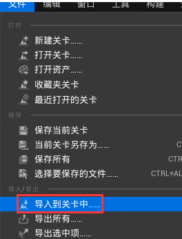
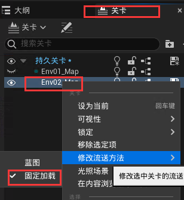
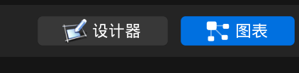

此为从0开始一个展示项目，非常简练，值得反复细品，[地址](https://www.bilibili.com/video/BV1Wf4y1v7oY?t=2.9)。

下面的笔记就是制作过程、顺序。

## 一、外部模型导入

​	这次做的是受电弓模型的导入，它是由3Dmax做的，可以直接导出成fbx格式的模型，也可以用datasmith的插件导出，但是datasmith数据导入后无法成为一个Actor蓝图。

故，用的fbx导入：参考[地址](https://zhuanlan.zhihu.com/p/291074204)，对应的官方文档[地址](https://docs.unrealengine.com/5.2/zh-CN/fbx-scene-import-in-unreal-engine/)。 

具体参数解释可再看上面的知乎教程，步骤：

1. 核心是 Import Into Level：
   
2. 设置参数：
   
3. 不要去计算，要去导入法线切线：
   

如果是自己手动去拼接一个Actor蓝图类，一定要看[这](https://www.bilibili.com/video/BV1Wf4y1v7oY?t=105.6&p=3)，它是导入汽车模型，然后静态网格体在一个Actor蓝图中做拼装，这里我就不写了。

## 二、创建蓝图和项目

### 2.1 创建HDRI空项目

第一步打开引擎选择一个空白的模板，进去：

1. 启用材质的“透明图层”：项目设置-->搜索“clear”-->勾选“透明图层启动第二法线”（画质更高，开销更大，一般的展示就不开启了吧）
   
2. 在插件中打开“HDRI”背景插件：
   

### 2.2 创建环境

#### 2.2.1 创建关卡

**创建关卡**：（后面的ptcc是代表受电弓的简写），先创建一个Maps文件夹

1. 在“Maps”文件夹中创建两个关卡：“Ptcc_Map”、“Env01_Map”
2. 双击打开“Ptcc_Map”关卡，是一片黑的，再在“窗口”中把“关卡”勾选上，然后把“Env01_Map”拖进去，成为“Ptcc_Map”关卡的子集：（[地址](https://www.bilibili.com/video/BV1Wf4y1v7oY?t=62.5&p=4)）
   
   - 这样可以隐藏，也能在播放中加载，就可以==与背景、照明、字符等分开==。
   - 还可以有很多子级别的map，这蓝色的表示被选中，如果放置Actor，它将被放置在次选定级别中。
   - 这个“持久关卡”就是一开始的双击的“Ptcc_Map”,可以双击进行切换。

#### 2.2.2 加入HDRI背景

**加入HDRI背景**：

1. 从“放置Actor”中的光照中把“HDRI背景”拖入“Env01_Map”关卡(上面这一步就是选中的)，如果亮度发生变化，在“显示”-->“后期处理”-->取消勾选“眼部适应”
   
   如果是只要局部使用这个操作，可以加后期处理的框然后设置，可以看[这里](https://www.bilibili.com/video/BV1Wf4y1v7oY?t=515.6&p=5)。
2. 去下载hdri的图片，[下载地址](https://polyhaven.com/)：下载.hdr格式的，然后导入，双击打开
   - 将“最大纹理尺寸”设置为4096，以防止分辨率变得过低
   - 将“Mip 生成设置“”设为“无mip贴图”
3. 然后去替换刚添加的默认的HDRI背景，并有一些参数调整光照强度和图的圆润程度：
   
4. 再添加一个“定向光源”，让其图上与强光源(例如太阳)的方向大致对齐(相当于自己做一个光源)，再设置一下强度和温度.

---

**制作另一个背景**：

然后在把刚才的“Env01_Map”复制一个并改名为“Env02_Map”，再把这个Env02_Map拖到关卡中去

- 随后把==“Env01_Map”的可视性关掉==，并选中“Env02_Map”；
- 接着在大纲中选中那个HDRI的组件，然后在其细节面板把刚才另一张HDRI的图给替换了
- 然后也调整一下这个场景的光照情况

#### 2.2.3 模型放入场景

模型放入场景：==在关卡那里点击切换到“持久关卡”后==，再把模型导入，  # 这很重要

注：尽量把导入的模型放在世界坐标的原点，即都设置为（0,0,0）

### 2.3 设置相机

创建一个相机、游戏模型，以便可以播放它。

​	即：可以使用鼠标拖动在汽车周围移动的相机；并前后移动鼠标滚轮，并添加景深，以这种方式自动聚焦的功能。

#### 2.3.1 添加轴输入

​	这些如果用第三人称模板，应该就是开启了的，使用空白的，就要自己去手动开启，还有些其它的，有需要的话，去打开使用。

添加输入的轴映射：项目设置 --> 引擎 --> 输入
 

#### 2.3.2 ==四个蓝图类==

制作4个蓝图，[地址](https://www.bilibili.com/video/BV1Wf4y1v7oY?t=68.1&p=5)。  # 这很关键

1. 创建一个Pawn类蓝图  # 这像是游戏中的玩家，所以是第一人称视角的相机
2. 创建一个PlayerController蓝图  # 这算是运营蓝图
3. 在蓝图所有类中搜索“PlayerCameraManager”   # 这是相机操作的蓝图
   
4. 同上创建一个“GameModeBase”蓝图   # 用于设置要操作的Pawn以及要使用的PlayerController等

---

核心：下面是改上面创建的4个蓝图的设置：

- 第4步创建的蓝图：BP_GameModeBase
  - 这个进去把“玩家控制器类”改成上面第2步创建的蓝图;
  - 把“默认pawn类”改成第1步创建的蓝图；

- 第2步创建的蓝图：BP_PlayerController

  - 把“玩家相机管理器类”设置为上面第3步创建的蓝图；
  - 勾选“显示鼠标光标”、“启用点击事件”；

- 第3步创建的蓝图：BP_PlayerCameraManager

  - 把“视图最大Pitch”的值改为0；

- 第1步创建的蓝图：BP_Pawn

  - 添加一个“弹簧臂组件”，并在这组件下添加一个“摄像机组件”

  - 以下几点都是针对弹簧臂组件的细节面板：

    - 试自己模型的大小，改变摄像机的“目标臂长度”，一般给到400吧。
    - 取消“进行碰撞测试”的勾选;  # 弹簧臂组件
    - 启用“使用Pawn”控制旋转。  # 这样它才会跟着我们的鼠标移动
    - “滞后”中勾选“启用摄像机旋转延迟”，然后“摄像机旋转延迟速度”改为5

  - 在此蓝图中的事件图标图表添加控制逻辑：

    - 注意垂直方向乘的是一个==负数==，是朝着相反方向运动的
      
    - 鼠标滚轮事件（mouse up/down）：通过滚轮来缩放画面  # 视频说是还可以通过mouse x 来实现   
      

    说明：

    - 实际就是通过这个事件来改变弹簧臂的长度，以达到镜头缩放的目的；
    - 注意它的时间对应的加减符号；
    - ==使用"clamp"结点来限制镜头无限后移或是前进==。

#### 2.3.3 加入玩家出生点

1. 然后都设置完了，去到主界面的“世界场景设置”把“游戏模式重载”设置为刚创建的蓝图“BP_GameModeBase”
2. 选中“持久性关卡”添加玩家出生点，就可以开始玩了，运行后如果是一片黑，就在关卡中选中一个子级别的图，设为“固定加载”：
   

特别注意：

- 尽量把导入的模型放在世界坐标的原点，即都设置为（0,0,0）
- ==添加playstart时，也要放置在世界坐标的原点，可稍微比模型高一点==。 # 这非常非常重要

#### 2.3.4 自动聚焦

​	添加一个自动聚焦的功能：具体原理和设置可看[这里](https://www.bilibili.com/video/BV1Wf4y1v7oY?t=821.1&p=5)。里面的参数设置原理一定要去看视频，视频里有讲解。

下面的截图来自“BP_Pawn”:

### 2.4 改表面颜色功能

#### 2.4.1 两种颜色基础切换

这一小点只是比较简单的良好总颜色切换，如果是多种颜色，建议使用下一小节的方法。

1. 打开一个材质，添加一些“VectorParameter”结点，还有线性的lerp插值结点：
   

2. 回到内容浏览器添加一个“材料参数集”：（方便传参，管理更多颜色）（**注意命名时不能太长了，编译不会报错，但功能不会起作用**）
   

   - 然后双击打开这材质参数集，添加一个“标量参数”，参数名自己取，这里就写个time：
     

3. 把上步创建的“材质参数集”用==鼠标拖==到第1步材质的编辑界面，并在其细节面板上把“参数名”设置为刚改的time，并链接到lerp结点的Alpha上：
   

4. 去到受电弓的蓝图类里事件图表写逻辑： # 核心是能通过时间轴来改变第2步的time参数值
   

   - 注意“设置标量参数值”这个结点；
   - Collection中是第2步中创建的“材料参数集”；
   - 然后改的参数名一定要填进去，是上面设置的“time”

   这样就可以让颜色随着时间轴设置的曲线进行变化。（时间轴的y轴一定是0-1，x轴的时间长度就自己定了）

   ​	接着还要在这个蓝图中，点击选中它的根结点，在其细节面板中==开启接受输入==，这样才能在有键盘的事件: # 这很重要
   

#### 2.4.2 进阶多种颜色切换

​	这是在2.4.1的基础上，进行多种颜色的切换，所以还是要先熟悉2.4.1，主要使用的“材质参数集”。还是比较简单化的，具体可以看[教程](https://www.bilibili.com/video/BV1Wf4y1v7oY?t=457.6&p=6)。

1. 在材质参数集添加两个颜色“A、B”，一切都是在这两个颜色上变换：
   其中A就是一开始的材质默认颜色，B就添加上，不用给值

   
2. 进到受电弓主要材质里，不再是新建一个参数，而是用材质参数集：
   

3. 来到受电弓的蓝图类写逻辑：
   - 创建四个变量(要变换的几个颜色就对应几个)，他们都是结构体(可自定义结构体，视频中就是，但这我发现不需要)中的“**线性颜色**”，然后设置好它们的默认值：
     
   - 因为默认的颜色是本来的，前面也设置叫“BaseColor_A”，现在就是按键改变“BaseColor_B”的颜色（结合第2点看），核心节点是“设置向量参数值”：
     
   - 为了可以连续变换颜色，这里理论很重要：
         当颜色从“BaseColor_A”变成“BaseColor_B”，后，把“BaseColor_B”的值给到“BaseColor_A”，同时把“time”又设回到0，相当于回到一开始的状态(不过此刻是“BaseColor_B”的颜色)：
     

4. 最终所有的颜色变换的蓝图：
   

### 2.5 开关车灯

由于受电弓有这个，就先不写了，教程[地址](https://www.bilibili.com/video/BV1Wf4y1v7oY?t=30.0&p=7)。主要有用到一个名为“创建动态材料实例”(Create Dynamic Material Instance)。

### 2.6 开关门

​	这个教程的这个方式似乎更加直观：主要是用到“ease”这个节点，我这里把受电弓碳滑块向上移动300用这种方式实现了，还用了原本最经典的方法：

- 教程的“ease”节点，添加后，它的result节点直接去连嘛，它会自适应，A、B对应节点就会相应变化：（这个节点不但可以选择线性，还可以选择指数、缓出之类的，这次这个效果似乎更好）（加的值，这里是1.0，也要看实际情况而定，可能是100）
  
- 以前常用的lerp实现：
  

### 2.7 按键更换环境

这个功能就是在更换前面哪个关卡那种，我暂时用不到，教程地址放[这](https://www.bilibili.com/video/BV1Wf4y1v7oY?t=13.3&p=8)。

### 2.8 制作UMG界面

#### 2.8.1 仅仅颜色按钮

​	很重要的一点，使用的图片用UE打开后，要去设置其最大纹理大小，一般比button小一点，比如button设置成130的，然后max纹理设置为128。

1. UI界面的制作就看教程吧，汽车的[这个](https://www.bilibili.com/video/BV1Wf4y1v7oY?t=150.7&p=9)，和谌嘉诚的[教程](https://www.bilibili.com/video/BV164411Y732?t=203.5&p=66)，这主要是ui界面，然后因为用的ue5，创建的控件里一开始没有“画布画板”，自己去添加一下：
   

2. ui界面布置好后，就去==关卡蓝图==中设置：（谌嘉诚教程中还讲了很细）
   

3. 当button设置好后，ue5注意要在其细节面板的右上角把“==是变量==”勾选上，这样它才会出现可以点击这些事件的组件：
   

   注意：在添加button后在其细节面板把“背景颜色”的A透明通道从1.0改为0.0。

4. 然后就可以给其添加点击事件了，然后就会跳转到其右上角的“图表”，就能去写逻辑，再点击“设计器”就会回到ui界面的设计。然后比如按R键变成红色，就可以先在受电弓的蓝图里在按键R那再添加一个自定义事件，方便在umg中的图表调用：
   
   

5. 同理，其它的也都这么做，这么做最简单了，汽车那个教程的做法有些复杂，它不是在umg图表中调用，而是用事件绑定的方式，我觉得逻辑不是很好，只能说是一种方式，当了解（主要他那种方式，我也没能实现出来）。

#### 28.2 把按钮制作播放动画

视频[地址](https://www.bilibili.com/video/BV1Wf4y1v7oY?t=1206.6&p=9)，跟着这个来吧，不写了。写几个注意点：

- button要在其细节面板最下面能有点击事件，一定要在细节面板右上角上把 “是变量” 勾选上。
- 一定跟着视频把初始的做了，要先选中才能在动画轨道上做动画。
- 一些类似的节点，可以折叠成宏，然后复用。

### 2.9 用Sequencer制作升降弓的动画

主要的一个参考是这个[教程](https://www.bilibili.com/video/BV1fG4y177eR?t=9.2)。（注意，这种只能在当前关卡使用，哪怕控制逻辑是写在受电弓的蓝图，在别的蓝图这种动画序列都是不行的）

​	简单说明一下，组件好的模型，拖入到场景后，不仅仅是可以做它的一个整体动画，还可以就它的局部的部件做动画。下面使用的ue5.2做的示例截图。

1. 创建关卡序列，然后选择保存地址和名字：
   

2. 打开关卡序列，把场景中的受电弓拖到序列界面的左侧，然后点加号，就可以选择它的部件：
   

3. 然后就是设置其关键帧，这就不多说了，注意有些部件是可以改变其中心枢纽点的，就方便旋转。

   1. 一个特别重要的点，要“把Sequence播放结束后，物体保持在最终状态”，不然播放完后，它默认是回到物体最初状态。设置方法，右键点击变换轨道，然后属性中将“完成时”设置为“保持状态”,默认值是“项目默认”：
      

4. 最终在蓝图中写逻辑，可以写到关卡蓝图中，也可以写到受电弓蓝图中，但是要注意在其蓝图默认值中开启接收玩家输入，方便键盘事件：核心节点是“创建关卡序列播放器”
   

   - 一般来说，“创建关卡序列播放器”在“Begin”节点后就去创建了，然后通过“Gate”节点来控制；
   - 这样就只会创建一次，不要将其接在键盘事件后，这样按一次就会创建一次，不好。

   

