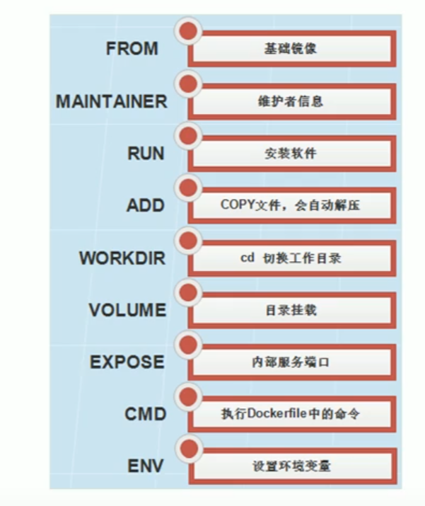

英伟达各种镜像(cuda、tensort...)的查询地址：[这里](https://catalog.ngc.nvidia.com/containers)。

一个我常用很多的创建容器的命令：
docker run -it --gpus=all -v /tmp/.X11-unix:/tmp/.X11-unix -v /etc/localtime:/etc/localtime:ro -v /opt/3d_datas/:/root/3d_datas  -w /root --net=host --name=sh_camera nvidia/cuda:11.4.3-devel-ubuntu20.04  /bin/bash


## 一、虚拟化概念

这些虚拟化都用到了 hypervisor:

​	==Hypervisor==是一种运行在物理服务器和操作系统之间的中间软件层,可允许多个操作系统和应用共享一套基础物理硬件，因此也可以看作是虚拟环境中的"元"操作系统，它可以协调访问服务器上的所有物理设备和虚拟机，也叫虚拟机监视器(Virtual Machine Monitor，VMM)。Hypervisor是所有虚拟化技术的核心。当服务器启动并执行Hypervisor时，它会给每一台虚拟机分配适量的内存、CPU、网络和磁盘，并加载所有虚拟机的客户操作系统。Hypervisor是所有虚拟化技术的核心，软硬件架构和管理更高效、更灵活，硬件的效能能够更好地发挥出来。常见的产品有:VMware、KVM、Xen等等。

1.==全虚拟化== 

​	在全虚拟化的虚拟平台中，GuestOS并不知道自己是一台虚拟机，它会认为自己就是运行在计算机物理硬件设备上的HostOS。因为全虚拟化的VMM会将一个OS所能够操作的CPU、内存、外设等物理设备逻辑抽象成为虚拟CPU、虚拟内存、虚拟外设等虚拟设备后，再交由GuestOS来操作使用。这样的GuestOS会将底层硬件平台视为自己所有的，但是实际上，这些都是VMM为GuestOS制造了这种假象。


2.==操作系统虚拟化== 

​	操作系统层虚拟化是指通过划分一个宿主操作系统的特定部分，产生一个个隔离的操作执行环境。操作系统层的虚拟化是操作系统内核直接提供的虚报化，虚拟出的操作系统之间共享底层宿主操作系统内核和底层的硬件资源。操作系统虚拟化的关键点在于将操作系统与上层应用隔离开，将对操作系统资源的访问进行虚报化，使上层应用觉得自己独占操作系统。


3.==平台虚拟化(硬件虚拟化)== 

​	平台虚拟化表现为在一个给定的硬件平台上宿主机创造一个模拟的计算机环境虚拟机提供给客户机。客户机软件对于用户应用程序没有限制;许多宿主机允许运行真实的操作系统。客户机就好像直接运行在计算机硬件上，伴随着几个明显的警告。虚拟机对硬件资源(如网络，显示器，键盘，硬盘)的访问被统一管理在一个比处理器和系统内存更有限制性的层次上。客户软件经常被限制访问计算机周边设备，或者被限制在较低的设备性能上，这取决于宿主机硬件访问策略设定。


## 二、docker入门

docker就是一个虚拟化容器

docker架构：


### 2.1. 安装、启动

安装按照官方教程来就好（还是按照[菜鸟教程](https://www.runoob.com/docker/centos-docker-install.html)来吧）(更新：菜鸟教程一般用的是在线脚本，离线安装的话，通过rpm安装吧，可以指定版本，看[这里](https://www.bilibili.com/video/BV1n4411v7Rz?p=9&t=271.6)(这里面还有添加docker的repo的，试了没成功)，docker的rpm包[下载地址](https://download.docker.com/)(有不同的部分，不是很好搞))

自己安装需要去下载核心引擎，每个不同名字的都要下，有几个，ubuntu好像有4个

每次重启机器后一般都要手动启动docker

>启动：systemctl start docker
>
>停止：systemctl stop docker
>
>重启：systemctl restart docker
>
>开机自启：systemctl enable docker      # 关闭开机自启 disable
>
>查看状态：systemctl status docker
>
>关防火墙：systemctl stop firewalld
>
>查看docker占用磁盘：docker system df
>
>docker login [镜像仓库地址]        # 不加就是默认登录官方地址，
>
>---
>
>\# 下面这是把普通用户加进组内，不然普通用户每次都输入sudo，就很麻烦
>
>sudo groupadd docker      # 可能提示docker组已经存在，不影响。
>
>sudo usermod -aG docker $USER   # 后面这是当前用户名，

配置镜像加速器(编辑的json文件可能是不存在的 )：


```
# 针对ubuntu，centos也是一样的
sudo mkdir -p /etc/docker
sudo vim /etc/docker/daemon.json 
{
  "registry-mirrors": ["https://6jaa2649.mirror.aliyuncs.com"]
}

sudo systemctl daemon-reload
sudo systemctl restart docker
```

重启网络：service network restart

### 2.2. docker镜像操作

- 列出镜像：`docker images` 

- 搜索镜像：docker search 镜像名称

- 拉取镜像：docker pull 镜像名[:版本号]  # 可以不指定版本号就是最新的 `docker pull centos` 想要知道有有些版本号，就要去到[docker hub](https://hub.docker.com/r/library/)搜索查看

- 删除镜像：docker rmi  镜像名1 [镜像名2...]
  很多镜像有关联时，会删不掉，先去删除一下容器，再删不掉就 `docker rmi -f 镜像名`

### 2.3. docker容器操作

#### 2.3.1 创建容器

有了镜像之后，就可以操作容器了：
	docker run [OPTIONS] IMAGES [COMMAND] [ARG...]

建议使用，一个例子：docker run --gpus all -it --rm -v $(pwd)/yolov4-triton-tensorrt:/yolov4-triton-tensorrt -w /yolov4-triton-tensorrt nvcr.io/nvidia/tensorrt:20.09-py3     # 这就是只用docker的一个环境

- 启用临时的交互容器，只是用docker的环境来构建东西，用完就删了，就 --rm，算是一次性容器，就不用 --name 指定名字了
- -v 把宿主机的yolov4-triton-tensorrt这个项目文件夹挂载到容器的/yolov4-triton-tensorrt目录
- -w 容器启动时直接进到这个目录(注意接绝对路径)，然后就可以在容器内操作这个项目，mkdir build && cd build && cmake .. && make,搞定后就退出容器，临时容器也就自己删除了，这时宿主机的这个项目也编译好了。


交互式容器: 
`docker run -it ubuntu bash`   =   `docker run -it ubuntu bash`        # 这也是一样的  没有名字会随机生成

`docker run -it --name c1 centos /bin/bash`  =  `docker run -it --name=c1 centos /bin/bash`

- -i：代表是交互式容器
- -t：tty终端(分配一个终端，操作容器)
- --name：指定容器的名称为 c1 (需唯一，不能重复)
- 最后的命令bash这些是可以不要的
- 如果使用的镜像本地没有，就会先从网上拉取

交互式容器创建完后就会直接进去，就可以操作了，退出后，容器就会停止

==守护式容器(后台运行)==：

`docker run -itd --name c2 centos /bin/bash`  

 必须指定参数 i t 否则会直接退出；centos是镜像名

- -d：这个参数是核心，就是创建守护式容器，退出后，容器还是在运行的，可随时进入

#### 2.3.2 查看/进入/删除

查看正在运行的容器：`docker ps [option]`
-a:查询所有的容器   -l:查询最后一次运行的容器

ps:守护式容器退出后，容器不会停止

---

>停止容器：docker stop c1     
>开启容器：docker start c1

***

==进入容器==：`docker exec -it c2   /bin/bash`   
		 \# 这里必须要有  /bin/bash
最后这个参数其实就是代表创建容器后进去进行的命令，使用/bin/bash就会留在容器里操作，假如是docker exec -it c2 nvidia-smi 就代表进去容器后，执行nvidia-smi这个命令，并把结果显示出来，还是停留到当前宿主机环境的。后面执行的命令可以是其它的或者脚本文件的执行。

---

查看容器的详细信息：`docker inspect c1`   #这里就会有IP地址
获取容器的IP地址：docker inspect -f=`{{.NetworkSettings.IPAddress}}`` c1 #注意右边是是单个符号

---

删除容器：`docker rm c1 [c2...]`   # 一般删除容器前，要先stop，也可以强制删除(加一个-f)：docker rm -f c1[c2...]
删除所有容器：
docker rm `docker ps -a -q``  #注意右边是是单个符号(为了防止它变化) 或者
docker rm $( docker ps -a -q )    # 或者
ps -a -q | xargs docker rm    

---

查看容器当前端口的映射关系：`docker port a_container_name`

---

查看容器日志：`docker logs c1`

---

查看容器资源占用：`docker stats  [容器名]`   # 加了具体容器名，就是在指定容器的资源占用，不加就是看所有的容器占用

---

重启容器：`docker restart 容器名`

#### 2.3.3 文件拷贝

​	容器与宿主机相互间文件拷贝：

宿主机-->容器：docker cp 需要拷贝的文件或目录 容器名称:容器目录
`docker cp 1.txt c1:/root`

容器-->宿主机：`docker cp c1:/root/2.txt /root`

#### 2.3.4 相关参数-v

docker run后面的一些参数：

​	在创建容器的时候，将宿主机的目录与容器内的目录进行映射，这样就可以通过修改宿主机某个目录的文件从而去影响容器。比如容器内有一个配置文件，就可以修改在宿主机内映射的位置文件，从而达到修改容器内文件的目的(有些同步的味道)。
​	方式：创建容器添加-v参数后边为 宿主机目录:容器目录
`docker run -d --name=c2 -v /opt/:/usr/local/myfile   centos /bin/bash `   # 要么给 -it  要么就是 -d（给-d,后面就不要/bin/bash了），就不一起给了

-v 的参数应该就可以写成  --volume
	-v /etc/localtime:/etc/localtime:ro  就是让容器使用宿主机的时间，时间同步。

-e DISPLAY=:0.0  # -e(或者--env)就是设置环境变量,这好像可以一次设置多个

-w 指定工作目录， # 启动容器时传入-w <work_dir>参数即可

-p 8989:22   # 端口映射，这样访问宿主机的8989窗口就是在访问docker的22窗口

--restart=always     # 加了这个参数后，docker启动，这个容器就会跟着自己启动，不用去手动启动了

-h 主机名         # 设置容器主机名

--dns  xx.xx.xx.xx   # 设置容器的DNS服务器

--add-host  www.baidu.com:192.168.5.6      # 进到容器内，cat /etc/hosts  就会看到对应关系

--net=

- bridge    # docker默认方式，网桥模式
- none      # 容器没有网络战，就只有本机回环地址
- container    # 使用其它容器的网络栈，两个容器直接通讯了，不再通过docker0这种交换
- host   # 表示容器使用host的网络，没有自己独立的网络栈，容器可以完全访问host的网络，不安全（这种容器开发的端口，宿主机也会直接开放，不再加参数-p）

#### 2.3.5 容器改名

`docker rename old_container_name new_container_name`

​	如果某个容器的NAMES和另外一个容器的ID都是一样的，都叫==abc123==，那么这个命令的第一个参数，会去有限匹配==NAMES==,再匹配==ID==,那么第一次会把==NAMES==为abc123的容器改名，第二次会把==ID==为abc123的容器改名。改名可以是在容器运行时改。

### 2.4. GPU使用

安装：
	以前为了配置nvidia-docker，需要安装完docker之后再安装单独的nvidia docker2，而现在只需要安装`nvidia container toolkit`即可，更加方便了，[官网](https://github.com/NVIDIA/nvidia-docker.git)参考，以下是直接的安装步骤：

- ubuntu：

```shell
##首先要确保已经安装了nvidia driver
# 2. 添加源
distribution=$(. /etc/os-release;echo $ID$VERSION_ID)
curl -s -L https://nvidia.github.io/nvidia-docker/gpgkey | sudo apt-key add -
curl -s -L https://nvidia.github.io/nvidia-docker/$distribution/nvidia-docker.list | sudo tee /etc/apt/sources.list.d/nvidia-docker.list
 ​
# 2. 安装并重启
sudo apt-get update && sudo apt-get install -y nvidia-container-toolkit
sudo systemctl restart docker
```

- centos:

```shell
distribution=$(. /etc/os-release;echo $ID$VERSION_ID)
curl -s -L https://nvidia.github.io/nvidia-docker/$distribution/nvidia-docker.repo | sudo tee /etc/yum.repos.d/nvidia-docker.repo
sudo yum install -y nvidia-container-toolkit
systemctl restart docker
```

​	安装完后，都记得重启一下，不然会报错的，像这样：docker: Error response from daemon: could not select device driver "" with capabilities: [[gpu]].  # 久了不用不行的话，就把这remove掉再安装一次。

---

使用测试：

```shell
sudo docker run -it --gpus all  --rm nvidia/cuda:10.2-base 
```

-  --gpus all  是必须要的(如果要使用显卡)
   -  或者指定某个GPU：--gpus "device=0"
- 其中最后的参数`nvidia/cuda:11.1-base`是Nvidia官方的镜像，需要根据实际安装的cuda版本进行修改，里面是有cuda的动态库的，torch.cuda.is_available()是True（但是精简了二进制这些文件，用nvcc -V是没结果的）。以上只是创建了一个容器，还需要进到容器里，使用nvidia-smi查看信息。

​	或者我只是想查看一下并不想创建一个容器(上面那样会创建一个容器)：

```shell
docker run  --rm --gpus all nvidia/cuda:10.2-base nvidia-smi
```

- --rm    这个参数必要有，就不会留有容器，那些--name、-it也可以不用加。
  这个参数也就是Automatically remove the container when it exits
- 最后直接加上要执行的 nvidia-smi 命令就好了。

补充说明：
    针对一个纯净镜像创建容器时加了--gpus all，就代表显卡可用了，然后是可以在里面装不同版本的cuda进行使用的。

### 2.4.5 ==cuda镜像地址==

英伟达各种镜像(cuda、tensort...)的查询地址：[这里](https://catalog.ngc.nvidia.com/containers)。

带各个带cuda版本的地址：

- [这](https://hub.docker.com/r/nvidia/cuda)是dockerhub上的说明。
- 根据上一行链接的内容点进去的带各个cuda版本的tag标签。  
  - 就是这里的链接里去找合适的版本，然后 docker pull nvidia/cuda:“tag名” 
    “tag名就这[链接](https://gitlab.com/nvidia/container-images/cuda/blob/master/doc/supported-tags.md)去找”

它还有带pytorch的版本，如：
    ARG BASE_IMAGE=nvcr.io/nvidia/pytorch:21.08-py3

pytorch带cuda版本：

- pytorch/pytorch:1.8.1-cuda11.1-cudnn8-devel，其它版本[地址](https://hub.docker.com/r/pytorch/pytorch/tags?page=1&name=1.8.1) 
- nvcr.io/nvidia/deepstream:5.0.1-20.09-samples

### 2.5. docker远程GUI

- X11转发更适合用到linux上或是远程桌面的直接显示。
- Xming更适合用在windows上。
- docker里面用X11转发时，尽量不要用centos，总是会报错不行。
- 关于xhost、转发、display变量的详细说明：[这](https://blog.csdn.net/zggzcgy/article/details/109252051)。用到时可以点进去看看，解决很多 can^'^t open display::0 的问题。

#### 2.5.1 X11转发

​	这里使用的是界面服务X11的端口共享给docker，可以做到在xshell远程服务器，再进入到docker中运行相关gui程序，在不依靠外界程序的情况下，==将图像展示到docker所在宿主机或类似于mstsc的远程桌面上==，下面我将以opencv展示播放一个视频为例子：

​	在创建，或是进入一个已经创建好的容器时，一定要先在终端执行这条命令：`xhost +`,再执行下面的操作(注意：每次重启机器后要使用的话，都要这样执行一次)表示开放权限，允许所有用户，当然包括docker,访问X11的显示接口，更多有问题时看[这](https://www.cnblogs.com/panpanwelcome/p/12877902.html)。(或者针对root就用`xhost local:root`)

1. 首先拉取一个官方ubuntu镜像,并创建一个名为img5的容器：
   `docker run -v /tmp/.X11-unix:/tmp/.X11-unix  -it --name img5 ubuntu:18.04 bash` 
   - -v /tmp/.X11-unix:/tmp/.X11-unix ：共享本地unix端口，必须要有
   - 其实，创建容器时还有，看到的例子还有两个参数，但好像实际并没有用到，同时这里还有一种针对已经启动的容器修改系统参数，详见[这里](https://www.cnblogs.com/panpanwelcome/p/12877902.html)。
2. 然后[换源](../environment/ubuntu的一些使用.md),接着在里面安装好minianaconda和opencv-python;
3. opencv-python安装好后，还需要一些依赖，不然在import cv2时会报一些错误：
   - 错误：==ImportError: libGL.so.1: cannot open shared object file: No such file or directory==，那么解决办法就是：
     `apt install libgl1-mesa-glx`；
   - 再导入cv2，另一个错误：==ImportError: libgthread-2.0.so.0: cannot open shared object file: No such file or directory==，那么解决办法是就是：
     `apt-get install libglib2.0-dev`。
4. 在执行import cv2时，就不会报错了，但是执行到相关图像展示代码时，可能会报类似这样的错误：==...This application failed to start because no Qt platform plugin could be initialized. Reinstalling the application may fix this problem.
   Available platform plugins are: xcb.==,那么解决办法啊就是：
   `apt-get install xarclock`    # 这其实是一个显示时钟的小程序，安装这，会解决很多依赖问题（要先apt-get update一下）
5. 执行命令`xarclock`,显示第四步中的小程序，大抵会得到这么一个错误：==Can't open display...==,解决办法：
   `export DISPLAY=:0.0`  # 说明看[这里](http://blog.itpub.net/12798004/viewspace-2130342/)，这可以在创建容器时指定这个环境变量(冒号前面省略了localhost)。
   - :0.0 这个值代表就是在docker所在的宿主机上进行画面的展示；
   - :10.0 这个值就是远程桌面时(我是用的微软的mstsc)，显示在远程桌面这里(注意，它可能是其它11、12、13，每次重新启动后，远程桌面后，要在比如mstsc链接的终端看当前==echo $DISPLAY==的值是多少，然后这里对应就要设成多少，一般都是10，如果改变了也要对应修改，没设置一致的话，程序启动后就会卡住)；
   - 在xshell打开的终端中设置:10.0时并执行代码时，如果开了mstsc远程桌面时就是在mstsc上展示，没开mstsc时，代码也是在跑，但是没有显示窗口。
6. 执行`xarclock`这个时钟就能正常运行了，这时Python显示视频的代码一般也就能正常运行了，显示窗口根据设置的DISPLAY环境变量 来决定。

Tips:

- 创建或是进到一个容器前一定要先执行`xhost +`,不然就会得到这样的错误：==No protocol specified==;
- 第一次创建容器时一定加上==-v /tmp/.X11-unix:/tmp/.X11-unix==参数，使用起来会比较方便，像是==-e DISPLAY==这样设置环境变量的参数，可以在运行的docker内部快速设置，所以创建容器时可加可不加;
- 可以自己把换源后装上minianaconda的容器先commit成一个镜像，然后在此镜像基础上再进行后续操作，后续环境弄完了也可不从最开始做起，节省时间;
- 这样制做的镜像，再创建容器时，就不用加-v共享unix端口这个参数了，默认就是会有的。

我这样做了一个叫==my_ubuntu:18.04==，换了源，也安装了minianaconda和opencv及其依赖库，放docker仓库和阿里了。

方便后续复制代码的：`docker run -v /tmp/.X11-unix:/tmp/.X11-unix  -e DISPLAY=:0.0 --rm  -it --name img5 my_ubuntu:18.04 bash`,然后进到/opt里就可以运行代码了：

- --rm ：做测试时，把这加上，用完就自动删除，方便

#### 2.5.2 Xming

1. 首先[下载](https://sourceforge.net/projects/xming/)Xming，默认安装直接下一步就好了；
2. 安装完成候会用Xming和XLaunch,点击Xlaunch,基本都是点击下一步，最后一步一定要勾选那个==No Access Control==,不然执行gui图像时，可能会出现No protocol specified；
3. 然后在docker中设定环境变量(win的IP地址)：
   export DISPLAY=192.168.108.147:0.0
4. 然后在docker中执行相关程序就好了，也不需要安装其它依赖或是添加-v共享窗口的参数，可以在xshell中直接更改DISPLAY的环境变量，直接Xming而不是XManger的转发。

Tips:

- 可以把XLaunch打开到最后的界面，点击==Save configuration==保存到一个地方，创建快捷方式放在磁贴里，下次用的时候直接打开就行了，就不用再一步步去点击。

deepstream的docker镜像：docker pull nvcr.io/nvidia/deepstream:5.0.1-20.09-samples    # 拉取报错的时候先拉一个ubuntu就好了

### 2.6. vscode直接远程进docker容器

1. windows上需要先安装Docker，（注意这安装完成后有restart的话点确定会重启电脑）
   - 安装时不使用其推荐的WSL吧
2. vscode先安装docekr、Remote-Containers插件，远程连接上服务器后，也要在插件中搜索docker安装远程SSH那一栏；
3. 点击docker那个图标，就会有服务器上的镜像和容器，选择一个已经开启的容器，右键选择==Attach Visual Studio Code==，然后就会新开一个界面进到这个容器里面；此时打开的folder是这个容器里的，打开的终端也是这个容器里的。

### 2.7. xshell直接远程进docker容器

​	直接用xshell连接进一个正在运行的容器里面，了解一下，感觉用到的也不多，然后使用Xming软件可以实现docker容器中运行gui程序，到本地windows上展示出来：

创建容器时一定映射端口：-p 8989:22   # 这样访问宿主机的8989窗口就是在访问docker的22窗口

容器中配置SSH:

- 安装SSH server：apt-get install openssh-server
- 修改sshd_config，开放22端口，并允许密码登录：
  - echo "Port 22">>/etc/ssh/sshd_config 
  - echo "PermitRootLogin yes">>/etc/ssh/sshd_config
- 启动ssh服务：service ssh start
- 设置ssh自启：systemctl enable ssh
- 设置容器root用户密码，没密码外部无法登录：passwd

最后使用xshell登录，Host还是宿主机的IP，端口改成刚刚映射的8989窗口。

---

在视频中有讲到docker的远程访问，把图放这里，后续有需要再说吧，说是这种不安全，没有任何的认证方式。


## 三、docker镜像制作

- 使用docker commit命令
- 使用docker build和Dockerfile文件

### 3.1. docker commit

​	提交一个正在运行的容器作为一个新的镜像，以桌一个tomcat镜像为例：

>1、拉取一个基础镜像(就是最原始简单的centos、ubuntu)
>	docker pull centos
>
>2、创建一个交互式容器
>	docker run -it --name mycentos centos:latest    # mycentos是一个容器名
>
>3、软件上传到宿主机，再docker cp进容器中
>
>4、再容器中去正常安装，弄好所有软件环境(此时容器是一直在运行)
>
>5、将正在运行的容器提交为一个新的镜像
>	docker commit 一个容器 一个新的镜像名[:TAR]  # 后面的版本号可以不要，如果起的镜像名:版本号都存在了，那就会更新原来的同名镜像
>
>​	docker commit mycentos mytomcat     # 将mycentos容器提交出成为了一个mytomcat的镜像
>
>6、把新的镜像弄一个容器来启动服务
>	docker run -itd --name t1 -p 8888:8080 mytomcat /bin/bash  -p端口映射，将本来的8080端口映射成8888,可以不要。
>
>7、开启服务
>	docker exec t1 /root/root/songh/project/server_run.sh       # 进入t1容器，然后执行相关服务脚本，也可以直接进去后，去执行。

##### 	镜像/容器打包

>6、镜像打包(接着上面步骤5)
>	docker save -o /home/shcc/Desktop/mytomcat.tar mytomcat   # mytomcat是上面 commit 的镜像
>
>7、将镜像上传到其它服务器，其它服务需要这个镜像都可以在这里拿
>	scp /home/shcc/Desktop/mytomcat.tar  192.168.106.210:/root/docker_images/
>
>8、导入镜像(192.168.106.210),之后就是镜像的正常使用了
>	docker load -i /root/docker_images/mytomcat.tar
>
>
>
>容器打包：docker export -o /root/c1.tar c1    # 把 c1 容器打包
>
>导入容器：docker import c1.tar mytomcat:latest     # 应该是导入到 mytomcat 镜像吧

### 3.2. Dockerfile

​	Dockerfile使用基本的基于DSL语法的指令来构建一个Docker镜像，之后使用docker builder命令基于该Dockerfile中的指令构建一个新的镜像。用的就是DSL语法。

​	

执行命令时，基本都还有这种用括号括起来的方式,==引号一定要双引号==。（好像要注意一点，每行命令的起始路径都是`/`目录，所以前面有的命令cd到去的地方，跟后面的毫无关系，后面的想要操作，要么也cd过去，要么使用绝对路径）

> 00、ARG     # 定义变量,可在docker build时，使用--build-arg=来指定参数
>     example:
> 		ARG PYTORCH="1.6.0"
> 		ARG CUDA="10.1"
> 		ARG CUDNN="7"
>
> 01、FROM 基础镜像           # 可以是本地，也可以是远程的
>     example:
> 		FROM pytorch/pytorch:\${PYTORCH}-cuda​\${CUDA}-cudnn${CUDNN}-devel
>
> 02、MAINTAINER             # 维护者信息，可以有多行
>     example:
> 		MAINTAINER songhui example@qq.com
>
> 03、RUN <command\>       # 执行命令，有两种格式，可以有多行
>     example:  
> 		RUN cd /opt && unzip 123.zip && cd ./123/
> 		RUN ["/bin/bash", "-c", "echo hello"]   # 绝对要双引号
>
> 04、CMD       # 设置容器启动时执行的操作，可以是自定义脚本，也可以是系统命令
>     example:      # 该指令只能在文件中==存在一条==，如有多条则只执行最后一条
> 		CMD echo "hello" && echo "world"
> 05、ENTRYPOINT     #也是容器启动时使用，跟CMD作用几乎类似,区别[看这](https://blog.csdn.net/atlansi/article/details/87892016) 
>
> 06、USER     # 设置内容的用户
>
> 07、EXPOSE   # 设置这个，在查看镜像时就提示用户这个端口应该被使用
>     example:
> 		EXPOSE 22    # 只是一个提示，后期创建容器使用，还是要 -p 4567:22 这种
>
> 08、ENV       # 设置环境变量
>     example:
> 		ENV PATH \$PATH:/opt/cmake/bin     
> 		ENV CMAKE_PREFIX_PATH="\$(dirname $(which conda))/../"  # 指定多个时，可以就用一个ENV，多个之间用空格隔开，为了方便看，可以用 \ 来换行，一个变量一行
>
> 09、ADD       # 从宿主机src路径复制文件到容器的dest路径
>     example:  # 压缩包还会自动解压
> 		ADD src dest   # src可以是源目录的绝对路径或相对路径
> 		ADD a_url   # 还可以是一个url，那ADD就相当于wget
> 注意：src为一个目录时，会把目录下的文件复制过去，而目录本身不会复制
>
> 10、COPY    # 不会自动解压，不能url,其它用法一致
>     example:
> 		COPY src dest  # 复制数据用这，就要解压的就用上面    
>
> 11、VOLUME     # 挂载，数据持久化，容器使用的是AUFS,这种文件系统不能持久化数据
>     example:   # 这行还有些东西，在下面点讲到
> 		VOLUME ["/var/log/", "/opt/"]
> 		VOLUME /var/log/ /opt/	 # 代表这两个目录下的数据要持久化	
>
> 12、WORKDIR   # 相当于cd，对RUN,CMD,ENTRYPOINT生效
>     example:
> 		WORKDIR /opt WORKDIR a_data RUN vim a.txt
> 		\# 上面命令就相当于 RUN cd /opt/a_data && vim a.txt
>
> 13、ONBUILD   # 在子镜像中执行,即当前镜像做的容器并不会执行，用这个镜像做的一个新镜像，新镜像构建容器时就会执行
>     example:
> 		ONBUILD RUN ls -la

Tips：

- ADD有几个点：
  - 对于压缩包：.tar、.tar.gz包都没问题，会自动解压，但是.zip是不行的，一定注意（试了下，里面有tar命令，没有unzip命令）；
  - ADD 456.tar.gz /123/ABC     # 即便后面这个目录不存在，它也会自己创建，并把东西解压到目录/123/ABC/这里面
    (注意：.zip就不行，ADD 456.zip /123/ABC 这样的后果就变成了在/123文件夹下有一个文件叫ABC,大小是和456.zip是一样的)
- WORKDIR /123/abc      # 会自己创建这个目录，并进到里面，后面创建容器时，如果没有指定-w参数覆盖，那么创建的所有容器都会默认进到这个目录 
- 这里说个例子，看别人的Dockerfile:
  RUN git clone https://github.com/saic-vul/fcaf3d.git /mmdetection3d   # 这会创建/mmdetection3d这个目录，然后把东西全部放进去
  由于git一直失败，建议windows上下载下来，传到服务器，然后Dockerfile里如下操作：
  - ADD ./fcaf3d/ /    # ADD对于不存在的目录也会先创建的（注意这是放进根目录里）
  - RUN mv /fcaf3d/ /mmdetection3d    # 改个名字，就达到了一样的效果。

实例：

 Dockerfile每一个指令都会建立一层镜像，RUN也不例外，所以同一个工作的命令尽量用&&连接，而不是用多个RUN

每一层构建完后(可以认为是一个RUN跑完)，一定要清理掉无关文件。

```dockerfile
FROM debian:stretch
RUN buildDeps='gcc libc6-dev make wget' \
	&& apt-get update \
	&& apt-get install -y $buildDeps \
	&& wget -O redis.tar.gz "http://download.redis.io/releases/redis-5.0.3.tar.gz" \
	&& mkdir -p /usr/src/redis \
	&& tar -xzf redis.tar.gz -C /usr/src/redis --strip-components=1 \
	&& make -C /usr/src/redis \
	&& make -C /usr/src/redis install \
	&& rm -rf /var/lib/apt/lists/* \
	&& rm redis.tar.gz \
	&& rm -r /usr/src/redis \
	&& apt-get purge -y --auto-remove $buildDeps
```

​	还看到了： apt-get clean  应该也是清理不必要的东西吧

实例：

>通过dockerfile构建镜像步骤：
>
>1、创建一个目录
>
>2、在目录下创建Dockerfile文件以及其他文件
>
>3、通过docker build构建镜像
>
>4、通过构建的镜像启动容器
>
>[栗子](https://www.bilibili.com/video/BV1SD4y1R738?p=30)：
>
>- mkdir a_test
>- 再把Dockerfile文件放里面
>- `docker build -t test_easyocr  --rm=true .` #别忘了这个点
>-t 表示选择指定生成镜像用户名，仓库名和tag（这个选项不是必须的，很多Dockerfile会自己去拉取镜像）（指定了，名字就必须小写）
>--rm=true 表示删除镜像生成过程中产生的临时容器（可以不要这参数，也会自动删除）
>  . 表示用当前目录下的Dockerfile文件构建镜像
> - 测试：`docker run -itd --name easyocr test_easyocr /bin/bash`
>       `docker exec easyocr /bin/bash `
> 
> Ps：Dockerfile单独放一个文件夹比较规范，然后就可以`docker build -t demo a_test/` ；这就是`a_test`就相当于上面的 `.` ，这是Dockerfile所在文件夹的路径。

#### Volume讲解

关于docker中容器管理卷的说明(VOLUME),一共有三种形式：

- Docker-mamaged Volume 容器自管理卷(注意这个目录==/var/lib/docker/volumes==)：
  - 一般的镜像，构建的容器删除了，整个也就删除了，且创建容器时，上述目录也是不会增加文件夹的；
  - 要是要把容器中的某些数据持久化呢，在Dockerfile中就要加入参数==VOLUME /opt/data==,那么样子构建的镜像，每次创建容器时，都会在上述目录中创建一个数字字母组成的名字很长的文件夹用于存放容器中/opt/data文件夹中的所有内容，即便容器删除，在上述目录中的文件夹也不会被删除，文件也就被永久持久化了。
    但是我们的确是要删除这个容器，并想把其在宿主机持久化的目录一起删了，那就加一个参数-v，即：`docker rm -v a_container`，这样就会把在宿主机持久化的目录一起删了。
- Bind-mount Volume 自绑定卷：即在创建容器时加参数 -v /data:/data   # 这个的优先级是高于上面容器自管理卷的，即当构建镜像的Dockerfile加了VOLUME参数时，我用这个镜像创建容器时加了-v自定义绑定卷，那就是以-v为准，/var/lib/docker/volumes也不会再创建一个文件夹。

- Union Volume 联合卷：主要是针对两个容器间的数据同步
  - 可以用宿主机作为媒介，那么两个容器的目录就能同步了；
  - docker run --name test2 --volumes-from test1 -d t2_img:v2.0
    - test1是一个已经创建好的容器，它的Dockerfile一定要有VOLUME参数，会在宿主机/var/lib/docker/volumes目录有个文件夹；
    - 不确定t2_img:v2.0这个镜像构建时是否需要VOLUME参数，假设有，那这样构建的test2容器是不会在上述目录新创建文件夹的，是会跟test1容器共用一个文件夹。

在目录/var/lib/docker/overlay2里还有文件夹应该是跟镜像以及容器相关的，这些好像都不是持久化的，在镜像、容器删除后，其对应的文件夹好像就会自动删除。

#### overlay存储驱动

这一块了解一下有这么个存在吧，是用mount直接挂在，这是一个linux的特性，不是只是docker的，实在用到时来看这个[视频](https://www.bilibili.com/video/BV1n4411v7Rz?p=26&t=301.3)。

#### docker的cpu及内存限制

这个作为了解吧，用到的时候看[视频](https://www.bilibili.com/video/BV1n4411v7Rz?p=28&t=72.7)，然后里面有一个镜像==lorel/docker-stress-ng:latest==，说是java的应用，专门用来做docker容器压力的测试

## 四、docker-compose编排工具

==介绍==：
	根据前面所学的知识可知，想要使用Docker部署应用，就要先在应用中编写Dockerfile文件来构建镜像。同样，在微服务项目中，我们也需要为每一个服务编写Dockerfile文件来构建镜像。构建完成后，就可以根据每一个镜像使用docker run或者docker service create命令创建并启动容器，这样我们就可以访问容器中的服务了。
	虽然使用上述方式可以部署微服务项目，但考虑到微服务项目可能有多个子服务组成，并且每个服务启动过程中都需要配置额外的参数(如-e配置环境变量、--network指定网络、磁盘挂载等等)。这种情况下，每次更新微服务后，都要手动运行指令来重新启动容器，这就显得相当麻烦了。针对这种多服务部署的情况，Docker提供了Docker Compose编排工具来对多服务应用进行统一部署。Compose是Docker的服务编排工具，主要用来构建基于Docker的复杂应用，Compose通过一个配置文件来管理多个Docker容器，非常适合组合使用多个容器进行开发的场景。
	通过该编排工具，可以使用yml (或yaml）)文件来配置应用程序服务，然后只需要一条简单的服务部署指令就可以从配置中创建并启动所有服务。

==安装与卸载==：

>安装：
>
>- 环境要求：确保已装上docker，可点[这里](https://github.com/docker/compose/releases)查看docker compose最新版本
>
>- 下载docker-compose工具（具体最新版本github上看）,注意linux下载的直接是二进制文件，大概是这样的名字：docker-compose-linux-x86_64，赋予可执行权限后，再改名成docker-compose(建议这个，版本更新比较快，下面的链接很容易失效)
>
> ```shell
> curl -L https://github.com/docker/compose/releases/download/1.27.4/docker-compose-`uname -s`-`uname -m` -0 /usr/local/bin/docker-compose
> ```
>
>- 设置docker compose可执行文件权限
>  `chmod +x /usr/local/bin/docker-compose`
>- 查看docker compose版本
>  `docker-compose --version`
>
>卸载：`rm /usr/local/bin/docker-compose`
>
>注：它也是可以通过python的pip来安装使用，书上有，还是推荐使用上面的。

==使用==：

步骤:分为三步(在创建的一个空目录下执行)（建议看书上的demo）

- 编写Dockerfile文件(为每个服务构建需要的镜像，方便迁移-不是必须的)
- 编写docker-compose.yml文件(编写部暑服务相关指令)
- 运行docker-compose up(启动yml文件中服务)

>案例：
>
>- 准备两个镜像(就先不通过Dockerfile构建了)
>  `docker pull mysql:5.7`
>  `docker pull woedpress`
>- 需要新建一个空白目录，例如rwtest。新建一个docker-compose.yml,编辑该文件:
>
>```properties
>version: '3'         
>service:
>    db:
>        image: mysql:5.7
>        volumes:
>            - db_data: /var/lib/mysql
>        restart: always
>        environment:
>            MYSQL_ROOT_PASSWORD: wordpress
>            MYSQL_DATABASE: wordpress
>            MYSQL_USER: wordpress
>
>    wordpress:
>        depends_on:
>            - db
>        image: wordpress:latest
>        ports:
>            - "8001: 80"
>        restart: always
>        environment:
>            WORDPRESS_DB_HOST: db:3306
>            WORDPRESS_DB_USER: wordpress
>            WORDPRESS_DB_PASSWORD: wordpress
>volumes:
>    db_data:
>```
>
>- 启动docker compose
>  `docker-compose up`      # 如果启动失败，要看一下上面有没有给这添加权限
>- 浏览器访问：`http://ip:8001`
>- 停止、重启服务：`docker-compose stop/restart`

Tips：

- 这个格式缩进很严格，如上面的image: wordpress: latest,写成这样就是错的，==wordpress: latest==的冒号后面绝对是不能跟空格的；

- 如果报这个错误yaml: line 1: did not find expected key，可能是因为docker-compose版本高了，2点几的，换成1.29就行

## 五、docker仓库

Docker仓库(Repository）类似与代码仓库，是Docker集中存放镜像文件的地方。

### 5.1. docker hub

>1、在docker hub上开好仓库
>
>2、给本地镜像设置标签：docker tag local-image:tagname new-repo:tagname  (设置tag)()
>	`docker tag hello-world:latest nianjiuhuiyi/mytest:v1`   # 这里前面必须加上我的username，不然在下面第四步push时会报错==denied: requested access to the resource is denied==。
>
>3、登录docker hub
>	docker login(回车，输入账号及密码)
>
>4、推送镜像：docker push new-repo:tagname
>	`docker push nianjiuhuiyi/mytest:v1`

### 5.2. 阿里云

​	进到阿里云后，搜索-->容器镜像服务-->点击个人实例,然后点击管理控制台就到了要的界面

```
sudo docker login --username=nianjiuhuiyi registry.cn-hangzhou.aliyuncs.com
sudo docker pull registry.cn-hangzhou.aliyuncs.com/nianjiuhuiyi_aliyun/my_ubuntu:18.04
```

​	详细可以看官方文档（创建命名空间，再创建仓库，再点仓库名就有操作指南）

>>- 登录阿里云Docker Registry(账号为阿里云账号全名，密码是另外的)
>>  `sudo docker login --username=nianjiuhuiyi registry.cn-hangzhou.aliyuncs.com`
>
>>- 从Registry中拉取镜像（镜像版本号点镜像版本）
>>  `sudo docker pull registry.cn-hangzhou.aliyuncs.com/nianjiuhuiyi_aliyun/a_test:[镜像版本号]`
>
>>- 将镜像推送到Registry
>>
>>  `sudo docker login --username=nianjiuhuiyi registry.cn-hangzhou.aliyuncs.com`
>>  `sudo docker tag mypython_image registry.cn-hangzhou.aliyuncs.com/nianjiuhuiyi_aliyun/a_test:v1`
>>  `sudo docker push registry.cn-hangzhou.aliyuncs.com/nianjiuhuiyi_aliyun/a_test:v1`
>>
>>  mypython_image是我的镜像名，v1是我指定的镜像版本号

### 5.3. 搭建本地私有仓库

​	实在是有点多，平时也应该用不到，在B站收藏里，[33](https://www.bilibili.com/video/BV1SD4y1R738?p=33)、[34](https://www.bilibili.com/video/BV1SD4y1R738?p=33)，以及[这里](https://www.bilibili.com/video/BV1n4411v7Rz?p=18&t=147.3)，(后面这个一定要看，讲的很详细)[这](https://www.bilibili.com/video/BV1n4411v7Rz?p=19&t=506.4)里面还涉及到了https自制证书的操作。

VMware出品：[harbor](https://github.com/goharbor/harbor)。

#### 5.3.1 registry

这是官方提供的一个镜像，比较简单的搭建私有仓库，下面harbor就是在这基础上改进的。

作为仓库的服务器配置：

- 拉取官方registry镜像：docker run -d -v /opt/registry:/var/libregistry -p 5000:5000 --restart=always registry   # 这就开启了一个守护进程

- 配置文件：vim /etc/docker/daemon.json，在里面加写下如下内容：

  ```
  {
  	"insecure-registries": ["192.168.2.3:5000"]
  }
  # 如果这个文件里有内容了，就把这行添加进那个大括号里就好了，记得多行的话，前面行完了要有逗号，不然就会报错
  ```

  说明：192.168.2.3是做仓库的机子的ip地址，5000端口自己设置的，教程说docker默认走的docker hub的镜像，是走的443端口，突然来个5000端口，就要告诉系统我们故意这么做的,所以要这么做个设置

- 改完配置后，重启一下docker：systemctl restart docker 

- 镜像上传，镜像名一定要修改(一般是改成“仓库地址/userName/imageName:tag”)，比如上传的是官方镜像tomcat，就要先改名：

  docker tag tomcat:9.0 192.168.2.3:5000/my_tomcat:v1   # 这其实相当一个链接操作，两个镜像的ID都一模一样
  \# 这里之所有没有userName，是因为没有认证，所有就没有用户名 

- 然后push：docker push 192.168.2.3:5000/my_tomcat:v1

然后就可以查看镜像了：curl -XGET http://192.168.2.3:5000/v2/_catalog

---

作为客户机去下载：

- 一样先配置：vim /etc/docker/daemon.json      
  加入   "insecure-registries": ["192.168.2.3:5000"]

- 重启docker：systemctl restart docker

- 拉取镜像：docker pull 192.168.2.3:5000/my_tomcat:v1

---

Tips：

- 一定要把配置文件对，不然pull拉取的时候，很可能就会得到这个错误：Error response from daemon: Get https://192.168.2.3:5000/v2/: http: server gave HTTP response to HTTPS client
- 这个daemon.json一定要写对，就是一个大括号，里面多行一定要用逗号分开，如果systemctl status docker出现错误，多半是这个json文件没写对，实在改不好，就删除重写吧。

#### 5.3.2 Harbor

介绍：它主要由这几部分组成：

- Proxy：由Nginx服务器构成的反向代理；
- Registry：由Docker官方的开源的registry镜像构成的容器实例；
- UI：即架构中的core services，构成此容器的代码是Harbor项目的主体，B/S架构；
- MySQL：由官方MySQL镜像构成的数据库容器；
- Log：运行着rsyslogd的容器，通过log-driver的形式收集其它容器的日志。

需要的依赖环境：

- Python2.7或更高的版本
- Docker引擎应为1.10或更高(我这次是20.10.11，docker info查看)
- Docker Compose需要为1.6.0或更高版本（看上面docker-compose[安装](#1、安装与卸载)就好）（v2.2.1）

---

==下面开始生成证书==：

- mkdir -p /data/cert && cd /data/cert    # 这个目录不是顺便起的，是harbor配置文件中说明，直接放在这个目录下(这是老版本的做法了，这次这个版本做法不太一样)
- 生成一个2048的加密私钥：openssl genrsa -des3 -out server.key 2048  # 会让输入密码并确认，就会得到一个 server.key 文件

- 创建证书请求：openssl req -new -key server.key -out server.csr    # 然后就会让输入刚才的密码，回车后就要填写信息，看着来填，注意这几点：Common Name (eg, your name or your server's hostname) []:（hub.songhui.com，这是我输入的，一个域名，后面自己酌情取）；再往后，要输一个邮箱；再往后可以改密码和名字，可以不用管，直接回车就完成了

- 备份一下：cp server.key server.key.org

- 退秘钥：openssl rsa -in server.key.org -out server.key   # nginx启动时会让输入我们秘钥设置的密码，但是它是在容器里启动的，就没办法及时去输入秘钥，那就要把秘钥退掉；这样server.key就是不需要秘钥也能使用了的，原来有秘钥的我们也备份了

- 创建证书：openssl x509 -req -days 365 -in server.csr -signkey server.key -out server.crt

==下面下载配置harbor的配置文件==：

​	[下载](https://github.com/goharbor/harbor/releases)offline的habor压缩包(我这次用的v2.3.4)，解压后进到目录habor,然后找到类似harbor.yml.tmpl配置文件，cp harbor.yml.tmpl harbor.yml，进去修改，vim harbor.yml（必须要有harbor.yml文件）：

- hostname值改成我们刚设置的 hub.songhui.com
- certificate: /your/certificate/path   值改成  /data/cert/server.crt
  private_key: /your/private/key/path   值改成  /data/cert/server.key
- harbor_admin_password: 值就是我们网页admin访问的密码，改成自己的

==下面安装配置harbor环境==：

- 执行：./prepare  # 做检查准备工作(没有harbor.yml会提示no such file)，就会自动帮我们构建docker-compose.yml文件，
- 执行：./install.sh  # 就应该会得到这样的提示信息：✔ ----Harbor has been installed and started successfully.----; # 有的地方，前面使用了nginx,可能就会报错“Error starting userland proxy: listen tcp4 0.0.0.0:80: bind: address already in use”，然后去配置文件里修改80端口，在执行这俩脚本文件
  - ==如果久了没有，可能会把容器里都给删了，要重启启动就到文件里去执行这个脚本文件==。
- 在Windows中(C:\Windows\System32\drivers\etc)修改host文件：192.168.125.128 hub.songhui.com
- 在centos中(vim /etc/hosts)修改hosts文件：192.168.125.128 hub.songhui.com   # 这个是一定要的，不然登录时就一直连接不上
  - 这里视频是是用的vim /etc/docker/daemon.json，然后里面加入：`"insecure-registries": ["hub.songhui.com"]`再重启docker,说是加入通过验证的网址，是没有修改hosts文件的，这样连接一直都在报错

==下面是使用==：

- 浏览器里输入:https://hub.songhui.com就可以登录了，默认root账号是：==admin==，密码是前面改的密码

- 可以在里面创建新的用户，并为之设置权限，假设创建了一个普通用户shuju,用它登录到自己的管理界面，创建一个镜像仓库叫shuju_1.0，那么要上传到这里，就要按照它推送命令的提示：
  - 把镜像tag一下：docker tag tomcat:9.0 hub.songhui.com/shuju_1.0/tomcat:v1.0  # 注意这个格式，前面是固定的，后面的镜像名字和版本是自己起
  - xshell界面登录：docker login hub.songhui.com
    - 登录过一次后，就会记录，要想改登录账户，可以看/root/.docker/config.json这个配置文件，把相关的认证删除再重新登录
    - 或者使用 docker login --username=shuju hub.songhui.com 
  - 推送：docker push hub.songhui.com/shuju_1.0/tomcat:v1.0
  - 其它人拉取：一样先在自己本机hosts文件加入192.168.125.128 hub.songhui.com，不然docker login是不会成功的，然后拉取就行了（视频里的也是在daemon.json中加配置文件，是不行的）。

Tips：

- 视频中是在/etc/docker/daemon.json中加入"insecure-registries": ["hub.songhui.com"]作为验证，我这边暂时通过不了，无论是服务器还是客户机都需要加入192.168.125.128 hub.songhui.com才行(修改就可以了，不用重启网络)；
- 重启系统或是docker后，可能harbor的一些相关容器起不来，就到安装目录里再去执行./install.sh
- 网络相关：
  - gitlab-server那台机子已经把80端口给占了，上面提到了就要去改配置文件中http的端口，然后浏览器输入网址，默认是80端口，如果我们改成8123，那就要输入192.168.125.128:8123进行访问；
  - https的默认端口就是443,那我们也可以直接https://hub.songhui.com或是https://192.168.125.128进行访问
  - linux下，curl也是默认访问http，要访问https,就要加-k：curl -k https://192.168.125.128
  - harbor默认是走的https

## 六、docker网络管理

docker容器之间的隔离，还可以把docker容器赋予一个类似于host主机的IP地址(可直连外网使用，端口也不用映射)：[这](https://www.bilibili.com/video/BV1n4411v7Rz?p=22)。

### 6.1. 查看docker网络

>docker network ls

​	Docker中默认的三种网络分别为bridge、host和none，其中名为bridge的网络就是默认的bridge驱动网络，也是容器创建时默认的网络管理方式，配置后可以与宿主机通信从而实现与互联网通信功能，而host和none属于无网络，容器添加到这两个网络时不能与外界网络通信。

​	这里介绍的三种网络bridge、host和none都是在非集群环境下Docker提供的默认网络，而在Docker Swarm集群环境下，除了这三种默认网络外，Docker还提供了docker_gwbridge和ingress两种默认网络。

### 6.2. 查看容器使用的网络情况

>docker network inspect bridge

### 6.3. 网络类型


### 6.4 自定义网络

(一般很少用)


### 6.5. 容器之间通信


## 七、docker的web可视化管理工具

### 7.1. 常用工具：

- docker UI (local)
- shipyard  (停止维护)
- portainer
- daocloud

### 7.2. docker UI

​	只能连接本机的，不需要密码

>- 拉取docker UI镜像
>  `docker pull uifd/ui-for-docker`
>- 创建容器
>  `docker run -d -p 9000:9000 --privileged -v /var/run/docker.sock:/var/run/docker.sock uifd/ui-for-docker`
>
>然后就可以IP地址:9000去访问了

### 7.3. portainer

​	可以连接本机，也可以连接远程，第一次打开需要设置账号密码

>安装：`docker run -d -p 9001:9000 -v /var/run/docker.sock:/var/run/docker.sock portainer/portainer`
>
>然后直接IP地址:9001就可以访问了(可在Endpoints中找到Edge Agent来远程连接访问)

### 7.4. daocloud

​	这个是收费的，是需要去这个网站注册，然后跟着走就好了

## 八、docker swarm集群搭建

架构介绍：

具体使用：

>1、环境准备
>
>- 准备3台一装好docker engine的linux主机(1.12以上docker版本，老版本不支持)
>- docker容器主机的ip地址固定，集群中所有工作节点必须能访问该管理节点
>- 集群管理节点必须使用相应的协议并且保证端口可用
>  集群管理通信:TCP，端口2377
>  节点通信:TCP和UDP，端口7946
>  覆盖型网络(docker网络):UDP，端口4789   overlay驱动
>
>- 主机名称分别为manger1、work1、work2；`vim /etc/hostname` （修改完成后需要重启）
>- Ps：3台容器主机的IP地址分别为：
>  192.168.200.162（管理节点）
>  192.168.200.163（工作节点）
>  192.168.200.158（工作节点）
>
>2、创建docker swarm
>
>- 在manager1机器上创建docker swarm集群
>  `docker swarm init --advertise-addr 192.168.200.138`
>  (--advertise-addr将该IP地址的机器设置为集群管理节点;如果是单节点，无需该参数)
>- 查看管理节点集群信息:
>  `docker node ls`
>
>   在第2步初始化管理节点后会生成 token，第3步就是在工作节点上执行这一步生成的命令
>
>3、向docker swarm中添加工作节点:在两个工作节点中分别执行如下命令，ip地址是manager节点的
>
>- 添加两个work节点(有时候需要关闭防火墙)：
>  `docker swarm join --token xxx 192.168.200.138:2377`   (work1)
>  `docker swarm join --token xxx 192.168.200.138:2377`   (work2)
>- 继续查看管理节点集群信息与之前的区别
>  `docker node ls`
>
>4、在docker swarm中部署服务
>
>​	在Docker Swarm集群中部署服务时，既可以使用Docker Hub上自带的镜像来启动服务，也可以使用自己通Dockerfile构建的镜像来启动服务。如果使用自己通过Dockerfile构建的镜像来启动服务那么必须先将镜像推送到Docker Hub中心仓库。为了方便学习，这里以使用Docker Hub上自带的alpine镜像为例来部署集群服务。
>
>- 部署服务
>  `docker service create --replicas 1 --name helloword alpine ping docker.com`
>  - docker service create指令:用于在Swarm集群中创建一个基于alpine镜像的服务
>  - --replicas参数:指定了该服务只有一个副本实例
>  - --name参数:指定创建成功后的服务名称为helloworld
>  - ping docker.com指令:表示服务启动后执行的命令
>
>5、查看docker swarm集群中的服务
>
>- 查看服务列表: docker service ls
>- 查看部署具体服务的详细信息:docker service inspect 服务名称
>- 查看服务在集群节点上的分配以及运行情况: docker service ps 服务名称
>
>6、修改副本数量
>
>- 在manager1上，更改服务副本的数量（创建的副本会随机分配到不同的节点)docker service scale helloworld=5
>
>7、删除服务（在管理节点）
>   `docker service rm 服务名称`
>
>8、访问服务
>
>- 查看集群环境下的网络列表:docker network ls
>- 在manager1上创建一overlay为驱动的网络（默认使用的网络连接ingress) `docker network create -d=overlay my-multi-host-network`
>- 在集群管理节点manager1上部署—个nginx服务
>  `docker service create --network my-multi-host-network --name my-web -p 8080:80 --replicas 2 nginx`
>- 在管理节点查看服务的运行情况：`docker service ps my-web`
>- 访问测试(管理节点会把任务随机分到一个节点，访问那个节点就行，其它节点就不行，参考点[这里](https://www.bilibili.com/video/BV1SD4y1R738?p=43&spm_id_from=pageDriver))

