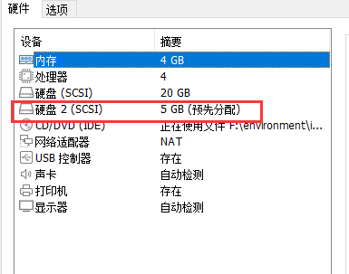
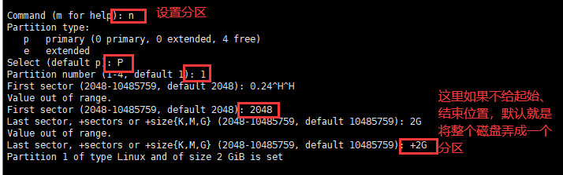

docker清理时有看到：apt-get clean

ubuntu的字体路径为 /usr/share/fonts/truetype/freeFont  一个常用字体 FreeMono.ttf

- 让其可以ping：apt install iputils-ping

安装rz、sz以便在终端可以直接拖拽上传、下载文件：sudo apt-get install lrzsz

## 1. 安装

有的时候装上了，无法远程链接终端，一般是没装openssh-server，直接sudo apt install openssh-server装好就行

### 1.1. VM虚拟机

​	虚拟机安装ubuntu（主要是针对18.04版本）时，不要点创建后立即开启，要进到安装位置，把==autoinst.ios==文件删除，不然安装完了后，会一直卡在installing open-vm-tools，进不去系统，

进去系统后先换源，然后安装

sudo apt instsll open-vm-tools open-vm-tools-desktop -y 

这个安装就是为了之间直接复制文件，安装完重启一下，以更好的使用

​	针对20.04可以直接一键安装，前提是自己的网络要配置好，安装时要能连上网络，然后安装installing open-vm-tools会有一小会儿，能够安装自动进去(但是这样没办法手动配置安装过程了，针对要体验安装过程的话，还是把==autoinst.ios==删除，自己手动整个过程看看)

​	时间上可能因为没有选择时区，导致系统时间对不上，所以执行命令：==sudo dpkg-reconfigure tzdata==，然后选择Asia,里面再选择chongqing。能联网的话，时间应该自动就ok了。

### 1.2. 双系统

1、win+r  再输入msinfo32    查看自己的bios模式

说一下自己，如果bios不是UEFI，而是传统的模式，且为单硬盘
首先按照[这个网址](https://www.cnblogs.com/masbay/p/10745170.html)来的，装上没什么问题，删除也很简单。

如果是UEFI+双硬盘(也先看上面网址的安装说明)：
（1）一般在另外一块磁盘的最后一个分区，压缩分出来假设100G的空白卷，
（2）然后U盘启动，当是4k分辨率时，可能会花屏，得在启动界面按e进入编辑， 找到 'quite splash' 并在后面加上对应各显示器的设定，比如英伟达的就是 'quite splash nomodeset'， 再ctrl+x进行安装 
（3）分区时选择其它，手动分区，然后就一个分区，根目录   /  ，点击 + 号把前面的空白卷全部给根目录，注意下面的选项也是选刚刚 + 增加的那100G的分区。然后就安装就可以了。
（4）如果出现花屏才有这，sudo gedit /etc/ default/grub  ，然后同样的在同第(2)步，改成grub_cmdline_linux_default="quiet splash nomodeset" ，保存后再sudo update-grub  更新就好了。

注：双系统ubuntu，[双系统ubuntu开机启动遇到grub rescue怎么办？](https://zhuanlan.zhihu.com/p/129317199) 

2、建议装完后，先把软件源更换成清华镜像源，再 apt upgrade 把所有的软件这些更新一下


接下来就是安装深度学习环境（我按照自己这次成功的来吧）
（1）安装anaconda：bash  Anaconda3-5.0.1-Linux-x86_64.sh
需要在配置一下环境，  sudo vim etc/profile    在最后一行加入类似这样的地址   export PATH=$PATH:/home/anaconda3/bin
保存好了，再重新载入一下， source /etc/profile
（2）装cuda,
在装cuda之前要先安装gcc、g++、make  可以先在终端输入这些命令，没有的话，系统会提示你怎么装的。
这次装的最新的cuda11.0，在官网选择x86_64,下的ubuntu，这次版本选择的是20.04,最后选择的是 runfile[local]
下好后， sudo sh cuda_11.0.3_450.51.06_linux.run  好像在中途我选了个什么东西哟，看着来吧
（3）显卡驱动，
这个听说cuda自带显卡驱动了，但是安装时要选择，我应该是没选那个的，但是由于我的分辨率有问题，
于是我在网上找了下，在系统设置，软件更新的 附加驱动 那里，设置安装了显卡驱动，，就是选的第一个，然后是在线装的还是更新的吧。
然后分辨率也有了很多选项，然后torch,cuda.is_available()结果也为True了。

更新2020.08.26：
后面又重新装了一次系统，还是在装cuda去系统设置前装上显卡驱动，然后再装的cuda，==注意不要勾选第一个显卡驱动(drive那个)==

## 2. 命令行换源

4、最小化安装的命令行换源：

换源前，先安装一个vim，方便进行文本编辑：

- apt-get update
- apt-get install vim -y  # 要上面更新一下，不然找不到vim

然后更换阿里源（ubuntu自带的就好像很快，先试试再说）：

> 1. cd /etc/apt/
>
> 2. mv sources.list sources.list.back
>
> 3. vim sources.list  # 写入以下阿里源(清华有点问题，就用这)
>
>   ```
> deb http://mirrors.aliyun.com/ubuntu/ bionic main restricted universe multiverse
> deb http://mirrors.aliyun.com/ubuntu/ bionic-security main restricted universe multiverse
> deb http://mirrors.aliyun.com/ubuntu/ bionic-updates main restricted universe multiverse
> deb http://mirrors.aliyun.com/ubuntu/ bionic-proposed main restricted universe multiverse
> deb http://mirrors.aliyun.com/ubuntu/ bionic-backports main restricted universe multiverse
> deb-src http://mirrors.aliyun.com/ubuntu/ bionic main restricted universe multiverse
> deb-src http://mirrors.aliyun.com/ubuntu/ bionic-security main restricted universe multiverse
> deb-src http://mirrors.aliyun.com/ubuntu/ bionic-updates main restricted universe multiverse
> deb-src http://mirrors.aliyun.com/ubuntu/ bionic-proposed main restricted universe multiverse
> deb-src http://mirrors.aliyun.com/ubuntu/ bionic-backports main restricted universe multiverse
>   ```
>
> 4. apt-get update 更新源   # 也执行一下 apt update
>
> 5. apt-get upgrade 更新软件（慎用，尽量先不用吧，可能是升级大的东西，可能会破坏原有的依赖）

## 2. Anaconda的安装

建议linux上就使用miniAnaconda吧，win上除了自己常用就anaconda，其它都minianaconda吧。

- 不管是root还是普通用户，一定安装在   /usr/local/anaconda3   (这是所有用户都能访问的地方，==一定要改==，不然root默认安装的/root/anaconda3这个路径其它用户是不让访问的，下面执行环境也是不行的)（但这样做了可能在使用时将启动脚本写成服务的形式，一些三方库的路径找不到，是通过去代码中添加写死这个路径的方式来的，或许自己一个人就按默认的方式安装，这样就会避免这个问题。多人使用考虑按上面的方式去吧。）
  - `bash  anaconda***.sh`          #  注意修改安装位置.
- 哪个用户使用就在其身份下执行：
  - `/usr/local/anaconda3/bin/conda init bash`  # 好像先不用这个，先用这个命令看一看`source /root/anaconda3/bin/activate`,这样就会激活base环境，就可以使用conda命令了(这种是/root/anaconda3/condabin没加入环境变量，那一开始的conda就无法使用) 
  - 更正上面：把安装路径中的 anaconda3/condabin 这个路径(里面有conda命令)添加到当前用户的~/.bashrc 中的PATH里去，然后就用 conda activate 里激活环境使用了。
- 再更新，就行了（配置文件就是在~/.bashrc）：
  - `source ~/.bashrc`   
- 终端输入python，默认使用conda的(尽量不用，会扰乱整个环境变量)：
  - `vim ~/.bashrc`
    `export PATH="/usr/local/anaconda3/bin:$PATH"`    # 在最后输入类似这样的位置
    `source ~/.bashrc`
- 把前面的base关闭显示：（它的配置文件是“.condarc”，可以去用户目录里上搜索看）
  - `conda config --set auto_activate_base false`    

## 3. 安装中文输入法

先在终端执行：`sudo apt-get install ibus-pinyin` 

然后再语言里面，找到语言管理，找到`Chinese(Intelligent Pinyin)`，添加即可

## 4. apt-cache

docker的ubuntu安装ifconfig：

- apt-cache search ifconfig      # 可以这样去搜索其它的软件或是第三方库
- apt-get install libnet-ifconfig-wrapper-perl

## 5. 增加磁盘fdisk

1. 分区的简单说明

这里先进行一下科普：

- 一般第一块硬盘，是要分成：

  - 先一个==主分区==：主分区是独立的，对应磁盘的第一个分区，“一般”就是C盘
  - 一个==扩展分区==：一般剩下的全部都弄成扩展分区。
    - 然后在扩展分区上进行==逻辑分区==，相当于分成D盘，E盘之类的，不是特别需求，就分成一个就好了

- 新加一块硬盘话，作为从盘，不装系统，是可以不要主分区的，然后直接直接分区进行挂载

- 应该，如果只有一块硬盘，那么应该就是 /dev/sda 它的分区也都是sda1 sda2 sda3这种

  再加一块硬盘就是 /dev/sdb 它的分区就是sdb1 sdb2 sdb3这种

还有一点：
	好像从VM安装以及服务器来看，centos都是用的LVM(逻辑卷管理器)，df查看时，主要存储位置一般都会有/dev/mapper这样的字眼，这是比较方便直接在原来的目录上面增加容量的。
	然后ubuntu一般都没使用LVM，新增的数据盘一般都是直接使用fdisk处理吧，分好区挂载到一个新的目录下(这好像不能在原有目录上进行扩展)

参考：[磁盘管理](https://zhuanlan.zhihu.com/p/296777898)，[LVM](https://blog.51cto.com/u_13438667/2084924)。


2. 以下是用fdisk使用（ubuntu新增磁盘，这比较多吧）：

​	这个不是很推荐，应该用来分第一块硬盘应该还行(没试过，看[这里](https://wangchujiang.com/linux-command/c/fdisk.html))，然后如果是后期添加新一块硬盘，这种方式就需要新建目录，把分好的区挂载在这新建目录上，没办法扩大已有目录的容量，下面是一个简单的使用demo：

​	这里先以VMware添加一块类似于物理磁盘(就是相当于外面再加了一块硬盘)为例子：
点击添加下一步，基本选用推荐，然后再选择使用单个文件和立即分配空间就好了，然后就会多一快硬盘：



- 然后就开机，进行分区：首先使用命令：`fdisk -l` 查看分区情况，可以看到 /dev/sdb 没有有效的分区表，


- 然后就是进行分区：`fdisk /dev/sdb` 然后就会进到fdisk的交互界面，先输入m查看一下菜单，然后再输入p查看一下当前分区表，可以看到是没有的:

  

- 再然后输入n来新建一个分区,因为是新增的从盘，是可以不要主分区的，就直接建立扩展分区，然后再把扩展分区划分逻辑分区：

  

  - Ps:一开始输入P选择建立主分区(这是第一块磁盘才这样弄主分区吧，从盘加量的话，选择==e==扩展分区)，因为是建立的第一个分区，所以就输入1，如果是建立的第二个分区，那就是输入2;然后就要开始选择分区的起始位置和大小了，如下：

    这里就是把2G弄成一个主要分区。（这里就是一个展示，添加从盘可忽略这一小步）

- 然后就可以再p打印一下分区表，就可以看到我们刚刚的2G大小的分区了,再输入w，写分区表，然后fdisk的界面也会自动退出了：

  

  Tips：

  - 这里的/dev/sdb1 就是建立的扩展分区
  - 这里的/dev/sdb5 就是在扩展分区上建立的逻辑分区
  - 主分区和扩展分区的磁盘号位1-4，也就是说最多有4个主分区或者扩展分区，逻辑分区开始的磁盘号为5

- 格式化分区：新的分区需要进行格式化才能使用，千万注意分区别搞错了，接着上图，我们的逻辑分区名字是 /dev/sdb5 ，也可以再用fdisk -l进行查看

  格式化命令：`mkfs.ext3 /dev/sdb5`     # 这是格式化成 ext3,ext2就是对应把前面的3改成2，还是建议用3

- 然后就是挂载新虚拟磁盘：

  - 在根目录下新建一个文件夹，比如 mkdir /home/sh/new_disk1

  - 再帮刚刚的分区挂载到这个文件夹下：mount /dev/sdb5 /home/sh/new_disk1/

  - 然后df -h就能看到这个磁盘了

- 永久挂载：系统重启后，发现挂载的虚拟硬盘就看不到了，需要再手动去mount挂载，太麻烦了，就在==/dev/fstab==文件添加一行（注意别写错了）：==/dev/sdb5  /home/sh/new_disk1    ext3 defaults 0 0== 

Tips:

​	删除分区的命令是d,d删除分区后，也要用 w 写入后退出,不然退出后分区还是存在。

​    新加一块磁盘时，最好就直接先把分区搞好，不然不好辨认，如这里，我们的磁盘大小给的是5GB，第一个分区给了2GB，但是用fdisk不好看出来：


做个参考吧：

​	这里的/dev/sdb1分区就是2G大小，用4196351(End) - 2048(Start)的结果除以两次1204，大概得到的是3.9999,约为2G的2倍，上面的sda这么算，也是大约是实际容量的两倍。

​	然后这就会知道 /dev/sdb 这块磁盘，虽然有一个sdb1分区，但是还有容量没进行分区，然后就可以按照以上的方法再进行分区。


这里特别注意：一般要做系统盘的磁盘才会建立主分区，然后剩余的建立扩展分区，还一定要在扩展分区上划分逻辑分区(一般也都将一整个扩展分区划分为一个逻辑分区)。

## 6. 远程桌面

针对的是Ubuntu20.04，其它的差不多吧(当然也可以用[nomachine](https://www.nomachine.com/))

- 打开设置中的sharing,把屏幕共享打开，然后选择连接时需要一个密码，单独设置一个密码就好了
- 安装xrdp：sudo apt-get install xrdp
- 安装dconf-editor并设置：sudo apt-get install dconf-editor
  然后打开这个软件，依次展开org-->gnome-->desktop-->remote-access，然后取消 “requlre-encryption”的勾选即可
- windows上，mstsc，界面上，Session选用vnc-any,输入ip和前面设置的密码就可以了，端口是默认的。

Tips：Ubuntu这样操作，windows上每次都要这样选择输入，没办法保存凭据，因为默认是用的Xorg,Centos就可以。

## 7. 修改密码

1. sudo passwd 用户名
2. 输入原来的密码，然后就会提示输入新的密码，回车；再次输入新的密码。


