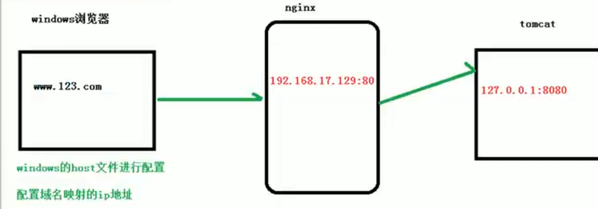
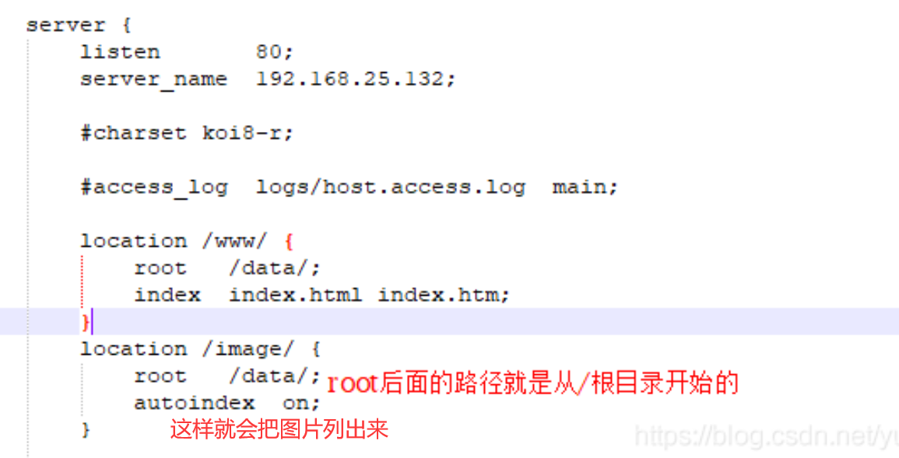
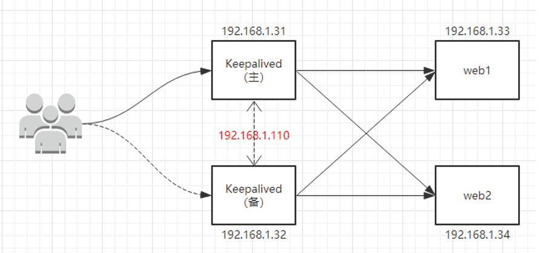

- nginx的一个[配置互动](https://nginx-playground.wizardzines.com/)。

## 一、安装

安装nginx跟[网上](https://www.runoob.com/linux/nginx-install-setup.html)来就好，很简单，默认80端口。

配置文件都在安装路径类似于 /usr/local/nginx/conf/    
一般我们常编辑  `vim /usr/local/nginx/conf/nginx.conf`  # 这就是nginx默认使用的配置文件，  可以看到其listen的端口号是80（因为防火墙一般是访问不了的）

开放端口：（开放端口后要关闭nginx，再启动(推荐)，或是直接重新加载）

>- 查看开放的端口号：`firewall-cmd --list-all`
>- 添加新的端口：`firewall-cmd --add-port=8090/tcp --permanent`
>- 删除端口： `firewall-cmd --remove-port=8090/tcp --permanent`
>- 重启防火墙：`firewall-cmd --reload`
>- 查看防火墙状态：`systemctl status firewalld`    # 后面多了一个d，linux很多服务都是这样，
>
>视频里还有句这个 `firewall-cmd --add-service=http --permanent`  ，但是没有使用
>
>还有这种 `firewall-cmd --permanent --add-service=https`这俩应该都是永久添加http和https服务访问吧

nginx常用命令：

>首先要进到安装目录里：`cd  /usr/local/nginx/sbin`  # 可能是其它路径
>
>启动：`./nginx`
>
>关闭：`./nginx -s stop`
>
>重新加载：`./nginx -s reload`

## 二、配置文件详解

 `vim /usr/local/nginx/conf/nginx.conf`

可参考[这里](https://www.runoob.com/w3cnote/nginx-setup-intro.html)，有一个比较全的讲解。

nginx.conf

```
#user  nobody;
worker_processes  1;

#error_log  logs/error.log;
#error_log  logs/error.log  notice;
#error_log  logs/error.log  info;

#pid        logs/nginx.pid;


events {
    worker_connections  1024;
}


http {
    include       mime.types;
    default_type  application/octet-stream;

    #log_format  main  '$remote_addr - $remote_user [$time_local] "$request" '
    #                  '$status $body_bytes_sent "$http_referer" '
    #                  '"$http_user_agent" "$http_x_forwarded_for"';

    #access_log  logs/access.log  main;

    sendfile        on;
    #tcp_nopush     on;

    #keepalive_timeout  0;
    keepalive_timeout  65;

    #gzip  on;

    server {
        listen       80;
        server_name  localhost;

        #charset koi8-r;

        #access_log  logs/host.access.log  main;

        location / {
            root   html;
            index  index.html index.htm;
        }

        #error_page  404              /404.html;

        # redirect server error pages to the static page /50x.html
        #
        error_page   500 502 503 504  /50x.html;
        location = /50x.html {
            root   html;
        }

        # proxy the PHP scripts to Apache listening on 127.0.0.1:80
        #
        #location ~ \.php$ {
        #    proxy_pass   http://127.0.0.1;
        #}

        # pass the PHP scripts to FastCGI server listening on 127.0.0.1:9000
        #
        #location ~ \.php$ {
        #    root           html;
        #    fastcgi_pass   127.0.0.1:9000;
        #    fastcgi_index  index.php;
        #    fastcgi_param  SCRIPT_FILENAME  /scripts$fastcgi_script_name;
        #    include        fastcgi_params;
        #}

        # deny access to .htaccess files, if Apache's document root
        # concurs with nginx's one
        #
        #location ~ /\.ht {
        #    deny  all;
        #}
    }


    # another virtual host using mix of IP-, name-, and port-based configuration
    #
    #server {
    #    listen       8000;
    #    listen       somename:8080;
    #    server_name  somename  alias  another.alias;

    #    location / {
    #        root   html;
    #        index  index.html index.htm;
    #    }
    #}


    # HTTPS server
    #
    #server {
    #    listen       443 ssl;
    #    server_name  localhost;

    #    ssl_certificate      cert.pem;
    #    ssl_certificate_key  cert.key;

    #    ssl_session_cache    shared:SSL:1m;
    #    ssl_session_timeout  5m;

    #    ssl_ciphers  HIGH:!aNULL:!MD5;
    #    ssl_prefer_server_ciphers  on;

    #    location / {
    #        root   html;
    #        index  index.html index.htm;
    #    }
    #}

}
```

### 2.1. 全局块

​	从配置文件开始到events块之间的内容，主要会设置一些影响nginx服务器整体运行的配置指令，主要包括配置运行(Nginx服务器的用户(组)、允许生成的 worker process 数，进程 PID存放路径、日志存放路径和类型以及配置文件的引入等。

- 比如第一行的 `worker_processes 1;`  这个值越大，处理的并发量越大。

### 2.2. events块

​	events 块涉及的指令主要影响Nginx服务器与用户的网络连接，常用的设置包括是否开启对多 work process下的网络连接进行序列化，是否允许同时接收多个网络连接，选取哪种事件驱动模型来处理连接请求，每个 wordprocess可以同时支持的最大连接数等。
​	上述例子就表示每个work process支持的最大连接数为1024；这部分的配置对Nginx的性能影响较大，在实际中应该灵活配置。

### 2.3. http块

#### 2.3.1 反向代理示例1

​	实现效果：打开浏览器，在浏览器输入地址www.123.com,跳转到linux系统tomcat主页面。

​	访问过程解析：



​	window浏览器输入域名时，都是在host文件里找对应的ip地址，没有就在网上进行dns解析；这就是不直接去访问tomcat，由它和nginx组成反向代理，去访问nginx

>- 首先下载tomcat：在core里，下载.tar.gz包，然后解压，再进到解压文件的 bin 目录，通过 `./startup.sh` 脚本启动tomcat服务器（默认是8080端口）
>- 把8080端口添加通过防火墙（然后就可以去访问了）
>- 在window路径：`vim C:\Windows\System32\drivers\etc\hosts`  直接添加 `192.168.2.3  www.123.com`    此时就能在浏览器`www.123.com:8080`访问tomcat了
>
>- 改nginx的配置文件
>
>>server {
>>	listen    80;
>>	server_name 192.168.23;   # 把服务器主机名写上去
>>
>>​    location / {
>>​		root  html;
>>​		proxy_pass http://127.0.0.1:8080;  # 新增服务器上tomcat的端口8080地址
>>​		index index.html index.htm;
>>​	}
>
>最后重新启动nginx就可以了。

#### 2.3.2 反向代理实例2

​	实现效果：使用nginx反向代理，根据访问的路径不同跳转到不同端口的服务中心，nginx监听端口设为9001。
​	访问 http://127.0.0.1:9001/edu/   就跳转到127.0.0.1:8081
​	访问 http://127.0.0.1:9001/vod/   就跳转到127.0.0.1:8082

>- 一台服务器准备两个文件夹，都解压后tomcat，然后去里面修改配置文件 conf/server.xml 具体看下百度，修改默认端口号
>- 进到各自tomcat中，在 webapps/ 里各自创建目录 edu/  vod/  ,并且都在里面写上一个名为a.html文件，内容各自就是`<h1>this is 8081/8082 port<h1>` # 这个时候用浏览器访问时，端口号后面加上路径 /edu/a.html 或 /vod/a.html 就可以看到写的内容了
>
>- 再去改nginx配置文件，新增一个 server就好了
>
>>server {
>>	listen    9001;
>>	server_name 192.168.2.3;
>>
>>  ​	location ~ /edu/ {              # 路径中含有edu
>>​			proxy_pass http://127.0.0.1:8001;
>>​		}
>>
>>  ​	location ~ /vod/ {              # 路径中含有vod
>>​			proxy_pass http://127.0.0.1:8002;
>>​		}
>>}
>
>后面192.168.2.3:9001/edu/a.html    www.123.com:9001/edu/a.html  结果一样
>
>或是192.168.2.3:9001/vod/a.html    www.123.com:9001/vod/a.html

##### location指令说明

该指令用于匹配URL，location后面跟的url应该可以有正则表达式在里面，
语法如下：`location    =  |  ~  |  ~*  |  ^~    /url/  {}`   # 在url前面的是一些选项

>- =：用于不含正则表达式的url前，要求请求字符串与url严格匹配，如果匹配成功，就停止继续向下搜索并立即处理该请求;
>- ~：用于表示url包含正则表达式，并且区分大小写；
>- ~*：用于表示url包含正则表达式，并且不区分大小写；
>- ^*：用于不含正则表达式的url前，要求Nginx服务器找到标识url和请求字符串匹配度最高的location后，立即使用此location处理请求，而不再使用location块中的正则url和请求字符串做匹配。

补充，写FastDFS时，有一个例子，location ~/group[0-9]/ {}  # 访问你的网址是这样的 ip:port/group5/aa/bb/123.png   (后面就无所谓了)

#### 2.3.3 负载均衡

​	实现效果：浏览器输入地址 http://192.168.2.3/edu/a.html, 将负载分到各个服务器（即访问的这同一个网址，会将请求分发到不同的服务器）

>- 准备两台tomcat服务器，一台端口8001，一台8002
>- 在两个tomcat的  webapps里都创建文件夹 edu/  并在此目录里放上内容不同的 a.html
>- 修改nginx的配置文件
>
>...     # 上面一些东西就省略了，只写重点部分
>
>http {
>
>​	...     
>
>​	\# 这块是新加的，`my_server`是自定义的名字
>​	upstream my_server {
>​		server 192.168.2.3:8001;  # 把开启服务的机子ip和port都写到这里
>​		server 192.168.2.3:8002;
>​	}
>
>​	server {
>​		listen    80;
>​		server_name 192.168.2.3;
>​		\#charset koi8-r;
>​		\#access_log logs/host.access.log main;
>​		location / {
>​			root  html;
>
>​			\# 后面的myserver是上面自定义的名字(就这行是新增的)
>​			proxy_pass http://myserver;   
>
>​			index index.html index.htm;
>​		}
>​	}
>}

##### 配置负载均衡参数的几种方式:

- 轮训(默认)：每个请求按时间顺序逐一分配到不同的后端服务器，如果后端服务器down掉，能自动剔除；

- weight：默认权重为1，权重越高分配的客户端越多；

  >upstream myserver {
  >	server 192.168.2.3:8001 weight=2;  
  >
  >​    server 192.168.2.3:8002 weight=5;
  >  }

- ip_hash：每个请求按照访问ip的hash结果分配，这样每一个访客固定的访问一个后端服务器，可以解决Session 的问题(一个客户端访问后，后面永远是访问的同一个服务器)。

  >upstream myserver {
  >
  >​	ip_hash;
  >
  >​	server 192.168.2.3:8001 weight=2;  
  >
  >​    server 192.168.2.3:8002 weight=5;
  >  }

- fair：接后端服务器的响应时间来分配请求，响应时间短的优先分配。

  >upstream myserver {
  >
  >​	server 192.168.2.3:8001;  
  >
  >​    server 192.168.2.3:8002;
  >
  >​	fair;
  >  }

#### 2.3.4 动静分离

​	不写了，就是把静态资源放一个文件夹(如图片等)，一些动态资源放一个文件夹，然后配置两个location

​	

## 三、配置高可用集群(主从模式)



>（1）准备两台服务器，都下安装好nginx
>
>（2）都安装Keepalived：yum install keepalived -y   # 配置文件/etc/keepalived/keepalived.conf
>
>```properties
>global_defs {
>	notification_email {
>	acassen@firewall.loc
>	failover@firewall.loc
>	sysadmin@firewall.loc
>}
>
>notification_email_from Alexandre.Cassen@firewall.loc
>smtp_server 192.168.2.4
>smtp_connect_timeout 30
>
>router_id LVS_DEVEL      # router_id 后面的名字是我们自己起（要能访问到主机）
># `vim /etc/host`， 添加一行   127.0.0.1   LVS_DEVEL
>}
>
>vrrp_script chk_http_port {
>	script "/usr/local/src/nginx_check.sh"  # 这是检测脚本的地址，		nginx_check.sh自己写
>	interval 2	#（检测脚本执行的间隔）
>	weight 2    # 当前主机权重，要是给的 -20 就是主服务器挂了，权重就减20？？？
>}
>
>vrrp_instance VI_1 {
>	state MASTER	# 备份服务器上将 MASTER 改为 BACKUP
>	interface ens33	  //网卡
>	virtual_router_id 51  # 主、备机的 virtual_router_id 必须相同(这个值也应该是自定义)
>	priority 80	# 主、备机取不同的优先级，主机值较大，备份机值较小
>	advert_int 1     # 每隔1s发一个检测主机还活着
>
>	authentication {   # 校验的一种方式
>		auth_type PASS
>		auth_pass 1111
>	}
>
>	virtual_ipaddress {
>		192.168.2.50     // VRRP H 虚拟地址，自己给的  # 可以给多个
>	}
>}
>```
>
>（3）在`/usr/local/src`添加检测脚本 `nginx_check.sh`  这个名字可以自己起，要和上面配置名一样
>
>```bash
>#!/bin/bash
>A=`ps -C nginx –no-header |wc -l`
>if [ $A -eq 0 ];
>then /usr/local/nginx/sbin/nginx
>sleep 2
>if [ `ps -C nginx --no-header |wc -l` -eq 0 ];
>	then killall keepalived
>fi
>fi
>```
>
>    ​	注意这是两台服务武器都要的
>    
>    （4）都启动nginx、keepalived ：`systemctl start keepalived.service`
>    
>    最终输入虚拟地址，都能访问nginx了，这时再把MASTER的nginx、keepalived关了，在访问虚拟地址，会自动切到备机上的。
