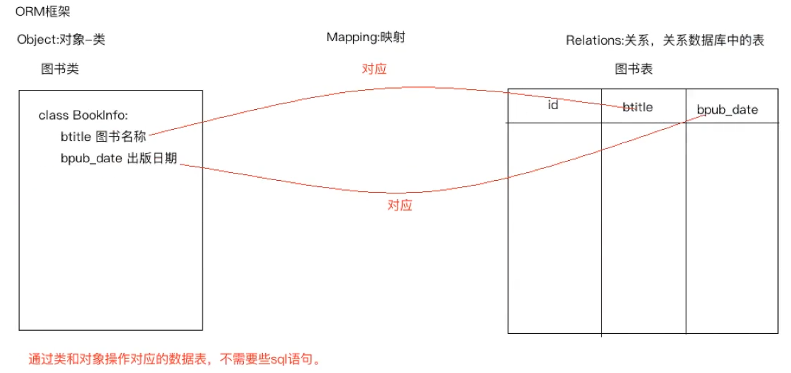
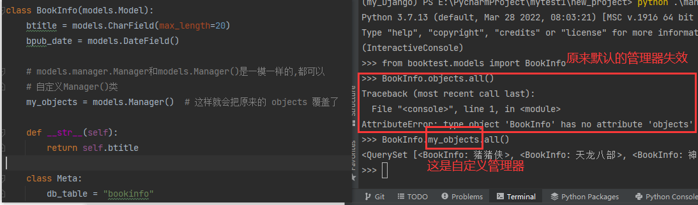
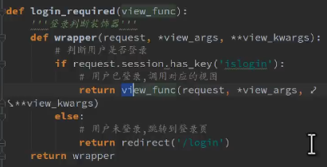
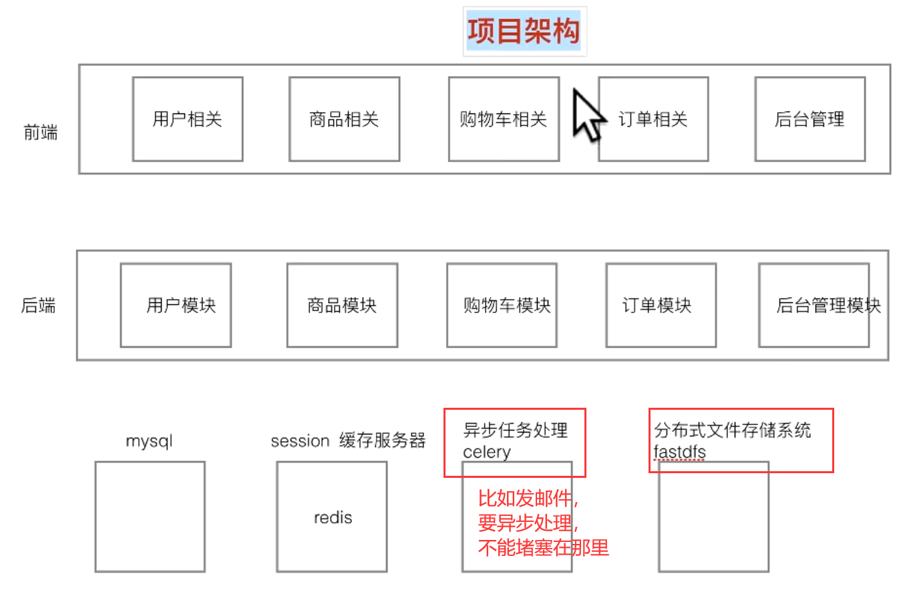
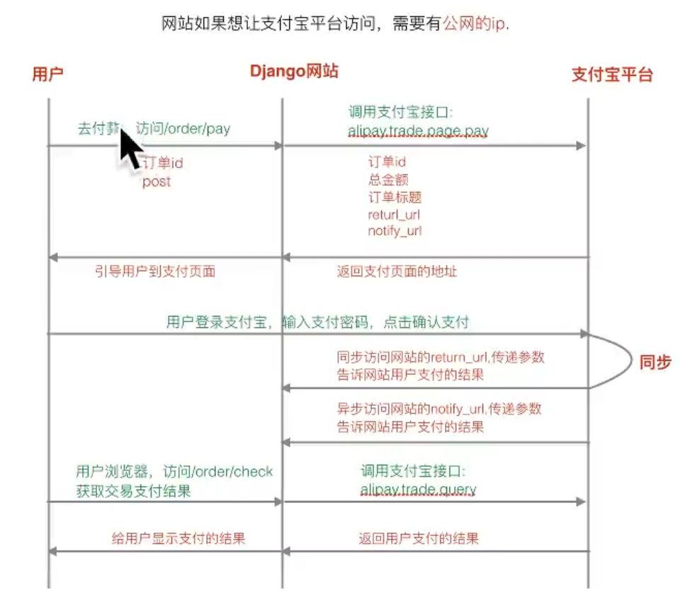
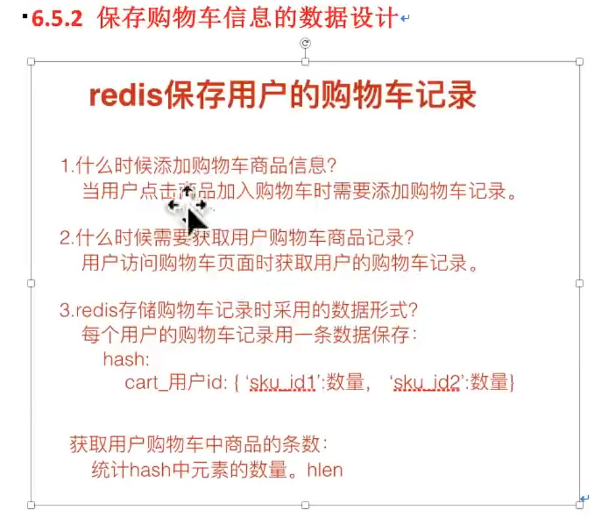

# Django

Djingo的一个付费视频的目录的[地址](https://ke.segmentfault.com/course/1650000037775349)，放这里以后做个参考吧。

真用到时，来这[教程](https://www.zmrenwu.com/courses/django-rest-framework-tutorial/)看看有没有类似的思考。

以下讲的路由都是指url路由。

- 想要它文件中获取总的settings.py中的变量，可以：
  from django.conf import settings
  settings.STATICFILES_DIRS     # 就可以看settings中的所有变量了


- Django的一个debug项目：[django-debug-toolbar](https://github.com/jazzband/django-debug-toolbar) 

## 一、基础环境及原理

### 1.1. 版本差异

这个笔记用的Django是3.2版本：pip install django==3.2

视频教程里是1.8版本，会有差异，我看要不要把差异复制过来一份到这里

1. 在两个表创建关联时，用到外键models.ForeignKey("BookInfo", on_delete=models.CASCADE)：
   - 1.8不是必须给on_delete参数，而3.2一定要给，不然就报错；
   - on_delete参数的解释看这：[1](https://blog.csdn.net/vivian_wanjin/article/details/84068821)、[2](https://www.jianshu.com/p/c3550f2d2d4d)。
2. urls.py中，1.x匹配路径用的是url()函数，后面的版本用的是path函数(这是完全匹配的)，要正则就是re_path函数，具体可看[2.3.2](#2.3.2 url路由配置)。
3. 在模板文件中，加载静态文件，新版本是，1.8版本是。

### 1.2. MVC | MVT原理

最原始的理念：==MVC== 

- M：Model，模型，和数据库进行交互

- V：View,视图，产生html页面

- C：Controller,控制器，接收请求，进行处理，与M和V进行交互，返回应答
  

---

Django的框架是用的==MVT==,其实也还是MVC的思想：

- M：Model，模型，

- V：View,视图

- T：Template,模板,其实就和MVC中的V功能相同，产生html页面


### ==migrate数据表迁移时很可能出现的问题==

（1）==新加类后==，重新执行迁移，大抵会得到这养一个提示==“No migrations to apply.”==代表迁移文件根本没被迁移，原因如下（之前同名文件已经被迁移过一次）：


解决办法：
- 把本地的0001_initial.py改一个名字；（这个没用过）
- 将django_migrations这张表中的这条记录删掉（推荐用这吧）。
  delete from django_migrations where name='0001_initial';
- 然后还要去看生成的 0001_initial.py 迁移文件，按照下图把已经创建了的表的代码给删除了，不然基本上又会爆出这样的错误：“django.db.utils.OperationalError: (1050, "Table 'booktest_heroinfo' already exists")”。如下图：
  
- 然后再执行 python manage.py migrate 

---

最终如果都无法解决==我建议的处理方式==：（管它什么问题，这样走一遍应该都是可以的）

- 把本地的应用(如booktest)下名为==migrations==文件夹里的py文件都删除了；
- 删除名为==django_migrations==表中的关于应用(如booktest)的所有记录：delete from django_migrations where app='booktest';
- 然后再执行 python manage.py makemigrations 和 python manage.py migrate 就好了。


如果以后遇到不能解决的问题，来这个视频里看看，有没有类似的问题（“01\_上传图片_后台管理页面上传.flv”）大概在视频进度条一半的位置。

## 二、项目快速搭建

### 2.1. 搭建步骤及命令

创建第一个Django项目：（使用终端命令行，先进到一个安装了Django的虚拟环境，这次用的3.2版本）

1. 在一个目录下，使用：==django-admin startproject mytest1==    # 只有后面mytest1名字是自己起的
   这会创建一个mytest1文件夹出来，这个也就作为项目名了，里面有：
   - 一个同名的mytest1包：
     - asgi.py：教程1.8版本上没有这个;
     - setting.py：项目的配置文件;
     - urls.py：进行rul的路由配置;
     - wsgi.py：web服务器和Django交互的入口;
   - manage.py：项目的管理文件，用来管理整个项目。
2. 一个项目由很多个应用组成，每一个应用完成一个特定的功能，Django开发中，一个功能模块用一个应用来实现
   创建应用的命令如下：==python manage.py startapp 我的应用名==
   好比：python manage.py startapp booktest   
   那这就会创建一个名为booktest的文件夹(包)，也就是一个应用，里面有：
   - 名为migrations的包;
   - models.py：写和数据库相关的内容，一个类就是数据库的一张表;
   - view.py：定义处理函数，Django中叫==视图函数==，就是实现上面写的view视图的功能，即加载html模板的数据，将从数据库获取到数据传递给模板，并返回这个标准的html页面;
   - test.py：写测试代码的文件;
   - admin.py：网站后台管理相关的文件;
   - apps.py：教程1.8版本上没有这。
3. 建立应用(这里是booktest)和项目之间的联系，需要对==应用进行注册==：（用pycharm打开了）如图
4. 注册后就可以启动web服务：==python manage.py runserver== 
   - 然后浏览器访问它提示的地址，会得到成功的页面，一般默认端口是8000；
   - 改端口的话：==python manage.py runserver 127.0.0.1:8005== 
5.   注意：默认使用的数据库是sqlite，要改成mysql，就看[2.6.1](#2.6.1 sqlite改为mysql)。

### 2.2. 模型类 M (ORM)

接着说ORM框架：这就是在刚刚的booktest里的models.py中进行写类映射，如图：

ORM另一个作用：根据设计的类生成数据库中的表。如下过程：

1. 模型类设计：写一个==BookInfo==类，注意导包、继承以及字段类型的设置

   - 元选项：

     - Django默认生成的表名：==应用名小写_模型名小写==，这里BookInfo类生成的表名就是==booktest_bookinfo==,如果后期应用名booktest改了，那表名就对应不上了，元选项的出现就是让生成的表名不依赖于应用名

     - 元选项：在模型类中，定义一个元类Meta,在里面定义一个类属性==db_table==，用这个属性值来指定表名

       ```python
       class BOOkInfo(models.Model):
       	btitle = models.CharField(max_length=20)
       	bpub_date = models.DateField()
       	class Meta:
       		db_table = "bookinfo"  # 值可以是其它的名字，但db_table属性名一定别写错了
       ```

2. 模型类生成数据表：(模型类数据有修改或是添加的话，就再来执行这一步，其它有关后台页面显示的东西修改了不用)

   1. 生成迁移文件：==python manage.py makemigrations==   # 迁移文件是根据模型类生成的
      - 生成的迁移文件就在./booktest/migrations目录里，第一次就是里面的 0001_initial.py
      - 0001_initial.py里面有一个'id'就是系统生成的primary_key
   2. 执行迁移生成表：==python manage.py migrate==   # 根据迁移文件生成表
      - 这会生成一个“db.sqlite3”的文件，默认是用的sqllite数据库
        ubuntu可视化: sudo apt-get install sqliteman，然后输入命令sqliteman就会打开这个数据库可视化的界面
        windows下用软件管家下sqlite expert，win上的sqliteman有问题，数据不显示
   3. 注意：类BookInfo在数据库中生成的名字是：booktest_bookinfo，即==应用名_类名==(且都变小写了)

3. 通过模型类操作数据表：==python manage.py shell==  

   - 会进到项目终端，然后进行数据的操作，就是ipython，太难写了，但直接建立py来运行会报错，说是环境没配置，那就先进到这个终端，如下命令：

     ```python
     from datetime import date
     from booktest.models import BookInfo  # 千万别忘了导类进来，它就是一个ipython
     
     b = BookInfo()
     b.btitle = "天龙八部"
     b.bpub_date = date(1990, 1, 1)  # 注意使用的date的数据格式
     b.save()  # 因为继承了django.db中的models.Model，执行save就是操作数据库
     ```

   - 查询数据：(这些语句的数据操作都是可以写进view.py文件，对数据进行操作的)

     ```python
     # 查询
     b2 = BookInfo.objects.get(id=1)
     type(b2)     # <class 'booktest.models.BookInfo'>   就是这个类的对象
     b2.btitle     # 就会得到 天龙八部
     
     # 要改数据的话
     b2.bpub_date=date(1990, 12, 13)   # 发行日期就改了， date 是from datetime import date
     b2.save()   # 就相当于update了
     
     # 删除掉这个数据的话
     b2.delete()
     ```

   - 同上，继续在models.py中添加一个英雄类，也就是加一张表，这张表还应该跟BookInfo类有关联

     ```python
     from django.db import models
     # 人物类
     class HeroInfo(models.Model):
         hname = models.CharField(max_length=20)
         # 性别，用的布尔值，有一个默认值False
         hgender = models.BooleanField(default=False)
         # 备注
         hcomment = models.CharField(max_length=128)
         # 关系属性 hbook 简历图书类和人物类之间的一对多关系（这很关键）
         # 它的格式就会是  hbook_id  # 会自己加一个_id
         hbook = models.ForeignKey("BookInfo", on_delete=models.CASCADE)   # 外键，类名别写错了
         # 1.8就不是必须给on_delete，参数解释看这 https://blog.csdn.net/vivian_wanjin/article/details/84068821
         # https://www.jianshu.com/p/c3550f2d2d4d
     ```

     然后是上面一样的流程，再进到终端，创建人物数据：

     ```python
     from booktest.models import HeroInfo, BookInfo
     b1 = BookInfo.objects.get(id=1)
     b1.btitle  #  "天龙八部"
     
     h = HeroInfo()
     h.hname = "段誉"
     h.hgender = False
     h.hcomment = "六脉神剑"
     h.hbook = b1     # 一定要注意这个外键的值，这样就和b1(一定要是具体哪本书)关联起来了
     h.save()
     
     h1 = HeroInfo.objects.get(id=1)  # 还可以通过这样来获取到这个对象
     h1.hbook  # 得到的就是关联的书的对象：<BookInfo: BookInfo object (2)>
     h1.hbook.title    # 就能得到书名 天龙八部
     ```

     那现在我拿到了图书的对象，获取与之关联的人物对象：

     ```python
     from booktest.models import HeroInfo, BookInfo
     b = BookInfo()
     b.heroinfo_set.all()     # heroinfo_set 是人物所在的表名
     # 结果类似于这 <QuerySet [<HeroInfo: HeroInfo object (1)>, <HeroInfo: HeroInfo object (2)>]>
     ```

#### 2.2.1 数据查询

结合上面的终端来看(里面有查询、保存、删除)，在后面视图view.py中也常用这些操作，这里主要是查询，先把BookInfo和HeroInfo两个类导入：

from booktest.models import HeroInfo, BookInfo

- 单条数据：book_obj = BookInfo.objects.get(id=book_id)   
  \# 这种查询到的数据千万别传进html模板中做被循环的数据

  - 一条数据，就用get，且不能传到html模板的去被循环，否则报错;
  - id需要是唯一标识的才行，否则查出来的数据不止一条的话，也会直接报错。

- 全部数据：book_objs = BookInfo.objects.all()    # 即 ==类名.objects.all()==

- BookInfo.objects.create(属性1=值1, 属性2=值2)  # 可以这样创造数据的，还有一起其它的方法

  - 为了写代码时有好的提示，可以自己加一个属性
  objects = models.Manager()    # 这是默认就有的，写上来，后续代码提示会比较有好
  - 或者，继承models.Manager这个类，写一个自定义管理器，再实例化，具体看[3.4.管理器](#3.4. 管理器)

- 条件查询部分数据：假设从一张人物表中找到属于某本书的所有人物数据，2种方式：

  \# 用这种查询到的数据去被循环

  - 第一种，直接从人物表中条件筛选filter：
    - hero_objs = HeroInfo.objects.filter(hbook_id=book_id)
  - 第二种，先找到book_id对应的书的对象，再通过这个对象去取里面所有的人物信息：
    - book_obj = BookInfo.objects.get(id=book_id)
    - hero_objs = book_obj.heroinfo_set.all()  # 注意heroinfo_set是==类名小写_set== 
  - 两种方式是一样的，就是导的包不一样，自己酌情选吧。

---

调用模型的 delete 方法，就会生成delete语句，自动执行；

调用模型的 save 方法，根据实际操作，会生成insert、update语句，自动执行。

#### 2.2.2 后台管理配置

这其实不属于这个模型类模块，就先放这里吧。

1. 第一步：本地化：主要是修改setting文件，将==语言==和==时区==本地化
   

2. 第二步：创建管理员：==python manage.py createsuperuser==
   

3. 第三步：启动服务器：python manage.py runserver，用浏览器访问页面了：http://127.0.0.1:8000/admin  (注意地址里要加==admin==，然后刚刚的账号登录就行了)

4. 第四步：注册模型类：在booktest这个应用里面的==admin.py==中去注册模型类 （注册后，浏览器刷新就会看到）
   

   上面第二张图之所以会显“'BookInfo object (2)'”这种，就是因为书类这个对象用str()去获取就是这个值，可以用python manage.py shell打开一个终端。输入如下：

   ```
   from booktest.models import BookInfo
   b = BookInfo.objects.get(btitle="天龙八部")
   str(b)       # 'BookInfo object (2)'
   ```

   就说明str(b)这对象，那么b的类BookInfo中重写\__str\_\_魔法方法，就可以改变这个显示的值

   ```python
   class BookInfo(models.Model):      # models.py中 加上下面这个
       def __str__(self):
           return self.btitle   # 这是返回书名
   ```

   这时再去刷新，界面显示的就是书名了；然后==在这个界面就可以添加一本新书了==(也就是添加一个书类的实例对象)，此时这种页面的展示就是：
   

   若是要注册人物类，就走上面的第三步流程就好了。

5. 第五步：自定义管理页面：
       第三步操作后，此时页面的展示就还是只有书名，没有其它信息，因为return只返回了那一个，当然可以在return中拼接出来，但是不好，
       这就需要去写一个自定义管理类，然后register的时候与原来的类关联起来：
   

   解读：

   - BookInfoAdmin这种命名，建议就是 类名Admin;然后要继承 admin.ModelAdmin
   - ==list_display==是类继承下来的属性，后面要展示什么内容，就把对应的字段名写进去，可以不写完
     - 若字段名写错了，保存后，服务是会停止运行的；
     - 这里面不但可以写模型类的属性，也可以写模型类的方法。（那就可以通过方法来查询一些别的表中的数据返回，然后来这里展示，要注意如果有些列的值是空的，要注意判断给其一个空字符）
   
   - ==list_per_page = 10==  # 还可以加一个这样的属性(名字也是一定的)，数据很多的时候，每页只显示10条数据，达到分页效果
   
   - admin.site.register(BookInfo, BookInfoAdmin) 那么register的时候就要关联起来

完成后就是如下界面了：


### 2.3. 视图 V

​	url配置的目的是让建立url和视图函数的对应关系，server运行起来后，动态添加函数，修改函数后，Django会自动重启server的。

#### 2.3.1 视图函数

在应用(这里是booktest)的 view.py 中去定义各种功能函数，就是叫做==视图函数==。

简单的示例demo，没有用到html模板：

- 函数必须有一个参数request;
- 进行处理后，需要返回一个HttpResponse的类对象，里面的内容就是给浏览器显示的内容

---

但是一般都不是上面这么简单，会用到模板的index.html，函数大致如下这么写：

```python
from django.shortcuts import render
# 注意导包不能写 from models import BookInfo   运行会出出错的
from booktest.models import BookInfo
def index(request):
    bs = BookInfo.objects.all()  # 获取所有书的对象
    "进行处理，和M和T进行交互"
    replace_data = dict(
        my_content="这是替换的第一个参数",
        my_list=list(range(10))
    )
    # 不用替换数据就不用传第三个参数,可以为空
    return render(request, "booktest/index.html", replace_data)
```

解读：

- 导包一定要从引用的包名写进去，否则pycharm导入没问题，一运行就报错；

- replace_data字典里的key都不是乱起的，是要跟html模板里用到的变量名是一样的；
- "booktest/books.html"路径千万别写错成了"booktest.books.html";然后关于这个路径，在模板里有讲，需要在系统的settings做一下配置的。

关于==render()函数的实现原理过程==：(前面的1、2都是固定的，render只是将这个过程再封装了一下)

> from django.template import loader, RequestContext
> def index(request):
> 	\# 1.加载模板文件，
> 	temp = loader.get_template("booktest/index.html")  # 注意路径
> 	\# 2.定义模板上下文，给模板传递数据，没有的话可以传一个 空字典
> 	context = RequestContext(request, {})   # 要用RequestContext这个类对象
> 	\# 3.模板渲染
> 	res_html = temp.render(context)
> 	return HttpResponse(res_html)

这是视频1.8版本的原理讲解，在3.2版本这会报错的,但原理是共通的，所以还是直接使用系统提供的render()渲染吧

#### 2.3.2 url路由配置

​	新建应用(这里是booktest)的urls.py，做子路由配置，再在项目的总的urls.py做总路由配置，这样应用多了以后也会很清晰

子路由(不是必须，但应用多了后，这样最好)：

- 在应用booktest中新增一个urls.py文件，里面就是映射子路由(可以为空，如果总路由匹配完了)和对应的函数对应；
- ==urlpatterns==必须这么写，千万别写错了；
- 一般，子路由的path("一个路径", 对应视图中的函数)；

总路由：

- ==总路由名字前后的`/`一定不能==,名字后面有没有/也是由访问的地址还有子路由名字共同决定,path函数是严格匹配的；
- 一般，总路由的path("一个路径", include("子模块名.urls"))  # 将其包含进去
  

---

当django项目中的路由分成总路由和子应用路由以后, 那么用户访问视图函数,则访问地址的规则:
	==:port/总路由+子路由的url地址==

- 总路由是path(r"index/",)，子路由是path(r"123/",）,那么地址就是:port/index/123
  - 这个若只是输入了 :port/index ，会找到网址，提示里也不友好，要输入 :port/index/ 加上后面的斜杠，才会有子路由的提示
- 总路由是path(r"index",)，子路由是path(r"123/",）,那么地址就是:port/index123
  - 这就相当于整个总路由就是 index123 是拼接起来的；
- 这里给自己一个规定：以后子路由，最后的地址路径，都要以`/`结尾，如path(r"123/",)，而不是path(r"123",),不然访问的时候可能会出文件，可以去看重定向里面 

Tips：

- 1.x版本里的url函数直接支持正则，现在版本path函数不支持正则是完全严格匹配的；

- 新版本对应的正则路由匹配函数是==re_path==，（==注意正则()组的使用，一定要==）

  ```python
  from django.urls import path, re_path
  urlpatterns = [
      path('123/', views.index),
      path('book/', views.show_book),
       # (\d+) 正则表达式里组的值才会被传给函数当另外的参数
      re_path("book/(\d+)", views.hero_info)  
  ]
  ```

  注意：

  - 上面第6行对应的视图函数就应该是：def hero_info(request, book_id): 这个book_id属于位置参数，起别的名字也行；

  - 还有一种关键字参数（即在位置参数的基础上给正则表达式组命名），比如第6行：re_path("book/(?P<my_name>\d+)", views.hero_info) ,那么其对应的视图函数就应该 def hero_info(request, my_name):  名字一定要一致，都是my_name，别的就会报错。

    

- 1.8版本对应的写法是：(放这里记录下)

  ```python
  from django.contrib import admin
  from django.conf.urls import include, url
  
  urlpatterns = [
      url("admin/", include(admin.site.urls)),
      url(r"^index/", include("booktest.urls"))
  ]
  ```

### 2.4. 模板 T

#### 2.4.1 模板文件配置

模板文件的使用（就是页面返回的html模板，里面可以有替代的变量以及一些函数编程等）

第一步：配置

- 在项目根路径下创建一个名为template总的模板文件夹(名字可以是其它的)
- 在总的settings.py中找到TEMPLATES，写上如下内容，注意：
  - 'DIRS': [BASE_DIR / 'templates'],  是3.X这么写的，2.X可能也是
  - 'DIRS': [os.path.join(BASE_DIR, 'templates')],  1.X（视频1.8）是这么写的
  - 其中==BASE_DIR==是settings.py中定义的变量，代表这个项目的根路径的绝对路径
  
  
- 一个应用，如booktest就在templates下建立自己的文件夹，专门放自己的模板，不同应用之间就区分开了，比如，booktest应用，就在templates下建一个名为booktest的文件夹。

---

第二步：使用模板文件:（==修改模板html文件，服务不会重启==）
    render()函数实现过程就是下面这三步，在[2.3.1](#2.3.1 视图函数)内有拆解过程

- 加载模板文件：去模板目录下面获取html页面，得到一个模板对象

- 定义模板上下文：即模板中有变量，向其传递数据

- 模板渲染：即标准模板有了，要替换的数据内容有了，就通过渲染得到最终的标准的html页面，达到数据动态效果
  view.py中函数写法：
  
  对应的模板index.html写法：

  ```html
  <body>
      <div>
          <!-- 用双括号括起来，里面的名字就是view.py中传进来字典的key -->
          使用模板变量：{{ my_content }}
      </div>
      <div>一个传进来的列表：{{ my_list }}</div>
      <!-- 模板里面也可以循环 -->
      <ul>
          
          <!--  <li>i</li>  这么写时错误的，这就没有用到变量，就是字符串i  -->
          <li>{{ i }}</li>
             <!-- 如果列表变量为空，就来执行这里 -->
          <li>没有数据</li>
            <!-- 结束循环，固定写法 -->
      </ul>
  </body>
  ```

#### 2.4.2 模板文件加载顺序

如果找不到，booktest/index1.html ，就会有如图的搜索路径如图：


- 首先去配置的模板目录下找对应的模板文件，即'DIRS': [BASE_DIR / 'templates'],
- 然后去settings.py的 INSTALLED_APP 下面每个应用去找模板文件，前提是应用中必须有templates文件夹，上面两个admin、auth注册应用里有==templates==文件夹，所以也会去搜索，但是下面的注册应用里就没有这个文件夹， # templates 一定不能写错

- 所以我们前面讲的==404.html==就是加在我们自己的templates里面，属于第一个被搜索的路径，找到就直接使用，不再往后搜索了。

#### 2.4.3 语法(变量|标签|循环|过滤器|注释)

Django模板变量、循环，模板标签更多的可以看看[这里](https://www.freeaihub.com/django/dtl.html)。但还是不全，如过后续有用到对应的话，去网上搜。

==**模板变量**==：

​	<!-- 如果使用了变量符号 {{}} 里面一定要放东西，不能为空，这变量符号注释里都不能有 -->  # 随便写一个变量名都行，反正没传的话，整体就会默认为空字符串 

变量写法：{{ my_content }}  # my_content就是view.py中传进来字典的key

使用模板变量：`{{模板变量名}}` ，

​	会按照下面的顺序去解析，成功后就不往后走了，都不成功就返回空：

例如：{{ book.btitle }}    # 空格不是必须的

- 首先把book当做一个字典，把btitle当做键名，进行取值 book["btitle"]
- 其次把book当做一个对象，把btitle当做属性，进行取值 book.btitle
- 最后把book当做一个对象，把btitle当做对象的方法，进行取值 book.btitle  # 相当于取btitle()方法的返回值

例如：{{ book.3 }}  # 3可以是其它的int

- 首先把book当做一个字典，把3当做键名，进行取值 book['3']
- 最后把book当做一个列表，把3当做下标，进行取值 book[3]

所以使用模板变量时，`.`前面的可能是一个字典或一个对象，还可能是一个列表；如果全都解析失败，则产生内容时就用==空字符串==填充模板变量。

注意：不要写 这种带条件的筛选，是解析不了的，直接在视图函数中filer筛选好，然后再传进去。

---

==**模板标签**==：

​	``

for循环：

>  
>  {{ forloop.counter }}--{{ i }}      # 变量i一定要用{{}}包裹起来
>    # 如果列表变量为空，就来执行这里,不为空，就是执行上面的，不会进来这里
>  没有数据
>   # 结束循环，固定写法

还有一个固定的变量，可以用来获取循环到第几次了（看上面示例）

- `{{ forloop.counter }}` 得到for循环遍历到了第几次,从1开始。 对应得还有 {{ forloop.revcounter }}
- {{ forloop.counter0 }}  # 从0开始，对应的还有 {{ forloop.revcounter0 }}
- {{ forloop.first }}  # 除了第一个是True其它都是False，对应的还有 {{ forloop.last }}


if循环：（中间放各自的语句）

> 
>
> 
> 
>
>         # 但一定要有endif


关系比较操作符：> < >= <= == !=

注意：进行比较操作时，==比较操作符两边必须要有空格==


逻辑运算：not and or

还有一些其它的模板标签，不仅限于此，后续用到，去网上搜索相关的模板标签。

---

==**过滤器**==：

过滤器用于对模板变量进行操作，常用的如下：（还有很多其它的过滤器，更多看网上吧）

- date：改变日期的显示格式   # 后面格式化的格式跟datedtime那个很像，就是没有%
- length：求长度
- default：设置模板变量的默认值

格式：`模板变量  |  过滤器: 参数`   # 严格控制，==过滤器、:、参数==这三个之间==不能有任何空格==，不然就会出错

> {{ obj.bpub_date | date:"Y年-m月-d日" }}    # 后面的格式跟datedtime那个很像，就是没有%，
>
> {{ obj.btitle | length }}   # 输出的是前面比如字符串的长度
>
> {{ does_not_exist | default:"hello" }}   # does_not_exist变量没传进来，原本默认为空，现在给了一个默认值（注意`:`左右不能有空格啊）


==自定义过滤器==：当已有的过滤器不满足使用的时候，就可自定义过滤器

1. 自己的应用(如booktest)下新建一个==包==，包名为==templatetags==,名字一定不能错了，然后里面随便建一个py文件，如my_filter.py；里面的内容如下：

   ```python
   from django.template import Library
   
   # 创建一个Library类的对象
   register = Library()
   
   # 自定义的过滤器函数，至少要有一个参数
   @register.filter
   def mod(num):
       return num % 2 == 0
   
   # 至多两个参数
   @register.filter
   def mod_val(num, val):
       """判断num是否能被val整除"""
       return num % val == 0
   ```

2. 然后再在html模板中使用：（以 ==== 这样的方式加载）

   ```html
   <html lang="en">
   
   <head>
       <meta charset="UTF-8">
       <title>books</title>
   </head>
   <body>
       <ul>
       	
           <li>
               {{ forloop.counter | mod }} 
               {{ forloop.counter | mod_val:2 }}
           </li>
           
       </ul>
   </body>
   ```

Tips：

- 第2行，要用这种方式，把自己写的py文件导进来;
- 第11行，就是前面的forloop.counter的值传给mod函数当参数，（mod函数就一个参数）;
- 第12行，mod_val函数需要两个参数，那就把第两个参数写后面传进去，==注意`:`左右一定不能有空格==。

---

==**模板注释**==：

单行注释：`{#注释内容#}`

多行注释：(这俩开头结尾是固定写法)

> 
>
> 注释内容1
> 这还是内容2
>
> 

区别：

- 这种模板注释掉的代码，浏览器查看网页源代码是看不到被模板注释的内容的；
- 然而通过html自带的这种<!---->注释，在网页查看源代码时是看得到被注释的这行的。

#### 2.4.4 模板继承

​	当一些信息在所有网页都有的时候，可以将其写成一个base.html作为模板，其它页面继承于它；由于每个子页面还有自己的内容，所以在父模板中需要预留块出来，相当于占位，子页面直接重写块，完成个性化内容的填写。

在template文件夹下的booktest里新建模板文件：

- base.html

  ```html
  <!DOCTYPE html>
  <html lang="en">
  <head>
      <meta charset="UTF-8">
      <title>父模板文件</title>
  </head>
  <body>
      <h2>导航信息栏</h2>
       
          <div>这是父模板my_block1的块内容</div>
       
  
       
      	<div>这里面内容可以为空的，可以不写</div>
          <div>这是父模板my_block2的块内容</div>
       
      <h2>底部信息栏</h2>
  </body>
  </html>
  ```

  - 父模板，2个<h2\>标签就是固定的内容；
  - my_block1，my_block2就是2个块内容。
    固定写法   ，其中endblock中可以不跟块名，有这种写法，但是为了标识，还是加上。

- son1.html

  ```html
  
  
  
  {{block.super}}
  <div>父模板中my_block1中的内容修改了</div>
  
  ```

  - 继承父模板，第一行：``  # 注意里面的相对路径也是从template来相对的，不要看两个html文件的相对路径；
  - 修改父模板中的内容，也要用   包裹起来，改的就是指定的块，
    - 里面的`{{block.super}}`代表获取父模板中块的默认内容，可以不要，看情况；
  - 因为son1.html并没有重写base.html模板中my_block2块中的内容，所以son1.html页面中也会直接显示父模板中的my_block2块的内容。 （即没被重写的父模板中的块内容，会自动在子模板中显示）

Tips:
	但是==父模板中块内容可以为空==，所以为了继承时，不是必须要重写所有块，最好的处理方式是父模板中的块都保持为空，除了极个别要有提醒的。

#### 2.4.5 模板转义

​	在==模板上下文==中的html标记默认是会被转义的(即html格式的字符串以字符串原样输出)，(具体规则，看htnl教程中的[实体转义](../../tutorial/HTML文档.md))

​	要关闭模板上下文字符串的转义(简单来说，就是我们传的是html内容，但都是字符串，相让系统当html的内容来解析)：可以使用 {{ 模板变量 | `safe` }}   # 重点是加safe这个过滤器

如下：


除此之外，还可以以段落的方式控制多个模板变量是否转义：

- 关闭转义(和上面safe过滤器一个效果)：(开头结尾是固定写法，里面可以写很多模板语言代码)（off）

  ```
  
  {{ my_content_1 }}
  {{ my_content_2 }}
  
  ```

- 打开转义：默认就是启用的 (on)

  ```
  
  {{ my_content_1 }}
  {{ my_content_2 }}
  
  ```

---

==模板硬编码中的字符串默认不会经过转义==，即会以html格式渲染的的结果显示：

例：在trans.html中写到这洋一行：{{ does_not_exist | default:"<h1>123</h1>"}}

- 因为does_not_exist模板变量没被传进来的话，给的后面的默认值，默认值写死了的，是html的一级标题格式，那那网页上显示的内容就只有 123 以一级标题的格式；
- 如果确实想要默认值就要我们给的字符串输出，那就要手动转义，写成 
  {{ does_not_exist | default:"`&lt;h1&gt;123&lt;/h1&gt;`"}}  

---

总结：关闭默认转义的作用意义：
    很多时候我们从数据库获取到的数据基本都是字符串，我们拿到了现成的html格式的数据，也都是字符串，我们传给模板，肯定是希望它以html渲染后的格式展示，而不是原阳字符串输出，那就需要关闭默认转义。

再说一次：
    默认转义，简单理解就是传的什么字符串就展示什么；
    关闭掉默认转义，简单理解就是，传的是html格式的字符串，我们希望它还是以html格式展示出来。

#### 2.4.6 Jinja2

​	以上是用的Django默认到的模板，还有一个说是更快、更强大的模板语言,它是根据Django的模块语言来改进的jinja2。

- [这里](https://www.jb51.net/article/140970.htm)参考配置jinja2的环境；
- [这里](http://doc.yonyoucloud.com/doc/jinja2-docs-cn/switching.html#django)参考jinja2于django中显著的不同；
- [这里](http://doc.yonyoucloud.com/doc/jinja2-docs-cn/templates.html)也有类似上面Django模板笔记的一个完整文档；
- [这里](http://doc.yonyoucloud.com/doc/jinja2-docs-cn/index.html)是Jinja2总中文文档首页，这是其[官网地址](https://jinja.palletsprojects.com/en/3.1.x/)(英文的)。

### 2.5. 补充

#### 2.5.1 <a\>标签href说明

可以理解为：<a\>标签中href使用的一个绝对路径还是相对路径的写法：

​	先交代背景，有一个视图函数index,它的路由路径是总路由+子路由，即 :port/index/book  (地址访问时book后面有没有/都无所谓)，然后这个视图函数会读取一个html模板，用于展示所有的书籍，每个书籍上有一个a标签进行超链接跳转，主要就是两种写法：（在books.html中）

- ```html
  <a href="/index/book/{{ obj.id }}"> {{ obj.btitle }} </a>
  ```

- ```html
  <a href="{{ obj.id }}"> {{ obj.btitle }} </a>
  ```

解读：

1. obj是一本书的对象，是视图函数传进来的，obj.id是一个int，假设是3
2. 第一种：只要href链接是以`/`开头，那就是代表要从port后面的/开始写起，要把路径写完整了，相当于就是":poet/index/book/3";
3. 第二种：不以/开头，那它自动会把给的值前面拼接调用它的视图函数的完整路由，即也是":poer/index/book/3"。

#### 2.5.2 重定向

简单来说：点击一个按钮操作后，还是返回的本页面：

​	一般比如页面有一个新增按钮，点击后会新增一本书，应该还是应该返回这个页面，这时候新增按钮href指向的视图函数链接就是对应的删除操作，返回值是当前页面，实现重定向：（删除亦如此）

books.html中：

```
<div><a href="/index/book/create">新建</a></div>
或者：
<div><a href="create">新建</a></div>    <!--相对路径要注意相对的哪里-->
```

总的urls.py路由中添加一个:

```python
from django.urls import path, include
from booktest import views
urlpatterns = [
    path(r"index/", include("booktest.urls")),
]
```

应用中，子urls.py路由中添加一个：

```python
from django.urls import path, re_path
from booktest import views
urlpatterns = [
    path('book/', views.show_book),  # 这个后面一定要 / 标志着 :port/index/book 网页,不然访问要出错
    path("book/create", views.create),   # 这个create后面又可要可不要 / 
]
```

注意：一定要里面的注释，那么就是最好子路由地址(最后的地址了)都加个`/`

应用中，view.py中添加一个视图函数：

```python
import datetime
from django.http import HttpResponseRedirect
from django.shortcuts import redirect
def create(request):
    # 创建一本书，为了简单，信息都是固定的
    b = BookInfo()  # 新建一个对象
    b.btitle = "这是新建的一本固定的书"
    b.bpub_date = datetime.date(1997, 6, 27)
    b.save()  # 把创建的数据报存

    # 上面操作完了，还是重定向(就是再次访问)回这个原来的页面（一定要的）用于展示
    # return HttpResponseRedirect("/index/book")
    return redirect("/index/book")  # 跟上面效果一模一样，推荐这个吧
```

### 2.6. django中mysql进阶

以下都是在mysql中操作的，sqlite可能也行吧。

#### 2.6.1 sqlite改为mysql

1. 安装pymsql：pip install pymsql, cryptography     # 后面这个包也装上吧

2. 然后按照上面的方法重新创建了一个django项目(不是非得新建)，在系统的setting.py中找到DATABASES字典，如下修改就好了，
   

3. 就在刚刚settings.py同级别里的`__init__.py`中加上以下两句话

   > import pymysql
   > pymysql.install_as_MySQLdb()

   若不做第三不就去运行服务器，应该就会得到这样的一个错误：
   “django.core.exceptions.ImproperlyConfigured: Error loading MySQLdb module.Did you install mysqlclient?”

4. 注意：django使用的mysql数据库名，一定要先提前在mysql中把库建好。

#### 2.6.2 模型类中字段属性和参数

models.py模型类属性命名限制：

1. 不能是python保留关键字；
2. ==不允许使用连续的下划线==，这是django的查询方式决定的；
3. 定义属性语法：属性名 = models.字段类型(选项)。

字段类型：使用时需导入==from django.db import models==字段类型如下：

| 类型                                                   | 描述                                                         |
| ------------------------------------------------------ | ------------------------------------------------------------ |
| AutoField                                              | 自动增长的IntegerField，通常不用指定，不指定时Django会自动创建属性名为id的自动增长属性。 |
| ==BooleanField==                                       | 布尔字段，值为True或False。                                  |
| NullBooleanField                                       | 支持Null、True、False三种值(Null表示允许为空)。              |
| ==CharField(max_length=字符长度)==                     | 字符串：参数max_length表示最大字符个数(必须指定，否则报错)。 |
| TextField                                              | 大文本字段，一般超过4000个字符时使用。                       |
| IntegerField                                           | 整数。                                                       |
| ==DecimalField(max_digits=None, decimal_places=None)== | 十进制浮点数：第一个参数表示总位数，第二个参数表示小数位数。 |
| FloatField                                             | 浮点数，参数同上。（这用的就是2×10^-2^这种计算，会有损失，精度是没有DecimalField高的，建议用上面的） |
| ==DateField[auto_now=False, auto_now_add=False])==     | 日期(年月日)：<br />参数auto_now表示每次保存对象时，自动设置该字段为当前时间，用于“最后一次修改”的时间戳，它总是使用当前日期，默认为false；<br />参数auto_now_add表示当对象第一次被创建时自动设置当前时间，用于创建的时间戳，它总是使用当前日期，默认为false；<br />参数auto_now_add和auto_now是相互排斥的，组合将会发生错误。 |
| TimeField                                              | 时间(时分秒)，参数同DateField                                |
| DateTimeField                                          | 日期时间(年月日时分秒)，参数同DateField                      |
| FileField                                              | 上传文件字段                                                 |
| ImageField                                             | 继承于FileField，对上传的内容进行校验，确保是有效的图片      |

除此之外补充一个url链接的字段：


Tips：

- DateField我们一般使用：

  ```python
  bpub_date = models.DateField()   # 那以后创建的对象，这个字段就要来手动赋值，赋值一个date格式的，如 b1.bpub_date = datetime.date(1990, 1, 1)
  bpub_date = models.DateField(auto_now_add=True)  # 那这个字段就不用再去赋值了，就会把这个对象当前创建时间给这个字段(比如新闻发布时间)
  models.DateField(auto_now=True)  # 那这个字段就不用再去赋值了,这个对象只要有修改什么的，就会把最近一次修改时间作为这个字段的值(比如记录最近一次的修改时间)
  ```

- DecimalField一般使用：

  ```python
  # 价格(最大总位数是10，小数位数占其中2位)
  bprice = models.DecimalField(max_digits=10, decimal_places=2)
  ```

- 其它的：

  ```python
  bread = models.IntegerField(default=123)  # 阅读量默认为123
  isDelete = models.BooleanField(default=False)
  ```

---

字段中的参数(部分)：(这其实也是用在上面属性中的参数，属于是基本属性理论都可以用的那种)

​	通过选项实现对字段的约束，选项如下：

| 名称      | 描述                                                         |
| --------- | ------------------------------------------------------------ |
| default   | 设置默认值                                                   |
| primary   | 若为True，则该字段会成为模型的主键字段，默认值是False，一般作为AutoField的选项使用 |
| unique    | 如果为True，那这个字段在表中必须有唯一值，默认值是False      |
| db_index  | 若值为True,则在表中会为此字段创建索引，默认值是False         |
| db_column | 字段的名称，如果未指定，则使用属性的名称                     |
| null      | 如果为True，表示允许为空，默认值是False                      |
| blank     | 如果为True，则该字段允许为空白，默认值是False（跟后台内容有关） |

Tips：

- 好比unique

  ```python
  btitle = models.CharField(max_length=20, unique=True)  # 那么btitle这个字段里的值就不能重复，也就达到书名不能重复
  ```

- db_column

  ```python
  btitle = models.CharField(max_length=20, db_column="new_title")  # 那么这个字段不是再叫属性名的btitle，字段名就成了new_title
  ```

- null、blank    （如果要设置，一般是一起设置）
     null是数据库范畴的概念,True就可以在数据库中为空
     blank是表单验证范畴的，True进到 :port/admin 后端管理页面添加书籍时才可为空

  ```python
  # 备注字段
  hcomment = models.CharField(max_length=200, null=True, blank=True)
  ```


  


经验：
	当修改模型类(即models.py中类的属性名字、选项的值这些)之后，一般都要重新去执行“生成迁移文件”、“执行迁移生成表”，如果添加的选项不影响表的结构，则不需要重新做迁移，如商品的选项中default和blank不影响表结构。
	常用的就是这，但还不止这些，更多的其它的可以看看[这里](https://www.liujiangblog.com/course/django/95)。

#### 2.6.3 各种查询(重要)

​	通过==模型类名.objects==属性可以调用如下函数，实现对模型类对应的数据表的查询，==QuerySet是查询集==，可以对其进行遍历，还可以对查询集再进行其它的查询操作：

查询集特性：
all、filter、exclude、order_by的调用会把结果返回一个查询集QuerySet类对象，可以继续调用表格里的所有函数

- 惰性查询：只有在实际使用查询集中的数据时才会发生对数据库的真正查询，理解就是,在终端输入b = BookInfo.objects.all()后，并不会立马去查询，而是要使用这个变量，比如再输入b，查询数据才会真正执行；
- 缓存：后续使用的是一个查询集时，第一次实际发生的查询结果会缓存起来，后续再使用这个的时候，就是用的这个结果的缓冲

- 查询集可以切片，但idnex不能为负数：（两种方式）
  b = BookInfo.objects.all()
  - b[5]  # 如果b[5]不存在，会抛出==IndexError==异常
  - b[5:6].get()  # 如果b[5:6].get()不存在，会抛出==DoesNotExist==异常
- ==exists==函数：通过这个函数来判断一个查询集中是否有数据
  b = BookInfo.objects.all()  # 假设查到数据的
  - b.exists()     # 得到True
  - b1 = b[0:0]  # b1肯定是空的了
    b1.exists()    # 得到False

| 函数名         | 功能名                                                   | 返回值         | 说明                                                         |
| -------------- | -------------------------------------------------------- | -------------- | ------------------------------------------------------------ |
| get(条件)      | 返回满足条件的==一条且只能有一条==数据                   | 一个模型类对象 | - 如果查到多条数据，则抛出异常MultipleObjectsReturned<br />- 查不到数据，则抛出异常DoesNotExist |
| all()          | 返回模型类对应数据表的所有数据                           | QuerySet       |                                                              |
| filter(条件)   | 返回满足条件的所有数据                                   | QuerySet       |                                                              |
| exclude(条件)  | 返回不满足条件的所有数据，<br />一般用于去掉本身这条数据 | QuerySet       | 如查询id不等于3的图书：<br />BookInfo.objects.exclude(id=3)  |
| order_by(条件) | 对查询结果进行排序                                       | QuerySet       |                                                              |

以上可以带条件的查询，查询格式：`模型类属性名__条件名=值`  # ==中间是双下划线==，也就解释了上面规定模型类命名不能有双下划线

单个查询条件：

from booktest.models import BookInfo

1. 判等：条件名为==exact==     # 这可以省略

   - 查询编号为1的图书：BookInfo.objects.get(id=1)  # 或.get(id__exact=1)

2. 模糊查询：条件名为==contains== | ==endswith== | ==startswith==

   - 查询书名包含“天”的图书：BookInfo.objects.filter(btitle__contains='天')  # btitle是字段名
   - 查询书名以‘部’结尾的图书：BookInfo.objects.filter(btitle__endswith='部')  
   - 开头：BookInfo.objects.filter(btitle__startswith='天')

3. 空查询：条件名为==isnull==

   - 查询书名不为空的图书：BookInfo.objects.filter(btitle__isnull=False)  # 值是False或者True

   - musql查询的话：select * from bookinfo where btitle is not null;

4. 范围查询：条件名为==in==

   - 查询id为1或3的图书：BookInfo.objects.filter(id__in=(1, 3))  # 列表也行

5. 比较查询：条件名为==gt== | ==lt== | ==gte== | ==lte==

   - 询id小于等于2的图书：BookInfo.objects.filter(id__lte=2)

6. 日期查询：条件名为==year== | ==month==  # 不一定要用   # 下面 bpub_date 是一个字段名

   - 查询2022年4月1日后发表的图书：
     import datetime
     BookInfo.objects.filter(bpub_date__gt=datetime.date(2022,4,1))
   - 查询指定月份的数，如4月发布的：BookInfo.objects.filter(bpub_date__month=4)
   - 查询大于2020年份的所有图书：BookInfo.objects.filter(bpub_date\__year__gt=2020)  

7. ==oeder_by==的示例：
- 查询所有图书，并按指定多个字段排序：BookInfo.objects.order_by('btitle', 'id')
   - 默认是升序，降序的话：BookInfo.objects.order_by('-id')  # 字段名前加一个`-`
   - id小于3的图书，按日期降序：BookInfo.objects.filter(id__lt=3).order_by('-bpub_date')

多个查询条件：

1. F对象：用于类属性之间的比较，需导包
   ==from django.db.models import F==
   - 假设有一个阅读量属性bread、一个评论量属性bcomment：查询图书阅读量大于评论量的图书：
     BookInfo.objects.filter(bread_\_gt=F('bcomment'))
   - 查询阅读量大于2倍评论量的图书：BookInfo.objects.filter(bread_\_gt=F('bcomment')*2)
2. Q对象：用于条件之间的逻辑关系：`$  |  ~ `
   ==from django.db.models import Q==
   - 默认多个条件之间就是且关系
     查询id小于3，且名字中包含'天'：BookInfo.objects.filter(id\_\_lt=3, btitle\_\_contains="天")
     或者：BookInfo.objects.filter(Q(id\__lt=3) & Q(btitle__contains="天"))
   - 或关系：id小于3或发行日期大于2020：BookInfo.objects.filter(Q(id\__lt=3) | Q(bpub_date\_\_year__gt=2020))
   - 非关系：查询id不等于3的图书：BookInfo.objects.filter(~Q(id=3))

聚合函数：使用==aggregate==函数进行聚合，导包聚合类
    ==from django.db.models import Sum, Count, Max, Min, Avg==

1. Count类：
   - 查询所有图书的数目：BookInfo.objects.aggregate(Count("btitle"))  # 不是非得btitle，一个字段就行了吧
     返回值：字典，格式是：{'btitle__count': 3}
2. Sum类：假设有一个int类型的字段bread，代表阅读量
   - 计算所有书籍总的阅读量：BookInfo.objects.aggregate(Sum('bread'))
     {'bread__count': 125}
3. 还有一个count函数：（注意是小写的c）
   - 统计书的总数目：BookInfo.objects.count() ,返回值是一个数字，不是字典了
   - 统计id小于3的图书数目：BookInfo.objects.filter(id__lt=3).count()

#### 2.6.4 插入、删除、更新

调用一个模型对象的==.save()==方法的时候就可以实现对应模型类对应数据表的插入和更新；

调用一个模型对象==.delete()==方法的时候就可以实现对模型类对应数据表数据的删除。

## 三、模型关系及相关操作

### 3.1. 模型类之间的关系

from django.db import models

1. ==一对多关系==（如图书类-人物类）：一本图书，里面对应有多个人物类

   - 需要将 models.ForeignKey 必须定义在多的类中：

     ```python
     class BookInfo(models.Model):  # 图书类
     	pass
     class HeroInfo(models.Model):  # 人物类
     	# 外键，类名别写错了,"BookInfo"是上面的图书类类名
     	hbook = models.ForeignKey("BookInfo", on_delete=models.CASCADE) 
     ```

2. ==多对多关系==（如新闻类-新闻类型类）：一个新闻可能属于多个新闻类，一个新闻类可有多个新闻

   - models.ManyToManyField 关系属性定义在哪个类都是一样的：

     ```python
     class NewsType(models.Model):  # 新闻类型类
         pass
     class NewsInfo(models.Model):  # 新闻类
         # 关联属性  (其它属性省略了)
         news_type = models.ManyToManyField("NewsType", on_delete=models.CASCADE)
     ```

     或者

     ```python
     class NewsType(models.Model):  # 新闻类型类
         # 关联属性
         type_news = models.ManyToManyField("NewsInfo", on_delete=models.CASCADE)
     class NewsInfo(models.Model):  # 新闻类
         pass
     ```

3. ==一对一关系==：如员工基本信息类-员工详细信息表

   - models.OneToOneField 关系属性定义在哪个类都是一样的：

     ```python
     class EmployeeBasicInfo(models.Model):  # 员工基本信息表
         pass
     class EmployeeDetailInfo(models.Model):  # 员工详细信息表
         # 关联属性
         employee_basic = models.OneToOneField("EmployeeBasicInfo", on_delete=models.CASCADE)
     ```

     或者

     ```python
     class EmployeeBasicInfo(models.Model):  # 员工基本信息表
         # 关联属性
         employee_detail = models.OneToOneField("EmployeeDetailInfo", on_delete=models.CASCADE)
     class EmployeeDetailInfo(models.Model):  # 员工详细信息表
         pass
     ```

### 3.2. 关联查询

主要就是多张表之间的关联查询，会用到上面2.6.3各种查询里面的内容

​	在一对多关系中，一对应的类叫做==一类==，多对应的那个类叫做==多类==，把多类中定义的建立关联的类属性叫做==关联属性==。查询总则如下：

- 通过模型类实现关联查询时，最终要哪个表中的数据，就要通过哪个类来查(即那个类.objects);

- 写关联查询条件时，如果类中没有关联属性，条件需要写对应类的名字(全小写)，如果类中有关联属性，直接写关联属性

简单来说：（注意里面都是双下划线）

- 通过多类的条件查询一类的数据：==一类名.objects.filter(多类名小写\_\_多类属性名__条件名)==

- 通过一类的条件查询多类的数据：==多类名.objects.filter(关联属性\_\_一类属性名__条件名)==
- Tips：一对多，定义有models.ForeignKey的是多类

---

示例：（通过模型类实现关联查询）

1. 查询图书信息，要求图书关联的英雄的技能描述包含“糖”：
   BookInfo.objects.filter(heroinfo\__hcomment__contains="糖")  # 复制时注意去掉里面的反义符
   - 返回的对象是QuerySet查询集;
   - 查询图书信息，那就是用BookInfo类名(一类名)开头，heroinfo是多类名小写，中间全是双下划线，hcomment是人物属性，contains是上面2.6.3各种查询里面的模糊查询。
2. 查询书名为“天龙八部”的所有英雄：
   HeroInfo.objects.filter(hbook\_\_btitle\_\_exact="天龙八部")  # 也可以写做如下
   HeroInfo.objects.filter(hbook__btitle="天龙八部")  # 因为等于的exact可以省略掉
   - 返回的对象是QuerySet查询集;
   - 查询人物信息，那就是HeroInfo(多类名)开头，里面有关联属性叫做hbook，就可以把它看作是一个BookInfo类的对象，然后双下划綫+类属性来查询。
3. 查询图书信息，要求图书中的英雄的id大于2：
   BookInfo.objects.filter(heroinfo\__id__gt=2)

---

所以与以前的方式对比： 

1. 查询id为1的图书所关联的英雄：
   book = BookInfo.objects.get(id=1)  # 返回的是一个BookInfo类的对象
   book==.heroinfo_set.all()==   # 返回的是一个QuerySet查询集，里面全是HeroInfo的对象

   或者通过人物模型类查询(即自关联查询)： HeroInfo.objects.filter(hbook__id=1)  # 最后结果都一样的

2. 查询id为1的英雄所关联的图书的名字：
   hero = HeroInfo.objects.get(id=1)   # 返回的是一个HeroInfo类的对象
   hero==.hbook==        # hbook是关联属性，返回的是对应的BookInfo类的对象

   或者通过图书模型类查询(即自关联查询)：BookInfo.objects.filter(heroinfo__id=1)  # 返回的是一个QuerySet查询集，里面全是BookInfo类的对象

### 3.3. 自关联

​	就放这里吧，暂时不多写了，就跟那个地区表类似：这里就三个字段，第一个是自增的id，第二个是地区名字，第三个是父级id，自关联类这么写：（主要是里面的写法“self”）

```python
# 自关联类（特殊的一对多）
class AreaInfo(models.Model):
    # 地区名称
    atitle = models.CharField(max_length=20)
    # 关系属性 aParent 
    aParent = models.ForeignKey("self", null=True, blank=True, on_delete=models.CASCADE)
    # 关联的类就是自己，所以写的 "self" 因为省份地名没有上级了，所以可以为空
    class Meta:
        db_table = "areainfo"
```

数据没搞对，就没写了，如果以后用到，来看这个视频吧。（04\_模型\_自关联.flv）

### 3.4. 管理器

from django.db import models
from booktest.models import BookInfo

问：BookInfo.objects.all()中的objects是一个什么东西？

答：objects是Django自动生成的管理器实例化对象，models.py中所有定义的类都默认有这个对象(也可以将其看作类属性)，通过这个管理器可以实现对数据的查询。若我们自定义了一个models.Manager类的一个对象，Django就不会再帮我们生成默认的objects管理器：

如果仅仅是以上改个管理的名字，毫无意义。models.Manager和models.manager.Manager是一模一样的

自定义管理器类的应用场景：

1. 改变查询结果：重写objects中的all()方法，输出不一样的结果

   - models.py中自定义一个管理器类，要继承models.Manager()  （以下就是讲结果进行筛选后再返回）

     ```python
     from django.db import models
     from django.db.models import Q
     class MyBookInfoManager(models.Manager):
         """自定义图书管理器类"""
         # 重写继承下来的all()方法（重点1）
         def all(self):
             # 1.调用父类的all()方法，获取所有的数据
             books = super().all()     # 得到QuerySet
             # 2.对数据进行自定义处理，再返回
             books = books.filter(Q(btitle__contains='猪') | Q(bpub_date__lt="2022-04-01"))
             return books
     
     class BookInfo(models.Model):
         btitle = models.CharField(max_length=20)
         bpub_date = models.DateField()
     	# 用自定义管理器类创建自定义管理器对象（重点2）
         objects = MyBookInfoManager()  # 为了统一，就还是取名为objects
     
         def __str__(self):
             return self.btitle
         class Meta:
             db_table = "bookinfo"
     ```

   - 那以上就是 BookInfo.objects.all() 返回的图书就是：图书名中包含'猪'或者图书出版日期在"20200-04-01"之前的图书

2. 添加额外的方法：比如创建一个自定义用来创建图书数据的方法
   一下就只写了MyBookInfoManager类新增的方法，其它代码同上

   ```python
   class MyBookInfoManager(models.Manager):
       """自定义图书管理器类"""
       # 新建一个自定义方法，用来创建新的图书数据
       def my_create(self, name, date):
           # new_book = BookInfo()  # 万一下面的类名改变了，这就错了
           Class_name = self.model  # 继承下来的"model"属性能拿到其所在类的名字
           new_book = Class_name()    # 实例化
           new_book.btitle = name
           new_book.bpub_date = date  
           new_book.save()
           return new_book    # 给一个返回值，也方便在创建时直接拿到这个新建的对象
   class BookInfo(models.Model):
       btitle = models.CharField(max_length=20)
       bpub_date = models.DateField()
       # 自定义Manager()类的实例化
       objects = MyBookInfoManager() 
   ```

   解读：

   - 不用第5行的方式，是万一后面BookInfo类名改了，就错了；然后管理器都有一个属性叫做==model==，可以用来获取objects对象实例化所在的类名，第6行拿到这个类名，第7行再加个括号()就是实例化对象
     
   - 创建新图书：BookInfo.objects.my_create("西游记2", "1998-10-12")  # 日期可以是一个格式比较好的字符串，不是非得datetime.date(1998, 10, 12)

## 四、登录相关

### 4.1. url匹配补充|DEBUG

​	url匹配的全过程：比如地址输入：http://127.0.0.1:8000/index/123/?a=1&b=2或是http://127.0.0.1:8000/index/123?a=1&b=2  # 最后的斜杠要不要都无所谓

​	过程：前面的直到 :port/ 都不会要， `?`及其后面的会被当作参数传递，即?a=1&b=2，不管后面有多少，就目前的网页来说，是完全不影响访问的。 
​	然后 index/123 部分去做url匹配，如果没匹配到，django就会返回一个404页面，这是默认的DEBUG=True模式，代码发布的时候要将其改为False，方法：

在总的 setting.py 中，去把这两行改成这种：

```
DEBUG = False
ALLOWED_HOSTS = ["*"]   # 允许访问的ip，*代表都可以，不然同一网段的可能都访问不了
```

- 那么以后返回的就是django的一个404页面，如果不想使用它默认的，就在“template”目录下写一个==404.html==，那么django就会是使用我们自己的模板了，如下：如访问 /index/12345 就是一个错误的路径，那么：
  （'template'这个目录应该是要去设置的，前面也是设置过了的）

  

- 同理，常见的一个错误还有500，这一般是代表服务器里的代码错误，比如把视图函数里代码故意写错一个，请求的url地址是对的，那就会得到500的错误，如果我们要用自定义的页面话，就同400，在相同的位置写上==500.html==页面就好了。

注意：这两种一般是在setting.py中的DEBUG=False时显示，如果是True,得到的错误页面是有详细的错误信息的。

### 4.2. request参数中的属性

​	下面讲解视图中第一个参数request，在视图函数中，必须有一个参数，request，它是一个==HttpRequest==类型的对象，这个名字可以是其它的，但不要去改；它包含浏览器请求的信息。

以下是request中的一些属性：（除非特殊说明，属性都是只读的,注意大小写）

- path：一个字符串，表示请求的页面的完整路径，==不包含域名和参数部分==； 如 `request.path`
- method：一个字符串，表示请求使用的HTTP方法，常用值包括'POST'、'GET'
    如`request.method`  # 返回值就是 GET 或 POST 之类
  - 浏览器中直接给出地址发起的请求采用get方式，如超链接；
  - 在浏览器中点击表单的提交按钮发起请求，看表单里method设置的是post还是get。
    - 表单中不设置方法默认是get，若设置了post，一定要加
- GET：返回一个QueryDict类型对象，包含get请求方式的所有参数；如`request.GET`
  - GET则是把这些提交的数据直接拼接到请求的地址后面，用?连接的
- POST：返回一个QueryDict类型对象，包含post请求方式的所有参数；  # QueryDict使用下面有
   如`request.POST`
  - POST安全一些，它会把提交的信息封装到请求里面
  - get也一样，在表单里每一个都设置一个name属性，如：name="userName"，那么表单提交的数据，要拿到这个值，就是 request.POST.get("userName")  # 详细看下面的登录例子
- FILES：一个类似于字典的对象，包含所有的上传文件； # request.FILES["form表单中file标签的name"]  # 更多详细的使用看[5.4.上传图片](#5.4. 上传图片)
- COOKIES：一个标准的Python字典，包含所有的cookie，==键和值都为字符串==；（注意是大写）
- session：==一个即可读又可写的==类似于字典的对象，表示当前的会话，只有当Django启用会话的支持时才可用；（注意是小写）
- user_ip = request.META["REMOTE_ADDR"]   # 获取访问者的ip地址
- encoding：一个字符串，表示提交的数据的编码方式
  - 如果为None则表示使用浏览器的默认设置，一般为utf-8；
  - 这个属性是可写的，可以通过它来修改访问表单数据使用的编码，接下来对属性的任何访问将使用新的encoding值。

#### 4.2.1 QueryDict用法

<class 'django.http.request.QueryDict'>类型讲解，它类似以字典的用法：

python .\manage.py shell 进到终端

```python
from django.http.request import QueryDict
obj = QueryDict("a=1&b=2&c=3")    # 这就创建了三个键值对
# 取值
obj['a']  # 打印 '1'
obj.get('b')  # 打印 '2' 
obj.get('AA', "a_default")  # .get也可以设置默认值
```

tips：

- obj['qwe'] 若是key不存在，就会直接报错
- obj.get('qwe')  # .get()键不存在的话，会直接返回None

==QueryDict和字典还有一个很大的区别是，它里面的key可以重复==

```python
obj = QueryDict("a=1&a=2&a=3&b=4")
obj.get('a')   # '3'  拿到的是最后一个
obj.getlist('a')  # ['1', '2', '3'] 这就是取出全部的办法
```

#### 4.2.2 登录案例

一个普通的登录验证案例：

1. 在template下的booktest里新建一个==login.html==：用作登录页面

   ```html
   <!DOCTYPE html>
   <html lang="en">
   <head>
       <meta charset="UTF-8">
       <title>登录</title>
   </head>
   <body>
       <form name="sInfo" action="/login_check/" method="post">
           <div>用户名：<input type="text" name="userName" placeholder="请输入用户名"></div>
           <div>密码：<input type="password" name="password" placeholder="请输入密码"></div>
           <input type="submit" value="登录">
       </form>
   </body>
   </html>
   ```

   - 注意：action="/login_check/" 这个代表点击“登录”按钮后，把数据提交到这个地方，相当于再访问这个网址
     然后地址后面尽量用`/`结束;
     - 如果不给action这个参数，代表把数据提交到这个页面的url地址。

2. 视图函数中：新增login和login_check函数，且在urls.py中做好对应

   ```python
   from django.shortcuts import render, redirect
   from django.http import HttpResponse
   
   def login(request):
       """显示登录页面"""
       return render(request, "booktest/login.html")
   
   def login_check(request):
       """
       校验登录界面，request传过来的对象的数据都在这个里面
       request.POST
       request.GET    这俩都是<class 'django.http.request.QueryDict'>类型
       """
       print(type(request.POST))   # 类型是<class 'django.http.request.QueryDict'>
       print(request.method)  # 获取请求方式，一般为 POST 或 GET
       # 我们表单设计的是POST方式，浏览器直接敲这个地址 /login_check 访问的方式是GET
   
       # 1.获取提交的用户名和密码 (html中的input标签中的name值是什么，这里的key就是什么)
       userName = request.POST.get("userName")
       password = request.POST.get("password")
       # 2.数据库查询用户名、密码进行校验，这里就是模拟一下
       if userName == "admin" and password == "123":
           # 成功，那就跳转到一个页面
           return redirect("/index/123/")
       else:
           return HttpResponse("错误！")
   ```

   - Tips：这里点击登录时，跳转会出错，需要在总的settings.py大概47行的=='django.middleware.csrf.CsrfViewMiddleware',==注释掉（这是关闭掉csrf防护）
   - 上面报错是csrf防护的问题，除了关闭csrf防护，解决办法在login.html的表单里加上一行====（大概8、9行之间），具体原理看[csrf](#4.4.2 csrf)。


登录视频时，讲了一个==Ajax==,它是用来网页局部刷新，一切交互都是在后端进行，哪怕错误也只会在F12后台才能看到的。在登录时密码错误的，就让重新输密码就好，不要整个网页一刷新，填的其它东西都没有了，Ajax就可以用于这种情况。就没记录了，如果以后用得着，来看这个视频（".\11 Django框架\05-登录案例\06_视图_ajax请求.flv"）。

### 4.3. 保持登录状态

记的结合上面[request的参数](#4.2. 视图函数request参数)来看。

对比总结，及适合场景：

- cookie：因为保存在浏览器中，适用于安全性不高的数据，如记住用户名；

  。session：因为保存在服务器，适用于保存安全性要求比较高的数据，如登录状态、银行卡账户密码等。

#### 4.3.1 Cookie

理解：去买肉付了钱，老板给我一个条子，就是cookie，我后面拿这个条子去换肉。

cookie是由服务器生成，==存储在浏览器端==的一小段文本信息，包含所有的cookie；cookie的处理流程：

cookie的特点：

- 以键值对方式进行存储，是一个标准的Python字典，==键和值都为字符串(session的key可以是int的)==;经典的用法：==request.COOKIE.get("userName")==，没有这个key值返回的就是None

- 通过浏览器访问一个网站时，会将浏览器存储的跟网站相关的==所有cookie信息==发送给该网站的服务器，`request.COOKIE`;如下可设置多个cookie，

  ```python
  # /set_cookie
  def set_cookie(request):
      """设置cookie信息"""
      response = HttpResponse("设置cookie")
      # 设置一个cookie信息，名字为num，值为1，，
      # .set_cookie是HttpResponse对象带有的方法
      response.set_cookie("num", 123)
      response.set_cookie("num_new", 456)  # 这就会有两个cookie
      return response  # 返回给浏览器
  ```

- cookie是基于域名安全的，只会把该网站的cookie发给该网站：

- cookie是有过期时间的，如果不指定，默认关闭浏览器后cookie就会过期:

  - 按照下面图片的代码，只要浏览器一关，再访问127.0.0.1:/get_cookie就会报错，因为cookie已经过期了，就可以设置过期时间

  - ```python
    from datetime import datetime, timedelta
    # 设置过期时间，两种方式(别不设置14天过期)
    # 方式一：（max_age是到期时间剩余秒数）
    response.set_cookie("num", 123, max_age=14*24*3600)  # 
    # 方式二：
    response.set_cookie("num_new", 456789, expires=datetime.now() + timedelta(days=14))
    ```

一个简单的示例：

以下是访问：127.0.0.1:/set_cookie


还可以看上图的`Headers`，就是把cookie弄到Response Headers里面

然后get_cookie也是一样的，访问127.0.0.1:/get_cookie 可以看到类似的

---

下面是利用代码记住登录成功的人的userName，再次来到登录页面时就不用再输用户名了：
核心有两个文件：
T模板中的login.html：

```html
<body>
    <form name="sInfo" action="/login_check/" method="post">
        <div>用户名：<input type="text" name="userName" value="{{ userName }}" placeholder="请输入用户名"></div>
        <div>密码：<input type="password" name="password" placeholder="请输入密码"></div>
        <di><input type="checkbox" name="my_remember">记住用户名</di>
        <div><input type="submit" value="登录"></div>
    </form>
</body>
```

主要是这行：<di><input type="checkbox" name="my_remember">记住用户名</di>

> remember = request.POST.get("my_remember")  # 这是视图函数中的代码
>
> 如果勾选了这个复选框，返回的就是字符串“on”，没勾选返回的就是一个None

view.py中新增两个视图函数：

```python
# /login
def login(request):
    """显示登录页面"""
    # 下面login_check在登录成功时保存了用户名的cookie，这里去取来判断，有就直接先填上
    # userName = request.POST.get("userName")  # 注意前面别写错了，用的是cookie
    userName = request.COOKIES.get("userName")  # 当做字典来用的
    replace_data = dict()
    if userName is not None:
        replace_data["userName"] = userName
    return render(request, "booktest/login.html", replace_data)

# /login_check
def login_check(request):
    # 1.获取提交的用户名和密码 (html中的input标签中的name值是什么，这里的key就是什么)
    userName = request.POST.get("userName")
    password = request.POST.get("password")

    # 2.数据库查询用户名、密码进行校验，这里就是模拟一下
    if userName == "admin" and password == "123":
        # 以下是只记住登录成功的用户名
        response = redirect("/index/123/")  # 这个对象本质也是HttpResponse的
        # 如果勾选了复选框，返回的就是字符串“on”，没勾选返回的就是一个None
        remember = request.POST.get("my_remember")  # 这是上面html中的checkbox
        if remember is not None:
            response.set_cookie("userName", userName)  # 关闭浏览器即过期，方便调试
            # response.set_cookie("userName", userName, max_age=14*24*3600)
        return response
    else:
        return HttpResponse("错误！")
```

解读：

- 第一次登录，访问/login，提交数据后，根据html页面的==action="/login_check/"==就会来执行/login_check;
- 假设提交的账号admin和密码123正确后，且23行不为None(代表勾选了checkbox)，那么就会设置一个cookie用来存放userName(25行)；
- 再次输入登录页面/login，就会执行第6行,拿到cookie中的userName，就会通过变量填到html模板里，为空的话，模板里就不会填用户名。

#### 4.3.2 Session

​	==所有的视图函数里，都可以用 request.session["key"] = value 的方式设置session里的件键值对，然后其它视图函数，就可以使用 request.session.get("key") 的方式获取到这个值，达到了不同视图函数之间的信息交流，非常方便==

理解：我办了一张健身卡，信息都是存在健身房的(服务器)，给我一个卡号(就是sessionid这么个cookie)，


==seession是存储在服务器端的==，存在Django自己生成的django_session表中的，处理过程如下(一下再访问网站时，django就会自己去django_session表中去取数据)：


session的特点：

- session是以==键值对==进行存储的，类似于字典的对象一样的操作,也是可以用.get(key. default)的；
- session依赖于cookie，因为唯一的标识码保存在 sessionid 这么个cookie中(浏览器保存好卡号)，发给浏览器；
- session也是有过期时间的，如果不指定，默认两周就会过期。

以下是访问 127.0.0.1:8000/set_session 的一个示例：

session_data中，base64解码出来，就会得到类似{"userName:"admin", "age":18}.....这样的结果


session的一些其它的操作：

- 删除session在存储中的所有键值对：==request.session.clear()==  # session_data解码出来这样键值对{"userName:"admin", "age":18}+一些其它的东西，执行这个操作，会把session_data字段{"userName:"admin", "age":18}这部分删了，留下其它的部分；
  - 若是只想删去其中一个键值对，而不是全部：==del requset.session["键"]== 
- 清除session数据，即删除整条数据：==request.session.flush()==  # 就是把django_session表中对应的这以整条数据都删了；
- 设置会话超时时间：==request.session.set_expiry(value)==   # 不写这句话就是默认两星期后过期
  - value是一个int，会话的sessionid这个cookie将在value秒没有活动后过期；
  - 如果value为0，那么用户会话的sessionid这个cookie将在浏览器关闭时过期；
  - 不写这句话，或者value为None，那么会话的sessionid这个cookie两周之后过期。

---

下面是通过session来记住用户的登录状态，若是登录过了，再输入登录网址就直接跳转到登录号好的页面

视图函数和上面cookie差不多，就是加了一点点，

```python
# /login
def login(request):
    """显示登录页面"""
    # 就加了这两行，
    if request.session.has_key("isLogin"):
        # 有值就代表login_check()函数中登陆成功，并设置了 request.session[""isLogin]
        return redirect("/index/123/")

    userName = request.COOKIES.get("userName")  # 当做字典来用的
    replace_data = dict()
    if userName is not None:
        replace_data["userName"] = userName
    return render(request, "booktest/login.html", replace_data)

# /login_check
def login_check(request):
    # 1.获取提交的用户名和密码 (html中的input标签中的name值是什么，这里的key就是什么)
    userName = request.POST.get("userName")
    password = request.POST.get("password")

    # 2.数据库查询用户名、密码进行校验，这里就是模拟一下
    if userName == "admin" and password == "123":
        # 以下是只记住登录成功的用户名
        response = redirect("/index/123/")  # 这个对象本质也是HttpResponse的
        # 如果勾选了复选框，返回的就是字符串“on”，没勾选返回的就是一个None
        remember = request.POST.get("my_remember")
        if remember is not None:
            response.set_cookie("userName", userName)  # 关闭浏览器即过期，方便调试
            # response.set_cookie("userName", userName, max_age=14*24*3600)
            
        # 在登录成功后，直接session记住登录状态，通过添加session键值对
        request.session["isLogin"] = True   # （这个重点是这行）

        return response
    else:
        return HttpResponse("错误！")
```

解读：

- 第一次输入 127.0.0.1:8000/login，会让登陆，登录成功的话，就会执行第32行代码，就会设置一个session(如果这个网站之前已经给添加过session了的话，这就是往session添加键值对)；
- 再输入 127.0.0.1:8000/login，这事第5行代码就会判断为True,就会直接跳转网页。
  - ==request.session.has_key("键")== 用来判断有没有这个key，用request.session.get("isLogin")来判断是不是None应该也是一样的

##### session存入redis

默认的session数据是存在django_session表中的，可以将其存在redis数据库中：

1. 安装包：pip install django-redis-sessions

2. 修改settings.py，在最下面增加如下项：

   > SESSION_ENGINE = "redis_session.session"     # 这应该是固定写法
   > SESSION_REDIS_HOST = "192.168.125.135"
   > SESSION_REDIS_PORT = 6379
   > SESSION_REDIS_DB = 2             # 用的那个库的编号
   > SESSION_REDIS_PASSWORD = ""        # 没有就是空
   > SESSION_REDIS_PREFIX = "session"   # 拿到的结果就是 session:唯一标识码   ，那么session就是作为key

如上操作后，就会把session数据键值对存在redis的2号数据库中。

### 4.4. csrf伪造攻击

#### 4.4.1 登录装饰器

​	简单来说，有些页面需要登录后才能访问的，那么就要对这些网面对应的视图函数一开始需要进行登判断，常用的处理是，等绿页面登陆成功后，在session中设置一个键值对来代表登录状态，后续访问需要登录才能访问的页面就通过判断session中有没有代表登录成功的key,如if request.session.has_key("isLogin"):
​	那么每个页面对应的视图函数前面都要写同样的判断，代码就比较冗余了，可能还要去改源代码，既然是视图函数运行前进行登录判断，那就把判断代码封装成一个装饰器函数，大致如下：

后续要加判断的页面，就在其视图函数前写上 @login_required

#### 4.4.2 csrf

csrf发生的条件：（视频例子改密码来的）

1. 登录正常网站后，浏览器保存了sessionid，且还没有退出

2. 不小心访问了另外一个网页，还点击了页面上的东西

   - 然后它实际的链接是我正常请求的网站，提交的东西里还仿造了我的修改密码的表单，

   - 且内容设置为隐藏的，页面就不看到这个信息，一点击，就把密码改了，成为==隐藏域==：

     ```html
     <input type="hidden" name="pwd", value="新密码">   
     <!-- hidden就使得这在页面上隐藏了,这也叫隐藏域 -->
     ```

---

Django的csrf防护：
	django本身默认是打开了csrf防护，就在settings.py的大概47行：=='django.middleware.csrf.CsrfViewMiddleware'==， # 这也是前面代码注释掉才能运行的原因
	django的这种防护，==只针对POST提交==，一打开自己前面正常访问的代码也是 403 forbidden，解决办法是在模板表单里加上一行：``  # 固定写法

防护原理：

- 写了====标签，在渲染模板文件时，其会被替换成一个名为==csrfmiddlewaretoken==的隐藏域，即==<input type="hidden" name="csrfmiddlewaretoken", value="一长串字符">==

- 服务器会交给浏览器保存一个名==csrftoken==的cookie信息，值也是一长串字符

- 访问时，跟一个网站相关的cookie都会被提交，提交表单时，一个是隐藏域中的value值，一个是csrftoken这个cookie，两个值都会发给服务器，django服务器进行对比，如果一样，则csrf验证通过，否则失败。
- 因为别的网站展示的html页面里的表单，一般是拿不到我表单里名为csrfmiddlewaretoken的value,那么验证就不会通过。

总结：
    django默认开启了csrf防护时，故只要有POST的表单提交，就一定模板html中要加上csrf防护token,即====。

开启csrf防护，登录经常出现的错误，403 Forbidden，如图：


解决就是加上下面第2行就可以了：（有时候可能需要重启一下浏览器）

```
<form name="sInfo" action="/login_check/" method="post">
    
    <div>用户名：<input type="text" name="userName" value="{{ userName }}" </div>
</form>
```

### 4.5. 验证码

这里就不写很详细了，就把生成一个验证码，然后通过一个页面显示出来。

环境：

- pip install numpy pillow six
- 然后在把类似D:\Anaconda3\envs\my_django\Lib\site-packages\six.py这个文件复制到 D:\Anaconda3\envs\my_django\Lib\site-packages\django\utils 这个目录里里面，不然 from django.utils.six import BytesIO 会报错

视图函数代码：

```python
# /verifyCode
def verifyCode(request):
    """生成一个随机码用于展示"""
    from django.http import HttpResponse
    import numpy as np
    from PIL import Image, ImageDraw, ImageFont
    from django.utils.six import BytesIO

    # font = ImageFont.truetype("arial.ttf", 35)
    font = ImageFont.truetype("bahnschrift.ttf", 40)  # 这个只要用系统中有的字体，就不会报错

    # ubuntu的字体路径为 /usr/share/fonts/truetype/freeFont  一个常用字体 FreeMono.ttf

    image = Image.new("RGB", (240, 60))
    image = np.array(image)
    image_data = np.random.randint(65, 255, (60, 240, 3))
    image[...] = image_data[...]

    image = Image.fromarray(image)
    draw = ImageDraw.Draw(image)
    for i in range(4):
        font_color = np.random.randint(0, 255, (1, 3)).tolist()[0]
        draw.text((i * 60 + 10, 10), text=chr(np.random.randint(65, 90 + 1)), fill=tuple(font_color), font=font)

    # 可以搞个session的键值对把生成的资格随机字符存进去，用于后续验证
    # request.session["verifyCode"] = "四个生成的字符"

    # 内存文件操作
    buf = BytesIO()
    # 将图片保存在内存中，文件类型为png
    image.save(buf, "png")
    return HttpResponse(buf.getvalue(), "image/png")  # 这后面的 "image/png" 应该是固定写法
```

注意：==注意最后几行的写法，后续跟着学==。

以后凡是需要验证码的地方，直接连接到==/verifyCode==这个地址就好了，比如加在/login页面：（login.html）

加验证码就是第7行，直接用img标签，src链接的地址就是==/verifyCode==这个网页。

```html
<body>
    <form name="sInfo" action="/login_check/" method="post">
        
        <div>用户名：<input type="text" name="userName" value="{{ userName }}" placeholder="请输入用户名"></div>
        <div>密码：<input type="password" name="password" placeholder="请输入密码"></div>
         这行是模板注释，下面是新增了一行验证码验证 
        <div> <input type="text" name="v_code" placeholder="请输入验证码"></div>
        <di><input type="checkbox" name="my_remember">记住用户名</di>
        <div><input type="submit" value="登录"></div>
    </form>
</body>
```

效果大概就是：


​	Tips：因为前面cookie和session的学习，浏览器记录了登录信息，可能在访问的时候，并不是自己想要的登录页面，那就用无痕模式来打开就好了。（下面的url反向解析也一样）

### 4.6. url反向解析

​	最开始写的方式是把url写死在html文件中了，当某一个url配置的地址发生变化时，那就就需要去改每一个html页面的超链接地址，那么页面上使用反向解析会根据url配置动态的，即你变我也变。

我3.2版本的配置一直有问题，不花时间在这里了，如果以后真的深入这个，再来看吧。以下是1.8版本的配置使用


然后用法：


例：在html中的写法是：(注意写法，引号别忘了)

```
<div>写到页面里的：<a href="">书籍页面</a></div>
```


除了上面这个，还有正则匹配的值传进来动态的：

- 普通的正则组进来就是位置参数，
- 给正则组命名的了就是关键字参数

理解不到无所谓了，看这个视频吧，虽然写法不适用了，但是原理还是相通的（".\11 Django框架\08-基于模板登录案例\05_模板_url反向解析.flv"）

两个网址一起辅助理解吧：[1](https://blog.csdn.net/qq_45956730/article/details/124363456)、[2](https://www.liujiangblog.com/course/django/136)。

## 五、其它技术

### 5.1. 静态文件配置

在网页使用的css、js、图片文件都叫做静态文件，配置步骤：

1. 在与应用booktest同级处建立一个文件static  # 这名字可以随意

2. settings.py中配置静态文件所在的物理目录，

   - ==STATIC_URL = '/static/'==  # 这是系统默认的，src='/static/images/1.jpg'

     - 相当于静态文件链接地址是必须以这个开头，系统才会去对应路径找这个静态文件;

     - 不是非得是'/static/',也可以是'/abc/',那以后链接src='/abc/images/1.jpg'。

     - 根据第2条。如果STATIC_URL值改了，对应链接的开头都要改，所以就衍生出一种动态加载

       ```html
       <!DOCTYPE html>
       
       <html lang="en">
         <head>
           <!-- <link rel="stylesheet" href="/static/css/style.css" /> -->
           <link rel="stylesheet" href="" />
           <title>Expanding Cards</title>
         </head>
       ```
       
         第2行是固定写法，1.8版本，中间的static的单词为staticfiles；现在变了
         第5行，把类似于这样'/static/css/style.css'写死的静态文件路径写成====，这样哪怕STATIC_URL改了值，这些超链接都会对应生成，图片的链接同理。
   
   - ==STATICFILES_DIRS = [BASE_DIR / "static"]==   # "static"是我们第一步创建的文件夹的名子，
     - 这是设置静态文件存放的物理目录;
     - 根据django官方文档和是试验来看，这不区分大小写，STATICFILES_DIRS = [BASE_DIR / "STATIC"]也行;
     - 这是一个列表，还可以加很多其它的路径的。

如图示意：


解读：href="/static/css/style.css" 这个链接

- /static/ 相当于上面的STATIC_URL，表明它是一个静态文件；
- css/style.css  则是后面具体的地址，它所在的目录static已经在上面STATICFILES_DIRS里面添加了，就不用再写了。

静态文件找寻过程：

- 先去我们配置的STATICFILES_DIRS的路径里去找，找不到就会去应用booktest下的static目录里找

---

特别注意：

​	如果static目录下有一个html静态页面，比如hello.html,那么就可以直接浏览器输入127.0.0.1:8000/static/hello.html访问，而不需要通过去配置视图函数转发。

### 5.2. 中间件

​	定义：中间件函数是Django框架预留的==函数接口==，让我们可以干预请求和应答的过程。（可以理解为跟装饰器实现类似的功能，但是作用于全部视图函数，不用像装饰器那样一个个去加@）

引出中间件的案例(以装饰器来说)：（禁止某些ip地址访问我们的网站），解答：

- 使用 user_ip = request.META["REMOTE_ADDR"] 获取访问者的IP地址，判断其是否在我们的黑名单，是就直接返回一个403 Forbidden；

- 使用装饰器来完成这一操作,在view.py中：

  ```python
  BLOCK_IPS = ["192.168.108.218"]  # 禁止访问的ip列表
  def block_ip(view_func):
      def wrapper(request, *args, **kwargs):
          user_ip = request.META["REMOTE_ADDR"]
          if user_ip in BLOCK_IPS:
              return HttpResponse("403 Forbidden")
          else:
              return view_func(request, *args, **kwargs)
      return wrapper
  
  @block_ip
  def ours(request):
      return render(request, "booktest/ours.html")
  ```

- 以上写了一个block_ip装饰器，可以做到以上功能，但是这只是禁止访问了/ours这一个页面，要让其所有页面都不能访问的话，就得给每一个视图函数加上@block_ip装饰器，非常麻烦，这就引出了中间件。

---

中间件的设置使用：

​	视频里的是1.8版本：放这里做个参考吧，后面版本不能这么用了（老版本放这里做个参考，思想还是相通的，特别是那个线路图的处理顺序）

以下的几个函数是Django预留的，名字不能错了：


比如禁止部分IP，用老方法写就是:

```python
class BlockIpMiddleware(object):
    BLOCK_IPS = ["192.168.108.218"]
    # 这个函数名字一定要是这样的
    def process_view(self, request, view_func, *view_args, **view_kwargs):
        user_ip = request.META["REMOTE_ADDR"]
        if user_ip in BlockIpMiddleware.BLOCK_IPS:
            return HttpResponse("403 Forbidden\r\n")
```

---

==**中间件配置**==：

1. 一般在应用下创建一个名为middleware.py（不是必须这个名，约定俗成吧）；假设里面有两个中间件的类，MyTest1、MyTest2
2. 在setting.py中的MIDDLEWARE进行注册：（上面的是系统自带的中间件）
   


新版本的中间件==**模板推荐写法**==：(模板)
	==get_response==是Django提供的一个方法，可能是一个实际视图(如果当前中间件是最后列出的中间件)，或者是列表中的下一个中间件。我们不需要知道或是关心它到底是什么，它只是代表了下一步要进行的操作。

```python
class BlockIpMiddleware(object):
    def __init__(self, get_response):
        self.get_response = get_response
        
    def __call__(self, request):
        
        """
        在这里编写视图和后面的中间件被调用之前需要执行的代码
        这里其实就是旧的 process_request() 方法的代码
        """
       
        response = self.get_response(request)
        
        """
        这里编写视图函数调用后需要执行的代码
        这里其实就是旧的 process_response() 方法的代码
        """
        
        return response
```

Tips：

- Django仅使用`get_response`参数初始化中间件，因此不能为`__init__( )`添加其它参数；
- 与每次请求都会调用`__call__( )`方法不同，`__init__( )`只会在web服务启动时被调用一次；
- 可以不写==process_view==、==process_exception==这俩的，如果用不到的话。


==**中间件加载顺序**==：（两个简单的中间件）（在middleware.py中写两个中间件类）

```python
class MyTest1:
    def __init__(self, get_response):
        self.get_response = get_response
        print("123仅在web服务启动时被加载1次（中间件 MyTest1）")

    def __call__(self, request):

        print("123处理请求（中间件 MyTest1）")
        
        response = self.get_response(request)

        print("123返回响应（中间件 MyTest1）")

        return response

    def process_view(self, request, view_func, view_args, view_kwargs):

        print("123在执行%s视图前（中间件 MyTest1）" %view_func.__name__)

    def process_exception(self,request,exception):
        print("123处理视图异常...（中间件 MyTest1）")


class MyTest2:
    def __init__(self, get_response):
        self.get_response = get_response
        print("456仅在web服务启动时被加载1次（中间件 MyTest2）")

    def __call__(self, request):
        print("456处理请求（中间件 MyTest2）")

        response = self.get_response(request)

        print("456返回响应（中间件 MyTest2）")

        return response

    def process_view(self, request, view_func, view_args, view_kwargs):
        print("456在执行%s视图前（中间件 MyTest2）" % view_func.__name__)

    def process_exception(self, request, exception):
        print("456处理视图异常...（中间件 MyTest2）")
```

然后注册就是看上面的图：注册顺序是先MyTest1，再MyTest2

访问一个页面地址时：如 :port/ours ,就会有如下顺序


Tips：

- 如果视图函数里没有出错的话，是不会去执行的process_exception方法的；
- 然后每一个处理里面都是可以提前返回的，下一步都不会再去执行了，换言之，提前返回了，后面的一直执行函数可以不写。


实例一：==禁止部分IP地址访问网站==
	from django.http import HttpResponseForbidden

写法1：

```python
class BlockIpMiddleware(object):
    BLOCK_IPS = ["192.168.108.218"]
    def __init__(self, get_response):
        self.get_response = get_response
    def __call__(self, request):
        return self.get_response(request)
    def process_view(self, request, view_func, *view_args, **view_kwargs):
        user_ip = request.META["REMOTE_ADDR"]
        if user_ip in BlockIpMiddleware.BLOCK_IPS:
            # return HttpResponse("403 Forbidden\r\n")
            return HttpResponseForbidden("403 Forbidden\r\n")  # 两个是一样的
```

- 这里的request都是前面讲的请求的request；
- def process_view(self, request, view_func, *view_args, **view_kwargs)：
  - 参数是固定这么写的，第一个是请求，第二个是视图函数，第三个是视图函数的位置参数，第四个是视图函数的关键字参数(上面MyTest1、MyTest2中间间没加*、**，不知道是不是都可以)
- 但其实又没有用到process_view里的其它参数，所以可以像第二种方法这样写比较简洁

写法2：

```python
class BlockIpMiddleware(object):
    BLOCK_IPS = ["192.168.108.218"]
    def __init__(self, get_response):
        self.get_response = get_response

    def __call__(self, request):
        user_ip = request.META["REMOTE_ADDR"]
        if user_ip in BlockIpMiddleware.BLOCK_IPS:
            return HttpResponseForbidden("403 Forbidden\r\n")

        response = self.get_response(request)
        return response
```

- 这个就再一次印证了可以提前返回结果，后续的那么函数可以不写。

- 当然可以把禁止访问的IP列表==BLOCK_IPS==放总的settings.py中方便配置，然后这么写：

  ```python
  from django.conf import settings
  # 判断时这么写：
  if user_ip in getattr(settings, "BLOCK_IPS", []):
  	return HttpResponseForbidden("403 Forbidden\r\n")
  ```

  

实例二：==管理员可看DEBUG页面==

​	网站上限后，会将setting.py中的DEBU改为False，这样更安全，但当发生服务器5xx系列错误时，管理员也不能看到错误详情，调试不方便，那就搞个中间件：出错时

- 普通访问者看到的是500错误页面；
- 管理员看到的是错误详情Debug页面。

写一个中间件的类，记得去注册

```python
import sys
from django.views.debug import technical_500_response

class DebugMiddleware(object):
    # 同样可以把 ADMIN_IP 写进settings.py，然后通过from django.conf import settings，然后就是 settings.ADMIN_IP
    ADMIN_IP = ["127.0.0.1", "192.168.108.147", "192.168.108.218"]
    def __init__(self, get_response):
        self.get_response = get_response

    def __call__(self, request):
        response = self.get_response(request)
        return response

    def process_exception(self, request, exception):
        user_ip = request.META["REMOTE_ADDR"]
        # 这里还可以加上用户名的判断，必须是管理员的账号才行这种
        if user_ip in BlockIpMiddleware.ADMIN_IP:
            return technical_500_response(request, *sys.exc_info())
```

16、17行就实现了：

- 如果是管理员的ip，则返回一个特殊的响应对象，也是Debug页面；
- 如果是普通用户，没有可执行的return语句，则默认返回None，交给默认的流程处理。
  - 这也再次印证，可以没有返回值，也可以提前返回结束这些流程。


要在服务器500错误，很简单，在要访问的视图函数中，随便加一句 a = "1" + 1 就会报错的。

### 5.3. 后台管理页面补充

是按照1.8版本教程截图的，不一定能用，文字说明也比较少，如果以后用到这块，再来看看视频吧。
（表示自关联的表做的demo，很多步骤显示的图可能与单张表显示是有出入的）

1. 管理页面，模型类方法生成的列是不可以点击排序的，按下面这么做就行：admin_order_field
   
2. 管理下拉列表框在上还是在下，还是两个都有：actions_on_bottom默认是False;然后actions_on_top默认是Treu
   
3. 过滤栏及搜索框：(search_fields=['atitle']代表左上角这个搜索框的的内容是按atitle字段的内容来搜索的，因为是列表可以是多个值)
   
4. 编辑页面，显示字段顺序：
   
5. 编辑页面，分组：
   
6. 在一对多的关系中，可以在一端的编辑页面中编辑多端的对象，嵌入多端对象的方式包括表格、块两种。类型InlineModelAdmin:表示在模型的编辑页面嵌入关联模型的编辑。子类TabularInline:以表格的形式嵌入。子类StackedInline:以块的形式嵌入。
   
   


​	如果想改变管理页面的一些样式(一般不去改吧)，可以在类似找到这个目录路径“D:\Anaconda3\envs\my_Django\Lib\site-packages\django\contrib\admin\templates\admin”，里面是django使用的html页面；
​	好比之前重写的404.html就是在这里面，要重写一个页面，好比首页的“base_site.html”，最好的做法就是把它复制到我们创建的template目录里，然后再在里面进行修改。（这里面大量用了模板继承）

### 5.4. 上传图片

==**配置上传文件的保存目录**==：

1. 新建一个文件夹，放在哪里都行，那我们就假设在与应用同级的static目录下新建一个名为media的文件夹
2. 在setting.py中写上：==MEDIA_ROOT = BASE_DIR / "static/media"==
   - MEDIA_ROOT这个属性名应该是固定写法，后面具体路径的名字是自己第一步建的。
3. 在models新建一个图片上传模型类，（用的ImageField，如果目标不是图片会报错，不允许上传）
   

==**管理页面上传**==：

去应用中的admin.py中注册类：admin.site.register(PicTest)    

如果上面重新使用了一个数据库，要python manage.py createsuperuser重新建立管理员

然后127.0.0.1:/8000/admin进到管理页面添加上传图片就可以了。

==**用户自定义页面上传**==：

1. 定义用户上传图片的页面并显示，就是一个自定义的表单：

   ```html
   <form action="/pic_handle" method="post" enctype="multipart/form-data">
       
       <input type="file" name="my_pic" /> <br/>
       <input type="submit" value="上传" />
   </form>
   ```

   - form表单中，一定要是post方法，然后一定要有==enctype="multipart/form-data"==这个属性；
   - action="/pic_handle"：这是定向到另一个视图函数，用于将上传的文件保存，并记录到数据表中；
   - type="file" 这个input标签，但一定要写上 name 属性，后续request才好拿取到这个上传的文件。
   - post方法千万别忘了csrf防护的 

2. 定义接收上传文件的视图函数：

   ```python
   # /upload
   def upload(request):
       """图片上传页面"""
       return render(request, "booktest/upload.html")
   
   # /pic_handle
   from booktest.models import PicTest
   from django.conf import settings
   def pic_handle(request):
       """表单点击上传的图片的处理（放后台处理，就没有对应的页面展示）"""
       # 1、获取上传文件的处理对象
       image = request.FILES["my_pic"]  # “my_pic”是file的input标签的name
       image_name = image.name    # 有一个name属性,获取到上传文件的名字
   
       print(image.content_type)
       
       # 2、将二进制形式的文件保存起来
       abs_save_path = "{}/booktest/{}".format(settings.MEDIA_ROOT, image_name)
       with open(abs_save_path, "wb") as fp:
           # 还有一个属性 image.chunks()  # 它的返回值是一个生成器，每次返回这个文件一块的内容
           for content in image.chunks():
               fp.write(content)
   
       # 3、在数据库中保存上传记录 （# goods_pic是PicTest这个类的一个属性）
       PicTest.objects.create(goods_pic=f"booktest/{image_name}")   
   
       return HttpResponse("ok")
   ```

   - 12行image，print(type),会有两种结果之一：（这是类，都继承于UploadedFile类）
     from django.core.files import uploadedfile
     - <class 'django.core.files.uploadedfile.InMemoryUploadedFile'>
       <class 'django.core.files.uploadedfile.TemporaryUploadedFile'>
     - 如果上传文件不大于2.5M，就是InMemoryUploadedFile类型，放在内存中，比较快；
       如果上传文件大于2.5M，就是TemporaryUploadedFile类型，文件内容会写到一个临时文件夹中。
   - image有以下属性(因为继承，image也会有UploadedFile类的属性)：
     - image.name    # 有一个name属性,获取到上传文件的名字
     - image.size    # 文件大小，以字节为单位
     - image.chunks()   # 一个生成器，可以将循环将去其内容取出来
   - settings.MEDIA_ROOT 是我们再setting.py中定义的，MEDIA_ROOT = BASE_DIR / "static/media"
   - UploadedFile类的一些属性：
     

### 5.5. T模板中数据显示分页

from django.core.paginator import Paginator

```python
datas = AreaInfo.objects.all()     # AreaInfo 是我的一个类
my_paginator = Paginator(datas, 10)  # 将查询到数据按每页10条进行分页
# 总的内容都在my_paginator这里面，只是被分页了
```

==Paginator类==对象：
这里即实例对象my_paginator的==属性==有：（假设有341页）

- my_paginator.num_pages    # 341，返回分页之后的总页数
- my_paginator.page_range     # range(1, 342)，返回分页后页码的列表

这里即实例对象my_paginator的==方法==有：

- page = my_paginator.page(1)  # 返回第a_number页的==Page类实例对象==，
  ==Page类==对象：

  - 
    这里即实例对象page的==属性==有：

    - page.number      # 返回当前页的页码 print(page.number)

    - page.object_list    # 返回包含当前页的数据的查询集 QueryDict
    - page.paginator     # 返回对应的 Paginator 类对象（那么 page.paginator 就是又拿到了实例对象 my_paginator）

  - 这里即实例对象page的==方法==有：

    - page.has_previous()   # 返回布尔值，判断当前页是否有上一页
    - page.has_next()       # 返回布尔值，判断当前页是否有下一页
    - page.previous_page_number()  # 返回前一页的页码，如果是在第1页，这会报错
    - page.next_page_number()  # 返回下一页的页码，如果是在最后一页，这会报错

查询分页显示的效果：


具体代码：

1. 应用中的urls.py：

   ```python
   re_path("page_area(?P<page_num>\d*)", views.page_area),  # 分页显示数据
   ```

   - 这里的正则分组是`(?P<page_num>\d*)`,核心是 \d* ,然后分组起了别名==page_num==

2. view.py中的视图函数：

   ```python
   from booktest.models import AreaInfo
   from django.core.paginator import Paginator
   # /page_area  或者 /page_area13  这就是/page_area页码
   def page_area(request, page_num):
       """分页展示数据"""
       # 1、查询出所有的省份信息
       datas = AreaInfo.objects.filter(level=1)
       # 2、分页，每页显示10条 (没说是第几页，page_num就是一个空字符串，就默认设置到第1页)
       if not page_num:
           page_num = 1
       # 总的内容都在my_paginator这里面，只是被分页了
       my_paginator = Paginator(datas, 10)  
   
       page = my_paginator.page(page_num)  # 拿到具体某页中的全部内容
       replace_data = dict(
           my_paginator=my_paginator.page_range,  # 拿到所有页码的列表
           my_page=page,  # 指定某页的没页码
       )
       return render(request, "booktest/page_area.html", replace_data)
   ```

   - 注意把总的页码列表传过去，方便最底下全部显示出来；
   - 每次传的都是某一页的数据；
   - def page_area(request, page_num):  # 如果前面正则时起了别名，那么函数定义时额外的参数名字一定要跟前面正则起的别名一模一样，这里就是page_num，不然会报错的。

3. html模板中：

   ```html
   <!DOCTYPE html>
   <html lang="en">
   <head>
       <meta charset="UTF-8">
       <title>分页显示数据</title>
   </head>
   <body>
       {# 1、先把具体页的数据显示出来 #}
       <ul>
           
               <li>{{ area.dis_name }}</li>
           
       </ul>
   
       {# 2、把地下的全部页码展示出来 #}
       <div>
           {# 2.1、判断，如果当前页面对象my_page有前一页，就弄一个上一页超链接 #}
           
               <a href="/page_area{{my_page.previous_page_number}}"> &lt;上一页 </a>
           
   
           {# 2.2、循环将所有的页面number拿出来 #}
           
               {# 2.2.1、 !=两边一定要空格，然后判断是本页的就不做超链接了 #}
               
                   {{page_num}}
               
                   <a href="/page_area{{page_num}}">{{page_num}}</a>
               
           
           
           {# 2.3、判断，如果当前页面对象my_page有下一页，就弄一个下一页超链接 #}
           
               <a href="/page_area{{my_page.next_page_number}}"> 下一页&gt; </a>
           
       </div>
   </body>
   </html>
   ```

   - 注释里写的很明白了，看着来吧，就是注意传进来的模板变量的使用，以及模板变量.属性/方法 的用法，像next_page_number这些都是对象自带的方法，不是模板里固定的，小心。

### 5.6. 邮箱验证加密

​	简单说明：一般用户注册后，会往邮箱发送一封邮件，让其点击一个链接进行验证，那么这个链接里肯定要包含用户的唯一信息，比如username，这样用户点击这个链接，我们拿到这个链接的视图url以及里面跟的参数，把参数在视图函数中解析出来知道才知道点击链接username是谁，然后对其进行激活。
​	但是这个链接中的信息，肯定不能是明文的，不然别人一下子就看出来，用postman模拟发个请求就不对了，所以要对这个username进行加密，

==itsdangerous==库：pip install itsdangerous

比如验证的视图函数url地址是 :port/verify(?P<my_token>.*)   # 里面是正则，任意个字符

发送生成的加密链接：

```python
from itsdangerous import TimedJSONWebSignatureSerializer
# salt = "Any_String_Is_Ok"    # 加盐操作 （可以是自己指定一个字符串）
# 在Django中使用settings中自带的一个SECRET_KEY
from django.conf import settings
salt = settings.SECRET_KEY
# 实例化一个加密操作类（60代表这只有60秒的时效，不给这个参数，代表永不失效）
encryption = TimedJSONWebSignatureSerializer(salt, 60)
# 生成链接中的加密参数部分
result = encryption.dumps({"username": "hello", "userid": 123})
```

那么生成的链接就是：127.0.0.1:8000/verify一串加密的东西 

用户在邮箱里点击上面这个链接时，后年的一串东西就会被正则捕获，然后解密：(这个可以是在另外一个任意的py文件中写的验证)

```python
from itsdangerous import TimedJSONWebSignatureSerializer, SignatureExpired
from django.conf import settings
salt = settings.SECRET_KEY
# 同样实例化前面的加密时一样的类
encryption = TimedJSONWebSignatureSerializer(salt, 60)
# 解密：
try:
	result = encryption.loads(这里放正则匹配到的东西(是以视图函数的参数传进来的))
    # 然后将解密出来的数据去数据库查询，看username和userid是否在数据库且匹配。
except SignatureExpired as e:
    print(e)  # Signature expired
    # 然后做其它的操作
```

## 六、天天生鲜项目简述

一个产品原型设计工具：Axure

注意一个概念：SKU、SPU

以下的代码截图均是来自视频1.8版本，如果用新版本可能会有些出入。

### 6.1. 项目设计

整个项目流程：


1. 页面图：
   
2. 功能图：
   
3. 项目部署图：
   
4. 项目架构：(注意里面框起来的两个库)
   

### 6.2. 数据库相关设计

#### 模型类设计及补充前面没写到的知识

- select * from user \G;   # 让mysql更友好的显示

- 当app应用多了的时候。全部放在外面不好,最外面的层级目录太多了，可以设置一个文件夹如my_apps，然后把所有的应用都放到这个my_apps的文件夹下，然后就需要去settings.py中配置这个路径，具体就不写了，大概就是import sys，然后把这个my_apps的路径insert到sys.path中（之后的一些应用祖册路径又有些变化，如果以后用到，去看视频），在 ".\14 天天生鲜Django项目\02-天天生鲜数据库设计\06\_天天生鲜_项目框架搭建.flv" 大概4:48的时候

以下序号并无太多关联关系顺序，代表1、2、3这种各自知识点。

1. ==**AbstractUser抽象用户类**==：
       Django自己帮我们设计了一个用户类==AbstractUser==，里面就有用户名、id、邮箱这些，我们继承过来，就可一直接用，就不用写那么多类属性了:
   

2. ==**自定义抽象模型基类**==：
       模型类里面可以创建自定义抽象类，把一些都有的属性放里面，这里就是弄了一个抽象基类，BaseModel，里面有三个属性，后续的模型类都继承于它，这样就不用每个模型类都去写这三个属性了，只用写一次:（自定义抽象类：它要继承于django的models.Model）
   然后其它的模型类继承于它：
   

3. ==**富文本编辑器**==：有很多种，教程jango中使用的是==tinymce==，其它的使用方法也是类似

   - 安装：pip install django-tinymce
   - 配置：（最后和这个富文本存的内容，就差不多是带html格式的文本存在数据库，这样富文本显示出来就带格式了）

   
   效果：(这里面还有choices属性的一个使用)
   

4. 1

5. `如果后续还有补充，就放到这里来,最后笔记写完时，再来改删删`

### 6.3. 用户注册设计

#### 6.3.1 一个视图函数处理不同的请求

例如：
	显示注册的页面和注册助理页面共用一个url地址，即都转到一个视图函数中：简单看图


视图函数代码逻辑就是：

```python
def regester(request):
	if request.method == "GET":  # 这就代表直接浏览器url地址访问的注册页面
        # 直接显示这测页面
        return render(request, "register.html")
    else:   # 大抵就是点击注册时的POST请求
		# 这里进行注册的处理，
        # 注册校验过了就返回注册成功的页面
        # 注册中比如邮箱不正确啊，就还是 返回注册页面，但是要给页面附加一些提示信息
        # 如return render(request, "register.html", {"err_msg": "邮箱格式错误"})
        # 当注册成功是，err_msg是空的就什么也不会显示，只有错误时，把信息传过去才会有显示
```

#### 6.3.2 以上改进为视图类

​	register显示注册页面对应一个视图函数，点击注册页面的注册POST提交的表单请求，返回的是一个差不多的页面，处理逻辑都是这个页面的，希望还是这个视图函数去处理，不想再去多写一个新视图函数和新url对应，那就用上面的逻辑判断;
​	但通过if...else逻辑把不同的请求区分开，代码看起来并不那么友好，还是秉承一个函数只做一件事，那么一个比较好的选择就是使用==视图类==：

- 先在view.py中写视图类，注意继承：(一个请求方法写一个对应的函数，名字别写错了，还可以加别的请求对应同名方法，这样GET请求就会通过.as_view()函数去调用视图类中对应的get方法)
  

- 在url.py中写出对应路由关系：
  

1.8版本的一个视图类官方文档放这里吧，看个大概吧：


#### 6.3.4 django发送邮件

​	比如发送邮件激活用户，一般使用如163、qq邮箱这些提供的SMTP服务，具体实现这里就不写了，以后用到再来补吧。

地址：".\14 天天生鲜Django项目\03-用户注册\07_django内置函数发送激活邮件.flv"

##### celery异步处理

​	分布式的任务队列，可参考一下这篇[入门文章](https://mp.weixin.qq.com/s/qOx0yATFeAcG500VnmZkuQ)。

引出异步处理：
	如果发送邮件直接在程序里，可能因为网络卡顿问题，给用户造成不好的体验：
	

​	此时就可以用celery的异步处理：
​	

---

凡是耗时的任务，如发送邮件、文件上传等，都可以用celery进行异步处理。

celery异常常用的broker(中间人)有两种：

- RabitMQ
- Redis

用redis当中间人时，简单写下它的使用：

my_task.py  # 启动worker任务：celery -A my_task worker --loglevel=info

```python
from celery import Celery
# 创建一个Celery的实例对象
app = Celery("随意起一个有意义的名字", broker="reids://192.168.125.135:6379/5")  # 后面的5代表5号数据库

# 定义任务函数(一个普通函数加上装饰器)
@app.task
def send_email(email_addr, token):
	pass
```

就在主流程中导入这个函数：
main.py  # 主程序直接启动就是

```python
from my_task import send_email
def func():
	"do something"
	send_email.delay(arg1, arg2)
	pass
```

简单示意：


这个worker就是函数实现的具体代码，比如叫my_task.py，然后用celery启动，就是 celery -A my_task worker --loglevel=info        # 后面这个参数代表显示日志等级

celery的一个中文文档：[地址](https://www.celerycn.io/ru-men/celery-chu-ci-shi-yong)。

就不多写了，后续如果真的用到django中使用celery的异步处理，就来看这个视频，很详细，改起来也方便：
".\14 天天生鲜Django项目\03-用户注册\09_celery异步发送邮件.flv"

### 6.4. 用户登录设计

进行用户的密码验证时，Django自己设计的类是可以帮我们做登录的，不需要我们去手动比较，用到的时候去看：".\14 天天生鲜Django项目\04-用户登录\01_登录基本逻辑.flv"大概07:57的位置。（这个位置还有jango自带的去记住用户登录信息的处理）

#### 6.4.1 redis作为Django缓存和session存储

​	虽然前面有讲到把session存入redis中，还有一种别的方式，一个三方库==Django-Reids==,[中文文档](https://django-redis-chs.readthedocs.io/zh_CN/latest/)，跟着文档走就好了，比如要改django的cache设置，就直接在全局的setting.py中按照文档把CACHE={}这些内容加进去就好了。设置session存到redis也是按照文档把配置加到settings.py中就好了。

​	Django缓存：比如首页，大家都会经常访问，一直数据库读写就很慢，就可以将首页存到redis缓存中，就会很快

#### 6.4.2 需要登录才能访问的页面

​	一些页面，比如用户中心，只有登录了才能访问，当中介输入用户这个网址时，就应该判断，有登录就显示，没有登录就重定向到登录页面去。简单就是使用==login_required==装饰器：


但是以上就要求在每个需要判断是否登录的视图函数前极爱这个装饰器，就不是那么漂亮，可以这个装饰器写进一个基类的@classmethod方法，让视图类去继承，自动调用。在：".\14 天天生鲜Django项目\05-用户中心\04_LoginRequiredMixin类的使用.flv"

#### 6.4.3 redis记录用户浏览信息

​	redis是把数据存到内存中的，它存的也只是用户浏览的商品的id，比如用redis中list，一个用户的id当做标识，然后把用户浏览了的商品id存起来，更新也会很快；要显示的时候，从redis中拿到所有商品浏览的ID,然后再数据库查询显示出来。

视频示例里也并不完善，并没有讲怎么把浏览的商品id以list存redis，直接讲的是去取，放这里参考吧：
".\14 天天生鲜Django项目\05-用户中心\12_历史记录存储格式设计.flv"

### 6.5. 分布式FastDFS文件系统

这个似乎有些过时了，也很久没更新了，现在用的更多的是==minio==了。

用C语言写的，阿里开源的。它主要有两个角色：tracker 和 storage，主要两个作用：

- 会校验文件的唯一性，同一个文件只会保存一次;
- 海量存储，文件一般存在别的服务器上，storage中存储容量扩展也方便;

架构如下：


 文件访问流程是先去访问tracker的：


---

==**FastDFS安装配置**==：具体安装，自己CSDN写了带图教程。

1. 安装依赖库，libfastcommon，这是从FastDFS 和 FastDHT 中提取出来的公共 C 函数库

   - 在这个[网址](https://github.com/happyfish100/libfastcommon/tags)下载.tar包，然后

     > tar -zxvf libfastcommon-1.0.57.tar.gz
     >
     > cd libfastcommon-1.0.57
     >
     > 执行：./make.sh
     >
     > 安装：./make.sh install       # libfastcommon.so 库就会被安装到系统路径中

2. 安装FastDFS：(针对本机单机的安装)

   - 在这个[网址](https://github.com/happyfish100/fastdfs/tags)下载.tar包，然后

     > tar -zxvf fastdfs-6.08.tar.gz
     >
     > cd fastdfs-6.08
     >
     > 执行：./make.sh
     >
     > 安装：./make.sh install   # 不太好指定安装路径，就用默认的吧，==两个可执行文件，fdfs_trackerd和fdfs_storaged==，都是在/usr/bin里面

   - 配置tracker：可以先把/etc/fdfs/tracker.conf备份一个，然后修改，vim /etc/fdfs/tracker.conf,主要是有一个参数要改：

     > \# the base path to store data and log files
     > base_path = /home/fastdfs/tracker   # 这个路径需要先事先 mkdir -p 创建,整个路径是随意的，只是要有意义一些

   - 配置storage：vim /etc/fdfs/storage.conf   # 这个主要就是存文件了

     > base_path = /home/fastdfs/storage
     >
     > store_path0 = /home/fastdfs/storage    # 这是文件保存目录，不知道视频为啥要指定为一样的
     >
     > tracker_server = 192.168.125.135:22122     # 由哪个tracker管理的，就写其地址

   - 启动tracker和storage：（用systemctl命令应该也是可以的）

     > service fdfs_trackerd start
     >
     > service fdfs_storaged start       

   - 测试是否安装成功：

     - 改客户端配置文件：vim /etc/fdfs/client.conf

       > base_path = /home/fastdfs/tracker
       > tracker_server = 192.168.125.135:22122

     - 上传文件：直接使用命令

       > fdfs_upload_file 客户端配置文件路径  图片路径
       >
       > 即：==fdfs_upload_file /etc/fdfs/client.conf ./demo.jpg==

       得到一个类似于：group1/M00/00/00/wKh9fWKO9VqARbcMADMYmlh-sqA879.jpg这样的文件id结果就代表OK了。

---

==**nginx配合FastDFS一起使用**==：

可以提高网站提供图片的效率。访问的时候直接访问nginx，通过nginx的转发来获取

1. [这里](https://github.com/happyfish100/fastdfs-nginx-module/tags)下载fastdfs-nginx-module，然后将其解压到一个地方，路径自己定：

   > tar -zxvf fastdfs-nginx-module-1.22.tar.gz -C /usr/local/nginx_fastdfs/original_package       # 这个路径只是我的举例

2. 安装nginx，跟这个[网址](https://www.runoob.com/linux/nginx-install-setup.html)来走就好了。就是有点，./configure时要注意加一个参数，

   >./configure --prefix=/usr/local/nginx_fastdfs/nginx --with-http_stub_status_module --with-http_ssl_module --with-pcre=/usr/local/src/pcre-8.45 --add-module=/usr/local/nginx_fastdfs/original_package/fastdfs-nginx-module-1.22/src/
   >
   >make && make install

   - --prefix指定安装位置，后面两个参数暂时不明白
   - --add-module是这里要添加的，值的路径是 fastdfs-nginx-module解压绝对路径/src
   - 然后nginx就是安装到/usr/local/nginx_fastdfs/nginx里面的。

3. 配置：

   - 配置fastdfs-nginx-module：将其解压路径里的src下的mod_fastdfs.conf复制到前面的/etc/fdfs/里面
     cp /my_prefix_path/fastdfs-nginx-module-1.22/src/mod_fastdfs.conf /etc/fdfs/ 
     然后vim修改配置：vim /etc/fdfs/mod_fastdfs.conf

     > connect_timeout=10
     > tracker_server=192.168.125.135:22122
     > url_have_group_name = true   # 默认是false，给true就是最前面返回文件名时带group1这样的组的名字，我们是需要的
     > store_path0=/home/fastdfs/storage   # 跟上面配置storage时设置的这个路径一样

   - 复制配置文件：先进到前面解压的fastdfs-6.08的conf目录里
     cd fastdfs-6.08.tar.gz解压的绝对路径里/conf

     > \# 复制一些配置文件
     >
     > cp http.conf mime.types  /etc/fdfs/

   - 修改nginx的配置文件：vim /usr/local/nginx_fastdfs/nginx/conf/nginx.conf
     修改里面的http配置信息的部分，如下：

     > server {
     > 	listen 6789;
     > 	server_name  192.168.125.135;
     > 	location ~/group[0-9]/ {
     > 		ngx_fastdfs_module;             # 这里是固定的写法
     > 	}
     > }

     注：~/group[0-9]/   代表正则匹配，以 group[0-9] 开头的网址

4. 然后启动nginx，访问前面上传文件的图片地址就能拿到图片：(注意防火墙端口的开启)
   192.168.125.135:6789/group1/M00/00/00/wKh9fWKO9VqARbcMADMYmlh-sqA879.jpg

总结：以后要来使用的话，这几步走：

- service fdfs_trackerd start
- service fdfs_storaged start  
- /usr/local/nginx_fastdfs/nginx/sbin/nginx  # 启动nginx
- 访问：192.168.125.135:6789/group1/M00/00/00/wKh9fWKPNNWANnfKAA7ZvEsRqEY019.png

---

==**FastDFS与Python交互**==：

安装：pip install py3Fdfs  （视频里的那个包已经装不上了，太久没更新了）

[这里](https://zhuanlan.zhihu.com/p/372286804)是与python交互的一个教程，放这里吧。现在用==minio==文件管理更多了。

这是项目中图片上传和使用的流程：


然后再Django中使用的话，要自定义文件处理类，改相应的配置，就不多写了，用到去看视频吧：

“08_自定义文件存储类.flv”   # 来把这个路径完善

### 6.6. 首页设计

==首页静态化==：

​	一般来说，首页显示的页面都是固定的，每次数据库查询就会很慢，就可以把数据查出来，然后把整个页面存成一个html静态文件，后续访问的时候直接通过nginx访问你这页面。

​	当首页被后台管理员进行了修改后，就进及时重新去生成首页的静态页面，把前面生成的页面替换掉，然后为了增加管理员的体验，即在其修改后自定生成页面，且为了其不被阻塞等待，可以把生成的函数添加进celery进行异步处理。

​	且Django提供了在后管理页面进行操作时会自动执行的函数，继承相应的类，再把会自动执行的函数重写，可把celery函数添加到后面：(用super把父类中的该执行的去执行了，最后来添加celery的任务)（这是1.8版本，不知新版会不会有不同）


---

==将数据缓存到redis==：".\14 天天生鲜Django项目\07-天天生鲜首页\05_首页数据缓存设置和获取.flv"

​	个人用户界面，每个人还是有一些不一样的，不能直接存成静态界面，个人的查询的数据可以将其缓存到redis中，并设置过期时间，这样当有缓存时，直接从缓存中拿，而不是去查数据库。Django也是对缓存有支持的，可以比较方便快捷的操作redis，这需要提前在setting.py中设置好配置文件。(以下只是简单写了，以后用到来着这看吧)

from django.core.cache import cache

设置/获取缓存：


同时在首页的修改界面加一个操作，在有修改后，就将旧的缓存清除掉:


---

==用户浏览历史记录的添加==：

​	就是用户登录后，要给其添加浏览记录，也是搭配redis一起使用实现，来这看视频吧：".\14 天天生鲜Django项目\08-天天生鲜详情页\01_用户历史浏览记录的添加.flv"

---

==数据的分页显示==：

- 跟上面做的那个分页显示案例类似。

- 若是选中一个标签时让其显示得不同，就在\<a href='#' class='active'> ，主要就是加后面这个属性，在Django模板中，就可以通过判断来让被选中的那个标签进行一个不同颜色的显示;

### 6.7. 商品搜索

流程是：用户->搜索框架->搜索引擎。

搜索引擎的作用：可以对表中的某些字段进行关键词分析，建立关键词对应的索引数据。

Django使用的搜索框架是==**[haystack](https://github.com/deepset-ai/haystack)**==(一个利用 Transformer 模型的开源 NLP 框架)，它里面支持Solr,Elasticsearch,Whoosh, Xapian搜索引擎(又叫全文搜索引擎),其中:

- Elasticsearch是java编写的，性能比较高;
- Whoosh是纯python实现的全文搜索引擎，没有二进制文件等，比较小巧，配置比较简单，当然性能自然略低；由于Whoosh自带的是英文分词，对中文的分词支持不是太好，故用jieba替换whoosh的分词组件

视频里的讲解就是使用的haystack+Whoosh，[这里](https://www.shuzhiduo.com/A/pRdBYVLD5n/)也有个比较详细的文档，跟视频里差不多。

- 关于whoosh配置，如果还是不明白，可以看看视频：".\14 天天生鲜Django项目\10-天天生鲜商品搜索\02_商品搜索_全文检索框架和引擎的安装和配置.flv"的大概2:35的位置。
- 新建数据模板路径,就是写这个txt文件时，视频里命令说是要类名小写，即articlepost_text.txt，上面给的链接教程里好像没有，就是ArticlePost_text.txt，放这吧，出问题时有个思路检查。
- 使用索引时的一个点：
  
- 这个链接教程在改为jieba分词时，根本没有实质性的修改，它的改动我感觉没意义，用到还是去看视频，比较详细完整：".\14 天天生鲜Django项目\10-天天生鲜商品搜索\05_商品搜索_更改分词方式.flv"

### 6.8. 商品详情页|添加购物车

​	商品详情页主要是点击加减号来增加、减少商品数目，还可以输入数目，对一些非数字的输入要做一个检查，同时刷新页面的总价格显示，都是js的代码实现的。

​	商品添加到购物车，的请求方式一般都是采用Ajax(post方式)后台请求，然后如果涉及到数据的修改，则采用post；如果只是数据的查询获取，采用get。注意Ajax采用post提交时，也会有csrf的验证，怎么写，看视频".\14 天天生鲜Django项目\11-天天生鲜购物车记录添加\03_购物车记录添加前端js.flv"大概第7分钟的位置。

---

购物车页面也是直接查询显示：有用到一个点，一个类的对象，可以直接用其.一个属性=一个值 （这个属性不存在就是给这个对象新增属性）

---

购物车页面的选中添加、更新选中物品的价格这些都基本是些前端js，就不多写了

### 6.9. 订单并发|支付宝

​	创建订单也不写了，有一点，==django中关于数据库事务==的开启使用，视频：".\14 天天生鲜Django项目(看过了)\13-天天生鲜订单生成\05\_订单生成_django中使用事务.flv"。

---

​	订单并发：在下单时，一个商品还剩一件，2个用户可能是2个进程在处理，恰巧同时在对这一件商品下单，可能同时对库存进行判断，发现都是满足的，然后就继续走了下去，那这样就相当于1份库存卖出去了2份，这是万万不行的，这就是并发带来的问题。

解决办法：

1. ==悲观锁==：在对库存进行数据查询时，加锁
   - mysql查询时加锁示例：select * from uer_info where id=17 for update;    # 后面跟上for update就是加锁
     这个用户的事务结束才会释放这个锁，那么另一个用户才能拿到锁进行查询(没拿到就会阻塞在查询那里)，库存就不会错了
   - Django中的加锁，查询时(假设类名是GoodSKU)：本来应该是 sku = GoodSKU.object.get(id=17) 要像mysql那样加锁，就要写成
      sku = GoodSKU.object.select_for_update().get(id=17)  # 就是多了.select_for_update()
2. 乐观锁：查询时不加锁，但在更新数据修改表示要做判断：即先查询剩余库存(不加锁)，把这个值保存下来，后面做update更新时设置where条件时要把这个库存数量当作一个and的查询条件，和前面一致，数据才能查出来，就说明这中间库存没有被修改；如果被修改了就是查不出来的。 
   - 但是要注意mysql的一个事务级别，两个事务同时进行时可能有些问题，需要进行配置，在视频：".\14 天天生鲜Django项目(看过了)\14-天天生鲜订单并发处理\03\_订单并发_乐观锁.flv"大概17:17的位置。
   - 发生的原因是MySQL的默认事务隔离级别：(要改成第二种，需要去修改mysql配置，看上一条中的视频就行)
     
3. 总结：
   - 冲突比较少的时候用乐观锁，省去了加锁、释放锁的开销;
   - 冲突多的时候，乐观锁要去尝试几次，且尝试代码比较复杂的话，开销会更大，就用悲观锁;
   - 我写下这份笔记时的感受评价是，还是用悲观锁吧，乐观锁写起来复杂，并发量稍微大一些，悲观锁更稳定更不易出错吧。

---

==支付宝==：

​	网页接入支付宝的开发，这是支付宝开放平台：https://open.alipay.com/platform/home.htm

具体就不写了，有点像微信的开发，支付宝有专门的开发者文档。视频：".\14 天天生鲜Django项目(看过了)\15-天天生鲜订单支付、评论\02\_订单支付_支付宝简介.flv" 这里面也比较全。

私钥：加密

公钥：解密

接入支付宝的整个流程：


### 6.10. 用uwsgi项目部署

​	==uwsgi==是遵循wsgi协议的web服务器。看做一个第三方库，然后用这个命令去启动django的服务，而不是django的manage.py去启动。

​	Django的使用配置，只能说要到，看视频吧，或者看看flask的gunicorn。".\就业班\14 天天生鲜Django项目(看过了)\16-天天生鲜部署\01\_部署_uwsgi作为web服务器.flv"。

下面是这个结构的一个示意：


上图，Django项目的全部静态文件不是再放在Django项目的路径中，而是用Django中的命令将其静态文件全部抽出来(不能直接去复制static对应的文件夹，还有些静态文件是Django自带的)，然后放在nginx所在的服务器，然后配置对应的路由规则。

下面把视频中关于Django收集静态文件的配置贴个图，可能版本有些老了，后续用到记得去查查：python manage.py collectstatic


### 6.11. 项目总结

视频最后总结还是挺到位的，都一一回顾了一下，重点什么的：


---

然后还有几个着重点：

1. redis存储历史浏览记录:
   
2. redis保存用户的购物车记录：
   
3. 网站性能优化的两个点：
   