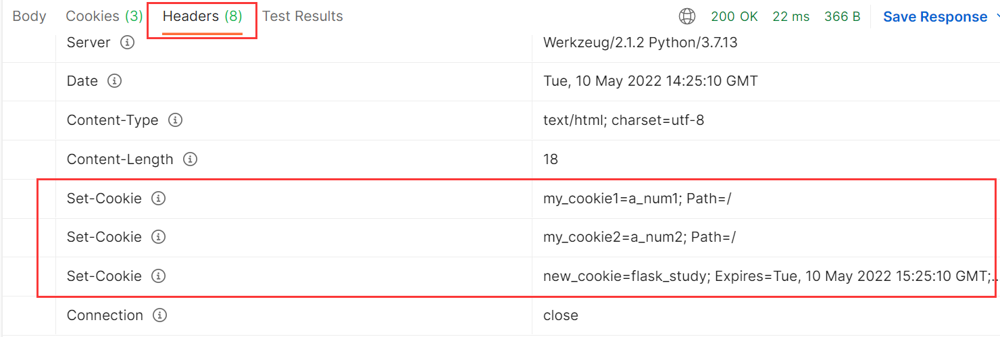

- 这是github一个[Flask文档教程](https://github.com/luhuisicnu/The-Flask-Mega-Tutorial-zh)，放这里，以后用到可以参考一下。

# Flask

postman中，form-data可以上传文件，具体区别看[这里](https://wenku.baidu.com/view/10a406daadf8941ea76e58fafab069dc50224797.html)。

尾至返回类型的一个写法：   -> typing.Any         # 先import typing

Flask官方中文[文档地址](https://dormousehole.readthedocs.io/en/latest/)。

Flask诞生于2010年，是用Python语言基于==Werkzeug==工具箱编写的轻量级Web开发框架


还有一个扩展包：Flask-Monment:本地化日期和时间


模板，这个Flask教程用的jinja2的模板，如果以后用到再来看吧，

数据库的扩展包用的是flask-sqlalchemy，是基于SQLAlchemy

还有数据迁移的扩展包，就不写了

还能使用flask发送邮件，（"\15 flask框架\11-数据库迁移扩展包Flask-Migrate、 邮件扩展包Flask-Mail\03_使用flask发送邮件.flv"）

然后说是Django中也是可以发送邮件的，就不写了

## 一、Flask基础

这视频教程用的flask版本是flask\==0.10.1，然后学习时，自己用的版本是flask==2.1.2

### 1.1. flask创建app对象

自己学习这时对应的[github代码](https://github.com/nianjiuhuiyi/flask_study/blob/master/a_first.py)。

#### 1.1.1 初始化参数

==_\_name__==：

​	假设在一个名字a_first.py文件中初始化一个Flask程序：

from flask import Flask
app = Flask(_\_name__)

- _\_name__ 表示当前的模块名字(就是当前py文件),
  - flask以这个模块所在的目录为根目录;
  - 默认这个py文件同级中的==static==为静态目录；
  - 默认同级中的==templates==为模板目录。（单词都是固定的，别写错了）
    - 使用模板的话，是 render_template("123.html")
- 在这个py文件执行的， 那么 \_\_name\_\_ == "\_\_main\_\_"  如果是其它模块导进来的，\_\_name\_\_的值就是其所在py文件的名字
  - 所以写成Flask("\_\_main\_\_") 或者 不写，即Flask("") 都是一个意思,不写或者乱写一个名字它没找到，就会默认设置为本py文件，但尽量别这样用，万一乱写的一个名字是一个有的第三方库，这个库里很可能就没有static、templates文件夹，静态文件访问时就会报错；
  - 当然也可以写其它模块名字，那就以那为根目录，也尽量别这么用。

---

==flask应用对象其它初始化参数说明==：（这几个一般不去设置，知晓一下就行）

静态文件直接访问的一个示例，跟Django一样，不需要去路由转发


注意以上的网址的static并不是静态资源文件夹的名字，原理同Django中的STATIC_URL（**这里一定要注意，不理解就去Django中看**,不然就找不到静态文件），

```python
app = Flask(__name__,
            static_url_path="/python",  # 同Django中的STATIC_URL，指定访问静态资源的url前缀，默认值是static
            static_folder="static",   # 静态文件的目录，默认就是static
            template_folder="templates"  # 模板文件的目录，默认就是templates
      )
```

后面两个参数可以不写，因为没变，static_url_path参数不写那就是向上面那样的网址访问，这样该饿了的话，访问就应该是127.0.0.1:8000/python/hello.html

Tips：

- app.run()  # 不写默认就是 127.0.0.1 才能访问，端口默认5000

- app.run("192.168.125.135")   # 这是写的本机的ip地址，那么就是只用 192.168.108.125.135:5000 才能够访问

- app.run("0.0.0.0")        # 这代表本机的ip地址都可以访问，一个机子可能有几个ip的，那无论是127...:port还是192...:port都可以访问 

#### 1.1.2 全局参数设置

这个就相当于Django的setting.py的一个全局配置，以DEBUG为例，有如下三种配置方式：

1. ==使用配置文件==：（"settings.py"和"config.cfg"内容都一样，后缀不重要）
   配置文件settings.py里的内容都是 key = value 这样的键值对

   ```python
   app.config.from_pyfile("settings.py")
   app.config.from_pyfile("config.cfg")    # 俩效果一样
   ```

2. ==使用类对象配置参数==:

   ```python
   class MyConfig(object):
       DEBUG = True   # 把需要配置的参数都写成类属性  
       My_IP = "127.0.0.1"  # 添加这样不属于flask的参数，自己要用的，后续get("My_IP")去取的时候这个是None，上面的DEBUG是可以正确取到值的，后续用到的时候再去解决吧
   app.config.from_object(MyConfig)
   ```

   后续取值的一个问题：

   - app.config.get("My_IP")  # 结果是None，取不到，看里面注释
   - print(app.config.get("DEBUG"))  # True

3. ==把app.config理解为一个字典==：（然后配置参数比较少的时候，可以直接新增）

   ```python
   app.config["DEBUG"] = True
   app.config["My_IP"] = "127.0.0.123"
   ```

   app.config.get("My_IP")  # 这个结果就不是None，就能正确到
   print(app.config.get("DEBUG"))  # True

4. 特别写一下DEBUG参数：还可以写进 app.run(debug=True)     # 一定注意，这里是小写的，千万别写错了

   - 只有在debug模式下，修改了主文件才会自动重启服务，不然不会。

Tips：
	教程里写，如果在别的模块里没有app这个对象，如果要获取参数呢？
	from flask import current_app  # 这个current_app就相当于是app的引用吧，这么理解
	print(current_app.config.get("DEBUG"))   # 这会直接报错，视频里没有报错，暂时不去深究了

### 1.2. 路由

#### 1.2.1 一些简单路由

1. 查看==所有路由==规则：print(app.url_map)

2. ==路由参数==：@app.route("/index")   

   - 不给methods参数的话，默认请求方式是GET,
   - @app.route("/index", methods=["POST"])  # 这时再网页直接请求(默认是GET),就会报错，这只能是POST了，当然还可以写成methods=["POST", "GET"]
     - 报错会得到405的一个状态码，就应该是代表请求方法错了
     - 302这个状态码是代表重定向

3. 同一视图函数添加几个路由：(这样访问这两个网址，都是对应的index()这个视图函数)

   ```python
   @app.route("/index123")
   @app.route("/index456")
   def index():
       return "hello world"
   ```

#### 1.2.2 重定向|url反向解析

使用重定向，以及url反向解析(跟Django一个原理)：（注意这俩导包）

```python
from flask import redirect, url_for
@app.route("/login")
def login():
    # 使用uel_for函数，通过视图名字(这里是index)找到对应的url路由路径，而不是下面那样写死了
    url = url_for("index")  
    return redirect(url)
    # return redirect("https://www.baidu.com/")    # 重定向，
```

#### 1.2.3 动态路由(转换器)

动态路由：因为flask不能直接向Django那样正则处理

转化器有下面几种：

1. 什么都不写的话，即<>    # 默认为普通字符串,除了`/`这一字符，路由传递的参数默认当做string处理，
2. int   即\<int:变量名>   # 接受整数
3. float                 # 同int，得接受浮点数
4. path                 # 和默认的相似，但也可以接受斜线

示例：

```python
@app.route("/goods/<int:good_id>")   # good_id自己随意起
def goods(good_id):
    return "hello world {}".format(good_id)
# 访问 127.0.0.1/goods/123   # 那么good_id就是123
```

==这种<>的方式就叫做转换器==，然后这个goods_id

- 如果写作 \<good_id>  # 那就是不加转换器类型，默认good_id就是普通字符串规则
- 如果写作 \<int:good_id>  # 转换器类型是int，那good_id就必须传int进来才能匹配到

==**自定义转换器**==：

​	以上的写法比较固定，那想要实现正则，那就写一个通用的自定义转换器（以后要写就直接看这个）

```python
from werkzeug.routing import BaseConverter
# 1、定义自己的转换器
class MyRegexConverter(BaseConverter):
    def __init__(self, url_map, my_regex):
        # 1.1 url_map参数是固定的，不管，相当于把app.url_map传进来让父类实现先
        # my_regex就是我们下面写的正则表达式
        super(MyRegexConverter, self).__init__(url_map)
        self.regex = my_regex  # 1.2 重写BaseConverter继承下来的regex这个类属性
        # flask会使用这个属性来进行路由的正则撇撇

# 2、将自定义的转换器添加到flask的应用中去（当做字典一样）
app.url_map.converters["my_re"] = MyRegexConverter   # "my_re"名字随意起

@app.route("/send/<my_re(r'1[37]\d{9}'):phone_num>")
def send_mgs(phone_num):
    return "send message to {}".format(phone_num)

# 127.0.0.1:5000/send/13512345678  可以访问，
```

解读：`@app.route("/send/<my_re(r'1[37]\d{9}'):phone_num>")`

- my_re就相当于是类名，my_re()就是类的实例化，my_re(r'1[37]\d{9}')那就是我们传进去的参数，那么my_regex就等于r'1[37]\d{9}'
  所以这里面的正则表达式就可以根据自己的情况随意写了；
- 第一个参数url_map是系统固定自己穿的，super这些也都是固定写法了，不管；
- phone_num就会得到正则匹配到后的结果，127.0.0.1:5000/send/13512345678得到的就是13512345678，其它不对的访问就会报错。

==自定义转换器进阶==：

​	其实在BaseConverter中还有两个方法：to_python、to_url

​	上面的例子，我们的到phone_num结果就是方法to_python返回给我们的，那我们就可以重写这个方法，对数据进行一些处理再返回，但用的还是比较少

```python
class MyRegexConverter(BaseConverter):
    def __init__(self, url_map, my_regex):
        super(MyRegexConverter, self).__init__(url_map)
        self.regex = my_regex  
    def to_python(self, value):   # 这就是原本BaseConverter类中的实现
        """这里的value就是拿到正则匹配后的结果，然后我们还可以在这里进行一些处理在返回，
        然后phone_num拿到的就是就是这个函数的返回结果；一般来说不重写这个函数"""
        return value
```

​	那如果上面 to_python 我写个return "abcd"，访问127.0.0.1:5000/send/13512345678，正则匹配是通过的，但是phone_num拿到的就是“abcd”了，就是这么个意思。

那个to_url方法是在url反解析的视图函数中带有这种自定义转换器时，会先把传进来的关键词参数给到to_url处理

```python
from flask import redirect, url_for
class MyRegexConverter(BaseConverter):
    def __init__(self, url_map, my_regex):
        super(MyRegexConverter, self).__init__(url_map)
        self.regex = my_regex  
    def to_python(self, value):   # 这就是原本BaseConverter类中的实现
        return value
    def to_url(self, value):
        return value
	
@app.route("/login")
def login():
    # phone_num一定要与send_mgs视图函数参数名字想同
    url = url_for("send_mgs", phone_num="13512345678")
    return redirect(url)
```

解读：（要结合上面的代码一起看）

- 第14行，就会把phone_num的值传给to_url方法的value参数进行处理，可以在中间加一些处理，一般也不会去修改；
- 总结：一般就像最开始写的自定义转换器一样，不要去重写to_python、to_url这两个方法，这些作为了解吧。

##### ==请求静态资源的实例== 

​	这里就用到了上面的动态路由转换，实现了网页直接请求一个静态资源(图片(浏览器直接展示)、音频文件(直接下载)等)。核心是用到“send_from_directory”

"http_server.py"

```python
from flask import Flask, send_from_directory

app = Flask(__name__)

@app.route("/images/<path:img_name>")
def send_img(img_name):
    return send_from_directory(app.static_folder, "images/" + img_name)


@app.route("/audios/<path:audio_name>")
def send_audio(audio_name):
    return send_from_directory(app.static_folder, "audios/" + audio_name)
    
if __name__ == '__main__':
    app.run(host="192.168.108.147", port=5000)
```

注意：

- app.static_folder就是运行目录下的static文件夹的绝对路径(前面有介绍，可以往第15行传参数来改变这个路径)，可以打出来看看。
- 网页网址请求示例：`http://192.168.108.147:5000/images/123.png`,`http://192.168.108.147:5000/audio/123.amr`;
- 对应的路径图片：（网页请求时不加static）(http是总目录，static目录与http_server.py启动文件是在http下同一层级)
  

### 1.3. ==request请求参数== 

from flask import Flask, request

直接导包的这个request中表示当前请求的request对象，里面保存了一次HTTP请求的一切信息。

request常用的属性如下：

- request.==data==：记录的所有非form表单提交的数据，如提交的json数据

  - 一般服务器端拿到的都是二进制数据，记得request.data.decode() 解码一下(这得到的字符串);更好的是用 json.load(request.data)将其变成字典

- request.==form==：记录请求中的表单数据，得到的结果是一个==类字典类型==数据(MultiDict)，可进行字典的操作

  - name = request.form.get("name")  # 一般都不request.form["name"]，虽然可以;

- request.==args==：记录请求中的查询参数，结果结果也是类字典类型数据(MultiDict)

  - 如访问的网址是127.0.0.1:5000/index?name=zhangsan&age=19，那么request.args就会把后面的查询字符串转成MultiDict这种格式，就可以
    print(request.args.get("name"))  # zhangsan;

- request.==cookies==：记录请求中的cookie信息，类型是Dict，看[1.4.5 cookie的使用](#1.4.5 cookie的使用);

- request.==headers==：记录请求中的报文头，也可以将其当做一个字典来处理，如
      print(request.headers.get("Host"));

- request.==method==：记录请求使用的HTTP方法，一般为 POST/GET;

- request.==url==：记录请求的完整URL地址，类型就是string;如 http://127.0.0.1:5000/index

- request.==path==：记录请求的路由地址，如 /index

- request.==files==：记录请求上传的文件，

  - ```python
    # 文件上传
    @app.route("/upload", methods=["POST"])  # 一定要POST方法
    def upload():
        img_data = request.files.get("my_pic")
        if img_data is None:
            return "失败"
        # # 方法一：
        # with open("demo.png", "wb") as fp:
        #     fp.write(img_data.read())
        # 方法二：
        img_data.save("demo1.png")    # 这是自带的方法保存，原理就是方法一
        print(img_data.filename)
        return "upload ok"
    ```

    解读：

    - "my_pic"是表单里提交文件的input里的name;
    - ==img_data.filename==这个属性是上传文件的文件名，但这个值是可以伪造的，如果要把文件按其本来的名字保存在服务器上，那么应该把它传递给 Werkzeug 提供的 secure_filename() 函数。

Tips：

- 类字典类型数据(MultiDict)里面的key是可以重复的：（form、args都是这个数据类型）
  - 使用.get(key)会拿到第一个名为key的值，
  - 使用.getlist(key)会拿到所有名为key的值的列表。
- 一般网页直接访问都是GET请求，会把表单中的数据拼接在网址后面，
- POST后面同样也可以跟，如 127.0.0.1:5000/index?name=zhangsan&age=19 用postman发送POST请求
- 后面的 ?name=zhangsan&age=19 叫做==查询字符串(QueryString)==

### 1.4. 其它

#### 1.4.1 abort函数

from flask import abort

​	使用abort函数可以立即终止视图函数的返回，并可以给前端特定的信息(它自己定义的一些标准页面)，一般可以这用：

```python
from flask import abort
@app.route("/index")
def index():
    if True:    # 
        abort(400)  # 执行了这里后就会直接退出了
    return "login success"
```

- abort(标准的http状态码)：这里的400就是代表Bad Request   （一般就是直接用这种形式）

- 还有一种用法：（这需要一个Response对象，页面显示的也是我们对象里的文字，那这就没意义了，不如直接return这段文字）

  ```python
  from flask import abort, Response
  if True:    # 部分代码
  	resp = Response("登陆失败！")
      abort(resp)
  ```

#### 1.4.2 自定义异常页面

自定义异常处理：就是类似于Django中重写了404.html页面一样

语法：@app.errorhandler(要重写的http标准状态码)

​	比如重写400返回的页面：

```python
@app.errorhandler(400)     # 重写其它标准页面，就把对应的状态码放这里
def my_error_hand(err):  # 一定要接受一个参数，里面是错误信息，可以不用
    return "这是我的400错误：%s" % err    # 这就是页面看到的信息
```

#### 1.4.3 return响应信息

设置响应信息的方法：

第一种：（里面的几个写法都是可以的）

```python
@app.route("/index")
def index():
    #       返回的数据    状态码，可以自己写      后面这是返回到header中的响应头(2种写法)
    # return "index page", 200, [("name", "zhangsan"), ("age", 18)]
    # return "index page", 400, {"name": "zhangsan", "age": 19}
    # return "index page", 600   # 甚至返回一个非标准的http状态码 （响应头、状态码都可以不要）
    return "index page", "600 my_status", {"name": "zhangsan", "age": 19}  # 状态码加注释
```

效果：


第二种：使用==make_response==来构造响应信息

```python
from flask import Flask, make_response
@app.route("/index")
def index():
    # 第二种：
    resp = make_response("index page 2")
    # resp.status_code = 200
    resp.status_code = "999 rand_my_status"
    resp.headers["city"] = "sc"   # 把resp.headers当成一个字典，添加键值对就行
```

#### 1.4.4 返json数据

返回json数据： （json其实就是一个字符串）（后面就用第二种）

```python
import json
from flask import jsonify
@app.route("/login")
def login():
    data = dict(
        name="zhangsan",
        age=18
    )
    # 第一种，直接返回json的字符串
    # json_str = json.dumps(data)
    # return json_str, 200, {"Content-Type": "application/json"}  # 好像一定需要后面这个header的设定

    # 第二种：jsonify （用这个）
    return jsonify(data)   # 这个会自动帮我们设定"Content-Type"这个header
    # 或者 return jsonify(name="zhangsna", age=18)  # 直接以关键字参数传进去也行
```

解读：

- 第一种就是最原始的原理：直接返回json字符串；第二种就是对第一种进行了一个封装;
- jsonify不一定要传一个字典进去，也可以直接传多个关键字参数。
- 在Django中也有对应的json数据返回对象：from django.http import JsonResponse  # django中没写，用法差不多

#### 1.4.5 cookie的使用

注意：取cookie时，是用的request.cookies，而session是从flask导包的，跟Django不一样。

```python
from flask import Flask, make_response, request

app = Flask(__name__)
"""设置cookie"""
@app.route("/set_cookie")
def set_cookie():
    # 设置cookie需要 make_response 函数来创建
    resp = make_response("成功设置cookie")
    # 设置cookie，默认是临时cookie，浏览器关闭就失效
    resp.set_cookie("my_cookie1", "a_num1")  # 前面试key，后面是value
    resp.set_cookie("my_cookie2", "a_num2")  # 可以设置多个cookie
    # max_age：设置过期时间，以秒为单位
    resp.set_cookie("new_cookie", "flask_study", max_age=3600)
    # 也可以通过这样的方式添加header
    resp.headers["Set-Cookie"] = "other_cookie=my_123; Expires=Tue, 10 May 2022 15:25:10 GMT; Max-Age=3600; Path=/" 
    return resp

"""获取cookie"""
@app.route("/get_cookie")
def get_cookie():
    value = request.cookies.get("new_cookie")
    return value

"""删除cookie"""
@app.route("/delete_cookie")
def delete_cookie():
    # 也是需要 make_response 来创建
    resp = make_response("cookie 删除成功")
    # 删除cookie
    resp.delete_cookie("my_cookie1")
    return resp

if __name__ == '__main__':
    app.run(debug=True)
```

Tips：

- 去看代码里的注释吧，些很清楚了；
- 讲一下第11行的==set_cookie==，它其实就是在响应头header里添加了一个名为set_cookie的head，浏览器读取到这个们就会将其值设置为cookie，如下图：
  
  - 所以可以直接模仿这种格式，给header中添加而不通过set_cookie的方式，即：
    resp.headers["Set-Cookie"] = "other_cookie=my_123; Expires=Tue, 10 May 2022 15:25:10 GMT; Max-Age=3600; Path=/"

#### 1.4.6 session

from flask import session   # 注意不是request.session

```python
from flask import Flask, session
app = Flask(__name__)

# 1、要设置session，必须要配置一下(key的名字是固定的，值随便给的)
app.config["SECRET_KEY"] = "abcdefg_dasdw"

# 2、设置session
@app.route("/login")
def login():
    session["name"] = "zhnagsan"
    session["age"] = 18
    return "login success"

@app.route("/index")
def index():
    name = session.get("name")
    return "拿到的session中的值是：%s" % name

if __name__ == '__main__':
    app.run()
```

解读：

- Django中的session数据默认是放在后端Django数据库中的表，而Flask的session其实还是保存cookie中，就在前端浏览器里面的，所以需要我们设定==app.config["SECRET_KEY"]==做一个加密操作。
  - "SECRET_KEY"是固定的写法，后面的值随意起；
  - 如果不设置这行，就会得到这样的错误：RuntimeError: The session is unavailable because no secret key was set. 
    
- session除了保存到数据库；还可以保存进文件里；甚至可以直接存在程序的内存里，好比在程序中定义一个全局变量的字典，用这个字典来存session，
  - 存在程序内的问题：线上不会就一台服务器在跑，是多台在跑，会通过nginx分发，那最开始nginx一个用户分发到了A机子，session存在了这台机子上，这个用户再访问，nginx分发到了B机子上，那B上就没有对应的第一次存在session。
  - 解决：设置nginx策略，分发的时候不是随机分发，通过设置IP归属地来转发，某个地区的ip都转发带A机器上,这样就在一定程度上解决。

- session也不是必须要依赖于cookie(一般要用cookie来存session的session_id)，如果浏览器用户禁用cookie的话，解决办法就是：在返回redict重定向时，把session_id拼接到路径中去(或者通过js脚本去自动补充)，如 
      :port/index?session_id=123
- 这样访问的时候，就会带上这个session_id，从url就可以拿到args参数解析;
  
- 有些网站就是这么处理的，看到网址后面跟了 ?dadafaa 很长一串东西，里面可能就是跟了它的session_id标记，当然也可能叫其它名字，并不一定得是sessioon_id;
  
- 这种的话，是没办法设置过期时间的，所以浏览器一关闭，就相当于直接失效了。
  
- **这个视频里**详细的讲了session的机制，狭义的广义的，后续用得着可以来看看。（"E:\学习资料\视频资料\就业班\15 flask框架\06-cookie和session\03_session机制说明.flv"）

#### 1.4.7 请求上下文与应用上下文

请求上下文对象：

​	request和session都属于==请求上下文对象==：(from flask import request, session)

​	Django里的request是每个视图函数都有的，各用各的没问题，但是falsk中，每个视图函数用的都是from flask import request,这个request是一个全局变量，那么怎么保证各自请求从reques中拿到的是自己请求的数据，flask就用到了一个==线程局部变量==(就是这个request全局变量)，简单来说，一个请求就会开一个线程，把request当做一个字典，key就是线程编号，value就是其提交的数据，这样就达到了一个全局变量request，各自请求用各自的数据。这就是==请求上下文==

---

应用上下文对象：

​	current_app和g都属于==应用上下文对象==：（from flask import current_app, g）

- current_app：表示当前运行程序文件的程序实例，相当于实例化的app的引用(但这个新版我的应用还一直有点问题)

- g：它跟请求没啥关系，它主要就是用于多个函数之间传递数据用的，举个例子：

  ```python
  from flask import g
  @app.route("/show")
  def show():
      # 假设这个视图函数要调用 do_something 这个函数，同时还要传很多参数
      g.my_name = "hui"      # 这样存进去，my_name这名字随意取
      g.age = [18, 23]
      do_something()
      return "hello show"
  
  def do_something():
      """假设这个函数需要show视图函数传进来很多参数，写到定义里就很繁琐"""
      name = g.my_name  # 这样就拿到g中的数据，
      print("这就相当于传进来的参数：%s" % name)
  ```

  - 当视图函数调用了很多类似do_something这样的函数时，且需要传很多参数时，用`g`就非常方便，不然定义函数和调用函数的时候写的参数传递就很麻烦。
  - 处理请求时，用于临时存储的对象，每次请求都会重设这个变量(即回到初始化)

#### 1.4.8 hook钩子

请求钩子是通过装饰器的形式实现的（同Django中的中间件），Flask常用的四种请求钩子：

1. @app.before_first_request   # 视图函数第一次被请求时才会被执行，后续不会;
2. @app.before_request        # 在每次请求前运行;
3. @app.after_request         # 如果没有未处理的异常抛出，视图函数运行后，这会运行;
4. @app.teardown_request      # 每次请求后，即使有未处理的异常抛出，这也会执行。

```python
from flask import Flask
app = Flask(__name__)

@app.route("/index")
def index():
    print("index视图函数运行！")
    return "hello world!"

@app.before_first_request
def my_first_handle():
    print("第一次")

@app.before_request
def my_before_handle():
    print("视图函数处理前运行")

@app.after_request
def my_after_handle(resp):
    print("视图函数正常运行后，这里执行（有异常就不会执行）")
    return resp
"""注意后面这两个需要一个参数，这个参数内容就是上一个处理完返回的内容"""
@app.teardown_request
def my_teardown_handle(resp):
    print("每次请求完后，即便有未处理的异常抛出，这也会执行")
    return resp

if __name__ == '__main__':
    app.run(debug=True)
```

效果：


使用Tips：

- 这些hook钩子装饰器对所有的视图函数都会起作用，无差别对待;

- 若是针对单一视图作用的，那直接把逻辑写进视图函数里好了，这种hook更多的是针对一组视图来处理，就可以这么写：示意

  ```python
  from flask import request, url_for
  @app.before_first_request
  def my_first_handle():
      # 相当于请求的视图函数是"index"、"hello"这些做一些操作，其它的做别的操作
      if request.path in [url_for("index"), url_for("hello"), url_for("视图函数名字")]:
          pass # dosomething
      elif request.path in [url_for("视图函数名字"), ]:
          pass
      else:
          pass
  ```

注意：

- 视频里如果视图函数中有异常抛出，要@app.teardown_request能运行，必须是debug=False;
- 但是：我的视图函数中有异常后，我的@app.after_request、@app.teardown_request都能被执行，缺无论是不是debug模式。也许是版本的问题吧。以后用到的时候要注意下这个问题。

#### 1.4.9 Flask-Script扩展

就是前面讲到的扩展，目的就是让flask向Django那样命令行运行：

环境安装：pip install Flask-Script

```python
"""假设这个py文件叫：my_manage.py """
from flask import Flask
from flask_script import Manager  # 导入管理类

app = Flask(__name__)
manager = Manager(app)

@app.route("/index")
def index():
    return "hello world!"

if __name__ == '__main__':
    # app.run(debug=True)
    manager.run()  # 这样去运行
```

使用Tips：

- 这也还是可以直接在pycharm中直接运行，也可以命令行 python my_manage.py runserver 启动
  - 也可以：python my_manage.py runserver --help 来查看其支持的参数，可以 -d 指定为debug模式，也可以指定host、port这些;
- 也可以 python my_manage.py shell 进到终端，就可以不导包(默认帮我们导入了)，直接 app.url_map 就会获得路由结果。

## 二、Flask进阶

### 2.1. flask中的蓝图

​	简单来说，视图路由全都写在一个py文件中，不好维护，也想像Django那样一个应用的视图函数放在一个文件夹中，flask中的蓝图就是来做到这个的。

简单使用：视图函数写到flask启动文件同级的一个py文件

blue.py

```python
from flask import Blueprint

# 1、创建蓝图对象
admin = Blueprint("admin", __name__)

# 2、注册蓝图路由
@admin.route("/admin_index")
def admin_index():
    return "这是蓝图中注册的index函数"
```

main.py

```python
from flask import Flask, render_template
from blue import admin   # 导入蓝图对象
app = Flask(__name__)

# 3、在程序实例中注册该蓝图
app.register_blueprint(admin, url_prefix="/my_order")

@app.route("/index")
def index():
    return render_template("index.html")

if __name__ == '__main__':
    app.run()
```

解读：

- ```python
  admin = Blueprint("admin", __name__)  # 两个必须的参数
  ```

  - 第一个参数表示蓝图的名字，一般就和前面的变量名设成一样就好了;
  - 第二个表示蓝图所在模块。

- ```
  app.register_blueprint(admin, url_prefix="/my_order")
  ```

  - 第一个参数是导进来的蓝图对象

  - 第二个参数不是必须的，但一般都是有的，这样访问，蓝图中的路由时都要加上url_prefix前缀，即:port/my_order/admin_index

    如果不想在前面加前缀可不要这个参数，或写做 url_prefix="/"

---

进阶：像Django那样把一个应用的放到一个文件夹

1. 创建一个名为car的购物车应用，那就要创建car这个包(带`__init__.py`),然后再这个init的py文件中去创建蓝图：
   \_\_init\_\_.py

   ```python
   from flask import Blueprint
   
   app_car = Blueprint("app_car", __name__)
   
   # 要把这个视图函数导进来，让代码看到，不然视图函数get_car就没出现，也没被导包什么的
   from .views import get_car     # 一定要写成 .view 点代表这个包，不加的话会报找不到views这个包
   ```

   views.py

   ```python
   from . import app_car   # 注意这个写法,.好像就代表这个包，那就代表__init__.py
   
   @app_car.route("get_car")
   def get_car():
       return "获取购物车信息"
   ```

   main.py

   ```python
   from flask import Flask, render_template
   from car import app_car
   
   app = Flask(__name__)
   
   # 注册蓝图路由
   app.register_blueprint(app_car, url_prefix="/car")  # 这里的前缀car自己随意写
   
   @app.route("/index")
   def index():
       return render_template("index.html")
   
   if __name__ == '__main__':
       app.run(debug=True)
   ```

   访问：127.0.0.1:5000/car/get_car，
   以下是上面文件的一个示意：
   

2. 蓝图里，静态文件、模板文件路径设置：
   

   Tips：

   - app_car = Blueprint()  这个参数跟Flask初始化参数差不多，还可以指定 static_folder 、static_url_path 、 url_prefix等，所以静态文件的做法类似;
   - 但Blueprint这里面的 template_folder 这些参数不像Flask初始化参数，是没有默认值的，所以要用的话一定要指定;
   - 如上图所说，模板的搜索路径是总的模板路径，再是子应用中的模板路径，前面找到了，就不再往后去看了。

### 2.2. flask的单元测试

​	所有单元测试，按照正常的测试用例来写好了，flask也可以用requests来模拟post请求什么的，除此之外，flask还提供了自己一些方便测试的方法，具体不细写了，看下图：


进一步配置：


说明：

- 左边的两种写法是一样的效果，选择一种就好了;
- 左边把这都注释掉，那单元测试会因为右边的错误拿不到返回的json数据，报错也都是拿不到json数据，不知道具体是因为什么;
- 左边开启设置，单元测试时就会得到具体的 divided 0 的错误。

## 三、Flask部署

Supervisor的一个使用，Python开发的一个client/server服务，是Linux/Unix系统下的一个进程管理工具，不支持Windows系统。它可以很方便的监听、启动、停止、重启一个或多个进程。用Supervisor管理的进程，当一个进程意外被杀死，supervisort监听到进程死后，会自动将它重新拉起，很方便的做到进程自动恢复的功能，不再需要自己写shell脚本来控制。（只是放这里，如果后续用得到的话，就去深入吧）

### 3.1. gunicorn

​	说明：在生产环境中，flask自带的服务器，一般无法满足性能要求，这里采用Gunicorn做wsgi容器来部署flask程序。

​	==Gunicorn==(绿色独角兽)是一个Python WSGI的HTTP服务器，它与各种web框架兼容，轻量级的资源消耗，可直接用命令启动，不需要编写配置文件，相对uWSGI要容易很多。  # uWSGI是指实现了uwsgi协议WSGI的web服务器。


Tips:

- 特别注意：gunicorn只支持linux平台，不支持windows;
- 把这个用于Django应该也是没问题的，一样使用。
- 可以用一个软件supervisor，对gunicorn进行管理，如果用到，参考[这里](https://blog.csdn.net/xu710263124/article/details/118975404)、[这里](https://blog.csdn.net/wumian0123/article/details/106614272/)、[这里](https://duozan.blog.csdn.net/article/details/124222368?spm=1001.2101.3001.6661.1&utm_medium=distribute.pc_relevant_t0.none-task-blog-2%7Edefault%7ECTRLIST%7ERate-1-124222368-blog-106614272.pc_relevant_paycolumn_v3&depth_1-utm_source=distribute.pc_relevant_t0.none-task-blog-2%7Edefault%7ECTRLIST%7ERate-1-124222368-blog-106614272.pc_relevant_paycolumn_v3&utm_relevant_index=1)。

---

部署的方式：gunicorn + flask

安装：pip install gunicorn

通过命令行 gunicorn -h 来查看各种参数，以下是常用参数：（假定有my_server.py）

- 默认运行：gunicorn 运行py文件名称(不要后缀名):Flask程序实例名(一般就是app)  # 默认启动的就是127.0.0.1:8000     # 如gunicorn my_server:app
- -w 4   # 表示进程(worker)    
- -b 192.168.108.147:5000     # 指定运行主机和端口
- -D   # 加了这个参数就是以守护进程的方式运行
- --access-logfile ./logs/log1.txt  # 将访问里记录保存进日志文件（路径中有文件夹的话，要提前创建）
- gunicorn更多的说明，以及==ab压力测试工具==，一定要[看这里](https://zhuanlan.zhihu.com/p/102716258)，一定。

总的：
gunicorn -w 4 -b 192.168.125.135:5000 --access-logfile ./logs/log1.txt  my_server:app

### 3.2. 通过nginx

生产环境的部署的方式：nginx + gunicorn + flask

my_server.py

```python
from flask import Flask
from datetime import datetime
app = Flask(__name__)
@app.route("/index")
def index():
	return "this is index pages!"

@app.route("/login")
def login():
	return "login success!"

@app.route("/time")
def time():
	return datetime.now().strftime("%Y-%m-%d %H:%M:%S")
	
if __name__ == "__main__":
	app.run()
```

1. 假设三台机子上启动了三个flask服务：(启动程序在my_server.py中)

   - gunicorn -D -b 127.0.0.1:8123 --access-logfile ./logs/port8123.txt my_server:app
   - gunicorn -D -b 192.168.125.125:8456 --access-logfile ./logs/port8456.txt my_server:app
   - gunicorn -D -b 192.168.125.135:8789 --access-logfile ./logs/port8789.txt my_server:app

2. 配置nginx，在其conf目录下，编译nginx.conf，然后启动：就在http板块写了部分，

   ```
   http {
       include       mime.types;
       default_type  application/octet-stream;
       sendfile        on;
       #tcp_nopush     on;
       #keepalive_timeout  0;
       keepalive_timeout  65;
       #gzip  on;
       
   	# 1、重点是这里，三个服务
   	upstream my_flask {
   		server 127.0.0.1:8123;
   		server 192.168.125.125:8456;
   		server 192.168.125.135:8789;
   	}
       server {
           listen       80;
           server_name  localhost;
   
           #charset koi8-r;
           #access_log  logs/host.access.log  main;
   		
   		# 2、设置转发规则
           location / {
             	# proxy_pass http://127.0.0.1:8123;  # 如果就是本地的一个服务
             	proxy_pass http://my_flask;  # 注意这行写法
             	# 设置请求头，并将头信息传递给服务器
               proxy_set_header Host $host;  
               proxy_set_header X-Real-IP $remote_addr;
           }
   		# 后面还有一些东西就删了
       }
   ```

   Tips：

   - proxy_set_header应该不是必须的，视频里说这个就是可以将发起访问的客机的真实ip一起转发到服务器，不然访问的信息全是来自nginx，我们些服务器时，拿到的request.url可能就需要这个设置吧。写上嘛，暂时没感觉到差别

3. 假设启动nginx服务的服务器ip是192.168.125.135，那么就可以用其它局域网内互通的机子来进行访问，比如：
   192.168.125.135:80/time      # 可能要去防火墙那里开启80端口
   192.168.125.135:80/login     

   - 然后就可以通过./logs/port8***.txt看到这些日志文件大小的变化，就发现访问的一个地址，这三个服务的各自的日志文件大小都在变化，就达到了负载均衡的转发。

### 3.3. 并发压力测试

一定要看[这些](https://zhuanlan.zhihu.com/p/102716258)，其它web server应该也是一样适用这些压力测试。

## 四、yolov5-falsk

这个是基于王新宇的tensorrt-yolov5的一个用flask改的server：

- server.py:

  ```python
  # coding=utf-8
  import ctypes
  import os
  import shutil
  import random
  import sys
  import threading
  import time
  from turtle import begin_fill
  import cv2
  import numpy as np
  import pycuda.autoinit
  import pycuda.driver as cuda
  import tensorrt as trt
  import torch
  import torchvision
  from flask import Flask, request
  import json
  import base64
  
  CONF_THRESH = 0.35
  IOU_THRESHOLD = 0.4
  
  class YoLov5TRT(object):
      """
      description: A YOLOv5 class that warps TensorRT ops, preprocess and postprocess ops.
      """
  
      def __init__(self, engine_file_path):
          # Create a Context on this device,
          self.ctx = cuda.Device(0).make_context()
          stream = cuda.Stream()
          TRT_LOGGER = trt.Logger(trt.Logger.INFO)
          runtime = trt.Runtime(TRT_LOGGER)
  
          # Deserialize the engine from file
          with open(engine_file_path, "rb") as f:
              engine = runtime.deserialize_cuda_engine(f.read())
          context = engine.create_execution_context()
  
          host_inputs = []
          cuda_inputs = []
          host_outputs = []
          cuda_outputs = []
          bindings = []
  
          for binding in engine:
              print('bingding:', binding, engine.get_binding_shape(binding))
              size = trt.volume(engine.get_binding_shape(binding)) * engine.max_batch_size
              dtype = trt.nptype(engine.get_binding_dtype(binding))
              # Allocate host and device buffers
              host_mem = cuda.pagelocked_empty(size, dtype)
              cuda_mem = cuda.mem_alloc(host_mem.nbytes)
              # Append the device buffer to device bindings.
              bindings.append(int(cuda_mem))
              # Append to the appropriate list.
              if engine.binding_is_input(binding):
                  self.input_w = engine.get_binding_shape(binding)[-1]
                  self.input_h = engine.get_binding_shape(binding)[-2]
                  host_inputs.append(host_mem)
                  cuda_inputs.append(cuda_mem)
              else:
                  host_outputs.append(host_mem)
                  cuda_outputs.append(cuda_mem)
  
          # Store
          self.stream = stream
          self.context = context
          self.engine = engine
          self.host_inputs = host_inputs
          self.cuda_inputs = cuda_inputs
          self.host_outputs = host_outputs
          self.cuda_outputs = cuda_outputs
          self.bindings = bindings
          self.batch_size = engine.max_batch_size
  
      def infer(self, raw_image_generator):
          threading.Thread.__init__(self)
          # Make self the active context, pushing it on top of the context stack.
          self.ctx.push()
          # Restore
          stream = self.stream
          context = self.context
          engine = self.engine
          host_inputs = self.host_inputs
          cuda_inputs = self.cuda_inputs
          host_outputs = self.host_outputs
          cuda_outputs = self.cuda_outputs
          bindings = self.bindings
          # Do image preprocess
          batch_image_raw = []
          batch_origin_h = []
          batch_origin_w = []
          batch_input_image = np.empty(shape=[self.batch_size, 3, self.input_h, self.input_w])
  
          image_raw = raw_image_generator    # 把迭代器的值直接拿出来了
          input_image, image_raw, origin_h, origin_w = self.preprocess_image(image_raw)
          batch_image_raw.append(image_raw)
          batch_origin_h.append(origin_h)
          batch_origin_w.append(origin_w)
          np.copyto(batch_input_image[0], input_image)
          batch_input_image = np.ascontiguousarray(batch_input_image)
  
          # Copy input image to host buffer
          np.copyto(host_inputs[0], batch_input_image.ravel())
          start = time.time()
          # Transfer input data  to the GPU.
          cuda.memcpy_htod_async(cuda_inputs[0], host_inputs[0], stream)
          # Run inference.
          context.execute_async(batch_size=self.batch_size, bindings=bindings, stream_handle=stream.handle)
          # Transfer predictions back from the GPU.
          cuda.memcpy_dtoh_async(host_outputs[0], cuda_outputs[0], stream)
          # Synchronize the stream
          stream.synchronize()
          end = time.time()
          # Remove any context from the top of the context stack, deactivating it.
          self.ctx.pop()
          # Here we use the first row of output in that batch_size = 1
          output = host_outputs[0]
  
          results = []
          # batch_size是1，就不要这一层循环了
          result_boxes, result_scores, result_classid = self.post_process(
              output[0 * 6001: (0 + 1) * 6001], batch_origin_h[0], batch_origin_w[0]
          )
          for i in range(len(result_boxes)):
              box = [round(temp.item()) for temp in result_boxes[i]]
              categry = int(result_classid[i])
              result_score = result_scores[i].item()
              box.append(round(result_score, 2))
              results.append({categry: box})   # {类别id: [x1, y1, x2, y2, score]}
  
          return results, end - start
  
      def destroy(self):
          # Remove any context from the top of the context stack, deactivating it.
          self.ctx.pop()
          
      def get_raw_image(self, image_path_batch):
          """
          description: Read an image from image path
          """
          for img_path in image_path_batch:
              yield cv2.imread(img_path)
          
      def get_raw_image_zeros(self, image_path_batch=None):
          """
          description: Ready data for warmup
          """
          for _ in range(self.batch_size):
              yield np.zeros([self.input_h, self.input_w, 3], dtype=np.uint8)
  
      def preprocess_image(self, raw_bgr_image):
          """
          description: Convert BGR image to RGB,
                       resize and pad it to target size, normalize to [0,1],
                       transform to NCHW format.
          param:
              input_image_path: str, image path
          return:
              image:  the processed image
              image_raw: the original image
              h: original height
              w: original width
          """
          image_raw = raw_bgr_image
          h, w, c = image_raw.shape
          image = cv2.cvtColor(image_raw, cv2.COLOR_BGR2RGB)
          # Calculate widht and height and paddings
          r_w = self.input_w / w
          r_h = self.input_h / h
          if r_h > r_w:
              tw = self.input_w
              th = int(r_w * h)
              tx1 = tx2 = 0
              ty1 = int((self.input_h - th) / 2)
              ty2 = self.input_h - th - ty1
          else:
              tw = int(r_h * w)
              th = self.input_h
              tx1 = int((self.input_w - tw) / 2)
              tx2 = self.input_w - tw - tx1
              ty1 = ty2 = 0
          # Resize the image with long side while maintaining ratio
          image = cv2.resize(image, (tw, th))
          # Pad the short side with (128,128,128)
          image = cv2.copyMakeBorder(
              image, ty1, ty2, tx1, tx2, cv2.BORDER_CONSTANT, (128, 128, 128)
          )
          image = image.astype(np.float32)
          # Normalize to [0,1]
          image /= 255.0
          # HWC to CHW format:
          image = np.transpose(image, [2, 0, 1])
          # CHW to NCHW format
          image = np.expand_dims(image, axis=0)
          # Convert the image to row-major order, also known as "C order":
          image = np.ascontiguousarray(image)
          return image, image_raw, h, w
  
      def xywh2xyxy(self, origin_h, origin_w, x):
          """
          description:    Convert nx4 boxes from [x, y, w, h] to [x1, y1, x2, y2] where xy1=top-left, xy2=bottom-right
          param:
              origin_h:   height of original image
              origin_w:   width of original image
              x:          A boxes tensor, each row is a box [center_x, center_y, w, h]
          return:
              y:          A boxes tensor, each row is a box [x1, y1, x2, y2]
          """
          y = torch.zeros_like(x) if isinstance(x, torch.Tensor) else np.zeros_like(x)
          r_w = self.input_w / origin_w
          r_h = self.input_h / origin_h
          if r_h > r_w:
              y[:, 0] = x[:, 0] - x[:, 2] / 2
              y[:, 2] = x[:, 0] + x[:, 2] / 2
              y[:, 1] = x[:, 1] - x[:, 3] / 2 - (self.input_h - r_w * origin_h) / 2
              y[:, 3] = x[:, 1] + x[:, 3] / 2 - (self.input_h - r_w * origin_h) / 2
              y /= r_w
          else:
              y[:, 0] = x[:, 0] - x[:, 2] / 2 - (self.input_w - r_h * origin_w) / 2
              y[:, 2] = x[:, 0] + x[:, 2] / 2 - (self.input_w - r_h * origin_w) / 2
              y[:, 1] = x[:, 1] - x[:, 3] / 2
              y[:, 3] = x[:, 1] + x[:, 3] / 2
              y /= r_h
  
          return y
  
      def post_process(self, output, origin_h, origin_w):
          """
          description: postprocess the prediction
          param:
              output:     A tensor likes [num_boxes,cx,cy,w,h,conf,cls_id, cx,cy,w,h,conf,cls_id, ...] 
              origin_h:   height of original image
              origin_w:   width of original image
          return:
              result_boxes: finally boxes, a boxes tensor, each row is a box [x1, y1, x2, y2]
              result_scores: finally scores, a tensor, each element is the score correspoing to box
              result_classid: finally classid, a tensor, each element is the classid correspoing to box
          """
          # Get the num of boxes detected
          num = int(output[0])
          # Reshape to a two dimentional ndarray
          pred = np.reshape(output[1:], (-1, 6))[:num, :]
          # to a torch Tensor
          pred = torch.Tensor(pred).cuda()
          # Get the boxes
          boxes = pred[:, :4]
          # Get the scores
          scores = pred[:, 4]
          # Get the classid
          classid = pred[:, 5]
          # Choose those boxes that score > CONF_THRESH
          si = scores > CONF_THRESH
          boxes = boxes[si, :]
          scores = scores[si]
          classid = classid[si]
          # Trandform bbox from [center_x, center_y, w, h] to [x1, y1, x2, y2]
          boxes = self.xywh2xyxy(origin_h, origin_w, boxes)
          # Do nms
          indices = torchvision.ops.nms(boxes, scores, iou_threshold=IOU_THRESHOLD).cpu()
          result_boxes = boxes[indices, :].cpu()
          result_scores = scores[indices].cpu()
          result_classid = classid[indices].cpu()
          return result_boxes, result_scores, result_classid
  
  
  """ 下面开始是一个Flask的简单demo测试 """
  
  app = Flask(__name__)
  
  def init_model():
      # load custom plugins
      PLUGIN_LIBRARY = "./build/libmyplugins.so"  # 这个是自己训练的动态库，只是名字没改
      engine_file_path = "./build/my_v5s.engine"
  
      if len(sys.argv) > 1:
          engine_file_path = sys.argv[1]
      if len(sys.argv) > 2:
          PLUGIN_LIBRARY = sys.argv[2]
  
      ctypes.CDLL(PLUGIN_LIBRARY)
  
      # a YoLov5TRT instance
      yolov5_wrapper = YoLov5TRT(engine_file_path)
  
      return yolov5_wrapper
  
  
  yolov5_engine = init_model()
  
  
  @app.route("/predict", methods=["POST"])
  def server():
      datas = request.data.decode()   # json数据
      datas = json.loads(datas)
      img_h = datas.get("height")
      img_w = datas.get("width")
      img_data = datas.get("image")  # 图片的二进制格式，通过base64编码
  
      img_data = base64.b64decode(img_data)   # 解码
      img_array = np.frombuffer(img_data, np.uint8)
      img = img_array.reshape((img_h, img_w, -1))
  
      results, use_time = yolov5_engine.infer(img)
      print("只是单张图的infer时间：{:.2f}ms".format(use_time * 1000))
  
      return json.dumps(results)
      
  
  if __name__ == "__main__":
      try:
          app.run(host="127.0.0.1", port=8899, debug=True)
      except Exception:
          raise
      finally:
          yolov5_engine.destroy()
  ```

- client.py

  ```python
  import json
  import cv2
  import base64
  import requests
  import random
  import time
  
  # load coco labels
  categories = ['T01', 'T02_1', 'T02_2', 'T02_3', 'T03_1', 'T03_2', 'T03_3', 'T04', 'T05',
                'T06', 'T07', 'T08', 'T09', 'T10', 'T11', 'T12', 'T13', 'T14', 'T15',
                'T16', 'T17', 'T18', 'T19', 'T20', 'T21', 'T22', 'T26']
  
  
  def trans(img_array):
      h, w, c = img_array.shape
      img_encode = base64.b64encode(img_array)  # 转换为二进制
      image_info = dict(
          height=h,
          width=w,
          image=str(img_encode, encoding="utf-8")  # 要转成str才能转成json格式，且这里一定要指定编码方式，不然后续base64解码会报错
      )
      return json.dumps(image_info)
  
  
  def plot_one_box(x, img, color=None, label=None, line_thickness=None):
      tl = (
              line_thickness or round(0.002 * (img.shape[0] + img.shape[1]) / 2) + 1
      )  # line/font thickness
      color = color or [random.randint(0, 255) for _ in range(3)]
      c1, c2 = (int(x[0]), int(x[1])), (int(x[2]), int(x[3]))
      cv2.rectangle(img, c1, c2, color, thickness=tl, lineType=cv2.LINE_AA)
      if label:
          tf = max(tl - 1, 1)  # font thickness
          t_size = cv2.getTextSize(label, 0, fontScale=tl / 3, thickness=tf)[0]
          c2 = c1[0] + t_size[0], c1[1] - t_size[1] - 3
          cv2.rectangle(img, c1, c2, color, -1, cv2.LINE_AA)  # filled
          cv2.putText(img, label, (c1[0], c1[1] - 2), 0, tl / 3, [225, 255, 255], thickness=tf, lineType=cv2.LINE_AA)
  
  
  if __name__ == '__main__':
      cap = cv2.VideoCapture(r"C:\Users\Administrator\Pictures\123.mp4")
      while cap.isOpened():
          ret, frame = cap.read()
          t1 = cv2.getTickCount()  # 计算fps
          begin = time.time()
          if not ret:
              break
          img_data = trans(frame)
          infer_begin = time.time()
          receive_data = requests.post("http://127.0.0.1:8899/predict", img_data)
          infer_end = time.time()
          print("单帧infer用时：{:.2f}ms".format((infer_end - infer_begin) * 1000))
          if receive_data.status_code == 200:
              detect_info = json.loads(receive_data.content)
              for i in range(len(detect_info)):
                  for result_classid, box_score in detect_info[i].items():
                      box = box_score[:4]
                      score = box_score[4]
                      plot_one_box(box, frame, label="{}:{}".format(categories[int(result_classid)], score))
  
          end = time.time()
          print("单帧+画图用时：{:.2f}ms".format((end - begin) * 1000))    # 数据大约在  120ms~130ms
          t2 = (cv2.getTickCount() - t1) / cv2.getTickFrequency()
          fps = 1.0 / t2
          cv2.putText(frame, f"fps: {fps:.2f}", (10, 30), cv2.FONT_HERSHEY_PLAIN, 2, (0, 0, 255), 2,
                      cv2.LINE_AA)
          cv2.imshow("1", frame)
          if cv2.waitKey(1) & 0xFF != 255:
              break
      cv2.destroyAllWindows()
      cap.release()
  ```

一个实测的结果：

- 就在服务器上直接跑yolov5s，tenosrrt，单张图的infer在3ms多一点，如果还要将结果画出来，还要30ms左右;
- 如果是以服务器上server的方式，通过vscode远程来启动运行，windows上来http访问，单张图的infer时间在150ms\~160ms左右(如果不是通过vscode端口转发，直接使用服务器的端口，时间大概在70ms\~80ms)，应该还是网络通讯花了一些时间。

