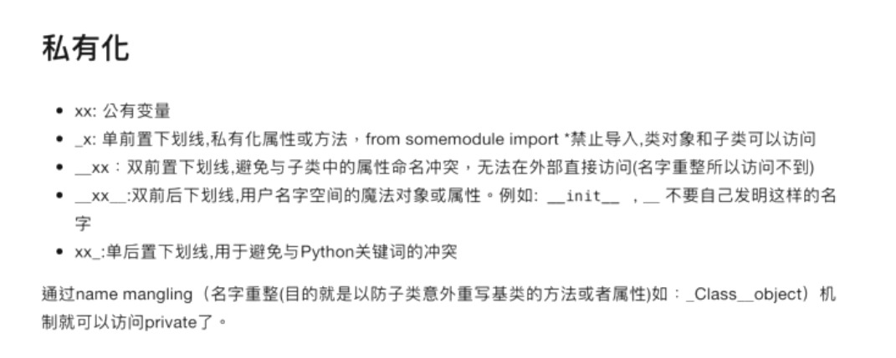
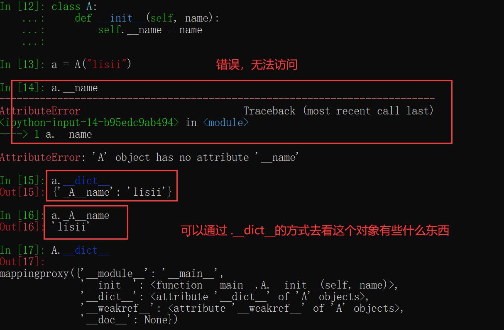
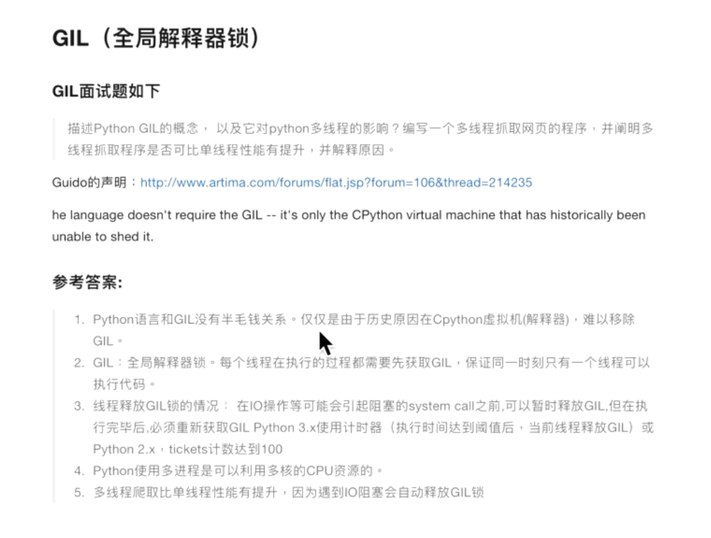
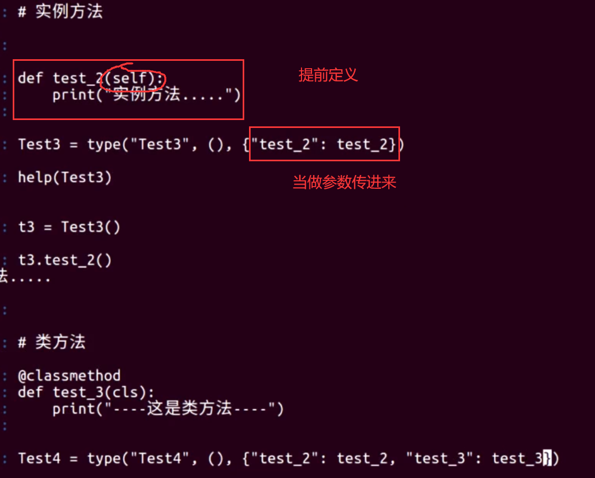
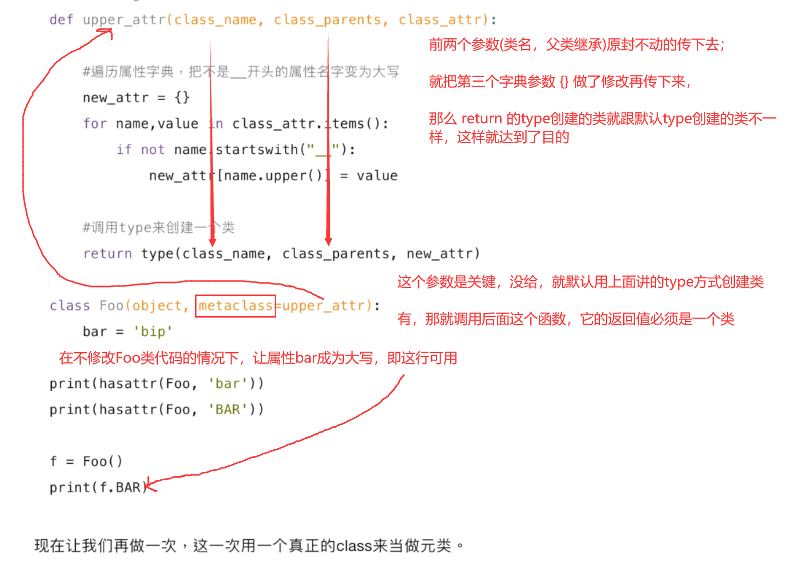
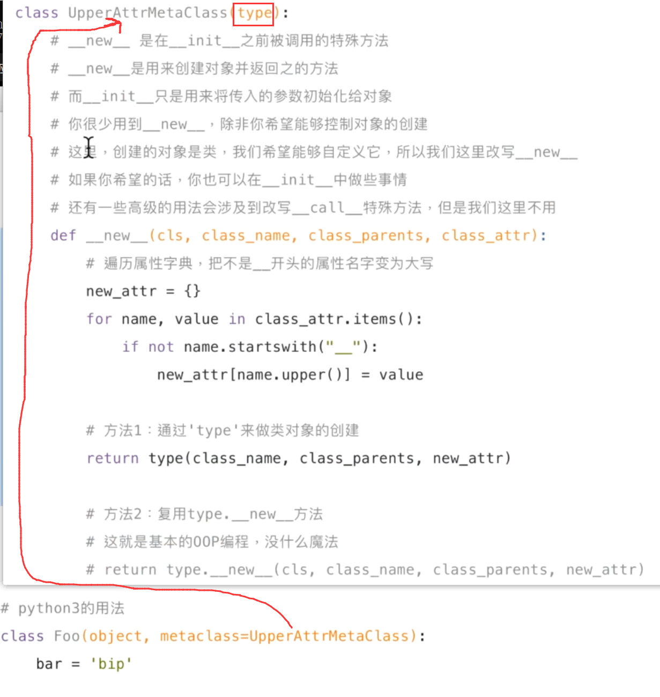
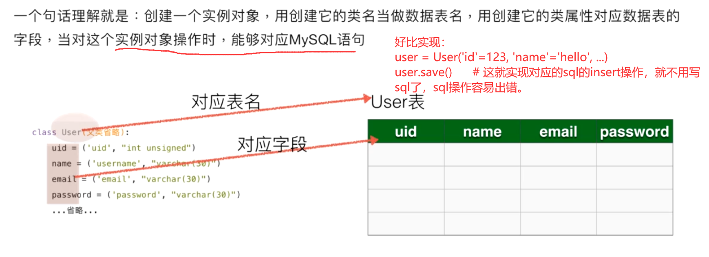

- 以后可以在ipython中使用==help(map)==这样来查看帮助文档，非常直观，也叫python的[自省机制](https://www.cnblogs.com/wongbingming/p/13775370.html)。
- Python2中，类括号里没有Object就是经典类，有继承Object就是新式类；但是在Python3中要不要继承object都一样(因为是默认继承object)，属于新式类

## 01. 私有属性



名字重整：其实就是__name这样的名字解释器在前面加了\_类名，所以直接访问不到,如下：



## 02. GIL锁

​	Python是可以调用其它语言的，Python使用多线程，若是其中一个线程是调用的C\C++的函数(视频“02-GIL-2.flv”有说明)，它们是不受GIL锁的限制的，所以除了这个方法，去掉GIL锁限制的方法还有，不用Cpython解释器，用其它的解释器。

GIL锁与互斥锁的区别：

- GIL锁只能保证每次只能一个线程在执行，有可能一个线程做了一句，就切换到另外一个线程做(就可能逻辑顺序上有误)，只能保证调度上是一个线程在执行，但哪个执行就不确定了；
- 互斥锁则是在逻辑上更加完整，一定要某个线程先完成才会释放，就确保了逻辑上的准确性。



## 03. 深浅拷贝

​	C\C++中  一般的复制  a=b  是真的复制出一个叫b的空间，里面的额内容跟a是一样的

python中的复制，都是引用，a是一个列表，b=a，那么是b也指向了a（会发现id(a)和id(b)是一样的） ,所以b更改时，a也会更改

深拷贝：

```python
import copy
b = copy.deepcopy(a)  # 就是真正的复制了一份
```

一般的赋值都是浅拷贝，copy模块中也还有浅拷贝：（这个少用吧，尽量就用深拷贝或者直接复制）

```python
a, b = [11], [22]
c = [a, b]
e = copy.copy(c)
id(c) != id(e)      # 这俩是不等的
但是：
id(c[0]) == id(e[0])  # true
```

也就是说copy.copy()的浅拷贝是把这个对象完全拷贝一份，至于对象里面的东西是什么样就是什么样，原封不动

Python中，函数传递的时候都是引用，

```python
def app_nums(temp):
	temp_.append(123)
 
 nums = [11, 22]
 app_nums(nums)
 print(nums)  # 此时结果是 [11, 22， 123]
 
 # 要是想让其不改变列表，最好用：
 app_nums(copy.deepcopy(nums))
```


## 04. import全局变量使用

import 包的一个用法：

​	Python多个py文件是可以在运行时进行互相通信里的。最简单的例子，有a.py，里面有一个全局变量IF_GPU=True,这时候b.py是从a.py导入了这个全局变量的，它可以加一些条件后，将IF_GPU设置为False,同时有一个c.py也从a.py中导入了这个全局变量，它比b.py后调用全局变量IF_GPU，那么它得到的就是False。
简而言之，不同模块之间有联动时，且一个模块a里代码执行需要另一个模块b的结果，那就可以再设置一个全局变量，一旦b出来结果，就改变这个全局变量的值，然后a再去判断全局变量的状态，然后再执行。

一个注意点：

```python
from a import IF_GPU     # 假定IF_GPU在a模块中的值是True
def func1():
	IF_GPU = False       # 这是创建了一个名为IF_GPU的局部变量，从a导进来的全局变量IF_GPU还是True，要想改的是全局变量就需要在前面声明 global IF_GPU
	
	
# 假设是如下导包：
import a
def func2():
	a.IF_GPU = False      # 这就是改的a中的全局变量IF_GPU
```

### 包热加载 reload

​	一个使用场景就是，服务器运行起来了，不能轻易停下来，如果其中一个模块的代码进行了修改，在不停服务的情况下进行这个模块的热加载：

```python
from importlib import reload    # 基本即将弃用 from imp import reload
import my_new    # 这是我写的模块，里面有一个叫IF_GPU的全局变量
import time

print(my_new.IF_GPU)
time.sleep(10)
reload(my_new)      # 核心在这里，热加载
print(my_new.IF_GPU)
```

让这个运行起来，在sleep期间去修改my_new.py中IF_GPU的值，会发现两个print结果是不一样的。

- 第7行，用 import my_new 是不行的， 因为python为了避免重复加载，同名模块只有第一次会被加载，后面写多少次都没用；
- reload()中加载的模块(一定是一个模块名)，一定要确保事先已被加载过一次，可用print(help(reload))进行文档查看。

## 05. 多继承super|MRO

python中多继承，以及 MRO 顺序

主要是介绍一下 super的使用：

```python
class Parent(object):
    def __init__(self, name):
        print("parent的init开始调用")
        self.name = name
        print("parent的init调用结束")


class Son1(Parent):
    def __init__(self, name, age):
        print("son1的init开始调用")
        self.age = age
        Parent.__init__(self, name)
        print("Son1的init调用结束")


class Son2(Parent):
    def __init__(self, name, gender):
        print("son2的init开始调用")
        self.gender = gender
        Parent.__init__(self, name)
        print("Son2的init调用结束")


class Grandson(Son1, Son2):
    def __init__(self, name, age, gender):
        print("Grandson的init开始调用")
        Son1.__init__(self, name, age)
        Son2.__init__(self, name, gender)
        print("Grandson的init调用结束")
```

- 子类中调用父类的方法有三种：

  - 第一种：第12行：`Parent.__init__(self, name)`这个写法，就是直接写父类名称，调用==指定==父类的`___init__`方法，这种比较直观，但是用的不多，就是以为如上的==Grandson==的多继承，这会导致多次调用==Parent==中的方法，然而我们只想调用一次，如果是套接字这种，开销浪费就很大，c++中这种菱形继承的处理方式是虚继承；

  - 第二种：`super().__init__()`,大概示意是：（注意写法，里面也没self了）

    ```python
    class Parent(object):
         # 为避免多继承报错，使用不定长参数来接收参数
        def __init__(self, name, *args, **kwargs):
            print("parent的init开始调用")
            self.name = name
            print("parent的init调用结束")
    
    class Son1(Parent):
        def __init__(self, name, age, *args, **kwargs):
            print("son1的init开始调用")
            self.age = age
            super().__init__(name, *args, **kwargs)
            print("Son1的init调用结束")
    
    class Son2(Parent):
        # 为避免多继承报错，使用不定长参数来接收参数
        def __init__(self, name, gender, *args, **kwargs):
            print("son2的init开始调用")
            self.gender = gender
            super().__init__(name, *args, **kwargs)
            print("Son2的init调用结束")
    
    class Grandson(Son1, Son2):
        def __init__(self, name, age, gender):
            print("Grandson的init开始调用")
            super().__init__(name, age, gender)  # 只用一行就调用了全部父类方法
            print("Grandson的init调用结束")
    
    print(Grandson.__mro__)
    ```

    - 为避免多继承报错，上面的父类都使用不定长参数(\*args, **kwargs)来接收参数；
    - 第26行：super注意写法，没有self了，由于一行就调用了全部父类方法，这也是为何需要全部传参的一个原因；
      ==super是自动判断它调用哪个父类，由`MRO`的顺序决定==，`print(Grandson.__mro__)`就会看到，然后发现Parent类就只调用了一次（推荐这种嘛）
      MRO的决定顺序是由Python解释器中的`C3`算法决定的

  - 第三种，还是上面第26行：`super(Grandson, self).__init__(name, age, gender)`,这样写就跟上面26行就是一个意思了，26行那相当于默认是填的Grandson；
    但区别是，这里面还可以填别的，好比==super(Son2, self).\__init__(name, age, gender)==，那么这种就是会根据类Grandson的MRO表查询，从Son2开始，执行及其往后的类，前面的就会跳过。

## 06. \*args|\**kwargs

传递不定长参数的讲解：==*args==和==\**kwargs==
	简单来说就是，当传递参数时，超过给定参数时，单个的就以元祖的形式给到args，键值对的就给到kwargs

```python
def func(name, age, *args, **kwargs):
    print(name)  # "lisi"
    print(age)   # 13
    print(args)   # (14, 15, 16) 元祖
    print(kwargs)  # {'gender': 'male', 'addr': 'chengdu', 'arg3': 3, 'arg2': 'two'} 字典
    
info = {"arg3": 3, "arg2": "two", "arg1": 5}
func("lisi", 13, 14, 15, 16, gender="male", addr="chengdu", **info)  # 可以**info这样传参

a = (11, 22, 33)
print(*a)   # 这样解引用是可以
print(**info)  # 不能这样，会直接报错，虽然可以上面**info那样传参
```

## 07. @classmethod | @staticmethod

类方法(@classmethod)、静态方法(@staticmethod)、实例方法

```python
class Foo(object):
    country = "中国"  # 类属性
    def __init__(self, name):
        self.name = name  
    def ord_func(self):  # 实例方法至少有一个self参数
        print("实例方法")
    
    @classmethod
    def class_func(cls):  # 类方法至少一个cls参数
        print("类方法")
        
    @staticmethod
    def static_func():  # 静态方法，无默认参数
        print("静态方法")
```

解读：

- 类方法比较直接的就是能比较简单的修改类属性，而实例对象不是那么好修改类属性：

  ```python
  a = Foo("zhans")
  a.country = "daa"  # 这只是相当于给自己实例这个属性赋了一个值
  print(Foo.country)  # 结果还是中国（实例对象不好改类属性）
  # 但是可以下面这样改
  a.__class__.country = "改了吗？"
  print(Foo.country)  # 这样就改了，加 .__class__ 就是代表修改的类属性
  ```

- 总之：
  - 实例对象可以调用这三种方法，类对象只能调用类方法和静态方法；
  - 实例方法，系统会默认传给其一个实例对象self；类方法，系统默认会传给其一个类对象cls；唯独静态方法，什么都不传；
  - ==静态方法的理解：它其实是一种可以定义在class类外的方法，和类基本没啥关系，但定义在类外可能存在与其他类的静态方法同名，就还是定义在类内，以@staticmethod==。

## 08.property属性

property属性的两种方式：

1. 装饰器：在方法上应用@property装饰器
2. 类属性：在类中定义值为property对象的类属性

这3点是这两种方式都通用的：

- 获取属性的函数，一定要有返回值；
- 设置属性的函数，一定要定义形参，且不要有返回值，通过内部的self.属性="dada"去修改；
- 删除属性的函数，不一定必须得是删除函数，可以是其它的逻辑代码，这个也不要有返回值

==装饰器==：
	只有新式类有可以如下用property的三种形式：（注意这==3个函数名都是一样的==；且(2)(3)Python2的新式类也是没有的）

```python
class Image:  # python3这里加不加(Object)都是一样的，Python2却有很大的区别
    def __init__(self, width, height):
        self.res = width * height

    @property  # (1)获取属性
    def size(self):
        return self.res    # 这个也一定要有返回值

    @size.setter     # (2)设置属性，必须是上面的@property的 函数名.setter
    def size(self, value):  # 因为设置属性，一定要传参数
        self.res = value

    @size.deleter     # (3)删除属性，必须是上面的 函数名.deleter
    def size(self):    
        print("执行的这个函数")    # 这里面不一定放删除语句，可以是其它的逻辑语句
 	

img = Image(460, 480)
print(img.size)             # 自动执行 @property 修饰的 size 方法，获得返回值
img.size = 45678            # 自动执行 @size.setter 修饰的 size 方法，必须要传参
print(img.size)
del img.size                # 自动执行 @size.deleter 修饰的 size 方法
```

---

==类属性==：(Python2、2，经典类、新式类没有差别)
	有四个参数(可以址填前面一个或者两个，一般来说前面两个是有的，即获取属性，设置属性)（Django框架中就有使用这种方法，很有意思，视频".\就业班\04 Python高级语法v3.1\05-类对象和实例对象访问属性的区别和property属性\05-创建property属性的方式-类属性.flv"大概11分左右就有说明）

- 第一个参数是方法名：调用 对象.属性 时自动触发执行方法；    # 对象是值实例化对象
- 第二个参数是方法名：调用 对象.属性 = xxx 时自动触发执行方法；
- 第三个参数是方法名：调用 del 对象.属性 时自动触发执行方法；
- 第四个参数是字符串：调用 类名.属性.\__doc__，可直接print()打印，此参数是该属性的描述信息。

```python
class FOO:
    def get_bar(self):
        print("1.执行的这个get_bar")
        return "必须要有返回值"

    def set_bar(self, value):
        print("2.执行的这个set_bar")
        if isinstance(value, str):       # 用这种方法的意义：就可以在设置值时进行一些检查(这就是实际意义)
            print("执行了赋值操作")       # 用@装饰器的方式也一样
        else:
            print("输入有误，不是str，")

    def del_bar(self):
        print("3.deleter**********")

    # 这是类属性（四个参数不一定都要给，后面的课根据自己情况不要）
    BAR = property(get_bar, set_bar, del_bar, "4.放一些string的说明文档")  # 四个参数不是必须传满


foo = FOO()
# 以下是调用
print(foo.BAR)  # 这就自动调用类属性BAR中第一个参数，即get_bar,,不能是foo.get_bar
foo.BAR = "new_strings"  # 自动调用第二个参数
del foo.BAR  # 自动调用第三个参数
print(FOO.BAR.__doc__)  # 获取第四个参数中设置的值，注意因为是类属性，用类FOO去调用
```

## 09. 魔法方法

python的各种魔术方法看[这里](https://pycoders-weekly-chinese.readthedocs.io/en/latest/issue6/a-guide-to-pythons-magic-methods.html)。（页面最下面有一个表格）

魔法方法：

- \__init__    # 初始化方法

- \__del__     # 一般无需定义，垃圾回收时会自动回收

- \__call__    # 实例对象()   加()时自动调用

- \__dict__    # 后去类或对象中的所有属性： t.\_\_dict\_\_  T.\_\_dict__

- \__doc__     # 获取描述文档

- \__module__  # 表示当前操作的对象在哪个模块

- \__class__   # 表示当前操作的对象的类是什么（现在好像不是魔法方法了，定义里是property属性）

  ```python
  class T:
      """
      这是一个描述信息,一般用三引号
      """
      def __str__(self):
          return "hello world!"
      pass
  print(T.__doc__)     # 获取描述文档
  print(help(T))    # 还可以这样获取描述
  
  t = T()
  print(t.__class__)    # 表示当前操作的对象的类是什么，结果 <class '__main__.T'>
  print(t.__module__)   # 表示当前操作的对象在哪个模块，
  # - 当前模块的类，结果就是  __main__
  # - 当从其它模块导进来的类，输出就是其它模块的名字
  ```

-  \__str__    一个类中定义了此方法，那么在print(t)时，默认输出该方法的返回值
  接着上面的代码：还可以 print("还可以这样用：%s" % t)

- \_\_getitem\_\_、\_\_setitem_\_、\_\_delitem__   ==# 用于索引操作，如字典，分别表示获取，设置，删除数据==

  ```python
  class FOO:
      def __getitem__(self, key):
          print("__getitem__", key)
      def __setitem__(self, key, value):
          print("__setitem__", key, value)
      def __delitem__(self, key):
          print("__delitem__", key)
  
  obj = FOO()     # obj并不是一个字典，但它里面实现了这三个魔法方法，就可以像字典这样操作
  result = obj["k12"]
  obj["k13"] = "world！"     # 它会这样把对应的值传到相应位置
  del obj["k14"]
  ```

  ```
  # 下面这用于切片操作，如列表(这是Python2中的用法了，Python3中是把这整合到了上面的getitem三个中)
  " __getslice__  __setslice  __delslice__  "
  ```

## 10. 上下文管理器

定义：
	==任何实现了\__enter\_\_()和\_\_exit\_\_()方法的对象都可称之为上下文管理器==。上下文管理器可以使用with关键字，我们自己也可以实现一个上下文管理器，一般有如下两种形式：

==类==：（其实就是魔法方法）

- 类里一定要实现`__enter__`和`__exit__`两个方法；

- 用with打来类的实例化对象时，就会自动进到\__enter__()函数中；
- 最后无论则那样一定会进到\__exit__()函数中去调用关闭文件。

```python
class MyFile:
    def __init__(self, file_name, mode):
        self.name = file_name
        self.mode = mode

    def __enter__(self):  # 没有参数
        print("entering")
        self.fp = open(self.name, self.mode)  # 用self.fp是方便下面的函数直接调用
        "一些其它逻辑处理代码"
        return self.fp   # 相当于把一开始的结果存起来了，方便后面调close时使用

    # 无论哪种情况，异常与否，系统都会调用这个方法
    def __exit__(self, exc_type, exc_val, exc_tb): #这是系统默认的方式，系统会自己在发生异常时传进来，exc_type异常类型，exc_val异常的错误信息，异常的一个存放内存位置(应该是)
    def __exit__(self, *args):    # *args是我自己写的，并没用到,默认是有三个参数
        print("will exit")
        self.fp.close()

# 这里的fp就是 __enter__ 方法的返回值
with MyFile("README.txt", "w") as fp:
    fp.write("hello world!")

# 这样就不用显示地调用close方法了，有系统自动去调用，哪怕中间遇到异常，close也会调用
```

---

==方法==：Python还提供了一个==contextmanager==的装饰器

- 通过yield将函数分割成两部分，yield之前的语句在\__enter__()方法中执行；
- yield之后的语句在\__exit__()方法中执行；
- 紧跟在yield后面的值是函数的返回值。
- from contextlib import contextmanager

```python
from contextlib import contextmanager

@contextmanager
def my_open(path, mode):
    f = open(path, mode)
    yield f
    f.close()

# 调用：这样 my_open 函数也可以用with了
with my_open("README.txt", "r") as fp:
    data = fp.readlines()
    print(data)
```

## 11. _\_import__动态导包 | getattr

这个主要是在学习WSGI-mini-web框架时学到的，比如写了很多个web框架，然后用命令行传参数决定使用哪个web框架的话，那就没办法事先导入，如 from my_dynamic import application ,那么就可以使用这来动态导包：

1. 添加my_dynamicpy包所在的搜索路径：sys.path.append("./dynamic")
2. 导入这个包：frame = _\_import__(my_dynamic)      # 返回值标记这，导入这个模板
3. 拿到处理函数的引用：app = getattr(frame, application)   # 此时app就指向了 dynamic/my_dynamic中的application这个函数了（这就不用提前导包，就可以通过命令传参来指定）

Tips：可能单单这么看，不是很方便理解，如果后续要用到，可以去看（"就业班\06 mini-web框架v3.1\01-WSGI-mini-web框架\10-给程序传递参数、添加web服务器的配置文件、添加shell功能.flv"  这个视频中大概第18分钟左右的讲解）

更对类似 getattr  hasattr 属性的内容可以看[这里](https://www.cnblogs.com/wongbingming/p/13775370.html)。

## 12. \_\_init\_\_.py | \_\_all\_\_

`__init__.py`：当目录里有这个文件时，这个目录就成为包
	作用：import导入这个包时，它就会自动执行这个.py文件里的内容

例如当有如下路径时：

> user
> ├── _\_init__.py
> ├── fms
>     └── summ_key
>         └── document_type_handle.py  # 这是一个.py文件，里面有一个类叫做==Category== 
> 123.py    # 这个123.py跟目录 user 是平级的

要是123.py要用 Category 这个类，一般就是==from user.fms.summ_key.document_type_handle import Category==，就很长，那么：(以下两种方式都可以)

```python
"那么只要在 user 目录里的__init__.py里写上 
from user.fms.summ_key.document_type_handle import Category  # 注意也要完整
from .fms.summ_key.document_type_handle import Category   # fms前面的.就代表了user目录
```

那么 123.py中要再使用 Category 类就是：(也是两种方式)

- from user import Category
- import user
  user.Category   # 这样使用就可以了

---

关于`__all__`,它是与 from mypackage import * 这种语法相关联的，不建议使用，当作为了解放这里嘛。

有关`_all__`,`__init__.py`更多的使用可以看[这里](https://www.cnblogs.com/tp1226/p/8453854.html)。

## 13. 闭包、@装饰器(及路由)

==闭包==：

思考：函数、匿名函数、闭包、对象当做实参时，有什么区别？

1. 匿名函数通常很简单，方便，传递的是这个函数的引用，只有功能；
2. 普通函数能够完成较为复杂的功能，传递的是这个函数的引用，只有功能；
3. 闭包能够完成较为复杂的功能，相对对象来说占用空间较小，传递的是闭包中的函数以及数据，因此是功能+数据；
4. 对象能完成最为复杂的功能，Python3默认继承Object对象，会有很多魔法方法的继承，较简单功能用对象的话，占空间就很大，传递的是很多数据+很多功能，因此是功能+数据。

闭包的简单例子：求y=k*x+b的一次函数值

```Python
def line(k, b):
    def cal(x):
        res = k * x + b
        return res
    return cal
# 一条函数线
line1 = line(2, 3)
print(line1(1))    # 这个的使用就很像对象了，上面初始化，这里调用__call__()方法
print(line1(3))
# 另外一条函数线
line2 = line(5, 6)
print(line2(2))
print(line2(3))
```

解读：

- 这就是闭包，它有点类似于class，先使用line(k, b),返回cal函数的引用；
- 然后line1(x)的调用就是cal(x)的调用，它里面同时又用到了line函数中的变量 k、b,这就是闭包；
- 如果要在cal 函数中修改 k或者b，那就是用关键字，==nonlocal==（这个是Python2中没有的）。

---

==装饰器==：

代码要遵循==开放封闭==原则，即写好的代码尽量封闭，不要去改了，但是可以开放增加功能。

- 手动实现简单装饰器：即==装饰器原理==（重要）

  - ```python
    def set_func(a_func):
        print("开始装饰了-------")
        def call_func():
            print("这是权限验证1****")
            a_func()
            print("可以在不修改源函数的情况下，在其前面或者后面执行加东西，但不能中间加")
        return call_func
    
    @set_func  # 这行就等于下面原理里的：my_func = set_func(my_func)
    def my_func():
        print("这是最开始的功能函数")
    
    my_func()  # 调用
    """
    这是装饰器的原理： 
        res = set_func(my_func)  # 把set_func这个函数结果(一个函数对象)返回给 res
        res()    # 然后这个调用就会执行
        
        所以：
        # 因为python中同名会覆盖
        my_func = set_func(my_func)   # 括号里的 my_func 函数还是上面单独定义的my_func
        # 赋值后，这时 my_func 就是指向了 set_func 的返回值(也是一个函数引用)，且它把前面单独定义的my_func覆盖了
        my_func()  # 这个结果就不会是执行单独定义的my_func函数的结果，（而这也就是装饰器的实现原理）
    """
    ```

  - 特别注意：遇到装饰器，它就会开始执行，而并不是要等到调用时才执行：
    
    - 到第9行时，它就相当于执行了my_func = set_func(my_func)，那么第2行就会执行，即便没有第13行的调用。

- 不定长参数的函数装饰器：

  - ```python
    def set_func(a_func):
        def call_func(*args, **kwargs):   # 这里就固定写法吧，这样多少个参数都能处理
            print("加的权限验证代码！")
            a_func(*args, **kwargs)      # 下面这样原封不动的传进去（这其实就是拆包）
        return call_func
    
    @set_func  # 这行就等于下面原理里的：my_func = set_func(my_func)
    def my_func(num, *args, **kwargs):
        print("这是最开始的功能函数 %d" % num)
        print("有多的参数嘛：", args)
        print("多个字典参数：", kwargs)
    
    my_func(100)
    my_func(100, 20)
    my_func(100, 20, age=25)
    ```

- 有返回值的函数的装饰器：就借用上面这个代码

  - ```python
    def set_func(a_func):
        def call_func(*args, **kwargs):   
            print("加的权限验证代码！")
            # 这里加个return就好了，怕万一被装饰的函数有返回值，这就是是通用的了
            return a_func(*args, **kwargs)      # 直接加个return就好了
        return call_func
    ```

    解读：

    - 若 a_func 函数没有返回值，那这里返回的就是None,return None是没有问题的，没有返回值的其实也是默认return None
    - 若 a_func 函数有返回值，即下面的 my_func 函数有返回值，得到返回值后，直接return完全是ok的
    - 总之：通用的模板就是，加个return就好了

- 多个装饰器装饰一个函数：

  - ```Python
    def set_func(a_func):
        print("这是加权限的装饰器")   # （2）
        def call_func(*args, **kwargs): 
            print("加的权限验证代码！")  # （3）
            return a_func(*args, **kwargs)  
        return call_func
    
    def log_func(b_func):
        print("这是加日志的装饰器")    # （1）
        def call_log_func(*args, **kwargs):
            print("这是记录日志的代码")  # （4）
            return b_func(*args, **kwargs)
        return call_log_func
    
    @set_func
    @log_func
    def my_func(num, *args, **kwargs):
        print("这是最开始的功能函数 %d" % num)  # （5）
    
    my_func(123)
    ```

    Tips：注意这个执行的顺序啊，原理简单来说:

    - 15行装饰器遇到下一行还是装饰器就让它先动，16行@log_func它执行了 my_func = log_func(my_func)，然后15行的@set_func又再来执行 my_func = set_func(my_func) 
    - 所以下面第20行调用时，一层层展开，就先执行的set_func()中的代码(它是在外面，它包裹着log_func())。

  - 但是这个顺序啊，还是要注意：比如下面这个例子(这种还是用的少，知晓就好了)

    ```Python
    def set_h1(func):
        def local_get_str(*args, **kwargs):
            return "<h1>" + func(*args, **kwargs) + "</h1>"
        return local_get_str
    
    def set_p(func):
        def local_get_str(*args, **kwargs):
            return "<p>" + func(*args, **kwargs) + "</p>"
        return local_get_str
    
    
    @set_h1
    @set_p
    def get_str():
        return "hello world!"
    
    print(get_str())   # <h1><p>hello world!</p></h1>
    ```

    先执行的h1,但是第3行还要先去调用set_P()函数中的东西，所有p标签在里面，h1标签在外面，也确实是h1先执行的。
    
  - 装饰器也是可以直接当函数使用的，就上面@set_p的装饰器，可以当函数使用，直接写成 set_p(get_str)

---

==类做装饰器==：
	类也是可以做装饰器的，原理差不多一致：

```python
class MyDec(object):
    def __init__(self, func):
        self.func = func  # 传进来的是一个函数引用

    def __call__(self, *args, **kwargs):
        print("这是类做装饰器打印出来的")
        return self.func(*args, **kwargs)

@MyDec     # 它的原理其实也是 get_str = MyDec(get_str)
def get_str():
    return "hello world!"

print(get_str())  # 所以此时的 get_str 是一个实例对象，用()就会调用__call__魔法方法
```

Tips：
	第9行，既然MyDec是类名，那也是可以用调用静态方法的，如 @MyDec.静态方法  （只是写在这里，就不作深入的研究了。以后看到能理解为什么）

---

==装饰器里带参数==：（重要，后面做路由映射会大量用到）

```python
def set_level(level_num):
    print(789, level_num)

    def set_func(func):
        print(456)

        def call_func(*args, **kwargs):
            print(123)
            # 开始级别验证
            if level_num == 1:
                print("这是权限级别***1****")
            elif level_num == 2:
                print("这是权限级别***2****")
            else:
                print("没有权限")
            return func(*args, **kwargs)

        return call_func

    return set_func

# 这是装饰器里带了参数，
@set_level(2)
def my_func():
    print("这是写好的函数功能实现！")

# my_func()
```

原理解读：(这种去做路由是最好的)（先写简单装饰器，再加带参数的，一层层来写，别想着直接一次到位）
   - 在最开始的装饰器 set_func 的基础上，又加了一层 set_level，这层负责加参数；
   - 即便没有调用 my_func()， 导包都会自动运行 @set_level(2)， 
        - 就会立即执行 print(789, level_num) ，紧接着是执行 print(456)
        - 不会执行 print(123) ，要外部调用 my_func() 会执行内部
        - 注意：就是以上特性，使得装饰器去做路由是相当合适的。

示例：==装饰器做路由映射== 

- 一定注意：这个包一导入，带@route的行就会执行，就会把URL_FUNC_DICT这个字典的内容补充上

```python
import time
now_time = time.ctime()

# 创建一个字典用于存映射关系
URL_FUNC_DICT = dict()

"这个一导包进来，带@route的行就会执行"
def route(url):
    def set_func(func):
        URL_FUNC_DICT[url] = func  # 这里在@route时就会执行，上面装饰器带参数讲原理时讲过
		# 因为一开始字典里就拿到了 func的引用，其实这下面三行可以不要的，
        def call_func(*args, **kwargs):  
            return func(*args, **kwargs)  # 因为不会单独再去使用类似 register() 的单独调用，没有这三行，这样的单独调用就会报错
        return call_func

    return set_func


# 这里函数假设都是获取一些动态数据
@route("/register.py")
def register():
    return "hello world!  {}".format(now_time)


@route("/logging.py")
def logging():
    return "这是一个登录页面！ {}".format(now_time)


@route("/exiting.py")
def exiting():
    return "这是注销页面！ {}".format(now_time)


# application中不能再写那么多 if else，如果有很多函数，就会写很多，不好看
def application(env: dict, start_response):
    start_response("200 OK", [("Content-Type", "text/html;charset=utf-8")])

    file_name = env["file_name"]  # 基本为 /index.html、/logging.py这种
    # 假定以.py结尾的是访问动态资源，，若不想这样，就要有一个字典存起来对应关系，然后直接取
    if file_name.endswith(".py"):
        try:
            ret = URL_FUNC_DICT[file_name]  # 这里返回的就是对应的最开始的函数引用
            return ret()  # 这是调用函数     （注意这两行）
        except:
            return "这个页面找不到了！ 404 Not Found！"
    else:  # 否则就是访问静态资源
        try:
            # 一定注意，这里./static_sources这个相对路径是相对的server.py(因为是从server.py启动的)，而不是dynamic.py
            fp = open(r"./static_sources" + file_name, "r")
        except Exception:
            response_body = "这个页面找不到了！ 404 Not Found！"
        else:
            response_body = fp.read()
            fp.close()
        return response_body
```

---

在微软开源的visual-chatgpt这个项目里看到一个装饰器来做说明的用法，还不错：

- 就是给已有的函数增加了一些属性，一些描述，在不改变函数原有代码下，增加表述

```python
def prompts(name, description):
    def decorator(func):
        func.name = name
        func.description = description
        return func

    return decorator


@prompts(name="函数名啊，之类的", description="放一些此函数的描述之类的")
def show(path):
    img = cv2.imread(path)
    cv2.imshow("1", img)
    cv2.waitKey(0)

if __name__ == '__main__':
    # show("./123.jpg")
    print(show.name)  # 就可以把这个函数属性打印出来
```

## 14. logging日志模块

- 还有一个日志库，[loguru](https://github.com/Delgan/loguru)，看起来也挺不错的。看到一个[开源代码](https://github.com/ihmily/DouyinLiveRecorder/blob/main/logger.py)在使用，它直接用一行就完成了日志按天分割，也可以实现到指定大小就分割。

下面是Python官方推荐的使用方法：

| 任务场景                         | 最佳工具                                                     |
| -------------------------------- | ------------------------------------------------------------ |
| 普通情况下，在控制台显示输出     | `print()`                                                    |
| 报告正常程序操作过程中发生的事件 | `logging.info()`(或者更详细的`logging.debug()`)              |
| 发出有关特定事件的警告           | `warnings.warn()`或者`logging.warning`()                     |
| 报告错误                         | 弹出异常                                                     |
| 在不引发异常的情况下报告错误     | `logging.error()`, `logging.exception()`或者`logging.critical()` |

logging模块定义了下表所示的日志级别，按事件严重程度由低到高排列（注意是全部大写！因为它们是常量。）：

| 级别     | 级别数值 | 使用时机                                           |
| -------- | -------- | -------------------------------------------------- |
| DEBUG    | 10       | 详细信息，常用于调试。                             |
| INFO     | 20       | 程序正常运行过程中产生的一些信息。                 |
| WARNING  | 30       | 警告用户，虽然程序还在正常工作，但有可能发生错误。 |
| ERROR    | 40       | 由于更严重的问题，程序已不能执行一些功能了。       |
| CRITICAL | 50       | 严重错误，程序已不能继续运行。                     |

- 日志的变量数据：logging.warning('%s before you %s', 'Look', 'leap!')
  结果就是：WARNING:root:Look before you leap!

==(1)、直接输出到控制台==：

```python
import logging

logging.basicConfig(level=logging.INFO,
       format="%(asctime)s - %(filename)s:[line:%(lineno)d] - %(levelname)s: %(message)s")

logging.debug("这是 logging debug message")   # 这就不会被输出
logging.info("这是 logging info message")
logging.warning("这是 logging warning message")
logging.error("这是 logging error message")
logging.critical("这是 logging critical message")
```

解读：（重要）

- level：这个等级就代表了 logging.INFO及其以上的才会被记录；若不给这个，默认等级为 logging.WARNING

- format：这参数不是必须的，但是这样会更加直观，定位了时间，错误位置，错误内容设置。可再自定义格式。

  - 对于`%(levelname)s`这种东西，是logging模块内置的，更多的看最后的表；

  - `%(asctime)s`默认显示使用`ISO8601`格式,可以提供`datefmt`参数进行更深的自定义：

    ```python
    logging.basicConfig(format='%(asctime)s %(message)s', datefmt='%m/%d/%Y %I:%M:%S %p')
    logging.warning('is when this event was logged.')
    # 结果如下
    12/12/2010 11:46:36 AM is when this event was logged.
    ```

    `datefmt`参数的定制和time模块的`time.strftime()`一样！

==(2)、保存到日志文件==：

```python
logging.basicConfig(level=logging.WARNING,
                    filename="./log.txt",
                    filemode="w",       # 这个跟open的模式是一样的,it defaults to 'a'
        format="%(asctime)s - %(filename)s[line:%(lineno)d] - %(levelname)s: %(message)s")
```

注意：win上默认用的gbk，好像无法指定encoding编码方式

---

==(3)、既要把日志输出到控制台，也要写入到日志文件==：

```python
# 第一步：创建一个logger记录器
# logger = logging.getLogger("songhui")  # 可传一个str参数
logger = logging.getLogger()  # 不给，默认就是root，可在格式中用 %(name)s 获取
logger.setLevel(logging.INFO)  # 这是log等级总开关

# 第二步：创建一个handler，用于写入日志文件
logfile = "./log.txt"
fh = logging.FileHandler(logfile, mode="a", encoding="utf-8")  # 注意模式和编码格式
fh.setLevel(logging.DEBUG)     # 输出到file中的log等级开关

# 第三步：再创建一个handler，用于输出到控制台
ch = logging.StreamHandler()
ch.setLevel(logging.WARNING)   # 输出到console中的log等级开关

# 第四步：定义handler的输出格式
formatter = logging.Formatter("%(asctime)s - %(filename)s:[line:%(lineno)d] - %(levelname)s: %(message)s")   # 这里是可以指定 datefmt 参数的，设置时间的格式
fh.setFormatter(formatter)
ch.setFormatter(formatter)

# 第五步：将logger添加到handler里面
logger.addHandler(fh)     # 有add就有remove，logger.removeHandler(fh)就是把这踢出去
logger.addHandler(ch)

# 日志  （一定注意，这用的是上面创建的对象logger，而不是模块logging）
logger.debug("这是 logging debug message")
logger.info("这是 logging info message")
logger.warning("这是 logging warning message")
logger.error("这是 logging error message")
logger.critical("这是 logging critical message")
```

- 还可以通过添加Filter过滤器来完成比日志级别更负责的过滤，不会了，用得少，放这里吧。

- 再写一个通过外部传参来决定日志等级的，即：python 123.py ERROR  # 或者其它等级

  ```python
  import logging
  import sys
  
  level = sys.argv[1]  # 获得日志等级
  
  numeric_level = getattr(logging, level)
  logging.basicConfig(level=numeric_level)  # 这样就动态传参决定等级
  ```

注意点：（多文件的log日志）

- 从网页上看，设置好了格式，运行main.py，只要导入了其它模块，其它模块只要也是用自带的logging库，都是用的同一个设置，写入文件的话也是同一个。
- 所以啊还时建议写一个自己的log类，把系统log库的方法自己到类方法，其它文件导入这个自己的类，就比较统一了，然后也有迹可寻，不然写的模块多了，都是导入logging标准库，久了也不好找在哪个py文件设定的等级这些。

logging模块内置的keys：

| 属性        | 格式            | 描述                                                       |
| ----------- | --------------- | ---------------------------------------------------------- |
| asctime     | %(asctime)s     | 日志产生的时间，默认格式为`2003-07-08 16:49:45,896`        |
| created     | %(created)f     | time.time()生成的日志创建时间戳                            |
| filename    | %(filename)s    | 生成日志的程序名                                           |
| funcName    | %(funcName)s    | 调用日志的函数名                                           |
| levelname   | %(levelname)s   | 日志级别 ('DEBUG', 'INFO', 'WARNING', 'ERROR', 'CRITICAL') |
| levelno     | %(levelno)s     | 日志级别对应的数值                                         |
| lineno      | %(lineno)d      | 日志所针对的代码行号（如果可用的话）                       |
| module      | %(module)s      | 生成日志的模块名                                           |
| msecs       | %(msecs)d       | 日志生成时间的毫秒部分                                     |
| message     | %(message)s     | 具体的日志信息                                             |
| name        | %(name)s        | 日志调用者                                                 |
| pathname    | %(pathname)s    | 生成日志的文件的完整路径                                   |
| process     | %(process)d     | 生成日志的进程ID（如果可用）                               |
| processName | %(processName)s | 进程名（如果可用）                                         |
| thread      | %(thread)d      | 生成日志的线程ID（如果可用）                               |
| threadName  | %(threadName)s  | 线程名（如果可用）                                         |

还有更多高级的用法，看[这里](https://www.liujiangblog.com/course/python/71)的后面。

---

使用：（相当重要）

一般来说，简单的话，就像上面那种配置了就行，一般大型项目还是配置成.yaml文件来加载：

==logging.conf.yaml==：

```yaml
version: 1
# (一)：这是设置格式，可以设置几种，不同的情况用不同的格式
formatters:
	# （1.1）可选的一种格式
    simple:
        format: " %(asctime)s - %(filename)s:[line:%(lineno)d] - %(levelname)s: %(message)s"
        datefmt: "%Y-%m-%d %H:%M:%S"
    # （1.2）可选的另一种格式
    upgrade:
        format: " %(name)s: %(asctime)s - %(filename)s:[line:%(lineno)d] - %(levelname)s: %(message)s"

# (二)：这是控制log日志打印到屏幕以及保存到磁盘文件（一样可以写不同场景的配置）
handlers:
    # （2.1）输出到控制台
    console:
        class: logging.StreamHandler   # 这就是代表输出到控制台
        level: WARNING
        formatter: upgrade           # 用的上面formatters中的哪种格式
        stream: ext://sys.stdout
    # （2.2）记录到文件
    all_file_handler:
        # 当日志文件的大小达到指定值的时候，RotatingFileHandler 会将日志文件重命名存档，然后打开一个新的日志文件
        class: logging.handlers.RotatingFileHandler
        level: DEBUG
        formatter: simple    # 一样选择上面一种格式
        filename: ./logs/all_log.log
        maxBytes: 10485760   # 10MB(单个文件)
        backupCount: 50      # 保留50个log文件
        encoding: utf8
    # （2.2）这也是记录到文件，代表不同的场景配置
    server_file_handler:
        class: logging.handlers.RotatingFileHandler
        level: INFO
        formatter: upgrade
        filename: ./loggs/server.log   # 若是给了文件路径，一定要提前建立好，不然会报错
        maxBytes: 10485760
        backupCount: 20
        encoding: utf8

# （三）这也是第三大点，二者选其中一个 my_logger = logging.getLogger()
root:
    level: DEBUG
    # 由这来决定输出控制台、保存文件(同时保存不同的格式)、都要
    handlers: [console, all_file_handler, server_file_handler]

# (三)：这是设置 my_logger = logging.getLogger("server")时传递的名字，
#loggers:
#	# （3.1）代表指定的name使用的配置
#    server:
#        level: DEBUG
#        handlers: [console, server_file_handler]   # 这就是既可以打印又会保存日志文件
#        propagate: True  # 设为false则禁止将日志消息传递给父级记录器的处理程序中
#	# （3.1）另一个人的配置
#    songhui:
#        level: INFO
#        handlers: [console, all_file_handler, server_file_handler]
#        propagate: True
```

Tips：（以上的注释都写很清楚了，这再来强调一下）

- ==配置中日志文件若给的是路径，则一定要把路径提前建立好，不然会直接报错==；

- 像root中总的权限应该是最低的，如DEBUG，然后再在具体handlers中，根据各个不同的需求，加进一步的设置更紧的权限，如WARNING；

- 第(二)大点handlers调用第(一)大点，并决定日志的保存方式；
- 第(三)大大点loggers(或者root)调用第(二)大点，决定程序中使用的方式；
- loggers: 以及 root: 的二选一：
  - 如果选择设置了上面的 loggers:，就不要再写下面的 root: 了，然后实例化的时候也一定要传 "server" 或 "songhui"(一定写配置文件中有的，别写错了),即==my_logger = logging.getLogger("server")==，不然就没设置的格式了；
  - 如果选择设置了 root:，就不要写上面的 loggers: 了，实例化的时候不要传参，默认root，即==my_logger = logging.getLogger()==；传参的话，问题也不大，就是把默认的root变成了传进来的参数而已，即只是 %(name)s 变化了；
  - 切记，不要 loggers: 和 root: 都写，如果都写了，logging.getLogger()不传参或者传的参写错了(配置文件中没有)就都是按root的来；如果传参写对了，如my_logger = logging.getLogger("server")，那么就比如 logger.info("sss")就会按照server配置执行两遍，就相当冗余了。
  - 那么总结一下：除非针对转门的配置，给它写logger，不然就还是默认只写root，这样传参不传参，以及传参正确与否都不重要，就是按照root的配置来。

==log.py==：加载配置文件使用

```python
import logging.config
import yaml

# 通过配置文件配置logging
with open("./logging.conf.yaml", encoding="utf-8") as fp:
    dic = yaml.load(fp, Loader=yaml.FullLoader)
logging.config.dictConfig(dic)

# 创建logger
logger = logging.getLogger()

# 会按.yaml配置来处理日志内容
logger.debug("这是 logging debug message")
logger.info("这是 logging info message")
logger.warning("这是 logging warning message")
logger.error("这是 logging error message")
logger.critical("这是 logging critical message")
```

Tsip：
	把以上封装成一个类，类也直接实例化，然后其它模块直接导包从log.py中导入实例对象logger，然后就直接调用logger的相关方法。

---

下面是我最简单的使用，并把日志设置成7天自动删除旧日志（最上面的==loguru==库实现起来更加简单）

```python
import logging

# 日志类
class Logging:
    def __init__(self, user):
        self.user = user
        # 这里看自己情况把日志放那里，这里是放在启动的py文件上一级下的 logs 文件夹中
        self.log_path = str(self._get_log_dir() / f"{user}.log")
        self.logger = logging.getLogger(user)
        self.logger.setLevel(logging.INFO)  # 这里是把级别设成了INFO,自己可以酌情或传参

    def _get_log_dir(self):
        current_path = Path.cwd()
        logs_dir = current_path.parent / "logs" / f"{self.user}"
        logs_dir.mkdir(parents=True, exist_ok=True)
        return logs_dir

    def __call__(self):
        # 创建一个 handler，用于写入日志文件 (保存7天)
        """
        	midnight:表示日志文件在每天半夜时分滚动,当时间到达午夜时分，当前的日志文件会被关闭，并创建一个新的日志文件。
        	interval: 间隔时间单位的个数，指等待多少个 when 的时间后 Logger 会自动重建新闻继续进行日志记录.
        	backupCount: 表示日志文件的保留个数，假如为7，则会保留最近的7个日志文件
        """
        file_handler = TimedRotatingFileHandler(self.log_path, when="midnight", interval=1, backupCount=7)
        file_handler.suffix = "%Y-%m-%d"  # 设置日志文件名的时间戳格式,这就是后缀，会跟在self.log_name后面
        # extMatch是编译好正则表达式，用于匹配日志文件名后缀
        # 需要注意的是suffix和extMatch一定要匹配的上，如果不匹配，过期日志不会被删除。
        file_handler.extMatch = re.compile(r"^\d{4}-\d{2}-\d{2}$")  # 所以删上面还可以设置其它后缀

        # 创建一个 handler，用于输出到控制台
        console_handler = logging.StreamHandler()
        console_handler.setLevel(logging.INFO)  # 设置 handler 级别为 INFO

        # 创建一个 formatter，用于设置日志格式（%H是代表24小时制，%I代表12小时制）
        formatter = logging.Formatter('%(asctime)s - %(levelname)s: %(message)s', datefmt="%Y.%m.%d %H:%M:%S")

        # 设置 handler 的格式
        file_handler.setFormatter(formatter)
        console_handler.setFormatter(formatter)

        # 为 logger 添加 handler
        self.logger.addHandler(file_handler)
        self.logger.addHandler(console_handler)

        return self.logger
if __name == '__main__':
    # 日志
    logger = Logging("V05")()   # 随便给一个名字都行
    # 后面就在需要的地方加日志就好
    displayValue = 3.14
    logger.info(f"扭矩扳手的读数：{displayValue}")  # 这既会在控制台输出，也会写到日志文件中
```

## 14. 元类

​	首先，类也是对象，在ipython中，可直接==globals()==，结果就是一个字典，里面包括了内建的模块以及自己定义的全局变量、函数、类等，那么==globals()["_\_builtin__"]==就是通过key得到这个内建模块,再就可以通过`.__dict__`来查看它的属性，即==globals()["_\_builtin\_\_"].\_\_dict__==就会再得到一个字典，里面就有各种内建函数，那么也可以通过字典key的方式来调用print，对应的value就是print的函数引用，那么==globals()["_\_builtin\_\_"].\_\_dict__["print"]\(123456)==就会打印123456出来。

元类 ---> 类 ---> 实例对象    # 这三个的创建关系,Test1是一个类，那么Test1._\_class__ 的结果就是 <class 'type'>

使用==type==创建类：
	type还可以动态创建类，type可以接受一个类的描述作为参数，然后返回一个类，即：
==type(类名，由父类名称组成的元组(针对继承的情况们可以为空)，包含类属性的字典)==，如下：

```python
class Test1:
    num1 = 100
    num2 = 200

Test2 = type("Test2", (), {"num1": 100, "num2": 200})  # 后面这就是一个元类，因为没有继承，第二个参数就是空元组
# 这里相当于是起了名 Test2 指向 第一个参数 "Test2"，当然可以不一样，那就没意义了啊，

aa = Test2()
print(aa.num1)   # 有类属性

# 元类的继承写法：
Test22 = type("Test22", (Test2, ), {})   # 属性可以是空字典
```

Tsip：

- 普通的类也是type创建的，第一行，Python解释器执行到这时，其实就是用 type("Test1", (), {"num1": 100, "num2": 200})去创建的这个类(好像要继承Object吧，python3好像不重要了)，返回值就是 Test1

还可以元类type创建时加上方法(这里把方法也看做一个类属性就好了)，提供提前定义函数的方式，如下：



​	元类的用法是，在创建类时不用默认的type，而是用我的方法来创建，就可以在不改类代码的前提下，对类属性进行修改，有些函数装饰器的意思，(在视频：".\就业班\06 mini-web框架v3.1\06-元类\03-通过type来创建复杂的类，元类应用demo.flv" 大概第19分钟的时候)，大概也是这，一个原理：


上面 upper_attr 函数中都还可以改，第二个父类继承参数，可以自己加一些类，就实现了批量修改类的目的，所以像是前面说的私有属性，名字重整(就是把私有属性名字改了)，就可以通过这种方式实现。可以上毕竟是一个函数实现，应当写一个类来代替这个函数，如下：


​	要用自己的元类实现，Python3就是如上，写类时加参数==metaclass=你的实现==，pyton2是在类里面加一行属性==_\_metaclass__=你的实现==

---

### ORM

定义：
	ORM是python编程语言后端web框架Django的核心思想，“Object Relational Mapping”，即对象-关系映射，简称ORM。



有些绕，大概了解吧，就不花时间了，它的实现在这里：（".\就业班\06 mini-web框架v3.1\07-orm\02-orm-实现.flv"）

## 15. 单元测试

1. 先写一个flask的服务
   server.py

   ```python
   from flask import Flask, request, jsonify
   
   app = Flask(__name__)
   
   @app.route("/login", methods=["POST"])  # 制宜设置了post才能访问
   def login():
       name = request.form.get("name")
       passwd = request.form.get("passwd")
   
       if not all([name, passwd]):
           data = dict(
               status=0,
               message="缺失登录的必要信息！"
           )
           return jsonify(data)
   
       if name != "sh" or passwd != "123456":
           data = dict(
               status=1,
               message="密码或用户名错误"
           )
       else:
           data = dict(
               status=2,
               message="登陆成功"
           )
       return jsonify(data)
   
   if __name__ == '__main__':
       app.run(debug=True)
   ```

2. 重点单元测试：
   study.py

   ```python
   import unittest
   import requests
   
   # 那这样的一个类就是测试案例
   class MyTestClass(unittest.TestCase):
       # 该方法会首先执行，相当于做测试前的准备工作
       def setUp(self) -> None:
           pass
   
       # 该方法会在测试代码执行完后执行（一般做测试完后新增数据的删除，如因为测试需要新增的测试数据库）
       def tearDown(self) -> None:
           pass
   
       # 测试代码，一定以 test_  开头，这些方法才会被测试
       def test_app_exists(self):
           # 模拟发送post请求
           data = requests.post("http://127.0.0.1:5000/login", 
                                data={"name": "sh", "passwd": 123456})
           res = data.json()
           # assert res.get("status") == 2, "登陆失败"
           # # 这其实就是对断言进行了一个封装
           self.assertEqual(res.get("status"), 2, msg="登陆失败")  
   
       def test_other(self):
           data = requests.post("http://127.0.0.1:5000/login", 
                                data={"name": "error_name", "passwd": 123456})
           res = data.json()
           self.assertIsNotNone(res.get("status"))
   
   if __name__ == '__main__':
       unittest.main()   # 注意这个启动方式
   ```

Tips：（重点是后面这个文件）

- self.assertEqual、self.assertIsNotNone这些是unittest.TestCase类中的方法(用法跟assert基本一样)，还有一些其它的，后面的 msg= 参数可以不给，相当于assert后面跟的断言失败后的提示信息;
- 把def setUp(self)方法当做init方法吧，把测试公用的一些对象，放这里来写一次就好了
- 启动是写的 unittest.main()
- 一般要尽可能把所有情况要考虑到，我们要做的就是发post请求时，传的数据多了、少了、没有等各种情况。

