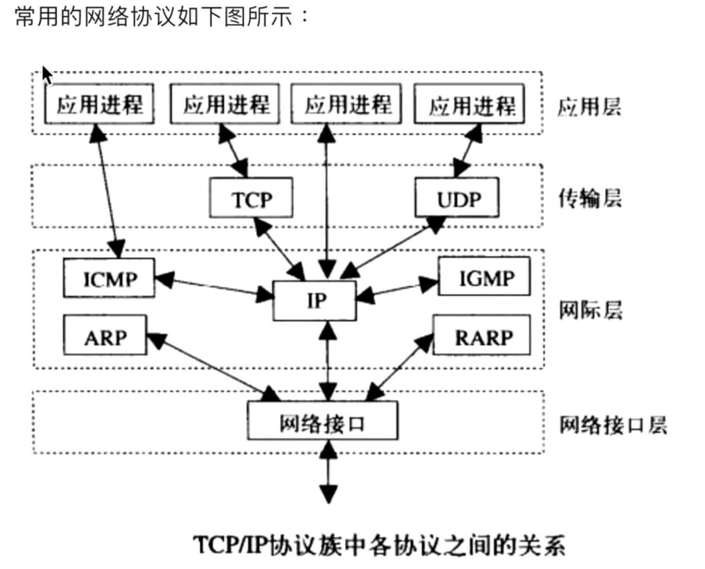
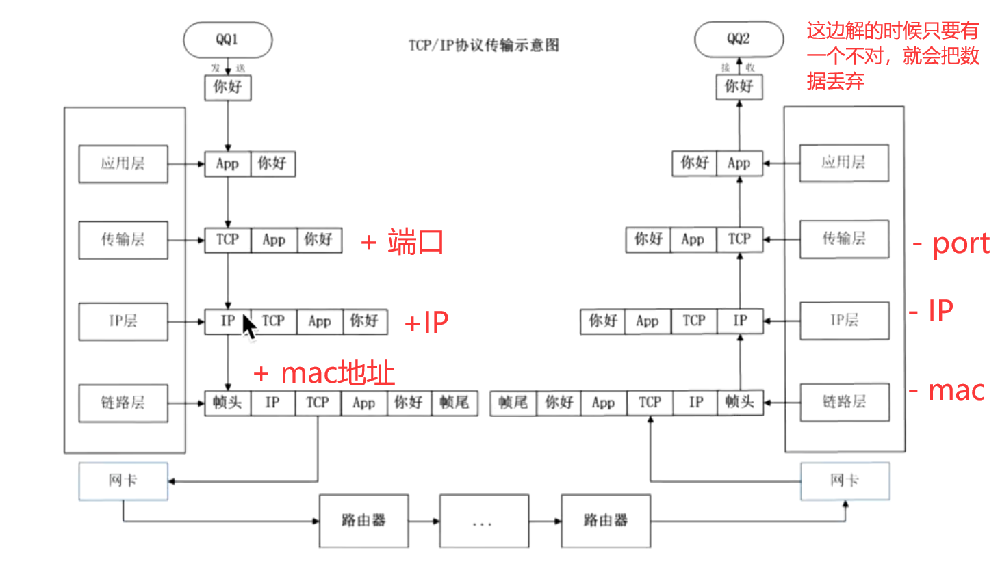
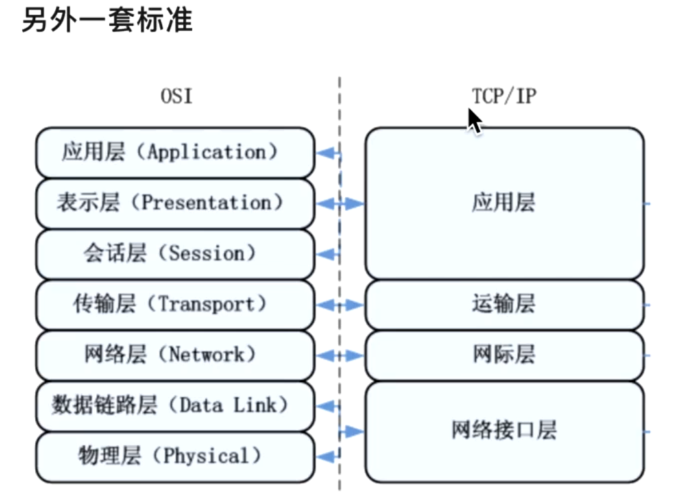
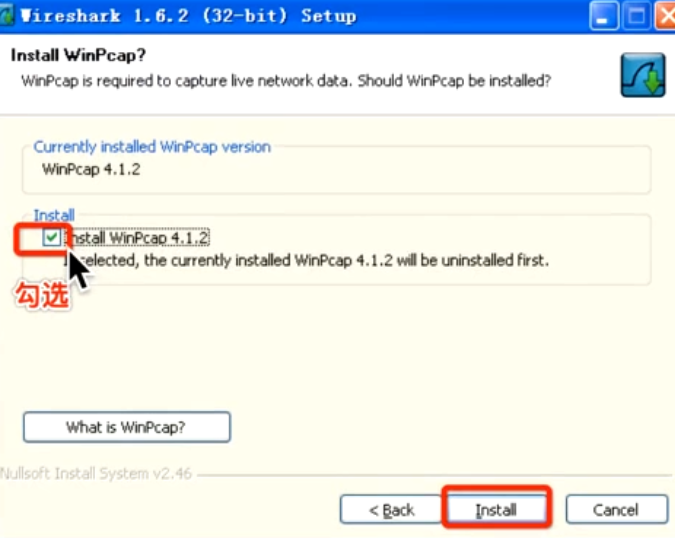
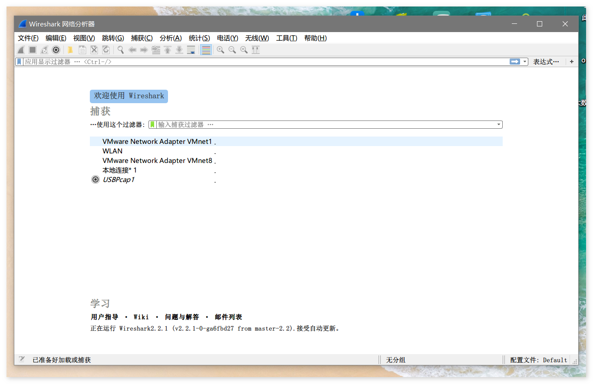
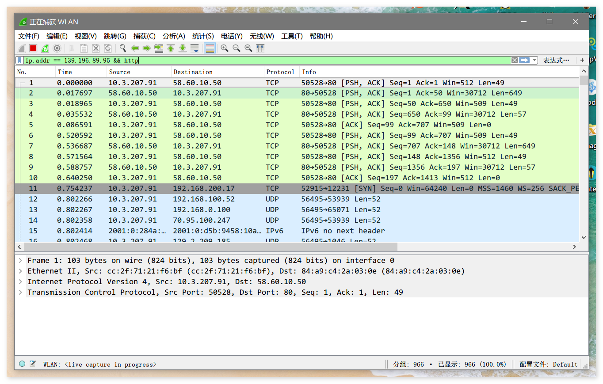
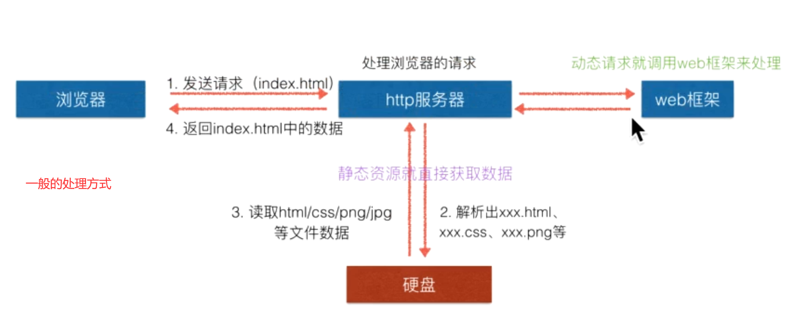
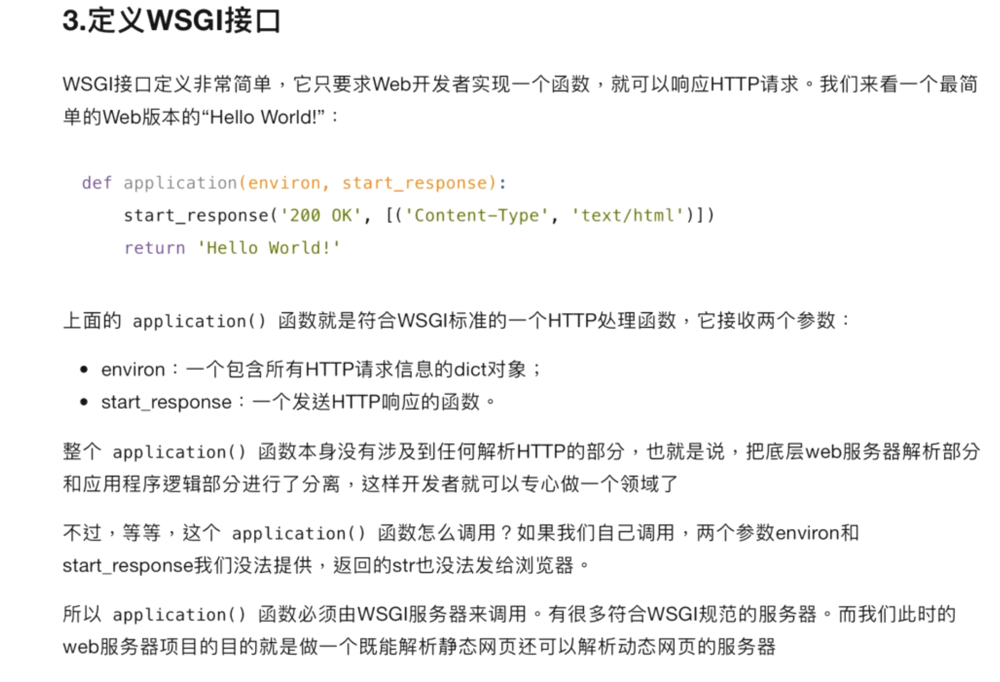

2开头，200：请求成功

3开头，302：重定向，比如京东以前的域名是 360buy.com ，求请它就会重定向到 jd.com   # 以前可以

4开头，如404：资源不存在

5开头：服务器挂了

还有个c10k问题

## 一、请求|响应格式介绍

### 1.1. Request Header

==浏览器---->服务器==发送的请求格式如下(省略了一部分)：

- > GET / HTTP/1.1          
  > Host: www.baidu.com
  > Connection: keep-alive
  > Cache-Control: max-age=0
  > sec-ch-ua: "Google Chrome";v="95", "Chromium";v="95", ";Not A Brand";v="99"
  > sec-ch-ua-mobile: ?0
  > sec-ch-ua-platform: "Windows"
  > Upgrade-Insecure-Requests: 1
  > User-Agent: Mozilla/5.0 (Windows NT 10.0; Win64; x64) AppleWebKit/537.36 (KHTML, like Gecko) Chrome/95.0.4638.54 Safari/537.36
  > Accept: text/html,application/xhtml+xml,application/xml;q=0.9,image/avif,image/webp,image/apng,*/*;q=0.8,application/signed-exchange;v=b3;q=0.9
  > Sec-Fetch-Site: same-origin
  > Sec-Fetch-Mode: navigate
  > Sec-Fetch-User: ?1

  Tips：其它的不很重要，==一定要有第一行==，分别代表：

  - 用的GET方法，当然还有其他方法；
  - /  就相当于是请求的根目录，就一般是主页吧（请求只写了ip:端口，那就是/了，当然面可以跟一个具体的页面地址，那这里就不是/了）；
  - HTTP/1.1   用的是1.1版本的协议（http都是用的tcp协议）。

### 1.2. Reponse Header

==服务器---->浏览器==会送的数据(省略了一部分)：

- > HTTP/1.1 200 OK
  > Bdpagetype: 2
  > Bdqid: 0xfc1dc9890000b6ee
  > Cache-Control: private
  > Connection: keep-alive
  > Content-Encoding: gzip
  > Content-Type: text/html;charset=utf-8
  > Date: Wed, 23 Mar 2022 12:53:51 GMT
  > Expires: Wed, 23 Mar 2022 12:53:51 GMT
  > Server: BWS/1.1
  > Set-Cookie: BDSVRTM=359; path=/
  > Set-Cookie: BD_HOME=1; path=/
  > Set-Cookie: H_PS_PSSID=35106_31660_36005_36086_34584_36140_36120_36032_35863_35318_26350_36115_36102; path=/; domain=.baidu.com
  > Strict-Transport-Security: max-age=172800
  > Traceid: 1648040031033917799418166898062130198254
  > X-Frame-Options: sameorigin
  > X-Ua-Compatible: IE=Edge,chrome=1
  > Transfer-Encoding: chunked
  >
  > 
  >
  > \<h1>==这是发送的数据==</h1>   # ==与上面一定要空一行，且空的行是用的\r\n==

  Tips：

  - ==第一行数据一定要有==，其它的就不是很重要了；
  - 下面会送的是一个正确的页面内容，那浏览器看到的就是那个内容，注意空一行；
  - 同理，如果请求是POST,有提交数据给服务器，那提交的内容算是body，也要与上面的head空一行。

### 1.3. 一个post请求

```python
import requests
import json
import time


def get_time_stamp():
    ct = time.time()
    local_time = time.localtime(ct)
    data_head = time.strftime("%Y%m%d%H%M%S", local_time)
    data_secs = (ct - int(ct)) * 1000
    time_stamp = "%s%03d" % (data_head, data_secs)
    return time_stamp


if __name__ == '__main__':
    now_time = get_time_stamp()
    cam_id = 1
    tou_id = 55
    tool_num = []
    event = 1  # 就是代表正确
    event_value = ''  # 一样保持报文一致

    req_json = {
        "timestamp": now_time,
        "deviceCode": cam_id,
        "inductionPointCode": tou_id,
        "toolCode": tool_num,
        "eventCode": event,
        "value": event_value
    }
    # 这header好像是必须的，不然会报400错误，因为发送的json数据，要指定，可以去参考postman发送的header
    headers = {
        'Accept': 'application/json',
        'Content-Type': 'application/json',
    }
    print('D23_6: ', req_json)
    while True:
        try:
            result = requests.post("http://192.168.108.52:8089/training/ai/recognition", headers=headers,
                                   data=json.dumps(req_json))
            print(result.status_code, result.text)
            time.sleep(0.5)

        except Exception as e:
            print(e)
            raise
```

## 二、TCP/IP

原理介绍：

​	==TCP/IP的链接建立==：详解在这里==就业班/03web服务器v3.1/03-简单web服务器实现/02-tcp3次握手、4次挥手.flv==，讲的很通俗易懂，记得回顾。

​	然后因为TCP/IP的原理，先提出断开链接的哪一方，到最后都会再等待一会；一般服务器是不会主动断开的，若如果服务器主动断开后，再立马重启，可能就会出现error，说==Address already in use==，那就是因为我们服务器是绑定了固定端口的，服务器主动断开后，还要等待一会，这时立马重启，就会出现这样，等一会再起就好了，（这一部分，还是在上面那个视频里，时间大概为28:36）
​	要让其立马可以使用，加一句`tcp_server_socket.setsockopt(socket.SOL_SOCKET, socket.SO_REUSEADDR, 1)`，在下面代码第39行里也有。


一个小知识：
	单进程、单线程阻塞的socket服务器，也能同时几个client客户端去连接它，并给它发消息，但如果前一个先连接的客户端还没断开，后面连接的客户端发的消息都是在服务器的一个数据缓冲区，代码里是看不到的，然后前一个客户端一旦断开，后一个客户端先前分几次发送的消息会被服务器一次性收取(相当于直接从缓冲区读)。

### 2.1. html静态页面访问

下面是讲一个tcp的简单页面访问(在[github](https://github.com/nianjiuhuiyi/web)中的[server.py](https://github.com/nianjiuhuiyi/web/blob/master/01my_server/server.py))：

​	基本上来说，注释里写得很清楚了，不方便看的话，就复制到pycharm中读，都是注意点(着重点我都用序号标出来了)，特别是正则的匹配

```python
import socket
import re
def deal_socket(new_socket):
    # (1)response的数据，最开始一定要有 `HTTP/1.1 200 OK` 这段文本，然后要显示的数据与这一行一定空一行
    # (2)后面这个Content-Type: text/html;charset=utf-8算是固定的，告诉浏览器用utf-8解码，不然用gbk就会出现乱码
    response_head = "HTTP/1.1 200 OK\r\nContent-Type: text/html;charset=utf-8\r\n"  # 换行，为了兼容linux和windows
    response_head += "\r\n"  # (3)上面也讲了一定要与显示的内容空一行（下面再拼接的显示内容）

    receive_info = new_socket.recv(1024).decode("utf-8")  # (4)注意decode解码
    print(receive_info)  # (5)收到的请求信息，是一整个字符串，第一行一定是类似于  GET / HTTP/1.1
    print(">>>" * 20)
    # 下面使用正则将其解析出来
    receive_info = receive_info.splitlines()  # (6)注意直接按行切割了
    ret = re.match("[^/]+(/[^ ]*)", receive_info[0])  # (7)注意这个正则的写法
    html_name = ""
    if ret:
        html_name = ret.group(1)  # 这就是上面正则小括号括()起来的号
        if html_name == "/":  # 针对只输入了 127.0.0.1:8080 后面没跟具体地址
            html_name += "index.html"  # 那就让其进入到导航首页

    try:
        fp = open(r"./qt_static_source" + html_name, "rb")  # (8)直接二进制打开，免得后面再编码
    except Exception:  # 出错一般就是没有这个页面，那就404
        response_body = "这个页面找不到了！ 404 Not Found！".encode("utf-8")
    else:  # (9)当try没有异常时会执行 else 块
        response_body = fp.read()  # 直接read()全部读取
        fp.close()
    # (10)可以分开发送的，并不是要一次性发完
    new_socket.send(response_head.encode("utf-8"))  # 这个信息还需要编码
    new_socket.send(response_body)  # 这个是二进制读取的，就不用encode了
    new_socket.close()  # (11)记得关闭socket


def my_server():
    tcp_server_socket = socket.socket(socket.AF_INET, socket.SOCK_STREAM)
    # 这一行一般不需要，这是设置当服务器先close，及服务器4次挥手之后资源能够立即释放，保证下次程序运行时可以立刻启动
    # tcp_server_socket.setsockopt(socket.SOL_SOCKET, socket.SO_REUSEADDR, 1)
    tcp_server_socket.bind(("", 8080))
    tcp_server_socket.listen(128)

    while True:
        a_client_socket, client_address = tcp_server_socket.accept()
        print("{}正在访问".format(client_address))
        # 把这个新产生的socket传到函数中去处理
        deal_socket(a_client_socket)


if __name__ == '__main__':
    my_server()
    """
    浏览器访问查看示例： 127.0.0.1:8080     127.0.0.1:8080/    http://127.0.0.1:8080/classes.html
    http://127.0.0.1:8080/licensing.html  等正确网页
    或这种不存在网页  http://127.0.0.1:8080/classes123456.html
    """
```

再讲一下第(7)点的正则提取：

- 目标字符大概是这样：==GET / HTTP/1.1==或==POST /A/hello.html HTTP/1.1==或其它的，我们要的是中间的网页地址，网页请求的第一行都是这样的；
- 这里写法：`[^/]+(/[^  ]*)`
  - `[^/]+`  是第一部分，表示至少一个不是==/==的字符串，那它就会匹配到第一个/前一个字符；
  - `(/[^  ]*)` 是第二部分，`/`表示就是匹配一个斜杠，紧接着`[^  ]*`匹配至少0个非空格字符，那么就会把路径匹配完，然后用小括号`( )`括起来，是分组，方便后面用.group(1)获取到这个值。

==最简单的Reponse Header==（看上面4~7行代码）:

- 一般head里一定要有第一行的==HTTP/1.1 200 OK\r\n==   # 后面的两个字符是为了换行
- 也建议发数据时的head带上这一行==Content-Type: text/html;charset=utf-8\r\n==    
- 单独加的==\r\n==，为了与后面的reponse body做区分
- 为了编码为了兼容，用的换行符号是 "\r\n"
- 注意上面第(11)点，加了就相当于是短连接了，调用了.close()，浏览器才知道数据发完了，不然就会一直转圈加载。

再说明一点：
	上面浏览器向服务器请求服务时，一般的GET请求，向服务器发送的就只有head部分，如果是POST请求，这种带数据的，也一定要==空一行==，这样就把head和POST提交的内容区分开了，那么就跟服务器向浏览器发内容是一样的意思了，内容body与head之间要空一行。（复习在视频\就业班\03 web服务器v3.1\04-并发web服务器实现\01-http协议复习.flv 的大概14:16位置）

### 2.2.多进程、多线程、协程

前面的deal_socket函数代码和前面都一样，主要就是while True中的代码部分

```python
import socket
import re
import multiprocessing
import threading
import gevent
from gevent import monkey
monkey.patch_all()      # 为了协程的使用

def deal_socket(new_socket):
    response_head = "HTTP/1.1 200 OK\r\nContent-Type: text/html;charset=utf-8\r\n"
    response_head += "\r\n"
    receive_info = new_socket.recv(1024).decode("utf-8")
    print(">>>" * 20)
    # 下面使用正则将其解析出来
    receive_info = receive_info.splitlines()
    print(receive_info[:3])
    ret = re.match("[^/]+(/[^ ]*)", receive_info[0])
    html_name = ""
    if ret:
        html_name = ret.group(1)
        if html_name == "/":
            html_name += "index.html"
    try:
        fp = open(r"./qt_static_source" + html_name, "rb")
    except Exception:
        response_body = "这个页面找不到了！ 404 Not Found！".encode("utf-8")
    else:
        response_body = fp.read()
        fp.close()
    new_socket.send(response_head.encode("utf-8"))
    new_socket.send(response_body)
    new_socket.close()

def my_server(port):
    tcp_server_socket = socket.socket(socket.AF_INET, socket.SOCK_STREAM)
    tcp_server_socket.setsockopt(socket.SOL_SOCKET, socket.SO_REUSEADDR, 1)
    tcp_server_socket.bind(("", port))
    tcp_server_socket.listen(128)
    while True:
        a_client_socket, client_address = tcp_server_socket.accept()
        print("{}正在访问".format(client_address))

        # 开始使用多进程：
        # p = multiprocessing.Process(target=deal_socket, args=(a_client_socket, ))
        # p.start()
        # a_client_socket.close()   # 多进程要这句

        # 开始使用多线程：
        t = threading.Thread(target=deal_socket, args=(a_client_socket, ))
        t.start()
        # a_client_socket.close()  # 多线程一定不要这句
        
        # 开始使用协程：（这一句就够了）
        # gevent.spawn(deal_socket, a_client_socket)      # 不要.join()什么的了

if __name__ == '__main__':
    my_server(8899)
```

注意点：

- ```python
  p = multiprocessing.Process(target=deal_socket, args=(a_client_socket, ))
  ```

  这个的 target 和 args 一定都要写，不要省略

- 多进程：（fd：文件描述符）
      会复制整个资源，所以即便函数里已经调用==new_socket.close()==,关闭了创建的套接字，但是因为多进程的原因，这个new_socket相当于有两份，用linux理解，这个new_socket有两个硬链接，在函数里调用的一个关闭了，那硬链接还有一个，用更专业的话讲，new_socket就是一个fd(file description)(文件描述符)，子进程赋值的new_socket也指向的这个fd；
      所以还要在main()函数的while中再有一个new_socket.close()。不然就会看到网页虽然请求了，但左上角还一直在打转，就是因为这个new_socket还有一个没关闭，所以while中还要再来一次。
- 多线程：
      多线程是共享资源的，就一个new_socket，传到函数中还在使用，结果while中(第50行)直接.close()关闭了，那这个new_socket在函数中再做操作就会报错，英文就是Bad file Description，中文就是 在一个非套接字上尝试了一个操作 。
- 协程：
      直接一句，比较简单，注意传参数直接传进去就好了；可以发现使用协程，server打印出来的东西的顺序就不是那么固定规则了。

### 2.3. 单进程、单线程实现非堵塞并发

​	协程：理论上就是单进程里的单线程，在跑多个函数，然后以此实现单进程、单线程来服务多个套接字服务，然后就以此实现非堵塞并发。（以下的实现基本就是gevent协程的实现原理了）

以下就是单进程中单线程、非堵塞实现并发的原理：（代码里的注释相当详细了）

`tcp_server_socket.setblocking(False)`  这就是将套接字设为==非堵塞==

server（以下复习在"\就业班\03 web服务器v3.1\04-并发web服务器实现\05-（重要）单进程、线程、非堵塞实现并发的原理.flv"）

```python
import socket

"""
阻塞/同步：打一个电话一直到有人接为止
非阻塞：打一个电话没人接，每隔10分钟再打一次，知道有人接为止
异步：打一个电话没人接，转到语音邮箱留言（注册），然后等待对方回电（call back)
看起来异步是最高效，充分利用资源，可以想像整个系统能支持大规模并发。但问题是调试很麻烦，不知道什么时候call back。
"""


def no_block_server(port):
    tcp_server_socket = socket.socket(socket.AF_INET, socket.SOCK_STREAM)
    tcp_server_socket.bind(("", port))
    tcp_server_socket.listen(128)

    # 将套接字设为非堵塞
    tcp_server_socket.setblocking(False)

    # 用于保存连接上的客户端创建的新的socket
    wait_sockets = list()
    while True:  # 这个循环是保证有新的客户端可以链接进来
        try:  # 非堵塞的话，一定要try起来，不然没客户端连接，是没有返回值的，立马报错
            new_socket, new_socket_address = tcp_server_socket.accept()
        except:
            pass
        else:  # 有客户端连接了，就把它添加进列表
            new_socket.setblocking(False)  # 建议也设置上，因为上面的.setblocking(False)，测试不要这行，new_socket也成为了非堵塞，就有些疑惑
            wait_sockets.append((new_socket, new_socket_address))

        # 循环所有的链接上了的socket
        for a_wait_socket in wait_sockets:
            try:
                # 0是socket，1是其对应的地址
                receive_data = a_wait_socket[0].recv(1024).decode("utf-8")
            except:
                # 没有数据发过来时，因为非阻塞，就会报错，就会进到这个里面
                pass
            else:
                # 当没有发生异常，说明new_socket收到来自客户端的消息了,分两种情况：
                # - 字符串不为空，这就是收到的消息
                # - 如果字符串为空，就说明客户端的socket已经调用了 .close() 了，就可以退出了，服务器端的这个也可以调用.close()了
                if receive_data:
                    print("正在访问的是：{}".format(a_wait_socket[1]), receive_data)
                else:
                    # 代表收到空字符了，说明客户端断开连接了
                    a_wait_socket[0].close()   # 关闭连接
                    wait_sockets.remove(a_wait_socket)  # 从等待列表移出去


if __name__ == '__main__':
    no_block_server(8080)
```

client

```python
import socket


def client(server_ip, server_port):
    client_socket = socket.socket(socket.AF_INET, socket.SOCK_STREAM)
    client_socket.connect((server_ip, server_port))

    while True:
        send_data = input("请输入要发送的数据：")
        print(send_data)
        if send_data == "exit":
            break
        client_socket.send(send_data.encode("utf-8"))

        # while True:  # 这里当客户端不需要接受消息
        #     receive_data = client_socket.recv(1024).decode("utf-8")
        #     # print("接收到的数据是：{}".format(receive_data))
        #     print("1111", receive_data)
        #     if not receive_data:
        #         break
        print("*******"*10, "\n"*3)

    client_socket.close()


if __name__ == '__main__':
    client("127.0.0.1", 8080)
```

#### 阻塞函数说明

- 对于服务器端：
  	当创建了一个服务器端套接字tcp_server_socket，当它调用==.accept()==方法时，它就是在等待客户端的连接，此时它是堵塞的，当一个客户端连接后，它会创建一个新的套接字new_socket用来专门处理这个客户端，当new_socket调用==.recv()==方法时，它就是在等待客户端发送来的请求，此时它也是堵塞的。
  	注意，当服务器在new_socket.close()，刚刚那个客户端在没有重启的情况下再发数据请求，大概率会得到错误“[WinError 10053] 你的主机中的软件中止了一个已建立的连接”，因为服务器已经把这个套接字关了。

- 对于客户端：
  	当创建了一个客户端套接字client_socket，用它调用==.connect()==方法去连接服务器，此时它是堵塞的。然后当它调用.recv()方法来接收服务器发过来的消息，它也是堵塞的。

特别注意：==.recv()它收到消息有两种情况==：

- 字符串不为空，这就是收到的消息;
- 如果字符串为空，就说明客户端的socket已经调用了.close()方法了，就可以退出了，那么服务器端的这个对应服务的socket也可以调用.close()方法关闭套接字了。（上面server里面的代码有说明）

### 2.4. 长连接、短连接

==短连接==：
	请求一个数据，建立一个套接字连接，数据传输完了就关闭连接，要一个页面有多个数据(比如图片地址，就会为每个图片发起一个套接字请求)，就会很多次tcp的握手建立连接。（以前的==HTTP/1.0==就是用的短连接）

==长连接==：
	建立连接后，数据传输(这过程一直保持连接)，一个页面的多个数据都是用这个套接字传输，所有都完毕后再关闭这个套接字。（上面的==HTTP/1.1==就代表是用长连接了）
	（注意：以上代码，虽然写的都是用的是1.1版本，但是我们代码里都有一个强制的new_socket.close()，会将其关闭，其实就相当于是短连接了。）

以下实现一个非堵塞的单进程、单线程的==长连接==：

```python
import socket
import re
def deal_message(new_socket, receive_info):
    receive_info = receive_info.splitlines()
    print(receive_info[:3])
    print(">>>" * 20)
    ret = re.match("[^/]+(/[^ ]*)", receive_info[0])
    html_name = ""
    if ret:
        html_name = ret.group(1)
        if html_name == "/":
            html_name += "index.html"
    try:
        fp = open(r"./qt_static_source" + html_name, "rb")  # (8)直接二进制打开，免得后面再编码
    except:
        response_body = "这个页面找不到了！ 404 Not Found！".encode("utf-8")
    else:
        response_body = fp.read()  # 直接read()全部读取
        fp.close()

    response_head = "HTTP/1.1 200 OK\r\nContent-Type: text/html;charset=utf-8\r\n"
    # (3)(重点：)这一行就是告诉浏览器我们发的数据有多长，加之没有.close()的调用，不然就会一直在转圈加载
    response_head += "Content-Length: {}\r\n".format(len(response_body))  # 可以直接len()数据body的二进制形式
    response_head += "\r\n"  # 换行，为了兼容linux和windows

    new_socket.send(response_head.encode("utf-8"))  # 这个信息还需要编码
    new_socket.send(response_body)  # 这个是二进制读取的，就不用encode了

def my_server(port):
    tcp_server_socket = socket.socket(socket.AF_INET, socket.SOCK_STREAM)
    # 这一行一般不需要，这是设置当服务器先close，及服务器4次挥手之后资源能够立即释放，保证下次程序运行时可以立刻启动
    tcp_server_socket.setsockopt(socket.SOL_SOCKET, socket.SO_REUSEADDR, 1)
    # 设置为非堵塞的
    tcp_server_socket.setblocking(False)
    tcp_server_socket.bind(("", port))
    tcp_server_socket.listen(128)

    wait_sockets = list()
    while True:
        try:
            a_client_socket, client_address = tcp_server_socket.accept()
        except:
            pass
        else:
            a_client_socket.setblocking(False)
            wait_sockets.append((a_client_socket, client_address))

        for a_wait_socket in wait_sockets:
            try:
                receive_data = a_wait_socket[0].recv(1024).decode("utf-8")
            except:
                pass
            else:
                if receive_data:
                    # 这里就会发现有相同套接字的请求，验证了长连接
                    print("收到了{}的请求！".format(a_wait_socket[1]))
                    deal_message(a_wait_socket[0], receive_data)
                else:
                    a_wait_socket[0].close()
                    wait_sockets.remove(a_wait_socket)
if __name__ == '__main__':
    my_server(8080)
    """
    浏览器访问查看示例： 127.0.0.1:8080     127.0.0.1:8080/    http://127.0.0.1:8080/classes.html
    http://127.0.0.1:8080/licensing.html  等正确网页
    或这种不存在网页  http://127.0.0.1:8080/classes123456.html
    """
```

解析：

- 这与html静态页面访问差不多，就是在页面数据处理那有些不一样，需要直接把获取的数据传进函数；
- 重点第(3)点：在head中加上这行=="Content-Length: {}\r\n".format(len(response_body))==  
  - response_body是要发送的数据，它是二进制形式的，也是可以直接len()的；
  - 这行告诉了浏览器我们发的数据有多少，这样才知道自己把数据接收完了；不然因为是长连接，服务器的这个socket又没有调用.close(),浏览器就会一直在转圈加载,等待接收数据。

### 2.5. epoll模型

IO多路复用，就是我们说的select,poll,epoll，有些地方也称这种IO方式为event driven IO

select/epoll的好处在于单个process就可以同时处理多个网络连接的IO

它的基本原理就是select,poll,epoll，这个function会不断的轮询所负责的所有socket，当某个socket有数据到达，就通知用户进程。一篇讲解原理的[文章](https://blog.csdn.net/xiajun07061225/article/details/9250579)。

gevent的底层就应该是epoll

再详细说说epoll快的原理：

- 主要是把套接字的fd(文件描述符)放到一个程序与内核kernel共享的内存地址，这样就免去了套接字复制到内核中去一个时间，特别是量很大的时候，效率就会低下；
- 不再采用一直轮询要处理的套接字的方式，而是==事件通知==，谁收到了数据就“举手示意”，就去处理谁。

下面是epoll的一个代码实现：（注意这==只能在linux下使用==）（./就业班/03 web服务器v3.1/04-并发web服务器实现/10-（重要）epoll的原理过程讲解.flv，这个原理还是很重要的）

```python
import socket
import re
import select
def deal_message(new_socket, receive_info):
    receive_info = receive_info.splitlines()
    print(receive_info[:3])
    print(">>>" * 20)
    ret = re.match("[^/]+(/[^ ]*)", receive_info[0])
    html_name = ""
    if ret:
        html_name = ret.group(1)
        if html_name == "/":
            html_name += "index.html"
    try:
        fp = open(r"./qt_static_source" + html_name, "rb")
    except:
        response_body = "这个页面找不到了！ 404 Not Found！".encode("utf-8")
    else:
        response_body = fp.read()
        fp.close()

    response_head = "HTTP/1.1 200 OK\r\nContent-Type: text/html;charset=utf-8\r\n"
    # 因为head需要知道body的长度，所以就放下来了
    response_head += "Content-Length: {}\r\n".format(len(response_body))
    response_head += "\r\n"

    new_socket.send(response_head.encode("utf-8"))  
    new_socket.send(response_body)


def my_server(port):
    tcp_server_socket = socket.socket(socket.AF_INET, socket.SOCK_STREAM)
    # 这一行一般不需要，这是设置当服务器先close，及服务器4次挥手之后资源能够立即释放，保证下次程序运行时可以立刻启动
    tcp_server_socket.setsockopt(socket.SOL_SOCKET, socket.SO_REUSEADDR, 1)
    # 设置为非堵塞的
    tcp_server_socket.setblocking(False)
    tcp_server_socket.bind(("", port))
    tcp_server_socket.listen(128)

    # (1)创建一个epoll对象（注意导包：import select）
    epl = select.epoll()
    select.epoll()
    # (2)将监听套接字对应的fd注册到epoll中
    # - 参数一：tcp_server_socket.fileno()获取套接字fd
    # - 参数二：select.EPOLLIN代表监听的事件是"recv的消息收取"（对应的应该还是消息发送哦）
    epl.register(tcp_server_socket.fileno(), select.EPOLLIN)

    fd_sockets = dict()  # key为套接字的fd，value为套接字对象
    while True:
        # (3)这会将其设置默认堵塞，直到os系统检测到数据到来， 通过事件通知方式告诉程序，此时才会解堵塞(fd_event_list中有一个或以上的套接字准备好收发数据了)
        # 返回的是一个list，因为可能有几个套接字都有数据，格式大概如下：
        # [(fd, event), ]  # fd:套接字对应的文件描述符，event：这个文件描述符到底是什么事件，例如调用recv接收等
        fd_event_list = epl.poll()
        # (4)上面第一次解堵塞，一定是tcp_server_socket这个套接字可以收数据了，此时fd_event_list里面应该就只有这一个套接字(上面.register的)
        for fd, event in fd_event_list:
            # 确定是server的那个套接字，才能去.accept()
            if fd == tcp_server_socket.fileno():
                a_client_socket, client_address = tcp_server_socket.accept()
                # 把产生的新的socket也register也进epoll，以监测它的情况
                epl.register(a_client_socket.fileno(), select.EPOLLIN)
                # 把client的socket何其对应的fd存起来（特比注意这里是a_client_socket.fileno()，不是fd）
                fd_sockets[a_client_socket.fileno()] = a_client_socket
            # 其实else也是等同于  elif event == select.EPOLLIN:  这可定是成立的
            else:  # 后面列表里逐渐加了client的socket
                # 这个时候我需要拿到client的socket对象去recv消息，但是现在拿到的是这个对对象的fd(所以上面要先存字典)
                receive_data = fd_sockets[fd].recv(1024).decode("utf-8")
                if receive_data:  # 注意可能收到的消息为空，代表断开连接
                    deal_message(fd_sockets[fd], receive_data)
                else:
                    fd_sockets[fd].close()
                    epl.unregister(fd)     # 客户端关闭后，也要把它从epl中拿出来
                    del fd_sockets[fd]  # 用完就移除字典


if __name__ == '__main__':
    my_server(8080)
    """
    浏览器访问查看示例： 127.0.0.1:8080     127.0.0.1:8080/    http://127.0.0.1:8080/classes.html
    注意：这个只能在linux下运行
    """
```

## 三、网络通信过程

### 3.1. 标准协议的理论

互联网协议包含了上百种协议标准，但是最重要的两个协议是TCP和IP协议，所以互联网协议简称TCP/IP协议(族)：



说明：

- 网际层 也称为 网络层； 网络接口层 也称为 链路层；
- 上图中，IP是可以直接和应用进程接的，叫做原始套接字，wireshark抓包工具应该就是用的这个。

下图是tcp数据传输的一个过程：



下图是另外一种OSI标准(7层)，主要是用于理论的；现实中用的主要还是右边那四层：



### 3.2. wireshark抓包

wireshark的[官网地址](https://www.wireshark.org/#download)，直接就可以去下载使用。

​	就不展开讲了，用到的可能性不大，视频地址是(./就业班/03 web服务器v3.1/05-网络通信/03-wireshark抓包工具-使用.flv),可能以后用到的可能性不大，说下看视频时的注意点：

- 安装：基本都是下一步，就有一点，一定要勾选这，这是核心，不然就是一个空壳，没法用
  
- 使用时，Filter里可以加条件筛选，是可以有 and or == 这些条件的，如下简单例子：

 



#### tcpdump

这个是一个linux的抓包工具，在linux命令里搜索它的具体使用办法，了解到的是命令行操作。

### 3.3. 子网掩码说明

​	子网掩码用的是==按位与==操作，即==都为1时才为1；只有有一个0，那么就是0==。所以我们常用的掩码是255.255.255.0，前面三个255的二进制每位都是1，就能保证ip地址前三个是什么就是什么，做的是网段的划分(这句是我的理解)，后面的0的二进制就是0了，与ip地址按位与操作后就都是0了，为0就标识这这个是不同主机号的识别。（所以最后的0~255中，0和255都不能用）
​	做这些操作时，一般都是8位，二进制位数不够8位的，就在二进制数前面(也是左边补相应个0)（./就业班/03 web服务器v3.1/05-网络通信/04-2台电脑通信、网络掩码.flv 大概在7分时有讲解）

### 3.4. 交换机原理

集线器：是上一代产物了，因为它发数据全是广播，就造成了容易堵塞

交换机：比如192.168.1.2要发给192.168.1.5数据，那就要先在自身缓存中查找是否有.5的mac地址(需要mac地址才能发送)(打开cmd，输入`arp -a`可查看，arp也是一种协议)，如果没有就发一个广播信息，里面的目的mac地址就填==FF:FF:FF:FF:FF:FF==，这就是广播mac地址，所有人都会收到，其它地址收到这个发现不是找自己的，就丢弃了；.5收到一解析，发现是找自己的，就把自己的信息单播回去(收到的信息里就可以包含发送的mac地址)，

在视频（./就业班/03 web服务器v3.1/05-网络通信/05-集线器、交换器组网、arp获取mac地址等.flv）大概20分钟的地方

### 3.5. 网关|mac地址|DNS

- 一般来说，路由器都有两个以上网卡，好连接不同的局域网络，一个网卡上面有一个mac地址
- 网关：收到数据，把数据转发出去，就是网关；默认网关一般都会是路由器
- 通过路由器转发消息，期间mac地址一直在变，但是源ip地址和目标ip地址却是始终固定的
- dns服务器就是做域名解析的，一般域名服务器都是国家来掌控的

比较琐碎了大概知道这么个情况，在视频（./就业班/03 web服务器v3.1/05-网络通信/07-浏览器访问服务器的过程.flv）,需要的话，可以回顾。

## 四、WSGI-mini-web框架

一般来说一个简单的服务器框架如下图，其中：

- http服务器，一般就是nginx或者apach；
- web框架，对python来说，一般就是Djingo之类的。



定义WSGI接口，如下图：


注意点：

- envion：这是一个字典，传进来正则匹配到的路径等。
- start_response是传进来的一个函数对象，这里调用它不需要返回值，它只要参数，然后在原函数中进行self.属性的修改，这样class中都能获取到：
  - 第一个str参数：获取状态的，为了得到 HTTP/1.1 200 OK  
  - 第二个参数列表：其它的header，一列是一个元祖，[("Content-Type", "text/html;charset=utf-8")])，这就是为了得到 Content-Type: text/html;charset=utf-8  是以冒号作为分界的。
- 注意：==以上过了一段时间肯定记不住了，可去看web项目中的03服务器WSGI中的代码;或者("就业班\06 mini-web框架v3.1\01-WSGI-mini-web框架\08-web服务器通过字典将需要的参数传递给mini_frame框架.flv"中大概3分多钟的位置)==


示例：主要是静态资源展示，以及数据库资源查询展示，且有一些操作，路由等等，这里不完全，看github项目里[这个](https://github.com/nianjiuhuiyi/web/blob/master/03%E6%9C%8D%E5%8A%A1%E5%99%A8WSGI/server.py)，启动这个文件就好了，数据库的话还要相关资源配合，下面这是dynamic_decorator.py的代码，注意看里面==(n)==的注意易错点：

```python
import time
import pymysql
import re


now_time = time.ctime()

# 创建一个字典用于存映射关系
URL_FUNC_DICT = dict()


# 数据库链接单独写出来
def conncet_db():
    dbconnect = pymysql.connect(
            # host="192.168.2.125",
            host="192.168.125.135",
            port=3306,
            user="root",
            passwd="123456",  # (1):除了port，密码这些一定要str
            charset="utf8",
            database="my_areas"  # (2):注意这是表示用的哪一个库
        )
    return dbconnect


"这个一导包进来，带@route的行就会执行"
def route(url):
    def set_func(func):
        # (3):这里在@route时就会执行，装饰器带参数讲原理时讲过
        URL_FUNC_DICT[url] = func

        def call_func(*args, **kwargs):  # 因为一开始字典里就拿到了 func的引用，其实这下面三行可以不要的，
            return func(*args, **kwargs)  # 因为不会单独再去使用类似 register() 的单独调用，没有这三行，这样的单独调用就会报错

        return call_func

    return set_func


# 这里函数假设都是获取一些动态数据
@route("/register.py")
def register():
    return "hello world!  {}".format(now_time)


@route("/logging.py")
def logging():
    return "这是一个登录页面！ {}".format(now_time)


@route("/exiting.py")
def exiting():
    return "这是注销页面！ {}".format(now_time)


@route("/show.py")   # 用于展示画面
def show():
    """
    数据库数据查询的显示，更好的是把要查询的地方当参数传进来。
    :return:
    """
    try:  # 要检查连接容错
        dbconnect = conncet_db()
    except:
        return "<div>Error!!! 数据库连接失败，请检查密码是否正确，或数据库是否开启！</div>"

    cursor = dbconnect.cursor()
    query_sql = "select * from province;"  # 表示用的 province 这个表

    cursor.execute(query_sql)
    datas = cursor.fetchall()
    cursor.close()
    dbconnect.close()

    # 设置一个个人收藏的快速访问
    contents = "<div style='width:70px; height:25px; background:orange'><a href='collect.py'>个人收藏</a></div>"
    # 设置一个标头
    contents += """
        <tr>
            <th>district_id</th>
            <th>pid</th>
            <th>district</th>
            <th>level</th>
            <th>添加自选</th>
        </tr>
    """
    # (4):注意这里的 <a href='show/%s.py'> ，这里有个 %s 代表每个省份具体的数字   # 这每行的内容
    line = """  
        <tr>
            <td>%s</td>
            <td>%s</td>
            <td>%s</td>
            <td>%s</td>
            <td>
                <a href='show/%s.py'> 
                    <button style="width:70px;height:30px"><strong>收藏</strong></button>
                </a>
            </td>
        </tr>
    """
    for data in datas:
        contents += line % (data[0], data[1], data[2], data[3], data[0])

    # 使其成为比表格
    contents = "<table border='1' width='200' cellspacing='0' cellpadding='5' align='center'>" + contents + "<table/>"
    return contents


@route("/collect.py")  # 用于查看个人的收藏页面
def collect():
    try:  # 要检查连接容错
        dbconnect = conncet_db()
    except:
        return "<div>Error!!! 数据库连接失败，请检查密码是否正确，或数据库是否开启！</div>"

    cursor = dbconnect.cursor()
    query_sql = "select pid, district_id, district, level from collection;"  # 查询收藏的表

    cursor.execute(query_sql)
    datas = cursor.fetchall()
    cursor.close()
    dbconnect.close()

    contents = "<div style='width:70px; height:25px; background:orange'><a href='show.py'>展示页面</a></div>"
    # 设置一个标头
    contents += """
        <tr>
            <th>pid</th>
            <th>district_id</th>
            <th>district</th>
            <th>level</th>
            <th>备注</th>
            <th>添加自选</th>
        </tr>
    """

    # 如果没有收藏的数据，就直接返回
    if not datas:
        return contents

    line = """
        <tr>
            <td>%s</td>
            <td>%s</td>
            <td>%s</td>
            <td>%s</td>
            <td>我的</td>
            <td>
                <a href="collect/%s.py">
                    <button style="width:70px;height:30px"><strong>删除</strong></button>
                </a>
            </td>
        </tr>
    """
    for data in datas:
        contents += line % (data[0], data[1], data[2], data[3], data[1])

    # 使其成为比表格
    contents = "<table border='1' width='400' cellspacing='0' cellpadding='20' align='center'>" + contents + "<table/>"
    return contents


# (5):这种路由里，写的是一个正则表达式，就对应 /show/12.py  /show/15.py 这种只是后面参数不一样(点的按钮不一样)，处理逻辑都是一样的
# (6):注意点.前面的反斜杠，一定要，不然下面application函数中正则的影响很大
@route("/show/(\d+)\.py")  # 从展示的主页面收藏数据
def collect_add(ret):
    "ret是传进来的正则匹配结果(且一定是匹配到的，没配到的进不来)，ret.group(1)就是对应的各省份的district_id "
    district_id = ret.group(1)

    try:  # 要检查连接容错
        dbconnect = conncet_db()
    except:
        return "<div>Error!!! 数据库连接失败，请检查密码是否正确，或数据库是否开启！</div>"
    cursor = dbconnect.cursor()

    query_sql = "select * from province where district_id=%s;"
    # (7):注意写元祖进去，不要自己在上面.format()拼接，小心sql注入
    cursor.execute(query_sql, (district_id, ))
    query_data = cursor.fetchall()

    # 首先：判断这个收藏的id是否在数据库的范围内，若不在就没有数据，就是认为模拟的数据：
    if not query_data:
        results = "行行好，大哥手下留情，不要再攻击我们了..."
    else:
        # 其次：如果数据合法，还要判断是否已经收藏了
        # query_collect = "select district_id, district, level from collection where district_id=%s"
        query_collect = "select * from collection where district_id=%s"   # 这是个人收藏表
        cursor.execute(query_collect, (district_id,))
        query_data = cursor.fetchall()
        if query_data:
            results = "您已经收藏了，请勿重复收藏！！！"
        else:
            cursor.execute("select district_id, district, level from province where district_id=%s", (district_id, ))
            insert_data = cursor.fetchone()

            """
                注意这里这种自己拼接"insert into collection values(default, %s, '%s', %s);"的第二个%s，外面加了一对''，
            不加''就是 insert into collection values(default, 22, 山东省, 1);  # 山东省是字符串，这句是执行不了的，
            所以不要自己去拼接，像下面去自己执行
            """
            insert_sql = "insert into collection values(default, %s, %s, %s);"
            # cursor.execute(insert_sql, (insert_data[0], insert_data[1], insert_data[2]))  # 和下面是一样的
            cursor.execute(insert_sql, insert_data)
            dbconnect.commit()   # (6):一定是链接来commit
            results = "收藏成功！"

    cursor.close()
    dbconnect.close()
    results += "<div><a href='../show.py'><strong style='width:70px; height:25px'>返回展示页面</strong></a></div>"
    results += "<div><a href='../collect.py'><strong style='width:70px; height:25px'>返回收藏页面</strong></a></div>"
    return results


@route("/collect/(\d+)\.py")     # 从收藏中删除数据
def collect_del(ret):
    district_id = ret.group(1)

    try:  # 要检查连接容错
        dbconnect = conncet_db()
    except:
        return "<div>Error!!! 数据库连接失败，请检查密码是否正确，或数据库是否开启！</div>"
    cursor = dbconnect.cursor()

    query_sql = "select * from collection where district_id=%s;"
    cursor.execute(query_sql, (district_id, ))
    query_data = cursor.fetchall()

    if not query_data:
        results = "删除数据不存在，请手下留情..."
    else:
        del_sql = "delete from collection where district_id=%s;"
        cursor.execute(del_sql, (district_id, ))
        dbconnect.commit()
        results = "取消收藏成功！！！"
    cursor.close()
    dbconnect.close()

    # (8):注意：这里返回收藏页面，是以 :8899/collect.py 作为相对路径的，
    # - href=".." 就回到了 :8899/
    # - href="../collect.py"  就来到了 :8899/collect.py
    results += "<div><a href='../collect.py'><strong style='width:70px; height:25px'>返回收藏页面</strong></a></div>"
    results += "<div><a href='../show.py'><strong style='width:70px; height:25px'>返回展示页面</strong></a></div>"
    return results


# application中不能再写那么多 if else，如果有很多函数，就会写很多，不好看
def application(env: dict, start_response):
    start_response("200 OK", [("Content-Type", "text/html;charset=utf-8")])

    file_name = env["file_name"]
    # 假定以.py结尾的是访问动态资源，，若不想这样，就要有一个字典存起来对应关系，然后直接取
    if file_name.endswith(".py"):

        try:
            # (9)这是为了匹配,是@route("/show/(\d+)\.py")这个格式再把正则匹配的结果传家进去，否则是没有参数的
            # 这种一般传进来的是 /show/13.py  # 13其实就是某个省份的district_id
            match_out = re.match("/show/(\d+)\.py", file_name)
            if match_out:
                ret = URL_FUNC_DICT["/show/(\d+)\.py"]  # 这里返回的就是对应的函数引用(因为上限@路由关于这个的名字写死了的)
                return ret(match_out)
            # 这是为了匹配,是@route("/collect/(\d+)\.py"),做收藏的删除的（我这里就是直接写死了，没用去循环字典的方式了）
            match_out = re.match("/collect/(\d+)\.py", file_name)
            if match_out:
                ret = URL_FUNC_DICT["/collect/(\d+)\.py"]  # 这里返回的就是对应的函数引用(因为上限@路由关于这个的名字写死了的)
                return ret(match_out)

            # 如果都不是，那就是最简单的展示
            ret = URL_FUNC_DICT[file_name]  # 这里返回的就是对应的函数引用
            return ret()  # 这是调用函数
        except:
            return "这个页面找不到了！ 404 Not Found！"
    else:  # 否则就是访问静态资源
        try:
            # (10):一定注意，这里./static_sources这个相对路径是相对的server.py(因为是从server.py启动的)，而不是dynamic.py
            fp = open(r"./static_sources" + file_name, "r")
        except Exception:
            response_body = "这个页面找不到了！ 404 Not Found！"
        else:
            response_body = fp.read()
            fp.close()
        return response_body
```

### 路由器url编码

​	首先，一般要修改什么数据，就是会新开一个页面，然后里面写内容，再提交，比如说当前页面是127.0.0.1:8899/show.py，上面有一个文本框，输入内容提交后，假设内容是==haha==那就会拼接去访问服务器的 :8899/show/haha.py页面(后缀可能是不一样的)，这种比较简单的肯定都是ok的，但是，万一我输入的内容是==a/b/v.py==这种像是路径去拼接，或者一些特殊字符、汉字之类的，就会扰乱，所以浏览器会自动将这些类容编码;

​	那么这种的路由的写法就会是==@route(r"/show/(.*)\\.html")==,这样通过正则结果.group(1)会的这些乱码，就需要先将其解码，解码方式：data = urllib.parse.unquote(ret.group(1)),然后再存到数据库去；

Python的一个浏览器相关编解码：

```python
import urllib.parse     # 主意这个包

"编码：quote"
print(urllib.parse.quote("中国"))

"解码：unquote"
urllib.parse.unquote("%E4%B8%AD%E5%9B%BD")
print(urllib.parse.unquote("%20%20%20"))    # 这就是三个空格
```

​	浏览器还有一个注意点：html学习中也说过了，无论多少个空格，浏览器都只会保留一个空格，要想有多个空格，就需要用它的[实体转义](../../其它/HTML文档.md#HTML实体转义：)&nbsp，这代表一个空格,然后这多给几个。

以上出自视频：".\就业班\06 mini-web框架v3.1\05-mini-web框架添加正则和log日志功能\06-url编解码.flv"

### 关于<a\>中跳转路径写法

直接搜索 “作为相对路径的” 就会看到。