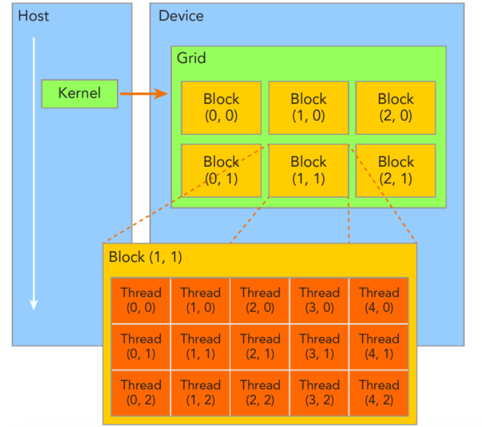
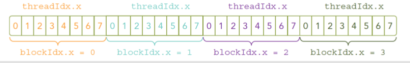
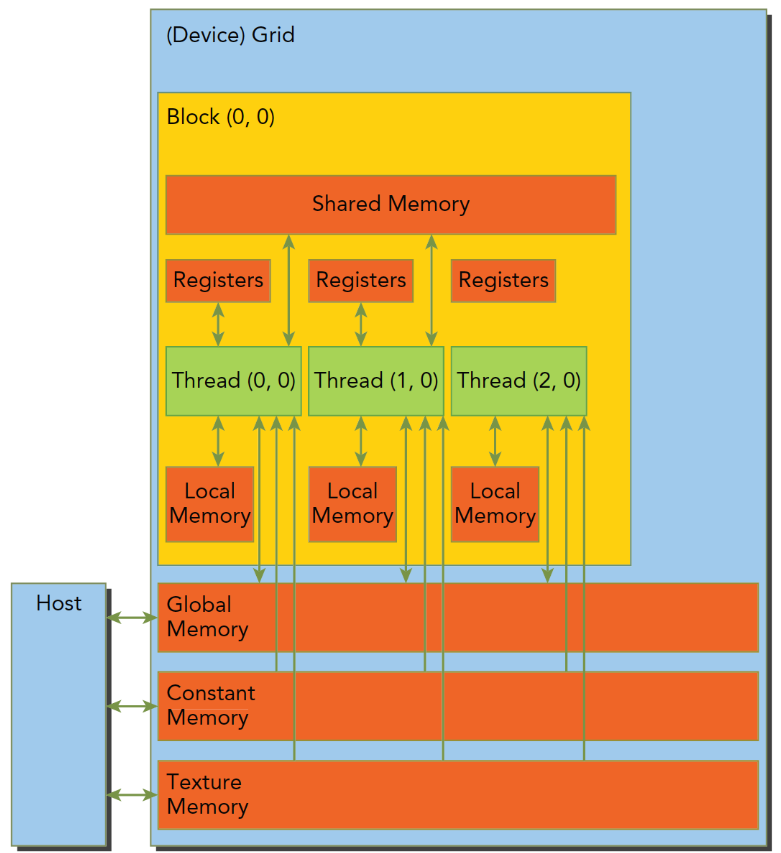

## 一、介绍

1. 试试这篇[文章](https://zhuanlan.zhihu.com/p/507678214)的代码，一个简单加法，再一起知乎这篇[理论](https://zhuanlan.zhihu.com/p/34587739)就先简答了解。
2. 接着可看看这个[博主](https://www.zhihu.com/column/c_1188568938097819648)的这6篇文章，通过一个矩阵加法的例子，一步步讲了CUDA优化的若干种方法（我只感受了第一种，后面的优化就没写了）。
3. 主要的系统学习就是谭升的[博客](https://face2ai.com/program-blog/)。
4. SM：Streaming Multiprocessor

进阶时用吧：

- [cuda-sample](https://github.com/NVIDIA/cuda-samples)：官方项目，用来介绍每一个特性的，比较多，一一看不现实，自己到时候酌情吧

  然后cuda 安装后，是自带了很多演示demo，它可能涉及得更广，每个都很强，可能都还会带有shader的编写。

- [thrust](https://github.com/NVIDIA/thrust)：英伟达开源的c++并行算法库，我看cuda的sample里有大量用到。
- 看要要结合 《Professional CUDA C Programming》这本书 来做，[这](https://zhuanlan.zhihu.com/p/53773183)有一个算是中文导读吧。

再再进阶：（开源项目代码）
   有很多的CUDA源码可以供我们慢慢学习，我这就简单给几个典型的Transformer系列的加速代码了。

- [LightSeq](https://github.com/bytedance/lightseq)：这是字节跳动开源的生成模型推理加速引擎，BERT、GPT、VAE等等全都支持，速度也是目前业界最快的之一。

- [FasterTransformer](https://github.com/NVIDIA/DeepLearningExamples/tree/master/FasterTransformer)：这是英伟达开源的Transformer推理加速引擎。

- [TurboTransformers](https://github.com/Tencent/TurboTransformers)：这是腾讯开源的Transformer推理加速引擎。

- [DeepSpeed](https://github.com/microsoft/DeepSpeed)：这是微软开源的深度学习分布式训练加速引擎。

> ❝ 我mentor说，不需要看这些，然后甩给了我20行代码，说看懂了就行了。结果我看懂了，门还是没开QAQ，所以建议还是看看底层一些的原理，加深自己的理解，特别是我强推的那篇博客。
> ❞

英伟达官方教程，全是英文的，且太冗长了，我只是入门了解的话就算了吧（以后吃这个饭，进阶再说）

- 英伟达官方的[CUDA编程教程](https://docs.nvidia.com/cuda/cuda-c-programming-guide/index.html)。
- [这](https://docs.nvidia.com/cuda/cuda-c-best-practices-guide/index.html)也是英伟达官方的CUDA编程教程，不过侧重点在实践方面，比如如何编程才能最大化利用GPU特性提升性能，建议基础打好之后再来看这个。

---

最后看看这篇关于自定义算子op的[教程](https://zhuanlan.zhihu.com/p/360441891)。

## 二、理论知识

### 2.1. 简单demo

​	host指代CPU及其内存，而用device指代GPU及其内存。CUDA程序中既包含host程序，又包含device程序，它们分别在CPU和GPU上运行。同时，host与device之间可以进行通信，这样它们之间可以进行数据拷贝。典型的CUDA程序的执行流程如下：

1. 分配host内存，并进行数据初始化；
2. 分配device内存，并从host将数据拷贝到device上；
3. 调用CUDA的核函数在device上完成指定的运算；
4. 将device上的运算结果拷贝到host上；
5. 释放device和host上分配的内存。

- `__global__`：在device上执行，从host中调用（一些特定的GPU也可以从device上调用），返回类型必须是`void`，不支持可变参数参数，不能成为类成员函数。注意用`__global__`定义的kernel是异步的，这意味着host不会等待kernel执行完就执行下一步。
- `__device__`：在device上执行，单仅可以从device中调用，不可以和`__global__`同时用。
- `__host__`：在host上执行，仅可以从host上调用，一般省略不写，不可以和`__global__`同时用，但可和`__device__`，此时函数会在device和host都编译。


一个很简单的.cu代码：main.cu   # 来源是这篇[文章](https://zhuanlan.zhihu.com/p/507678214)。

- 编译：==nvcc main.cu -o add_cuda== 
- 查看详细使用时间分析：==nvprof ./add_cuda== 

```c++
#include <iostream>
#include <cuda_runtime_api.h>

// Kernel function to add the elements of two arrays
// __global__ 变量声明符，作用是将add函数变成可以在GPU上运行的函数
// __global__ 函数被称为kernel，
// 在 GPU 上运行的代码通常称为设备代码（device code），而在 CPU 上运行的代码是主机代码（host code）。

__global__ 
void add(int n, float *x, float *y) {
    int index = blockIdx.x * blockDim.x + threadIdx.x;
    int stride = blockDim.x * gridDim.x;
    for (int i = index; i < n; i+=stride)    // 以上代码可以说固定了，出现次数多的话可以把它写成宏的形式，TensorRT.md中就是这么做的
    { 
         y[i] = x[i] + y[i];
    }
   
}

int main(void) {
    cudaSetDevice(1);  // 设置用哪张GPU
    int N = 1<<20;
    float *x, *y;

    // 内存分配，在GPU或者CPU上统一分配内存
    cudaMallocManaged(&x, N*sizeof(float));
    cudaMallocManaged(&y, N*sizeof(float));

    // initialize x and y arrays on the host
    for (int i = 0; i < N; i++) {
        x[i] = 1.0f;
        y[i] = 2.0f;
    }

    // Run kernel on 1M elements on the GPU
    int m_ThreadCount = 256;  // 这也是 单个blockSize的大小，CUDA GPU 使用大小为 32 的倍数的线程块运行内核，因此 `blockSize` 的大小应该设置为32的倍数，例如128、256、512等
    int numBlock = (N + m_ThreadCount - 1) / m_ThreadCount;  // 确定 `blockSize` 之后(也就是m_ThreadCount)，可以根据for循环的总个数`N`确定 `numBlock` 的大小；这样计算比直接N/m_ThreadCount更加保险，万一不能整除，c++的“/”会去掉小数。
    add<<<numBlock, m_ThreadCount>>>(N, x, y);

    // CPU需要等待cuda上的代码运行完毕，才能对数据进行读取
    cudaDeviceSynchronize();

    cudaFree(x);  // Free memory
    cudaFree(y);
  return 0;
}
```

注：使用cudaMallocManaged 来分配内存，这种内存在表面上看在设备和主机端都能访问，但是内部过程和我们前面手动copy过来copy过去是一样的(tensorrt中就是host复制到device，运算完后再device复制到host)，也就是memcopy是本质，而这个只是封装了一下。

---

开始系统，写一个hello_world.cu

```c++
#include <iostream>   // #include<stdio.h>也可以，设置不需要头文件
__global__ void hello_world()
{
  printf("GPU: Hello world!\n");
}
int main(int argc,char **argv) {
  hello_world<<<1,10>>>();  // 1,10是随意的，这里
  cudaDeviceReset();//if no this line ,it can not output hello world from gpu
  return 0;
}
```

​	注：cudaDeviceReset()没有则不能正常的运行，因为这句话包含了隐式同步，GPU和CPU执行程序是异步的，核函数调用后成立刻会到主机线程继续，而不管GPU端核函数是否执行完毕，所以上面的程序就是GPU刚开始执行，CPU已经退出程序了，所以我们要等GPU执行完了，再退出主机线程。

### 2.2. 内存申请|拷贝类型

内存管理：

| 标准C函数 | CUDA C 函数 |   说明   |
| :-------: | :---------: | :------: |
|  malloc   | cudaMalloc  | 内存分配 |
|  memcpy   | cudaMemcpy  | 内存复制 |
|  memset   | cudaMemset  | 内存设置 |
|   free    |  cudaFree   | 释放内存 |

最关键的一步，这一步要走总线：cudaError_t cudaMemcpy(void *dst, const void *src, size_t count, enum cudaMemcpyKind kind)，内存拷贝过程，完成以下集中过程(cudaMemcpyKind kind):

- cudaMemcpyHostToHost
- cudaMemcpyHostToDevice
- cudaMemcpyDeviceToHost
- cudaMemcpyDeviceToDevice

函数执行成功则会返回 cudaSuccess 这个枚举值，否则会返回 cudaErrorMemoryAllocation，使用这个指令可以把错误信息翻译成详细信息：char* cudaGetErrorString(cudaError_t error);

### 2.3. grid、block 

一个核函数只能有一个grid，一个grid可以有很多个块block，每个块可以有很多的线程，如图：          

每个线程都执行同样的一段串行代码，怎么让这段相同的代码对应不同的数据？那就是让这些线程彼此区分开，依靠下面两个内置结构体确定线程标号：

- blockIdx（线程块在线程网格grid内的位置索引）
- threadIdx（线程在线程块block内的位置索引）

两个内置结构体基于 uint3 定义，包含三个无符号整数的结构，通过三个字段来指定：

- blockIdx.x
- blockIdx.y
- blockIdx.z
- threadIdx.x
- threadIdx.y
- threadIdx.z

上面这两个是坐标，要有同样对应的两个结构体来保存其范围，也就是blockIdx中三个字段的范围threadIdx中三个字段的范围：

- blockDim
- gridDim

他们是dim3类型(基于uint3定义的数据结构)的变量，也包含三个属性x,y,z.

网格和块的维度一般是二维和三维的，也就是说一个网格通常被分成二维的块，而每个块常被分成三维的线程。

可以使用dim3类型的grid维度和block维度配置内核，也可以使用int类型的变量，或者常量直接初始化：

```
kernel_name<<<4,8>>>(argument list);
```

上面这条指令的线程布局是：

当主机启动了核函数，控制权马上回到主机，而不是主机等待设备完成核函数的运行，前面的cudaDeviceReset();就是为了等待，同样想要主机等待设备端执行可以用下面这个指令：

```
cudaError_t cudaDeviceSynchronize();
```

### 2.4. 错误检查宏

错误的处理：基本函数执行后都会返回一个cudaError_t的枚举值，在开发阶段要检查错误，可以定义一个宏，在release时可以不要：

```
#define CHECK(call)\
{\
  const cudaError_t error=call;\
  if(error!=cudaSuccess)\
  {\
      printf("ERROR: %s:%d,",__FILE__,__LINE__);\
      printf("code:%d,reason:%s\n",error,cudaGetErrorString(error));\
      exit(1);\
  }\
}
```

### 2.5. 打印硬件信息

```c++
#include <iostream>
#include <cuda_runtime.h>

void printGPUInfo(int deviceNum) {
    
    cudaSetDevice(deviceNum);   // 多gpu这里设置。

    cudaDeviceProp devProp;
    cudaError_t error = cudaGetDeviceProperties(&devProp, deviceNum);
    if (cudaSuccess != error) return;

    std::cout << "使用GPU device " << deviceNum << ": " << devProp.name << std::endl;
    std::cout << "SM的数量：" << devProp.multiProcessorCount << std::endl;
    std::cout << "每个线程块的共享内存大小：" << devProp.sharedMemPerBlock / 1024.0 << " KB" << std::endl;
    std::cout << "每个线程块的最大线程数：" << devProp.maxThreadsPerBlock << std::endl;
    std::cout << "每个SM的最大线程数：" << devProp.maxThreadsPerMultiProcessor << std::endl;
    std::cout << "每个SM的最大线程束数：" << devProp.maxThreadsPerMultiProcessor / 32 << std::endl;
}

int main() {
    printGPUInfo(1);
    return 0;
}
```

## 三、内存模型，流，事件

cuda内存模型、层次结构，文章[地址](https://face2ai.com/CUDA-F-4-1-%E5%86%85%E5%AD%98%E6%A8%A1%E5%9E%8B%E6%A6%82%E8%BF%B0/)。

CUDA内存模型相对于CPU来说那是相当丰富了，GPU上的内存设备有：

- 寄存器
- 共享内存
- 本地内存
- 常量内存
- 纹理内存
- 全局内存




为了避免寄存器溢出，可以在核函数的代码中配置额外的信息来辅助编译器优化，比如：

```
__global__ void
__lauch_bounds__(maxThreadaPerBlock,minBlocksPerMultiprocessor)
kernel_name(...) {
    /* kernel code */
}
```

在核函数定义前加了一个 关键字 **lauch_bounds**，然后他后面对应了两个变量：

1. maxThreadaPerBlock：线程块内包含的最大线程数，线程块由核函数来启动
2. minBlocksPerMultiprocessor：可选参数，每个SM中预期的最小的常驻内存块参数。
   注意，对于一定的核函数，优化的启动边界会因为不同的结构而不同
   也可以在编译选项中加入 ==-maxrregcount=32== 来控制一个编译单元里所有核函数使用的最大数量。

因为共享内存是块内线程可见的，所以就有竞争问题的存在，也可以通过共享内存进行通信，当然，为了避免内存竞争，可以使用同步语句：

```
void __syncthreads();
```

---

CUDA变量声明总结:

|   修饰符    |    变量名称    | 存储器 | 作用域 | 生命周期 |
| :---------: | :------------: | :----: | :----: | :------: |
|             |   float var    | 寄存器 |  线程  |   线程   |
|             | float var[100] |  本地  |  线程  |   线程   |
| \__share__  |   float var*   |  共享  |   块   |    块    |
| \__device__ |   float var*   |  全局  |  全局  | 应用程序 |
| \__constant |   float var*   |  常量  |  全局  | 应用程序 |

---

cuda流以及同步方式，还有事件，[地址](https://face2ai.com/CUDA-F-6-1-%E6%B5%81%E5%92%8C%E4%BA%8B%E4%BB%B6%E6%A6%82%E8%BF%B0/)。cudaError_t cudaEventCreate(cudaEvent_t* event);

​	CUDA编程和普通的C++不同的就是，我们有两个“可运算的设备”也就是CPU和GPU这两个东西，这种情况下，他们之间的同步并不是每一步指令都互相通信执行进度的，设备不知道主机在干啥，主机也不是完全知道设备在干啥。但是数据传输是同步的，也就是主机要等设备接收完数据才干别的，也就是说你爸给你寄了一袋大米，然后老人家啥也不做，拨通电话跟你保持通话不停的问你收到了么？直到你回答收到了，这就是同步的。内核启动就是异步的，你爸爸又要给你钱花，去银行给你汇了五百块钱，银行说第二天到账，他就可以回家该干嘛干嘛了，而不需要在银行等一晚，第二天你收到了，打个电话说一声就行了，这就是异步的。异步操作，可以重叠主机计算和设备计算。
前面用的cudaMemcpy就是个同步操作，我们还提到过隐式同步——从设备复制结果数据回主机，要等设备执行完。当然数据传输有异步版本：

```
cudaError_t cudaMemcpyAsync(void* dst, const void* src, size_t count,cudaMemcpyKind kind, cudaStream_t stream = 0);
```

​	值得注意的就是最后一个参数，stream表示流，一般情况设置为默认流，这个函数和主机是异步的，执行后控制权立刻归还主机，当然我们需要声明一个非空流：

声明：cudaStream_t a;

资源还是要用cudaStreamCreate分配的：cudaError_t cudaStreamCreate(cudaStream_t* pStream);

当然后面就要回收资源，回收方式：

```
cudaError_t cudaStreamDestroy(cudaStream_t stream);
```

​	这个回收函数很有意思，由于流和主机端是异步的，你在使用上面指令回收流的资源的时候，很有可能流还在执行，这时候，这条指令会正常执行，但是不会立刻停止流，而是等待流执行完成后，立刻回收该流中的资源。这样做是合理的也是安全的。
​	当然，我们可以查询流执行的怎么样了，下面两个函数就是帮我们查查我们的流到哪了：

```
cudaError_t cudaStreamSynchronize(cudaStream_t stream);
cudaError_t cudaStreamQuery(cudaStream_t stream);
```

​	这两条执行的行为非常不同，cudaStreamSynchronize会阻塞主机，直到流完成（tensorrt中的代码就是用的和这个）。cudaStreamQuery则是立即返回，如果查询的流执行完了，那么返回cudaSuccess否则返回cudaErrorNotReady。

---

记录事件和计算运行时间：一段简单的记录事件时间间隔的代码

```
// create two events
cudaEvent_t start, stop;
cudaEventCreate(&start);
cudaEventCreate(&stop);
// record start event on the default stream
cudaEventRecord(start);
// execute kernel
kernel<<<grid, block>>>(arguments);
// record stop event on the default stream
cudaEventRecord(stop);
// wait until the stop event completes
cudaEventSynchronize(stop);
// calculate the elapsed time between two events
float time;
cudaEventElapsedTime(&time, start, stop);
// clean up the two events
cudaEventDestroy(start);
cudaEventDestroy(stop);
```

这段代码显示，我们的事件被插入到空流中，设置两个事件作为标记，然后记录他们之间的时间间隔。
cudaEventRecord是异步的，所以间隔不准，这是特别要注意的。