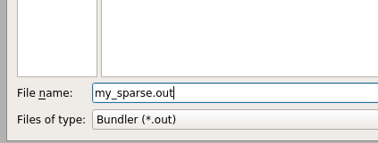

- colmap相关：
  - 数据格式读取的代码：这个[项目](https://github.com/Fyusion/LLFF)的“Using your own poses without running COLMAP”，去看这个标题里，然后点进去它的超链接，有关于colmap的bin格式数据的读取，后续要深入的话，可以参考。
  - colmap配置与使用-CSDN博客：[地址](https://blog.csdn.net/zhingzt/article/details/127960418)。
  - Colmap 实用教程：[地址](https://blog.csdn.net/a40850273/article/details/127982257)。 
- 后面看到的三维重建相关的：还没试过
  - [OpenSfM](https://github.com/mapillary/OpenSfM)。
  - [COLMAP_SLAM](https://github.com/3DOM-FBK/COLMAP_SLAM)。
- meshlab有时候编辑obj会闪退，可以先将其另存为ply格式的，再打开这ply格式的进行编辑，编辑好后再另存外obj格式的。
- gltf格式相关的项目：[地址1](https://github.com/microsoft/glTF-SDK)、[地址2](https://github.com/KhronosGroup/glTF)。

## 一、概述

重建基本流程：特征提取与匹配->稀疏重建->稠密重建->表面重建。

以下很多使用来自于B站[视频](https://www.bilibili.com/video/BV1F54y1T7m5?t=1.6)。（图有点问题，openMVS可以进行Dense cloud）


了解一下VisualSFM：

> 官网[地址](http://ccwu.me/vsfm/index.html)。github[地址](https://github.com/mrquincle/visualsfm)。可以直接下载它的bin运行，是带GUI的，
>
> “VisualSFM is free for personal, non-profit or academic use.”
>
> 它得到的数据格式就是 “.nvm” 的

---

英伟达开源的 instant-ngp 是基于nerf，它的一个数据预处理，也是用colmap实现的，主要就是用colmap的特征提取、特征匹配、去畸变，stereo(后面两个不确定有用到没)，

## 二、colmap+meshlab

​	主要还是参考B站这个[视频](https://www.bilibili.com/video/BV1F54y1T7m5?t=310.1)；纹理贴图(meshlab实现的)知乎这篇[文章](https://zhuanlan.zhihu.com/p/605108237)，里面还带有命令行，这文章对应的也有B站[视频](https://www.bilibili.com/video/BV1x64y1x7Kw?t=71.0)；这两篇meshlab的贴图放这里做个参考吧，后续看能不能用到，[1](https://blog.csdn.net/zhouii/article/details/129374990)、[2](https://zhuanlan.zhihu.com/p/84832004)。

​	即：稀疏重建、稠密重建是用的colmap；mesh时可用colmap或是meshlab(这次用的clomap)；最终的纹理贴图是用的meshlab。示例教程如下：

### 2.1 colmap安装

​	首先要搞定的是colmap的linux环境编译，一定要带cuda、gui的编译，不带gui会使OpenGL被禁用，一些使用了OpenGL关键字的代码就会编译error，官方[地址](https://colmap.github.io/install.html)。

下面是可能遇到的错误及解决办法：

- cmake时可能遇到的错误：

  > CMake Error at CMakeLists.txt:255 (message):
  >   You must set CMAKE_CUDA_ARCHITECTURES to e.g.  'native', 'all-major', '70',
  >   etc.  More information at
  >   https://cmake.org/cmake/help/latest/prop_tgt/CUDA_ARCHITECTURES.html

  解决办法，指定CMAKE_CUDA_ARCHITECTURES参数的值(可能需要cmake3.24及以上版本)：
  cmake -DCMAKE_INSTALL_PREFIX=/opt/colmap/my_install -DCMAKE_CUDA_ARCHITECTURES='native'  ..    

  ​	若不行的话，再指定自己的CUDA版本试试,比如 cuda_11.4，那就是-DCMAKE_CUDA_ARCHITECTURES='114'

- 运行时还可能遇到这样的错误：

  > “./colmap: error while loading shared libraries: libQt5Core.so.5: cannot open shared object file: No such file or directory”    # 也可能是其它动态库

  解决办法：全局搜索一下libQt5Core.so.5，前面安装环境都搞完的话，在docker容器中的/usr/lib/x86_64-linux-gnu里是有的，那就执行如下命令：
  strip --remove-section=.note.ABI-tag  /usr/lib/x86_64-linux-gnu/libQt5Core.so.5

  要注意 libQt5Core.so.5 所在的实际路径

### 2.2 GUI操作

这次使用的数据集是一组大象elephant，共有52张图。

#### 2.2.1 colmap重建

使用colmap做第一阶段：

​	数据准备：cd ~/project/elephant    # elephant文件夹中只有一个名为“images”的文件夹，这个文件夹里有那52张大象图

​	启动：colmap gui     # 打开gui

下面就是gui中的操作：

- File-->new project,然后new一个database的名字，图片就选刚刚的“images”文件夹
  

- Processing-->Feature extraction  # 直接Extract执行，使用默认参数进行特征提取（几秒）

- Processing-->Feature matching  # 直接Run执行，使用默认参数（num_threads给-1代表根据硬件最大线程数），参数问题后续还要去熟悉，（这是会用cuda的，就很快,10来秒，不然cpu的话时间就很长很长）

- 稀疏重建：Reconstruction-->Start reconstruction  # 2080Ti的cpu占用在一半左右跳动，(时间大概在2分23秒）

  - **导出稀疏云：File->Export model as  # 一定要选择"Bundler(*.out)"这个数据格式 **
    

  - 上面导出后会得到“my_sparse.out”、“my_sparse.out.list.txt”这两个文件，这很重要，后续做贴图的时候是需要的    # 这一步非常重要，一定是要有的

- 稠密重建：Reconstruction-->Dense reconstruction  # 会弹出来一个界面，

  - 然后select新建一个名为"dense"的文件夹  # options里面可以改一些参数，暂时都是用的默认的
    
  - 去畸变：点击 Undistortion   # 几秒钟
  - Stereo：(这个阶段时间很长，两个GPU利用率基本都是拉满的，cpu没啥占用，用时 `17分钟`)，这个过程也能用meshlab去实现，那就是cpu跑，可能就要几天了(还是要看重建量的大小)
  - Fusion：很快，几十秒吧，然后会弹回一个提示，点yes(推荐)就是得到稠密点云(得到fused.ply、fused.ply.vis这两个文件)，应该也是可以点击No，然后去手动Export
    
  - 最终进行mesh，这里选择的是“Poisson”  #  GPU没用，CPU利用是拉满了的），用时 `4分钟`左右吧
  - 以上步骤结束后，弹出的提示不重要，在“dense”目录下就有了“meshed-poisson.ply”模型数据了

注：是不是考虑在稠密点云结果的基础上直接做目标检测，然后删除掉一些东西，然后在目标点云上做Poisson Mesh，这样的结果会小很多，然后再在这个上面做贴图，不然噪点太多，mesh建面出来的结果是出不来的。

​	此路径下的`project.ini`就是项目跑完后存下来的默认配置文件，里面很多参数可作参考。

#### 2.2.2 meshlab贴图

注：==meshlab按住ctrl就可以拖拽模型的左右上下位置==。

​	使用meshlab制作贴图和减面     # 参考的的主要是还是这个[视频](https://www.bilibili.com/video/BV1F54y1T7m5?t=270.1)。以下的步骤是在colmap完成了泊松建面后，再在meshlab中做的贴图。可以尝试先点云配准，把目标物的稠密点云搞出来，然后再poisson-Mesh。

- 第一步用meshlab打开前面保存的 sparse.out 稀疏云，然后它会让打开 sparse.out.list.txt   #记得要把用于重建的52张图放到这俩文件夹的同一个文件夹

- 用meshlab导入colmap中生成的 meshed-poisson.ply mesh，然后右上角隐藏掉稀疏云

- 选中大象的部分，然后反选，把多余的mesh部分面删掉，

  - 面还是太多了，简化一下，（选中了大象的目标区域，也许给50万面就够了）
    

- 制作纹理：

  - 制作之前，要删除一些面：  # 不然下一步会报错
    
  
    
  - 分辨率一般给到4096： # 这个功能在texture中
    

- 导出成obj，同时把纹理这些导出
- 如果要再做简化，可以用代码去删掉vertexColor，甚至法线Vn和f对应的第三个值。

---

​	很多时候可能用下面这种方式好一些，先稠密点云把不要的删了，再来poissonMesh(这个mesh用colmap、meshlab都行)，不然有的数据干扰太多，一个通用化的参数就不好设置，得到的mesh是有问题的，就成了一团。上面也讲到过，colmap做泊松建面时出不来结果，就可能是先用meshlab将稠密点云选中目标区再反选，删除所有噪点，再mesh重建。

在meshlab中对稠密点云进行建面时，深度至少选择10，参考colmap我给的13   


一顿计算之后，就再做贴图就好了，跟上面一样，经过验证发现这样的方式也是可以。

### 2.3 ==命令行实现== 

colmap是支持命令的行，但编译的时候还是要记得编译带gui的，colmap命令行[地址](https://colmap.github.io/cli.html?highlight=colmap%20gui)。

以下脚本路径中只有一个名为"images"的文件夹，里面是全部的图像。

- ==方式一==：总的一次生成

  ```sh
  # cd到一个只有"images"文件夹的文件夹里执行如下：
  colmap automatic_reconstructor  --workspace_path .   --image_path ./images/         # 这里会自动做泊松建面
  
  colmap model_converter --input_path sparse/0 --output_path ./my_sparse --output_type Bundler      # ./my_spase是自己起的文件名
  ```

  注：

  - 只有8张图那个例子，用这计算(gui也得不行)，是得不到结果的，大概的提示是：
    “=> Could not register, trying another image.”
    “=> No good initial image pair found.”
    最后一行还有“ERROR: failed to create sparse model”
    
    所以后续工程化要去做判定，这里直接就返回提示数据问题。
  - 第二个命令是为了导出格式好用于后面贴图，它执行之后就会得到 spase.bundle.out、spase.list.txt

- ==方式二==：各阶段命令分开，便于修改参数

  ```sh
  # 1.特征提取
  colmap feature_extractor \
  	--database_path ./colmap.db \
  	--image_path ./images
  
  # 2.特征匹配
  colmap exhaustive_matcher  --database_path ./colmap.db
  
  # 3.稀疏重建
  mkdir sparse
  colmap mapper \
  	--database_path ./colmap.db \
  	--image_path ./images  --output_path ./sparse
      
  # 4.深度重建(dense/0/ 是为了跟方式一路径保持一致)
  mkdir -p dense/0
  # 深度重建-去畸变
  colmap image_undistorter  --image_path ./images \
      --input_path ./sparse/0 \
      --output_path ./dense/0 \
      --output_type COLMAP \
      --max_image_size 2000
  # 深度重建-下面这会把所有gpu利用率拉满，可设置指定哪张gpu
  colmap patch_match_stereo \
      --workspace_path ./dense/0 \
      --workspace_format COLMAP \
      --PatchMatchStereo.geom_consistency true
  # 深度重建-融合(fused.ply就是稠密点云)
  colmap stereo_fusion \
      --workspace_path ./dense/0 \
      --workspace_format COLMAP \
      --input_type geometric \
      --output_path ./dense/0/fused.ply
      
  # 5.最后把稀疏重建的内容转换一个格式，方便后续做贴图
  # my_sparse是自己起的文件名
  colmap model_converter \
      --input_path ./sparse/0 \
      --output_path ./my_sparse \
      --output_type Bundler
      
  # 以下的mesh建面可以选做，或许对fused.ply做了去噪后再来mesh
  colmap poisson_mesher \
  	--input_path ./dense/0/fused.ply \
  	--output_path ./dense/0/meshed-poisson.ply
  ```

  ​	colmap poisson_mesher时，有一个参数是 --PoissonMeshing.depth，就用它默认是13就好了，建议是用大于10的值，我用过15，大概13用时2m57s，15用时3m49s，15的结果更大，面数更多，但效果没看到明显的更好。

  ​	还有 delaunay 算法mesh建面：colmap delaunay_mesher --input_path ./dense --output_path ./dense/meshed-delaunay.ply

  ```sh
  # 稠密重建那里还有一种别的方式，只简单试了，但试的量不够，效果不好说
  colmap patch_match_stereo \
      --workspace_path ./dense \
      --workspace_format COLMAP \
      --PatchMatchStereo.geom_consistency false  # 1.这里改了
  
  colmap stereo_fusion \
      --workspace_path ./dense \
      --workspace_format COLMAP \
      --input_type photometric \        # 2.主要就是这个参数
      --output_path ./dense/fused.ply
  ```
  
  注意：
  	WARNING: Bundler only supports `SIMPLE_RADIAL`, `RADIAL`, and pinhole camera models.
  
  ​	默认是使用的 SIMPLE_RADIAL 模式，然后instant-ngp的colmap数据预处理用的是 OPENCV ，这就不能转Bundler格式，就无法用meshlab做图片贴图。

---

meshlab暂时还不支持命令行，代码是QT写的，比较难剥离，去试试pymeshlab

### 2.4 注意事项

1. 用colmap计算式，如果图太少或有问题，无论gui还是命令行，都不会报错，但是是得不到结果的，自动重建会有这样的提示：（只有8张图那个数据）
   “=> Could not register, trying another image.”
   “=> No good initial image pair found.”
2. colmap feature_extractor 特征提取时，还有很多参数，instant-ngp是用的--ImageReader.camera_model OPENCV  这里会报错，还是就用默认值。
   “对于大型图像，在CPU上提取SIFT特征可能会消耗每个线程大量的RAM。考虑减小最大图像大小和/或第一个八度，或者手动限制提取线程的数量。如果计算机有足够的内存支持当前设置，请忽略此”
3. 在meshlab中对稠密点云进行了简化，然后再mesh，得到的结果，贴图在win10中打开不对，meshlab中没问题，贴图小的细节就没了，这种方式还待考虑。
4. ma

### 2.5 效果必看重点

数据的影响，周围噪点问题，数据好，colmap能直接建面出来

​	用colmap、meshlab建面的不同：colmap是没有就没有，那一块就是有缺失的，就很容易出现破面缺面，周围一些小的噪点数据就会不管；meshlab是会自己去补充，物体缺的，他补充出来就没那么好，各种凹凸不平，就是不怎么会缺面破面，同时它会把周围的一些小噪点都连接起来，形成大片没有的面，手动好去掉这些面，但是自动的难度就很大。

#### 2.5.0 ==win查看导出的obj模型没有颜色== 

用meshlab导出的obj模型在win自带的3D查看器没有颜色，大抵是因为.mtl描述文件的问题

```
newmtl material_0
Ka 0.200000 0.200000 0.200000  # white   
Kd 1.000000 1.000000 1.000000  # white
# Ks 1.000000 1.000000 1.000000  # black  # 这就是有问题的，主要是这行，它的值太影响颜色，全部改成0，其它的不变都是ok的。
Ks 0.000 0.000 0.000  # black   # 这样子就能正常显示了

Tr 1.000000
illum 2
Ns 0.000000
map_Kd texture.png
```

ok的：

```
Ka 1.000 1.000 1.000  # white
Kd 1.000 1.000 1.000  # white
Ks 0.000 0.000 0.000  # black
```

#### 2.5.1 周围有很多噪点的图片数据

原始图片：周围有很多噪点：


- colmap得到的稠密点云+直接此稠密点云poisson-mesh，效果很差：

  稠密点云（有很多杂质）：
  
  直接根据上面的稠密点云直接mesh的结果（根本出不来效果）：
  

- 在上述杂质很多的稠密点云上做了手动去噪(删掉90%以上不感兴趣的点云区域)，再用colmap的泊松建面，效果还是可以的：
  

#### 2.5.2 干净数据与周围有噪点数据对比

原图-->colmap直接得到的稠密点云-->从未处理的稠密点云直接colmap来mesh得到的模型：

- 干净数据：
  

  colmap直接得到的稠密点云：
  

  从未处理的稠密点云直接colmap来mesh得到的模型：
  

- 周围有很多噪点：
  

  colmap直接得到的稠密点云：
  

  从未处理的稠密点云直接colmap来mesh得到的模型：
  

总结：干净的数据在一定程度上可直接出来好的结果，但一定程度上可以说是无需再做3D点云的一个处理，会节省很多时间和工作量。

#### 2.5.3 colmap与meshlab建面的差别

​	当稠密点云数据一样，且都是用Poisson建面算法，colmap与meshlab得到的模型结果也是有比较大的差异的：

- colmap会舍弃掉一些数据不足的点，模型周围小的噪点机会就没干扰，但缺点就是会造成模型本身一些点位不够的位置的一个破面：
  

- meshlab则会把所有点都保留，那模型周围的一些噪点也会被连接起来，生成大片毫无意义的面，还需手动去除，但优点是会把模型本身数据不足的地方还是补全取来，虽然因为数据不足补全的面很是凹凸不平，精度有很大的问题，但是不会有破面的出现：
  

## 三、openMVS

### 3.1 安装

这主要是用来做mesh建面和贴图的。需要cuda才能运行。

- windows版本：预编译好的二进制版本，[下载地址](https://github.com/cdcseacave/openMVS_sample)。
- linux版本：找到它的源码，看它的“Dockerfile_CUDA”文件，然后按照里面的方式去编译就好好了.
  - 注意：编译Eign时一定要加cmake -DCUDA_TOOLKIT_ROOT_DIR=/usr/local/cuda/ ..  不然在make编译项目时会报很多错误，类似于“no suitable constructor exists to convert from "float" to "Eigen::half”，而且还有其它的错误,也差不多是由这引起的，ubuntu版本尽量20.04往上。
  - 在cmake时可能会报 not found GLFW3，需要去下源码自己编译安装，不然编译时不会编译View这个程序，后续不同格式模型转换就可能会有问题。（好像也可以 apt-get install libglfw3-dev,源码编译也很简单）

---

​	非常重要的注意事项：使用openmvs时，`图片的后缀名一定要是小写`，可以看它源码“libs/IO/Image.cpp”中的 CImage* CImage::Create(LPCTSTR szName, IMCREATE mode)方法，然后它是不支持jpeg或者格式为大写的，可以直接改源码，改在jpg里面，参考[这](https://blog.csdn.net/weixin_46367784/article/details/125065337)。

​	否则像大象那个数据“DSC07775.JPG”，其实没问题，但因为代码写法，就会报错“failed loading image header”，然而图片的路径确是实际存在的。如下：


这是一方面，还有一个方面是，环境有问题，导出虽然编译出来了，但是运行这里一直报这个错误，然后用它的“Dockerfile_CUDA”文件搞的新一个镜像容器就是ok的。

### 3.2 openMVG重建

B站[视频](https://www.bilibili.com/video/BV1F54y1T7m5?t=1024.8)，openMVG+openMVS，主要参考的是这个[教程](https://www.freesion.com/article/74461469369/)。效果很一般，很多东西都出不来，（但可以看下它关于openMVS的使用）

​	使用：直接下载openMVG的win上编译好的版本，然后使用里面的“python tutorial_demo.py”,可以直接运行它的示例demo，如果是自己的数据集，直接在tutorial_demo.py中修改自己的数据地址，后续的openMVS的使用根据上面教程来就可。

​	自定义数据的话，tutorial_demo.py中要改自己的参数，要获取以像素为单位的相机焦距，这个参数一定要指定，不然openMVG_main_IncrementalSfM就没结果，就是下面的 -f，它的值算法公式：-f 1.2×max(img_w, img_h)，[这](https://github.com/openMVG/openMVG/wiki/OpenMVG-on-your-image-dataset)是官方说明。

`pIntrisics = subprocess.Popen( [os.path.join(OPENMVG_SFM_BIN, "openMVG_main_SfMInit_ImageListing"),  "-i", input_dir, "-o", matches_dir, "-f", "2755"] )`

基本可以放弃这个openMVG了。

这是大象的效果，就没效果，桃子的直接出不来：


用openMVG创建的数据，再用openMVS来处理，几乎没有效果，elephant、桃子等，都没好的效果。直接暂时放弃这。

### 3.3 colmap重建

​	[教程](https://blog.csdn.net/weixin_44543463/article/details/125628410)地址参考。简单来说，还是colmap那一套，然后后续的减面、贴图处理用openMVS。跟超链接教程有些不同的是，colmap的sparse数据不需要转成TXT格式，.bin格式可以直接转换。

#### 3.3.1 colmap仅稀疏重建

​	这是仅用colmap进行稀疏重建，然后拿到数据直接用openMVS进行稠密重建、mesh面化、网格细分(不是必须，但这会直接减面，效果也会更好)、贴图(这里也会导出模型，默认为ply,还有obj、glb、gltf可选)。

注：==仅使用稀疏重建，一定要指定ImageReader.camera_model为“PINHOLE”的model==。

​	把脚本放进colmap的“*.db”的同级目录运行就好了，最终生成的结果再“mvs”文件夹中。

```sh
# 1.特征提取
colmap feature_extractor --database_path ./colmap.db --image_path ./images --ImageReader.camera_model PINHOLE      # 这里一定要指定PINHOLE，不然openMVS后面会报错“error: no valid cameras (make sure they are in PINHOLE model)”

# 2.特征匹配
colmap exhaustive_matcher  --database_path ./colmap.db
# 3.稀疏重建
mkdir sparse
colmap mapper --database_path ./colmap.db --image_path ./images --output_path ./sparse

# 上面是colmap的稀疏重建，下面是用openMVS做处理了

cp ./sparse/0/*.bin ./sparse/  # 不用把.bin文件转成.txt
mkdir colmap_sparse_mvs && cd colmap_sparse_mvs

# 1.转换colmap数据为mvs数据
InterfaceCOLMAP -i .. -o scene.mvs --image-folder ../images/

# 2.稠密重建
DensifyPointCloud scene.mvs  # 或 -i scene.mvs -o 自己命名.mvs
# 2.稠密重建之可以带mask掩码（背景是黑的，这里就是忽略像素为0的，还可以是其他值）
DensifyPointCloud scene.mvs --ignore-mask-label 0 --mask-path ../mask/
注：存的mask掩码图，一定都要以“.mask.png”作为结尾，一定。

# 3.mesh网格化
ReconstructMesh scene_dense.mvs  # scene_dense.mvs是上一步不给-o参数默认生成的
# 4.生成精细网格（用cuda比cpu快太多了）
RefineMesh scene_dense_mesh.mvs --max-face-area 16 --cuda-device 1 # 其它都默认用cuda，这步默认是用的cpu，scene_dense_mesh.mvs是上一步不给-o参数默认生成的
# 5.贴图并导出三维模型
TextureMesh scene_dense_mesh_refine.mvs  # 可以 -o 指定生成模型名字
# 5这步会直接成对应的名为 scene_dense_mesh_refine_texture.ply模型和scene_dense_mesh_refine_texture.png这贴图
# 5.这一步也可以在贴图时同时选择成成的格式，默认为ply，还可选 obj、glb、gltf
TextureMesh scene_dense_mesh_refine.mvs --export-type obj    
# TextureMesh的参数“--texture-size-multiple”，从源码看了，不为0的话就return ((sizeTex+mult-1)/mult)*mult; 这个mult就是传进来的参数--texture-size-multiple，只会让贴图更大，不会让其变小，已经实验过了
```

以上命令的一些可选参数，可参看一下[官方文档](https://github.com/cdcseacave/openMVS/wiki/Usage)，就几个，也没参数文档，还是看源码吧。

​	优点：速度很快，colmap的稀疏重建很快，openMVS的速度也很快，经过测试，一个模型的处理，==能把时间控制在10分钟左右==。

- 使用 TextureMesh 进行格式的转换选择更多，比官方说的用View来转好用。
- RefineMesh细分网格时，参数“--max-face-area”的默认值是32，是针对由稀疏点云直接网格化的数据；官方文档中，针对由稠密点云网格化的数据，给的是 --max-face-area 16 
- 若给的名字不对，不会报错也不会有提示，很快运行完没结果，就要去看是不是名字给错了。
- DensifyPointCloud scene.mvs && ReconstructMesh scene_dense.mvs && RefineMesh scene_dense_mesh.mvs --max-face-area 16 --cuda-device 1 && TextureMesh scene_dense_mesh_refine.mvs


TransformScene scene_dense_mesh_refine.mvs --transform-file ./trans.txt

#### 3.3.2 colmap稠密重建

​	即用colmap完成整个稀疏、稠密重建，仅使用openMVS的mesh面化，网格细分、贴图导模型等。把下面的脚本放进colmap的“*.db”的同级目录运行就好了，最终生成的结果再“mvs”文件夹中。

```sh
# 1.特征提取（这里用默认的SIMPLE_RADIAL也是可以的，并不需要像3.3.1那样指定为PINHOLE）
colmap feature_extractor --database_path ./colmap.db --image_path ./images     
# 2.特征匹配
colmap exhaustive_matcher  --database_path ./colmap.db
# 3.稀疏重建
mkdir sparse
colmap mapper --database_path ./colmap.db --image_path ./images  --output_path ./sparse
# 4.稠密重建（这很消耗时间）
mkdir -p dense/0
colmap image_undistorter --image_path ./images --input_path ./sparse/0 --output_path ./dense/0 --output_type COLMAP --max_image_size 2000     
colmap patch_match_stereo --workspace_path ./dense/0 --workspace_format COLMAP --PatchMatchStereo.geom_consistency true
colmap stereo_fusion --workspace_path ./dense/0 --workspace_format COLMAP --input_type geometric --output_path ./dense/0/fused.ply

# 上面是colmap的稀疏重建，下面是用openMVS做处理了

mkdir colmap_dense_mvs && cd colmap_dense_mvs
# 1.转换colmap数据为mvs数据
InterfaceCOLMAP -i ../dense/0/ -o scene.mvs --image-folder ../dense/0/images/
# 2.这就没有了DensifyPointCloud整个步骤
ReconstructMesh scene.mvs && RefineMesh scene_mesh.mvs --max-face-area 16 --cuda-device 1 && TextureMesh scene_mesh_refine.mvs  --export-type obj     # 最后导模型时可看上面
```

注：

- 使用这种方式，colmap特征提取时并不需要指定“PINHOLE”模式，用别的也行。
- 上面第18行InterfaceCOLMAP，处理时有一个操作Reading points，就会去读取colmap第12行生成的“fused.ply”以及“fused.ply.vis”(必须要，没有也能跑，到得到的模型就是一团，有问题)，以及生成的深度图、normal图等。
- 缺点：效果并没有说就比3.3.1好，甚至有的还会差一点，然后因为colmp的稠密重建会比较耗时，所以==整体时间可能会花到30分钟左右==。
- --max_image_size 给的参数的值的说明，看[这](https://github.com/colmap/colmap/issues/1920)。默认值给的是3200。

---

**3.3.1、3.3.2效果对比**：

​	就小黄人数据来说，在--ImageReader.camera_model PINHOLE 模式下，使用colmap做了稀疏、稠密重建，然后再把这两种得到的数据用openMVS做处理，发现openMVS用colmap稀疏重建的数据得到的结果更好。

​	可能colmap在做稠密重建的时候把一些比较离散的点给去掉了，所以小黄人腿部缺失。同时也可以看到第一幅图(稀疏)后面的报纸空白的面比第二幅图(稠密)的更大，即在保留更多细节的时候就会留住更多噪点。

- colmap仅稀疏重建，然后openMVS做处理：
  
- colmap稀疏重建后再稠密重建，openMVS在此基础上再做处理：
  

#### 3.3.3 与instant-ngp的预处理的对比

记录了一下instant-ngp使用colmap做稀疏重建的命令：

```sh
# 1.特征提取
colmap feature_extractor --ImageReader.camera_model OPENCV --ImageReader.camera_params "" --SiftExtraction.estimate_affine_shape=true --SiftExtraction.domain_size_pooling=true --ImageReader.single_camera 1 --database_path colmap.db --image_path "images"
# 2.特征匹配
colmap exhaustive_matcher --SiftMatching.guided_matching=true --database_path colmap.db
# 3.稀疏重建 
mkdir sparse
colmap mapper --database_path colmap.db --image_path "images" --output_path sparse/
colmap bundle_adjuster --input_path sparse/0/ --output_path sparse/0/ --BundleAdjustment.refine_principal_point 1   
```

colmap mapper --database_path colmap.db --image_path "images" --output_path sparse/ && colmap bundle_adjuster --input_path sparse/0/ --output_path sparse/0/ --BundleAdjustment.refine_principal_point 1   && colmap model_converter --input_path ./sparse/0 --output_path ./my_sparse.ply --output_type PLY

与2.3colmap默认命令行重建区别：

- 1.特征提取以及2.特征匹配都加了自己的一些参数。
- 增加了第8行的colmap bundle_adjuster处理。

---

​	对比效果：可能不好确定，有数据的偶然性，但就这次的“礼盒数据”实验来看，同时仅使用colmap做稀疏重建，得到的数据再用openMVS做处理，最终模型的结果是：==使用colmap默认参数稀疏重建的最终效果比使用instnt-ngp的这种colmap稀疏重建的效果要好==(有的数据也一样不好)。


对比：

- 标签1处，下图明显比上图好多了。
- 标签2处，下图的破面比上图大太多。

---

### 3.4 openMVS的boundingbox

​	openMVS可以设置感兴趣区域的boundbox的坐标，还可以使用.mask掩码的方式,(后者还未探究，前者基本搞定)，这个的思路来自官方的[Issue](https://github.com/cdcseacave/openMVS/issues/787)。

- 先用colmap做稀疏点云的重建，后转化弄成openMVS的数据格式，InterfaceCOLMAP -i .. -o scene.mvs --image-folder ../images/      # scene.mvs得到的就是稀疏点云
- 查看此点云的感兴趣格式：DensifyPointCloud scene.mvs --export-roi-file original.txt  # 关于参数--export-roi-file用-h是看不到的，是隐藏了的，可以去源码中参看,关于 original.txt 得到的参数，也是从源码中去看含义，一层层点进去，最终是在"libs/Comman/[OBB.h](https://github.com/cdcseacave/openMVS/blob/f62b38d5d02266452bb16dbcf153963001c09f93/libs/Common/OBB.h#L45)"中的：
  
- 拿到 original.txt 后，去手动修改后面的参数(主要是减小这些参数，结果对比看这“C:\Users\Administrator\Desktop\elephant-boundbox-openMVS-千万别删”)，将改了的txt保存为changed.txt,然后回写原来的scene.mvs：DensifyPointCloud scene.mvs -o changed.mvs  --import-roi-file changed.txt
  - length：应该是左右一起对称减少
  - axis：只减少的下半段，（然后一些圆的边缘，也会被修得有点像矩形）
  - length：只减少的上半段，（然后一些圆的边缘，也会被修得有点像矩形）
- 接下去就是做一样的稠密重建、mesh建面、网格细分、做贴图
  DensifyPointCloud changed.mvs && ReconstructMesh changed_dense.mvs --cuda-device 1  && RefineMesh changed_dense_mesh.mvs --max-face-area 16 --cuda-device 1 && TextureMesh changed_dense_mesh_refine.mvs -o result.obj --export-type obj 

### 3.5 mask

就还是使用3.5.1的方式吧，其它的多少有点问题。

#### 3.5.1 openMVS加mask

推荐这种方式：图片放在./images/123.jpg，mask放在./mask/123.mask.png (一定是“.mask.png”结尾，前面的名字是对应图片的名字)

==这是colmap仅稀疏重建，跟上面一样，然后在openMVS中加mask==。

- openMVS-2.1版本会自动close-hole，但是DensifyPointCloud没有加入mask的参数；
- openMVS-2.2版本可以加入mask掩码可，但似乎会有大的破面。
- DensifyPointCloud scene.mvs --ignore-mask-label 0 --mask-path ../mask/
  - 这就是把mask中像素值为0的部分(一般为黑色背景)全部忽略掉，其它像素值都会保留，当然也可以给其他值。
  - TextureMesh这步也可以加这两个参数，但目标明确的话，就直接从DensifyPointCloud这步处理了，这会加快后续的处理速度，因为直接去掉了背景噪点。

#### 3.5.2 用mask把原图直接进行处理

这是把image用mask直接进行处理，然后把结果存下来，去进行重建：

​	把原图和mask图位或叠加后的图直接去做重建：就是这种：（去掉了背景）
​	

分两种方式：（都是用的peach数据）

- 全程仅用colmap处理：(最中得不到结果)
  - 在peach数据的稀疏重建后还得到了“No good initial image pair found.”，但还是可以做。不可以做的后面还有提示“ERROR: failed to create sparse model”；
  - 但最终得到的“meshed-poisson.ply”是出不来效果的。
- colmap稀疏重建+openMVS后续处理：（有结果）
  - 这里用的是上一个方式peach用colmap稀疏重建的结果，稀疏重建结果拿到openMVS中去重建，还是得到了结果；
  - 但是桃子的底部比3.5.1方式缺失得更多。

#### 3.5.3 colmap加mask

​	colmap也可以加mask，图片是在./images/123.png，那mask对应的就是./mask/123.png.png #即原图名(带后缀的)+".png",命令：

```sh
colmap feature_extractor --database_path ./colmap.db \
	--image_path ./images \
	--ImageReader.mask_path ./mask/ \
	--ImageReader.camera_model PINHOLE
```

结果：怎样做都不推荐

- 全程仅用colmap：
  - 针对peach数据：它的稠密点云“fused.ply”还有很多杂质；然后用这稠密点云mesh的时间特别长，基本上都是一小时起步(最近一次都2个小时)，但最终得到的“meshed-poisson.ply”却是完全没出来结果的。
  - 针对elephant数据：它的稠密点云“fused.ply”几乎没任何变化；然后这稠密点云mesh的时间也是特别长，基本一小时起步(最近一次卡了一下午都没出结果)，最终得到的“meshed-poisson.ply”是有结果，但是背景完全没去掉。
- colmap稀疏重建+openMVS做后续：即一开始colmap就加了mask
  - 针对peach数据：能出来结果，但是问题较多：
    
  - 针对elephant数据：也能出来结果，但还剩杂质：
    

### 3.6 transfer matrix

由于colmap做出来的模型都是倒着的，需要将其摆正，现在openMVS加了旋转矩阵。

​	在TransformScene.cpp中，参数是“--transform-file”也可以是“-t”，我去修改了它的源码并提交了PR。

​	以后模型做完细分后来做模型的旋转(虽然测试过在做深度重建前就可以先执行这旋转，但还是最后来做旋转吧)

```sh
# scene_dense_mesh_refine.mvs是细分后得到的
TransformScene scene_dense_mesh_refine.mvs --transform-file ./trans.txt
```

- 其中./trans.txt中存放的变换矩阵如下：(这是绕X轴旋转180°)

  > 1 0 0 0
  > 0 -1 0 0
  > 0 0 -1 0
  > 0 0 0 1

  计算机图形学中：齐次坐标有利于进行仿射变换，可以看这[教程](https://blog.csdn.net/lbwnbnbnbnbnbnbn/article/details/125309749)的变换矩阵，写得非常好。

- 这里把3D绕轴旋转的变换矩阵写这里：（旋转多少度，带进去α就好了）
  
  旋转一个模型就会是：变换矩阵×[x, y, z, 1]^T^

​	同样的，最后生成的obj模型，或是其它的模型，要绕x轴旋转180°，可以代码直接读取模型，然后根据旋转矩阵的特性，x值不变，y值变为相反数、z值也变为相反数，可以结合3D场景进行想象。


要改空洞处的默认颜色：

TextureMesh scene_dense_mesh_refine.mvs --empty-color 16711719  # 绿色填充

- 默认颜色是：->default_value(0x00FF7F27)  // 这是一个十六进制的颜色，传入的时候要传入一个整型；
- 它前面颜色给的是BGR([源码](https://github.com/cdcseacave/openMVS/blob/0d9460537d53a7fc1c6e3c24da771963985c26fb/libs/MVS/SceneTexture.cpp#L2248C72-L2248C72)中看的)，后面应该是透明度。 0x00FF0027(红色),用c++直接把它输出就会得到一个整型==16711719==,然后传参时必须传这个整型，0x0000FF27(绿色)，感觉它的颜色有些混乱，不完全是BGR这么来的，上面举例的这两个颜色就是证明。


openMVS默认得到的.ply模型文件可以直接导入到meshlab中做减面的处理，再导出成obj格式。


### colmap直接解决纯色的问题，肯定是不行的。所以考虑结合instant-ngp一起使用


cp *.ply *.mtl *.obj *.jpg *.png ~/3d_datas/


最后放一个使用open3d进行贴图的[教程](https://zhuanlan.zhihu.com/p/569974846)，还未使用过，放这里吧。


ply转换：colmap model_converter --input_path ./sparse/0 --output_path ./my_sparse.ply --output_type PLY


## 四、Neus

不支持做贴图：https://github.com/Totoro97/NeuS/issues/4

有效果，但需要的数据预处理