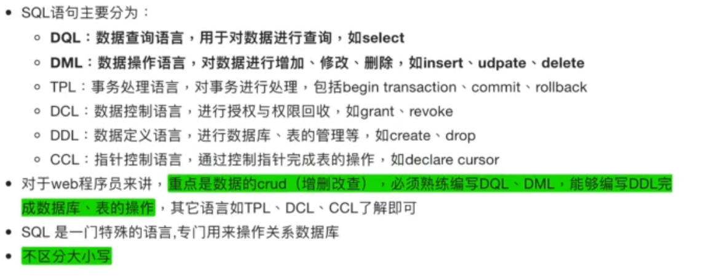
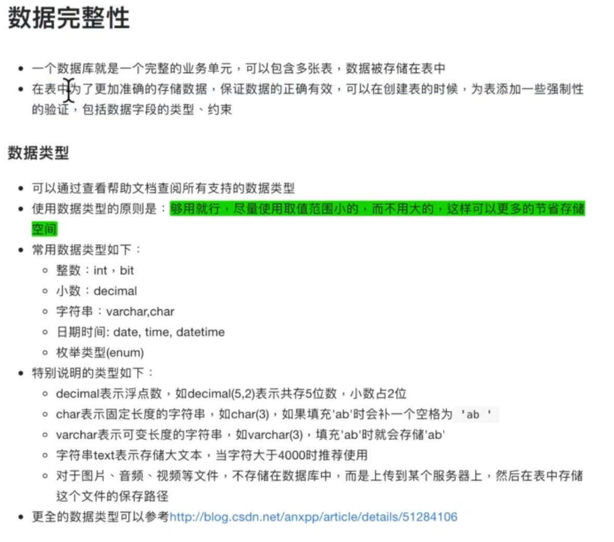
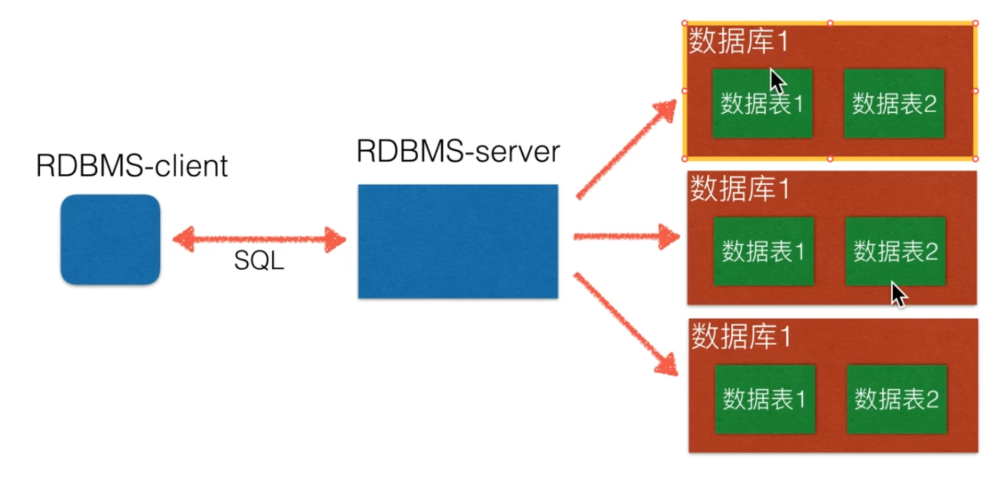
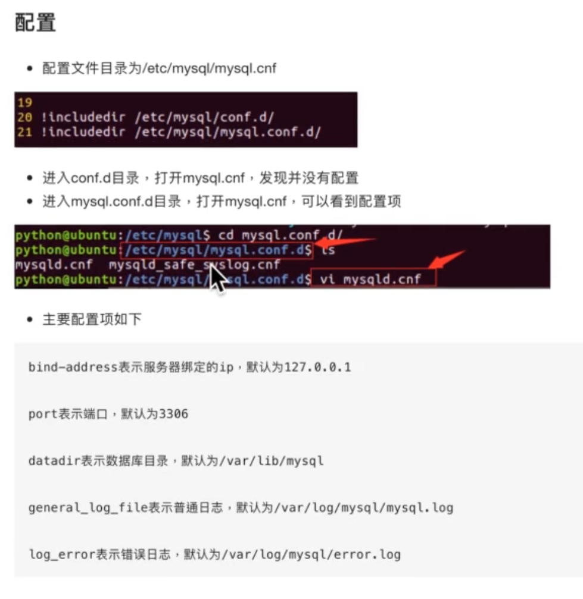
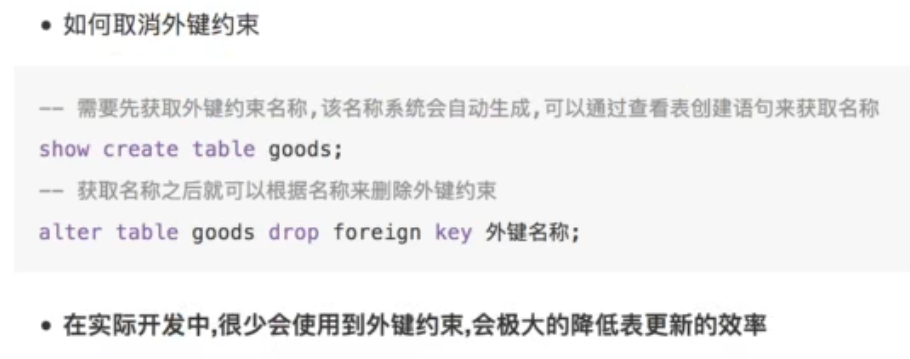

# MySQL数据库

以后我虚拟机安装的mysql，密码都是设置的这个：mysql -u root -p123456

打开mysql的日志：（这是docker里的mysql，先根据ubuntu里去装个vim，有些问题，就放这里吧，不去折腾日志了）

- vim /etc/mysql/conf.d/mysql.cof    主要是把这两行的注释打开，没有就添加，然后保存
  general_log_file = /var/log/mysql/mysql.log
  general_log = 1
- 重启mysql服务：service mysql restart
- 查看mysql的日志文件：tail -f /var/log/mysql/mysql.log

---

MariaDB教程：点击[这里](https://www.w3cschool.cn/mariadb/)


MySQL(先是被sun公司收购，后面sun又被Oracle收购)之父基于mysql的一个新分支做的MariaDB([简单介绍](https://mp.weixin.qq.com/s/QsK00KCPoIZQuUTIOaSW4g))，据说还可以。


还有不少人说后面将会是 [PostgreSQL](https://www.runoob.com/postgresql/postgresql-tutorial.html) 的天下，开发者把它念作 ==post-gress-Q-L==。

## 一、SQL|RDBMS介绍

### 1.1. 关系型数据库的主要产品

（1）oracle：在以前的大型项目中使用,银行,电信等项目；

（2）mysql：web时代使用最广泛的关系型数据库；

（3）ms sql server：在微软的项目中使用；

（4）sqlite：轻量级数据库﹐主要应用在移动平台。

### 1.2. SQL介绍



#### mysql数据类型及约束



**注：可以把文件以.sql结尾，里面是sql的语句去执行，前面两个减号就是注释;且不分大小写。**

### 1.3. RDBMS介绍

RDBMS：关系数据库管理系统，不同的数据库都可以通过它来管理，然后使用SQL语言来操作。



------


## 二、MySQL服务器、客户端安装及使用

### 2.1. 服务器安装

ubuntu安装：`sudo apt-get install mysql-server`

启动：`sudo service mysql start`

停止：`sudo service mysql stop`

重启：`sudo service mysql restart`

查看状态：`sudo mysql status`    # 同理可以使用 `sudo systemctl status mysql`,上面的命令也是同理

mysqladmin --version   可查看版本

---

看一个视频时，centos（mysql在centos7上开始收费，直接安装不行了，用的是mariadb，一个mysql的分支）（centos建议直接上docker）

安装是用的 yum -y install mysql mysql-server

安装完成后：mysqladmin -uroot password 123456     # 相当于初始化密码为13456

然后再用连接命令登录，输入上面设置的密码

==配置文件==：



ps:注意配置文件名字是mysqld.cnf，别自动tab补全整错了；

### 2.2. 客户端

安装完后，记得初始化密码：`sudo mysqladmin -uroot password 123456`  # 相当于初始化密码为13456（我以后自己虚拟机安装的密码都是这）

安装：`sudo apt-get install mysql-client`

连接命令：`sudo mysql -u root -p123456` 密码直接紧跟-p后面，不要有空格；或者-p回车后输入密码(就是mysql上面设置的123456)

ps：就自己的来说，`sudo mysql  -u root -p`,得是root用户登录，然后密码也是默认的root的密码。

---

Tips：如果是ubuntu安装的，要让其它IP连接使用，或者Navicat连接，还要进行设置：

​	在视频：".\就业班\14 天天生鲜Django项目\02-天天生鲜数据库设计\04_天天生鲜_连接远程数据库.flv"大概3:50的位置，就有讲解怎么用mac电脑去连接配置在ubuntu上的mysql，配置文件还有授权这些。

- mysql默认是root用户127.0.0.1本机访问的，所以要对其进行处理：

  - ```mysql
    -- 这就是只要是root用户，任何ip都能访问
    mysql -u root -p123456      -- 登录
    use mysql;                  -- 使用mysql自带的这个库
    select user,host from user; -- 从user表中查看user可以用来访问的ip
    update user set host='%' where user='root';  -- 把user为root的host改为%，表示允许root用户在所有IP上登录
    GRANT ALL PRIVILEGES ON *.* TO 'root'@'%' WITH GRANT OPTION;   -- 授权
    FLUSH PRIVILEGES;           -- 刷新政策
    ```

- 以上是用的root用户，当然也可以创建一个新的用户来分配权限：

  - 一个错误（有些教程里命令执行就会出这个错误）：MySQL 8.0.15版本，给用户分配访问权限提示 your MySQL server version for the right syntax to use near 'IDENTIFIED...；因为MySql 8.0.15以后没法使用`GRANT ALL PRIVILEGES ON *.* TO '用户名'@'一个ip地址' IDENTIFIED BY 'aabbccdd' WITH GRANT OPTION;`一行命令设置用户权限，必须分两步来实现设置用户权限【先创建用户、在对该用户分配用户权限】，如下：

  - ```mysql
    mysql -u root -p123456
    create user 'songhui'@'192.168.2.5' identified by 'aabbccdd';   -- 创建一个 songhui 用户，指定192.168.2.5地址才能访问，密码就是 aabbccdd
    GRANT ALL PRIVILEGES ON *.* TO 'songhui'@'192.168.2.5' WITH GRANT OPTION;  -- 分配权限
    FLUSH PRIVILEGES;
    ```

    注意：以上，就限定了只能用192.168.2.5来访问，要是想让任意ip都可以访问的，可以在在create和授权时，就把指定ip地址换成`%`，即=='songhui'@'%'==，其它地方不变；如果已经设定了要改的话，就==update mysql.user set host='%' where user='songhui';==,就是将名为mysql库中user表中的数据进行修改。

- 以上方法应该就是ok的，主要参考来自[这里](https://www.jianshu.com/p/ab02b8a5d0f1)；[这个](https://baijiahao.baidu.com/s?id=1715941459626773302&wfr=spider&for=pc)以及[这个](https://blog.csdn.net/hequnwang10/article/details/117135913)，后面这俩有些旧了，命令是有问题的，但是万一上面没搞定，一起来结合起来多试试。

以上只是解决的非本机访问的权限问题，针对ubuntu，还有一个问题，本机登录，一定是要加==sudo==，哪怕是mysql中的root账号，即sudo mysql -u root -p123456  (注意，这里的密码我都是默认的123456)，不加sudo，就一定报错，但是用Python来链接或者navicat是加不了sudo的，就一定报错，那么解决的办法是[这里](https://www.cnblogs.com/wlzx-dic/p/14068364.html)，参考[这里](https://blog.csdn.net/zkpython/article/details/107174656)。

---

为了生产环境直接使用，还是在centos上用docker吧,操作如下：

1. 拉取镜像：docker pull mysql
2. 创建容器：docker run -d --name=mysql -p 3306:3306 -e MYSQL_ROOT_PASSWORD=123456 --restart=always -w /opt mysql
   1. 一定要 -p的端口映射；
   2. -d 守护容器就行了，不要 -it ,然后后面也就不要跟 /bin/bash了；
   3. 一定要 -e MYSQL_ROOT_PASSWORD=123456 来指定mysql根用户的密码，用户名默认为root，没指定的话，会启动失败。
3. 进入容器并操作：
   1. docker exec -it mysql bash
   2. mysql -u root -p123456      # 注意-p和后面的密码不要空格

Tips：
	以上基本上已经可以使用Navicat了，如果还是在连接上有问题，考虑下是不是只能root本机访问，就按照上面的操作给root授权，或者创建一个新用户授权也是可以。

## 三、MySQL简单使用

**-- 后面要有一个空格，才能是注释**，下面的部分是为了高亮显示，所以没跟空格

### 3.1. 基本信息

连接上数据库后

```mysql
--查看所有数据库
show databases;      -- 注意结尾要有分号

--显示时间              -- 查看版本
select now();          select version();
```

### 3.2. 创建、查看、删除、使用数据库

```mysql
--创建数据库
create database python123 charset=utf8;    -- 创建一个名为Python123的数据库,且指定编码格式；这里指定了格式，默认用的latin1，是不支持中文的

--查看数据库创建过程
show create database python123;  -- 注意后面不能跟其它的了

--删除数据库
drop database python123;     -- 若数据库名里有-，如Python-1， 那么删除时整个名称需要用``包起来,慎用

--使用数据库             --查看当前数据库
use python123;          select database();
```

### 3.3. 创建表

数据表的操作(建立在选中数据库后)

```mysql
--查看当前数据库中所有表             --查看一张表       --删除一张表
show tables;			          desc 表名;         drop table 表名;
--把一张表(areas)查询的结果存成一张新表(province)
create table province select * from areas where level=1;  
```

```mysql
--创建表：
create table  数据表名字(字段 类型 约束 [, 字段 类型 约束]);     -- 注意结尾的分号

-- 例如：
create table xxxxx(id int unsigned, name varchar(30));  -- unsigned代表无符号，可以不要
create table yyyyy(id int primary key not null auto_increment, name varchar(30));   -- 可以多个约束，且不论顺序，注意最后一个字段不能跟逗号
create table students(
	    id int unsigned not null auto_increment primary key,
    	name varchar(30),
    	age tinyint unsigned default 0,       -- 更小的整形， 默认值0
    	high decimal(5, 2),                   -- 5位数，其中2位是小数
    	gender enum("男", "女", "中性") default "保密"        -- 最后的一定不要逗号，enum是枚举数据类型
);                
--说明
（1）-- auto_increment 表示自动增长;
（2）-- not null 表示不能为空;
（3）-- primary key 表示主键;
（4）-- default 默认值。

--查看数据表的创建
show create table 表名;
-- 得到的结果里面发现有InnoDB引擎（之外还有一个MyISAM）,主要差别就是InnoDB支持事务处理与外键和行级锁

--删除数据表
drop table 表名;
drop table students;    -- 尽量不使用删除
```

注意：一定看下[这里](#4.7. 自关联)，创建表的时候，很多地方会把表明、字段加一个 `` ，这好像不是强制的。

### 3.4. 修改表结构

```mysql
--添加字段
alter table 表名 add 列名 类型；
alter table students add birthday datetime DEFAULT NULL COMMENT '源文件对应的txt文件的绝对路径';  -- 后面还可以添加这个字段的注释`COMMENT`
-- 添加字段的时候，官方的要加一个`column`,比如加一个`textRankKeys`字段：
-- alter table exam_questions_info add columns textRankKeys varchar(255) DEFAULT NULL COMMENT '这里写对字段的解释';

--修改字段类型(注意是 modify)
alter table 表名 modify birthday date;
alter table students modify birthday date;   -- 这里就是注意类型，上面的datetime精确到时分秒去了，生日所以要改成date

--修改字段(重命名,注意是 change)
alter table 表名 change 原名 新名 类型 约束;
alter table students change birthday birth date default "1997-01-01" ;          ps：原来所有的约束一定要
-- 这就是把birthday这个字段改名了，类型也从datetime改成date，还加了默认值

--删除字段
alter table 表名 drop 列名;
alter table students drop high;
```

ps:change后面是可以跟多个字段的修改的，整段用逗号隔开就好了。

### 3.5. 增删改查(curd)

-- 插入数据前先 desc 表名; 看一下结构，插入的顺序格式一定要跟定义的表的顺序一致。

注：下面用到的表students数据是上面创建的，

#### 3.5.1 插入

ps：全列插入的时候，必须都要给值，有默认值的地方不想给值的话也必须要给一个==default== 

```mysql
--全列插入                   ps：这必须要把有默认值的列也要给值，因为这是全列插入
insert into 表名 values(......);
insert into classes values(0, "python03");
insert into students values(0, "小李飞刀", 20, "女", 1, "1990-01-01");      ps:date need  "" 
-- ps：主键可以用0、null、default来代替，代表自动增长
insert into students values(0, "小李飞刀", 20, 2, 1, "1990-01-01");
-- ps：性别那里是枚举数据，可用对应的数字代替，从1开始

--多行全部插入：
insert into students values(0, "小李飞刀", 20, "女", 1, "1990-01-01")，(default, "小张飞刀", 21, 1, 10, "1990-01-01");


--部分插入                  ps：部分插入就不能给完，与上面的形成了对比。
insert into 表名（列1，......）values（值1, ......）;
insert into students (name, gender) values ("小乔", 2)；  -- 单行插入
insert into students (name, gender) values ("小乔", 2), ("大乔", 1)；   -- 多行插入; ps：这里的1、2是因为这里是枚举数据，用数字来代替了
```

ps: `insert into (name) select cate_name from goods group by cate_name;`

注意就是在插入的时候，这种有时候不能要 values ，否则会报错，也不知道为什么

```mysql
--有时我们要把查询的结果保存到新表里，创建新表，查询，插入显得十分麻烦，其实直接可以搞定。
--例如把表2的查询结果插入表1： 
	--如果表存在：
	insert into tab1 select * from tab2;
	
	--如果表不存在：
	create table tab1 as select * from tab2;
```

#### 3.5.2 修改

```mysql
update 表名 set 列1=值1，列2=值2，...... where 条件;
update students set gender=1;       -- 这就是把性别全部修改成男了
update students set gender=2 where name="小李飞刀";     -- 只要name是小李飞刀的全部修改(可以存在几个小李飞刀的)
select * from cms.collection_item where type='course';  # 注意英文字段也一定要加一下引号
update students set age=22, gender=3 where id=3;     -- 只要id为3的就修改 
```

##### 同步表数据

```mysql
update goods goods as g inner join goods_cates as c on g.cate_name=c.name set g.cate_name=c.id;  -- 找到两张表名字相同的，把另外一张表的id set过来
-- 这是在set前面加了一个sql语句，两个表查询结果，然后主体还是update .. set
```

ps:注意这样修改后，还是把这张表的这个字段改名和另外那张表的字段一样，然后把类型，约束也改成一样的，以防以后出错。

##### 外键约束




#### 3.5.3 查询

```mysql
--全部查询
select * from students;    -- 数据量很大时，不建议这么做，会把内存撑爆

--指定条件查询
select * from students where name="小李飞刀";
select * from students where id>3;

--查询指定列
select name, gender from students;
--也可以使用as为列或表指定别名，同时还可以修改顺序
select name as 姓名, gender as 性别 from students；
select gender as 性别, name as 姓名 from students；
```

#### 3.5.4 删除

```mysql
--物理删除
delete from 表名 where 条件；
delete from students;            --  整个数据表中的数据全部删除，慎用
delete from students where name='小李飞刀';

--逻辑删除  -- 用一个字段来表示这条信息已经不能再使用了
alter table students add is_delete bit defaule 0;    -- bit就是类型，放0和1
update students set is_delete=1 where id=6;          -- 这就是逻辑删除id=6的数据，可通过查询来看
```

## 四、MySQL进阶查询

数据的准备：

```mysql
--创个数据库
create databes "python-test" charset=utf8;
--创建表
create table students(
	    id int unsigned not null auto_increment primary key,
    	name varchar(30) default '',
    	age tinyint unsigned default 0,       
    	height decimal(5, 2),                  
    	gender enum("男", "女", "中性"),          
     	 cls_id int unsigned default 0,
    	is_delete bit default 0
);     

create table classes(
		id int unsigned primary key,
    	cls_name varchar(30)
);

--准备数据
insert into students values
	(0, "小明", 18, 180.00, 2, 1, 0),
	(0, "小月月", 18, 180.00, 2, 2, 1),
	(0, "彭于晏", 29, 185.00, 1, 1, 0),
	(0, "刘德华", 59, 175.00, 1, 2, 1),
	(0, "黄蓉", 38, 160.00, 2, 1, 0),
	(0, "凤姐", 28, 150.00, 3, 2, 1),
	(0, "王祖贤", 18, 172.00, 2, 1, 1),
	(0, "周杰伦", 36, NULL, 1, 1, 0),
	(0, "程坤", 28, 181.00, 1, 2, 0),
	(0, "刘亦菲", 25, 166.00, 2, 2, 0),
	(0, "金星", 33, 162.00, 3, 3, 1),
	(0, "静香", 12, 180.88, 2, 4, 0),
	(0, "郭靖", 12, 170.00, 1, 4, 0),
	(0, "周杰", 34, 176.00, 2, 5, 0);
	
insert into classes values
	(0, "Python01期"),
	(0, "Python02期"),
	(0, "Python03期");
```

### 4.1. 条件查询

#### 4.1.1 消除重复行

```mysql
--distibct 字段
select distinct gender from students;    -- 性别就那两种，肯定要去重啊
```

#### 4.1.2 条件查询

```mysql
--比较运算符
>   <   >=   <=   =   !=

--逻辑运算符
and   or   not 
select * from students where age>18 and age<28;       -- not的时候注意括号就行了


--模糊查询
like查询： % 来替换一个或者多个     -- 这个效率低，要一个个去对比
	-- 以小开头
	select name from students where name like "小%";
	--含有小的所有名字
	select name from students where name like "%小%";

_  来替换一个   （这是一个短下划线）
	--查询只有2个字的名字
	select name from students where name like "__";
	--查询至少有2个字的名字
	select name from students where name like "__%";


rlike正则
	--查询以周开头的姓名
	select name from students where name rlike "^周.*";
	--查询以周开始、伦结尾的姓名
	select name from students where name rlike "^周.*伦$";
```

#### 4.1.3 范围查询

```mysql
--不在非连续的范围内
	--not in 
	select name, age from students where age not in (12, 18, 34);

--在一个连续的范围内
	--between ... and ... 
	--查询 年龄在18到34之间的信息
	select name, age from students where age between 18 and 34;

--不在一个连续的范围内
	--not between ... and ...      ps：not between  是一个整体，所以这俩不能被括号分开
	select * from students where age not between 18 and 34;

--判断空
	--is Null
	select * from students where height is 	NULL;
--判断非空  
	--is not null
	select * from students where height is not null;
```

### 4.2. 排序

```mysql
--order by    -- 单个条件
--asc从小到大升序排列
--desc从大到小降序排列	
	--查询年龄在18到34岁之间的男性，年龄按从小到大排序
	select * from students where (age between 18 and 34) and gender=1;   -- 普通查询
	select * from students where (age between 18 and 34) and gender=1 order by age;   -- 默认后面就是asc
	select * from students where (age between 18 and 34) and gender=1 order by age asc;   -- 两个是一样的
	--查询年龄在18到34之间的女性，身高从高到矮排序
	select * from students where (age between 18 and 34) and gender=2 order by height desc;

--order by   -- 多个条件
	--查询年龄在18到34岁之间的女性，身高从高到矮排序，如果身高相同的情况下按照年龄从小到大排序,再相同就按ID从小到大
	select * from students where (age between 18 and 34) and gender=2 order by height desc, age asc,  id desc;         --只是想说有多少条件，就写后面，前一个相同的就按照后一个排
	--按照年龄从小到大、身高从高矮的排序
	select * from students order by age asc, height desc;
```

### 4.3. 聚合

```mysql
--计数
	--count
	select * from students where gender=1;
	select count(*) from students where gender=1;
	select count(*) as 男性人数 from students where gender=1;
	select count(*) as 女性人数 from students where gender=2;

--max 最大值
--min 最小值
--sum 求和
--avg 平均值

--四舍五入，保留1位小数
	--round(123.235, 1)  
	--计算所有人的平均年龄，保留两位小数
	select round(sum(age)/count(*), 2) from students;     -- 所以表达式是可以嵌套的
```

### 4.4. 分组

通常和聚合一起用，不然没啥意义

用来分组的，都是那种带统计性的，比如gender等，name好像就不行；；好像是用哪个分组，前面select就用哪个

```mysql
--group by
	--按照性别分组，查询所有的性别
	-- select name from students group by gender;   -- 这是不正确的，组就那么两个，名字却很多；
	-- select * from students group by gender;    -- 这个也是错的
	select gender from stundents group by gender;
	select gender, group_concat(name) from students group by gender;   -- group_concat()  是用来显示组里内容的

--计算每种性别中的人数
select gender, count(*) from students group by gender;   -- 有点先分组了再聚合函数来算的

--计算男性人数
select gender, count(*) from students where gender=1 group by gender;  -- 注意把条件放前面
select gender, group_concat(name, age, id) from students where gender=1 group by gender;
select gender, group_concat(name, "_", age, "_", id) from students where gender=1 group by gender;      -- group_concat里面都是随便给字符串的

--对分组数据进行条件筛选
	--having     -- ps:位置是在group by 之后，where是在之前
	--查询平均年龄超过30岁的性别，以及姓名 
	select gender, group_concat(name) , avg(age) from students group by gender having avg(age)>30;
	--查询每种性别中的人数多于2个的信息
	select gender, group_concat(name) from students group by gender having count(*)>2;
```

### 4.5. 分页

```mysql
-- limit start, n     -- 从编号start开始，显示n个
	--限制显示查询出来的数据个数
	select * from students where gender=1 limit 2;   -- 这就是只显示2个
	
	--每页显示3个，第1个页面
	select * from students limit 0, 3;
	--每页显示3个，第2个页面
	select * from students limit 3, 3;
	--每页显示3个，第3个页面
	select * from students limit 6, 3;
	--每页显示3个，第4个页面
	select * from students limit 9, 3;     
	-- 规律就是---> limit (第n页 - 1）* 每页的个数，每页的个数;但是这里是不能放公式，是错的
    
    --每页显示2个，显示第2页信息，按照年龄从小到大排序
    select * from students order by age asc limit 3, 3;    -- ps:特别注意，limit只能放到最后，不能放到order by 前
     --女性按身高从高到低排序，并只显示两个
     select * from students where gender=2 order by height desc limit 0, 2;
```

### 4.6. 连接查询

当查询结果的列来源于多张表时，需要将多张表连接成一个大的数据集，再选择合适的列返回

#### 4.6.1 内连接查询

查询的结果为两个表匹配到的数据（有点两个表取交集的意思）

```mysql
--inner join ... on
	-- 1这发现查询出来的结果很多，这就是把student里的每条数据都跟classes的每天数据组合了一次
	select * from students inner join classes;
	-- 2由上改进---> 查询有能够对应班级的学生及班级信息
	select * from students inner join classes on students.cls_id=classes.id;  -- 注意后面的条件，匹配得上的才会显示出来；
	-- 3由上改进，显示的表里有表示一样的内容，因为 * 全显示了，可以只显示想要的
	selecr students.*, classes.name from students inner join classes on students.cls_id=classes.id;
	-- 4还可以给表取别名
	select s.name, c.name from students as s inner join classes as c on s.cls_id=c.id;
	-- 由上改进，有能够对应班级的学生以及班级信息，按照班级排序，同一个班级的则按照id进行从小到大排序
	select c.name, s.* from students as s inner join calsses as c on s.cls_id=c.id order by c.name, s.id;      -- 4就是发现没有排序，所以可以用 order by 排序一下，且条件可以是来自两个表；；selsect后面的顺序也可以变
```

#### 4.6.2 左连接查询

以左边的表为基准

```mysql
--left join ... on
	--查询每位学生对应的班级信息
	select  * from students as s left join classes as c on s.cls_id=c.id;     -- 会发现这比上面的内连接最后面多了几行，以 left join左边的表为准，查到的就显示，没查到的就是null
	--查询没有的对应班级信息的学生
	select * from students as s left join classes as c on s.cls_id=c.id having c.id is null;
	select * from students as s left join classes as c on s.cls_id=c.id where c.id is null;
	-- 这里是把查询出来的结果当做一张表，然后来筛选，会发现这俩结果是一样，但是我们还是记忆原表条件用 where，查询出来的新表的结果筛选用 having，所以这里还是用having，统一起来
```

==多张表连接查询==:
	`select a.*, b.*, c.* from a left join b on a.userid=b.idx left join c on b.nameIdx=c.idx having 任何筛选条件`

ps: 相当于第一个left join 得到了a、b两张表的结果，然后再把这结果去left join表c，最后的筛选条件，可以是a、b、c表中的任意字段去筛选。

#### 4.6.3 右连接查询

以右边的表为基准

``` mysql
--right join ... on
--但是一般都是将表互换位置，用 left join 就完成了
```

### 4.7. 自关联

​	例子：一张表是省、一张是市、一张是县，这样查起来不方便，于是可以把这3张表的内容放到一张表里，做 自关联。

创建表：

```mysql
CREATE TABLE `areas` (
  `district_id` smallint(5) unsigned NOT NULL AUTO_INCREMENT COMMENT '自增id',
  `pid` smallint(5) unsigned NOT NULL DEFAULT '0' COMMENT '父及关系',
  `district` varchar(120) NOT NULL DEFAULT '' COMMENT '地区名称',
  `level` tinyint(1) NOT NULL COMMENT '子属关系',
  PRIMARY KEY (`district_id`),
  KEY `parent_id` (`pid`),
  KEY `region_type` (`level`)
) ENGINE=MyISAM AUTO_INCREMENT=3432 DEFAULT CHARSET=utf8 COMMENT='地区表';
```

​	从sql文件导入数据：（后面要跟areas.sql这个文件的绝对路径，然后也要先把上面的表创建好先,当然也可以把上面建表的命令复制到.sql文件的最前面，然后直接source就行。）

```mysql
source areas.sql;
```

```mysql
-- 查询各个省下有哪些城市：
select * from areas as province inner join areas as city on province.district_id=city.pid;

-- 查询具体一个省里的市
select * from areas as province inner join areas as city on province.district_id=city.pid having province.district_id=(select district_id from areas where district="四川省");  -- 这里就是把一张表当做两张表来使用
-- 把上面的四川省，改成 “广安” 就能看到广安下具体的县城
```

一个注意点：

- source areas.sql; 这要是在mysql自带的客户端执行的，然后自带客户端查数据，中文就是正常的，可是用Python或Navicat查看，中文就是乱码的；
- 相反，如果这是用Navicat或Python执行的，这俩查询的数据就是正常的，用mysql自己的客户端查询就是乱码的。

### 4.8. 子查询

​	即把一个select语句嵌套在另外一个select语句中，就在上面一个已经有体现。

## 五、MySQL高级

### 5.1. 视图

​	通俗讲，视图就是一条SELECT语句执行后返回的结果集，视图就是可能几张表的查询结果，就是一张表(是一个虚拟的表)，不存具体的数据（而且很重要的是，**查询的基本表的数据发生改变，视图也会跟着改变**）。

​	也就是说实际开发中，代码写好后，就搞个视图，写好的sql语句就查试图中的数据，哪怕实际的表数据发生了变化，也不用去改sql语句，就很方便。（这是我的理解，还不很确定）


定义视图， 建议以v_开头：`create view 视图名称 as select 语句;`

查看视图：`show tables;`   查看表也会把所有的视图列出来

使用视图：`select * from v_stu_score;`

删除视图：`drop view 视图名称;`

### 5.2. 事务

​	事务四大特性（简称ACID）即：原子性、一致性、隔离性(一个事务所做的修改最终提交以前，对其他事务是不可见的)、持久性(一旦事务提交，则所做的修改会永久保存到数据库)。（python操作时是默认开启事务的）

表的引擎类型必须是innodb类型才可以使用事务，这是mysql表的默认引擎

​	开启事务命令

```mysql
begin;  或者  start transaction;       # 可以大写，是不区分的
```

对于linux来说，输入一个sql语句，就默认帮我们提交了，这开启后，就可以多输入多个sql语句，变更会维护到本地缓存中

​	提交事务命令

```mysql
commit;
```

这就会把缓存中的数据变更维护到物理表中。

​	回滚事务命令

```mysql
rollback;
```

可以进行多次数据的修改，若果成功一起成功，否则就会回滚到之前的数据。

 - 还可以在开启事务后设置多个回滚点，在rollback时，可以不回到最开始，而是回到指定回滚点：
   设置回滚点命令：savepoint my_s1;      # 后面my_s1跟的是自己起的名字，相当于做个标记点
   回滚到指定回滚点：rollback to my_s1;
   删除某一个保存的回滚点：release savepoint my_s1；

### 5.3. 索引

​	简介：索引是一种特殊的文件(innoDB),它们包含着对数据表里所有记录的引用指针，更简单的说就好比是一本书的目录。

创建测试表testindex

`create  table test_index(title varchar(10));`

使用python加向表中加入十万条数据

```python
import pymysql
def main():
    conne = pymysql.connect(host='localhost', port=3306, user='root', passwd='nainjiu_123', charset='utf8')
    cursor = conne.cursor()
    try:
        for i in range(100000):
            cursor.execute("insert into test_index values('haha-{}')".format(i))
        conne.commit()
    except:
        conne.rollback()
    conne.close()
```


查询

```mysql
开启运行时间监测：
set profiling=1;

查找第1万条数据ha-99999
select * from test_index where title='ha-99999';

查看执行的时间
show profiles;

为表title_index的title创建索引
create index title_index on test_index(title(10));
再执行一下上面的语句
select * from test_index where title='ha-99999';
再次查看执行的时间
show profiles;
```

会看到创建索引的时间会短很多。

B-Tree  这种数据结构来的


查看索引

`show index from 表名;`

创建索引，

如果指定的字段是字符串，需指定长度，建议长度与定义字段时的长度一致；如果是int类型，可以不填写长度

`create index 索引名称 on 表名(字段名称(长度));`

删除索引

`drop index 索引名称 on 表名;`


一般数据量很大时才会建立索引，不然太多的索引会影响更新和插入的速度，也还会占用磁盘空间

## 六、pymysql的使用

具体用的时候可看[这里](https://www.w3school.com.cn/python/python_mysql_insert.asp)的一些简单示例。

假设有这些配置信息：

​	这俩都是同一个主机下的mysql，db只是比db少指定了具体要使用的数据库的名称，都是可以使用的，只是在写具体的sql语句时，前者要把使用的数据名称带上.表名，后者可以直接使用 表名

```python
db = dict(
    host='192.168.108.210',
    port=3318,
    user='root',
    passwd='Mysql@123456',
    charset='utf8'
)
fms_db = dict(
    host='192.168.108.210',
    port=3318,
    user='root',
    passwd='Mysql@123456',   # 密码一定要是字符串，特别是'123456'这样的密码，不能直接给int
    database='fms',
    charset='utf8'
)
```

第一步：连接mysql获取游标：

```python
import pymysql
# address就是上面的配置字典
dbconnect = pymysql.connect(
    host=fms_db['host'],
    port=fms_db['port'],
    user=fms_db['user'],
    passwd=fms_db['passwd'],
    database=fms_db['database'],   # 库这个不是必须的，没指定的话，后续使用表时就要加库名
    charset=fms_db['charset']
    )
cursor = dbconnect.cursor()  #获取游标
```

第二步：单条更新：（==一定用这种方式，不要自己去format拼接，可能会有问题，又能一定程度避免sql注入==）

```python
"查询："
district_id = 26
query_sql = "select district_id, district, level from province where district_id=%s;"
cursor.execute(query_sql, (district_id, ))  # 注意一定用元组，特别单个数据时
insert_data = cursor.fetchone()

"修改："
insert_sql = "insert into collection values(default, %s, %s, %s);"
try:
	cursor.execute(insert_sql, insert_data)  # 这个其实有返回值的，成功后会返回1
	# cursor.execute(insert_sql, (insert_data[0], insert_data[1], insert_data[2]))
	dbconnect.commit()   # 一定是链接来commit
except Exception as ex:
    print(traceback.format_exc())
    dbconnect.rollback()  # 执行错误就回滚
finally:
    if cursor:
        cursor.close()
    if dbconnect:
        dbconnect.close()
```

注意：

- 上面这个自己去.format拼接的话，执行的sql语句就会是：
  insert_sql = "insert into collection values(default, 22, 四川省, 1);"   # 这个语句一定会执行失败，因为==四川省==这个字符串没加引号，正确的语句应该是：
  insert_sql = "insert into collection values(default, 22, '四川省', 1);"  # 故一定要用上面的方式来执行sql

- 这是以前写的：这里format格式的东西如果是字符串，然后在那里面的  {}  我都是加了单引号 '' 的，不然可能会执行失败(是有前车之鉴的，所以一定要不要自己去拼接，保不齐那里就有问题)：

  ```python
  update_sql = r"update fms_info set fileKeyWord='{}', fileAbstract='{}', saveTxtPath='{}' where fmsIdx='{}';".format(keyword, abstract, txt_abspath, idx)
  try:
      cursor.execute(update_sql)  
      conn.commit()      # 因为是修改，所以要去cmimit(注意是conn)，查询就不用了
  except Exception as ex:
      print(traceback.format_exc())
      conn.rollback()  # 执行错误就回滚
  finally:
      if cursor:
          cursor.close()
  ```

==多条一起更新(update)或插入(insert)==：

```python
datas = (('板层,判断题', 2, '13650'), ('较易,间距', 3, '13970'))
sql = r"update exam_info set textRankKeys=(%s), category=(%s) where questionIdx=(%s)"
# 同时更新多个字段时，注意那个 , 别忘了
try:
    cursor.executemany(sql, datas)
    conn.commit()  # 一定是链接conn来commit,绝对不要写成了cursor
except Exception as ex: 
    print(traceback.format_exc())
    conn.rollback()  # 执行错误就回滚
finally:
    if cursor:
        cursor.close()
    if conn:
        conn.close()
```

### sql注入

​	简单来说，用Python写sql执行语句时，尽量不要用 a_str.format() 这种方式去自己拼接字符串，而是让系统自己去，自己把要格式化的参数写成一个列表，简单如上面写的很清楚了，用这种方式：

cursor.execute(query_sql, (district_id, )) 


